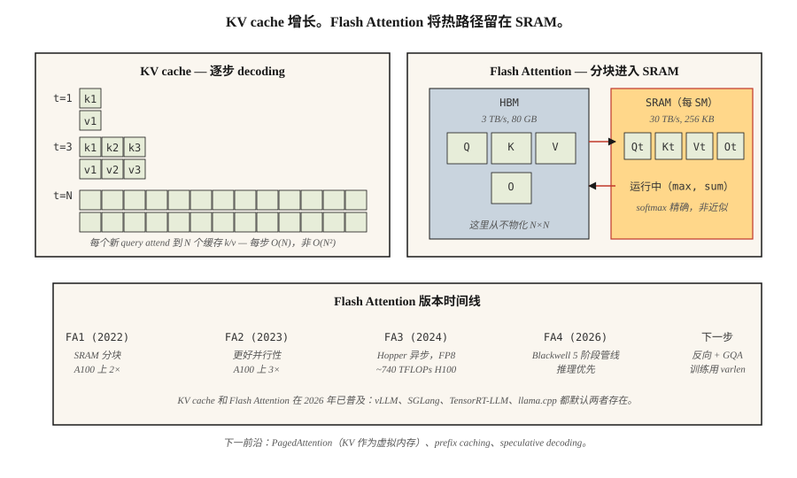

# KV Cache, Flash Attention 与推理优化

> 训练是并行且受 FLOP 限制的。推理是串行且受内存带宽限制的。瓶颈不同，技巧也不同。

**Type:** Build
**Languages:** Python
**先修要求：** Phase 7 · 02 (Self-Attention), Phase 7 · 05 (Full Transformer), Phase 7 · 07 (GPT)
**Time:** ~75 minutes

## 问题

一个朴素的自回归 decoder 生成 `N` 个 tokens 需要做 `O(N²)` 工作：每一步都会在完整前缀上重新计算 attention。对于一个 4K-token 的响应，这意味着 16M 次 attention 运算，其中大多数都是冗余的。前缀 token 的每个 hidden state 一旦计算出来就是确定的——你只需要让新 token 的 query 去和此前所有 token 缓存下来的 keys 与 values 做计算。

除此之外，attention 本身也会搬运大量数据。标准 attention 会物化一个 N×N score matrix、N×d softmax output、N×d final output——对 HBM 的读写次数太多。对于 N≥2K，attention 会先成为 memory-bound，而不是 FLOP-bound。经典 attention kernel 对现代 GPU 的利用率低了 4–10×。

Dao et al. 提出的两个优化，把前沿推理从“慢”推到了“快”：

1. **KV cache。** 存储每个前缀 token 的 K 和 V vectors。每个新 token 的 attention 都是一个 query 对缓存 keys 的计算。推理从每个 generation step 的 `O(N²)` 降到 `O(N)`。
2. **Flash Attention。** 对 attention 计算做 tiling，使完整的 N×N matrix 永远不会进入 HBM。所有 softmax + matmul 都在 SRAM 中完成。在 A100 上 wall-clock speedup 为 2–4×；在支持 FP8 的 H100 上为 5–10×。

到 2026 年，两者都已经是通用配置。每个生产级推理栈（vLLM、TensorRT-LLM、SGLang、llama.cpp）都默认假设它们存在。每个前沿模型发布时都会启用 Flash Attention。

## 核心概念



### KV cache math

每个 decoder layer、每个 token、每个 head：

```
bytes_per_token_per_layer = 2 * d_head * dtype_size
                          ^
                          K and V
```

对于一个 7B 模型，32 层、32 个 heads、d_head=128、fp16：

```
per token per layer = 2 * 128 * 2 = 512 bytes
per token (32 layers) = 16 KB
per 32K context = 512 MB
```

对于 Llama 3 70B（80 层、d_head=128、使用 8 个 KV heads 的 GQA）：

```
per token per layer = 2 * 8 * 128 * 2 = 4096 bytes (4 KB)
per 32K context = 10.4 GB
```

这 10 GB 就是为什么 Llama 3 70B 在 128K context 下，仅 batch size 1 的 KV cache 就会占掉一张 40 GB A100 的大部分显存。

**GQA 是 KV-cache 的关键收益。** 使用 64 heads 的 MHA 会需要 32 GB。MLA 还能进一步压缩。

### Flash Attention — tiling 技巧

标准 attention：

```
S = Q @ K^T          (HBM read, N×N, HBM write)
P = softmax(S)       (HBM read, HBM write)
O = P @ V            (HBM read, HBM write)
```

三次 HBM 往返。在 H100 上，HBM 带宽是 3 TB/s；SRAM 是 30 TB/s。相比把所有内容保留在芯片上，每一次 HBM 往返都会带来约 10 倍的减速。

Flash Attention：

```
for each block of Q (tile size ~128 × 128):
    load Q_tile into SRAM
    for each block of K, V:
        load K_tile, V_tile into SRAM
        compute S_tile = Q_tile @ K_tile^T     (SRAM)
        running softmax aggregation             (SRAM)
        accumulate into O_tile                  (SRAM)
    write O_tile to HBM
```

每个 tile 只需要一次 HBM 往返。总内存占用从 `O(N²)` 降到 `O(N)`。Backward pass 会从 forward pass 中重新计算部分值，而不是把它们都存下来——这是另一项内存收益。

**数值技巧。** Running softmax 在 tiles 之间维护 `(max, sum)`，因此最终归一化是精确的。这不是近似——Flash Attention 计算出的输出与标准 attention bit-identical（除 fp16 非结合性带来的差异外）。

**版本演进：**

| Version | Year | Key change | Speedup on reference hardware |
|---------|------|-----------|-------------------------------|
| Flash 1 | 2022 | Tiled SRAM kernel | A100 上 2× |
| Flash 2 | 2023 | 更好的并行性，causal-first ordering | A100 上 3× |
| Flash 3 | 2024 | Hopper asynchrony、FP8 | H100 上 1.5–2×（~740 TFLOPs FP16） |
| Flash 4 | 2026 | Blackwell 5-stage pipeline、software exp2 | Inference-first（最初仅 forward） |

Flash 4 发布时只支持 forward-pass。训练仍然使用 Flash 3。Flash 4 的 GQA 和 varlen 支持仍在等待中（2026 年中）。

### Speculative decoding — 另一个延迟优化

廉价模型提出 N 个 tokens。大模型并行验证全部 N 个 tokens。如果验证接受 k 个 tokens，你就用 1 次大模型 forward pass 换来了 k 次生成。对于代码和散文，典型 k=3–5。

2026 年默认做法：
- **EAGLE 2 / Medusa。** 集成式 draft heads，共享 verifier 的 hidden states。2–3× speedup，且无质量损失。
- **Speculative decoding with draft model。** 在消费级硬件上有 2–4× speedup。
- **Lookahead decoding。** Jacobi iteration；不需要 draft model。小众但免费。

### Continuous batching

经典 batched inference：等待最慢的 sequence 结束，然后启动一个新 batch。当短响应提前结束时，会浪费 GPU。

Continuous batching（最早在 Orca 中发布，如今用于 vLLM、TensorRT-LLM、SGLang）：旧请求一完成，就把新请求换入 batch。对于典型聊天工作负载，吞吐量提升 5–10×。

### PagedAttention — 把 KV cache 当作虚拟内存

vLLM 的核心卖点。KV cache 以 16-token blocks 分配；page table 将逻辑位置映射到物理 blocks。它可以在并行采样之间共享 KV（beam search、parallel sampling）、为 prompt caching 热切换前缀，并对内存做碎片整理。相比朴素的连续分配，吞吐量提升 4×。

## 构建它

见 `code/main.py`。我们实现：

1. 一个朴素的 `O(N²)` incremental decoder。
2. 一个 `O(N)` KV-cached decoder。
3. 一个模拟 Flash Attention running-max algorithm 的 tiled softmax。

### 步骤 1： KV cache

```python
class KVCache:
    def __init__(self, n_layers, n_heads, d_head):
        self.K = [[[] for _ in range(n_heads)] for _ in range(n_layers)]
        self.V = [[[] for _ in range(n_heads)] for _ in range(n_layers)]

    def append(self, layer, head, k, v):
        self.K[layer][head].append(k)
        self.V[layer][head].append(v)

    def read(self, layer, head):
        return self.K[layer][head], self.V[layer][head]
```

很简单：在每层、每个 head 的列表中，持续追加每个 token 的 K、V vectors。

### 步骤 2： tiled softmax

```python
def tiled_softmax_dot(q, K, V, tile=4):
    """Flash-attention-style softmax(qK^T)V with running max/sum."""
    m = float("-inf")
    s = 0.0
    out = [0.0] * len(V[0])
    for start in range(0, len(K), tile):
        k_block = K[start:start + tile]
        v_block = V[start:start + tile]
        scores = [sum(qi * ki for qi, ki in zip(q, k)) for k in k_block]
        new_m = max(m, *scores)
        exp_old = math.exp(m - new_m) if m != float("-inf") else 0.0
        exp_new = [math.exp(sc - new_m) for sc in scores]
        s = s * exp_old + sum(exp_new)
        for j in range(len(out)):
            out[j] = out[j] * exp_old + sum(e * v[j] for e, v in zip(exp_new, v_block))
        m = new_m
    return [o / s for o in out]
```

输出与一次性计算 `softmax(qK) V` bit-identical，但任意时刻的 working set 都只是一个 `tile × d_head` block，而不是完整的 `N × d_head`。

### 步骤 3： 在 100-token generation 上比较 naive vs cached decoding

统计 attention 操作数。Naive：`O(N²)` = 5050。Cached：`O(N)` = 100。代码会打印二者。

## 使用它

```python
# HuggingFace transformers auto-enables KV cache on decoder-only generate().
from transformers import AutoModelForCausalLM
model = AutoModelForCausalLM.from_pretrained(
    "meta-llama/Llama-3.2-3B",
    attn_implementation="flash_attention_2",  # use FA3 if Hopper
    torch_dtype="bfloat16",
)
# generate() uses KV cache automatically
```

vLLM 生产部署：

```bash
pip install vllm
vllm serve meta-llama/Llama-3.1-70B-Instruct \
    --tensor-parallel-size 4 \
    --max-model-len 32768 \
    --enable-prefix-caching \
    --kv-cache-dtype fp8
```

跨请求的 prefix caching 是 2026 年的重要收益——相同的 system prompt、few-shot examples，或长 context document 都能在多次调用之间复用 KV。对于反复使用 tool prompts 的 agent 工作负载，prefix caching 通常能带来 5× 吞吐量提升。

## 交付它

见 `outputs/skill-inference-optimizer.md`。这个 skill 会为新的推理部署选择 attention implementation、KV cache strategy、quantization 和 speculative decoding。

## 练习

1. **Easy.** 运行 `code/main.py`。确认 naive 和 cached decoders 产生相同输出；注意 op-count 的差异。
2. **Medium.** 实现 prefix caching：给定一个 prompt P 和多个 completions，先对 P 运行一次 forward pass 来填充 KV cache，然后按每个 completion 分支。测量相对于为每个 completion 重新编码 P 的 speedup。
3. **Hard.** 实现一个玩具版 PagedAttention：KV cache 使用固定的 16-token blocks，并带有 free-list。当一个 sequence 完成时，把它的 blocks 归还到池中。模拟 1,000 个长度不同的 chat completions。比较它和连续分配的内存碎片情况。

## 关键术语

| Term | 人们的说法 | 它实际上的含义 |
|------|------------|----------------|
| KV cache | “让 decoding 变快的技巧” | 存储每个前缀 token 的 K 和 V；新 queries attend to 它们，而不是重新计算。 |
| HBM | “GPU 主内存” | High Bandwidth Memory；H100 上 80 GB，B200 上 192 GB。带宽约 3 TB/s。 |
| SRAM | “片上内存” | 每个 SM 的高速内存，H100 上每个 SM 约 256 KB。带宽约 30 TB/s。 |
| Flash Attention | “Tiled attention kernel” | 在 HBM 中不物化 N×N 的情况下计算 attention。 |
| Continuous batching | “No-wait batching” | 不清空 batch，直接换出完成的 sequences、换入新的 sequences。 |
| PagedAttention | “vLLM 的核心卖点” | KV cache 以固定 blocks 分配，并通过 page table 管理；消除碎片。 |
| Prefix caching | “复用长 prompts” | 在请求之间缓存共享前缀的 KV；对 agents 来说是重大成本削减。 |
| Speculative decoding | “Draft + verify” | 廉价 draft model 提出 tokens；大模型在一次 pass 中验证 k 个。 |

## 延伸阅读

- [Dao et al. (2022). FlashAttention: Fast and Memory-Efficient Exact Attention with IO-Awareness](https://arxiv.org/abs/2205.14135) — Flash 1。
- [Dao (2023). FlashAttention-2: Faster Attention with Better Parallelism and Work Partitioning](https://arxiv.org/abs/2307.08691) — Flash 2。
- [Shah et al. (2024). FlashAttention-3: Fast and Accurate Attention with Asynchrony and Low-precision](https://arxiv.org/abs/2407.08608) — Flash 3。
- [FlashAttention-4 release notes (Dao-AILab, 2026)](https://github.com/Dao-AILab/flash-attention) — Blackwell 5-stage pipeline 和 software-exp2 技巧；阅读 repo README，了解本课提到的 forward-only launch caveats。
- [Kwon et al. (2023). Efficient Memory Management for Large Language Model Serving with PagedAttention](https://arxiv.org/abs/2309.06180) — vLLM 论文。
- [Leviathan et al. (2023). Fast Inference from Transformers via Speculative Decoding](https://arxiv.org/abs/2211.17192) — spec decoding。
- [Li et al. (2024). EAGLE: Speculative Sampling Requires Rethinking Feature Uncertainty](https://arxiv.org/abs/2401.15077) — 本课引用的 integrated-draft approach 的 EAGLE-1/2 paper。
- [Cai et al. (2024). Medusa: Simple LLM Inference Acceleration Framework with Multiple Decoding Heads](https://arxiv.org/abs/2401.10774) — 与 EAGLE 一起被引用的 Medusa approach。
- [vLLM docs — PagedAttention](https://docs.vllm.ai/en/latest/design/kernel/paged_attention.html) — 关于 16-token block 和 page-table design 的 canonical deep dive。
