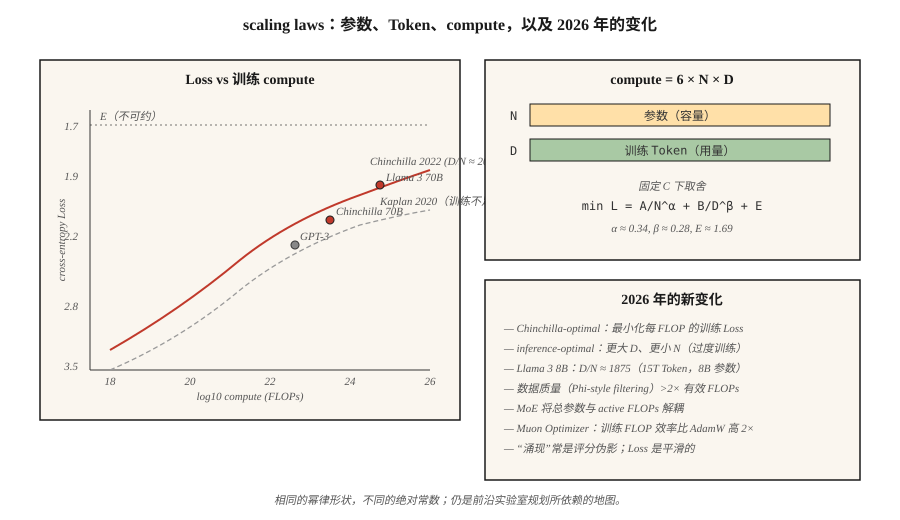

# Scaling Laws

> 2020 年 Kaplan 论文说：模型越大，Loss 越低。2022 年 Hoffmann 论文说：你们训练不足。Compute 会进入两个桶：参数和 Token，而两者的分配并不显然。

**Type:** Learn
**Languages:** Python
**先修要求:** Phase 7 · 05 (Full Transformer), Phase 7 · 07 (GPT)
**Time:** ~45 分钟

## 问题

当你有 C FLOPs 的训练 compute，并且想得到最好的模型时，你面临两个旋钮：

1. **多少参数 (N)？** 模型越大，容量越高。
2. **多少训练 Token (D)？** 数据越多，容量利用越充分。

FLOPs 近似按 `6 × N × D` 缩放。你可以提高 N、降低 D，也可以提高 D、降低 N。哪种更好？

2022 年以前，答案是“尽量推高 N”。GPT-3 (2020) 是 175B 参数，在约 300B Token 上训练。比例约为每个参数 1.7 个 Token。Kaplan Scaling Laws 支持了这一点。

Hoffmann et al. (2022) 训练了一组名为 Chinchilla 的小型模型家族，发现了不同结论：最优比例更接近 **每个参数 20 个 Token**。GPT-3 训练不足 10×。Chinchilla（70B 参数，1.4T Token）在推理成本低 2.5× 的情况下，在所有 benchmark 上都击败了 GPT-3（175B，300B Token）。

2026 年是 Chinchilla 的世界，但有一个重要转折。Llama 3 8B 在 15 万亿 Token 上训练，比例是每个参数 1,875 个 Token。超过 Chinchilla-optimal 九十四倍。对于会大规模使用的模型，推理成本比训练成本更重要，因此为了更小的可部署占用而进行过度训练（超过 Chinchilla）是 2026 年的默认选择。

## 概念



### Hoffmann law

来自 Chinchilla 论文，Loss 遵循：

```
L(N, D) = A / N^α + B / D^β + E
```

- `N` = 参数（非 Embedding）。
- `D` = 训练 Token。
- `α ≈ 0.34`, `β ≈ 0.28`（大致对称）。
- `E ≈ 1.69`，不可约 Loss 上限。
- `A ≈ 406`, `B ≈ 411`。

随着扩展，两个项会彼此权衡。在固定 compute（C = 6ND）下对 `N` 求导并求解：

```
N_opt ≈ 0.6 × (C/6)^0.5
D_opt ≈ 0.6 × (C/6)^0.5
D_opt / N_opt ≈ 20
```

Compute-optimal：每个参数 20 个 Token。

### 为什么仍然要过度训练

Chinchilla-optimal 最小化的是每训练 FLOP 对应的训练 Loss。但训练成本只付一次；推理成本会一直付。

对于每月服务一万亿 Token 的 chatbot，推理会主导总成本。Llama 的方法是：模型更小，训练更久。8B 在 15T Token 上训练，是高度推理优化的：

- 可放入消费级 GPU。
- 延迟只是 70B Chinchilla-optimal 的一小部分。
- 对大多数任务来说，质量足够接近。

DeepMind 2024 年论文（"Over-training is the new optimal"）将这一点形式化。对于推理主导的工作负载，合适比例更接近每个参数 100-500 个 Token，具体取决于服务量。

### 涌现 vs 平滑性

主张：某些能力（算术、多步推理、遵循 chain-of-thought）会在某个规模突然“涌现”。

Schaeffer et al. (2023) 认为这是测量伪影：涌现指标使用不连续评分（exact match、阈值 accuracy），会隐藏底层 logits 的平滑改进。连续指标（cross-entropy）显示的是平滑曲线。

到 2026 年，共识是：通过连续 Loss 进行预测是可靠的。Benchmark 跳变通常是评分器伪影。预算规划应基于连续指标。

### 2026 年图景

Scaling Laws 仍然有效，但：

| 因素 | 如何变化 |
|--------|-------------|
| 数据质量 | 筛选“好”Token（Phi-style）可使曲线移动，相当于 >2× effective compute |
| MoE | 总参数与 active FLOPs 解耦；Scaling Laws 按 per-active-FLOP 计算 |
| 后训练 | 某些能力（指令遵循、代码）受 SFT+RLHF 的影响比 pretraining 更大 |
| Multimodal | 图像 + 文本 Token 一起缩放；每种模态有单独曲线 |
| 合成数据 | 模型生成训练数据；effective compute 可以复合增长 |

Muon Optimizer（Kimi Moonlight, 2024）显示，在匹配数据量下，相比 AdamW 有约 2× 的 effective-compute 增益。一些 2026 年训练运行默认使用 Muon。它改变 Scaling Law 中的绝对常数，而不是形状。

## 构建它

见 `code/main.py`。我们实现 Chinchilla Loss 方程，并在若干 compute 预算下求解 compute-optimal `(N, D)`。

### 步骤 1： Chinchilla loss

```python
def chinchilla_loss(N, D, A=406.4, B=410.7, alpha=0.34, beta=0.28, E=1.69):
    return A / N ** alpha + B / D ** beta + E
```

在固定 `C = 6ND` 下，将 `L` 绘制为 `(N, D)` 上的等高线。找到最小值。

### 步骤 2: 计算最优边界

对于从 `1e17` 到 `1e25` FLOPs 的 compute 预算，找到在约束 `6ND = C` 下最小化 Loss 的 `(N, D)`。验证比例 `D/N ≈ 20`。

### 步骤 3：过度训练成本

计算训练一个小 10× 的模型（最优 N 的 1/10，最优 D 的 10×）所付出的额外 Loss。报告换来的推理 FLOP 节省（与 N 成正比）。

### 步骤 4: 与真实模型比较

填入 GPT-3、Chinchilla、Llama 3 8B、DeepSeek-V3（active params）的已知 `(N, D)` 对，并比较预测 Loss 与报告 Loss。

## 使用它

你不太可能自己训练 frontier 模型。但 Scaling Laws 能告诉你：

1. **你的 fine-tune 是否有足够数据。** 如果任务特定数据低于 base model 每个参数 20 个 Token，预期会在某个 Loss floor 处饱和。
2. **是否选择更大的 base model。** 如果你的全部预算都花在推理上，优先选择更小、训练更久的模型。
3. **收益在哪里递减。** 超过 1000× Chinchilla-optimal 后，log-loss 的变化会变成噪声。

**2026 年的研究轨迹：**

- **数据受限状态。** Web 上高质量 Token 数量有限（过滤后约 5-10 万亿 English）。Frontier pretraining 正接近这个上限。合成数据、多语言、Multimodal，以及 RLHF-scaled fine-tuning 是下一批杠杆。
- **Compute-multiplier 技巧。** Muon Optimizer、MoE、更好的数据筛选，每一种都会移动绝对常数，而不是渐近线。
- **RL 的 Scaling Laws。** 开放问题。早期证据表明 RL samples 中存在 power-law，但指数与 pretraining 非常不同。

## 交付它

见 `outputs/skill-training-budget-estimator.md`。该 skill 会在给定 compute 预算、部署约束和目标 Loss 的情况下，为一次新的训练运行选择 `(N, D, hours, GPU)`。

## 练习

1. **Easy.** 运行 `code/main.py`。打印 compute 预算 `1e20`、`1e22`、`1e24` 下的 Chinchilla-optimal `(N, D)`。与真实模型表比较。
2. **Medium.** 实现 Hoffmann Loss-as-function-of-compute 曲线。为 compute-optimal frontier 绘制 Loss vs `log10(C)`。识别该 law 预测我们何时需要 `>10^28` FLOPs 才能让 cross-entropy 再降低 0.1。
3. **Hard.** 在同一 dataset 上训练 5 个小模型（100K 到 10M 参数），拟合你自己的 Scaling Law。估计 `α` 和 `E`。你的指数与已发表结果匹配得如何？

## 关键术语

| 术语 | 人们常说 | 实际含义 |
|------|-----------------|-----------------------|
| Parameters (N) | “模型大小” | 非 Embedding 权重数量；决定容量。 |
| Tokens (D) | “训练数据” | 见过的训练 Token 数；决定参数被利用得有多充分。 |
| Compute (C) | “花费的 FLOPs” | 对标准 Transformer 来说，约为 `6 × N × D`。 |
| Chinchilla-optimal | “D/N ≈ 20” | 最小化 pretraining 每 FLOP Loss 的比例。 |
| Over-training | “超过 Chinchilla” | 花费额外训练 FLOPs 来节省推理 FLOPs；D/N >> 20。 |
| Irreducible loss | “底部” | Scaling Law 中的 `E` 项；数据本身的熵。 |
| Emergent capability | “规模上的突然跳变” | 通常是评分器伪影；连续 Loss 是平滑的。 |
| Effective compute | “训练效率倍增器” | 更好的数据 / Optimizer / 架构会倍增每个 FLOP 的作用距离。 |

## 延伸阅读

- [Kaplan et al. (2020). Scaling Laws for Neural Language Models](https://arxiv.org/abs/2001.08361) — 第一篇 Scaling Law 论文；训练不足。
- [Hoffmann et al. (2022). Training Compute-Optimal Large Language Models](https://arxiv.org/abs/2203.15556) — Chinchilla。
- [Schaeffer et al. (2023). Are Emergent Abilities of Large Language Models a Mirage?](https://arxiv.org/abs/2304.15004) — 涌现作为测量伪影。
- [Sardana, Frankle (2024). Beyond Chinchilla-Optimal: Accounting for Inference in Language Model Scaling Laws](https://arxiv.org/abs/2401.00448) — 为什么 Llama 的 over-training 适合其工作负载。
- [Jordan et al. (2024). Muon: An optimizer for hidden layers in neural networks](https://kellerjordan.github.io/posts/muon/) — 2× compute multiplier。
