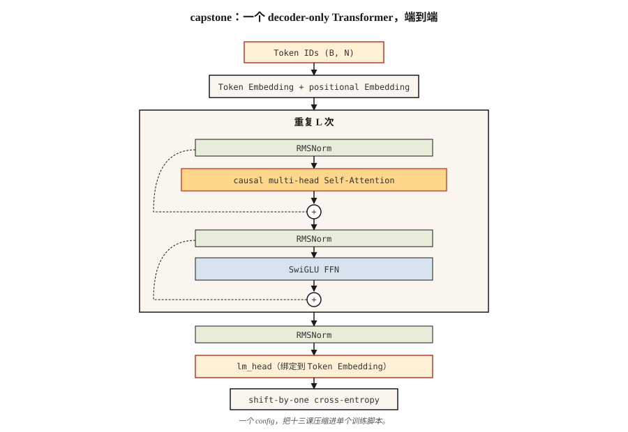

# 从零构建 Transformer — Capstone 项目

> 十三节课。一个模型。不走捷径。

**Type:** Build
**Languages:** Python
**Prerequisites:** Phase 7 · 01 到 13。不要跳过。
**Time:** 约 120 分钟

## 问题

你已经读过每一篇论文。你已经实现了 attention、multi-head 拆分、positional encodings、encoder 和 decoder blocks、BERT 和 GPT losses、MoE、KV cache。现在让它们在一个真实任务中协同工作。

这个 capstone：在一个 character-level language modeling 任务上端到端训练一个小型 decoder-only transformer。它读取 Shakespeare。它生成新的 Shakespeare。它足够小，可以在 10 分钟内在 laptop 上训练完成。它也足够正确，只要换成更大的 dataset 并进行更长时间的训练，就能得到一个真正的 LM。

这是本课程的 “nanoGPT”。它并非原创 — Karpathy 2023 年的 nanoGPT tutorial 是每个学生至少会写一次的 reference implementation。我们沿用其形状，并围绕本课程已经讲过的内容重新组织。

## 概念



架构标注如下：

```
input tokens (B, N)
   │
   ▼
token embedding + positional embedding  ◀── Lesson 04 (RoPE option)
   │
   ▼
┌──── block × L ────────────────────┐
│  RMSNorm                          │  ◀── Lesson 05
│  MultiHeadAttention (causal)      │  ◀── Lesson 03 + 07 (causal mask)
│  residual                         │
│  RMSNorm                          │
│  SwiGLU FFN                       │  ◀── Lesson 05
│  residual                         │
└────────────────────────────────── ┘
   │
   ▼
final RMSNorm
   │
   ▼
lm_head (tied to token embedding)
   │
   ▼
logits (B, N, V)
   │
   ▼
shift-by-one cross-entropy            ◀── Lesson 07
```

### 我们交付什么

- `GPTConfig` — 统一配置所有 hyperparameters 的地方。
- `MultiHeadAttention` — causal、batched，并带有可选的 Flash-style pathway（PyTorch 的 `scaled_dot_product_attention`）。
- `SwiGLUFFN` — 现代 FFN。
- `Block` — pre-norm，用 residual 包裹 attention + FFN。
- `GPT` — embeddings、stacked blocks、LM head、generate()。
- 使用 AdamW、cosine LR、gradient clipping 的 training loop。
- Shakespeare 文本上的 char-level tokenizer。

### 我们不交付什么

- RoPE — Lesson 04 已经从概念上实现。这里为了简单使用 learned positional embeddings。练习会要求你换成 RoPE。
- 生成期间的 KV cache — 每个 generation step 都会在完整 prefix 上重新计算 attention。更慢但更简单。练习会要求你添加 KV cache。
- Flash Attention — PyTorch 2.0+ 会在输入匹配时自动 dispatch；我们使用 `F.scaled_dot_product_attention`。
- MoE — 每个 block 使用单个 FFN。你已经在 Lesson 11 中见过 MoE。

### 目标指标

在 Mac M2 laptop 上，一个 4-layer、4-head、d_model=128 的 GPT 在 `tinyshakespeare.txt` 上训练 2,000 steps：

- Training loss 在大约 6 分钟内从约 4.2（random）收敛到约 1.5。
- 采样输出看起来具有 Shakespeare 的形态：古风词汇、换行，以及像 “ROMEO:” 这样的专有名称会出现。
- Val loss（held-out final 10% of text）紧密跟随 training loss；在这个 size/budget 下没有 overfitting。

## 构建它

本课使用 PyTorch。安装 `torch`（CPU build 即可）。参见 `code/main.py`。脚本会处理：

- 如果缺失则下载 `tinyshakespeare.txt`（或读取本地副本）。
- Byte-level char tokenizer。
- 90/10 的 train/val split。
- 在支持的硬件上使用 bf16 autocast 的 training loop。
- 训练完成后的 sampling。

### 步骤 1： data

```python
text = open("tinyshakespeare.txt").read()
chars = sorted(set(text))
stoi = {c: i for i, c in enumerate(chars)}
itos = {i: c for c, i in stoi.items()}
encode = lambda s: [stoi[c] for c in s]
decode = lambda xs: "".join(itos[x] for x in xs)
```

65 个唯一字符。极小的 vocabulary。适合 4-byte vocab_size。没有 BPE，也没有 tokenizer 麻烦。

### 步骤 2： model

参见 `code/main.py`。这个 block 是 Lesson 05 的标准写法 — pre-norm、RMSNorm、SwiGLU、causal MHA。4/4/128 的 parameter count：约 800K。

### 步骤 3： training loop

随机取一批长度为 256 的 token windows。Forward。Shift-by-one cross-entropy。Backward。AdamW step。Log。重复。

```python
for step in range(max_steps):
    x, y = get_batch("train")
    logits = model(x)
    loss = F.cross_entropy(logits.view(-1, vocab_size), y.view(-1))
    loss.backward()
    torch.nn.utils.clip_grad_norm_(model.parameters(), 1.0)
    opt.step()
    opt.zero_grad()
```

### 步骤 4： sample

给定一个 prompt，反复 forward，从 top-p logits 中 sample，append，然后继续。500 tokens 后停止。

### 步骤 5： read the output

2,000 steps 后：

```
ROMEO:
Away and mild will not thy friend, that thou shalt wit:
The chief that well shame and hath been his friends,
...
```

这不是 Shakespeare。但它具有 Shakespeare 的形态。对于约 800K parameters 和 laptop 上 6 分钟训练来说，这是明确的成功。

## 使用它

这个 capstone 是一个 reference architecture。要把它扩展成真实可用的东西，有三个方向：

1. **更换 tokenizer。** 使用 BPE（例如 `tiktoken.get_encoding("cl100k_base")`）。Vocab size 会从 65 跳到约 50,000。Model capacity 需要相应扩大来补偿。
2. **在更大的 corpus 上训练。** 使用 `OpenWebText` 或 `fineweb-edu`（HuggingFace）。在单张 A100 上用 10B tokens 训练一个 125M-param GPT 大约需要 24 小时。
3. **添加 RoPE + KV cache + Flash Attention。** 下面的练习会引导你完成每一项。

最终会得到一个 125M-parameter GPT，可以生成流畅英文。它不是 frontier model。但同一条 code path — 只是更大 — 正是 Karpathy、EleutherAI 和 Allen Institute 在 2026 年用来训练 research checkpoints 的方式。

## 交付它

参见 `outputs/skill-transformer-review.md`。该 skill 会针对前 13 节课覆盖的正确性，审查一个 transformer-from-scratch implementation。

## 练习

1. **Easy.** 运行 `code/main.py`。验证你训练出的 model 最后一步 validation loss 低于 2.0。把 `max_steps` 从 2,000 改为 5,000 — val loss 是否继续改善？
2. **Medium.** 用 RoPE 替换 learned positional embeddings。在 `MultiHeadAttention` 内部对 Q 和 K 应用 rotation。训练并验证 val loss 至少同样低。
3. **Medium.** 在 sampling loop 中实现 KV cache。分别在有 cache 和没有 cache 的情况下生成 500 tokens。laptop 上的 wall-clock 应该提升 5–20×。
4. **Hard.** 给 model 添加第二个 head，用来预测 next-plus-one token（MTP — Multi-Token Prediction from DeepSeek-V3）。联合训练。它有帮助吗？
5. **Hard.** 用 4-expert MoE 替换每个 block 中的单个 FFN。Router + top-2 routing。在匹配 active parameters 的条件下，观察 val loss 如何变化。

## 关键术语

| Term | 人们常说 | 实际含义 |
|------|-----------------|-----------------------|
| nanoGPT | “Karpathy 的 tutorial repo” | 最小化的 decoder-only transformer training code，约 300 LOC；canonical reference。 |
| tinyshakespeare | “标准 toy corpus” | 约 1.1 MB 文本；自 2015 年以来几乎每个 character-LM tutorial 都使用它。 |
| Tied embeddings | “共享 input/output matrix” | LM head weight = token embedding matrix 的转置；节省 parameters，并提升质量。 |
| bf16 autocast | “Training precision trick” | 用 bf16 运行 forward/back，在 fp32 中保留 optimizer state；自 2021 年以来成为标准做法。 |
| Gradient clipping | “阻止 spikes” | 将 global grad norm 限制在 1.0；防止 training blowups。 |
| Cosine LR schedule | “2020+ 默认选择” | LR 先线性上升（warmup），然后按 cosine 形状衰减到峰值的 10%。 |
| MFU | “Model FLOP Utilization” | 实际达到的 FLOPs / 理论峰值；2026 年 40% dense、30% MoE 已经很强。 |
| Val loss | “Held-out loss” | 在 model 从未见过的数据上计算 Cross-Entropy；overfit detector。 |

## 延伸阅读

- [The Annotated Transformer (Harvard NLP)](https://nlp.seas.harvard.edu/annotated-transformer/) — 经典的 annotated implementation.
