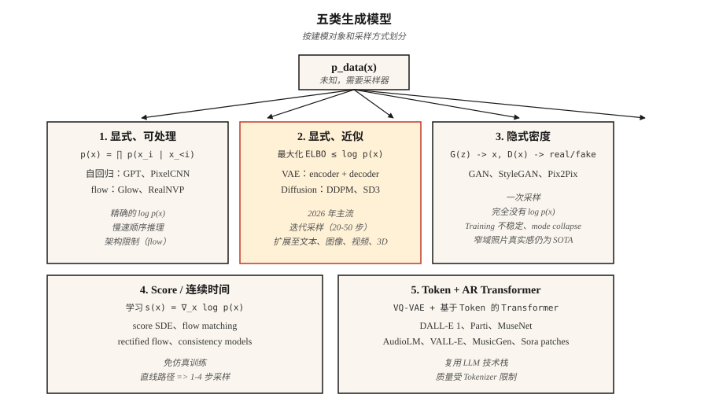

# Generative Models — 分类法与历史

> 每个图像模型、文本模型、视频模型和 3D 模型都属于五个类别之一。选错类别，你会和数学较劲好几周。选对类别，过去十二年这个领域的进展就会在你脑中清晰地层层叠起。

**类型:** 学习
**语言:** Python
**先修要求:** Phase 2 (ML Fundamentals), Phase 3 (Deep Learning Core), Phase 7 · 14 (Transformers)
**时间:** ~45 分钟

## 问题

Generative model 做一件事：给定从某个未知分布 `p_data(x)` 抽取的训练样本，输出看起来像来自同一分布的新样本。人脸、句子、MIDI 文件、蛋白质结构——如果你眯着眼看，它们都是同一个问题。

难点在于，`p_data` 存在于一个拥有数百万维度的空间中（一个 512x512 RGB 图像大约有 786k 维），样本位于该空间内部一条很薄的 manifold 上，而你可能只有 10M 个样本。暴力求解 density 是没有希望的。每个 generative model 都是在把一个难题换成另一个稍微不那么难的问题。

过去十二年里有五个家族存活了下来。理解每个家族所做的取舍，会告诉你为什么它在某些任务上胜出，又为什么会在另一些任务上崩塌。

## 概念



**1. Explicit density, tractable。** 将 `log p(x)` 写成一个你真的能计算的求和。Autoregressive models (PixelCNN, WaveNet, GPT) 将 `p(x) = ∏ p(x_i | x_<i)` 因式分解。Normalizing flows (RealNVP, Glow) 将 `p(x)` 构造成一个简单 base 分布的可逆变换。优点：精确 likelihood，干净的训练 Loss。缺点：autoregressive 推理是顺序的（长序列会慢），flows 需要可逆架构（架构限制很强）。

**2. Explicit density, approximate。** 从下方界定 `log p(x)`（ELBO）并优化这个 bound。VAEs (Kingma 2013) 使用带 variational posterior 的 encoder-decoder。Diffusion models (DDPM, Ho 2020) 训练一个 denoiser，它隐式优化加权 ELBO。Diffusion 是 2026 年图像、视频和 3D 的主导 backbone。

**3. Implicit density。** 完全跳过 density；学习一个生成样本的 generator `G(z)`，以及一个判断真假的 discriminator `D(x)`。GANs (Goodfellow 2014)。推理很快（一次 forward pass），但训练过程出了名地不稳定。即使在 2026 年，StyleGAN 1/2/3 在固定领域的 photorealism（人脸、卧室）上仍然是 state of the art。

**4. Score-based / continuous-time。** 直接学习 log-density 的 Gradient `∇_x log p(x)`（score）。Song & Ermon (2019) 表明 score matching 将 diffusion 推广为一个 SDE。Flow matching (Lipman 2023) 是 2024-2026 年的热点：无需模拟的训练、更直的路径、比 DDPM 快 4-10 倍的采样。Stable Diffusion 3、Flux、AudioCraft 2 都使用 flow matching。

**5. 基于 Token 的离散 codes 上的 autoregressive。** 使用 VQ-VAE 或 residual quantizer 将高维数据压缩成一段较短的离散 tokens 序列，然后使用 Transformer 对 token sequence 建模。Parti、MuseNet、AudioLM、VALL-E、Sora 的 patch tokenizer 都使用这种方式。这是类别 1 加上一个 learned tokenizer。

## 简史

| 年份 | 模型 | 为什么重要 |
|------|-------|-----------------|
| 2013 | VAE (Kingma) | 第一个拥有可用训练 Loss 的 deep generative model。 |
| 2014 | GAN (Goodfellow) | Implicit density，没有 likelihood，却能产生惊人锐利的样本。 |
| 2015 | DRAW, PixelCNN | 顺序图像生成。 |
| 2017 | Glow, RealNVP | 可逆 flows；通过 depth 获得精确 likelihood。 |
| 2017 | Progressive GAN | 第一个 megapixel 人脸。 |
| 2019 | StyleGAN / StyleGAN2 | 在人脸这个单一领域中，photorealistic faces 依然很难被击败。 |
| 2020 | DDPM (Ho) | Diffusion 变得实用。 |
| 2021 | CLIP, DALL-E 1, VQGAN | Text-to-image 进入主流。 |
| 2022 | Imagen, Stable Diffusion 1, DALL-E 2 | Latent diffusion + text conditioning = 商品化。 |
| 2022 | ControlNet, LoRA | 对 pretrained diffusion 进行精细控制。 |
| 2023 | SDXL, Midjourney v5, Flow matching | 规模 + 更好的训练动态。 |
| 2024 | Sora, Stable Diffusion 3, Flux.1 | Video diffusion；flow matching 胜出。 |
| 2025 | Veo 2, Kling 1.5, Runway Gen-3, Nano Banana | 生产级视频。 |
| 2026 | Consistency + Rectified Flow | 从 diffusion backbones 进行一步采样。 |

## 五问分诊

当一篇新的 generative model 论文出现时，在阅读方法部分之前，先回答这五个问题。

1. **建模的是什么？** Pixels、latents、离散 tokens、3D Gaussians、meshes、waveforms？
2. **Density 是 explicit 还是 implicit？** 他们是否写出了 `log p(x)`？
3. **Sampling：one-shot 还是 iterative？** Iterative 意味着推理更慢；one-shot 通常意味着 adversarial 或 distilled。
4. **Conditioning：unconditional、class、text、image、pose？** 这决定了 Loss 和架构脚手架。
5. **Evaluation：FID、CLIP score、IS、human preference、task accuracy？** 每个都有已知 failure modes（见 Lesson 14）。

你会在本 phase 的每一课中重新回答这五个问题。到最后，它们会成为你的条件反射。

```figure
autoencoder-bottleneck
```

## 构建它

本课的代码是一个轻量级可视化：使用三种玩具方法（kernel density、离散 histogram，以及 nearest-sample “GAN-ish” generator）从样本中拟合一个 1-D mixture-of-Gaussians，这样你可以在一个能打印到一屏里的问题上看到 explicit vs implicit density 的区别。

运行 `code/main.py`。它会从一个双峰 Gaussian mixture 中抽取 2000 个样本，然后打印：

```
explicit density (histogram): p(x in [-0.5, 0.5]) ≈ 0.38
approximate density (KDE):     p(x in [-0.5, 0.5]) ≈ 0.41
implicit (nearest-sample gen): 20 new samples printed, no p(x)
```

注意：前两个允许你问“这个点有多可能？”第三个不行。这就是 *explicit vs implicit* 的区别，它会影响之后的每一课。

## 使用它

2026 年，哪个家族适合哪个任务？

| 任务 | 最佳家族 | 原因 |
|------|-------------|-----|
| Photoreal faces，窄领域 | StyleGAN 2/3 | 仍然最锐利，推理最快。 |
| 通用 text-to-image | Latent diffusion + flow matching | SD3, Flux.1, DALL-E 3。 |
| 快速 text-to-image | Rectified flow + distillation | SDXL-Turbo, SD3-Turbo, LCM。 |
| Text-to-video | Diffusion Transformer + flow matching | Sora, Veo 2, Kling。 |
| Speech + music | Token-based AR (AudioLM, VALL-E, MusicGen) 或 flow matching (AudioCraft 2) | 离散 tokens 扩展成本低。 |
| 3D scenes | Gaussian Splatting fit, diffusion prior | 3D-GS 用于重建，diffusion 用于 novel-view。 |
| Density estimation（不采样） | Flows | 唯一拥有精确 `log p(x)` 的家族。 |
| Simulation / physics | Flow matching, score SDE | 直线路径，平滑 Vector fields。 |

## 交付它

保存为 `outputs/skill-model-chooser.md`。

这个 skill 接收一个任务描述并输出：(1) 要使用哪个家族，(2) 三个开放选项和三个 hosted 选项的排序列表，(3) 你应该关注的可能 failure mode，以及 (4) 计算/时间预算。

## 练习

1. **Easy。** 对以下五个产品，识别其家族和 backbone：ChatGPT image、Midjourney v7、Sora、Runway Gen-3、ElevenLabs。证据应来自公开技术报告。
2. **Medium。** 你明天要读的论文声称采样比 diffusion 快 100 倍。写下三个问题，用来检查这个加速在 conditioning 和 high resolution 下是否仍然成立。
3. **Hard。** 选择一个你关心的领域（例如蛋白质结构、CAD、分子、轨迹）。为该领域当前的 SOTA 模型回答五问分诊，并勾勒一个更好的模型会改变什么。

## 关键术语

| 术语 | 人们怎么说 | 它实际是什么意思 |
|------|-----------------|-----------------------|
| Generative model | “它会生成新东西” | 学习 `p_data(x)` 的 sampler，可选地暴露 `log p(x)`。 |
| Explicit density | “你可以计算它” | 模型提供 closed-form 或 tractable 的 `log p(x)`。 |
| Implicit density | “GAN-style” | 只有 sampler——无法计算给定点的 `p(x)`。 |
| ELBO | “Evidence lower bound” | `log p(x)` 的一个 tractable 下界；VAEs 和 diffusion 会优化它。 |
| Score | “log-density 的 Gradient” | `∇_x log p(x)`；diffusion 和 SDE models 学习这个 field。 |
| Manifold hypothesis | “数据存在于一个表面上” | 高维数据集中在低维 manifold 上；这就是 dimensionality reduction 有效的原因。 |
| Autoregressive | “预测下一个片段” | 将 joint 因式分解为 conditionals 的乘积。 |
| Latent | “压缩 code” | 一种低维表示，decoder 可以从中重建输入。 |

## 生产备注：五个家族，五种推理形态

每个家族都会映射到不同的 inference-server 成本曲线。production-inference 文献将 LLM 推理框定为 prefill + decode；同样的分解也适用于这里：

- **Autoregressive（类别 1 和 5）。** 顺序 decode 主导 latency；KV-cache、continuous batching 和 speculative decoding 都可以直接应用。
- **VAE / diffusion / flow-matching（类别 2 和 4）。** 这里没有 LLM 意义上的 decode。成本 = `num_steps × step_cost`，而 `step_cost` 是在完整 latent resolution 上的一次 transformer 或 U-Net forward。生产旋钮是 step count（DDIM / DPM-Solver / distillation）、batch size 和 precision（bf16 / fp8 / int4）。
- **GAN（类别 3）。** 一次 forward pass。没有 schedule，没有 KV-cache。TTFT ≈ total latency。这就是为什么 StyleGAN 在窄领域 UX 上仍然胜出的原因。

当你在论文摘要里看到“faster than diffusion”时，把它翻译成“更少的 steps × 相同的 step cost”或“相同的 steps × 更便宜的 step cost”。除此之外都是营销。

## 延伸阅读

- [Goodfellow et al. (2014). Generative Adversarial Nets](https://arxiv.org/abs/1406.2661) — GAN 论文。
- [Kingma & Welling (2013). Auto-Encoding Variational Bayes](https://arxiv.org/abs/1312.6114) — VAE 论文。
- [Ho, Jain, Abbeel (2020). Denoising Diffusion Probabilistic Models](https://arxiv.org/abs/2006.11239) — DDPM 论文。
- [Song et al. (2021). Score-Based Generative Modeling through SDEs](https://arxiv.org/abs/2011.13456) — 作为 SDE 的 diffusion。
- [Lipman et al. (2023). Flow Matching for Generative Modeling](https://arxiv.org/abs/2210.02747) — flow matching 论文。
- [Esser et al. (2024). Scaling Rectified Flow Transformers for High-Resolution Image Synthesis](https://arxiv.org/abs/2403.03206) — Stable Diffusion 3。
