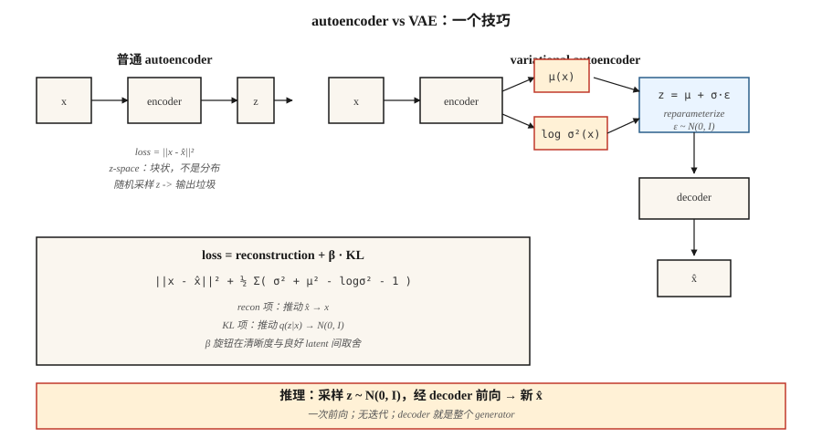

# Autoencoders & Variational Autoencoders (VAE)

> 普通 Autoencoder 先压缩再重构。它会记忆。它不会生成。加入一个技巧 — 强制 code 看起来像 Gaussian — 你就得到一个 sampler。这个单一技巧，也就是 `z = μ + σ·ε` 的 reparameterization，正是为什么你在 2026 年使用的每个 latent-diffusion 和 flow-matching image model 都在输入端有一个 VAE。

**Type:** Build
**Languages:** Python
**Prerequisites:** Phase 3 · 02 (Backprop), Phase 3 · 07 (CNNs), Phase 8 · 01 (Taxonomy)
**Time:** ~75 分钟

## The Problem

把一个 784-pixel 的 MNIST digit 压缩成 16 个数字的 code，然后重构。普通 Autoencoder 会在 reconstruction MSE 上表现很好，但 code space 是一团凹凸不平的混乱。随便在 code space 中选一个点，decode 它，你得到的是 noise。它没有 sampler。它只是披着外衣的 compression model。

你真正想要的是：(a) code space 是一个干净、平滑、可从中 sample 的 distribution，比如 isotropic Gaussian `N(0, I)`，(b) decode 任意 sample 都能产生一个合理的 digit，(c) encoder 和 decoder 仍然能很好地压缩。三个目标，一个 architecture，一个 Loss。

Kingma 的 2013 VAE 通过让 encoder 输出一个 *distribution* `q(z|x) = N(μ(x), σ(x)²)` 来解决这个问题，用 KL penalty 把这个 distribution 拉向 prior `N(0, I)`，然后在 decode 前从 `q(z|x)` sample `z`。在 inference 时，丢掉 encoder，sample `z ~ N(0, I)`，decode。KL penalty 正是迫使 code space 结构化的机制。

在 2026 年，VAE 很少单独交付 — 在原始 image quality 上它们已经被 diffusion 超越 — 但它们是每个 latent-diffusion model（SD 1/2/XL/3、Flux、AudioCraft）的首选 encoder。学会 VAE，你就学会了你使用的每条 image pipeline 中那个看不见的第一层。

## The Concept



**Autoencoder.** `z = encoder(x)`, `x̂ = decoder(z)`, loss = `||x - x̂||²`。Code space 无结构。

**VAE encoder.** 输出两个 vectors：`μ(x)` 和 `log σ²(x)`。它们定义了 `q(z|x) = N(μ, diag(σ²))`。

**Reparameterization trick.** 从 `q(z|x)` sample 不可微。把 sample 重写为 `z = μ + σ·ε`，其中 `ε ~ N(0, I)`。现在 `z` 是 `(μ, σ)` 加上非参数 noise 的 deterministic function — gradients 可以流经 `μ` 和 `σ`。

**Loss.** Evidence Lower BOund (ELBO)，两个项：

```
loss = reconstruction + β · KL[q(z|x) || N(0, I)]
     = ||x - x̂||²  + β · Σ_i ( σ_i² + μ_i² - log σ_i² - 1 ) / 2
```

Reconstruction 把 `x̂` 推向 `x`。KL 把 `q(z|x)` 推向 prior。它们相互权衡。小 β (<1) = 更锐利的 samples，code space 不那么 Gaussian。大 β (>1) = 更干净的 code space，更模糊的 samples。β-VAE（Higgins 2017）让这个旋钮出名，并开启了 disentanglement research。

**Sampling.** Inference 时：抽取 `z ~ N(0, I)`，forward through decoder。一次 forward pass — 不像 diffusion 那样需要 iterative sampling。

## Build It

`code/main.py` 实现了一个不使用 numpy 或 torch 的微型 VAE。输入是从 8-D 中的 2-component Gaussian mixture 抽取的 8-dimensional synthetic data。Encoder 和 decoder 都是 single hidden-layer MLP。我们实现 tanh activation、forward pass、loss，以及手写 backward pass。不是 production — 是 pedagogy。

### Step 1: encoder forward

```python
def encode(x, enc):
    h = tanh(add(matmul(enc["W1"], x), enc["b1"]))
    mu = add(matmul(enc["W_mu"], h), enc["b_mu"])
    log_sigma2 = add(matmul(enc["W_sig"], h), enc["b_sig"])
    return mu, log_sigma2
```

使用 `log σ²` 而不是 `σ`，这样 network output 不受约束（对 σ 做 softplus 是陷阱 — 在 σ ≈ 0 时 gradients 会消失）。

### Step 2: reparameterize and decode

```python
def reparameterize(mu, log_sigma2, rng):
    eps = [rng.gauss(0, 1) for _ in mu]
    sigma = [math.exp(0.5 * lv) for lv in log_sigma2]
    return [m + s * e for m, s, e in zip(mu, sigma, eps)]

def decode(z, dec):
    h = tanh(add(matmul(dec["W1"], z), dec["b1"]))
    return add(matmul(dec["W_out"], h), dec["b_out"])
```

### Step 3: the ELBO

```python
def elbo(x, x_hat, mu, log_sigma2, beta=1.0):
    recon = sum((a - b) ** 2 for a, b in zip(x, x_hat))
    kl = 0.5 * sum(math.exp(lv) + m * m - lv - 1 for m, lv in zip(mu, log_sigma2))
    return recon + beta * kl, recon, kl
```

精确的 closed-form KL，因为两个 distributions 都是 Gaussian。不要数值积分。2026 年仍然有人交付带 monte-carlo KL estimates 的代码 — 毫无理由地慢 3x。

### Step 4: generate

```python
def sample(dec, z_dim, rng):
    z = [rng.gauss(0, 1) for _ in range(z_dim)]
    return decode(z, dec)
```

这就是 generative model。五行。

## Pitfalls

- **Posterior collapse.** KL term 过于激进地驱动 `q(z|x) → N(0, I)`，导致 `z` 不携带关于 `x` 的信息。修复：β-annealing（从 β=0 开始，逐步升到 1）、free bits，或者在 inactive dimensions 上跳过 KL。
- **Blurry samples.** Gaussian decoder likelihood 意味着 MSE reconstruction，它对 L2 是 Bayes-optimal（mean）— 一组合理 digits 的 mean 是一个模糊 digit。修复：discrete decoder（VQ-VAE、NVAE），或者只把 VAE 用作 encoder，并在 latents 上堆叠 diffusion（Stable Diffusion 就是这么做的）。
- **β too large, too early.** 见 posterior collapse。从 β≈0.01 开始并逐步 ramp。
- **Latent dim too small.** 16-D 适用于 MNIST，256-D 适用于 ImageNet 256²，2048-D 适用于 ImageNet 1024²。Stable Diffusion 的 VAE 将 512×512×3 压缩为 64×64×4（spatial area 上 32x downsample factor，channels 上 32x）。

## Use It

2026 VAE stack：

| Situation | Pick |
|-----------|------|
| Image-latent encoder for diffusion | Stable Diffusion VAE (`sd-vae-ft-ema`) or Flux VAE |
| Audio-latent encoder | Encodec (Meta), SoundStream, or DAC (Descript) |
| Video latents | Sora's spatiotemporal patches, Latte VAE, WAN VAE |
| Disentangled representation learning | β-VAE, FactorVAE, TCVAE |
| Discrete latents (for transformer modelling) | VQ-VAE, RVQ (ResidualVQ) |
| Continuous latents for generation | Plain VAE, then condition a flow/diffusion model in that latent space |

latent-diffusion model 是一个 VAE，中间住着一个 diffusion model，位于 encoder 和 decoder 之间。VAE 做粗压缩，diffusion model 负责重活。Video（VAE + video-diffusion DiT）和 audio（Encodec + MusicGen transformer）也遵循同样模式。

## Ship It

保存 `outputs/skill-vae-trainer.md`。

Skill 接收：dataset profile + latent-dim target + downstream use（reconstruction、sampling 或 latent-diffusion input），并输出：architecture choice（plain/β/VQ/RVQ）、β schedule、latent dim、decoder likelihood（Gaussian vs categorical），以及 evaluation plan（recon MSE、KL per dim、`q(z|x)` 和 `N(0, I)` 之间的 Fréchet distance）。

## Exercises

1. **Easy.** 把 `code/main.py` 中的 `β` 改为 `0.01`、`0.1`、`1.0`、`5.0`。记录最终 reconstruction MSE 和 KL。对于你的 synthetic data，哪个 β 是 Pareto-best？
2. **Medium.** 用 Bernoulli likelihood（cross-entropy loss）替换 Gaussian decoder likelihood。在同一 synthetic data 的 binarized version 上比较 sample quality。
3. **Hard.** 将 `code/main.py` 扩展成一个 mini VQ-VAE：用 K=32 entries 的 codebook 中的 nearest-neighbour lookup 替换 continuous `z`。比较 reconstruction MSE，并报告有多少 codebook entries 被使用（codebook collapse 是真实存在的）。

## Key Terms

| Term | What people say | What it actually means |
|------|-----------------|-----------------------|
| Autoencoder | Encode-decode network | `x → z → x̂`，学习 MSE。不是 generative。 |
| VAE | 带 sampler 的 AE | Encoder 输出一个 distribution，KL penalty 塑造 code space。 |
| ELBO | Evidence lower bound | `log p(x) ≥ recon - KL[q(z\|x) \|\| p(z)]`；当 `q = p(z\|x)` 时 tight。 |
| Reparameterization | `z = μ + σ·ε` | 将 stochastic node 重写为 deterministic + pure noise。使 sampling 可参与 backprop。 |
| Prior | `p(z)` | latent 的目标 distribution，通常是 `N(0, I)`。 |
| Posterior collapse | “KL term wins” | Encoder 忽略 `x`，输出 prior；decoder 必须 hallucinate。 |
| β-VAE | 可调 KL weight | `loss = recon + β·KL`。更高 β = 更 disentangled 但更模糊。 |
| VQ-VAE | Discrete latent | 用 nearest codebook vector 替换 continuous `z`；支持 transformer modelling。 |

## Production note: the VAE is the hottest path in a diffusion server

在 Stable Diffusion / Flux / SD3 pipeline 中，VAE 每个 request 会被调用两次 — 一次用于 encode（如果做 img2img / inpainting），一次用于 decode。在 1024² 时，decoder pass 往往是整条 pipeline 中单个最大的 activation-memory peak，因为它把 `128×128×16` latents upsample 回 `1024×1024×3`。两个实际后果：

- **Slice or tile the decode.** `diffusers` 暴露 `pipe.vae.enable_slicing()` 和 `pipe.vae.enable_tiling()`。Tiling 用少量 seam artifact 换取 `O(tile²)` memory，而不是 `O(H·W)`。对 consumer GPUs 上的 1024²+ 至关重要。
- **bf16 decoder, fp32 numerics for the final resize.** SD 1.x VAE 以 fp32 发布，并且在 1024²+ 被 cast 到 fp16 时会 *静默产生 NaNs*。SDXL 提供 `madebyollin/sdxl-vae-fp16-fix` — 总是优先使用 fp16-fix variant，或者使用 bf16。

## Further Reading

- [Kingma & Welling (2013). Auto-Encoding Variational Bayes](https://arxiv.org/abs/1312.6114) — VAE paper。
- [Higgins et al. (2017). β-VAE: Learning Basic Visual Concepts with a Constrained Variational Framework](https://openreview.net/forum?id=Sy2fzU9gl) — disentangled β-VAE。
- [van den Oord et al. (2017). Neural Discrete Representation Learning](https://arxiv.org/abs/1711.00937) — VQ-VAE。
- [Vahdat & Kautz (2021). NVAE: A Deep Hierarchical Variational Autoencoder](https://arxiv.org/abs/2007.03898) — state-of-the-art image VAE。
- [Rombach et al. (2022). High-Resolution Image Synthesis with Latent Diffusion Models](https://arxiv.org/abs/2112.10752) — Stable Diffusion；VAE as encoder。
- [Défossez et al. (2022). High Fidelity Neural Audio Compression](https://arxiv.org/abs/2210.13438) — Encodec，audio VAE standard。
