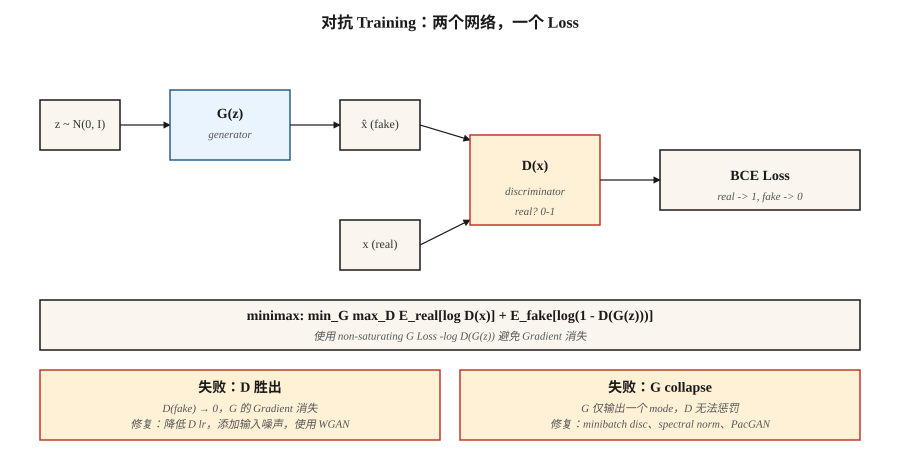

# GANs — Generator vs Discriminator

> Goodfellow 在 2014 年的技巧是完全跳过 density。两个网络。一个制造 fakes。一个抓住它们。它们互相对抗，直到 fakes 与真实样本无法区分。它本不该奏效。它也经常不奏效。但一旦奏效，对于狭窄领域，它生成的 samples 仍然是文献中最锐利的。

**Type:** Build
**Languages:** Python
**Prerequisites:** Phase 3 · 02 (Backprop), Phase 3 · 08 (Optimizers), Phase 8 · 02 (VAE)
**Time:** ~75 minutes

## 问题

VAEs 会产生模糊的 samples，因为它们的 MSE decoder loss 对于*均值*图像是 Bayes 最优的，而许多合理数字的均值就是一个模糊的数字。你想要一种奖励*合理性*的 loss，而不是奖励与某个目标在 pixel-wise 层面接近。合理性没有 closed-form。你必须学出来。

Goodfellow 的想法：训练一个 classifier `D(x)` 来区分真实图像和 fakes。训练一个 generator `G(z)` 来欺骗 `D`。`G` 的 loss signal 就是 `D` 当前认为某个东西看起来真实的依据。随着 `G` 改进，这个 signal 也会更新，追逐一个移动目标。如果两个网络都收敛，`G` 就在从未写下 `log p(x)` 的情况下学会了 data distribution。

这就是 adversarial training。数学上它是一个 minimax game：

```
min_G max_D  E_real[log D(x)] + E_fake[log(1 - D(G(z)))]
```

到 2026 年，GANs 已经不再是 SOTA generator（diffusion 和 flow matching 夺走了王冠）。但 StyleGAN 2/3 仍然是已发布过的最锐利 face models，GAN discriminators 被用作 diffusion training 中的 *perceptual losses*，而 adversarial training 支撑着 fast 1-step distillations（SDXL-Turbo, SD3-Turbo, LCM），让你能交付 real-time diffusion。

## 概念



**Generator `G(z)`。** 将 noise Vector `z ~ N(0, I)` 映射到 sample `x̂`。一个 decoder 形状的网络（dense 或 transposed conv）。

**Discriminator `D(x)`。** 将 sample 映射为 scalar probability（或 score）。真实 → 1，fake → 0。

**Loss。** 两个交替更新：

- **训练 `D`：** `loss_D = -[ log D(x) + log(1 - D(G(z))) ]`。对 real=1, fake=0 做 binary cross-entropy。
- **训练 `G`：** `loss_G = -log D(G(z))`。这是 Goodfellow 使用的 *non-saturating* 形式（原始的 `log(1 - D(G(z)))` 会 saturate，并在 `D` 很自信时杀死 gradients）。

**Training loop。** 一步 `D`，一步 `G`。重复。

**为什么它能工作。** 如果 `G` 完美匹配 `p_data`，那么 `D` 做不到比随机猜测更好，并且处处输出 0.5；`G` 不再获得 gradient。达到 equilibrium。

**为什么它会失效。** Mode collapse（`G` 找到一个 `D` 无法分类的 mode，然后永远铸造它）、vanishing gradient（`D` 学得太快，`log D` saturates）、training instability（learning rates、batch sizes、任何东西）。

## 让 GANs 可用的 Variants

| Year | Innovation | Fix |
|------|------------|-----|
| 2015 | DCGAN | Conv/deconv、batch norm、LeakyReLU —— 第一个稳定 architecture。 |
| 2017 | WGAN, WGAN-GP | 用 Wasserstein distance + gradient penalty 替换 BCE。修复 vanishing gradient。 |
| 2017 | Spectral normalization | 对 discriminator 做 Lipschitz-bound。2026 年的 discriminators 中仍在使用。 |
| 2018 | Progressive GAN | 先训练低分辨率，再添加 layers。首次达到 megapixel results。 |
| 2019 | StyleGAN / StyleGAN2 | Mapping network + adaptive instance norm。固定领域 photorealism 的 state of the art。 |
| 2021 | StyleGAN3 | Alias-free、translation-equivariant —— 2026 年仍然是 face gold standard。 |
| 2022 | StyleGAN-XL | Conditional、class-aware、更大 scale。 |
| 2024 | R3GAN | 以更强 regularization 重新包装；无需 tricks 即可在 1024² 上工作。 |

## 构建它

`code/main.py` 在 1-D data 上训练一个小型 GAN：两个 Gaussians 的 mixture。Generator 和 discriminator 都是单 hidden layer MLPs。我们手写实现 forward、backward 和 minimax loop。目标是看到两个关键 failure modes（mode collapse + vanishing gradient）如何发生。

### 步骤 1： non-saturating loss

vanilla Goodfellow loss `log(1 - D(G(z)))` 会在 D 以高置信度把 G 的 fake 分类为 fake 时趋近 0。此时 G 的 gradient 基本为零，G 无法改进。non-saturating 形式 `-log D(G(z))` 具有相反的 asymptote：当 D 很自信时它会爆增，给 G 一个强 signal。

```python
def g_loss(d_fake):
    # maximize log D(G(z))  <=>  minimize -log D(G(z))
    return -sum(math.log(max(p, 1e-8)) for p in d_fake) / len(d_fake)
```

### 步骤 2： 每个 generator step 对应一个 discriminator step

```python
for step in range(steps):
    # train D
    real_batch = sample_real(batch_size)
    fake_batch = [G(z) for z in sample_noise(batch_size)]
    update_D(real_batch, fake_batch)

    # train G
    fake_batch = [G(z) for z in sample_noise(batch_size)]  # fresh fakes
    update_G(fake_batch)
```

给 G 使用 fresh fakes，否则 gradients 会过期。

### 步骤 3： 观察 mode collapse

```python
if step % 200 == 0:
    samples = [G(z) for z in sample_noise(500)]
    mode_a = sum(1 for s in samples if s < 0)
    mode_b = 500 - mode_a
    if min(mode_a, mode_b) < 50:
        print("  [!] mode collapse: one mode is starved")
```

经典症状：两个真实 modes 中有一个停止被生成。discriminator 不再纠正它，因为它从未被当作 fake 看到过。

## 陷阱

- **Discriminator 太强。** 将 D 的 learning rate 降低 2-5x，或添加 instance/layer noise。如果 D 达到 >95% accuracy，G 就死了。
- **Generator 记住了一个 mode。** 给 D inputs 加 noise，使用 minibatch-discriminator layer，或切换到 WGAN-GP。
- **Batch norm 泄漏 statistics。** Real batch + fake batch 流经同一个 BN layer 会混合它们的 statistics。改用 instance norm 或 spectral norm。
- **Inception-score gaming。** FID 和 IS 在低 sample counts 下噪声很大。eval 时使用 ≥10k samples。
- **对于 conditional tasks，one-shot sampling 是谎言。** 你仍然需要 CFG scales、truncation tricks 和 re-sampling 才能得到可用 outputs。

## 使用它

2026 年的 GAN stack：

| Situation | Pick |
|-----------|------|
| Photoreal human faces, fixed pose | StyleGAN3（最锐利、最小） |
| Anime / stylized faces | StyleGAN-XL 或 Stable Diffusion LoRA |
| Image-to-image translation | Pix2Pix / CycleGAN（Phase 8 · 04）或 ControlNet（Phase 8 · 08） |
| Fast 1-step text-to-image | diffusion 的 adversarial distillation（SDXL-Turbo, SD3-Turbo） |
| Perceptual loss inside a diffusion trainer | image crops 上的小型 GAN discriminator |
| Anything multi-modal, open-ended | 不要用 —— 使用 diffusion 或 flow matching |

GANs 锐利但狭窄。一旦你的 domain 打开，比如 photos、任意 text prompts、video，就切换到 diffusion。adversarial trick 作为组件继续存在（perceptual losses、distillation），而不是独立 generator。

## 交付它

保存 `outputs/skill-gan-debugger.md`。Skill 接收一次失败的 GAN run（loss curves、sample grid、dataset size），并输出按可能性排序的 causes、one-line fixes 和 rerun protocol。

## 练习

1. **Easy。** 使用默认设置运行 `code/main.py`。然后设置 `D_LR = 5 * G_LR` 并重新运行。G 的 loss 多快 collapse 到常数？
2. **Medium。** 用 WGAN loss 替换 Goodfellow BCE loss：`loss_D = E[D(fake)] - E[D(real)]`，`loss_G = -E[D(fake)]`，并将 D 的 weights clip 到 `[-0.01, 0.01]`。Training 是否更稳定？比较 wall-clock convergence。
3. **Hard。** 将 1-D 示例扩展到 2-D data（环上的 8 个 Gaussians mixture）。跟踪 generator 在 steps 1k、5k、10k 捕获了 8 个 modes 中的多少个。实现 minibatch discrimination 并重新测量。

## 关键术语

| Term | What people say | What it actually means |
|------|-----------------|-----------------------|
| Generator | "G" | noise-to-sample network，`G: z → x̂`。 |
| Discriminator | "D" | Classifier `D: x → [0, 1]`，real vs fake。 |
| Minimax | "The game" | joint objective 的 `min_G max_D`。 |
| Non-saturating loss | "The fix" | 对 G 使用 `-log D(G(z))`，而不是 `log(1 - D(G(z)))`。 |
| Mode collapse | "G memorized one thing" | 尽管 data 多样，Generator 只产生少量不同 outputs。 |
| WGAN | "Wasserstein" | 用 Earth-Mover distance + gradient penalty 替换 BCE；gradient 更平滑。 |
| Spectral norm | "Lipschitz trick" | 约束 D 的 weight norms 来 bound 它的 slope；稳定 training。 |
| StyleGAN | "The one that works" | Mapping network + AdaIN；faces 领域 best-in-class，2026 年仍然如此。 |

## Production note: one-shot inference 是 GAN 的持久优势

GANs 在 open-domain generation 的 sample quality 上不再获胜，但它们仍然在 inference cost 上获胜。在 production-inference 文献词汇中，一个 GAN 具有：

- **没有 prefill，没有 decode stages。** 一次 `G(z)` forward pass。TTFT ≈ total latency。
- **没有 KV-cache pressure。** 唯一 state 是 weights。Batch size 受 activation memory 限制，而不是 cache。
- **Trivial continuous batching。** 由于每个 request 都消耗相同的固定 FLOPs，server 目标占用率下的 static batch 通常是最优的。不需要 in-flight scheduler。

这就是为什么 GAN distillation（SDXL-Turbo, SD3-Turbo, ADD, LCM）是 2026 年 fast text-to-image 的主导技术：它把 20-50-step diffusion pipeline 压缩成 1-4 次 GAN-style forward passes，同时保留 diffusion base 的 distribution。adversarial loss 作为 training-time knob 存活下来，用来把慢 generators 变成快 generators。

## 延伸阅读

- [Goodfellow et al. (2014). Generative Adversarial Nets](https://arxiv.org/abs/1406.2661) —— 原始 GAN paper。
- [Radford et al. (2015). Unsupervised Representation Learning with DCGAN](https://arxiv.org/abs/1511.06434) —— 第一个稳定 architecture。
- [Arjovsky, Chintala, Bottou (2017). Wasserstein GAN](https://arxiv.org/abs/1701.07875) —— WGAN。
- [Miyato et al. (2018). Spectral Normalization for GANs](https://arxiv.org/abs/1802.05957) —— SN。
- [Karras et al. (2020). Analyzing and Improving the Image Quality of StyleGAN](https://arxiv.org/abs/1912.04958) —— StyleGAN2。
- [Karras et al. (2021). Alias-Free Generative Adversarial Networks](https://arxiv.org/abs/2106.12423) —— StyleGAN3。
- [Sauer et al. (2023). Adversarial Diffusion Distillation](https://arxiv.org/abs/2311.17042) —— SDXL-Turbo。
