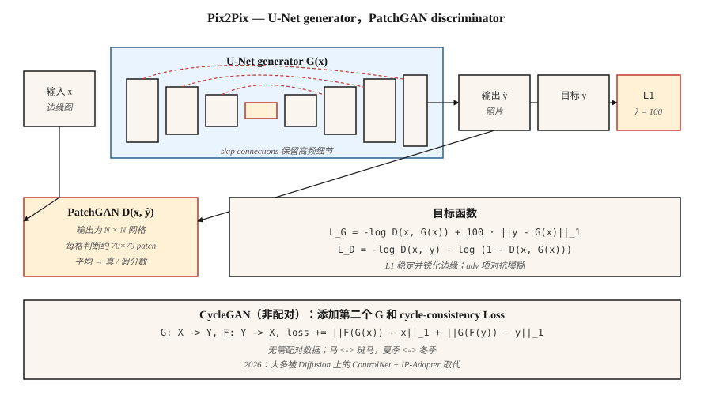

# Conditional GANs 与 Pix2Pix

> 2014-2017 年第一个重大突破，是控制 GAN 生成什么。附加一个 label、一张 image，或一个 sentence。Pix2Pix 做的是 image 版本，而且在狭窄的 image-to-image 任务上，它至今仍胜过每一个通用 text-to-image model。

**Type:** 构建
**Languages:** Python
**Prerequisites:** Phase 8 · 03 (GANs), Phase 4 · 06 (U-Net), Phase 3 · 07 (CNNs)
**Time:** ~75 分钟

## 问题
无条件 GAN 会采样任意人脸。做 demo 有用，进 production 没用。你想要的是：*把 sketch 映射成 photo*、*把 map 映射成 aerial photo*、*把 daytime scene 映射成 nighttime*、*给 grayscale image 上色*。在所有这些任务中，你会得到一个 input image `x`，并且必须输出带有某种 semantic correspondence 的 `y`。每个 `x` 都可能对应许多合理的 `y`。Mean-squared error 会把它们压平成糊状结果。Adversarial loss 不会，因为“看起来真实”是尖锐的。

Conditional GAN (Mirza & Osindero, 2014) 把 condition `c` 作为输入加入 `G` 和 `D`。Pix2Pix (Isola et al., 2017) 对此做了专门化：condition 是完整 input image，generator 是 U-Net，discriminator 是 *patch-based* classifier (PatchGAN)，Loss 是 adversarial + L1。即使在 2026 年，这套配方在狭窄的 image-to-image domain 上仍然胜过从零训练的 text-to-image model，因为它训练在 *paired data* 上 —— 你拥有的正是所需信号。

## 概念


**Conditional G.** `G(x, z) → y`。在 Pix2Pix 中，`z` 是 G 内部的 dropout（没有 input noise —— Isola 发现显式 noise 会被忽略）。

**Conditional D.** `D(x, y) → [0, 1]`。输入是 *pair*（condition, output）。这是关键差异：D 必须判断 `y` 是否与 `x` 一致，而不只是判断 `y` 看起来是否真实。

**U-Net generator.** 带有跨 bottleneck skip connections 的 encoder-decoder。对于 input 和 output 共享 low-level structure（edges、silhouette）的任务至关重要。没有这些 skips，high-frequency detail 会消失。

**PatchGAN discriminator.** D 不输出单个 real/fake score，而是输出一个 `N×N` grid，其中每个 cell 判断约 70×70 pixels 的 receptive field。然后取平均。这是一个 Markov random field 假设：真实感是局部的。训练快得多，参数更少，输出更锐利。

**Loss.**

```
loss_G = -log D(x, G(x)) + λ · ||y - G(x)||_1
loss_D = -log D(x, y) - log (1 - D(x, G(x)))
```

L1 项稳定训练，并推动 G 接近已知 target。L1 比 L2 产生更锐利的 edges（medians，而不是 means）。`λ = 100` 是 Pix2Pix 默认值。

## CycleGAN — when you don't have pairs

Pix2Pix 需要 paired `(x, y)` data。CycleGAN (Zhu et al., 2017) 通过额外的 Loss 放弃这个要求：*cycle consistency* loss。两个 generators：`G: X → Y` 和 `F: Y → X`。训练它们，使 `F(G(x)) ≈ x` 且 `G(F(y)) ≈ y`。这让你可以在没有 paired examples 的情况下，把 horses 转成 zebras、summer 转成 winter。

在 2026 年，unpaired image-to-image 大多通过 diffusion（ControlNet、IP-Adapter）完成，而不是 CycleGAN，但 cycle-consistency 思想仍存在于几乎每一篇 unpaired domain adaptation 论文中。

```figure
gx-patchgan
```

## 构建它
`code/main.py` 在 1-D data 上实现了一个微型 conditional GAN。condition `c` 是 class label（0 或 1）。任务：为给定 class 生成一个来自 conditional distribution 的 sample。

### 步骤 1: 将 condition 追加到 G 和 D 的输入

```python
def G(z, c, params):
    return mlp(concat([z, one_hot(c)]), params)

def D(x, c, params):
    return mlp(concat([x, one_hot(c)]), params)
```

One-hot encoding 是最简单的方式。更大的 models 会使用 learned embeddings、FiLM modulation，或 cross-attention。

### 步骤 2： train conditional

```python
for step in range(steps):
    x, c = sample_real_conditional()
    noise = sample_noise()
    update_D(x_real=x, x_fake=G(noise, c), c=c)
    update_G(noise, c)
```

Generator 必须匹配 *给定 condition 下* 的 real distribution，而不是 marginal。

### 步骤 3：验证每个 class 的输出

```python
for c in [0, 1]:
    samples = [G(noise, c) for noise in batch]
    mean_c = mean(samples)
    assert_near(mean_c, real_mean_for_class_c)
```

## 陷阱
- **Condition 被忽略。** G 学会 marginalize，D 从不惩罚，因为 condition signal 太弱。修复：更强地 condition D（early layer，而不只是 late），使用 projection discriminator (Miyato & Koyama 2018)。
- **L1 weight 过低。** G 漂移到任意看起来真实的 outputs，而不是忠实的 ones。Pix2Pix-style 任务从 λ≈100 开始。
- **L1 weight 过高。** G 产生模糊 outputs，因为 L1 仍然是 L_p norm。训练稳定后逐步 anneal down。
- **D 中 ground-truth leakage。** 将 `(x, y)` concat 作为 D input，而不只是 `y`。否则 D 无法检查一致性。
- **每个 class 的 mode collapse。** 每个 class 都可能独立 collapse。运行 class-conditional diversity checks。

## 使用它
2026 年 image-to-image 任务状态：

| Task | Best approach |
|------|---------------|
| Sketch → photo, same domain, paired data | Pix2Pix / Pix2PixHD（仍然快，仍然锐利） |
| Sketch → photo, unpaired | 带 Scribble conditioning model 的 ControlNet |
| Semantic seg → photo | SPADE / GauGAN2 或 SD + ControlNet-Seg |
| Style transfer | 带 IP-Adapter 或 LoRA 的 Diffusion；GAN methods 属于 legacy |
| Depth → photo | Stable Diffusion 上的 ControlNet-Depth |
| Super-resolution | Real-ESRGAN (GAN), ESRGAN-Plus, 或 SD-Upscale (diffusion) |
| Colorization | ColTran、diffusion-based colorizers，或 Pix2Pix-color |
| Daytime → nighttime, seasons, weather | CycleGAN 或 ControlNet-based |

当 (a) 你有数千个 paired examples，(b) 任务狭窄且可重复，且 (c) 需要快速 inference 时，Pix2Pix 仍然是正确工具。在通用 open-domain 任务上，diffusion 胜出。

## 交付它
保存 `outputs/skill-img2img-chooser.md`。Skill 接收 task description、data availability（paired vs unpaired、N samples）和 latency/quality budget，然后输出：approach（Pix2Pix、CycleGAN、ControlNet variant、SDXL + IP-Adapter）、training data requirements、inference cost 和 eval protocol（LPIPS、FID、task-specific）。

## 练习
1. **Easy.** 修改 `code/main.py`，加入第三个 class。确认 G 仍然把每个 class 的 noise 映射到正确 mode。
2. **Medium.** 在 1-D setting 中用 perceptual-style loss 替换 L1（例如一个小的 frozen D 作为 feature extractor）。它会改变 conditional distribution 的 sharpness 吗？
3. **Hard.** 在 1-D setting 中草拟一个 CycleGAN：两个 distributions、两个 generators、cycle loss。展示它能在没有 paired data 的情况下学会在二者之间映射。

## 关键术语
| Term | What people say | What it actually means |
|------|-----------------|-----------------------|
| Conditional GAN | “带 labels 的 GAN” | G(z, c), D(x, c)。两个 networks 都看到 condition。 |
| Pix2Pix | “Image-to-image GAN” | 带 U-Net G 和 PatchGAN D + L1 loss 的 paired cGAN。 |
| U-Net | “带 skips 的 encoder-decoder” | 对称 conv network；skips 保留 high-freq。 |
| PatchGAN | “Local-realism classifier” | D 输出 per-patch score，而不是 global score。 |
| CycleGAN | “Unpaired image translation” | 两个 G + cycle-consistency loss；没有 paired data。 |
| SPADE | “GauGAN” | 用 semantic map normalize intermediate activations；segmentation-to-image。 |
| FiLM | “Feature-wise linear modulation” | 来自 condition 的 per-feature affine transform；便宜的 conditioning。 |

## 生产说明: Pix2Pix 作为受延迟约束的 baseline

当你有 paired data 和狭窄任务（sketch → render、semantic map → photo、day → night）时，Pix2Pix 的 one-shot inference 在 latency 上比 diffusion 快一个数量级。Production comparison 通常是：

| Path | Steps | Typical latency at 512² on a single L4 |
|------|-------|----------------------------------------|
| Pix2Pix (U-Net forward) | 1 | ~30 ms |
| SD-Inpaint or SD-Img2Img | 20 | ~1.2 s |
| SDXL-Turbo Img2Img | 1-4 | ~0.15-0.35 s |
| ControlNet + SDXL base | 20-30 | ~3-5 s |

Pix2Pix 在 static batches 的 throughput 上胜出（每个 request 都是相同 FLOPs）。Diffusion 在 quality 和 generalization 上胜出。现代做法通常是为狭窄任务交付 Pix2Pix-style distilled model，并为 tail inputs 提供 diffusion fallback。

## 延伸阅读
- [Mirza & Osindero (2014). Conditional Generative Adversarial Nets](https://arxiv.org/abs/1411.1784) — cGAN 论文。
- [Isola et al. (2017). Image-to-Image Translation with Conditional Adversarial Networks](https://arxiv.org/abs/1611.07004) — Pix2Pix。
- [Zhu et al. (2017). Unpaired Image-to-Image Translation using Cycle-Consistent Adversarial Networks](https://arxiv.org/abs/1703.10593) — CycleGAN。
- [Wang et al. (2018). High-Resolution Image Synthesis with Conditional GANs](https://arxiv.org/abs/1711.11585) — Pix2PixHD。
- [Park et al. (2019). Semantic Image Synthesis with Spatially-Adaptive Normalization](https://arxiv.org/abs/1903.07291) — SPADE / GauGAN。
- [Miyato & Koyama (2018). cGANs with Projection Discriminator](https://arxiv.org/abs/1802.05637) — projection D。
