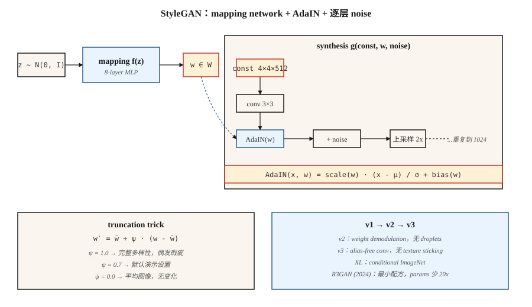

# StyleGAN

> 大多数生成器会把 `z` 同时搅入每一层。StyleGAN 把它拆开了：先把 `z` 映射到中间表示 `w`，然后通过 AdaIN 在每个分辨率层级*注入* `w`。这一个改动解开了 latent space，并让照片级真实人脸在连续七年里成为已解决的问题。

**类型：** 构建
**语言：** Python
**前置要求：** Phase 8 · 03 (GANs), Phase 4 · 08 (Normalization), Phase 3 · 07 (CNNs)
**时间：** ~45 分钟

## 问题

DCGAN 通过一叠 transposed convolutions 将 `z` 映射成一张图像。问题是：`z` 控制一切，包括姿态、光照、身份、背景，而且它们全都纠缠在一起。沿着 `z` 的一个轴移动，这四者都会变化。你无法要求模型“同一个人，不同姿态”，因为这个表示并不是那样分解的。

Karras et al. (2019, NVIDIA) 提出：停止把 `z` 直接送进 conv layers。把一个常量 `4×4×512` tensor 作为网络输入。学习一个 8 层 MLP，把 `z ∈ Z → w ∈ W`。通过 *adaptive instance normalization* (AdaIN) 在每个分辨率注入 `w`：先 normalize 每个 conv feature map，然后用 `w` 的 affine projections 做 scale 和 shift。为随机细节（皮肤毛孔、发丝）添加逐层 noise。

结果是：`W` 对“高层 style”（姿态、身份）与“细粒度 style”（光照、颜色）有大致正交的轴。你可以使用图像 A 的 `w` 作为低分辨率层级的 style，并使用图像 B 的 `w` 作为高分辨率层级的 style，从而在两张图之间交换 styles。这解锁了编辑、跨领域 stylization，以及整条 “StyleGAN-inversion” 研究路线。

## 概念



**Mapping network。** `f: Z → W`，一个 8 层 MLP。`Z = N(0, I)^512`。`W` 不被强制为 Gaussian，而是学习出适配数据的形状。

**Synthesis network。** 从一个学到的常量 `4×4×512` 开始。每个分辨率 block：`upsample → conv → AdaIN(w_i) → noise → conv → AdaIN(w_i) → noise`。分辨率翻倍：4, 8, 16, 32, 64, 128, 256, 512, 1024。

**AdaIN。**

```
AdaIN(x, y) = y_scale · (x - mean(x)) / std(x) + y_bias
```

其中 `y_scale` 和 `y_bias` 来自 `w` 的 affine projections。按 feature map normalize，然后重新施加 style。这里的 “Style” 指的是 feature map 的一阶与二阶统计量。

**逐层 noise。** 向每个 feature map 添加单通道 Gaussian noise，并由学到的逐通道因子进行缩放。它控制随机细节，而不影响全局结构。

**Truncation trick。** inference 时，采样 `z`，计算 `w = mapping(z)`，然后 `w' = ŵ + ψ·(w - ŵ)`，其中 `ŵ` 是许多样本上的平均 `w`。`ψ < 1` 用多样性换质量。几乎每个 StyleGAN demo 都使用 `ψ ≈ 0.7`。

## StyleGAN 1 → 2 → 3

| 版本 | 年份 | 创新 |
|---------|------|------------|
| StyleGAN | 2019 | Mapping network + AdaIN + noise + progressive growing。 |
| StyleGAN2 | 2020 | Weight demodulation 替代 AdaIN（修复 droplet artifacts）；skip/residual architecture；path-length regularization。 |
| StyleGAN3 | 2021 | Alias-free convolution + equivariant kernels；消除 texture 粘在 pixel grid 上的问题。 |
| StyleGAN-XL | 2022 | Class-conditional, 1024², ImageNet。 |
| R3GAN | 2024 | 以更强的 reg 重新包装；在 FFHQ-1024 上用少 20 倍的 params 缩小与 diffusion 的差距。 |

到 2026 年，StyleGAN3 仍然是以下场景的默认选择：(a) 高 FPS 的窄领域照片级真实生成，(b) few-shot domain adaptation（用 100 张图像在新数据集上训练，冻结 mapping），(c) 基于 inversion 的编辑（找到重建真实照片的 `w`，再编辑这个 `w`）。对于开放领域 text-to-image，它不是合适的工具，diffusion 才是。

## 构建它

`code/main.py` 实现了一个 1-D 的玩具版 “style-GAN lite”：一个 mapping MLP，一个 synthesis function，它接收学到的常量 Vector，并用从 `w` 派生的 scale/bias 进行 modulate，还有逐层 noise。它展示了通过 affine-modulation 注入 `w`，可以达到或超过把 `z` 拼接进生成器输入的方式。

### 步骤 1： mapping network

```python
def mapping(z, M):
    h = z
    for i in range(num_layers):
        h = leaky_relu(add(matmul(M[f"W{i}"], h), M[f"b{i}"]))
    return h
```

### 步骤 2: adaptive instance normalization

```python
def adain(x, w_scale, w_bias):
    mu = mean(x)
    sd = std(x)
    x_norm = [(xi - mu) / (sd + 1e-8) for xi in x]
    return [w_scale * xi + w_bias for xi in x_norm]
```

每个 feature map 的 scale 和 bias 都通过 linear projection 从 `w` 得到。

### 步骤 3： per-layer noise

```python
def add_noise(x, sigma, rng):
    return [xi + sigma * rng.gauss(0, 1) for xi in x]
```

每通道的 Sigma 是可学习的。

## 陷阱

- **Droplet artifacts。** StyleGAN 1 会在 feature maps 中产生块状 droplet，因为 AdaIN 把 mean 归零了。StyleGAN 2 的 weight demodulation 通过缩放 convolution weights 来修复它。
- **Texture sticking。** StyleGAN 1 和 2 的 textures 跟随 pixel coordinates，而不是 object coordinates（在 interpolation 时可见）。StyleGAN 3 的 alias-free convolutions 用 windowed sinc filters 修复了这一点。
- **Mode coverage。** Truncation `ψ < 0.7` 看起来干净，但它只从一个很窄的锥形区域采样；如果需要多样性，使用 `ψ = 1.0`。
- **Inversion 有损。** 把真实照片 invert 到 `W` 通常通过 optimization 或 encoder（e4e, ReStyle, HyperStyle）完成。经过多次迭代后结果会漂移。

## 使用它

| 使用场景 | 方法 |
|----------|----------|
| 照片级真实人脸（anime、product、窄领域） | StyleGAN3 FFHQ / custom fine-tune |
| 从照片进行人脸编辑 | e4e inversion + StyleSpace / InterFaceGAN directions |
| Face swap / reenactment | StyleGAN + encoder + blending |
| Avatar pipelines | StyleGAN3 w/ ADA for low-data fine-tune |
| 从少量图像做 domain adaptation | 冻结 mapping network，fine-tune synthesis |
| Multimodal 或 text-conditioned generation | 不要用它，使用 diffusion |

对于答案是“一个人的脸部照片”的产品级 demo，StyleGAN 在 inference cost（单次 forward pass，在 4090 上 <10ms）和相同质量门槛下的 sharpness 上胜过 diffusion。

## 交付它

保存 `outputs/skill-stylegan-inversion.md`。Skill 接收一张真实照片并输出：inversion method（e4e / ReStyle / HyperStyle）、预期 latent loss、editing budget（在出现 artifacts 之前你能在 `W` 中移动多远），以及已知有效 editing directions（年龄、表情、姿态）的列表。

## 练习

1. **简单。** 分别用 `adain_on=True` 和 `adain_on=False` 运行 `code/main.py`。比较固定 latent 与扰动 latent 下输出的分布范围。
2. **中等。** 实现 mixing regularization：对于一个 training batch，计算 `w_a`、`w_b`，并在 synthesis 的前半段应用 `w_a`，后半段应用 `w_b`。decoder 是否学到了 disentangled styles？
3. **困难。** 取一个 pretrained StyleGAN3 FFHQ model（ffhq-1024.pkl）。通过在带标签样本上训练 SVM，找到控制 “smile” 的 `w` direction；报告在身份漂移前可以推动多远。

## 关键术语

| 术语 | 人们怎么说 | 它实际意味着什么 |
|------|-----------------|-----------------------|
| Mapping network | “那个 MLP” | `f: Z → W`，8 层，把 latent geometry 与数据统计解耦。 |
| W space | “Style space” | Mapping network 的输出；大致 disentangled。 |
| AdaIN | “Adaptive instance norm” | Normalize feature map，然后由 `w`-projection 做 scale + shift。 |
| Truncation trick | “Psi” | `w = mean + ψ·(w - mean)`，ψ<1 用多样性换质量。 |
| Path-length regularization | “PL reg” | 惩罚 `w` 中单位变化导致的图像大幅变化；让 `W` 更平滑。 |
| Weight demodulation | “StyleGAN2 的修复” | Normalize conv weights 而不是 activations；消除 droplet artifacts。 |
| Alias-free | “StyleGAN3 的技巧” | Windowed sinc filters；消除 texture 粘在 pixel grid 上的问题。 |
| Inversion | “为真实图像找到 w” | Optimize 或 encode `x → w`，使 `G(w) ≈ x`。 |

## 生产说明：为什么 StyleGAN 在 2026 年仍然能上线

4090 上的 StyleGAN3 能在 10 ms 内生成一张 1024² FFHQ 人脸：`num_steps = 1`，没有 VAE decode，没有 cross-attention pass。用生产术语说，这是任何图像生成器的延迟下限。同分辨率下，一个 50-step SDXL + VAE-decode pipeline 大约需要 3 秒。这是一个 **300× 差距**，对于窄领域产品（avatar services、ID document pipelines、stock face generation），它在 TCO 上胜出。

两个运维后果：

- **没有 scheduler，没有 batcher。** 以目标 occupancy 做 static batch 是最优的。Continuous batching（对 LLMs 和 diffusion 必不可少）没有收益，因为每个请求消耗相同的 FLOPs。
- **Truncation `ψ` 是安全旋钮。** `ψ < 0.7` 从 mapping network 范围内的一个狭窄锥形区域采样。这是 serving layer 对 sample variance 拥有的唯一杠杆。峰值负载时降低 `ψ`，为 premium users 提高它。

## 延伸阅读

- [Karras et al. (2019). A Style-Based Generator Architecture for GANs](https://arxiv.org/abs/1812.04948) — StyleGAN。
- [Karras et al. (2020). Analyzing and Improving the Image Quality of StyleGAN](https://arxiv.org/abs/1912.04958) — StyleGAN2。
- [Karras et al. (2021). Alias-Free Generative Adversarial Networks](https://arxiv.org/abs/2106.12423) — StyleGAN3。
- [Tov et al. (2021). Designing an Encoder for StyleGAN Image Manipulation](https://arxiv.org/abs/2102.02766) — e4e inversion。
- [Sauer et al. (2022). StyleGAN-XL: Scaling StyleGAN to Large Diverse Datasets](https://arxiv.org/abs/2202.00273) — StyleGAN-XL。
- [Huang et al. (2024). R3GAN: The GAN is dead; long live the GAN!](https://arxiv.org/abs/2501.05441) — 现代最小化 GAN recipe。
