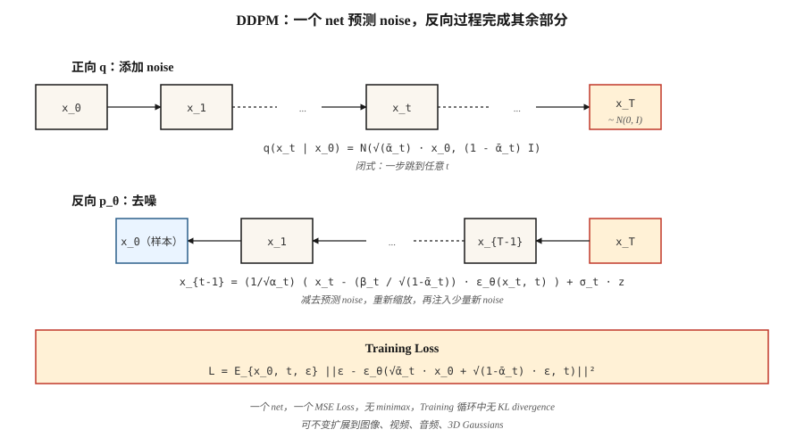

# Diffusion Models — DDPM from Scratch

> Ho、Jain、Abbeel（2020）给了这个领域一个无法放弃的配方。用 noise 经过一千个小步骤摧毁 data。训练一个 neural net 来预测 noise。在 inference 时反转这个过程。今天，每个主流 image、video、3D 和 music model 都运行在这个 loop 上，可能还在上面叠加 flow matching 或 consistency 技巧。

**Type:** Build
**Languages:** Python
**Prerequisites:** Phase 3 · 02 (Backprop), Phase 8 · 02 (VAE)
**Time:** ~75 分钟

## The Problem

你想要一个用于 `p_data(x)` 的 sampler。GANs 会玩一个经常发散的 minimax game。VAEs 会从 Gaussian decoder 产生模糊 samples。你真正想要的是一个 training objective，它具备：(a) 单一稳定 Loss（没有 saddle point，没有 minimax），(b) `log p(x)` 的 lower bound（所以你有 likelihoods），以及 (c) 匹配 SOTA quality 的 samples。

Sohl-Dickstein et al.（2015）给出了理论答案：定义一个逐渐加入 Gaussian noise 的 Markov chain `q(x_t | x_{t-1})`，并训练一个 reverse chain `p_θ(x_{t-1} | x_t)` 来 denoise。Ho、Jain、Abbeel（2020）展示了 Loss 可以简化成一行 — 预测 noise — 并整理了数学。2020 年它还是个 curiosity。2021 年它产生了 state-of-the-art samples。2022 年它变成了 Stable Diffusion。2026 年它是底层基质。

## The Concept



**Forward process `q`.** 在 `T` 个小步骤中加入 Gaussian noise。Closed form — 数学可处理的原因 — 是 cumulative step 仍然是 Gaussian：

```
q(x_t | x_0) = N( sqrt(α̅_t) · x_0,  (1 - α̅_t) · I )
```

其中 `α̅_t = ∏_{s=1..t} (1 - β_s)`，对应一个 `β_t` schedule。让 `β_t` 在 T=1000 steps 内从 1e-4 到 0.02 线性变化，`x_T` 会近似为 `N(0, I)`。

**Reverse process `p_θ`.** 学习一个 neural net `ε_θ(x_t, t)`，预测被加入的 noise。给定 `x_t`，按下式 denoise：

```
x_{t-1} = (1 / sqrt(α_t)) · ( x_t - (β_t / sqrt(1 - α̅_t)) · ε_θ(x_t, t) )  +  σ_t · z
```

其中 `σ_t` 要么是 `sqrt(β_t)`，要么是 learned variance。这个表达式很丑，但它只是代数 — 在给定 posterior `q(x_{t-1} | x_t, x_0)` 的情况下求解 `x_{t-1}`，并用 noise-predicted estimate 替换 `x_0`。

**Training loss.**

```
L_simple = E_{x_0, t, ε} [ || ε - ε_θ( sqrt(α̅_t) · x_0 + sqrt(1 - α̅_t) · ε,  t ) ||² ]
```

从 data 中 sample `x_0`，随机选一个 `t`，sample `ε ~ N(0, I)`，通过 closed form 一次性计算 noisy `x_t`，并对 noise 做 Regression。一个 Loss，没有 minimax，没有 KL，没有 reparameterization tricks。

**Sampling.** 从 `x_T ~ N(0, I)` 开始。从 `t = T` 到 `1` 迭代 reverse step。完成。

## Why it works

三个直觉：

1. **Denoising is easy; generating is hard.** 在 `t=T`，data 是 pure noise — net 要解决的是一个 trivial problem。在 `t=0`，net 只需要清理几个 pixels。在中间的 `t`，问题很难，但 net 会从每个 noise level 的同一组 weights 中获得许多 gradients。

2. **Score matching in disguise.** Vincent（2011）证明，预测 noise 等价于估计 `∇_x log q(x_t | x_0)`，也就是 *score*。reverse SDE 使用这个 score 沿 density gradient 上行 — 一次被引导的 random walk，走向 high-probability regions。

3. **The ELBO reduces to simple MSE.** 完整 variational lower bound 在每个 timestep 都有一个 KL term。使用 DDPM 的 parameterization，这些 KL terms 会简化为带特定 coefficients 的 noise prediction MSE；Ho 去掉了 coefficients（称其为 “simple” loss），quality 反而 *提高* 了。


```figure
diffusion-denoise
```

## Build It

`code/main.py` 实现了一个 1-D DDPM。Data 是 two-mode mixture。“net” 是一个微型 MLP，接收 `(x_t, t)` 并输出 predicted noise。Training 是一行 Loss。Sampling 迭代 reverse chain。

### Step 1: the forward schedule (closed form)

```python
betas = [1e-4 + (0.02 - 1e-4) * t / (T - 1) for t in range(T)]
alphas = [1 - b for b in betas]
alpha_bars = []
cum = 1.0
for a in alphas:
    cum *= a
    alpha_bars.append(cum)
```

### Step 2: sample `x_t` in one shot

```python
def forward_sample(x0, t, alpha_bars, rng):
    a_bar = alpha_bars[t]
    eps = rng.gauss(0, 1)
    x_t = math.sqrt(a_bar) * x0 + math.sqrt(1 - a_bar) * eps
    return x_t, eps
```

### Step 3: one training step

```python
def train_step(x0, model, alpha_bars, rng):
    t = rng.randrange(T)
    x_t, eps = forward_sample(x0, t, alpha_bars, rng)
    eps_hat = model_forward(model, x_t, t)
    loss = (eps - eps_hat) ** 2
    return loss, gradient_step(model, ...)
```

### Step 4: reverse sampling

```python
def sample(model, alpha_bars, T, rng):
    x = rng.gauss(0, 1)
    for t in range(T - 1, -1, -1):
        eps_hat = model_forward(model, x, t)
        beta_t = 1 - alphas[t]
        x = (x - beta_t / math.sqrt(1 - alpha_bars[t]) * eps_hat) / math.sqrt(alphas[t])
        if t > 0:
            x += math.sqrt(beta_t) * rng.gauss(0, 1)
    return x
```

对于一个 40 timesteps 和 24-unit MLP 的 1-D problem，它大约 200 epochs 就能学会 two-mode mixture。

## Time conditioning

net 需要知道它正在 denoise 哪个 timestep。两个标准选项：

- **Sinusoidal embedding.** 类似 Transformer positional encoding。`embed(t) = [sin(t/ω_0), cos(t/ω_0), sin(t/ω_1), ...]`。传入 MLP，broadcast 到 net 中。
- **Film / group-norm conditioning.** 在每个 block 中把 embedding project 为 per-channel scale/bias（FiLM）。

我们的 toy code 使用 sinusoidal → concat。Production U-Nets 使用 FiLM。

## Pitfalls

- **Schedule matters a lot.** Linear `β` 是 DDPM default，但 cosine schedule（Nichol & Dhariwal, 2021）在相同 compute 下给出更好的 FID。如果 quality plateau，就切换 schedule。
- **Timestep embedding is fragile.** 把 raw `t` 作为 float 传入对 toy 1-D 可行，但对 images 会失败；始终使用 proper embedding。
- **V-prediction vs ε-prediction.** 对狭窄 regime（非常小或非常大的 t），`ε` 的 signal-to-noise 很差。V-prediction（`v = α·ε - σ·x`）更稳定；SDXL、SD3 和 Flux 都使用它。
- **Classifier-free guidance.** Inference 时，同时计算 conditional 和 unconditional `ε`，然后 `ε_cfg = (1 + w) · ε_cond - w · ε_uncond`，其中 `w ≈ 3-7`。Lesson 08 会覆盖。
- **1000 steps is a lot.** Production 使用 DDIM（20-50 steps）、DPM-Solver（10-20 steps）或 distillation（1-4 steps）。见 Lesson 12。

## Use It

| Role | Typical stack in 2026 |
|------|-----------------------|
| Image pixel-space diffusion (small, toy) | DDPM + U-Net |
| Image latent diffusion | VAE encoder + U-Net or DiT (Lesson 07) |
| Video latent diffusion | Spatiotemporal DiT (Sora, Veo, WAN) |
| Audio latent diffusion | Encodec + diffusion transformer |
| Science (molecules, proteins, physics) | Equivariant diffusion (EDM, RFdiffusion, AlphaFold3) |

Diffusion 是通用 generative backbone。Flow matching（Lesson 13）是 2024-2026 年的竞争者，在相同 quality 下通常赢在 inference speed。

## Ship It

保存 `outputs/skill-diffusion-trainer.md`。Skill 接收 dataset + compute budget，并输出：schedule（linear/cosine/sigmoid）、prediction target（ε/v/x）、number of steps、guidance scale、sampler family 和 eval protocol。

## Exercises

1. **Easy.** 在 `code/main.py` 中把 T 从 40 改为 10。sample quality（outputs 的 visual histogram）如何退化？在什么 T 上 two-mode structure collapse？
2. **Medium.** 从 ε-prediction 切换到 v-prediction。重新推导 reverse step。比较最终 sample quality。
3. **Hard.** 添加 classifier-free guidance。以 class label `c ∈ {0, 1}` 为 condition，在 training 时 10% 的时间 drop 它，并在 sampling 时使用 `ε = (1+w)·ε_cond - w·ε_uncond`。测量 `w = 0, 1, 3, 7` 时的 conditional-mode-hit rate。

## Key Terms

| Term | What people say | What it actually means |
|------|-----------------|-----------------------|
| Forward process | “Adding noise” | 固定 Markov chain `q(x_t \| x_{t-1})`，用于摧毁 data。 |
| Reverse process | “Denoising” | Learned chain `p_θ(x_{t-1} \| x_t)`，用于重构 data。 |
| β schedule | “The noise ladder” | Per-step variance；linear、cosine 或 sigmoid。 |
| α̅ | “Alpha bar” | Cumulative product `∏(1 - β)`；给出从 `x_0` 得到 `x_t` 的 closed-form。 |
| Simple loss | “MSE on noise” | `\|\|ε - ε_θ(x_t, t)\|\|²`；所有 variational derivations 都 collapse 到这里。 |
| ε-prediction | “Predict noise” | 输出是被加入的 noise；standard DDPM。 |
| V-prediction | “Predict velocity” | 输出是 `α·ε - σ·x`；在整个 t 上有更好的 conditioning。 |
| DDPM | “The paper” | Ho et al. 2020；linear β、1000 steps、U-Net。 |
| DDIM | “Deterministic sampler” | Non-Markov sampler，20-50 steps，同一个 training objective。 |
| Classifier-free guidance | “CFG” | 混合 conditional 和 unconditional noise predictions 来放大 conditioning。 |

## Production note: diffusion inference is a step-count problem

DDPM paper 运行 T=1000 reverse steps。没有人把它用于 production 交付。每个真实 inference stack 都会选择三种策略之一 — 并且每种都能清晰映射到 production framing：“latency 来自哪里”：

1. **Faster sampler, same model.** DDIM（20-50 steps）、DPM-Solver++（10-20）、UniPC（8-16）。Reverse loop 的 drop-in replacement；已训练的 `ε_θ` weights 不变。将 latency 降低 20-50×。
2. **Distillation.** 训练 student 以更少 steps 匹配 teacher：Progressive Distillation（2 → 1）、Consistency Models（arbitrary → 1-4）、LCM、SDXL-Turbo、SD3-Turbo。进一步降低 latency 5-10×，需要 retraining。
3. **Caching and compilation.** `torch.compile(unet, mode="reduce-overhead")`、TensorRT-LLM 的 diffusion backends、`xformers`/SDPA attention、bf16 weights。将 per-step latency 降低约 2×。可与 (1) 和 (2) 叠加。

对于 production diffusion server，budget conversation 和 production literature 对 LLMs 的描述相同：latency 是 `num_steps × step_cost + VAE_decode`，throughput 是 `batch_size × (num_steps × step_cost)^-1`。TTFT 很小（one step）；TPOT-equivalent 是完整 response time，因为从用户视角看，image generation 是 “all-at-once”。

## Further Reading

- [Sohl-Dickstein et al. (2015). Deep Unsupervised Learning using Nonequilibrium Thermodynamics](https://arxiv.org/abs/1503.03585) — diffusion paper，超前于时代。
- [Ho, Jain, Abbeel (2020). Denoising Diffusion Probabilistic Models](https://arxiv.org/abs/2006.11239) — DDPM。
- [Song, Meng, Ermon (2021). Denoising Diffusion Implicit Models](https://arxiv.org/abs/2010.02502) — DDIM，更少 steps。
- [Nichol & Dhariwal (2021). Improved DDPM](https://arxiv.org/abs/2102.09672) — cosine schedule，learned variance。
- [Dhariwal & Nichol (2021). Diffusion Models Beat GANs on Image Synthesis](https://arxiv.org/abs/2105.05233) — classifier guidance。
- [Ho & Salimans (2022). Classifier-Free Diffusion Guidance](https://arxiv.org/abs/2207.12598) — CFG。
- [Karras et al. (2022). Elucidating the Design Space of Diffusion-Based Generative Models (EDM)](https://arxiv.org/abs/2206.00364) — unified notation，最清晰的 recipe。
