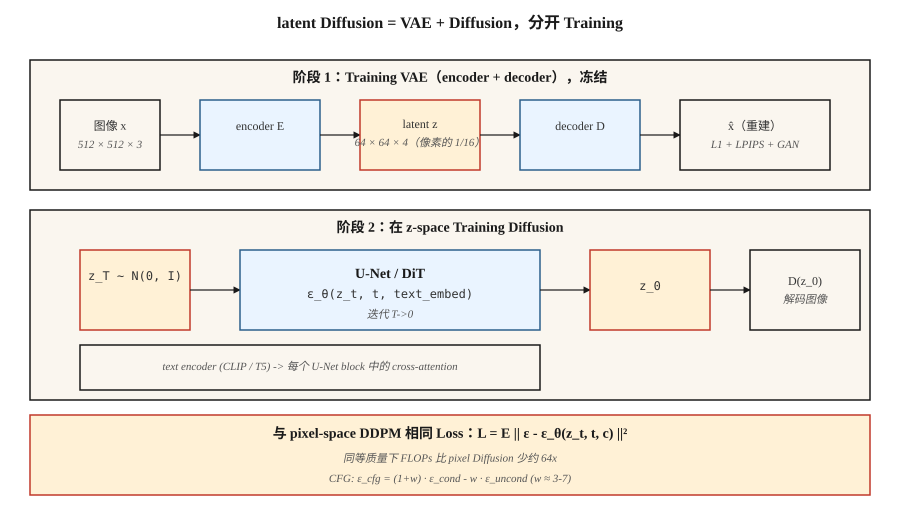

# Latent Diffusion 与 Stable Diffusion

> 在 512×512 图像上做 pixel-space diffusion，在计算上堪称战争罪。Rombach et al. (2022) 注意到，生成一张图像并不需要全部 786k 维度，你需要的是足以捕捉语义结构的维度，以及一个单独的 decoder 来处理其余部分。在 VAE 的 latent space 中运行 diffusion。这个想法就是 Stable Diffusion。

**Type:** Build
**Languages:** Python
**Prerequisites:** Phase 8 · 02 (VAE), Phase 8 · 06 (DDPM), Phase 7 · 09 (ViT)
**Time:** ~75 minutes

## 问题

512² 的 pixel-space diffusion 意味着 U-Net 要在形状为 `[B, 3, 512, 512]` 的 Tensor 上运行。对于一个 500M-param 的 U-Net，每个采样步骤约为 100 GFLOPS。五十步就是每张图 5 TFLOPS。在十亿张图像上训练时，计算账单会变得荒谬。

这些 FLOPs 大多花在把感知上不重要的细节推过网络上，也就是那些有损 VAE 本可以压缩掉的高频纹理。Rombach 的想法是：先训练一次 VAE（*first stage*），冻结它，然后完全在 4-channel 64×64 latent space（*second stage*）中运行 diffusion。同一个 U-Net。像素数是 1/16。FLOPs 约少 64 倍，质量相当。

这就是 Stable Diffusion 配方。SD 1.x / 2.x 使用一个 860M U-Net 处理 `64×64×4` latents，SDXL 使用一个 2.6B U-Net 处理 `128×128×4`，SD3 用带 flow matching 的 Diffusion Transformer (DiT) 替换了 U-Net。Flux.1-dev (Black Forest Labs, 2024) 发布了一个 12B-param DiT-MMDiT。它们都运行在同一个两阶段底座上。

## 概念



**两个阶段，分别训练。**

1. **Stage 1 — VAE.** Encoder `E(x) → z`，decoder `D(z) → x`。目标压缩率：每个空间轴下采样 8×，再调整 channel，使总 latent size 约为 pixel count 的 1/16。Loss = reconstruction (L1 + LPIPS perceptual) + KL（权重很小，使 `z` 不会被强行推得太 Gaussian，因为我们不需要从 `z` 做精确采样）。通常还会配合 adversarial loss 训练，让 decode 出来的图像更锐利。

2. **Stage 2 — 在 `z` 上做 diffusion。** 把 `z = E(x_real)` 当作数据。训练一个 U-Net（或 DiT）去 denoise `z_t`。推理时：通过 diffusion 采样 `z_0`，然后 `x = D(z_0)`。

**文本 conditioning。** 还有两个额外组件。一个冻结的 text encoder（SD 1.x 用 CLIP-L，SD 2/XL 用 CLIP-L+OpenCLIP-G，SD3 和 Flux 用 T5-XXL）。一个 cross-attention 注入：每个 U-Net block 接收 `[Q = image features, K = V = text tokens]` 并把它们混合进去。Tokens 是文本影响图像的唯一方式。

**Loss Function 与 Lesson 06 完全相同。** 同样是在 noise 上做 DDPM / flow matching MSE。你只是替换了数据域。

## 架构变体

| Model | Year | Backbone | Latent shape | Text encoder | Params |
|-------|------|----------|--------------|--------------|--------|
| SD 1.5 | 2022 | U-Net | 64×64×4 | CLIP-L (77 tokens) | 860M |
| SD 2.1 | 2022 | U-Net | 64×64×4 | OpenCLIP-H | 865M |
| SDXL | 2023 | U-Net + refiner | 128×128×4 | CLIP-L + OpenCLIP-G | 2.6B + 6.6B |
| SDXL-Turbo | 2023 | Distilled | 128×128×4 | same | 1-4 step sampling |
| SD3 | 2024 | MMDiT (multimodal DiT) | 128×128×16 | T5-XXL + CLIP-L + CLIP-G | 2B / 8B |
| Flux.1-dev | 2024 | MMDiT | 128×128×16 | T5-XXL + CLIP-L | 12B |
| Flux.1-schnell | 2024 | MMDiT distilled | 128×128×16 | T5-XXL + CLIP-L | 12B, 1-4 step |

趋势是：用 DiT（作用于 latent patches 的 transformer）替换 U-Net，扩展 text encoder（T5 在 prompt adherence 上胜过 CLIP），增加 latent channels（4 → 16 带来更多细节余量）。


```figure
noise-schedule
```

## 构建它

`code/main.py` 把一个玩具 1-D “VAE”（identity encoder + decoder，仅用于演示；真正的 VAE 会是 conv net）叠在 Lesson 06 的 DDPM 之上，并通过 classifier-free guidance 加入 class conditioning。它展示了同一个 diffusion loss 无论运行在原始 1-D 值上，还是运行在 encoded values 上都有效，这就是关键洞见。

### 步骤 1： encoder/decoder

```python
def encode(x):    return x * 0.5          # toy "compression" to smaller scale
def decode(z):    return z * 2.0
```

真正的 VAE 有训练得到的权重。出于教学目的，这个线性映射已经足以说明 diffusion 可以在 `z` 上操作，而不关心原始数据空间。

### 步骤 2： 在 `z`-space 中做 diffusion

与 Lesson 06 相同的 DDPM。网络看到的数据是 `z = E(x)`。采样出 `z_0` 后，用 `D(z_0)` decode。

### 步骤 3: classifier-free guidance

训练期间，10% 的时间丢弃 class label（替换为 null token）。推理时，同时计算 `ε_cond` 和 `ε_uncond`，然后：

```python
eps_cfg = (1 + w) * eps_cond - w * eps_uncond
```

`w = 0` = 无 guidance（完全多样性），`w = 3` = 默认值，`w = 7+` = 饱和 / 过锐化。

### 步骤 4： 文本 conditioning（概念，不是代码）

把 class label 替换为冻结 text encoder 的输出。通过 cross-attention 把 text embedding 输入 U-Net：

```python
h = h + CrossAttention(Q=h, K=text_embed, V=text_embed)
```

这是 class-conditional diffusion model 与 Stable Diffusion 之间唯一实质性的区别。

## 陷阱

- **VAE-scale mismatch。** SD 1.x VAEs 在 encoding 后会应用一个缩放常数（`scaling_factor ≈ 0.18215`）。忘记这一点会让 U-Net 在方差严重错误的 latents 上训练。每个 checkpoint 都带有这个值。
- **Text encoder silently wrong。** SD3 需要带 >=128 tokens 的 T5-XXL，fallback 到仅 CLIP 会有损。始终检查 `use_t5=True`，否则 prompt fidelity 会崩。
- **混用 latent spaces。** SDXL、SD3、Flux 都使用不同的 VAEs。在 SDXL latents 上训练的 LoRA 不能用于 SD3。Hugging Face diffusers 0.30+ 会拒绝加载不匹配的 checkpoints。
- **CFG too high。** `w > 10` 会生成饱和、油腻的图像，并以牺牲多样性为代价过拟合 prompt。甜点区间是 `w = 3-7`。
- **Negative prompts leaking。** 空的 negative prompt 会变成 null token；填充过的 negative prompt 会变成 `ε_uncond`。这两者并不相同；有些 pipelines 会静默默认使用 null。

## 使用它

2026 年的生产栈：

| Target | Recommended backbone |
|--------|----------------------|
| 窄领域、配对数据、从零训练模型 | SDXL fine-tune (LoRA / full) — 最快交付 |
| 开放域 text-to-image，开放权重 | Flux.1-dev (12B, Apache / non-commercial) 或 SD3.5-Large |
| 最快推理，开放权重 | Flux.1-schnell (1-4 step, Apache) 或 SDXL-Lightning |
| 最佳 prompt adherence，托管服务 | GPT-Image / DALL-E 3 (still), Midjourney v7, Imagen 4 |
| 编辑工作流 | Flux.1-Kontext (Dec 2024) — 原生接受 image + text |
| 研究、baseline | SD 1.5 — 古老但研究充分 |

## 交付它

保存 `outputs/skill-sd-prompter.md`。Skill 接收一个文本 prompt + 目标风格，并输出：model + checkpoint、CFG scale、sampler、negative prompt、resolution、可选的 ControlNet/IP-Adapter 组合，以及一个逐步 QA checklist。

## 练习

1. **Easy.** 使用 guidance `w ∈ {0, 1, 3, 7, 15}` 运行 `code/main.py`。记录每个 class 的 mean sample。在什么 `w` 下，class means 会偏离真实数据均值？
2. **Medium.** 把玩具线性 encoder 替换为 tanh-MLP encoder/decoder 对，并加入 reconstruction loss。在新的 latents 上重新训练 diffusion。sample quality 会变化吗？
3. **Hard.** 使用 diffusers 搭建一个真正的 Stable Diffusion 推理：加载 `sdxl-base`，用 CFG=7 运行 30 个 Euler steps，并计时。然后切换到 `sdxl-turbo`，用 4 steps 和 CFG=0。同一主体，不同质量，描述发生了什么变化以及原因。

## 关键术语

| Term | What people say | What it actually means |
|------|-----------------|-----------------------|
| First stage | “The VAE” | 训练好的 encoder/decoder 对；把 512² 压缩到 64²。 |
| Second stage | “The U-Net” | latent space 上的 diffusion model。 |
| CFG | “Guidance scale” | `(1+w)·ε_cond - w·ε_uncond`；调节 conditioning strength。 |
| Null token | “Empty prompt embed” | 用于 `ε_uncond` 的 unconditional embed。 |
| Cross-attention | “How text gets in” | 每个 U-Net block 都以 text tokens 作为 K 和 V 进行 attention。 |
| DiT | “Diffusion Transformer” | 用作用于 latent patches 的 transformer 替换 U-Net；扩展性更好。 |
| MMDiT | “Multi-modal DiT” | SD3 的架构：带 joint attention 的文本与图像流。 |
| VAE scaling factor | “Magic number” | 将 latents 除以约 5.4，使 diffusion 在 unit-variance 空间中运行。 |

## 生产说明：在 8GB 消费级 GPU 上运行 Flux-12B

参考 Flux 集成是经典的“我有一张消费级 GPU，能交付吗？”配方。技巧就是把生产推理文献列出的同一个三旋钮配方应用到 diffusion DiT：

1. **Staggered loading。** Flux 有三个不需要同时存在于 VRAM 中的网络：T5-XXL text encoder（fp32 下约 10 GB）、CLIP-L（小）、12B MMDiT，以及 VAE。先 encode prompt，*delete* encoders，加载 DiT，denoise，*delete* DiT，加载 VAE，decode。消费级 8GB GPUs 一次只能容纳一个 stage。
2. **通过 bitsandbytes 做 4-bit quantization。** 在 T5 encoder 和 DiT 上都使用 `BitsAndBytesConfig(load_in_4bit=True, bnb_4bit_compute_dtype=torch.bfloat16)`。内存减少 8×，根据 Aritra 的 benchmarks（notebook 中有链接），text-to-image 的质量下降几乎不可察觉。
3. **CPU offload。** `pipe.enable_model_cpu_offload()` 会在每次 forward pass 前进时自动在 CPU 和 GPU 之间交换 modules。增加 10-20% latency，但能让 pipeline 跑起来。

内存账是：`10 GB T5 / 8 = 1.25 GB` quantized，`12 B params × 0.5 bytes = ~6 GB` quantized DiT，再加上 activations。用 stas00 的说法，这是 TP=1 inference 的极端情况：没有 model parallelism，最大化 quantization。生产环境中你会在 H100s 上跑 TP=2 或 TP=4；对于单台开发笔记本，这就是配方。

## 延伸阅读

- [Rombach et al. (2022). High-Resolution Image Synthesis with Latent Diffusion Models](https://arxiv.org/abs/2112.10752) — Stable Diffusion。
- [Podell et al. (2023). SDXL: Improving Latent Diffusion Models for High-Resolution Image Synthesis](https://arxiv.org/abs/2307.01952) — SDXL。
- [Peebles & Xie (2023). Scalable Diffusion Models with Transformers (DiT)](https://arxiv.org/abs/2212.09748) — DiT。
- [Esser et al. (2024). Scaling Rectified Flow Transformers for High-Resolution Image Synthesis](https://arxiv.org/abs/2403.03206) — SD3, MMDiT。
- [Ho & Salimans (2022). Classifier-Free Diffusion Guidance](https://arxiv.org/abs/2207.12598) — CFG。
- [Labs (2024). Flux.1 — Black Forest Labs announcement](https://blackforestlabs.ai/announcing-black-forest-labs/) — Flux.1 系列。
- [Hugging Face Diffusers docs](https://huggingface.co/docs/diffusers/index) — 上述每个 checkpoint 的参考实现。
