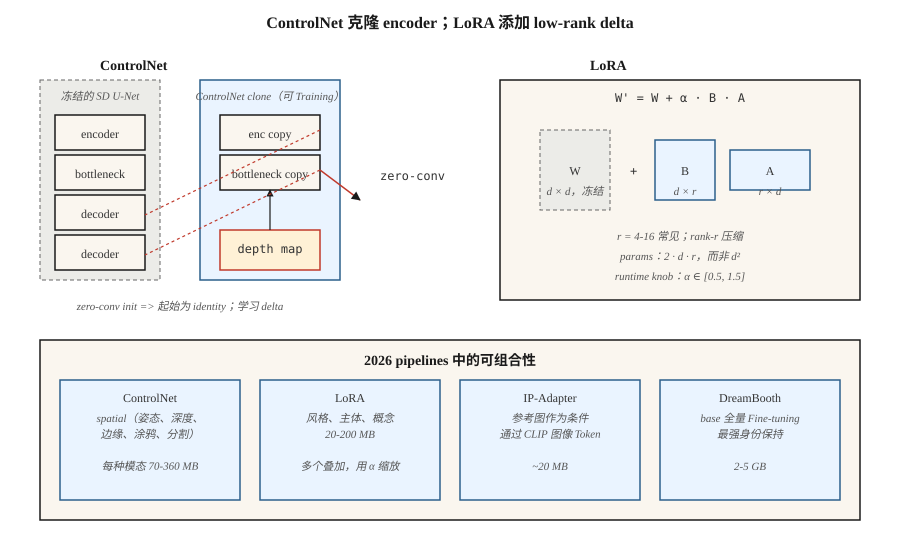

# ControlNet, LoRA & Conditioning

> 仅靠文本是一种笨拙的控制信号。ControlNet 让你克隆一个 pretrained diffusion model，并用 depth map、pose skeleton、scribble 或 edge image 来引导它。LoRA 让你通过训练 1000 万个参数来 fine-tune 一个 2B-parameter 模型。二者结合，把 Stable Diffusion 从玩具变成了 2026 年各家机构都在交付的 image pipeline。

**Type:** Build
**Languages:** Python
**Prerequisites:** Phase 8 · 07 (Latent Diffusion), Phase 10 (LLMs from Scratch — LoRA 基础)
**Time:** ~75 minutes

## 问题

像 "a woman in a red dress walking a dog on a busy street" 这样的 prompt，并没有告诉模型狗在*哪里*、女人是什么*姿势*，或者街道的*透视关系*。文本大约只能固定你指定一张图像所需信息的 10%。其余部分是视觉信息，无法用文字高效描述。

为每一种信号（pose、depth、canny、segmentation）从零训练一个新的 conditional model，成本过高。你希望保持 2.6B-param SDXL backbone 冻结，接上一个读取 conditioning 的小型 side-network，让它轻微调整 backbone 的中间特征。这就是 ControlNet。

你还希望在不重新训练完整模型的情况下，教会模型新概念（你的脸、你的产品、你的风格）。你需要一个小 100x 的 delta。这就是 LoRA，即插入现有 attention weights 的 low-rank adapters。

ControlNet + LoRA + text = 2026 年实践者的工具箱。大多数生产级 image pipeline 会在 SDXL / SD3 / Flux base 之上叠加 2-5 个 LoRA、1-3 个 ControlNet，以及一个 IP-Adapter。

## 概念



### ControlNet (Zhang et al., 2023)

取一个 pretrained SD。*克隆* U-Net 的 encoder 半边。冻结原始模型。训练这个克隆版本，让它接受一个额外的 conditioning input（edges、depth、pose）。用 *zero-convolution* skip connections（初始化为零的 1×1 convs，一开始是 no-op，随后学习 delta）把克隆版本连接回原始模型的 decoder 半边。

```
SD U-Net decoder:   ... ← orig_enc_features + zero_conv(controlnet_enc(condition))
```

Zero-conv 初始化意味着 ControlNet 一开始等同于 identity，即使训练前也不会造成损害。用标准 diffusion loss，在 1M 个 (prompt, condition, image) triples 上训练。

每种 modality 的 ControlNet 会作为小型 side model 发布（SDXL 约 ~360M，SD 1.5 约 ~70M）。你可以在 inference 时组合它们：

```
features += weight_a * control_a(depth) + weight_b * control_b(pose)
```

### LoRA (Hu et al., 2021)

对于模型中任意 linear layer `W ∈ R^{d×d}`，冻结 `W` 并添加一个 low-rank delta：

```
W' = W + ΔW,  ΔW = B @ A,  A ∈ R^{r×d},  B ∈ R^{d×r}
```

其中 `r << d`。对 attention 来说，rank 4-16 是标准配置；对重度 fine-tune 来说，rank 64-128 更常见。新增参数数量是 `2 · d · r`，而不是 `d²`。对于 `d=640` 的 SDXL attention，`r=16` 时每个 adapter 只有 20k 参数，而不是 410k，减少了 20x。放到整个模型上，一个 LoRA 通常是 20-200MB，而 base 是 5GB。

在 inference 时，你可以缩放 LoRA：`W' = W + α · B @ A`。`α = 0.5-1.5` 很常见。多个 LoRA 会以加法方式叠加（通常需要注意它们会以非线性方式相互影响）。

### IP-Adapter (Ye et al., 2023)

一个很小的 adapter，接受一张*图像*作为 conditioning（与文本一起）。它使用 CLIP image encoder 生成 image tokens，并将它们与 text tokens 一起注入 cross-attention。每个 base model 约 ~20MB。它让你无需 LoRA，也能实现“生成一张具有这张参考图风格的图像”。

## 可组合性Matrix

| Tool | 它控制什么 | Size | 何时使用 |
|------|------------|------|----------|
| ControlNet | 空间结构（pose、depth、edges） | 70-360MB | 精确 layout、composition |
| LoRA | 风格、主体、概念 | 20-200MB | 个性化、风格 |
| IP-Adapter | 来自 reference image 的风格或主体 | 20MB | 文本无法描述外观 |
| Textual Inversion | 将单个概念作为新 token | 10KB | 旧方案，大多已被 LoRA 替代 |
| DreamBooth | 对主体做 full fine-tune | 2-5GB | 强身份一致性、高计算成本 |
| T2I-Adapter | 更轻量的 ControlNet 替代方案 | 70MB | Edge devices、inference budget |

ControlNet ≈ 空间。LoRA ≈ 语义。两者一起使用。

```figure
v4-controlnet-zero
```

## 构建它

`code/main.py` 在 1-D 上模拟这两种机制：

1. **LoRA。** 一个 pretrained linear layer `W`。冻结它。训练一个 low-rank `B @ A`，使 `W + BA` 匹配目标 linear layer。展示 `r = 1` 足以完美学习一个 rank-1 correction。

2. **ControlNet-lite。** 一个 “frozen base” predictor，以及一个读取额外信号的 “side network”。side network 的输出由一个初始化为零的可学习标量 gate 控制（我们的 zero-conv 版本）。训练并观察 gate 逐步升高。

### 步骤 1： LoRA math

```python
def lora(W, A, B, x, alpha=1.0):
    # W is frozen; A, B are the trainable low-rank factors.
    return [W[i][j] * x[j] for i, j in ...] + alpha * (B @ (A @ x))
```

### 步骤 2: zero-init side network

```python
side_out = control_net(x, condition)
gated = gate * side_out  # gate initialized to 0
h = base(x) + gated
```

在 step 0，输出与 base 完全相同。训练早期会缓慢更新 `gate`，不会出现灾难性漂移。

## 常见坑

- **LoRA 过度缩放。** `α = 2` 或 `α = 3` 是一种常见的“让它更强”的 hack，但会产生过度风格化或损坏的输出。保持 `α ≤ 1.5`。
- **ControlNet weight 冲突。** 同时使用 weight 1.0 的 Pose ControlNet 和 weight 1.0 的 Depth ControlNet 通常会过冲。权重总和 ≈ 1.0 是安全默认值。
- **LoRA 用在错误的 base 上。** SDXL LoRA 在 SD 1.5 上会静默 no-op，因为 attention dimensions 不匹配。Diffusers 在 0.30+ 会发出警告。
- **Textual Inversion 漂移。** 在一个 checkpoint 上训练的 tokens，换到另一个 checkpoint 会严重漂移。LoRA 更可移植。
- **LoRA weight-merging 和存储。** 你可以把 LoRA bake 到 base model weights 中，以获得更快 inference（没有 runtime addition），但会失去在 runtime 缩放 `α` 的能力。保留两个版本。

## 使用它

| Goal | 2026 pipeline |
|------|---------------|
| 复现某个品牌的艺术风格 | 在约 ~30 张精选图像上训练的 rank 32 LoRA |
| 把我的脸放进生成图像 | DreamBooth 或 LoRA + IP-Adapter-FaceID |
| 指定 pose + prompt | ControlNet-Openpose + SDXL + text |
| Depth-aware composition | ControlNet-Depth + SD3 |
| Reference + prompt | IP-Adapter + text |
| 精确 layout | ControlNet-Scribble 或 ControlNet-Canny |
| 替换背景 | ControlNet-Seg + Inpainting（Lesson 09） |
| 快速 1-step 风格 | SDXL-Turbo 上的 LCM-LoRA |

## 交付它

保存 `outputs/skill-sd-toolkit-composer.md`。该 skill 接收一个任务（input assets：prompt、可选 reference image、可选 pose、可选 depth、可选 scribble），并输出 tool stack、weights 和可复现的 seed protocol。

## 练习

1. **Easy。** 在 `code/main.py` 中，将 LoRA rank `r` 从 1 改到 4。LoRA 在什么 rank 下能精确匹配 rank-2 target delta？
2. **Medium。** 在两个 target transforms 上训练两个独立的 LoRA。将它们一起加载，并展示它们的加法交互。什么时候这种交互会打破线性？
3. **Hard。** 使用 diffusers 叠加：SDXL-base + Canny-ControlNet（weight 0.8）+ 一个 style LoRA（α 0.8）+ IP-Adapter（weight 0.6）。随着 stack weights 变化，测量 FID-vs-prompt-adherence trade-off。

## 关键术语

| Term | 人们怎么说 | 它实际意味着什么 |
|------|------------|------------------|
| ControlNet | "Spatial control" | 克隆 encoder + zero-conv skips；读取一张 conditioning image。 |
| Zero convolution | "Starts as identity" | 初始化为零的 1×1 conv；ControlNet 一开始是 no-op。 |
| LoRA | "Low-rank adapter" | `W + B @ A`，`r << d`；比 full fine-tune 少 100x 参数。 |
| rank r | "The knob" | LoRA 压缩；典型值为 4-16，重度个性化使用 64+。 |
| α | "LoRA strength" | LoRA delta 的 runtime scaling。 |
| IP-Adapter | "Reference image" | 通过 CLIP-image tokens 实现的小型 image-conditioning adapter。 |
| DreamBooth | "Full subject fine-tune" | 在约 ~30 张主体图像上训练完整模型。 |
| Textual Inversion | "New token" | 只学习一个新的 word embedding；旧方案，大多已被替代。 |

## 生产说明：LoRA swaps、ControlNet lanes、multi-tenant serving

一个真实的 text-to-image SaaS 会在同一个 base checkpoint 上服务数百个 LoRA 和十几个 ControlNet。serving 问题很像 LLM multi-tenancy（生产文献中在 continuous batching 和 LoRAX / S-LoRA 下讨论 LLM 场景）：

- **Hot-swap LoRAs，不要 merge。** 将 `W' = W + α·B·A` merge 到 base 中，可以让每步 inference 快约 ~3-5%，但会冻结 `α` 和 base。把 LoRA 作为 rank-r deltas 热加载在 VRAM 中；diffusers 暴露了 `pipe.load_lora_weights()` + `pipe.set_adapters([...], adapter_weights=[...])`，可用于按请求激活。swap 成本是 `2 · d · r · num_layers` weights，即 MB 级、亚秒级。
- **ControlNet 作为第二条 attention lane。** 克隆的 encoder 与 base 并行运行。两个 weight 都为 1.0 的 ControlNet = 每步两次额外 forward passes，而不是一次 merged pass。Batch-size headroom 会二次下降。为每个 active ControlNet 预算约 ~1.5× step cost。
- **Quantized LoRAs 也适用。** 如果你量化了 base（见 Lesson 07，Flux on 8GB），LoRA delta 也能干净地量化到 8-bit 或 4-bit。QLoRA-style loading 让你可以在 4-bit Flux base 上叠加 5-10 个 LoRA，而不会撑爆内存。

Flux-specific：Niels 的 Flux-on-8GB notebook 将 base 量化到 4-bit；在该 quantized base 上叠加 style LoRA（`pipe.load_lora_weights("user/style-lora")`），并使用 `weight_name="pytorch_lora_weights.safetensors"`，仍然可以工作。这是 2026 年大多数 SaaS 机构交付的 recipe。

## 延伸阅读

- [Zhang, Rao, Agrawala (2023). Adding Conditional Control to Text-to-Image Diffusion Models](https://arxiv.org/abs/2302.05543) — ControlNet。
- [Hu et al. (2021). LoRA: Low-Rank Adaptation of Large Language Models](https://arxiv.org/abs/2106.09685) — LoRA（最初用于 LLMs；后来移植到 diffusion）。
- [Ye et al. (2023). IP-Adapter: Text Compatible Image Prompt Adapter](https://arxiv.org/abs/2308.06721) — IP-Adapter。
- [Mou et al. (2023). T2I-Adapter: Learning Adapters to Dig Out More Controllable Ability](https://arxiv.org/abs/2302.08453) — ControlNet 的更轻量替代方案。
- [Ruiz et al. (2023). DreamBooth: Fine Tuning Text-to-Image Diffusion Models for Subject-Driven Generation](https://arxiv.org/abs/2208.12242) — DreamBooth。
- [HuggingFace Diffusers — ControlNet / LoRA / IP-Adapter docs](https://huggingface.co/docs/diffusers/training/controlnet) — 参考 pipelines。
