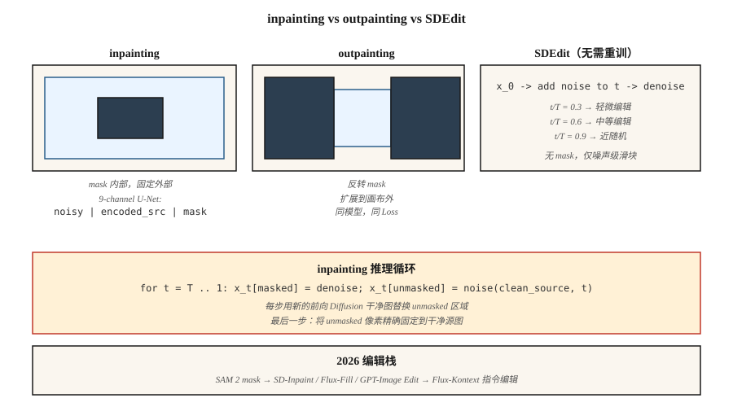

# Inpainting、Outpainting 与图像编辑

> Text-to-image 会创造新事物。Inpainting 会修复旧事物。在生产环境中，70% 可计费的图像工作都是编辑：替换背景、移除 logo、扩展画布、重新生成一只手。Inpainting 正是 diffusion 体现价值的地方。

**Type:** Build
**Languages:** Python
**Prerequisites:** Phase 8 · 07 (Latent Diffusion), Phase 8 · 08 (ControlNet & LoRA)
**Time:** ~75 minutes

## 问题

客户发来一张完美的产品照片，但背景里有一个分散注意力的标牌。你想擦掉这个标牌，并让其他所有部分都保持像素级一致。你不能从头运行 text-to-image，因为结果会有不同的颜色、不同的光照、不同的产品角度。你想只重新生成被 mask 的区域，并且希望重新生成的内容尊重周围上下文。

这就是 inpainting。它的变体包括：

- **Inpainting.** 在 mask 内重新生成，保留外部像素。
- **Outpainting.** 在 mask 外重新生成（或扩展到画布之外），保留内部。
- **Image editing.** 重新生成整张图，但保持与原图的语义或结构一致性（SDEdit, InstructPix2Pix）。

2026 年的每条 diffusion pipeline 都带有 inpainting 模式。Flux.1-Fill、Stable Diffusion Inpaint、SDXL-Inpaint、DALL-E 3 Edit。它们基于同一个原理。

## 概念



### 朴素方法（以及为什么它是错的）

带着 mask 运行标准 text-to-image。在每个 sampling step，把 noisy latent 中未 mask 的区域替换为经过 forward-diffused 的干净图像。它能工作……但效果很差。边界 artifact 会渗出，因为模型不知道 mask 区域里应该有什么。

### 正确的 inpainting model

训练一个修改过的 U-Net，让它接收 9 个 input channels，而不是 4 个：

```
input = concat([ noisy_latent (4ch), encoded_image (4ch), mask (1ch) ], dim=channel)
```

额外的 channels 是 VAE-encoded source image 的副本，加上一个单 channel mask。训练时，你随机 mask 图像中的区域，并训练模型只对 mask 区域 denoise，同时把未 mask 区域作为干净的 conditioning signal 提供。推理时，模型可以“看到” mask 区域周围的内容，并生成连贯的补全。

SD-Inpaint、SDXL-Inpaint、Flux-Fill 都使用这种 9-channel（或类似）输入。Diffusers `StableDiffusionInpaintPipeline`、`FluxFillPipeline`。

### SDEdit (Meng et al., 2022) — 免费编辑

给源图像加噪到某个中间 `t`，然后使用新的 prompt 从 `t` 反向运行到 0。不需要重新训练。起始 `t` 的选择会在保真度和创作自由度之间权衡：

- `t/T = 0.3` → 几乎与源图一致，只做小的风格变化
- `t/T = 0.6` → 中等编辑，保留粗略结构
- `t/T = 0.9` → 接近从 noise 生成，对源图保留最少

### InstructPix2Pix (Brooks et al., 2023)

在 `(input_image, instruction, output_image)` 三元组上 fine-tune 一个 diffusion model。推理时，同时基于输入图像和文本指令（“make it sunset”、“add a dragon”）进行 conditioning。有两个 CFG scales：image scale 和 text scale。

### RePaint (Lugmayr et al., 2022)

保留一个标准 unconditional diffusion model。在每个 reverse step，进行 resample：偶尔跳回更 noisy 的状态并重新生成。这样可以避免边界 artifact。当你没有训练好的 inpainting model 时使用。

```figure
inpaint-mask-reinject
```

## Build It

`code/main.py` 在 5 维数据上实现了一个玩具版 1-D inpainting 方案。我们在 5-D mixture data 上训练一个 DDPM，其中每个样本是来自两个 cluster 之一的 5 个 float。推理时，我们“mask” 5 个维度中的 2 个，在每一步注入未 mask 的 3 个维度的 noisy-forward 版本，并只重新生成被 mask 的维度。

### Step 1：5-D DDPM data

```python
def sample_data(rng):
    cluster = rng.choice([0, 1])
    center = [-1.0] * 5 if cluster == 0 else [1.0] * 5
    return [c + rng.gauss(0, 0.2) for c in center], cluster
```

### Step 2：在所有 5 个维度上训练 denoiser

标准 DDPM。Net 对 5-D noisy input 输出 5-D noise prediction。

### Step 3：推理时使用 mask-aware reverse

```python
def inpaint_step(x_t, mask, clean_image, alpha_bars, t, rng):
    # replace unmasked dims with a freshly noised version of the clean source
    a_bar = alpha_bars[t]
    for i in range(len(x_t)):
        if not mask[i]:
            x_t[i] = math.sqrt(a_bar) * clean_image[i] + math.sqrt(1 - a_bar) * rng.gauss(0, 1)
    # ...then run the normal reverse step on x_t
```

这是朴素方法，并且它在玩具 1-D 数据上有效。真实图像 inpainting 使用 9-channel 输入，因为纹理一致性更重要。

### Step 4：outpainting

Outpainting 就是把 mask 反转后的 inpainting：mask 新的（之前不存在的）画布区域，用原图填充其余部分。训练目标完全相同。

## 陷阱

- **Seams.** 朴素方法会留下可见边界，因为 Gradient 信息不会跨 mask 流动。修复方式：把 mask 膨胀 8-16 个像素，或使用正确的 inpainting model。
- **Mask leakage.** 如果 conditioning image 的未 mask 区域质量低或有 noise，它会污染 mask 内的生成。先 denoise 或轻微 blur。
- **CFG interacts with mask size.** 小 mask 上使用高 CFG 会得到过饱和 patch。小编辑应降低 CFG。
- **SDEdit fidelity cliff.** 从 `t/T = 0.5` 到 `t/T = 0.6` 可能会丢失主体身份。需要 sweep 并 checkpoint。
- **Prompt mismatch.** Prompt 应该描述*整张*图，而不只是新内容。用 “A cat sitting on a chair”，而不是 “a cat”。

## Use It

| Task | Pipeline |
|------|----------|
| 移除物体，小 mask | SD-Inpaint 或 Flux-Fill，标准 prompt |
| 替换天空 | SD-Inpaint + "blue sky at sunset" |
| 扩展画布 | SDXL outpaint mode（8px feather）或带 outpaint mask 的 Flux-Fill |
| 重新生成手 / 脸 | SD-Inpaint，prompt 重新描述主体 + ControlNet-Openpose |
| 改变某个区域的风格 | 在 mask 区域上使用 `t/T=0.5` 的 SDEdit |
| "Make it sunset" | InstructPix2Pix 或 Flux-Kontext |
| 背景替换 | SAM mask → SD-Inpaint |
| 超高保真 | 最难场景使用 Flux-Fill 或 GPT-Image（hosted） |

SAM（Meta 的 Segment Anything，2023）+ diffusion inpaint 是 2026 年的背景移除 pipeline。SAM 2（2024）适用于视频。

## Ship It

保存 `outputs/skill-editing-pipeline.md`。Skill 接收一张原图 + 编辑描述 + 可选 mask（或 SAM prompt），并输出：mask 生成方法、base model、CFG scales（image + text）、SDEdit-t 或 inpainting mode，以及 QA checklist。

## 练习

1. **Easy.** 在 `code/main.py` 中，把被 mask 的维度比例从 0.2 变到 0.8。在哪个比例下，inpaint 质量（mask 维度中的 residual）等于 unconditional generation？
2. **Medium.** 实现 RePaint：每到第 10 个 reverse step，跳回 5 步（加噪）并重新 denoise。测量它是否降低 mask 边缘的边界 residual。
3. **Hard.** 使用 Hugging Face diffusers 比较：SD 1.5 Inpaint + ControlNet-Openpose 与 Flux.1-Fill，在 20 个 face-regeneration 任务上测试。分别评分 pose adherence 和 identity preservation。

## 关键术语

| Term | 人们的说法 | 实际含义 |
|------|------------|----------|
| Inpainting | “填洞” | 在 mask 内重新生成；保留外部像素。 |
| Outpainting | “扩展画布” | 在画布外重新生成；保留内部。 |
| 9-channel U-Net | “正确的 inpainting model” | 输入为 `noisy \| encoded-source \| mask` 的 U-Net。 |
| SDEdit | “带 noise level 的 img2img” | 加噪到时间 `t`，用新 prompt denoise。 |
| InstructPix2Pix | “纯文本编辑” | 在 (image, instruction, output) 三元组上 fine-tuned 的 diffusion。 |
| RePaint | “无需重新训练” | 在 reverse 过程中周期性 re-noise，以减少 seams。 |
| SAM | “Segment Anything” | 通过点击或框生成 mask；与 inpaint 配合使用。 |
| Flux-Kontext | “带上下文编辑” | 接收 reference image + instruction 进行编辑的 Flux 变体。 |

## 生产提示：edit pipelines 对延迟很敏感

用户编辑图像时，期望往返低于 5 秒。在 L4 上，1024² 的 30-step SDXL-Inpaint 需要 3-4 秒，再加上 SAM mask generation（约 200 ms）和 VAE encode/decode（合计约 500 ms）。从生产视角看，这受 TTFT 限制，而不是吞吐限制：batch 1、低并发、尽量压缩每个阶段：

- **SAM-H 是慢的那个。** 1024² 下 SAM-H 约 200 ms；SAM-ViT-B 约 40 ms，质量损失很小。SAM 2（video）会增加时间维度开销；不要把它用于单图编辑。
- **能跳过 encode 就跳过。** `pipe.image_processor.preprocess(img)` 会 encode 到 latents。如果你有上一次生成的 latents（迭代式编辑 UI 中很常见），直接通过 `latents=...` 传入，跳过一次 VAE encode。
- **Mask dilation 也影响吞吐。** 小 mask 意味着 U-Net forward pass 的大部分计算被浪费（未 mask 的像素反正会被 clamp）。`diffusers` 的 `StableDiffusionInpaintPipeline` 无论如何都会运行完整 U-Net；只有 9-channel 的 proper-inpaint 变体能利用 masked compute。
- **Flux-Kontext 是 2025 年的答案。** 对 `(source_image, instruction)` 做单次 forward pass：没有单独的 mask，没有 SDEdit noise sweep。在 H100 上约 1.5 秒完成一次编辑。架构上的教训：合并阶段。

## 延伸阅读

- [Lugmayr et al. (2022). RePaint: Inpainting using Denoising Diffusion Probabilistic Models](https://arxiv.org/abs/2201.09865) — 无需训练的 inpainting。
- [Meng et al. (2022). SDEdit: Guided Image Synthesis and Editing with Stochastic Differential Equations](https://arxiv.org/abs/2108.01073) — SDEdit。
- [Brooks, Holynski, Efros (2023). InstructPix2Pix](https://arxiv.org/abs/2211.09800) — 文本指令编辑。
- [Kirillov et al. (2023). Segment Anything](https://arxiv.org/abs/2304.02643) — SAM，mask 来源。
- [Ravi et al. (2024). SAM 2: Segment Anything in Images and Videos](https://arxiv.org/abs/2408.00714) — video SAM。
- [Hertz et al. (2022). Prompt-to-Prompt Image Editing with Cross-Attention Control](https://arxiv.org/abs/2208.01626) — Attention 层级编辑。
- [Black Forest Labs (2024). Flux.1-Fill and Flux.1-Kontext](https://blackforestlabs.ai/flux-1-tools/) — 2024 tooling。
