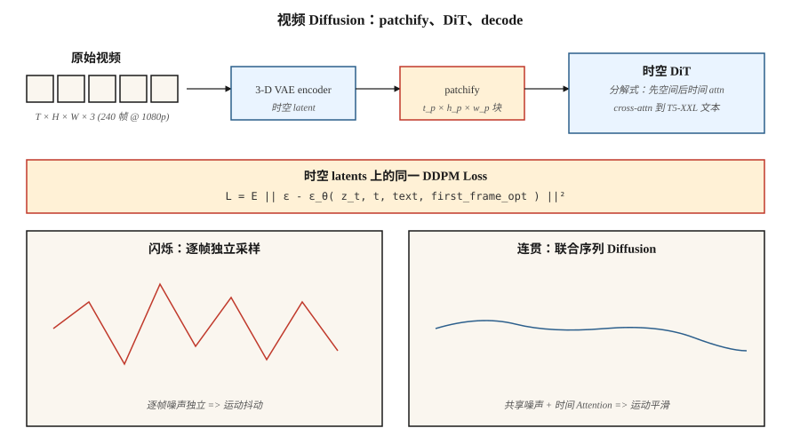

# 视频生成

> 图像是一个 2-D tensor。视频是一个 3-D tensor。理论相同；compute 难度高出 10-100x。OpenAI 的 Sora（2024 年 2 月）证明了这是可行的。到 2026 年，Veo 2、Kling 1.5、Runway Gen-3、Pika 2.0 和 WAN 2.2 已经能从文本生成 1080p 的生产级视频，而 open-weights stack（CogVideoX、HunyuanVideo、Mochi-1、WAN 2.2）落后约 12 个月。

**Type:** Build
**Languages:** Python
**先修要求:** Phase 8 · 07 (Latent Diffusion), Phase 7 · 09 (ViT), Phase 8 · 06 (DDPM)
**Time:** ~45 minutes

## 问题

一个 10 秒、1080p、24fps 的视频包含 240 帧，每帧 1920×1080×3 pixels。每个 clip 的原始数据约为 1.5 GB。Pixel-space diffusion 不可行。你需要：

1. **时空压缩。** 一个 VAE，把视频而不是单帧编码为 spatial-temporal patches 序列。
2. **时间一致性。** 多帧需要在数秒内共享内容、光照和对象身份。网络必须对运动建模。
3. **Compute budget。** 在相同 model size 下，视频训练比图像贵 10-100x。
4. **Conditioning。** 文本、图像（第一帧）、音频或另一个视频。大多数生产模型都接受这四种。

解决这个问题的架构是应用于 spatiotemporal patches 的 **Diffusion Transformer (DiT)**，在巨大的（prompt、caption、video）数据集上训练。Diffusion loss 与 Lesson 06 相同。

## 概念



### Patchify

使用 3D VAE（学习到的时空压缩）编码视频。latent 的 shape 是 `[T_latent, H_latent, W_latent, C_latent]`。拆分成大小为 `[t_p, h_p, w_p]` 的 patches。对于 Sora 风格的模型，`t_p = 1`（逐帧 patches）或 `t_p = 2`（每两帧）。一个 10 秒 1080p 视频会压缩成约 20,000-100,000 个 patches。

### Spatiotemporal DiT

一个 Transformer 处理扁平化的 patch 序列。每个 patch 都有一个 3D positional embedding（time + y + x）。Attention 通常会被 factorized：

- **Spatial attention** 在每一帧的 patches 内部进行。
- **Temporal attention** 在相同空间位置跨帧进行。
- **Full 3D attention** 昂贵 16-100x；只在低分辨率或研究中使用。

### 文本 conditioning

使用大型 text encoder 进行 Cross-attention（Sora 使用 T5-XXL，CogVideoX-5B 使用 T5-XXL）。长 prompts 很重要，Sora 的训练集包含 GPT 生成的密集 re-captions，平均每个 clip 200 tokens。

### 训练

在 spatiotemporal latents 上使用标准 diffusion loss（ε 或 v prediction）。数据：web video + 约 100M curated clips + synthetic text captions。Compute：即使是小型研究运行也需要 10,000+ GPU hours；Sora-scale 则是 100,000+。

## 2026 年生产格局

| Model | Date | Max duration | Max res | Open weights? | Notable |
|-------|------|--------------|---------|---------------|---------|
| Sora (OpenAI) | 2024-02 | 60s | 1080p | No | 第一个在 scale 下展示 world simulator 属性的模型 |
| Sora Turbo | 2024-12 | 20s | 1080p | No | 推理快 5x 的生产版 Sora |
| Veo 2 (Google) | 2024-12 | 8s | 4K | No | 2025 年最高质量 + physics |
| Veo 3 | 2025 Q3 | 15s | 4K | No | 原生音频和更强的相机控制 |
| Kling 1.5 / 2.1 (Kuaishou) | 2024-2025 | 10s | 1080p | No | 2025 Q1 最好的人体运动 |
| Runway Gen-3 Alpha | 2024-06 | 10s | 768p | No | 在其之上的专业视频工具 |
| Pika 2.0 | 2024-10 | 5s | 1080p | No | 最强角色一致性 |
| CogVideoX (THUDM) | 2024 | 10s | 720p | Yes (2B, 5B) | 第一个开放的 5B-scale 视频模型 |
| HunyuanVideo (Tencent) | 2024-12 | 5s | 720p | Yes (13B) | 2024 年末开放 SOTA |
| Mochi-1 (Genmo) | 2024-10 | 5.4s | 480p | Yes (10B) | 许可证最宽松 |
| WAN 2.2 (Alibaba) | 2025-07 | 5s | 720p | Yes | 2025 年中最强开放模型 |

Open weights 在视频领域缩小差距的速度比图像领域更快：到 2026 年中，HunyuanVideo + WAN 2.2 LoRAs 已经驱动了大多数 open-source workflows。

## 构建它

`code/main.py` 模拟核心的 spatiotemporal DiT 思路：patchify 一个小型合成视频，加入 per-patch position embedding，并用 transformer-style attention 在 patches 上对整个序列 denoise。不用 numpy；纯 Python。我们展示了即使在 1-D 中，当相邻帧 patches 共享 denoiser 和 position embeddings 时，也会出现时间一致性。

### 步骤 1： patchify 一个合成 1-D "video"

```python
def make_video(T_frames=8, rng=None):
    # a "video" is a sequence of 1-D values following a smooth trajectory
    base = rng.gauss(0, 1)
    return [base + 0.3 * t + rng.gauss(0, 0.1) for t in range(T_frames)]
```

### 步骤 2： 每帧的 position embedding

```python
def pos_embed(t, dim):
    return sinusoidal(t, dim)
```

### 步骤 3： denoiser 看到整个序列

我们的微型网络不是独立 denoise 每一帧，而是拼接所有帧值 + 它们的 position embeddings，并联合预测所有帧的 noise。

### 步骤 4： 时间一致性测试

训练后，sample 一个视频。测量 frame-to-frame delta。如果模型学到了时间结构，deltas 会比独立 sample 每一帧更小。

## 陷阱

- **独立逐帧 sampling = flicker。** 如果你对每一帧分别运行 image diffusion，输出会 flicker，因为每一帧的 noise 是独立的。Video diffusion 通过 attention 或 shared noise 耦合这些帧来修复这一点。
- **朴素 3D attention = OOM。** 对一个 10 秒 1080p latent 做 full 3D attention 需要数千亿次操作。把它 factorize 为 spatial + temporal。
- **数据 captioning 比规模更重要。** Sora 相比之前工作的主要升级，是用约 10x 更详细的 captions 训练（GPT-4 重新标注 clips）。OpenAI 的技术报告对此说得很明确。
- **First-frame conditioning。** 大多数生产模型也接受一张图像作为第一帧。这是 "image-to-video" 模式；训练包含这个变体。
- **Physics drift。** 长 clips（>10s）会积累细微不一致。Sliding-window generation + keyframe anchoring 会有帮助。

## 使用它

| Use case | 2026 pick |
|----------|-----------|
| 最高质量 text-to-video，hosted | Veo 3 or Sora |
| 可控相机的 cinematic | Runway Gen-3 with motion brushes |
| 跨 clips 的角色一致性 | Pika 2.0 or Kling 2.1 |
| Open weights，快速 fine-tune | WAN 2.2 + LoRA |
| Image-to-video | WAN 2.2-I2V, Kling 2.1 I2V, or Runway |
| Audio-to-video lip sync | Veo 3 (native audio) or a dedicated lip-sync model |
| 视频编辑 | Runway Act-Two, Kling Motion Brush, Flux-Kontext (still-frame) |

在质量相当的情况下，视频每秒成本在 2024 到 2026 年间下降了 20x。

## 交付它

保存 `outputs/skill-video-brief.md`。Skill 接收一个 video brief（duration、aspect ratio、style、camera plan、subject consistency、audio），并输出：model + hosting、prompt scaffolding（camera language、subject description、motion descriptors）、seed + reproducibility protocol，以及 frame-level QA checklist。

## 练习

1. **Easy.** 在 `code/main.py` 中，比较 (a) independent per-frame sampling 和 (b) joint sequence sampling 的 frame-to-frame delta。报告 deltas 的 mean 和 variance。
2. **Medium.** 添加一个 first-frame condition：将 frame 0 pin 到给定值并 sample 其余部分。测量 pinned value 如何传播。
3. **Hard.** 使用 HuggingFace diffusers 在本地 GPU 上运行 CogVideoX-2B。对 720p、6 秒 clip 计时 20 个 inference steps。Profile spatiotemporal attention 以识别 bottleneck。

## 关键术语
| Term | What people say | What it actually means |
|------|-----------------|-----------------------|
| Video VAE | "3-D VAE" | 将 `(T, H, W, C)` 压缩为 spatiotemporal latent 的 Encoder。 |
| Patches | "The tokens" | latent 的固定大小 3-D blocks；作为 DiT 的输入。 |
| Factorized attention | "Spatial + temporal" | 先在空间上运行 Attention，再在时间上运行；跳过 full 3-D attention。 |
| Image-to-video (I2V) | "Animate this photo" | 模型接收一张图像 + 文本，并输出从它开始的视频。 |
| Keyframe conditioning | "Anchor frames" | Pin 特定帧来控制视频的 arc。 |
| Motion brush | "Directional hint" | 用户在图像上绘制 motion vectors 的 UI 输入。 |
| Re-captioning | "Dense captions" | 使用 LLM 用详细 prompts 重新标注训练 clips。 |
| Flicker | "Temporal artifact" | Frame-to-frame 不一致；通过 coupled denoising 修复。 |

## 生产说明：video latents 是 memory-bandwidth 问题

一个 10 秒 1080p、24 fps 的 clip 包含 240 frames × 1920 × 1080 × 3 ≈ 1.5 GB 原始 pixels。经过 4× video VAE compression（`2 × spatial × 2 × temporal`）后，latent 每次请求约为 100 MB。将它通过 spatiotemporal DiT 跑 30 steps、batch 1，你每 step 都要通过 HBM 移动约 3 GB，瓶颈是 memory bandwidth，而不是 FLOPs。

三个生产 knobs，都直接来自 production-inference literature inference chapter：

- **跨 DiT 的 TP。** Text-to-video models 通常 ≥10B params。4 个 H100 上 TP=4 是标准配置；405B-class models 使用 PP=2 × TP=2。每 step latency 随 TP 大致线性下降，直到撞上 all-reduce wall。
- **Frame batching = continuous batching。** 在 generation time，视频概念上是一批由 Attention 连接的 frames。Continuous batching（in-flight scheduling）适用：如果模型架构允许 sliding-window generation，可以在 frame `t-1` 正在返回时开始渲染 frame `t+1`。
- **Clip-level prefill cache。** 对 image-to-video 来说，first-frame conditioning 类似于 LLM 的 prompt prefill：计算一次，并在 temporal decoder passes 中复用。这实际上是视频的 KV-cache。

## 延伸阅读
- [Brooks et al. (2024). Video generation models as world simulators](https://openai.com/index/video-generation-models-as-world-simulators/) — Sora 技术报告。
- [Yang et al. (2024). CogVideoX: Text-to-Video Diffusion Models with An Expert Transformer](https://arxiv.org/abs/2408.06072) — CogVideoX。
- [Kong et al. (2024). HunyuanVideo: A Systematic Framework for Large Video Generative Models](https://arxiv.org/abs/2412.03603) — HunyuanVideo。
- [Genmo (2024). Mochi-1 Technical Report](https://www.genmo.ai/blog/mochi) — Mochi-1。
- [Alibaba (2025). WAN 2.2](https://wanvideo.io/) — 2025 年中开放 SOTA。
- [Ho, Salimans, Gritsenko et al. (2022). Video Diffusion Models](https://arxiv.org/abs/2204.03458) — 开创性 video diffusion 论文。
- [Blattmann et al. (2023). Align your Latents (Video LDM)](https://arxiv.org/abs/2304.08818) — Stable Video Diffusion 的前身。
