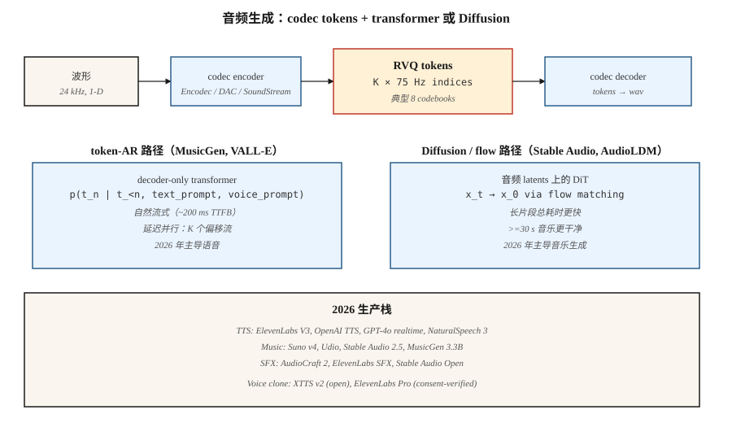

# 音频生成

> 音频是 16-48 kHz 的 1-D signal。一个五秒片段有 80-240k 个 sample。没有任何 Transformer 会直接 attend 这个序列。2026 年每个 production audio model 的解决方案都一样：neural codec（Encodec、SoundStream、DAC）把音频压缩成 50-75 Hz 的离散 Token，然后由 Transformer 或 Diffusion model 生成 Token。

**类型：** 构建
**语言：** Python
**先修要求：** Phase 6 · 02（Audio Features）、Phase 6 · 04（ASR）、Phase 8 · 06（DDPM）
**时间：** 约 45 分钟

## 问题

三类音频生成任务：

1. **Text-to-speech。** 给定文本，生成语音。干净语音是 narrow-band 的，并且有很强的 phonetic structure，已经可以通过 transformer-over-tokens 很好地解决。VALL-E（Microsoft）、NaturalSpeech 3、ElevenLabs、OpenAI TTS。
2. **音乐生成。** 给定一个 prompt（文本、旋律、chord progression、genre），生成音乐。分布宽得多。MusicGen（Meta）、Stable Audio 2.5、Suno v4、Udio、Riffusion。
3. **音频效果 / sound design。** 给定一个 prompt，生成环境声或 Foley。AudioGen、AudioLDM 2、Stable Audio Open。

这三者都运行在同一个基础之上：neural audio codec + token-AR 或 diffusion generator。

## 概念



### Neural audio codecs

Encodec（Meta，2022）、SoundStream（Google，2021）、Descript Audio Codec（DAC，2023）。一个 convolutional encoder 将 waveform 压缩成每个 timestep 一个 Vector；residual vector quantization（RVQ）把每个 Vector 转换成 K 个 codebook index 的级联。Decoder 将其还原。使用 8 个 RVQ codebook、75 Hz，可将 24 kHz 音频压缩为 2 kbps = 600 tokens/sec。

```
waveform (16000 samples/sec)
    └─ encoder conv ─┐
                     ├─ RVQ layer 1 → indices at 75 Hz
                     ├─ RVQ layer 2 → indices at 75 Hz
                     ├─ ...
                     └─ RVQ layer 8
```

### 其上的两种生成范式

**Token-autoregressive。** 将 RVQ Token 展平成一个序列，运行 decoder-only Transformer。MusicGen 使用 "delayed parallel" 以并行方式发出 K 个 codebook stream，并为每个 stream 设置 offset。VALL-E 根据文本 prompt + 3 秒 voice sample 生成语音 Token。

**Latent diffusion。** 将 codec Token 打包为 continuous latent，或用 categorical diffusion 对其建模。Stable Audio 2.5 在 continuous audio latent 上使用 flow matching。AudioLDM 2 使用 text-to-mel-to-audio diffusion。

2024-2026 年趋势：flow matching 正在音乐领域胜出（推理更快、sample 更干净），而 token-AR 仍主导语音，因为它天然 causal，并且非常适合 streaming。

## Production landscape

| System | Task | Backbone | Latency |
|--------|------|----------|---------|
| ElevenLabs V3 | TTS | Token-AR + neural vocoder | ~300ms first token |
| OpenAI GPT-4o audio | Full-duplex speech | End-to-end Multimodal AR | ~200ms |
| NaturalSpeech 3 | TTS | Latent flow matching | Non-streaming |
| Stable Audio 2.5 | Music / SFX | DiT + flow matching on audio latents | ~10s for 1-minute clip |
| Suno v4 | Full songs | Undisclosed; token-AR suspected | ~30s per song |
| Udio v1.5 | Full songs | Undisclosed | ~30s per song |
| MusicGen 3.3B | Music | Token-AR on Encodec 32kHz | Real-time |
| AudioCraft 2 | Music + SFX | Flow matching | ~5s for 5s clip |
| Riffusion v2 | Music | Spectrogram diffusion | ~10s |

```figure
score-matching
```

## 构建它

`code/main.py` 模拟核心思想：在合成的 "audio token" 序列上训练一个 tiny next-token Transformer，这些序列来自两种不同的 "style"（style A 为低 Token 和高 Token 交替，style B 为单调 ramp）。基于 style 进行 condition 并 sample。

### 步骤 1：合成 audio tokens

```python
def make_tokens(style, length, vocab_size, rng):
    if style == 0:  # "speech-like": alternating
        return [i % vocab_size for i in range(length)]
    # "music-like": ramp
    return [(i * 3) % vocab_size for i in range(length)]
```

### 步骤 2：训练一个 tiny token predictor

一个基于 style 条件化的 bigram-style predictor。重点是这个模式：codec Token → cross-entropy training → autoregressive sampling。

### 步骤 3：条件式 sample

给定 style Token 和 starting token，从预测分布中 sample 下一个 Token。持续生成 20-40 个 Token。

## 陷阱

- **Codec quality caps output quality。** 如果 codec 无法忠实表示某个声音，再高质量的 generator 也帮不上忙。DAC 是当前开放方案中的最佳选择。
- **RVQ error accumulation。** 每个 RVQ layer 都在建模前一层的 residual。第 1 层的 error 会传播。在较高层上用 temperature 0 进行 sampling 会有帮助。
- **Musical structure。** 75 Hz 下 30 秒 Token 超过 20k 个。对 Transformer 很难。MusicGen 使用 sliding window + prompt continuation；Stable Audio 使用较短 clip + crossfading。
- **Artifacts at boundaries。** 生成 clip 之间的 crossfading 需要谨慎的 overlap-add。
- **Clean-data appetite。** 音乐 generator 需要数万小时授权音乐。Suno / Udio RIAA lawsuit（2024）让这个问题浮出水面。
- **Voice cloning ethics。** 一个 3 秒 sample 加一个文本 prompt 就足以让 VALL-E / XTTS / ElevenLabs 克隆声音。每个 production model 都需要 abuse detection + opt-out lists。

## 使用它

| Task | 2026 stack |
|------|------------|
| Commercial TTS | ElevenLabs, OpenAI TTS, or Azure Neural |
| Voice cloning (consent-verified) | XTTS v2 (open) or ElevenLabs Pro |
| Background music, fast | Stable Audio 2.5 API, Suno, or Udio |
| Music with lyrics | Suno v4 or Udio v1.5 |
| Sound effects / Foley | AudioCraft 2, ElevenLabs SFX, or Stable Audio Open |
| Real-time voice agent | GPT-4o realtime or Gemini Live |
| Open-weights music research | MusicGen 3.3B, Stable Audio Open 1.0, AudioLDM 2 |
| Dubbing / translation | HeyGen, ElevenLabs Dubbing |

## 交付它

保存 `outputs/skill-audio-brief.md`。Skill 接收一个 audio brief（task、duration、style、voice、license），并输出：model + hosting、prompt format（genre tags、style descriptors、structural markers）、codec + generator + vocoder chain、seed protocol，以及 eval plan（MOS / CLAP score / CER for TTS / user A/B）。

## 练习

1. **简单。** 运行 `code/main.py` 并显式设置 style。验证生成的序列是否符合该 style 的模式。
2. **中等。** 添加 delayed parallel decoding：模拟 2 条 Token stream，它们必须保持 1 step 的 offset。训练一个 joint predictor。
3. **困难。** 使用 HuggingFace transformers 在本地运行 MusicGen-small。用三个不同 prompt 生成 10 秒 clip；对 style adherence 做 A/B。

## 关键术语
| Term | What people say | What it actually means |
|------|-----------------|-----------------------|
| Codec | "Neural compression" | 用于音频的 Encoder / decoder；典型输出是 50-75 Hz Token。 |
| RVQ | "Residual VQ" | K 个 quantizer 的级联；每个都建模前一个的 residual。 |
| Token | "One codec symbol" | 指向 codebook 的离散 index；通常为 1024 或 2048。 |
| Delayed parallel | "Offset codebooks" | 以 staggered offset 发出 K 条 Token stream，从而减少 sequence length。 |
| Flow matching | "The 2024 win for audio" | diffusion 的 straighter-path 替代方案；sampling 更快。 |
| Voice prompt | "3-second sample" | 引导克隆声音的 speaker Embedding 或 Token prefix。 |
| Mel spectrogram | "The visual" | Log-magnitude perceptual spectrogram；许多 TTS system 会使用。 |
| Vocoder | "Mel to wave" | 将 mel spectrogram 转回音频的 neural component。 |

## Production note：音频是 streaming problem

音频是用户期望 *边生成边到达* 的一种输出 modality，而不是一次性全部返回。用 production 术语来说，这意味着 TPOT 很重要（Time Per Output Token），因为用户的聆听速度才是目标 throughput，而不是阅读速度。对于以 ~75 tokens/second（Encodec）Tokenize 的 16kHz 音频，server 必须为每位用户生成 ≥75 tokens/sec，才能保持 playback smooth。

两个架构后果：

- **Flow-matching audio models cannot stream trivially。** Stable Audio 2.5 和 AudioCraft 2 会一次性 render 固定长度的 clip。若要 stream，需要对 clip 分 chunk 并 overlap boundary，可以理解为 sliding-window diffusion；相比 codec AR model，会增加 100-300ms 的 latency overhead。

如果产品是 "live voice chat" 或 "real-time music continuation"，选择 codec AR path。如果是 "render a 30-second clip on submit"，flow-matching 在质量和总 latency 上胜出。

## 延伸阅读
- [Défossez et al. (2022). Encodec: High Fidelity Neural Audio Compression](https://arxiv.org/abs/2210.13438) — codec 标准。
- [Zeghidour et al. (2021). SoundStream](https://arxiv.org/abs/2107.03312) — 第一个被广泛使用的 neural audio codec。
- [Kumar et al. (2023). High-Fidelity Audio Compression with Improved RVQGAN (DAC)](https://arxiv.org/abs/2306.06546) — DAC。
- [Wang et al. (2023). Neural Codec Language Models are Zero-Shot Text to Speech Synthesizers (VALL-E)](https://arxiv.org/abs/2301.02111) — VALL-E。
- [Copet et al. (2023). Simple and Controllable Music Generation (MusicGen)](https://arxiv.org/abs/2306.05284) — MusicGen。
- [Liu et al. (2023). AudioLDM 2: Learning Holistic Audio Generation with Self-supervised Pretraining](https://arxiv.org/abs/2308.05734) — AudioLDM 2。
- [Stability AI (2024). Stable Audio 2.5](https://stability.ai/news/introducing-stable-audio-2-5) — 使用 flow matching 的 2025 text-to-music。
