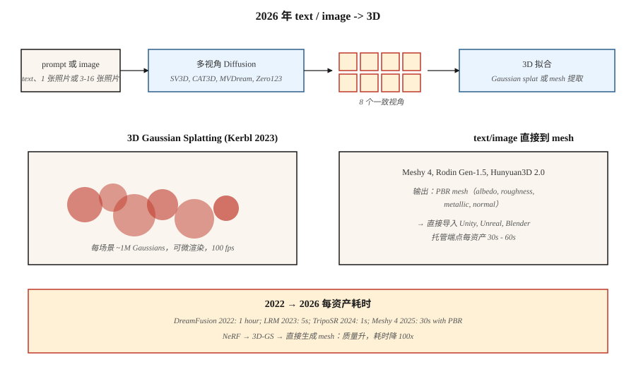

# 3D Generation

> 3D 是 2D-to-3D 借力最强的 modality。2023 年的突破是 3D Gaussian Splatting。2024-2026 年的生成式推进，是在其上叠加 multi-view diffusion + 3D reconstruction，从单个 prompt 或照片生成物体和场景。

**Type:** Learn
**Languages:** Python
**先修要求:** Phase 4 (Vision), Phase 8 · 07 (Latent Diffusion)
**Time:** ~45 minutes

## 问题

3D 内容很难处理：

- **表示。** Meshes、point clouds、voxel grids、signed distance fields (SDFs)、neural radiance fields (NeRFs)、3D Gaussians。每种都有取舍。
- **数据稀缺。** ImageNet 有 14M 张图像。最大的干净 3D 数据集（Objaverse-XL, 2023）有约 10M 个物体，其中大多质量较低。
- **内存。** 一个 512³ voxel grid 有 128M 个 voxels；一个可用的场景 NeRF 需要 1M samples/ray。生成比重建更难。
- **监督。** 对于 2D 图像，你有 pixels。对于 3D，你通常只有少量 2D views，并且必须 lift 到 3D。

2026 年的 stack 把这两个问题分开。第一步，用 Diffusion model 生成 *2D multi-view images*。第二步，把这些图像拟合成一种 *3D representation*（通常是 Gaussian splatting）。

## 概念



### 表示：3D Gaussian Splatting (Kerbl et al., 2023)

把场景表示为约 1M 个 3D Gaussians 组成的 cloud。每个有 59 个参数：position (3)、covariance (6，或 quaternion 4 + scale 3)、opacity (1)、spherical-harmonics color（degree 3 时为 48，degree 0 时为 3）。

Rendering = projection + alpha-compositing。快（4090 上 1080p 约 100 fps）。可微。通过 Gradient Descent 对 ground-truth photos 拟合。一个场景可在消费级 GPU 上用 5-30 分钟完成拟合。

其上的两个 2023-2024 创新：
- **Generative Gaussian splats。** LGM、LRM、InstantMesh 等模型直接从一张或几张图像预测 Gaussian cloud。
- **4D Gaussian Splatting。** 带有 per-frame offsets 的 Gaussians，用于动态场景。

### Multi-view diffusion

Fine-tune 一个预训练 image Diffusion model，使其能从 text prompt 或单张图像生成同一物体的多个一致视角。Zero123 (Liu et al., 2023)、MVDream (Shi et al., 2023)、SV3D (Stability, 2024)、CAT3D (Google, 2024)。通常输出物体周围的 4-16 个 views，再通过 Gaussian splatting 或 NeRF lift 到 3D。

### Text-to-3D pipelines

| Model | Input | Output | Time |
|-------|-------|--------|------|
| DreamFusion (2022) | text | NeRF via SDS | 每个 asset ~1 小时 |
| Magic3D | text | mesh + texture | ~40 分钟 |
| Shap-E (OpenAI, 2023) | text | implicit 3D | ~1 分钟 |
| SJC / ProlificDreamer | text | NeRF / mesh | ~30 分钟 |
| LRM (Meta, 2023) | image | triplane | ~5 秒 |
| InstantMesh (2024) | image | mesh | ~10 秒 |
| SV3D (Stability, 2024) | image | novel views | ~2 分钟 |
| CAT3D (Google, 2024) | 1-64 images | 3D NeRF | ~1 分钟 |
| TripoSR (2024) | image | mesh | ~1 秒 |
| Meshy 4 (2025) | text + image | PBR mesh | ~30 秒 |
| Rodin Gen-1.5 (2025) | text + image | PBR mesh | ~60 秒 |
| Tencent Hunyuan3D 2.0 (2025) | image | mesh | ~30 秒 |

2025-2026 方向：适合 game engines 的、带 PBR materials 的 direct text-to-mesh models。对于通用物体，Multi-view diffusion 中间步骤仍然是表现最好的配方。

### NeRF（背景）

Neural Radiance Field (Mildenhall et al., 2020)。一个小型 MLP 接收 `(x, y, z, view direction)` 并输出 `(color, density)`。通过沿 rays 积分进行 render。质量上优于基于 mesh 的 novel-view synthesis，但 render 速度慢 100-1000 倍。对多数实时用途已被 Gaussian splatting 取代，但在研究中仍占主导。

```figure
v4-3d-multiview
```

## 构建它

`code/main.py` 实现了一个玩具版 2D “Gaussian splatting” 拟合：把一个合成 target image（平滑 gradient）表示为 2D Gaussian splats 的和。通过 Gradient Descent 优化 positions、colors 和 covariances，以匹配 target。你会看到两个核心操作：forward render（splat + alpha-composite）和通过 Gradient Descent 拟合。

### 步骤 1： 2D Gaussian splat

```python
def gaussian_at(x, y, gaussian):
    px, py = gaussian["pos"]
    sigma = gaussian["sigma"]
    d2 = (x - px) ** 2 + (y - py) ** 2
    return math.exp(-d2 / (2 * sigma * sigma))
```

### 步骤 2: 通过累加 splats 进行渲染

```python
def render(image_size, gaussians):
    img = [[0.0] * image_size for _ in range(image_size)]
    for g in gaussians:
        for y in range(image_size):
            for x in range(image_size):
                img[y][x] += g["color"] * gaussian_at(x, y, g)
    return img
```

真实的 3D Gaussian splatting 会按深度对 Gaussians 排序，并按顺序 alpha-composite。我们的 2D 玩具版本只是求和。

### 步骤 3：用 Gradient Descent 拟合

```python
for step in range(steps):
    pred = render(size, gaussians)
    loss = mse(pred, target)
    gradients = compute_grads(pred, target, gaussians)
    update(gaussians, gradients, lr)
```

## 陷阱

- **View inconsistency。** 如果你独立生成 4 个 views，而它们对物体结构的判断不一致，3D 拟合会变模糊。修复：使用带 shared attention 的 multi-view diffusion。
- **Back-side hallucination。** 单图像 → 3D 必须想象看不见的一侧。质量差异极大。
- **Gaussian splat explosion。** 无约束训练会增长到 10M splats 并过拟合。Densification + pruning heuristics（来自 3D-GS 原论文）是必要的。
- **Topology issues。** 来自 implicit fields (SDFs) 的 meshes 通常有 holes 或 self-intersections。发布前运行 remesher（例如 blender 的 voxel remesh）。
- **训练数据许可。** Objaverse 的 license 混杂；商业用途因模型而异。

## 使用它

| Task | 2026 pick |
|------|-----------|
| 从照片进行场景重建 | Gaussian splatting (3DGS, Gsplat, Scaniverse) |
| 面向游戏的 Text-to-3D object | Meshy 4 or Rodin Gen-1.5 (PBR output) |
| Image-to-3D | Hunyuan3D 2.0, TripoSR, InstantMesh |
| 从少量图像进行 Novel-view synthesis | CAT3D, SV3D |
| 动态场景重建 | 4D Gaussian Splatting |
| Avatar / clothed human | Gaussian Avatar, HUGS |
| Research / SOTA | 上周刚发布的任何东西 |

对于在游戏或 e-commerce pipeline 中发布生产级 3D：Meshy 4 或 Rodin Gen-1.5 输出可直接进入 Unity / Unreal 的 PBR meshes。

## 交付它

保存 `outputs/skill-3d-pipeline.md`。Skill 接收一个 3D brief（input: text / one image / few images；output: mesh / splat / NeRF；usage: render / game / VR），并输出：pipeline（multi-view diffusion + fit，或 direct mesh model）、base model、iteration budget、topology post-processing、所需 material channels。

## 练习

1. **Easy。** 用 4、16、64 个 Gaussians 运行 `code/main.py`。报告最终 MSE vs target。
2. **Medium。** 扩展为 color Gaussians (RGB)。确认重建匹配 target color pattern。
3. **Hard。** 使用 gsplat 或 Nerfstudio，从 50-photo capture 重建真实物体。报告 fit time 和 held-out views 上的最终 SSIM。

## 关键术语
| Term | 人们怎么说 | 它实际意味着什么 |
|------|------------|------------------|
| 3D Gaussian Splatting | "3DGS" | 把场景作为 3D Gaussians 的 cloud；可微的 alpha-composite render。 |
| NeRF | "Neural radiance field" | 在 3D point 输出 color + density 的 MLP；通过 ray integration render。 |
| Triplane | "Three 2-D planes" | 把 3D 分解成三个 2-D axis-aligned feature grids；比 volumetric 更便宜。 |
| SDS | "Score distillation sampling" | 使用 2D-diffusion score 作为 pseudo-Gradient 来训练 3D model。 |
| Multi-view diffusion | "Many views at once" | 输出一批一致 camera views 的 Diffusion model。 |
| PBR | "Physically-based rendering" | 具有 albedo、roughness、metallic、normal channels 的 material。 |
| Densification | "Grow splats" | 3DGS 训练 heuristic：在高 Gradient 区域 split / clone splats。 |

## 生产备注：3D 还没有共享 substrate

不同于 image（latent diffusion + DiT）和 video（spatiotemporal DiT），2026 年的 3D 还没有单一主导 runtime。生产决策树会按 representation 分叉：

- **NeRF / triplane。** Inference 是 ray-marching + 每个 sample 一次 MLP forward。一次 512² render 需要数百万次 MLP forwards。积极 batch ray samples；SDPA/xformers 适用。
- **Multi-view diffusion + LRM reconstruction。** 两阶段 pipeline。Stage 1（multi-view DiT）是和 Lesson 07 一样的 Diffusion server。Stage 2（LRM transformer）是对 views 的一次性 forward pass。整体 latency profile 是 “diffusion + one-shot”，因此要按阶段选择 serving primitives。
- **SDS / DreamFusion。** Per-asset optimization，不是 inference。构建 jobs，而不是 request handlers。

对于多数 2026 产品，正确答案是“按请求运行 multi-view diffusion model，异步 reconstruct 到 3DGS，并服务 3DGS 用于实时 viewing”。这会把 workload 清晰拆分到 GPU-inference server（快）和 offline optimizer（慢）之间。

## 延伸阅读
- [Mildenhall et al. (2020). NeRF: Representing Scenes as Neural Radiance Fields](https://arxiv.org/abs/2003.08934) — NeRF。
- [Kerbl et al. (2023). 3D Gaussian Splatting for Real-Time Radiance Field Rendering](https://arxiv.org/abs/2308.04079) — 3DGS。
- [Poole et al. (2022). DreamFusion: Text-to-3D using 2D Diffusion](https://arxiv.org/abs/2209.14988) — SDS。
- [Liu et al. (2023). Zero-1-to-3: Zero-shot One Image to 3D Object](https://arxiv.org/abs/2303.11328) — Zero123。
- [Shi et al. (2023). MVDream](https://arxiv.org/abs/2308.16512) — multi-view diffusion。
- [Hong et al. (2023). LRM: Large Reconstruction Model for Single Image to 3D](https://arxiv.org/abs/2311.04400) — LRM。
- [Gao et al. (2024). CAT3D: Create Anything in 3D with Multi-View Diffusion Models](https://arxiv.org/abs/2405.10314) — CAT3D。
- [Stability AI (2024). Stable Video 3D (SV3D)](https://stability.ai/research/sv3d) — SV3D。
