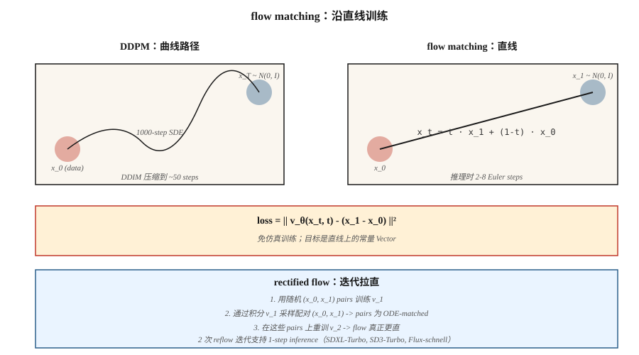

# Flow Matching 与 Rectified Flows

> Diffusion models 需要 20-50 个采样步骤，因为它们会沿着从噪声到 data 的弯曲路径行走。Flow matching（Lipman et al., 2023）和 rectified flow（Liu et al., 2022）训练的是直线路径。路径越直，步骤越少，inference 越快。Stable Diffusion 3、Flux.1 和 AudioCraft 2 都在 2024 年切换到了 flow matching。

**Type:** Build
**Languages:** Python
**Prerequisites:** Phase 8 · 06 (DDPM), Phase 1 · Calculus
**Time:** ~45 minutes

## 问题

DDPM 的反向过程是一个从 `N(0, I)` 回到 data distribution 的 1000 步随机游走。DDIM 将其压缩为 20-50 个确定性步骤。你想要更少的步骤，理想情况下只要一步。阻碍在于求解反向过程的 ODE 是 stiff 的；路径是弯曲的。

如果你能训练 model，使得从噪声到 data 的路径是一条*直线*，那么从 `t=1` 到 `t=0` 的单个 Euler step 就能工作。Flow matching 直接构建这一点：定义从 `x_1 ∼ N(0, I)` 到 `x_0 ∼ data` 的直线插值，训练 Vector field `v_θ(x, t)` 去匹配它的时间导数，并在 inference 时积分。

Rectified flow（Liu 2022）更进一步：用 reflow procedure 迭代地拉直路径，生成一个逐渐更接近线性的 ODE。经过两次 reflow 迭代后，2-step sampler 可以匹配 50-step DDPM 的质量。

## 核心概念



### 直线 flow

定义：

```
x_t = t · x_1 + (1 - t) · x_0,   t ∈ [0, 1]
```

其中 `x_0 ~ data`，`x_1 ~ N(0, I)`。沿这条直线的时间导数是常数：

```
dx_t / dt = x_1 - x_0
```

定义一个 Neural Vector field `v_θ(x_t, t)`，并训练它匹配这个导数：

```
L = E_{x_0, x_1, t} || v_θ(x_t, t) - (x_1 - x_0) ||²
```

这就是 **conditional flow matching** Loss（Lipman 2023）。训练不需要 simulation：你从不展开 ODE。只需采样 `(x_0, x_1, t)` 并做 Regression。

### 采样

在 inference 时，沿时间*反向*积分学到的 Vector field：

```
x_{t-Δt} = x_t - Δt · v_θ(x_t, t)
```

从 `x_1 ~ N(0, I)` 开始，用 Euler step 一路降到 `t=0`。

### Rectified flow（Liu 2022）

直线 flow 可以工作，但学到的路径*实际上并不直*，因为许多 `x_0` 可以映射到同一个 `x_1`。Rectified flow 的 reflow step：

1. 用随机配对训练 flow model v_1。
2. 通过将 v_1 从 `x_1` 积分到其落点 `x_0`，采样 N 对 `(x_1, x_0)`。
3. 在这些配对样本上训练 v_2。因为这些配对现在是 “ODE-matched” 的，它们之间的直线插值确实更平坦。
4. 重复。

实践中，2 次 reflow 迭代就能接近线性，从而实现 2-4 step inference。SDXL-Turbo、SD3-Turbo、LCM 都是从 flow matching model 蒸馏而来的。

### 为什么它在 2024 年赢得了图像领域

三个原因：

1. **Simulation-free training**：训练期间不需要 ODE 展开，实现极其简单。
2. **更好的 Loss geometry**：直线路径具有一致的 signal-to-noise，而 DDPM ε-loss 在 schedule 边缘处 SNR 很差。
3. **更快的 inference**：在 SDXL-Turbo 质量下需要 4-8 步；配合 consistency distillation 可达到 1 步。

## Flow matching vs DDPM：精确联系

带 Gaussian-conditional path 的 flow matching 就是使用*特定噪声 schedule* 的 Diffusion。选择 `x_t = α(t) x_0 + σ(t) x_1` schedule，flow matching 就会恢复 Stratonovich-reformulated diffusion，其中 `v = α'·x_0 - σ'·x_1`。对于 Gaussian paths，两者在代数上等价。

Flow matching 增加的是：目标的*清晰性*（普通 velocity）、更干净的 Loss，以及尝试 non-Gaussian interpolants 的自由度。

```figure
normalizing-flow
```

## 构建它

`code/main.py` 在双峰 Gaussian mixture 上实现 1-D flow matching。Vector field `v_θ(x, t)` 是一个小型 MLP，使用直线目标训练。在 inference 时，分别用 1、2、4 和 20 个 Euler steps 积分，并比较样本质量。

### 步骤 1：training loss

```python
def train_step(x0, net, rng, lr):
    x1 = rng.gauss(0, 1)
    t = rng.random()
    x_t = t * x1 + (1 - t) * x0
    target = x1 - x0
    pred = net_forward(x_t, t)
    loss = (pred - target) ** 2
    # backprop + update
```

### 步骤 2：multi-step inference

```python
def sample(net, num_steps):
    x = rng.gauss(0, 1)
    for i in range(num_steps):
        t = 1.0 - i / num_steps
        dt = 1.0 / num_steps
        x -= dt * net_forward(x, t)
    return x
```

### 步骤 3：比较步骤数

预期 4-step sampler 已经能匹配 20-step 质量，这对 latency 来说意义重大。

## 易踩坑

- **Time parameterization。** Flow matching 使用 `t ∈ [0, 1]`，其中 `t=0` 是 data，`t=1` 是噪声。DDPM 使用 `t ∈ [0, T]`，其中 `t=0` 是 data，`t=T` 是噪声。方向相同，尺度不同。论文经常把这个写错。
- **Schedule choice。** Rectified flow 的直线是 “the” flow-matching schedule，但你也可以使用 cosine 或 logit-normal t-sampling（SD3 这么做）来获得更好的尺度覆盖。
- **Reflow cost。** 为 reflow 生成配对数据集相当于每个样本跑一次完整 inference。只有当你真的需要 1-2 step inference 时才做 reflow。
- **Classifier-free guidance 仍然适用。** 只需在线性组合中把 ε 换成 v：`v_cfg = (1+w) v_cond - w v_uncond`。

## 使用它

| Use case | 2026 stack |
|----------|-----------|
| Text-to-image，最佳质量 | Flow matching：SD3、Flux.1-dev |
| Text-to-image，1-4 步 | Distilled flow matching：Flux.1-schnell、SD3-Turbo、SDXL-Turbo |
| 实时 inference | 来自 flow-matched base 的 consistency distillation（LCM、PCM） |
| Audio generation | Flow matching：Stable Audio 2.5、AudioCraft 2 |
| Video generation | Flow matching 与 Diffusion 混合（Sora、Veo、Stable Video） |
| Science / physics（particle trajectories、molecules） | Flow matching + equivariant Vector field |

只要一篇 2025-2026 年的论文说 “faster than diffusion”，它几乎总是 flow matching + distillation。

## 交付它

保存 `outputs/skill-fm-tuner.md`。该 skill 接收一个 Diffusion-style model spec，并将其转换为 flow-matching training config：schedule choice、time sampling distribution（uniform / logit-normal）、Optimizer、reflow plan、target step count、eval protocol。

## 练习

1. **Easy。** 运行 `code/main.py`，比较 1-step 与 20-step MSE 相对于真实 data distribution 的表现。
2. **Medium。** 从 uniform `t` sampling 切换到 logit-normal（将采样集中在 mid-t）。model 质量是否提升？
3. **Hard。** 实现一次 reflow 迭代：通过积分第一个 model 生成 paired (x_0, x_1)，在这些 pairs 上训练第二个 model，并比较 1-step sample quality。

## 关键术语
| Term | What people say | What it actually means |
|------|-----------------|-----------------------|
| Flow matching | “Straight-line diffusion” | 训练 `v_θ(x, t)`，使其沿 interpolant 匹配 `x_1 - x_0`。 |
| Rectified flow | “Reflow” | 拉直已学习 flows 的迭代过程。 |
| Velocity field | “v_θ” | model 的输出，即移动 `x_t` 的方向。 |
| Straight-line interpolant | “The path” | `x_t = (1-t)·x_0 + t·x_1`；目标导数很简单。 |
| Euler sampler | “1st order ODE solver” | 最简单的 integrator；当路径较直时效果很好。 |
| Logit-normal t | “SD3 sampling” | 将 `t` sampling 集中到 gradients 最强的中间值附近。 |
| Consistency distillation | “1-step sampler” | 训练 student 将任意 `x_t` 直接映射到 `x_0`。 |
| CFG with velocity | “v-CFG” | `v_cfg = (1+w) v_cond - w v_uncond`；同样技巧，新的变量。 |

## Production note：Flux.1-schnell 是最快形态的 flow matching

Flow matching 的 production 胜利案例是 Flux.1-schnell：一个 flow-matched DiT，被蒸馏到 1-4 个 inference steps，同时保持 Flux-dev 级别的质量。Niels 的 “Run Flux on an 8GB machine” notebook 是参考部署方案：T5 + CLIP encode，quantized MMDiT denoise（schnell 用 4 步，而 dev 用 50 步），VAE decode。成本核算如下：

| Variant | Steps | Latency at 1024² on L4 | Total FLOPs (relative) |
|---------|-------|------------------------|------------------------|
| Flux.1-dev (raw) | 50 | ~15 s | 1.0× |
| Flux.1-schnell | 4 | ~1.2 s | 0.08× (12× faster) |
| SDXL-base | 30 | ~4 s | 0.25× |
| SDXL-Lightning 2-step | 2 | ~0.3 s | 0.03× |

Production 规则：**flow-matched base + distillation = 2026 年快速 text-to-image 的默认方案。** 每个主要厂商都在发布这个组合：SD3-Turbo（SD3 + flow + distillation）、Flux-schnell（Flux-dev + rectified-flow straightening）、CogView-4-Flash。纯 Diffusion base 只存在于 legacy checkpoints 中。

## 延伸阅读
- [Liu, Gong, Liu (2022). Flow Straight and Fast: Learning to Generate and Transfer Data with Rectified Flow](https://arxiv.org/abs/2209.03003) — rectified flow。
- [Lipman et al. (2023). Flow Matching for Generative Modeling](https://arxiv.org/abs/2210.02747) — flow matching。
- [Esser et al. (2024). Scaling Rectified Flow Transformers for High-Resolution Image Synthesis](https://arxiv.org/abs/2403.03206) — SD3，大规模 rectified flow。
- [Albergo, Vanden-Eijnden (2023). Stochastic Interpolants](https://arxiv.org/abs/2303.08797) — 覆盖 FM + Diffusion 的通用框架。
- [Song et al. (2023). Consistency Models](https://arxiv.org/abs/2303.01469) — Diffusion / flow 的 1-step distillation。
- [Sauer et al. (2023). Adversarial Diffusion Distillation (SDXL-Turbo)](https://arxiv.org/abs/2311.17042) — turbo variant。
- [Black Forest Labs (2024). Flux.1 models](https://blackforestlabs.ai/announcing-black-forest-labs/) — production 中的 flow matching。
