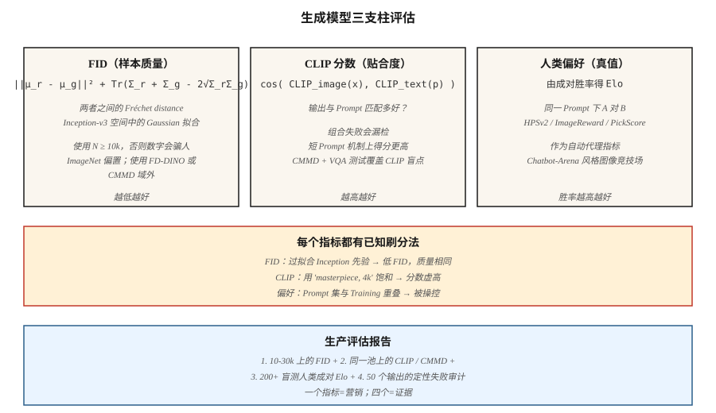

# 评估 — FID、CLIP Score、人类偏好

> 每个生成式模型排行榜都会引用 FID、CLIP score，以及来自人类偏好竞技场的胜率。每个数字都有一种会被有心研究者利用的失效模式。如果你不了解这些失效模式，就无法区分真正的改进和刷分运行。

**类型:** Build
**语言:** Python
**先修:** Phase 8 · 01 (Taxonomy), Phase 2 · 04 (Evaluation Metrics)
**时间:** ~45 minutes

## 问题

生成式模型通常根据*样本质量*和*条件遵循度*来评判。两者都没有闭式度量。你的模型必须渲染 10,000 张图像；必须有某种东西给它们打分；你还必须相信这些数字能跨模型家族、跨分辨率、跨架构成立。三种指标熬过了 2014-2026 的考验：

- **FID (Fréchet Inception Distance)。** 在 Inception network 的特征空间中，真实分布与生成分布之间的距离。越低越好。
- **CLIP score。** 生成图像的 CLIP-image Embedding 与 prompt 的 CLIP-text Embedding 之间的 cosine similarity。越高越好。衡量 prompt 遵循度。
- **人类偏好。** 在同一 prompt 上让两个模型正面对决，让人类（或 GPT-4 级模型）选择更好的一个，再聚合成 Elo score。

你还会看到：IS（inception score，基本已退役）、KID、CMMD、ImageReward、PickScore、HPSv2、MJHQ-30k。每一种都修正了前一种指标的某个失效点。

## 概念



### FID — 样本质量

Heusel et al. (2017)。步骤：

1. 为 N 张真实图像和 N 张生成图像提取 Inception-v3 features (2048-D)。
2. 对每个池拟合一个 Gaussian：计算 mean `μ_r, μ_g` 和 covariance `Σ_r, Σ_g`。
3. FID = `||μ_r - μ_g||² + Tr(Σ_r + Σ_g - 2 · (Σ_r · Σ_g)^0.5)`。

解释：特征空间中两个多变量 Gaussian 之间的 Fréchet distance。越低 = 分布越相似。

失效模式：
- **小 N 时有偏。** FID 是对特征分布做 mean-squared 计算，小 N 会低估 covariance，给出虚假的低 FID。始终使用 N ≥ 10,000。
- **依赖 Inception。** Inception-v3 训练于 ImageNet。远离 ImageNet 的领域（人脸、艺术、文字图像）会产生无意义的 FID。使用特定领域的 feature extractor。
- **刷分。** 过拟合 Inception prior 可以在没有视觉质量提升的情况下得到低 FID。用 CMMD（见下文）来对抗它。

### CLIP score — prompt 遵循度

Radford et al. (2021)。对于一张生成图像 + prompt：

```
clip_score = cos_sim( CLIP_image(x_gen), CLIP_text(prompt) )
```

对 30k 张生成图像取平均 → 得到一个可在模型间比较的标量。

失效模式：
- **CLIP 自身的盲点。** CLIP 的组合推理较弱（"a red cube on a blue sphere" 经常失败）。模型可以在 CLIP score 上排名很好，但并没有真正遵循复杂 prompt。
- **短 prompt 偏差。** 短 prompt 在野外有更多 CLIP-image 匹配。长 prompt 的 CLIP score 会机械性降低。
- **prompt 刷分。** 在 prompt 中加入 "high quality, 4k, masterpiece" 会抬高 CLIP score，却不会改善图文绑定。

CMMD (Jayasumana et al., 2024) 修复了其中一些问题：使用 CLIP features 而不是 Inception，使用 maximum-mean discrepancy 而不是 Fréchet。它更擅长检测细微的质量差异。

### 人类偏好 — ground truth

选择一组 prompt。用模型 A 和模型 B 生成。把成对结果展示给人类（或强 LLM judge）。将胜负聚合成 Elo 或 Bradley-Terry score。Benchmark：

- **PartiPrompts (Google)**：1,600 个多样化 prompt，12 个类别。
- **HPSv2**：107k 个人类标注，广泛用作自动化代理。
- **ImageReward**：137k 个 prompt-image 偏好对，MIT-licensed。
- **PickScore**：基于 Pick-a-Pic 2.6M preferences 训练。
- **Chatbot-Arena-style image arenas**：https://imagearena.ai/ 和其他平台。

失效模式：
- **judge 方差。** 非专家和专家的偏好不同。两者都要用。
- **prompt 分布。** 精挑细选的 prompt 会偏向某个家族。始终记录清楚。
- **LLM-judge reward hacking。** GPT-4-judge 会被漂亮但错误的输出骗过。与人类结果交叉验证。

## 组合使用

生产级 eval report 应包含：

1. 在 10-30k 个样本上，针对 held-out 真实分布计算 FID（样本质量）。
2. 在同一批样本及其 prompt 上计算 CLIP score / CMMD（遵循度）。
3. 在与上一版模型的盲测竞技场中计算胜率（整体偏好）。
4. 失效模式分析：随机抽取 50 个输出，标记已知问题（手部结构、文字渲染、对象数量一致性）。

任何单一指标都是谎言。三个相互印证的指标 + 定性 review 才是主张。

```figure
gx-fid-distributions
```

## 动手构建

`code/main.py` 在合成的 "feature vectors" 上实现 FID、类 CLIP-score 和 Elo 聚合（我们用 4-D Vector 作为 Inception features 的替代）。你会看到：

- 小 N 和大 N 上的 FID 计算，也就是偏差。
- 将 feature 池之间的 cosine similarity 作为 "CLIP score"。
- 来自合成偏好流的 Elo update rule。

### 步骤 1： 四行实现 FID

```python
def fid(real_features, gen_features):
    mu_r, cov_r = mean_and_cov(real_features)
    mu_g, cov_g = mean_and_cov(gen_features)
    mean_diff = sum((a - b) ** 2 for a, b in zip(mu_r, mu_g))
    trace_term = trace(cov_r) + trace(cov_g) - 2 * sqrt_cov_product(cov_r, cov_g)
    return mean_diff + trace_term
```

### 步骤 2： CLIP 风格的 cosine-similarity

```python
def clip_like(image_feat, text_feat):
    dot = sum(a * b for a, b in zip(image_feat, text_feat))
    norm = math.sqrt(dot_self(image_feat) * dot_self(text_feat))
    return dot / max(norm, 1e-8)
```

### 步骤 3： Elo 聚合

```python
def elo_update(r_a, r_b, winner, k=32):
    expected_a = 1 / (1 + 10 ** ((r_b - r_a) / 400))
    actual_a = 1.0 if winner == "a" else 0.0
    r_a_new = r_a + k * (actual_a - expected_a)
    r_b_new = r_b - k * (actual_a - expected_a)
    return r_a_new, r_b_new
```

## 常见陷阱

- **N=1000 时的 FID。** 在 N=10k 以下，这个启发式不可靠。报告低 N FID 的论文是在刷分。
- **跨分辨率比较 FID。** Inception 的 299×299 resize 会改变特征分布。只在匹配分辨率下比较。
- **只报告一个 seed。** 至少运行 3 个 seed。报告 std。
- **通过 negative prompts 抬高 CLIP score。** 一些 pipeline 会通过过拟合 prompt 来提升 CLIP。检查是否出现视觉饱和。
- **prompt 重叠导致 Elo 偏差。** 如果两个模型在训练中都见过 benchmark prompt，Elo 就没有意义。使用 held-out prompt sets。
- **人类 eval 的付费众包偏斜。** Prolific、MTurk 标注者偏年轻 / 技术友好。与招募的艺术/设计专家混合使用。

## 使用它

2026 年的生产 eval protocol：

| 支柱 | 最低要求 | 推荐 |
|--------|---------|-------------|
| 样本质量 | 10k 上相对 held-out real 计算 FID | + 5k 上 CMMD + 按类别子集计算 FID |
| prompt 遵循度 | 30k 上计算 CLIP score | + HPSv2 + ImageReward + VQA-style question answering |
| 偏好 | 200 个相对 baseline 的盲测成对样本 | + 2000 paired human + LLM-judge + Chatbot Arena |
| 失效分析 | 50 个手动标记 | 500 个手动标记 + automated safety classifier |

四个支柱在同一份报告中 = 主张。任何单独一个 = 营销。

## 交付

保存 `outputs/skill-eval-report.md`。Skill 接收新的 model checkpoint + baseline，并输出完整 eval plan：样本量、指标、失效模式探针、签核标准。

## 练习

1. **Easy.** 运行 `code/main.py`。在相同合成分布上比较 N=100 与 N=1000 时的 FID。报告偏差幅度。
2. **Medium.** 基于合成 CLIP-style features 实现 CMMD（公式见 Jayasumana et al., 2024）。比较它和 FID 对质量差异的敏感性。
3. **Hard.** 复现 HPSv2 设置：从 Pick-a-Pic 的一个子集中取 1000 个 image-prompt pairs，基于偏好 fine-tune 一个小型 CLIP-based scorer，并测量它与 held-out set 的一致性。

## 关键术语

| Term | What people say | What it actually means |
|------|-----------------|-----------------------|
| FID | "Fréchet Inception Distance" | 对真实与生成 Inception features 拟合 Gaussian 后的 Fréchet distance。 |
| CLIP score | "Text-image similarity" | CLIP image 与 text Embeddings 之间的 cosine similarity。 |
| CMMD | "FID's replacement" | CLIP-feature MMD；偏差更小，无 Gaussian assumption。 |
| IS | "Inception score" | Exp KL(p(y|x) || p(y))；在现代模型上相关性差，已退役。 |
| HPSv2 / ImageReward / PickScore | "Learned preference proxies" | 在人类偏好上训练的小模型；用作自动 judge。 |
| Elo | "Chess rating" | 成对胜负的 Bradley-Terry 聚合。 |
| PartiPrompts | "The benchmark prompt set" | Google 策划的 1,600 个 prompt，覆盖 12 个类别。 |
| FD-DINO | "Self-sup replacement" | 使用 DINOv2 features 的 FD；更适合 ImageNet 之外的领域。 |

## 生产注记：evaluation 也是 inference workload

在 10k 样本上运行 FID 意味着生成 10k 张图像。对于单张 L4 上 1024² 的 50-step SDXL base，这大约是 11 小时的 single-request inference。评估预算是真实存在的，而且这个框架正是 offline-inference 场景（最大化 throughput，忽略 TTFT）：

- **尽力 batch，忘掉 latency。** Offline eval = 在内存能容纳的最大尺寸上做 static batching。在 80GB H100 上用 `num_images_per_prompt=8` 调用 `pipe(...).images`，wall-clock 比 single-request 快 4-6×。
- **缓存真实 features。** 对真实参考集执行的 Inception (FID) 或 CLIP (CLIP-score, CMMD) feature extraction 只运行*一次*，并存储为 `.npz`。不要每次 eval 都重新计算。

对于 CI / regression gates：每个 PR 在 500-sample 子集上运行 FID + CLIP score（~30 min）；每晚运行完整 10k FID + HPSv2 + Elo。

## 延伸阅读

- [Heusel et al. (2017). GANs Trained by a Two Time-Scale Update Rule Converge to a Local Nash Equilibrium (FID)](https://arxiv.org/abs/1706.08500) — FID 论文。
- [Jayasumana et al. (2024). Rethinking FID: Towards a Better Evaluation Metric for Image Generation (CMMD)](https://arxiv.org/abs/2401.09603) — CMMD。
- [Radford et al. (2021). Learning Transferable Visual Models from Natural Language Supervision (CLIP)](https://arxiv.org/abs/2103.00020) — CLIP。
- [Wu et al. (2023). HPSv2: A Comprehensive Human Preference Score](https://arxiv.org/abs/2306.09341) — HPSv2。
- [Xu et al. (2023). ImageReward: Learning and Evaluating Human Preferences for Text-to-Image Generation](https://arxiv.org/abs/2304.05977) — ImageReward。
- [Yu et al. (2023). Scaling Autoregressive Models for Content-Rich Text-to-Image Generation (Parti + PartiPrompts)](https://arxiv.org/abs/2206.10789) — PartiPrompts。
- [Stein et al. (2023). Exposing flaws of generative model evaluation metrics](https://arxiv.org/abs/2306.04675) — failure-mode survey。
