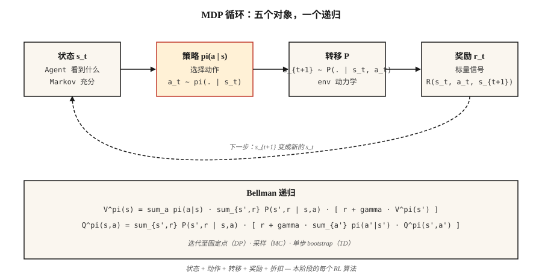

# MDPs, States, Actions 与 Rewards

> Markov Decision Process 由五个要素组成：states、actions、transitions、rewards、一个 discount。RL 中的一切，包括 Q-learning、PPO、DPO、GRPO，都是在这个结构上进行优化。学会一次，后面的 Reinforcement Learning 就能顺畅读懂。

**Type:** Learn
**Languages:** Python
**前置要求:** Phase 1 · 06 (Probability & Distributions), Phase 2 · 01 (ML Taxonomy)
**Time:** ~45 minutes

## 问题
你正在写一个 chess bot。或者一个 inventory planner。或者一个 trading agent。或者训练 reasoning model 的 PPO loop。四个不同领域，一个令人意外的事实：它们都可以归约为同一个数学对象。

Supervised learning 给你 `(x, y)` 对，并要求你拟合一个函数。Reinforcement Learning 不给你 labels，只给你一条 states 流、你采取的 actions，以及一个标量 reward。这个 move 赢了 game 吗？这个 restock decision 省钱了吗？这笔 trade 盈利了吗？LLM 刚生成的 Token 是否从 judge 那里得到了更高 reward？

在形式化之前，你无法从这条流中学习。“我看到了什么”、“我做了什么”、“接下来发生了什么”、“这有多好”，每一项都必须变成可以推理的对象。这个形式化就是 Markov Decision Process。本阶段的每个 RL algorithm，包括最后的 RLHF 和 GRPO loops，都是在这个结构上进行优化。

## 概念


**五个对象。**

- **States** `S`。agent 做决策所需的一切。在 GridWorld 中，是 cell。在 chess 中，是 board。在 LLM 中，是 context window 加上任何 memory。
- **Actions** `A`。可选项。向上/向下/向左/向右移动。下一步棋。输出一个 Token。
- **Transitions** `P(s' | s, a)`。给定 state `s` 和 action `a`，next state 上的分布。在 chess 中是 deterministic，在 inventory 中是 stochastic，在 LLM decoding 中几乎是 deterministic。
- **Rewards** `R(s, a, s')`。标量信号。Win = +1，loss = -1。Revenue minus cost。GRPO 中的 log-likelihood ratio term。
- **Discount** `γ ∈ [0, 1)`。future reward 相对于 present 的权重。`γ = 0.99` 买到约 100 steps 的 horizon；`γ = 0.9` 买到约 10。

**Markov property** `P(s_{t+1} | s_t, a_t) = P(s_{t+1} | s_0, a_0, …, s_t, a_t)`。future 只依赖于 present state。如果不是这样，说明 state representation 不完整；这不是方法失败，而是 state 失败。

**Policies and returns.** policy `π(a | s)` 将 states 映射到 action distributions。return `G_t = r_t + γ r_{t+1} + γ² r_{t+2} + …` 是 future rewards 的 discounted sum。value `V^π(s) = E[G_t | s_t = s]` 是在 policy `π` 下从 `s` 开始的 expected return。Q-value `Q^π(s, a) = E[G_t | s_t = s, a_t = a]` 是从特定 action 开始的 expected return。每个 RL algorithm 都会估计这两者之一，然后据此改进 `π`。

**Bellman equations.** 本阶段所有内容都会用到的 fixed-point equations：

`V^π(s) = Σ_a π(a|s) Σ_{s', r} P(s', r | s, a) [r + γ V^π(s')]`
`Q^π(s, a) = Σ_{s', r} P(s', r | s, a) [r + γ Σ_{a'} π(a'|s') Q^π(s', a')]`

它们把 expected return 拆成“这一步的 reward”加上“你落到的位置的 discounted value”。这是递归的。Phase 9 中的每个 algorithm，要么迭代这个 equation 直到 convergence（dynamic programming），要么从中采样（Monte Carlo），要么用一步来 bootstrap 它（temporal difference）。

## 构建它
### 步骤 1： 一个很小的 deterministic MDP

一个 4×4 GridWorld。Agent 从左上角开始，terminal 在右下角，每步 reward 为 -1，actions 为 `{up, down, left, right}`。参见 `code/main.py`。

```python
GRID = 4
TERMINAL = (3, 3)
ACTIONS = {"up": (-1, 0), "down": (1, 0), "left": (0, -1), "right": (0, 1)}

def step(state, action):
    if state == TERMINAL:
        return state, 0.0, True
    dr, dc = ACTIONS[action]
    r, c = state
    nr = min(max(r + dr, 0), GRID - 1)
    nc = min(max(c + dc, 0), GRID - 1)
    return (nr, nc), -1.0, (nr, nc) == TERMINAL
```

五行。这就是整个 environment。Deterministic transitions、恒定 step penalty、absorbing terminal state。

### 步骤 2： rollout 一个 policy

policy 是从 state 到 action distribution 的函数。最简单的是 uniform random。

```python
def uniform_policy(state):
    return {a: 0.25 for a in ACTIONS}

def rollout(policy, max_steps=200):
    s, total, steps = (0, 0), 0.0, 0
    for _ in range(max_steps):
        a = sample(policy(s))
        s, r, done = step(s, a)
        total += r
        steps += 1
        if done:
            break
    return total, steps
```

运行 random policy 1000 次。对于这个 4×4 board，average return 大约在 -60 到 -80。optimal return 是 -6（沿直线路径向下再向右）。缩小这个差距，就是 Phase 9 的全部内容。

### 步骤 3： 通过 Bellman equation 精确计算 `V^π`

对于小型 MDP，Bellman equation 是一个 linear system。枚举 states，应用 expectation，持续迭代直到 values 不再变化。

```python
def policy_evaluation(policy, gamma=0.99, tol=1e-6):
    V = {s: 0.0 for s in all_states()}
    while True:
        delta = 0.0
        for s in all_states():
            if s == TERMINAL:
                continue
            v = 0.0
            for a, pi_a in policy(s).items():
                s_next, r, _ = step(s, a)
                v += pi_a * (r + gamma * V[s_next])
            delta = max(delta, abs(v - V[s]))
            V[s] = v
        if delta < tol:
            return V
```

这就是 iterative policy evaluation。它是 Sutton & Barto 中的第一个 algorithm，也是后续每种 RL method 的 theoretical foundation。

### 步骤 4： `γ` 是具有物理意义的 hyperparameter

Effective horizon 大约是 `1 / (1 - γ)`。`γ = 0.9` → 10 steps。`γ = 0.99` → 100 steps。`γ = 0.999` → 1000 steps。

太低，agent 会短视。太高，credit assignment 会变得 noisy，因为许多早期 steps 都要共同为很远的 future reward 负责。LLM RLHF 通常使用 `γ = 1`，因为 episodes 短且有界。Control tasks 使用 `0.95–0.99`。Long-horizon strategy games 使用 `0.999`。

## 陷阱
- **Non-Markovian state.** 如果你需要最近三次 observations 才能决策，那么“state”就不只是当前 observation。修复方式：stack frames（Atari 上的 DQN stack 4 帧）或使用 recurrent state（在 observations 上用 LSTM/GRU）。
- **Sparse rewards.** 只在 win 时给 reward，会让大型 state spaces 中的学习几乎不可能。使用 shaped rewards（intermediate signal）或用 imitation bootstrap（Phase 9 · 09）。
- **Reward hacking.** 优化 proxy reward 往往会产生病态行为。OpenAI 的 boat-racing agent 一直原地打转收集 powerups，而不是完成比赛。始终从 target outcome 定义 reward，而不是从 proxy 定义。
- **Discount mis-spec.** 在 infinite-horizon task 上使用 `γ = 1` 会让每个 value 都变成无限。始终用 finite horizon 或 `γ < 1` 来限制。
- **Reward scale.** {+100, -100} 与 {+1, -1} 的 rewards 会得到相同的 optimal policies，但 Gradient magnitudes 会大不相同。在接入 PPO/DQN 前，将其 normalize 到类似 `[-1, 1]` 的范围。

## 使用它
2026 stack 会在接触代码之前，把每条 RL pipeline 都归约为一个 MDP：

| Situation | State | Action | Reward | γ |
|-----------|-------|--------|--------|---|
| Control (locomotion, manipulation) | Joint angles + velocities | Continuous torques | Task-specific shaped | 0.99 |
| Games (chess, Go, poker) | Board + history | Legal move | Win=+1 / loss=-1 | 1.0 (finite) |
| Inventory / pricing | Stock + demand | Order qty | Revenue - cost | 0.95 |
| RLHF for LLMs | Context tokens | Next token | Reward-model score at end | 1.0 (episode ~200 tokens) |
| GRPO for reasoning | Prompt + partial response | Next token | Verifier 0/1 at end | 1.0 |

在写任何 training loop 之前，先写出这五个 tuple。大多数“RL 不工作”的 bug report，最终都能追溯到纸面上的 MDP formulation 已经坏了。

## 交付它
保存为 `outputs/skill-mdp-modeler.md`：

```markdown
---
name: mdp-modeler
description: 给定一个 task description，生成 Markov Decision Process spec，并在 training 前标记 formulation risks。
version: 1.0.0
phase: 9
lesson: 1
tags: [rl, mdp, modeling]
---

给定一个 task（control / game / recommendation / LLM fine-tuning），输出：

1. State。精确的 feature vector 或 tensor spec。说明 Markov property 的理由。
2. Action。Discrete set 或 continuous range。Dimensionality。
3. Transition。Deterministic、stochastic-with-known-model，或 sample-only。
4. Reward。Function 和 source。Sparse vs shaped。Terminal vs per-step。
5. Discount。Value 和 horizon justification。

拒绝交付任何 state 为 non-Markovian、但没有明确提到 frame-stacking 或 recurrent state 的 MDP。拒绝任何不是根据 target outcome 定义的 reward。标记 infinite-horizon task 上的任何 `γ ≥ 1.0`。标记任何 reward range > typical step reward 100x 的情况，因为这很可能是 Gradient explosion source。
```

## 练习
1. **Easy.** 在 `code/main.py` 中实现 4×4 GridWorld 和 random-policy rollout。运行 10,000 episodes。报告 return 的 mean 和 std。与 optimal return（-6）比较。
2. **Medium.** 对 uniform-random policy 运行 `γ ∈ {0.5, 0.9, 0.99}` 下的 `policy_evaluation`。将每个 `V` 打印为 4×4 grid。解释为什么 terminal 附近的 state values 会随着更大的 `γ` 增长更快。
3. **Hard.** 把 GridWorld 改成 stochastic：每个 action 以概率 `p = 0.1` 滑向相邻方向。重新评估 uniform policy。`V[start]` 会变好还是变差？为什么？

## 关键术语
| Term | What people say | What it actually means |
|------|-----------------|-----------------------|
| MDP | “Reinforcement Learning setup” | 满足 Markov property 的 tuple `(S, A, P, R, γ)`。 |
| State | “agent 看到了什么” | 在所选 policy class 下，对 future dynamics 充分的 statistic。 |
| Policy | “agent 的行为” | Conditional distribution `π(a | s)` 或 deterministic map `s → a`。 |
| Return | “总 reward” | 从当前 step 开始的 discounted sum `Σ γ^t r_t`。 |
| Value | “一个 state 有多好” | 在 `π` 下从 `s` 开始的 expected return。 |
| Q-value | “一个 action 有多好” | 在 `π` 下从 `s` 开始且 first action 为 `a` 的 expected return。 |
| Bellman equation | “Dynamic programming recursion” | 将 value / Q 分解为 one-step reward 加 discounted successor value 的 fixed-point decomposition。 |
| Discount `γ` | “future vs present” | 远期 future reward 上的 geometric weight；effective horizon `~1/(1-γ)`。 |

## 延伸阅读
- [Sutton & Barto (2018). Reinforcement Learning: An Introduction, 2nd ed.](http://incompleteideas.net/book/RLbook2020.pdf) — 教科书。Ch. 3 讲 MDPs 和 Bellman equations；Ch. 1 引出支撑后续每节课的 reward hypothesis。
- [Bellman (1957). Dynamic Programming](https://press.princeton.edu/books/paperback/9780691146683/dynamic-programming) — Bellman equation 的起源。
- [OpenAI Spinning Up — Part 1: Key Concepts](https://spinningup.openai.com/en/latest/spinningup/rl_intro.html) — 从 deep-RL 角度写的简明 MDP 入门。
- [Puterman (2005). Markov Decision Processes](https://onlinelibrary.wiley.com/doi/book/10.1002/9780470316887) — 关于 MDPs 和 exact solution methods 的 operations-research 参考书。
- [Littman (1996). Algorithms for Sequential Decision Making (PhD thesis)](https://www.cs.rutgers.edu/~mlittman/papers/thesis-main.pdf) — 将 MDPs 推导为 dynamic-programming specialization 的最清晰版本。
