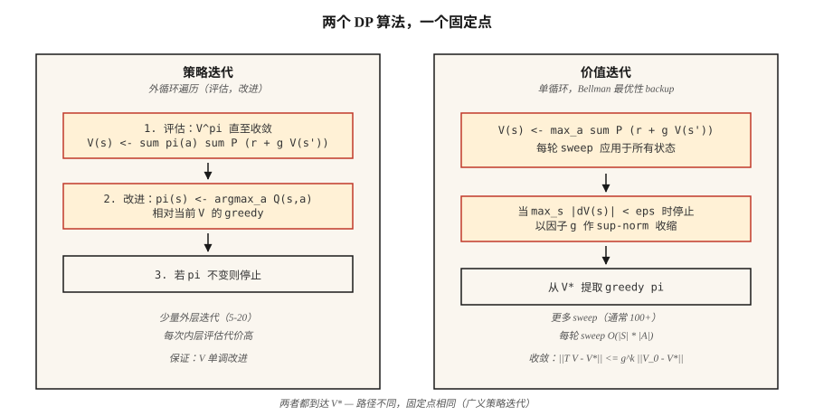

# Dynamic Programming — Policy Iteration 与 Value Iteration

> Dynamic programming 是带作弊的 RL。你已经知道 transition 和 reward functions；你只需要迭代 Bellman equation，直到 `V` 或 `π` 不再变化。它是每一种基于采样的方法都试图接近的基准。

**Type:** 构建
**Languages:** Python
**Prerequisites:** Phase 9 · 01 (MDPs)
**Time:** ~75 分钟

## 问题

你有一个带已知 model 的 MDP：你可以查询任意 state-action pair 的 `P(s' | s, a)` 和 `R(s, a, s')`。库存经理知道 demand distribution。棋盘游戏有 deterministic transitions。一个 gridworld 只是四行 Python。你拥有一个 *model*。

Model-free RL（Q-learning, PPO, REINFORCE）是为没有 model 的情况发明的，也就是你只能从 environment 中采样。但当你确实有 model 时，有更快、更好的方法：dynamic programming。Bellman 在 1957 年设计了它们。它们至今仍定义 correctness：当人们说“这个 MDP 的 optimal policy”时，他们指的就是 DP 会返回的 policy。

你在 2026 年需要它们有三个原因。第一，RL research 中的每个 tabular environment（GridWorld, FrozenLake, CliffWalking）都会用 DP 求解，以生成 gold-standard policy。第二，精确 values 可以让你 *debug* 采样方法：如果 Q-learning 对 `V*(s_0)` 的估计与 DP 答案相差 30%，你的 Q-learning 就有 bug。第三，现代 offline RL 和 planning methods（MCTS, AlphaZero's search, Phase 9 · 10 中的 model-based RL）都会在 learned 或 given model 上迭代 Bellman backup。

## 概念



**两个算法，本质上都是 Bellman 上的 fixed-point iteration。**

**Policy iteration。** 交替执行两个步骤，直到 policy 不再变化。

1. *Evaluation:* 给定 policy `π`，通过反复应用 `V(s) ← Σ_a π(a|s) Σ_{s',r} P(s',r|s,a) [r + γ V(s')]` 计算 `V^π`，直到它收敛。
2. *Improvement:* 给定 `V^π`，让 `π` 对 `V^π` 贪心：`π(s) ← argmax_a Σ_{s',r} P(s',r|s,a) [r + γ V(s')]`。

Convergence 有保证，因为 (a) 每个 improvement step 要么保持 `π` 不变，要么严格提升某些 state 的 `V^π`，(b) deterministic policies 的空间是有限的。即使对较大的 state spaces，通常也会在 ~5–20 次 outer iterations 内收敛。

**Value iteration。** 将 evaluation 和 improvement 折叠为一次 sweep。应用 Bellman *optimality* equation：

`V(s) ← max_a Σ_{s',r} P(s',r|s,a) [r + γ V(s')]`

重复直到 `max_s |V_{new}(s) - V(s)| < ε`。最后通过取 greedy action 提取 policy。每次 iteration 严格更快，因为没有内部 evaluation loop，但通常需要更多 iterations 才能收敛。

**Generalized policy iteration (GPI)。** 统一的表述框架。Value function 和 policy 被锁定在双向 improvement loop 中；任何同时推动两者走向相互一致的方法（async value iteration, modified policy iteration, Q-learning, actor-critic, PPO）都是 GPI 的实例。

**为什么 `γ < 1` 很重要。** Bellman operator 在 sup-norm 下是一个 `γ`-contraction：`||T V - T V'||_∞ ≤ γ ||V - V'||_∞`。Contraction 意味着唯一 fixed point 和 geometric convergence。去掉 `γ < 1`，你就失去了保证；你需要 finite horizon 或 absorbing terminal state。

## 构建它

### 步骤 1： 构建 GridWorld MDP model

使用 Lesson 01 中相同的 4×4 GridWorld。我们添加一个 stochastic 变体：以 `0.1` 的概率，agent 会滑向一个随机的垂直方向。

```python
SLIP = 0.1

def transitions(state, action):
    if state == TERMINAL:
        return [(state, 0.0, 1.0)]
    outcomes = []
    for direction, prob in action_probs(action):
        outcomes.append((apply_move(state, direction), -1.0, prob))
    return outcomes
```

`transitions(s, a)` 返回 `(s', r, p)` 的列表。这就是整个 model。

### 步骤 2： policy evaluation

给定一个 policy `π(s) = {action: prob}`，迭代 Bellman equation，直到 `V` 不再变化：

```python
def policy_evaluation(policy, gamma=0.99, tol=1e-6):
    V = {s: 0.0 for s in states()}
    while True:
        delta = 0.0
        for s in states():
            v = sum(pi_a * sum(p * (r + gamma * V[s_prime])
                              for s_prime, r, p in transitions(s, a))
                   for a, pi_a in policy(s).items())
            delta = max(delta, abs(v - V[s]))
            V[s] = v
        if delta < tol:
            return V
```

### 步骤 3: policy improvement

用相对于 `V` 的 greedy policy 替换 `π`。如果 `π` 没有变化，就返回，因为我们已经到达 optimum。

```python
def policy_improvement(V, gamma=0.99):
    new_policy = {}
    for s in states():
        best_a = max(
            ACTIONS,
            key=lambda a: sum(p * (r + gamma * V[s_prime])
                              for s_prime, r, p in transitions(s, a)),
        )
        new_policy[s] = best_a
    return new_policy
```

### 步骤 4： 把它们串起来

```python
def policy_iteration(gamma=0.99):
    policy = {s: "up" for s in states()}   # arbitrary start
    for _ in range(100):
        V = policy_evaluation(lambda s: {policy[s]: 1.0}, gamma)
        new_policy = policy_improvement(V, gamma)
        if new_policy == policy:
            return V, policy
        policy = new_policy
```

4×4 上的典型 convergence：4–6 次 outer iterations。输出 `V*(0,0) ≈ -6`，以及一个会严格减少 step count 的 policy。

### 步骤 5： value iteration（单 loop 版本）

```python
def value_iteration(gamma=0.99, tol=1e-6):
    V = {s: 0.0 for s in states()}
    while True:
        delta = 0.0
        for s in states():
            v = max(sum(p * (r + gamma * V[s_prime])
                       for s_prime, r, p in transitions(s, a))
                   for a in ACTIONS)
            delta = max(delta, abs(v - V[s]))
            V[s] = v
        if delta < tol:
            break
    policy = policy_improvement(V, gamma)
    return V, policy
```

相同的 fixed point，更少的代码行。

## 易错点

- **忘记处理 terminals。** 如果你把 Bellman 应用于 absorbing state，它仍然会得到一个不会改变任何东西的“best action”。用 `if s == terminal: V[s] = 0` 做保护。
- **Sup-norm vs L2 convergence。** 使用 `max |V_new - V|`，而不是平均值。理论保证基于 sup-norm。
- **In-place vs synchronous updates。** 原地更新 `V[s]`（Gauss-Seidel）比单独使用 `V_new` dict（Jacobi）收敛更快。生产代码使用 in-place。
- **Policy ties。** 如果两个 actions 有相同 Q-value，`argmax` 可能在每次 iteration 中以不同方式打破 ties，导致“policy stable”检查振荡。使用稳定的 tie-break（固定顺序中的第一个 action）。
- **State-space explosion。** DP 每次 sweep 是 `O(|S| · |A|)`。可用于最多约 ~10⁷ 个 states。超过这个规模，你需要 function approximation（Phase 9 · 05 以后）。

## 使用它

在 2026 年，DP 是 correctness baseline，也是 planners 的 inner loop：

| Use case | Method |
|----------|--------|
| 精确求解一个小型 tabular MDP | Value iteration（更简单）或 policy iteration（更少 outer steps） |
| 验证 Q-learning / PPO implementation | 在 toy environment 上与 DP-optimal V* 比较 |
| Model-based RL（Phase 9 · 10） | 在 learned transition model 上做 Bellman backup |
| AlphaZero / MuZero 中的 planning | Monte Carlo Tree Search = async Bellman backup |
| Offline RL（CQL, IQL） | Conservative Q-iteration，即带有 OOD actions penalty 的 DP |

每当有人说“the optimal value function”时，他们的意思就是“the DP fixed point”。当你在论文中看到 `V*` 或 `Q*`，脑中就应浮现这个 loop。

## 交付它

保存为 `outputs/skill-dp-solver.md`：

```markdown
---
name: dp-solver
description: Solve a small tabular MDP exactly via policy iteration or value iteration. Report convergence behavior.
version: 1.0.0
phase: 9
lesson: 2
tags: [rl, dynamic-programming, bellman]
---

Given an MDP with a known model, output:

1. Choice. Policy iteration vs value iteration. Reason tied to |S|, |A|, γ.
2. Initialization. V_0, starting policy. Convergence sensitivity.
3. Stopping. Sup-norm tolerance ε. Expected number of sweeps.
4. Verification. V*(s_0) computed exactly. Greedy policy extracted.
5. Use. How this baseline will be used to debug/evaluate sampling-based methods.

Refuse to run DP on state spaces > 10⁷. Refuse to claim convergence without a sup-norm check. Flag any γ ≥ 1 on an infinite-horizon task as a guarantee violation.
```

## 练习

1. **Easy。** 在 4×4 GridWorld 上运行 value iteration，使用 `γ ∈ {0.9, 0.99}`。直到 `max |ΔV| < 1e-6` 需要多少 sweeps？将 `V*` 打印为 4×4 grid。
2. **Medium。** 在 *stochastic* GridWorld（slip probability `0.1`）上比较 policy iteration 和 value iteration。统计：sweeps、wall-clock time、最终 `V*(0,0)`。哪个在 iterations 上收敛更快？哪个在 wall-clock 上更快？
3. **Hard。** 构建 modified policy iteration：在 evaluation step 中，只运行 `k` 次 sweeps，而不是直到 convergence。绘制 `V*(0,0)` error vs `k`，其中 `k ∈ {1, 2, 5, 10, 50}`。这条 curve 告诉你 evaluation/improvement tradeoff 的什么信息？

## 关键术语
| Term | What people say | What it actually means |
|------|-----------------|-----------------------|
| Policy iteration | “DP algorithm” | 交替进行 evaluation（`V^π`）和 improvement（相对于 `V^π` 的 greedy `π`），直到 policy 不再变化。 |
| Value iteration | “Faster DP” | 在一次 sweep 中应用 Bellman optimality backup；以 geometric 方式收敛到 `V*`。 |
| Bellman operator | “The recursion” | `(T V)(s) = max_a Σ P (r + γ V(s'))`；在 sup-norm 下是一个 `γ`-contraction。 |
| Contraction | “Why DP converges” | 任何满足 `||T x - T y|| ≤ γ ||x - y||` 的 operator `T` 都有唯一 fixed point。 |
| GPI | “Everything is DP” | Generalized Policy Iteration：任何推动 `V` 和 `π` 走向相互一致的方法。 |
| Synchronous update | “Jacobi-style” | 在整个 sweep 中使用旧的 `V`；便于清晰分析，但更慢。 |
| In-place update | “Gauss-Seidel-style” | 在 `V` 被更新时直接使用它；实践中收敛更快。 |

## 延伸阅读
- [Sutton & Barto (2018). Ch. 4 — Dynamic Programming](http://incompleteideas.net/book/RLbook2020.pdf) — policy iteration 和 value iteration 的 canonical presentation。
- [Bertsekas (2019). Reinforcement Learning and Optimal Control](http://www.athenasc.com/rlbook.html) — 对 contraction-mapping arguments 的严格处理。
- [Puterman (2005). Markov Decision Processes](https://onlinelibrary.wiley.com/doi/book/10.1002/9780470316887) — modified policy iteration 及其 convergence analysis。
- [Howard (1960). Dynamic Programming and Markov Processes](https://mitpress.mit.edu/9780262582300/dynamic-programming-and-markov-processes/) — 原始的 policy iteration 论文。
- [Bertsekas & Tsitsiklis (1996). Neuro-Dynamic Programming](http://www.athenasc.com/ndpbook.html) — 从 DP 到 approximate-DP / deep RL 的桥梁，后续每节课都会用到。
