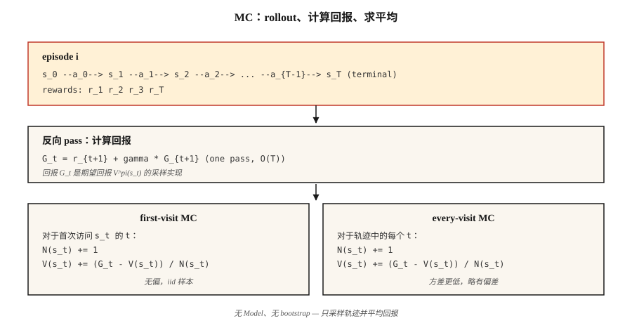

# Monte Carlo Methods — Learning from Complete Episodes

> Dynamic programming 需要 model。Monte Carlo 除了 episodes 什么都不需要。运行 policy，观察 returns，取平均。这是 RL 中最简单的想法，也是解锁后续一切的想法。

**Type:** Build
**Languages:** Python
**Prerequisites:** Phase 9 · 01 (MDPs), Phase 9 · 02 (Dynamic Programming)
**Time:** ~75 minutes

## 问题

Dynamic programming 很优雅，但它假设你可以对每个 state 和 action 查询 `P(s' | s, a)`。现实世界中几乎没有什么是这样工作的。Robot 无法解析地计算施加 joint torque 后 camera pixels 的分布。Pricing algorithm 无法对每一种可能的 customer reaction 积分。LLM 无法枚举某个 Token 之后的所有可能 continuations。

你需要一种只依赖于从 environment 中 *sample* 的方法。运行 policy。得到一条 trajectory：`s_0, a_0, r_1, s_1, a_1, r_2, …, s_T`。用它估计 values。这就是 Monte Carlo。

从 DP 到 MC 的转变在理念上很重要：我们从 *known model + exact backup* 转向 *sampled rollouts + averaged return*。Variance 会上升，但适用性会爆炸式扩大。本课之后的每个 RL algorithm，TD、Q-learning、REINFORCE、PPO、GRPO，本质上都是 Monte Carlo estimator，有时会在其上叠加 bootstrapping。

## 概念



**核心思想，一行表达：** `V^π(s) = E_π[G_t | s_t = s] ≈ (1/N) Σ_i G^{(i)}(s)`，其中 `G^{(i)}(s)` 是在 policy `π` 下访问 `s` 之后观察到的 returns。

**First-visit vs every-visit MC。** 给定一个多次访问 state `s` 的 episode，first-visit MC 只统计第一次访问后的 return；every-visit MC 统计所有访问。二者在极限下都是 unbiased。First-visit 更容易分析（iid samples）。Every-visit 每个 episode 使用更多数据，在实践中通常收敛更快。

**Incremental mean。** 不存储所有 returns，而是更新 running average：

`V_n(s) = V_{n-1}(s) + (1/n) [G_n - V_{n-1}(s)]`

重新整理：`V_new = V_old + α · (target - V_old)`，其中 `α = 1/n`。把 `1/n` 换成 constant step-size `α ∈ (0, 1)`，你就得到一个 non-stationary MC estimator，它会跟踪 `π` 的变化。这个动作就是从 MC 跳到 TD，再跳到每个现代 RL algorithm 的全部关键。

**Exploration 现在成了问题。** DP 通过枚举触及每个 state。MC 只看到 policy 会访问的 states。如果 `π` 是 deterministic，state space 中整片区域永远不会被 sampled，它们的 value estimates 会永远停留在零。三个修复方法，按历史顺序：

1. **Exploring starts。** 从随机 (s, a) pair 开始每个 episode。保证 coverage；实践中不现实（你不能把 robot “reset” 到任意 state）。
2. **ε-greedy。** 相对于当前 Q 采取 greedy action，但以概率 `ε` 选择随机 action。所有 state-action pairs 都会渐近地被 sampled。
3. **Off-policy MC。** 在 behavior policy `μ` 下收集数据，通过 importance sampling 学习 target policy `π`。Variance 高，但这是通向 DQN 等 replay-buffer methods 的桥梁。

**Monte Carlo Control。** Evaluate → improve → evaluate，就像 policy iteration 一样，但 evaluation 是 sampling-based：

1. 运行 `π`，得到一个 episode。
2. 根据观察到的 returns 更新 `Q(s, a)`。
3. 让 `π` 相对于 `Q` 变成 ε-greedy。
4. 重复。

在温和条件下（每个 pair 被无限次访问，`α` 满足 Robbins-Monro），会以概率 1 收敛到 `Q*` 和 `π*`。

## 动手构建

### Step 1: rollout → (s, a, r) 列表

```python
def rollout(env, policy, max_steps=200):
    trajectory = []
    s = env.reset()
    for _ in range(max_steps):
        a = policy(s)
        s_next, r, done = env.step(s, a)
        trajectory.append((s, a, r))
        s = s_next
        if done:
            break
    return trajectory
```

没有 model，只有 `env.reset()` 和 `env.step(s, a)`。接口与 gym environment 相同，但做了精简。

### Step 2: 计算 returns（反向 sweep）

```python
def returns_from(trajectory, gamma):
    returns = []
    G = 0.0
    for _, _, r in reversed(trajectory):
        G = r + gamma * G
        returns.append(G)
    return list(reversed(returns))
```

一次 pass，`O(T)`。反向 recurrence `G_t = r_{t+1} + γ G_{t+1}` 避免了重复求和。

### Step 3: first-visit MC evaluation

```python
def mc_policy_evaluation(env, policy, episodes, gamma=0.99):
    V = defaultdict(float)
    counts = defaultdict(int)
    for _ in range(episodes):
        trajectory = rollout(env, policy)
        returns = returns_from(trajectory, gamma)
        seen = set()
        for t, ((s, _, _), G) in enumerate(zip(trajectory, returns)):
            if s in seen:
                continue
            seen.add(s)
            counts[s] += 1
            V[s] += (G - V[s]) / counts[s]
    return V
```

真正工作的就是三行：第一次访问时标记 state 为 seen，增加 count，更新 running mean。

### Step 4: ε-greedy MC control（on-policy）

```python
def mc_control(env, episodes, gamma=0.99, epsilon=0.1):
    Q = defaultdict(lambda: {a: 0.0 for a in ACTIONS})
    counts = defaultdict(lambda: {a: 0 for a in ACTIONS})

    def policy(s):
        if random() < epsilon:
            return choice(ACTIONS)
        return max(Q[s], key=Q[s].get)

    for _ in range(episodes):
        trajectory = rollout(env, policy)
        returns = returns_from(trajectory, gamma)
        seen = set()
        for (s, a, _), G in zip(trajectory, returns):
            if (s, a) in seen:
                continue
            seen.add((s, a))
            counts[s][a] += 1
            Q[s][a] += (G - Q[s][a]) / counts[s][a]
    return Q, policy
```

### Step 5: 与 DP gold standard 对比

当 episodes → ∞ 时，你对 `V^π` 的 MC estimate 应该与 Lesson 02 中的 DP result 一致。实践中：在 4×4 GridWorld 上运行 50,000 episodes，可以达到与 DP 答案相差约 `~0.1` 的范围内。

## 常见陷阱

- **Infinite episodes。** MC 要求 episodes 必须 *terminate*。如果你的 policy 可能永远 loop，请设置 `max_steps` 上限，并把达到上限视作隐式 failure。带 random policy 的 GridWorld 经常 timeout，这是正常的，只要确保你正确计数。
- **Variance。** MC 使用完整 returns。在长 episodes 上，variance 很大，末尾一次倒霉的 reward 会以同样的量移动 `V(s_0)`。TD methods（Lesson 04）通过 bootstrapping 降低这一点。
- **State coverage。** 在新 Q 上做 greedy MC，若出现 ties，只会不断尝试一个 action。你 *必须* 做 exploration（ε-greedy、exploring starts、UCB）。
- **Non-stationary policies。** 如果 `π` 发生变化（如 MC control 中那样），旧 returns 来自不同的 policy。Constant-α MC 可以处理这一点；sample-average MC 不行。
- **Off-policy importance sampling。** 权重 `π(a|s)/μ(a|s)` 会沿 trajectory 连乘。Variance 会随 horizon 爆炸。用 per-decision weighted IS 截断，或切换到 TD。

## 使用它

Monte Carlo methods 在 2026 年的角色：

| Use case | Why MC |
|----------|--------|
| Short-horizon games（blackjack、poker） | Episodes 自然 terminate；returns 清晰。 |
| Logged policy 的 offline evaluation | 对 stored trajectories 的 discounted returns 求平均。 |
| Monte Carlo Tree Search（AlphaZero） | 从 tree leaves 发起的 MC rollouts 指导 selection。 |
| LLM RL evaluation | 为给定 policy 计算 sampled completions 的 average reward。 |
| PPO 中的 baseline estimation | Advantage target `A_t = G_t - V(s_t)` 使用 MC `G_t`。 |
| RL 教学 | 最简单且真正有效的 algorithm；去掉 bootstrapping 就能看到核心。 |

现代 deep-RL algorithms（PPO、SAC）会通过 `n`-step returns 或 GAE，在 pure MC（full returns）和 pure TD（one-step bootstrap）之间插值。两个端点都是同一类 estimator 的实例。

## 交付它

保存为 `outputs/skill-mc-evaluator.md`：

```markdown
---
name: mc-evaluator
description: 通过 Monte Carlo rollouts 评估 policy，并在可用时生成带有 DP-comparison 的 convergence report。
version: 1.0.0
phase: 9
lesson: 3
tags: [rl, monte-carlo, evaluation]
---

给定一个 environment（episodic，带 reset+step API）和一个 policy，输出：

1. 方法。First-visit vs every-visit MC。理由。
2. Episode budget。目标数量、variance diagnostic、预期 standard error。
3. Exploration plan。ε schedule（如需要）或 exploring starts。
4. Gold-standard comparison。如果是 tabular，则给出 DP-optimal V*；否则给出来自 Q-learning / PPO baseline 的 bound。
5. Termination check。Max-step cap、timeouts、non-terminating trajectories 的处理。

没有 finite horizon cap 时，拒绝在 non-episodic tasks 上运行 MC。对于 tabular tasks，如果每个 state 少于 100 个 episodes，拒绝报告 V^π estimates。将任何具有 zero-variance actions 的 policy 标记为 exploration risk。
```

## 练习

1. **Easy.** 实现 4×4 GridWorld 上 uniform-random policy 的 first-visit MC evaluation。运行 10,000 episodes。将 `V(0,0)` 随 episode count 变化的曲线与 DP 答案对照绘制。
2. **Medium.** 用 `ε ∈ {0.01, 0.1, 0.3}` 实现 ε-greedy MC control。比较 20,000 episodes 后的 mean return。Curve 看起来是什么样？Bias-variance tradeoff 体现在哪里？
3. **Hard.** 使用 importance sampling 实现 *off-policy* MC：在 uniform-random policy `μ` 下收集数据，估计 deterministic optimal policy `π` 的 `V^π`。比较 plain IS、per-decision IS 和 weighted IS。哪个 variance 最低？

## 关键术语

| Term | What people say | What it actually means |
|------|-----------------|-----------------------|
| Monte Carlo | “Random sampling” | 通过对来自分布的 iid samples 求平均来估计 expectations。 |
| Return `G_t` | “Future reward” | 从 step `t` 到 episode 结束的 discounted rewards 总和：`Σ_{k≥0} γ^k r_{t+k+1}`。 |
| First-visit MC | “Count each state once” | 一个 episode 中只有第一次访问会贡献到 value estimate。 |
| Every-visit MC | “Use all visits” | 每次访问都会贡献；略有 biased，但 sample-efficient 更高。 |
| ε-greedy | “Exploration noise” | 以概率 `1-ε` 选择 greedy action；以概率 `ε` 选择 random action。 |
| Importance sampling | “Correcting for sampling from the wrong distribution” | 通过 `π(a\|s)/μ(a\|s)` 乘积对 returns 重新加权，从 `μ` 数据估计 `V^π`。 |
| On-policy | “Learn from my own data” | Target policy = behavior policy。Vanilla MC、PPO、SARSA。 |
| Off-policy | “Learn from someone else's data” | Target policy ≠ behavior policy。Importance-sampled MC、Q-learning、DQN。 |

## 延伸阅读

- [Sutton & Barto (2018). Ch. 5 — Monte Carlo Methods](http://incompleteideas.net/book/RLbook2020.pdf) — 经典处理。
- [Singh & Sutton (1996). Reinforcement Learning with Replacing Eligibility Traces](https://link.springer.com/article/10.1007/BF00114726) — first-visit vs every-visit analysis。
- [Precup, Sutton, Singh (2000). Eligibility Traces for Off-Policy Policy Evaluation](http://incompleteideas.net/papers/PSS-00.pdf) — off-policy MC 和 variance control。
- [Mahmood et al. (2014). Weighted Importance Sampling for Off-Policy Learning](https://arxiv.org/abs/1404.6362) — 现代 low-variance IS estimators。
- [Tesauro (1995). TD-Gammon, A Self-Teaching Backgammon Program](https://dl.acm.org/doi/10.1145/203330.203343) — MC/TD self-play 收敛到 superhuman play 的首个大规模实证展示；也是本 phase 后半部分每节课的概念先驱。
