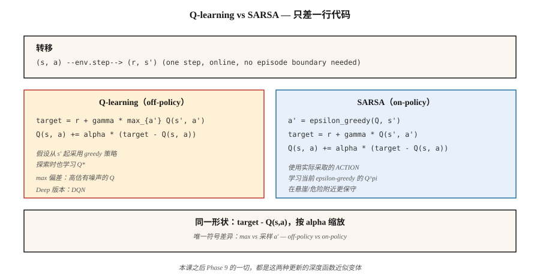

# Temporal Difference — Q-Learning & SARSA

> Monte Carlo 会一直等到 episode 结束。TD 通过 bootstrap 下一个 value estimate，在每一步之后更新。Q-learning 是 off-policy 且偏乐观；SARSA 是 on-policy 且偏谨慎。两者都只是一行代码。两者也支撑着本 Phase 中的每一种 deep-RL 方法。

**Type:** Build
**Languages:** Python
**前置要求:** Phase 9 · 01 (MDPs), Phase 9 · 02 (Dynamic Programming), Phase 9 · 03 (Monte Carlo)
**Time:** ~75 minutes

## 问题

Monte Carlo 可行，但它有两个代价很高的要求。它需要会终止的 episodes，并且只能在最终 return 得到之后才更新。如果你的 episode 有 1,000 步，MC 就要等 1,000 步才会更新任何东西。它是高方差、低偏差的，实践中也很慢。

Dynamic programming 则相反：零方差的 bootstrapped backups，但要求已知 model。

Temporal difference (TD) learning 折中了两者。根据单个 transition `(s, a, r, s')`，构造一个 one-step target `r + γ V(s')`，并把 `V(s)` 朝它推近。不需要 model。不需要完整 episodes。由于在 RHS 上使用近似的 `V` 会引入偏差，但方差远低于 MC，并且从第一步开始就能在线更新。

这是所有现代 RL（DQN、A2C、PPO、SAC）所依赖的支点。Phase 9 剩下的内容，都是在你将在本课中写出的 one-step TD update 之上叠加 function approximation 和技巧。

## 概念



**用于 V 的 TD(0) update：**

`V(s) ← V(s) + α [r + γ V(s') - V(s)]`

方括号中的量是 TD error `δ = r + γ V(s') - V(s)`。它是 MC 中 `G_t - V(s_t)` 的在线对应物。收敛要求 `α` 满足 Robbins-Monro（`Σ α = ∞`，`Σ α² < ∞`），并且所有 states 被无限次访问。

**Q-learning。** 一种用于 control 的 off-policy TD 方法：

`Q(s, a) ← Q(s, a) + α [r + γ max_{a'} Q(s', a') - Q(s, a)]`

`max` 假设从 `s'` 开始会遵循 *greedy* policy，不管 agent 实际采取了什么 action。这种解耦让 Q-learning 在 agent 通过 ε-greedy 探索时仍然学习 `Q*`。Mnih et al. (2015) 将它转换成 Atari 上的 deep Q-learning（Lesson 05）。

**SARSA。** 一种 on-policy TD 方法：

`Q(s, a) ← Q(s, a) + α [r + γ Q(s', a') - Q(s, a)]`

这个名字来自 tuple `(s, a, r, s', a')`。SARSA 使用 agent 下一步*实际*采取的 action `a'`，而不是 greedy `argmax`。它会收敛到当前运行的任意 ε-greedy `π` 对应的 `Q^π`；在极限 `ε → 0` 下会变成 `Q*`。

**cliff-walking 的差异。** 在经典的 cliff-walking 任务中（掉下悬崖 = reward -100），Q-learning 学到沿着悬崖边缘的最优路径，但在探索期间偶尔会吃到惩罚。SARSA 会学到一条离悬崖一步远的更安全路径，因为它把探索噪声计入了自己的 Q-value。随着训练，在 `ε → 0` 时两者都会达到最优。实践中这很重要：当部署时确实还在发生探索，SARSA 的行为会更保守。

**Expected SARSA。** 用 `π` 下的期望值替换 `Q(s', a')`：

`Q(s, a) ← Q(s, a) + α [r + γ Σ_{a'} π(a'|s') Q(s', a') - Q(s, a)]`

方差低于 SARSA（不对 `a'` 采样），目标同样是 on-policy。现代教材中通常会把它作为默认选择。

**n-step TD 和 TD(λ)。** 通过等待 `n` 步再 bootstrap，在 TD(0) 和 MC 之间插值。`n=1` 是 TD，`n=∞` 是 MC。TD(λ) 用几何权重 `(1-λ)λ^{n-1}` 对所有 `n` 求平均。大多数 deep-RL 使用 3 到 20 之间的 `n`。


```figure
qlearning-gridworld
```

## 构建它

### 步骤 1： 基于 ε-greedy policy 的 SARSA

```python
def sarsa(env, episodes, alpha=0.1, gamma=0.99, epsilon=0.1):
    Q = defaultdict(lambda: {a: 0.0 for a in ACTIONS})

    def choose(s):
        if random() < epsilon:
            return choice(ACTIONS)
        return max(Q[s], key=Q[s].get)

    for _ in range(episodes):
        s = env.reset()
        a = choose(s)
        while True:
            s_next, r, done = env.step(s, a)
            a_next = choose(s_next) if not done else None
            target = r + (gamma * Q[s_next][a_next] if not done else 0.0)
            Q[s][a] += alpha * (target - Q[s][a])
            if done:
                break
            s, a = s_next, a_next
    return Q
```

八行。与 Q-learning 的*唯一*区别就是 target 那一行。

### 步骤 2： Q-learning

```python
def q_learning(env, episodes, alpha=0.1, gamma=0.99, epsilon=0.1):
    Q = defaultdict(lambda: {a: 0.0 for a in ACTIONS})
    for _ in range(episodes):
        s = env.reset()
        while True:
            a = choose(s, Q, epsilon)
            s_next, r, done = env.step(s, a)
            target = r + (gamma * max(Q[s_next].values()) if not done else 0.0)
            Q[s][a] += alpha * (target - Q[s][a])
            if done:
                break
            s = s_next
    return Q
```

`max` 将 target 与 behavior 解耦。这一个符号就是 on-policy 和 off-policy 的区别。

### 步骤 3： learning curves

跟踪每 100 个 episodes 的 mean return。Q-learning 在简单的确定性 GridWorld 上收敛更快；SARSA 在 cliff-walking 上更保守。在 `code/main.py` 的 4×4 GridWorld 中，两者在 `α=0.1, ε=0.1` 下，约 2,000 个 episodes 后都接近最优。

### 步骤 4： 与 DP 真值比较

运行 value iteration（Lesson 02）得到 `Q*`。检查 `max_{s,a} |Q_learned(s,a) - Q*(s,a)|`。一个健康的 tabular TD agent 在 4×4 GridWorld 上训练 10,000 个 episodes 后，应落在 `~0.5` 以内。

## 陷阱

- **初始 Q values 很重要。** 乐观初始化（负 reward 任务中 `Q = 0`）会鼓励探索。悲观初始化可能永远困住 greedy policy。
- **α schedule。** 常数 `α` 对非平稳问题是可以的。递减的 `α_n = 1/n` 在理论上能收敛，但实践中太慢；把 `α` 固定在 `[0.05, 0.3]`，并监控 learning curve。
- **ε schedule。** 从高值开始（`ε=1.0`），衰减到 `ε=0.05`。"GLIE"（greedy in the limit with infinite exploration）是收敛条件。
- **Q-learning 中的 max bias。** 当 `Q` 有噪声时，`max` operator 存在向上偏差。会导致高估；Hasselt 的 Double Q-learning（Lesson 05 中 DDQN 使用的做法）用两个 Q tables 修复这个问题。
- **非终止 episodes。** TD 可以在没有 terminals 的情况下学习，但你需要限制步数，或在上限处正确处理 bootstrap。标准做法：把上限视为 non-terminal，继续 bootstrapping。
- **State hashing。** 如果 states 是 tuples/tensors，使用可 hash 的 key（tuple，不是 list；四舍五入后的 floats tuple，不是 raw floats）。

## 使用它

2026 年的 TD landscape：

| Task | Method | Reason |
|------|--------|--------|
| 小型 tabular environments | Q-learning | 直接学习 optimal policy。 |
| On-policy safety-critical | SARSA / Expected SARSA | 探索期间更保守。 |
| High-dimensional state | DQN (Phase 9 · 05) | 带 replay 和 target net 的 Neural Network Q-function。 |
| Continuous actions | SAC / TD3 (Phase 9 · 07) | 在 Q-network 上做 TD update；policy net 发出 actions。 |
| LLM RL (reward-model-based) | PPO / GRPO (Phase 9 · 08, 12) | 使用通过 GAE 得到的 TD-style advantage 的 actor-critic。 |
| Offline RL | CQL / IQL (Phase 9 · 08) | 带 conservative regularization 的 Q-learning。 |

你在 2026 年论文中读到的九成 "RL"，都是 Q-learning 或 SARSA 的某种扩展。深入阅读前，先把 tabular update 练到手上。

## 交付它

保存为 `outputs/skill-td-agent.md`：

```markdown
---
name: td-agent
description: Pick between Q-learning, SARSA, Expected SARSA for a tabular or small-feature RL task.
version: 1.0.0
phase: 9
lesson: 4
tags: [rl, td-learning, q-learning, sarsa]
---

Given a tabular or small-feature environment, output:

1. Algorithm. Q-learning / SARSA / Expected SARSA / n-step variant. One-sentence reason tied to on-policy vs off-policy and variance.
2. Hyperparameters. α, γ, ε, decay schedule.
3. Initialization. Q_0 value (optimistic vs zero) and justification.
4. Convergence diagnostic. Target learning curve, `|Q - Q*|` check if DP is possible.
5. Deployment caveat. How will exploration behave at inference? Is SARSA's conservatism needed?

Refuse to apply tabular TD to state spaces > 10⁶. Refuse to ship a Q-learning agent without a max-bias caveat. Flag any agent trained with ε held at 1.0 throughout (no exploitation phase).
```

## 练习

1. **Easy。** 在 4×4 GridWorld 上实现 Q-learning 和 SARSA。绘制 2,000 个 episodes 的 learning curves（每 100 个 episodes 的 mean return）。谁收敛更快？
2. **Medium。** 构建一个 cliff-walking environment（4×12，最后一行是 cliff，reward -100 并 reset 到起点）。比较 Q-learning 和 SARSA 的最终 policies。截图展示它们各自走过的路径。哪一个更靠近 cliff？
3. **Hard。** 实现 Double Q-learning。在 noisy-reward GridWorld 上（给每步 reward 添加 Gaussian noise σ=5），展示 Q-learning 会明显高估 `V*(0,0)`，而 Double Q-learning 不会。

## 关键术语
| Term | What people say | What it actually means |
|------|-----------------|-----------------------|
| TD error | "The update signal" | `δ = r + γ V(s') - V(s)`，bootstrapped residual。 |
| TD(0) | "One-step TD" | 每次 transition 后只使用 next state's estimate 进行更新。 |
| Q-learning | "Off-policy RL 101" | 对 next-state actions 使用 `max` 的 TD update；无论 behavior policy 如何，都会学习 `Q*`。 |
| SARSA | "On-policy Q-learning" | 使用实际 next action 的 TD update；为当前 ε-greedy π 学习 `Q^π`。 |
| Expected SARSA | "The low-variance SARSA" | 用 π 下的期望替换采样得到的 `a'`。 |
| GLIE | "Correct exploration schedule" | Greedy in the Limit with Infinite Exploration；Q-learning 收敛所需。 |
| Bootstrapping | "Using current estimate in the target" | 区分 TD 和 MC 的关键。是偏差来源，但能大幅降低方差。 |
| Maximization bias | "Q-learning overestimates" | 对有噪声 estimates 取 `max` 会产生向上偏差；由 Double Q-learning 修复。 |

## 延伸阅读
- [Watkins & Dayan (1992). Q-learning](https://link.springer.com/article/10.1007/BF00992698) — 原始论文和收敛证明。
- [Sutton & Barto (2018). Ch. 6 — Temporal-Difference Learning](http://incompleteideas.net/book/RLbook2020.pdf) — TD(0)、SARSA、Q-learning、Expected SARSA。
- [Hasselt (2010). Double Q-learning](https://papers.nips.cc/paper_files/paper/2010/hash/091d584fced301b442654dd8c23b3fc9-Abstract.html) — maximization bias 的修复方法。
- [Seijen, Hasselt, Whiteson, Wiering (2009). A Theoretical and Empirical Analysis of Expected SARSA](https://ieeexplore.ieee.org/document/4927542) — expected SARSA 的动机。
- [Rummery & Niranjan (1994). On-line Q-learning using connectionist systems](https://www.researchgate.net/publication/2500611_On-Line_Q-Learning_Using_Connectionist_Systems) — 创造 SARSA 这个术语的论文（当时称为 "modified connectionist Q-learning"）。
- [Sutton & Barto (2018). Ch. 7 — n-step Bootstrapping](http://incompleteideas.net/book/RLbook2020.pdf) — 将 TD(0) 泛化到 TD(n)，这是从 Q-learning 走向 eligibility traces，以及后来 PPO 中 GAE 的路径。
