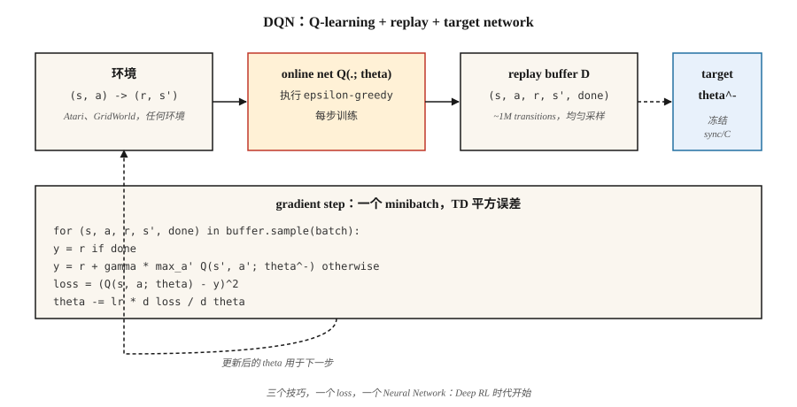

# Deep Q-Networks (DQN)

> 2013 年：Mnih 在原始 pixels 上训练了一个 Q-learning network，在七个 Atari 游戏中击败了所有 classical RL agent。2015 年：扩展到 49 个游戏，发表在 Nature 上，点燃了 deep-RL 时代。DQN 就是 Q-learning 加上三个让 function approximation 稳定下来的技巧。

**类型：** Build
**语言：** Python
**前置要求：** Phase 3 · 03 (Backpropagation), Phase 9 · 04 (Q-learning, SARSA)
**时间：** ~75 分钟

## 问题

Tabular Q-learning 需要为每个 (state, action) 对单独保存一个 Q-value。一个 chess board 大约有 10⁴³ 个 states。一帧 Atari 画面是 210×160×3 = 100,800 个 features。Tabular RL 在几千个 states 时就会失效，更不用说数十亿个 states。

事后看，修复方式很明显：用 Neural Network `Q(s, a; θ)` 替换 Q-table。但这种“事后显然”花了几十年才走到这里。朴素的 function approximation 搭配 Q-learning 会在 “deadly triad” 下发散：function approximation + bootstrapping + off-policy learning。Mnih et al. (2013, 2015) 找出了三个能稳定学习过程的工程技巧：

1. **Experience replay** 让 transitions 去相关。
2. **Target network** 冻结 bootstrap target。
3. **Reward clipping** 归一化 Gradient 幅度。

Atari 上的 DQN 是第一次用单一架构和单一 hyperparameter 集合，从原始 pixels 解决几十个 control problems。此后构建的所有 “deep-RL” 方法，包括 DDQN, Rainbow, Dueling, Distributional, R2D2, Agent57，都是叠在这个三技巧基础之上的。

## 概念



**目标。** DQN 在 Neural Q-function 上最小化 one-step TD loss：

`L(θ) = E_{(s,a,r,s')~D} [ (r + γ max_{a'} Q(s', a'; θ^-) - Q(s, a; θ))² ]`

`θ` = online network，每一步通过 Gradient Descent 更新。`θ^-` = target network，周期性地从 `θ` 复制（约每 10,000 步一次）。`D` = past transitions 的 replay buffer。

**三个技巧，按重要性排序：**

**Experience replay。** 一个包含 `~10⁶` transitions 的 ring buffer。每个训练步骤都会均匀随机采样一个 minibatch。这会打破时间相关性（连续 frames 几乎完全相同），让 network 能从罕见的 rewarding transitions 中反复学习，并让连续 Gradient 更新去相关。没有它，使用 Neural Net 的 on-policy TD 在 Atari 上会发散。

**Target network。** 在 Bellman 方程两侧都使用同一个 network `Q(·; θ)`，会让 target 在每次更新时都移动，也就是“追着自己的尾巴跑”。修复方式是：保留第二个 network `Q(·; θ^-)`，其 weights 冻结。每隔 `C` 步，复制 `θ → θ^-`。这会让 regression target 在数千个 Gradient steps 内保持稳定。Soft updates `θ^- ← τ θ + (1-τ) θ^-`（用于 DDPG, SAC）是更平滑的变体。

**Reward clipping。** Atari 的 reward 幅度从 1 到 1000+ 不等。裁剪到 `{-1, 0, +1}` 可以阻止某个单一游戏主导 Gradient。当 reward magnitude 重要时这是错误的；但对 Atari 来说可以，因为只有符号重要。

**Double DQN。** Hasselt (2016) 修复了 maximization bias：使用 online net 来*选择* action，使用 target net 来*评估*它。

`target = r + γ Q(s', argmax_{a'} Q(s', a'; θ); θ^-)`

这是一个 drop-in replacement，效果稳定更好。默认使用它。

**其他改进（Rainbow, 2017）：** prioritized replay（更多采样 high-TD-error transitions）、dueling architecture（分离 `V(s)` 和 advantage heads）、noisy networks（learned exploration）、n-step returns、distributional Q (C51/QR-DQN)、multi-step bootstrapping。每一项都会带来几个百分点的提升；收益大致可叠加。

## 构建它

这里的代码是 stdlib-only 且 numpy-free：我们在一个很小的 continuous GridWorld 上使用手写的 single-hidden-layer MLP，因此每个训练步骤都能在 microseconds 内运行。算法与规模化 Atari DQN 完全相同。

### 步骤 1：replay buffer

```python
class ReplayBuffer:
    def __init__(self, capacity):
        self.buf = []
        self.capacity = capacity
    def push(self, s, a, r, s_next, done):
        if len(self.buf) == self.capacity:
            self.buf.pop(0)
        self.buf.append((s, a, r, s_next, done))
    def sample(self, batch, rng):
        return rng.sample(self.buf, batch)
```

Atari 约使用 50,000 的容量；我们的 toy env 用 5,000 就足够。

### 步骤 2：一个很小的 Q-network（手写 MLP）

```python
class QNet:
    def __init__(self, n_in, n_hidden, n_actions, rng):
        self.W1 = [[rng.gauss(0, 0.3) for _ in range(n_in)] for _ in range(n_hidden)]
        self.b1 = [0.0] * n_hidden
        self.W2 = [[rng.gauss(0, 0.3) for _ in range(n_hidden)] for _ in range(n_actions)]
        self.b2 = [0.0] * n_actions
    def forward(self, x):
        h = [max(0.0, sum(w * xi for w, xi in zip(row, x)) + b) for row, b in zip(self.W1, self.b1)]
        q = [sum(w * hi for w, hi in zip(row, h)) + b for row, b in zip(self.W2, self.b2)]
        return q, h
```

Forward pass：linear → ReLU → linear。这就是整个 net。

### 步骤 3：DQN update

```python
def train_step(online, target, batch, gamma, lr):
    grads = zeros_like(online)
    for s, a, r, s_next, done in batch:
        q, h = online.forward(s)
        if done:
            y = r
        else:
            q_next, _ = target.forward(s_next)
            y = r + gamma * max(q_next)
        td_error = q[a] - y
        accumulate_grads(grads, online, s, h, a, td_error)
    apply_sgd(online, grads, lr / len(batch))
```

它的形状就是 Lesson 04 中的 Q-learning，只有两点区别：(a) 我们通过可微的 `Q(·; θ)` 做 Backpropagation，而不是索引 table；(b) target 使用 `Q(·; θ^-)`。

### 步骤 4：外层 loop

对每个 episode，基于 `Q(·; θ)` 执行 ε-greedy，把 transitions 放入 buffer，采样 minibatch，执行一次 Gradient step，并周期性同步 `θ^- ← θ`。模式如下：

```python
for episode in range(N):
    s = env.reset()
    while not done:
        a = epsilon_greedy(online, s, epsilon)
        s_next, r, done = env.step(s, a)
        buffer.push(s, a, r, s_next, done)
        if len(buffer) >= batch:
            train_step(online, target, buffer.sample(batch), gamma, lr)
        if steps % sync_every == 0:
            target = copy(online)
        s = s_next
```

在我们这个使用 16-dim one-hot state 的小型 GridWorld 中，agent 会在约 500 个 episodes 内学到接近最优的 policy。在 Atari 上，把它扩展到 200M frames，并添加 CNN feature extractor。

## 常见陷阱

- **Deadly triad。** Function approximation + off-policy + bootstrapping 可能发散。DQN 使用 target net + replay 缓解这个问题；不要移除任何一个。
- **Exploration。** ε 必须衰减，通常在训练前约 10% 的阶段从 1.0 衰减到 0.01。如果早期 exploration 不足，Q-net 会收敛到局部 basin。
- **Overestimation。** 对 noisy Q 取 `max` 会产生向上偏差。生产中始终使用 Double DQN。
- **Reward scale。** 裁剪或归一化 rewards；Gradient 幅度与 reward magnitude 成正比。
- **Replay buffer coldstart。** 在 buffer 拥有几千个 transitions 之前不要训练。基于约 20 个 samples 的早期 Gradients 会过拟合。
- **Target sync frequency。** 太频繁 ≈ 没有 target net；太不频繁 ≈ targets 过时。Atari DQN 使用 10,000 个 env steps。经验规则：每约 1/100 个 training horizon 同步一次。
- **Observation preprocessing。** Atari DQN 堆叠 4 帧，使 state 满足 Markov。任何包含 velocity info 的 env 都需要 frame-stacking 或 recurrent state。

## 使用它

到 2026 年，DQN 已很少是 state-of-the-art，但仍然是 reference off-policy algorithm：

| Task | 首选 Method | 为什么不是 DQN？ |
|------|-------------|------------------|
| Discrete-action Atari-like | Rainbow DQN or Muesli | 同一框架，更多技巧。 |
| Continuous control | SAC / TD3 (Phase 9 · 07) | DQN 没有 policy network。 |
| On-policy / high-throughput | PPO (Phase 9 · 08) | 没有 replay buffer；更容易扩展。 |
| Offline RL | CQL / IQL / Decision Transformer | Conservative Q targets，没有 bootstrapping blowups。 |
| Large discrete action spaces (recommender) | DQN with action embedding, or IMPALA | 可以；细节装饰很重要。 |
| LLM RL | PPO / GRPO | Sequence-level，而不是 step-level；Loss 不同。 |

这些经验仍然通用。Replay 和 target networks 出现在 SAC, TD3, DDPG, SAC-X, AlphaZero 的 self-play buffer，以及每一种 offline RL 方法中。Reward clipping 以 PPO 中 advantage normalization 的形式延续下来。这个架构就是蓝图。

## 交付它

保存为 `outputs/skill-dqn-trainer.md`：

```markdown
---
name: dqn-trainer
description: 为 discrete-action RL task 生成 DQN training config（buffer、target sync、ε schedule、reward clipping）。
version: 1.0.0
phase: 9
lesson: 5
tags: [rl, dqn, deep-rl]
---

给定一个 discrete-action environment（observation shape、action count、horizon、reward scale），输出：

1. Network。Architecture（MLP / CNN / Transformer）、feature dim、depth。
2. Replay buffer。Capacity、minibatch size、warmup size。
3. Target network。Sync strategy（hard every C steps 或 soft τ）。
4. Exploration。ε start / end / schedule length。
5. Loss。Huber vs MSE、gradient clip value、reward clipping rule。
6. Double DQN。默认启用，除非有明确理由禁用。

拒绝交付没有 target network、没有 replay buffer，或 ε 固定为 1 的 DQN。拒绝 continuous-action tasks（路由到 SAC / TD3）。标记任何 reward range > 10× per-step mean 的情况，说明需要 clipping 或 scale normalization。
```

## 练习

1. **Easy。** 运行 `code/main.py`。绘制 per-episode return curve。running mean 超过 -10 需要多少个 episodes？
2. **Medium。** 禁用 target network（在 Bellman target 两侧都使用 online net）。测量训练不稳定性：return 会震荡还是发散？
3. **Hard。** 添加 Double DQN：使用 online net 选择 `argmax a'`，使用 target net 评估。比较 noisy-reward GridWorld 上训练 1,000 个 episodes 后，使用与不使用 Double DQN 时 `Q(s_0, best_a)` 相对真实 `V*(s_0)` 的 bias。

## 关键术语
| Term | 人们怎么说 | 它实际是什么意思 |
|------|------------|------------------|
| DQN | “Deep Q-learning” | 带有 Neural Q-function、replay buffer 和 target network 的 Q-learning。 |
| Experience replay | “Shuffled transitions” | 每个 Gradient step 都均匀采样的 ring buffer；让数据去相关。 |
| Target network | “Frozen bootstrap” | 用于 Bellman target 的 Q 的周期性副本；稳定训练。 |
| Deadly triad | “为什么 RL 会发散” | Function approximation + bootstrapping + off-policy = 没有收敛保证。 |
| Double DQN | “修复 maximization bias” | Online net 选择 action，target net 评估它。 |
| Dueling DQN | “V and A heads” | 分解 Q = V + A - mean(A)；输出相同，Gradient flow 更好。 |
| Rainbow | “所有技巧” | DDQN + PER + dueling + n-step + noisy + distributional 合在一起。 |
| PER | “Prioritized Replay” | 按 TD-error magnitude 成比例采样 transitions。 |

## 延伸阅读

- [Mnih et al. (2013). Playing Atari with Deep Reinforcement Learning](https://arxiv.org/abs/1312.5602) — 开启 deep RL 的 2013 年 NeurIPS workshop paper。
- [Mnih et al. (2015). Human-level control through deep reinforcement learning](https://www.nature.com/articles/nature14236) — Nature 论文，49-game DQN。
- [Hasselt, Guez, Silver (2016). Deep Reinforcement Learning with Double Q-learning](https://arxiv.org/abs/1509.06461) — DDQN。
- [Wang et al. (2016). Dueling Network Architectures](https://arxiv.org/abs/1511.06581) — dueling DQN。
- [Hessel et al. (2018). Rainbow: Combining Improvements in Deep RL](https://arxiv.org/abs/1710.02298) — 叠加技巧的论文。
- [OpenAI Spinning Up — DQN](https://spinningup.openai.com/en/latest/algorithms/dqn.html) — 清晰的现代讲解。
- [Sutton & Barto (2018). Ch. 9 — On-policy Prediction with Approximation](http://incompleteideas.net/book/RLbook2020.pdf) — 教科书中对 “deadly triad”（function approximation + bootstrapping + off-policy）的处理；DQN 的 target network 和 replay buffer 正是为驯服它而设计的。
- [CleanRL DQN implementation](https://docs.cleanrl.dev/rl-algorithms/dqn/) — 用于 ablation studies 的参考 single-file DQN；适合与本课的 from-scratch 版本一起阅读。
