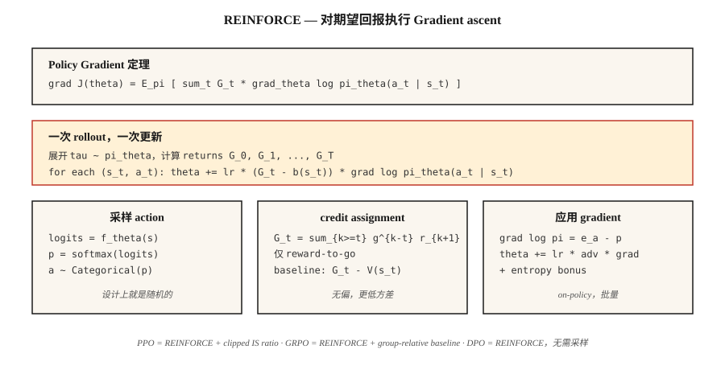

# Policy Gradient — 从零开始实现 REINFORCE

> 停止估计 value。直接参数化 policy，计算 expected return 的 Gradient，向上迈一步。Williams（1992）用一个 theorem 写下了它。这就是 PPO、GRPO 以及每个 LLM RL loop 存在的原因。

**类型：** Build
**语言：** Python
**先修：** Phase 3 · 03（Backpropagation）、Phase 9 · 03（Monte Carlo）、Phase 9 · 04（TD Learning）
**时间：** 约 75 分钟

## 问题

Q-learning 和 DQN 参数化的是 *value* function。你通过 `argmax Q` 选择 action。这对 discrete actions 和 discrete states 没问题。但当 actions 是 continuous 时会失效（在 10 维 torque 上做哪个 `argmax`？），或者当你想要 stochastic policy 时也会失效（`argmax` 在构造上就是 deterministic 的）。

Policy gradients 改为参数化 *policy*。`π_θ(a | s)` 是一个 Neural Network，它输出 action 上的 distribution。从中 sample 来执行 action。计算 expected return 相对于 `θ` 的 Gradient。向上迈一步。没有 `argmax`。没有 Bellman recursion。只是对 `J(θ) = E_{π_θ}[G]` 做 gradient ascent。

REINFORCE theorem（Williams 1992）告诉你这个 Gradient 是可计算的：`∇J(θ) = E_π[ G · ∇_θ log π_θ(a | s) ]`。运行一个 episode。计算 return。把每一步的 `∇ log π_θ(a | s)` 乘上 return。取平均。做 gradient-ascent。完成。

2026 年的每个 LLM-RL algorithm，包括 PPO、DPO、GRPO，都是 REINFORCE 的改进版。把它练到手上有感觉，是本 phase 后续内容，以及 Phase 10 · 07（RLHF implementation）和 Phase 10 · 08（DPO）的先修要求。

## 概念



**Policy gradient theorem。** 对任意由 `θ` 参数化的 policy `π_θ`：

`∇J(θ) = E_{τ ~ π_θ}[ Σ_{t=0}^{T} G_t · ∇_θ log π_θ(a_t | s_t) ]`

其中 `G_t = Σ_{k=t}^{T} γ^{k-t} r_{k+1}` 是从 step `t` 开始的 discounted return。expectation 是对从 `π_θ` sample 出的完整 trajectories `τ` 取的。

**证明很短。** 在 expectation 下对 `J(θ) = Σ_τ P(τ; θ) G(τ)` 求导。使用 `∇P(τ; θ) = P(τ; θ) ∇ log P(τ; θ)`（log-derivative trick）。把 `log P(τ; θ) = Σ log π_θ(a_t | s_t) + environment terms that do not depend on θ` 分解出来。environment terms 消失。两行代数就得到 theorem。

**Variance reduction tricks。** Vanilla REINFORCE 的 variance 非常高：returns 有噪声，`∇ log π` 有噪声，它们的乘积噪声更大。两个标准修复方法：

1. **Baseline subtraction。** 用 `G_t - b(s_t)` 替换 `G_t`，其中 baseline `b(s_t)` 不能依赖 `a_t`。这是 unbiased 的，因为 `E[b(s_t) · ∇ log π(a_t | s_t)] = 0`。典型选择：`b(s_t) = V̂(s_t)`，由 critic 学得 → actor-critic（Lesson 07）。
2. **Reward-to-go。** 用 `Σ_t G_t^{from t} · ∇ log π_θ(a_t | s_t)` 替换 `Σ_t G_t · ∇ log π_θ(a_t | s_t)`。对某个 action 来说，只有未来 returns 才重要；过去 rewards 只会贡献 zero-mean noise。

合起来得到：

`∇J ≈ (1/N) Σ_{i=1}^{N} Σ_{t=0}^{T_i} [ G_t^{(i)} - V̂(s_t^{(i)}) ] · ∇_θ log π_θ(a_t^{(i)} | s_t^{(i)})`

这就是带 baseline 的 REINFORCE，也是 A2C（Lesson 07）和 PPO（Lesson 08）的直接祖先。

**Softmax policy parameterization。** 对 discrete actions，标准选择是：

`π_θ(a | s) = exp(f_θ(s, a)) / Σ_{a'} exp(f_θ(s, a'))`

其中 `f_θ` 是任意 Neural Network，为每个 action 输出一个 score。Gradient 有一个干净的形式：

`∇_θ log π_θ(a | s) = ∇_θ f_θ(s, a) - Σ_{a'} π_θ(a' | s) ∇_θ f_θ(s, a')`

也就是所采取 action 的 score，减去它在 policy 下的 expected value。

**Continuous actions 的 Gaussian policy。** `π_θ(a | s) = N(μ_θ(s), σ_θ(s))`。`∇ log N(a; μ, σ)` 有 closed form。这就是 Phase 9 · 07 的 SAC 所需的一切。

## 构建它

### 步骤 1: softmax policy network

```python
def policy_logits(theta, state_features):
    return [dot(theta[a], state_features) for a in range(N_ACTIONS)]

def softmax(logits):
    m = max(logits)
    exps = [exp(l - m) for l in logits]
    Z = sum(exps)
    return [e / Z for e in exps]
```

对 tabular env 使用 linear policy（每个 action 一个 weight vector）。对 Atari，换成 CNN，并保留 softmax head。

### 步骤 2：sampling 和 log-probability

```python
def sample_action(probs, rng):
    x = rng.random()
    cum = 0
    for a, p in enumerate(probs):
        cum += p
        if x <= cum:
            return a
    return len(probs) - 1

def log_prob(probs, a):
    return log(probs[a] + 1e-12)
```

### 步骤 3: rollout 并捕获 log-probs

```python
def rollout(theta, env, rng, gamma):
    trajectory = []
    s = env.reset()
    while not done:
        logits = policy_logits(theta, s)
        probs = softmax(logits)
        a = sample_action(probs, rng)
        s_next, r, done = env.step(s, a)
        trajectory.append((s, a, r, probs))
        s = s_next
    return trajectory
```

### 步骤 4： REINFORCE update

```python
def reinforce_step(theta, trajectory, gamma, lr, baseline=0.0):
    returns = compute_returns(trajectory, gamma)
    for (s, a, _, probs), G in zip(trajectory, returns):
        advantage = G - baseline
        grad_log_pi_a = [-p for p in probs]
        grad_log_pi_a[a] += 1.0
        for i in range(N_ACTIONS):
            for j in range(len(s)):
                theta[i][j] += lr * advantage * grad_log_pi_a[i] * s[j]
```

Gradient `∇ log π(a|s) = e_a - π(·|s)`（`a` 的 onehot 减去 probabilities）是 softmax policy gradients 的核心。把它刻进肌肉记忆。

### 步骤 5： baselines

最近 episodes 上 `G` 的 running mean，就足以提供 variance reduction，让 4×4 GridWorld 跑起来；大约需要 500 episodes 收敛。把 baseline 升级成 learned `V̂(s)`，你就得到了 actor-critic。

## 陷阱

- **Exploding gradients。** Returns 可能非常大。在乘以 `∇ log π` 之前，始终把 batch 内的 `G` normalize 到 `~N(0, 1)`。
- **Entropy collapse。** Policy 过早收敛到近乎 deterministic 的 action，停止 exploration，然后卡住。修复：向 objective 添加 entropy bonus `β · H(π(·|s))`。
- **High variance。** Vanilla REINFORCE 需要数千个 episodes。critic baseline（Lesson 07）或 TRPO/PPO 的 trust region（Lesson 08）是标准修复方法。
- **Sample inefficiency。** On-policy 意味着每个 transition 在一次 update 后都要丢弃。通过 importance sampling 做 off-policy corrections 可以把数据带回来，但代价是 variance（PPO 的 ratio 是 clipped IS weight）。
- **Non-stationary gradients。** 100 个 episodes 之前的同一个 Gradient 使用的是旧的 `π`。On-policy methods 因此每隔几个 rollouts 就 update。
- **Credit assignment。** 没有 reward-to-go，过去 rewards 会贡献噪声。始终使用 reward-to-go。

## 使用它

在 2026 年，REINFORCE 很少直接运行，但它的 Gradient formula 无处不在：

| 使用场景 | 派生方法 |
|----------|---------------|
| Continuous control | 带 Gaussian policy 的 PPO / SAC |
| LLM RLHF | 带 KL penalty、运行在 token-level policy 上的 PPO |
| LLM reasoning（DeepSeek） | GRPO — 带 group-relative baseline、无 critic 的 REINFORCE |
| Multi-agent | Centralized-critic REINFORCE（MADDPG、COMA） |
| Discrete action robotics | A2C、A3C、PPO |
| Preference-only settings | DPO — 被重写成 preference-likelihood loss、无 sampling 的 REINFORCE |

当你在 2026 年的 training script 里读到 `loss = -advantage * log_prob`，那就是带 baseline 的 REINFORCE。整篇论文（DPO、GRPO、RLOO）都是建立在这一行之上的 variance-reduction tricks。

## 交付它

保存为 `outputs/skill-policy-gradient-trainer.md`：

```markdown
---
name: policy-gradient-trainer
description: Produce a REINFORCE / actor-critic / PPO training config for a given task and diagnose variance issues.
version: 1.0.0
phase: 9
lesson: 6
tags: [rl, policy-gradient, reinforce]
---

Given an environment (discrete / continuous actions, horizon, reward stats), output:

1. Policy head. Softmax (discrete) or Gaussian (continuous) with parameter counts.
2. Baseline. None (vanilla), running mean, learned `V̂(s)`, or A2C critic.
3. Variance controls. Reward-to-go on by default, return normalization, gradient clip value.
4. Entropy bonus. Coefficient β and decay schedule.
5. Batch size. Episodes per update; on-policy data freshness contract.

Refuse REINFORCE-no-baseline on horizons > 500 steps. Refuse continuous-action control with a softmax head. Flag any run with `β = 0` and observed policy entropy < 0.1 as entropy-collapsed.
```

## 练习

1. **Easy。** 在 4×4 GridWorld 上实现 REINFORCE，使用 linear softmax policy。不使用 baseline，训练 1,000 episodes。绘制 learning curve；测量 variance（returns 的 std）。
2. **Medium。** 添加 running-mean baseline。再次训练。将 sample efficiency 和 variance 与 vanilla run 比较。baseline 让达到收敛所需的 steps 减少了多少？
3. **Hard。** 添加 entropy bonus `β · H(π)`。扫描 `β ∈ {0, 0.01, 0.1, 1.0}`。绘制 final return 和 policy entropy。这个任务上的 sweet spot 在哪里？

## 关键术语

| 术语 | 人们常说 | 实际含义 |
|------|-----------------|-----------------------|
| Policy gradient | “直接训练 policy” | `∇J(θ) = E[G · ∇ log π_θ(a|s)]`；由 log-derivative trick 推导而来。 |
| REINFORCE | “原始的 PG algorithm” | Williams（1992）；Monte Carlo returns 乘以 log-policy Gradient。 |
| Log-derivative trick | “Score function estimator” | `∇P(τ;θ) = P(τ;θ) · ∇ log P(τ;θ)`；让 expectations 的 Gradients 可处理。 |
| Baseline | “Variance reduction” | 从 `G` 中减去的任意 `b(s)`；unbiased，因为 `E[b · ∇ log π] = 0`。 |
| Reward-to-go | “只有未来 returns 计入” | 使用 `G_t^{from t}` 而不是完整的 `G_0`；正确且 variance 更低。 |
| Entropy bonus | “鼓励 exploration” | `+β · H(π(·|s))` 项防止 policy collapse。 |
| On-policy | “用你刚刚看到的数据训练” | Gradient expectation 是关于当前 policy 的，不能直接复用旧数据。 |
| Advantage | “比平均好多少” | `A(s, a) = G(s, a) - V(s)`；带 baseline 的 REINFORCE 所乘的 signed quantity。 |

## 延伸阅读

- [Williams (1992). Simple Statistical Gradient-Following Algorithms for Connectionist Reinforcement Learning](https://link.springer.com/article/10.1007/BF00992696) — 原始 REINFORCE paper。
- [Sutton et al. (2000). Policy Gradient Methods for Reinforcement Learning with Function Approximation](https://papers.nips.cc/paper_files/paper/1999/hash/464d828b85b0bed98e80ade0a5c43b0f-Abstract.html) — 带 function approximation 的现代 policy-gradient theorem。
- [Sutton & Barto (2018). Ch. 13 — Policy Gradient Methods](http://incompleteideas.net/book/RLbook2020.pdf) — textbook 表述。
- [OpenAI Spinning Up — VPG / REINFORCE](https://spinningup.openai.com/en/latest/algorithms/vpg.html) — 带 PyTorch 代码的清晰教学阐释。
- [Peters & Schaal (2008). Reinforcement Learning of Motor Skills with Policy Gradients](https://homes.cs.washington.edu/~todorov/courses/amath579/reading/PolicyGradient.pdf) — variance-reduction 以及把 REINFORCE 连接到 trust-region family（TRPO、PPO）的 natural-gradient 视角。
