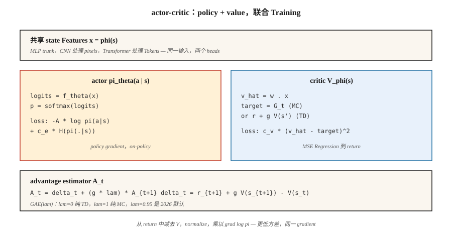

# Actor-Critic — A2C 和 A3C

> REINFORCE 很 noisy。添加一个学习 `V̂(s)` 的 critic，从 return 中减去它，你就得到一个 expectation 相同但 variance 低得多的 advantage。这就是 actor-critic。A2C 同步运行它；A3C 在线程间运行它。两者都是每个现代 deep-RL method 的 mental model。

**Type:** Build
**Languages:** Python
**Prerequisites:** Phase 9 · 04 (TD Learning), Phase 9 · 06 (REINFORCE)
**Time:** ~75 分钟

## 问题

Vanilla REINFORCE 能工作，但它的 variance 很糟。Monte Carlo returns `G_t` 在不同 episodes 之间可能有 10 倍幅度的摆动。把这种 noise 乘以 `∇ log π` 再取平均，会产生一个 Gradient estimator，需要成千上万 episodes 才能把 policy 推动到用少得多的 DQN updates 就能达到的距离。

variance 来自使用 raw returns。如果你减去一个 baseline `b(s_t)`：任何 state 的 function，包括 learned value，expectation 保持不变，而 variance 会下降。最好的 tractable baseline 是 `V̂(s_t)`。现在乘以 `∇ log π` 的 quantity 就是 *advantage*：

`A(s, a) = G - V̂(s)`

如果一个 action 产生了高于平均的 return，它就是好的；如果低于平均，就是差的。带 learned critic 的 REINFORCE 就是 *actor-critic*。critic 给 actor 一个低 variance 的 teacher。这就是 2015 年之后的每个 deep-policy method（A2C、A3C、PPO、SAC、IMPALA）。

## 概念



**两个 networks，一个 shared loss：**

- **Actor** `π_θ(a | s)`：policy。sample 它来采取 action。用 policy gradient 训练。
- **Critic** `V_φ(s)`：估计从 state 出发的 expected return。通过 minimize `(V_φ(s) - target)²` 训练。

**Advantage。** 两种标准形式：

- *MC advantage:* `A_t = G_t - V_φ(s_t)`。unbiased，variance 更高。
- *TD advantage:* `A_t = r_{t+1} + γ V_φ(s_{t+1}) - V_φ(s_t)`。biased（使用 `V_φ`），variance 低得多。也叫 *TD residual* `δ_t`。

**n-step advantage。** 在两者之间插值：

`A_t^{(n)} = r_{t+1} + γ r_{t+2} + … + γ^{n-1} r_{t+n} + γ^n V_φ(s_{t+n}) - V_φ(s_t)`

`n = 1` 是 pure TD。`n = ∞` 是 MC。大多数 implementations 在 Atari 上使用 `n = 5`，在 MuJoCo 的 PPO 上使用 `n = 2048`。

**Generalized Advantage Estimation (GAE)。** Schulman et al. (2016) 提出对所有 n-step advantages 做 exponentially weighted average：

`A_t^{GAE} = Σ_{l=0}^{∞} (γλ)^l δ_{t+l}`

其中 `λ ∈ [0, 1]`。`λ = 0` 是 TD（low variance, high bias）。`λ = 1` 是 MC（high variance, unbiased）。`λ = 0.95` 是 2026 年默认值：持续调节，直到 bias/variance dial 到达你想要的位置。

**A2C：synchronous advantage actor-critic。** 在 `N` 个 parallel environments 上收集 `T` steps。为每个 step 计算 advantages。在 combined batch 上更新 actor 和 critic。重复。这是 A3C 更简单、更 scalable 的 sibling。

**A3C：asynchronous advantage actor-critic。** Mnih et al. (2016)。启动 `N` 个 worker threads，每个 thread 运行一个 env。每个 worker 在自己的 rollout 上本地计算 gradients，然后 asynchronously 应用到 shared parameter server。不需要 replay buffer：workers 通过运行不同 trajectories 来 decorrelate。A3C 证明了你可以在 CPUs 上 scale training。到 2026 年，GPU-based A2C（batched parallel envs）占主导，因为 GPUs 需要 large batches。

**Combined loss。**

`L(θ, φ) = -E[ A_t · log π_θ(a_t | s_t) ]  +  c_v · E[(V_φ(s_t) - G_t)²]  -  c_e · E[H(π_θ(·|s_t))]`

三项：policy-gradient loss、value regression、entropy bonus。`c_v ~ 0.5`、`c_e ~ 0.01` 是 canonical starting points。

```figure
actor-critic
```

## Build It

### Step 1: a critic

Linear critic `V_φ(s) = w · features(s)` 使用 MSE 更新：

```python
def critic_update(w, x, target, lr):
    v_hat = dot(w, x)
    err = target - v_hat
    for j in range(len(w)):
        w[j] += lr * err * x[j]
    return v_hat
```

在 tabular env 上，critic 会在几百个 episodes 内收敛。在 Atari 上，把 linear critic 替换为 shared CNN trunk + value head。

### Step 2: n-step advantage

给定长度为 `T` 的 rollout 和 bootstrapped final `V(s_T)`：

```python
def compute_advantages(rewards, values, gamma=0.99, lam=0.95, last_value=0.0):
    advantages = [0.0] * len(rewards)
    gae = 0.0
    for t in reversed(range(len(rewards))):
        next_v = values[t + 1] if t + 1 < len(values) else last_value
        delta = rewards[t] + gamma * next_v - values[t]
        gae = delta + gamma * lam * gae
        advantages[t] = gae
    returns = [a + v for a, v in zip(advantages, values)]
    return advantages, returns
```

`returns` 是 critic target。`advantages` 是乘以 `∇ log π` 的内容。

### Step 3: combined update

```python
for step_i, (x, a, _r, probs) in enumerate(traj):
    adv = advantages[step_i]
    target_v = returns[step_i]

    # critic
    critic_update(w, x, target_v, lr_v)

    # actor
    for i in range(N_ACTIONS):
        grad_logpi = (1.0 if i == a else 0.0) - probs[i]
        for j in range(N_FEAT):
            theta[i][j] += lr_a * adv * grad_logpi * x[j]
```

On-policy，每次 update 一个 rollout，actor 和 critic 使用分开的 learning rates。

### Step 4: parallelization (A3C vs A2C)

- **A3C：** 启动 `N` 个 threads。每个 thread 运行自己的 env 和自己的 forward pass。周期性地把 Gradient updates 推送到 shared master。master 上不加 locks：races 没关系，它们只是增加 noise。
- **A2C：** 在单个 process 中运行 `N` 个 env instances，把 observations stack 成 `[N, obs_dim]` batch，执行 batched forward pass、batched backward pass。GPU utilization 更高，deterministic，更容易推理。2026 年的默认选择。

我们的 toy code 为了清晰保持 single-threaded；改写成 batched A2C 只需要三行 numpy。

## Pitfalls

- **Critic bias before actor gradient。** 如果 critic 是 random 的，它的 baseline 就没有信息量，而你是在 pure noise 上训练。先 warm up critic 几百步，再打开 policy gradient，或者使用较慢的 actor learning rate。
- **Advantage normalization。** 在每个 batch 内把 advantages normalize 到 zero-mean/unit-std。几乎零成本，却能大幅稳定训练。
- **Shared trunk。** 对 image inputs，为 actor 和 critic 使用 shared feature extractor。分开的 heads。shared features 可以同时从两个 losses 中受益。
- **On-policy contract。** A2C 对数据精确复用一次 update。更多次会让 Gradient biased（importance-sampling correction 正是 PPO 添加的东西）。
- **Entropy collapse。** 没有 `c_e > 0` 时，policy 会在几百次 updates 内变得近似 deterministic 并停止探索。
- **Reward scale。** Advantage magnitudes 依赖 reward scale。Normalize rewards（例如除以 running-std），以便在不同 tasks 之间保持一致的 Gradient magnitudes。

## Use It

A2C/A3C 在 2026 年很少是最终选择，但它们是后续所有架构 refinements 的基础：

| Method | Relation to A2C |
|--------|----------------|
| PPO | A2C + clipped importance ratio for multi-epoch updates |
| IMPALA | A3C + V-trace off-policy correction |
| SAC (Phase 9 · 07) | Off-policy A2C with a soft-value critic (next lesson) |
| GRPO (Phase 9 · 12) | A2C without the critic — group-relative advantage |
| DPO | A2C collapsed into a preference-ranking loss, no sampling |
| AlphaStar / OpenAI Five | A2C with league training + imitation pre-training |

如果你在 2026 年的 paper 中看到 “advantage”，就想到 actor-critic。

## Ship It

保存为 `outputs/skill-actor-critic-trainer.md`：

```markdown
---
name: actor-critic-trainer
description: 为给定 environment 生成 A2C / A3C / GAE configuration，并指定 advantage estimation 和 loss weights。
version: 1.0.0
phase: 9
lesson: 7
tags: [rl, actor-critic, gae]
---

给定一个 environment 和 compute budget，输出：

1. Parallelism。A2C（GPU batched）vs A3C（CPU async）以及 workers 数量。
2. Rollout length T。每个 env 每次 update 的 steps。
3. Advantage estimator。n-step 或 GAE(λ)；指定 λ。
4. Loss weights。`c_v`（value）、`c_e`（entropy）、gradient clip。
5. Learning rates。Actor 和 critic（如果使用则分开）。

拒绝在 horizon > 1000 的 environments 上使用 single-worker A2C（太 on-policy，太慢）。拒绝在没有 advantage normalization 的情况下交付。把任何 `c_e = 0` 且 observed entropy < 0.1 的 run 标记为 entropy-collapsed。
```

## Exercises

1. **Easy。** 在 4×4 GridWorld 上使用 MC advantage（`G_t - V(s_t)`）训练 actor-critic。与 Lesson 06 中 REINFORCE-with-running-mean-baseline 的 sample efficiency 对比。
2. **Medium。** 切换到 TD-residual advantage（`r + γ V(s') - V(s)`）。测量 advantage batches 的 variance。它下降了多少？
3. **Hard。** 实现 GAE(λ)。扫描 `λ ∈ {0, 0.5, 0.9, 0.95, 1.0}`。绘制 final return vs sample efficiency。这个 task 的 bias/variance sweet spot 在哪里？

## Key Terms

| Term | What people say | What it actually means |
|------|-----------------|-----------------------|
| Actor | “Policy net” | `π_θ(a\|s)`，由 policy gradient 更新。 |
| Critic | “Value net” | `V_φ(s)`，通过对 returns / TD targets 做 MSE regression 更新。 |
| Advantage | “比平均好多少” | `A(s, a) = Q(s, a) - V(s)` 或它的 estimators。`∇ log π` 的 multiplier。 |
| TD residual | “δ” | `δ_t = r + γ V(s') - V(s)`；one-step advantage estimate。 |
| GAE | “插值旋钮” | n-step advantages 的 exponentially weighted sum，由 `λ` parameterized。 |
| A2C | “Synchronous actor-critic” | 跨 envs batching；每个 rollout 做一次 Gradient step。 |
| A3C | “Async actor-critic” | Worker threads 把 gradients 推送到 shared param server。Original paper；2026 年较少见。 |
| Bootstrap | “在 horizon 使用 V” | 截断 rollout，添加 `γ^n V(s_{t+n})` 来闭合求和。 |

## Further Reading

- [Mnih et al. (2016). Asynchronous Methods for Deep Reinforcement Learning](https://arxiv.org/abs/1602.01783) — A3C，最初的 async actor-critic paper。
- [Schulman et al. (2016). High-Dimensional Continuous Control Using Generalized Advantage Estimation](https://arxiv.org/abs/1506.02438) — GAE。
- [Sutton & Barto (2018). Ch. 13 — Actor-Critic Methods](http://incompleteideas.net/book/RLbook2020.pdf) — foundations；当 critic 是 Neural Network 时，把它和 Ch. 9 的 function approximation 配套阅读。
- [Espeholt et al. (2018). IMPALA](https://arxiv.org/abs/1802.01561) — scalable distributed actor-critic with V-trace off-policy correction。
- [OpenAI Baselines / Stable-Baselines3](https://stable-baselines3.readthedocs.io/) — 值得阅读的 production A2C/PPO implementations。
- [Konda & Tsitsiklis (2000). Actor-Critic Algorithms](https://papers.nips.cc/paper/1786-actor-critic-algorithms) — two-timescale actor-critic decomposition 的 foundational convergence result。
