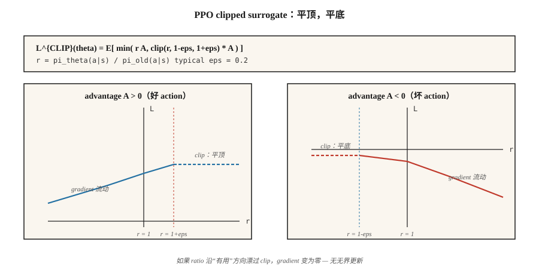

# Proximal Policy Optimization (PPO)

> A2C 在一次更新后就丢弃每个 rollout。PPO 用 clipped importance ratio 包住 policy gradient，这样你可以在同一批数据上做 10+ 个 epochs，而不会让 policy 爆炸。Schulman et al. (2017)。到 2026 年，它仍然是默认的 policy-gradient 算法。

**Type:** Build
**Languages:** Python
**Prerequisites:** Phase 9 · 06 (REINFORCE), Phase 9 · 07 (Actor-Critic)
**Time:** ~75 分钟

## 问题

A2C（Lesson 07）是 on-policy 的：Gradient `E_{π_θ}[A · ∇ log π_θ]` 需要从*当前* `π_θ` 采样的数据。做一次更新后，`π_θ` 就变了；你刚用过的数据现在已经是 off-policy。重复使用它会让 Gradient 有偏。

Rollout 很昂贵。在 Atari 上，跨 8 个 envs × 128 steps 的一次 rollout = 1024 个 transitions，以及十几秒的环境时间。一次 Gradient step 后就把它丢掉很浪费。

Trust Region Policy Optimization（TRPO, Schulman 2015）是第一个修复方案：约束每次更新，使旧 policy 和新 policy 之间的 KL divergence 保持在 `δ` 以下。理论上很干净，但每次更新都需要一次 conjugate-gradient solve。2026 年已经没人运行 TRPO。

PPO（Schulman et al. 2017）用一个简单的 clipped objective 替代了硬性的 trust-region 约束。只多一行代码。每次 rollout 十个 epochs。不需要 conjugate gradients。理论保证足够好。九年后，它仍然是从 MuJoCo 到 RLHF 的默认 policy-gradient 算法。

## 概念



**Importance ratio。**

`r_t(θ) = π_θ(a_t | s_t) / π_{θ_old}(a_t | s_t)`

这是新 policy 与采集数据的 policy 之间的 likelihood ratio。`r_t = 1` 表示没有变化。`r_t = 2` 表示新 policy 选择 `a_t` 的可能性是旧 policy 的两倍。

**Clipped surrogate。**

`L^{CLIP}(θ) = E_t [ min( r_t(θ) A_t, clip(r_t(θ), 1-ε, 1+ε) A_t ) ]`

两个项：

- 如果 advantage `A_t > 0`，并且 ratio 试图增长到超过 `1 + ε`，clip 会把 Gradient 压平 —— 不要把一个好 action 推到比旧概率高出 `+ε` 以上。
- 如果 advantage `A_t < 0`，并且 ratio 试图增长到超过 `1 - ε`（意味着相比 clipped reduction，我们会让一个坏 action 更可能发生），clip 会限制 Gradient —— 不要把一个坏 action 推到低于 `-ε`。

`min` 处理另一个方向：如果 ratio 已经朝*有益*方向移动，你仍然得到 Gradient（不会在对你不利的一侧 clipping）。

典型值是 `ε = 0.2`。把 objective 画成 `r_t` 的函数：一个 piecewise-linear function，在“好的一侧”有平坦的顶部，在“坏的一侧”有平坦的底部。

**完整的 PPO loss。**

`L(θ, φ) = L^{CLIP}(θ) - c_v · (V_φ(s_t) - V_t^{target})² + c_e · H(π_θ(·|s_t))`

与 A2C 相同的 actor-critic 结构。三个系数，通常是 `c_v = 0.5`、`c_e = 0.01`、`ε = 0.2`。

**训练循环。**

1. 跨 `N` 个 parallel envs，每个运行 `T` steps，收集 `N × T` 个 transitions。
2. 计算 advantages（GAE），并把它们冻结为常量。
3. 把 `π_{θ_old}` 冻结为当前 `π_θ` 的 snapshot。
4. 对 `K` 个 epochs，对每个 `(s, a, A, V_target, log π_old(a|s))` 的 minibatch：
   - 计算 `r_t(θ) = exp(log π_θ(a|s) - log π_old(a|s))`。
   - 应用 `L^{CLIP}` + value loss + entropy。
   - Gradient step。
5. 丢弃 rollout。回到步骤 1。

`K = 10` 和 64 的 minibatches 是一组标准 hyperparameter。PPO 很 robust：精确数值在 ±50% 范围内通常都不太重要。

**KL-penalty 变体。** 原始论文提出了一个替代方案，使用 adaptive KL penalty：`L = L^{PG} - β · KL(π_θ || π_old)`，其中 `β` 根据 observed KL 调整。Clipping 版本成为主流；KL 变体在 RLHF 中保留下来（在那里，到 reference policy 的 KL 本来就是一个你始终想要的独立约束）。

## 构建它

### Step 1：在 rollout 时捕获 `log π_old(a | s)`

```python
for step in range(T):
    probs = softmax(logits(theta, state_features(s)))
    a = sample(probs, rng)
    s_next, r, done = env.step(s, a)
    buffer.append({
        "s": s, "a": a, "r": r, "done": done,
        "v_old": value(w, state_features(s)),
        "log_pi_old": log(probs[a] + 1e-12),
    })
    s = s_next
```

Snapshot 只在 rollout 时获取一次。它在 update epochs 期间不会改变。

### Step 2：计算 GAE advantages（Lesson 07）

与 A2C 相同。跨 batch 归一化。

### Step 3：clipped surrogate update

```python
for _ in range(K_EPOCHS):
    for mb in minibatches(buffer, size=64):
        for rec in mb:
            x = state_features(rec["s"])
            probs = softmax(logits(theta, x))
            logp = log(probs[rec["a"]] + 1e-12)
            ratio = exp(logp - rec["log_pi_old"])
            adv = rec["advantage"]
            surrogate = min(
                ratio * adv,
                clamp(ratio, 1 - EPS, 1 + EPS) * adv,
            )
            # backprop -surrogate, 添加 value loss, 减去 entropy
            grad_logpi = onehot(rec["a"]) - probs
            if (adv > 0 and ratio >= 1 + EPS) or (adv < 0 and ratio <= 1 - EPS):
                pg_grad = 0.0  # clipped
            else:
                pg_grad = ratio * adv
            for i in range(N_ACTIONS):
                for j in range(N_FEAT):
                    theta[i][j] += LR * pg_grad * grad_logpi[i] * x[j]
```

“clipped → zero gradient” 模式是 PPO 的核心。如果新 policy 已经在有益方向上漂移得太远，更新就会停止。

### Step 4：value 和 entropy

给 critic target 添加标准 MSE，并给 actor 添加 entropy bonus，与 A2C 相同。

### Step 5：diagnostics

每次更新要观察三件事：

- **Mean KL** `E[log π_old - log π_θ]`。应该保持在 `[0, 0.02]`。如果超过 `0.1`，降低 `K_EPOCHS` 或 `LR`。
- **Clip fraction** —— ratio 落在 `[1-ε, 1+ε]` 之外的 samples 比例。应该是 `~0.1-0.3`。如果是 `~0`，clip 从未触发 → 提高 `LR` 或 `K_EPOCHS`。如果是 `~0.5+`，你正在 over-fitting 这个 rollout → 降低它们。
- **Explained variance** `1 - Var(V_target - V_pred) / Var(V_target)`。Critic 质量指标。随着 critic 学习，应该向 1 上升。

## 陷阱

- **Clip coefficient 调错。** `ε = 0.2` 是事实标准。调到 `0.1` 会让更新过于保守；`0.3+` 会引入不稳定。
- **Epochs 太多。** `K > 20` 经常会让训练不稳定，因为 policy 漂离 `π_old` 太远。限制 epochs，尤其是对大型 networks。
- **没有 reward normalization。** 大的 reward scales 会侵蚀 clip range。在计算 advantages 前先 normalize rewards（running std）。
- **忘记 advantage normalization。** Per-batch zero-mean/unit-std normalization 是标准做法。跳过它会让 PPO 在大多数 benchmarks 上崩掉。
- **Learning rate 没有衰减。** PPO 受益于线性 LR 衰减到零。Constant LR 往往更差。
- **Importance ratio 数学错误。** 为了 numerical stability，始终使用 `exp(log_new - log_old)`，而不是 `new / old`。
- **Gradient sign 错误。** 最大化 surrogate = *最小化* `-L^{CLIP}`。符号翻转是最常见的 PPO bug。

## 使用它

PPO 是 2026 年在相当多领域中的默认 RL 算法：

| Use case | PPO variant |
|----------|-------------|
| MuJoCo / robotics control | PPO with Gaussian policy, GAE(0.95) |
| Atari / discrete games | PPO with categorical policy, rolling 128-step rollouts |
| RLHF for LLMs | PPO with KL penalty to reference model, reward from RM at end of response |
| Large-scale game agents | IMPALA + PPO (AlphaStar, OpenAI Five) |
| Reasoning LLMs | GRPO (Lesson 12) — PPO variant without critic |
| Preference-only data | DPO — closed-form collapsing of PPO+KL, no online sampling |

PPO 的 *loss shape* —— clipped surrogate + value + entropy —— 是 DPO、GRPO 以及几乎所有 RLHF pipeline 的脚手架。

## 交付它

保存为 `outputs/skill-ppo-trainer.md`：

```markdown
---
name: ppo-trainer
description: 为给定环境生成 PPO training config 和 diagnostic plan。
version: 1.0.0
phase: 9
lesson: 8
tags: [rl, ppo, policy-gradient]
---

给定一个 environment 和 training budget，输出：

1. Rollout size。`N` envs × `T` steps。
2. Update schedule。`K` epochs、minibatch size、LR schedule。
3. Surrogate params。`ε`（clip）、`c_v`、`c_e`，开启 advantage normalization。
4. Advantage。GAE(`λ`)，显式给出 `γ` 和 `λ`。
5. Diagnostics plan。KL、clip fraction、explained variance thresholds 与 alerts。

拒绝 `K > 30` 或 `ε > 0.3`（unsafe trust region）。拒绝任何没有 advantage normalization 或 KL/clip monitoring 的 PPO run。把 clip fraction 持续高于 0.4 标记为 drift。
```

## 练习

1. **简单。** 在 4×4 GridWorld 上运行 PPO，使用 `ε=0.2, K=4`。在匹配 env steps 的情况下，与 A2C（每次 rollout 一个 epoch）的 sample efficiency 对比。
2. **中等。** Sweep `K ∈ {1, 4, 10, 30}`。绘制 return vs env steps，并跟踪每次更新的 mean KL。在这个任务上，`K` 到多少时 KL 会爆炸？
3. **困难。** 用 adaptive KL penalty 替换 clipped surrogate（如果 `KL > 2·target`，`β` 翻倍；如果 `KL < target/2`，`β` 减半）。比较 final return、stability 和 clip-free-ness。

## 关键术语

| Term | 人们常说 | 实际含义 |
|------|----------|----------|
| Importance ratio | "r_t(θ)" | `π_θ(a\|s) / π_old(a\|s)`；相对于采集数据的 policy 的偏离程度。 |
| Clipped surrogate | "PPO's main trick" | `min(r·A, clip(r, 1-ε, 1+ε)·A)`；在有益侧超过 clip 后 Gradient 变平。 |
| Trust region | "TRPO / PPO intent" | 限制每次更新的 KL，以保证 monotone improvement。 |
| KL penalty | "Soft trust region" | 替代 PPO：`L - β · KL(π_θ \|\| π_old)`。Adaptive `β`。 |
| Clip fraction | "How often clipping triggers" | Diagnostic —— 应该是 0.1-0.3；超出范围表示调参错误。 |
| Multi-epoch training | "Data reuse" | 每次 rollout 上跑 K 个 epochs；用 variance cost 换 sample efficiency。 |
| On-policy-ish | "Mostly on-policy" | PPO 名义上是 on-policy，但 K>1 个 epochs 会安全地使用 slightly-off-policy data。 |
| PPO-KL | "The other PPO" | KL-penalty 变体；用于 RLHF，因为 KL-to-reference 已经是一个约束。 |

## 延伸阅读

- [Schulman et al. (2017). Proximal Policy Optimization Algorithms](https://arxiv.org/abs/1707.06347) —— 论文。
- [Schulman et al. (2015). Trust Region Policy Optimization](https://arxiv.org/abs/1502.05477) —— TRPO，PPO 的前身。
- [Andrychowicz et al. (2021). What Matters In On-Policy RL? A Large-Scale Empirical Study](https://arxiv.org/abs/2006.05990) —— 对每个 PPO hyperparameter 做 ablation。
- [Ouyang et al. (2022). Training language models to follow instructions with human feedback](https://arxiv.org/abs/2203.02155) —— InstructGPT；PPO-in-RLHF 配方。
- [OpenAI Spinning Up — PPO](https://spinningup.openai.com/en/latest/algorithms/ppo.html) —— 使用 PyTorch 的清晰现代讲解。
- [CleanRL PPO implementation](https://github.com/vwxyzjn/cleanrl) —— 很多论文使用的 reference single-file PPO。
- [Hugging Face TRL — PPOTrainer](https://huggingface.co/docs/trl/main/en/ppo_trainer) —— 在 language models 上使用 PPO 的生产配方；请和 Lesson 09（RLHF）一起阅读。
- [Engstrom et al. (2020). Implementation Matters in Deep Policy Gradients](https://arxiv.org/abs/2005.12729) —— “37 code-level optimizations” 论文；哪些 PPO tricks 是承重结构，哪些只是 folklore。
