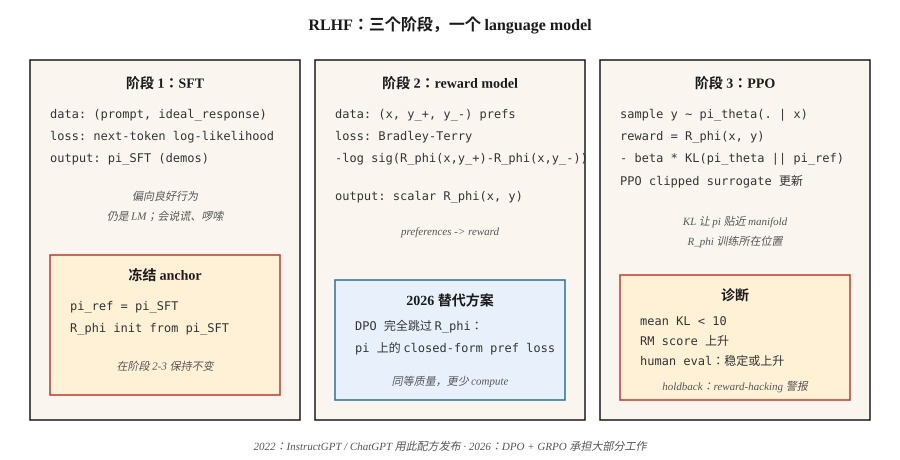

# Reward Modeling & RLHF

> 人类无法为“好的 assistant response”手写 reward function，但他们可以比较两个 responses，并选出更好的那个。把 reward model 拟合到这些比较上，然后用 RL 让 language model 对它优化。Christiano 2017。InstructGPT 2022。这套配方把 GPT-3 变成了 ChatGPT。到 2026 年，它大多正在被 DPO 取代 —— 但 mental model 仍然保留。

**Type:** Build
**Languages:** Python
**Prerequisites:** Phase 5 · 05 (Sentiment), Phase 9 · 08 (PPO)
**Time:** ~45 分钟

## 问题

你已经用 next-token-prediction objective 训练了一个 language model。它能写出语法正确的英语。它也会撒谎、啰嗦，并且拒绝去拒绝。你无法通过更多 pretraining 修复这一点 —— web text 是问题，不是解药。

你想要一个*标量 reward*，表示“对于 instruction X，response A 比 response B 更好”。手写这个 reward function 是不可能的。“Helpfulness” 不是 Token 上的 closed-form expression。但人类可以比较两个 outputs 并标记 preference。这可以低成本地大规模收集。

RLHF（Christiano et al. 2017; Ouyang et al. 2022）把 preferences 转换成 reward model，然后用 PPO 针对该 reward 优化 LM。分三步：SFT → RM → PPO。这是 2023–2025 年交付 ChatGPT、Claude、Gemini 以及其他所有 aligned-LLM 的配方。

到 2026 年，PPO 步骤大多被 DPO（Phase 10 · 08）取代，因为它更便宜，而且对 alignment tuning 来说几乎一样好。但 *reward model* 部分仍然支撑着每个 Best-of-N sampler、每个 RL-from-verifiable-rewards pipeline，以及每个使用 process reward model 的 reasoning model。理解 RLHF，你就理解了整个 alignment stack。

## 概念



**Stage 1：Supervised Fine-Tuning（SFT）。** 从 pretrained base model 开始。在目标行为的人类编写 demonstrations 上 fine-tune（instruction-following responses、helpful replies 等）。结果是一个 `π_SFT` model，它*偏向良好行为*，但仍然有 unbounded action space。

**Stage 2：Reward Model training。**

- 收集对 prompts `x` 的 response pairs `(y_+, y_-)`，由人类标注为“y_+ 优于 y_-。”
- 训练 reward model `R_φ(x, y)`，让它给 `y_+` 分配更高分数。
- Loss：**Bradley-Terry pairwise logistic**：

  `L(φ) = -E[ log σ(R_φ(x, y_+) - R_φ(x, y_-)) ]`

  σ 是 sigmoid。reward 的差值隐含 preference 的 log-odds。BT 自 1952 年（Bradley-Terry）以来一直是标准方法，也是现代 RLHF 中的主流选择。

- `R_φ` 通常从 SFT model 初始化，并在顶部加一个 scalar head。相同的 transformer backbone；一个单独的 linear layer 输出 reward。

**Stage 3：带 KL penalty、针对 RM 的 PPO。**

- 从 `π_SFT` 初始化可训练 policy `π_θ`。保留一个冻结的 *reference* `π_ref = π_SFT`。
- Response `y` 结束时的 reward：

  `r_total(x, y) = R_φ(x, y) - β · KL(π_θ(·|x) || π_ref(·|x))`

  KL penalty 防止 `π_θ` 任意漂离 `π_SFT` —— 它是一个 *regularizer*，不是硬性 trust region。`β` 通常是 `0.01`-`0.05`。
- 用这个 reward 运行 PPO（Lesson 08）。Advantages 在 token-level trajectory 上计算，但 RM 只给完整 response 打分。

**为什么需要 KL？** 没有它，PPO 会很乐意找到 reward-hacking 策略 —— RM 只在 in-distribution completions 上训练过。一个 out-of-distribution response 可能比任何人类写的 response 分数都高。KL 让 `π_θ` 保持在 RM 训练过的 manifold 附近。它是 RLHF 中最重要的单个旋钮。

**2026 状态：**

- **DPO**（Rafailov 2023）：closed-form algebra 把 Stage 2+3 折叠成一个 preference data 上的 supervised loss。没有 RM，没有 PPO。只需一小部分 compute，就能在 alignment benchmarks 上达到相同质量。Phase 10 · 08 会讲。
- **GRPO**（DeepSeek 2024–2025）：PPO 的变体，用 group-relative baseline 代替 critic，reward 来自 *verifier*（code runs / math answer matches），而不是人类训练的 RM。它在 reasoning models 中占主导。Phase 9 · 12 会讲。
- **Process reward models（PRMs）：** 给 partial solutions（每个 reasoning step）打分，用于 RLHF 和 reasoning 的 GRPO 变体。
- **Constitutional AI / RLAIF：** 使用 aligned LLM 生成 preferences，而不是使用人类。扩展 preference budget。

```figure
reward-model
```

## 构建它

本课使用微型合成的“prompts”和“responses”，表示为字符串。RM 是一个基于 bag-of-tokens 表示的 linear scorer。没有真实 LLM —— 重要的是 pipeline 的*形状*，不是规模。见 `code/main.py`。

### Step 1：synthetic preference data

```python
PROMPTS = ["help me", "answer me", "explain this"]
GOOD_WORDS = {"clear", "specific", "kind", "thorough"}
BAD_WORDS = {"vague", "rude", "wrong", "short"}

def make_pair(rng):
    x = rng.choice(PROMPTS)
    y_good = rng.choice(list(GOOD_WORDS)) + " " + rng.choice(list(GOOD_WORDS))
    y_bad = rng.choice(list(BAD_WORDS)) + " " + rng.choice(list(BAD_WORDS))
    return (x, y_good, y_bad)
```

在真实 RLHF 中，这会被 human labelers 替换。形状 —— `(prompt, preferred_response, rejected_response)` —— 完全相同。

### Step 2：Bradley-Terry reward model

Linear score：`R(x, y) = w · bag(y)`。训练以最小化 BT pairwise log-loss：

```python
def rm_train_step(w, x, y_pos, y_neg, lr):
    r_pos = dot(w, bag(y_pos))
    r_neg = dot(w, bag(y_neg))
    p = sigmoid(r_pos - r_neg)
    for tok, cnt in bag(y_pos).items():
        w[tok] += lr * (1 - p) * cnt
    for tok, cnt in bag(y_neg).items():
        w[tok] -= lr * (1 - p) * cnt
```

经过几百次 updates 后，`w` 会给 good-word tokens 分配正权重，给 bad-word tokens 分配负权重。

### Step 3：RM 之上的 PPO-like policy

我们的 toy policy 会从 vocabulary 中生成一个 Token。我们用 RM 给该 Token 打分，计算 `log π_θ(token | prompt)`，添加 KL-to-reference penalty，并应用 clipped PPO surrogate。

```python
def rlhf_step(theta, ref, w, prompt, rng, eps=0.2, beta=0.1, lr=0.05):
    logits_theta = policy_logits(theta, prompt)
    probs = softmax(logits_theta)
    token = sample(probs, rng)
    logits_ref = policy_logits(ref, prompt)
    probs_ref = softmax(logits_ref)
    reward = dot(w, bag([token])) - beta * kl(probs, probs_ref)
    # 在 theta 上做 ppo-style update，把 reward 当作 return
    ...
```

### Step 4：monitor KL

每次更新跟踪 mean `KL(π_θ || π_ref)`。如果它爬过 `~5-10`，policy 已经漂离 `π_SFT` 很远 —— lower `β` is rising or reward hacking is starting。这是真实 RLHF 中最重要的 diagnostic。

### Step 5：使用 TRL 的 production recipe

理解 toy pipeline 后，下面是同一循环作为真实 library user 的写法。Hugging Face 的 [TRL](https://huggingface.co/docs/trl) 是 reference implementation —— Stage 2 用 `RewardTrainer`，Stage 3 用 `PPOTrainer`（内置 KL-to-reference）。

```python
# Stage 2：来自 pairwise preferences 的 reward model
from trl import RewardTrainer, RewardConfig
from transformers import AutoModelForSequenceClassification, AutoTokenizer

tok = AutoTokenizer.from_pretrained("meta-llama/Llama-3.1-8B-Instruct")
rm = AutoModelForSequenceClassification.from_pretrained(
    "meta-llama/Llama-3.1-8B-Instruct", num_labels=1
)

# dataset rows: {"prompt", "chosen", "rejected"} — Bradley-Terry format
trainer = RewardTrainer(
    model=rm,
    tokenizer=tok,
    train_dataset=preference_data,
    args=RewardConfig(output_dir="./rm", num_train_epochs=1, learning_rate=1e-5),
)
trainer.train()
```

```python
# Stage 3：针对 RM 的 PPO，并对 SFT reference 加 KL penalty
from trl import PPOTrainer, PPOConfig, AutoModelForCausalLMWithValueHead

policy = AutoModelForCausalLMWithValueHead.from_pretrained("./sft-checkpoint")
ref    = AutoModelForCausalLMWithValueHead.from_pretrained("./sft-checkpoint")  # frozen

ppo = PPOTrainer(
    config=PPOConfig(learning_rate=1.41e-5, batch_size=64, init_kl_coef=0.05,
                     target_kl=6.0, adap_kl_ctrl=True),
    model=policy, ref_model=ref, tokenizer=tok,
)

for batch in dataloader:
    responses = ppo.generate(batch["query_ids"], max_new_tokens=128)
    rewards   = rm(torch.cat([batch["query_ids"], responses], dim=-1)).logits[:, 0]
    stats     = ppo.step(batch["query_ids"], responses, rewards)
    # stats 包含：mean_kl、clip_frac、value_loss — 三个 PPO diagnostics
```

Library 会替你做三件事。`adap_kl_ctrl=True` 实现 adaptive-β schedule：如果 observed KL 超过 `target_kl`，β 翻倍；如果低于一半，β 减半。Reference model 按约定是冻结的 —— 你不能意外地和 `policy` 共享 parameters。Value head 与 policy 位于同一个 backbone 上（`AutoModelForCausalLMWithValueHead` 附加一个 scalar MLP head），这就是为什么 TRL 会分别报告 `policy/kl` 和 `value/loss`。

## 陷阱

- **Over-optimization / reward hacking。** RM 并不完美；`π_θ` 会找到得分高但质量差的 adversarial completions。症状：reward 无限上升，而 human eval score 持平或下降。修复：early stop、提高 `β`、拓宽 RM training data。
- **Length hacking。** 在 helpful responses 上训练的 RMs 往往隐式 reward 长度。Policy 学会填充 responses。补救：length-normalized reward，或使用 length-aware RM 的 RLAIF。
- **RM 太小。** RM 至少需要和 policy 一样大。Tiny RM 无法可靠地给 policy outputs 打分。
- **KL tuning。** β 太低 → drift 和 reward hacking。β 太高 → policy 几乎不变。标准技巧是使用一个以固定 per-step KL 为目标的 *adaptive* β。
- **Preference-data noise。** 约 30% 的 human labels 有噪声或模糊。通过在 agreement-filtered data 上训练 RM 来校准，或在 BT 上使用 temperature。
- **Off-policy problems。** PPO data 在第一个 epoch 后会略微 off-policy。像 Lesson 08 那样监控 clip fraction。

## 使用它

2026 年的 RLHF 是分层的：

| Layer | Target | Method |
|-------|--------|--------|
| Instruction following, helpfulness, harmlessness | Alignment | DPO（Phase 10 · 08）优于 RLHF-PPO。 |
| Reasoning correctness（math, code） | Capability | 使用 verifier reward 的 GRPO（Phase 9 · 12）。 |
| Long-horizon multi-step tasks | Agentic | 在 steps 上使用 process reward models 的 PPO / GRPO。 |
| Safety / refusal behavior | Safety | RLHF-PPO with separate safety RM，或 Constitutional AI。 |
| Best-of-N at inference | Fast alignment | 在 decode time 使用 RM；不需要 policy training。 |
| Reward distillation | Inference compute | 在 frozen LM 顶部训练一个小的 “reward head”。 |

RLHF 是 2022–2024 年的*那个*方法。到 2026 年，生产 alignment pipelines 以 DPO-first 为主，PPO 只用于 RM-intensive 或 safety-critical 的步骤。

## 交付它

保存为 `outputs/skill-rlhf-architect.md`：

```markdown
---
name: rlhf-architect
description: 为 language model 设计 RLHF / DPO / GRPO alignment pipeline，包括 RM、KL 和 data strategy。
version: 1.0.0
phase: 9
lesson: 9
tags: [rl, rlhf, alignment, llm]
---

给定一个 base LM、一个目标行为（alignment / reasoning / refusal / agent），以及 preference 或 verifier budget，输出：

1. Stage。SFT？RM？DPO？GRPO？并给出理由。
2. Preference or verifier source。Humans、AI feedback、rule-based、unit-test-pass 或 reward distillation。
3. KL strategy。Fixed β、adaptive β 或 DPO（implicit KL）。
4. Diagnostics。Mean KL、reward stability、over-optimization guard（holdout human eval）。
5. Safety gate。Red-team set、refusal rate、与 helpfulness RM 分开的 safety RM。

拒绝在没有 KL monitor 的情况下交付 RLHF-PPO。拒绝使用小于 target policy 的 RM。拒绝 length-only rewards。把任何没有留出 blind human-eval set 的 pipeline 标记为缺少 over-optimization protection。
```

## 练习

1. **简单。** 在 `code/main.py` 中用 500 个 synthetic preference pairs 训练 Bradley-Terry reward model。在 hold-out 的 100 个 pairs 上测量 pairwise accuracy。应该超过 90%。
2. **中等。** 使用 `β ∈ {0.0, 0.1, 1.0}` 运行 toy PPO-RLHF loop。对每个值，绘制 RM score vs KL-to-reference over updates。哪些 runs 发生 reward-hack？
3. **困难。** 在同一份 preference data 上实现 DPO（closed-form preference-likelihood loss），并与 RLHF-PPO pipeline 在使用的 compute 和达到的 final RM score 上对比。

## 关键术语

| Term | 人们常说 | 实际含义 |
|------|----------|----------|
| RLHF | "Alignment RL" | 三阶段 SFT + RM + PPO pipeline（Christiano 2017, Ouyang 2022）。 |
| Reward Model (RM) | "The scoring net" | 通过 Bradley-Terry 拟合 pairwise preferences 学到的 scalar function。 |
| Bradley-Terry | "Pairwise logistic loss" | `P(y_+ ≻ y_-) = σ(R(y_+) - R(y_-))`；标准 RM objective。 |
| KL penalty | "Stay near the reference" | reward 中的 `β · KL(π_θ \|\| π_ref)`；anti-reward-hacking regularizer。 |
| Reward hacking | "Goodhart's law" | Policy 利用 RM 缺陷；症状：reward 上升，human eval 持平。 |
| RLAIF | "AI-labeled preferences" | 标签来自另一个 LM 而非人类的 RLHF。 |
| PRM | "Process Reward Model" | 给 partial reasoning steps 打分；用于 reasoning pipelines。 |
| Constitutional AI | "Anthropic's method" | 由显式规则引导的 AI-generated preferences。 |

## 延伸阅读

- [Christiano et al. (2017). Deep Reinforcement Learning from Human Preferences](https://arxiv.org/abs/1706.03741) —— 开创 RLHF 的论文。
- [Ouyang et al. (2022). InstructGPT — Training language models to follow instructions with human feedback](https://arxiv.org/abs/2203.02155) —— ChatGPT 背后的配方。
- [Stiennon et al. (2020). Learning to summarize with human feedback](https://arxiv.org/abs/2009.01325) —— 更早用于 summarization 的 RLHF。
- [Rafailov et al. (2023). Direct Preference Optimization](https://arxiv.org/abs/2305.18290) —— DPO；2026 年 post-RLHF 的默认方法。
- [Bai et al. (2022). Constitutional AI: Harmlessness from AI Feedback](https://arxiv.org/abs/2212.08073) —— RLAIF 和 self-critique loop。
- [Anthropic RLHF paper (Bai et al. 2022). Training a Helpful and Harmless Assistant](https://arxiv.org/abs/2204.05862) —— HH 论文。
- [Hugging Face TRL library](https://huggingface.co/docs/trl) —— 生产级 `RewardTrainer` 和 `PPOTrainer`。阅读 trainer source，理解 adaptive-KL 和 value-head 细节。
- [Hugging Face — Illustrating Reinforcement Learning from Human Feedback](https://huggingface.co/blog/rlhf) by Lambert, Castricato, von Werra, Havrilla —— 带图解的三阶段 pipeline 经典 walkthrough。
- [von Werra et al. (2020). TRL: Transformer Reinforcement Learning](https://github.com/huggingface/trl) —— library；`examples/` 有面向 Llama、Mistral 和 Qwen 的 end-to-end RLHF scripts。
- [Sutton & Barto (2018). Ch. 17.4 — Designing Reward Signals](http://incompleteideas.net/book/RLbook2020.pdf) —— reward-hypothesis 视角；思考 reward hacking 的必要前置知识。
