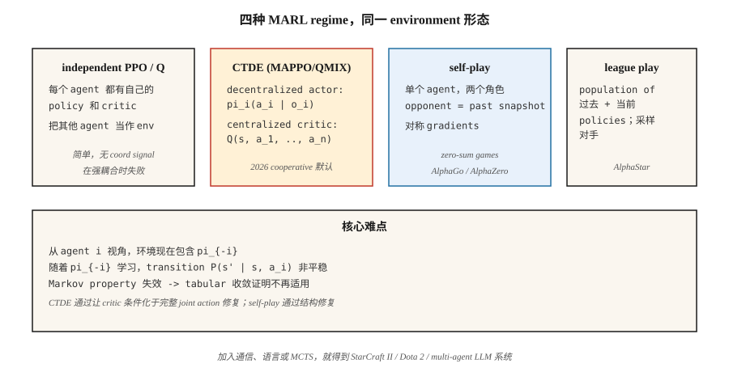

# Multi-Agent RL

> Single-agent RL 假设环境是 stationary 的。把两个正在学习的 agent 放进同一个世界，这个假设就会失效：每个 agent 都是另一个 agent 环境的一部分，而且两者都在变化。Multi-agent RL 是一组让学习在 Markov assumption 不再成立时仍能收敛的技巧。

**Type:** Build
**Languages:** Python
**Prerequisites:** Phase 9 · 04 (Q-learning), Phase 9 · 06 (REINFORCE), Phase 9 · 07 (Actor-Critic)
**Time:** ~45 minutes

## 问题

一个 robot 学习在房间中导航，是 single-agent RL 问题。一个 soccer team 不是。AlphaStar 对战 StarCraft 对手不是。一个由 bidding agents 组成的 marketplace 不是。两辆车协商通过四向停车路口也不是。许多多对多的现实问题都不是。

在每一个 multi-agent setting 中，从任意一个 agent 的视角看，其他 agents *就是*环境的一部分。随着它们学习并改变自身行为，环境会变得 non-stationary。Markov property ——“next state 只取决于 current state 和我的 action”——会被违反，因为 next state 还取决于*其他* agents 选择了什么，而它们的 policies 是不断变化的目标。

这会破坏 tabular convergence proofs（Q-learning 的保证假设环境是 stationary 的）。它也会破坏 naive deep RL：agents 会在循环中互相追逐，永远无法收敛到稳定 policy。你需要 multi-agent 专用技术：centralized training / decentralized execution、counterfactual baselines、league play、self-play。

2026 年的应用包括：robot swarms、traffic routing、autonomous vehicle fleets、market simulators、multi-agent LLM systems（Phase 16），以及任何有多个 intelligent player 的游戏。

## 概念



**Formalism: Markov Game.** MDP 的泛化：states `S`、joint action `a = (a_1, …, a_n)`、transition `P(s' | s, a)`，以及每个 agent 的 rewards `R_i(s, a, s')`。每个 agent `i` 在自己的 policy `π_i` 下最大化自己的 return。如果 rewards 完全相同，它是 **fully cooperative**。如果是 zero-sum，它是 **adversarial**。如果混合，则是 **general-sum**。

**核心挑战：**

- **Non-stationarity.** 从 agent `i` 的视角看，`P(s' | s, a_i)` 取决于 `π_{-i}`，而它正在变化。
- **Credit assignment.** 在 shared reward 下，是哪个 agent 导致了它？
- **Exploration coordination.** Agents 必须探索互补策略，而不是重复探索同一个 state。
- **Scalability.** Joint action space 会随 `n` 指数级增长。
- **Partial observability.** 每个 agent 只能看到自己的 observation；global state 是隐藏的。

**四种主导范式：**

**1. Independent Q-learning / independent PPO (IQL, IPPO).** 每个 agent 学习自己的 Q 或 policy，把其他 agents 当作环境的一部分。简单，有时有效（尤其是 experience replay 作为一种平滑的 agent-modeling 技巧时）。理论收敛性：没有。实践中：适合 loosely-coupled tasks，不适合 tightly-coupled ones。

**2. Centralized training, decentralized execution (CTDE).** 最常见的现代范式。每个 agent 都有自己的 *policy* `π_i`，它以 local observation `o_i` 为条件——部署时是标准的 decentralized execution。在 *training* 期间，centralized critic `Q(s, a_1, …, a_n)` 以完整的 global state 和 joint action 为条件。示例：
- **MADDPG** (Lowe et al. 2017): 带有每个 agent 一个 centralized critic 的 DDPG。
- **COMA** (Foerster et al. 2017): counterfactual baseline——问“如果我当时采取 action `a'`，我的 reward 会是多少？”——隔离我的贡献。
- **MAPPO** / **IPPO** with shared critic (Yu et al. 2022): 带有 centralized value function 的 PPO。2026 年 cooperative MARL 中的主导方法。
- **QMIX** (Rashid et al. 2018): value decomposition——`Q_tot(s, a) = f(Q_1(s, a_1), …, Q_n(s, a_n))`，并使用 monotonic mixing。

**3. Self-play.** 同一个 agent 的两个副本互相对战。对手的 policy *就是*我过去某个 snapshot 中的 policy。AlphaGo / AlphaZero / MuZero。OpenAI Five。最适合 zero-sum games；training signal 是对称的。

**4. League play.** self-play 向 general-sum / adversarial environments 的扩展：保留一组过去和当前的 policies，从 league 中采样 opponent，并针对它们训练。加入 exploiters（专门击败当前最佳策略）和 main exploiters（专门击败 exploiters）。AlphaStar（StarCraft II）。当游戏存在“rock-paper-scissors”策略循环时，这是必要的。

**Communication.** 允许 agents 互相发送 learned messages `m_i`。在 cooperative settings 中有效。Foerster et al. (2016) 表明，differentiable inter-agent communication 可以端到端训练。今天基于 LLM 的 multi-agent systems（Phase 16）本质上是在用自然语言通信。

```figure
f3-marl-orbit
```

## 构建它

本课使用一个 6×6 GridWorld，包含两个 cooperative agents。它们从相对的角落开始，必须到达一个 shared goal。Shared reward：当任一 agent 仍在移动时，每步 `-1`；两者都到达时 `+10`。参见 `code/main.py`。

### 步骤 1： multi-agent env

```python
class CoopGridWorld:
    def __init__(self):
        self.size = 6
        self.goal = (5, 5)

    def reset(self):
        return ((0, 0), (5, 0))  # 两个 agents

    def step(self, state, actions):
        a1, a2 = state
        new1 = move(a1, actions[0])
        new2 = move(a2, actions[1])
        done = (new1 == self.goal) and (new2 == self.goal)
        reward = 10.0 if done else -1.0
        return (new1, new2), reward, done
```

*Joint* action space 是 `|A|² = 16`。Global state 是两个位置。

### 步骤 2: independent Q-learning

每个 agent 运行自己的 Q-table，以 joint state 作为 key。每一步：两者都选择 ε-greedy actions，收集 joint transition，并各自用 shared reward 更新自己的 Q。

```python
def independent_q(env, episodes, alpha, gamma, epsilon):
    Q1, Q2 = defaultdict(default_q), defaultdict(default_q)
    for _ in range(episodes):
        s = env.reset()
        while not done:
            a1 = epsilon_greedy(Q1, s, epsilon)
            a2 = epsilon_greedy(Q2, s, epsilon)
            s_next, r, done = env.step(s, (a1, a2))
            target1 = r + gamma * max(Q1[s_next].values())
            target2 = r + gamma * max(Q2[s_next].values())
            Q1[s][a1] += alpha * (target1 - Q1[s][a1])
            Q2[s][a2] += alpha * (target2 - Q2[s][a2])
            s = s_next
```

它在这个任务上有效，因为 rewards 密集且对齐。在 tightly-coupled tasks 上会失败（例如，一个 agent 必须*等待*另一个 agent 的任务）。

### 步骤 3：centralized Q 与 decomposed-value update

对 joint actions 使用一个 Q：`Q(s, a_1, a_2)`。用 shared reward 更新。执行时通过 marginalizing 来 decentralized：`π_i(s) = argmax_{a_i} max_{a_{-i}} Q(s, a_1, a_2)`。它用指数级的 joint action space 换取一个*正确*的 global view。

### 步骤 4: 简单 self-play（adversarial 2-agent）

同一个 agent，两个 roles。训练 agent A 对抗 agent B；每经过 `K` 个 episodes，把 A 的 weights 复制到 B。对称训练，进展一致。AlphaZero recipe 的微缩版。

## 常见陷阱

- **Non-stationary replay.** 使用 independent agents 时，Experience replay 比 single-agent 更糟，因为旧 transitions 是由现在已经过时的 opponents 生成的。修复：按 recency 重新标注或加权。
- **Credit assignment ambiguity.** 长 episode 后得到 shared reward；没有明确方式说明哪个 agent 做出了贡献。修复：counterfactual baselines（COMA），或按 agent 做 reward shaping。
- **Policy drift / chasing.** 每个 agent 的 best response 都会随着另一个 agent 的更新而变化。修复：centralized critic、较慢的 learning rates，或一次冻结一个 agent。
- **Reward hacking via coordination.** Agents 找到了设计者没有预料到的 coordinated exploits。Auction agents 会收敛到 bid zero。修复：谨慎的 reward design、behavioral constraints。
- **Exploration redundancy.** 两个 agents 探索相同的 state-action pairs。修复：每个 agent 使用 entropy bonuses，或 role-conditioning。
- **League cycles.** 纯 self-play 可能卡在 dominance cycle 中。修复：使用包含多样 opponents 的 league play。
- **Sample explosion.** `n` 个 agents × state space × joint actions。用 function approximation 近似；使用 factored action spaces（每个 agent 一个 policy output head）。

## 使用它

2026 年 MARL 应用图谱：

| Domain | Method | Notes |
|--------|--------|-------|
| Cooperative navigation / manipulation | MAPPO / QMIX | CTDE；shared critic + decentralized actors。 |
| Two-player games (chess, Go, poker) | Self-play with MCTS (AlphaZero) | Zero-sum；对称训练。 |
| Complex multiplayer (Dota, StarCraft) | League play + imitation pretraining | OpenAI Five, AlphaStar。 |
| Autonomous-vehicle fleets | CTDE MAPPO / PPO with attention | Partial obs；可变 team sizes。 |
| Auction markets | Game-theoretic equilibrium + RL | 当 `n` → ∞ 时使用 mean-field RL。 |
| LLM multi-agent systems (Phase 16) | Natural-language comm + role conditioning | RL loop 位于 agent-planning layer。 |

在 2026 年，MARL 最大的增长领域是基于 LLM 的系统：由 language-model agents 组成的群体进行协商、辩论、构建软件。RL 出现在对 *trajectory-level* outputs 的 preference optimization 上，而不是 token-level（Phase 16 · 03）。

## 交付它

保存为 `outputs/skill-marl-architect.md`：

```markdown
---
name: marl-architect
description: 为给定任务选择正确的 multi-agent RL regime（IPPO, CTDE, self-play, league）。
version: 1.0.0
phase: 9
lesson: 10
tags: [rl, multi-agent, marl, self-play]
---

给定一个包含 `n` 个 agents 的任务，输出：

1. Regime classification。Cooperative / adversarial / general-sum。说明理由。
2. Algorithm。IPPO / MAPPO / QMIX / self-play / league。理由要关联 coupling tightness 和 reward structure。
3. Information access。Centralized training（哪些 global info 会进入 critic）？Decentralized execution？
4. Credit assignment。Counterfactual baseline、value decomposition，或 reward shaping。
5. Exploration plan。Per-agent entropy、population-based training，或 league。

在 tightly-coupled cooperative tasks 上拒绝 independent Q-learning。拒绝为存在 cycle risks 的 general-sum 推荐 self-play。标记任何没有 fixed-opponent eval 的 MARL pipeline（cherry-picked self-play numbers 很常见）。
```

## 练习

1. **Easy.** 在 2-agent cooperative GridWorld 上训练 independent Q-learning。需要多少 episodes 才能让 mean return > 0？绘制 joint learning curve。
2. **Medium.** 添加一个“coordination”任务：只有当两个 agents 在同一回合踏上 goal 时，才算到达目标。Independent Q 仍能收敛吗？什么会失效？
3. **Hard.** 实现一个用于 MAPPO-style training 的 centralized critic，并在 coordination task 上与 independent PPO 比较 convergence speed。

## 关键术语

| Term | What people say | What it actually means |
|------|-----------------|-----------------------|
| Markov game | "Multi-agent MDP" | `(S, A_1, …, A_n, P, R_1, …, R_n)`；每个 agent 都有自己的 reward。 |
| CTDE | "Centralized training, decentralized execution" | Training time 使用 joint critic；每个 agent 的 policy 只使用 local obs。 |
| IPPO | "Independent PPO" | 每个 agent 单独运行 PPO。简单 baseline；经常被低估。 |
| MAPPO | "Multi-agent PPO" | 带有以 global state 为条件的 centralized value function 的 PPO。 |
| QMIX | "Monotonic value decomposition" | `Q_tot = f_monotone(Q_1, …, Q_n)` 允许 decentralized argmax。 |
| COMA | "Counterfactual multi-agent" | Advantage = 我的 Q 减去对我的 action 做 marginalizing 后的 expected Q。 |
| Self-play | "Agent vs past self" | 单个 agent，两个 roles；zero-sum games 的标准方法。 |
| League play | "Population training" | 缓存过去的 policies，从 pool 中采样 opponents；处理 strategy cycles。 |

## 延伸阅读

- [Lowe et al. (2017). Multi-Agent Actor-Critic for Mixed Cooperative-Competitive Environments (MADDPG)](https://arxiv.org/abs/1706.02275) — 带 centralized critic 的 CTDE。
- [Foerster et al. (2017). Counterfactual Multi-Agent Policy Gradients (COMA)](https://arxiv.org/abs/1705.08926) — 用于 credit assignment 的 counterfactual baselines。
- [Rashid et al. (2018). QMIX: Monotonic Value Function Factorisation](https://arxiv.org/abs/1803.11485) — 带 monotonicity 的 value decomposition。
- [Yu et al. (2022). The Surprising Effectiveness of PPO in Cooperative Multi-Agent Games (MAPPO)](https://arxiv.org/abs/2103.01955) — PPO 对 MARL 出人意料地强。
- [Vinyals et al. (2019). Grandmaster level in StarCraft II using multi-agent reinforcement learning (AlphaStar)](https://www.nature.com/articles/s41586-019-1724-z) — 大规模 league play。
- [Silver et al. (2017). Mastering the game of Go without human knowledge (AlphaGo Zero)](https://www.nature.com/articles/nature24270) — zero-sum games 中的纯 self-play。
- [Sutton & Barto (2018). Ch. 15 — Neuroscience & Ch. 17 — Frontiers](http://incompleteideas.net/book/RLbook2020.pdf) — 包含教材对 multi-agent settings 和 non-stationarity problem 的简短处理，而 CTDE 正是为解决该问题而设计的。
- [Zhang, Yang & Başar (2021). Multi-Agent Reinforcement Learning: A Selective Overview](https://arxiv.org/abs/1911.10635) — 覆盖 cooperative、competitive 和 mixed MARL 以及 convergence results 的综述。
