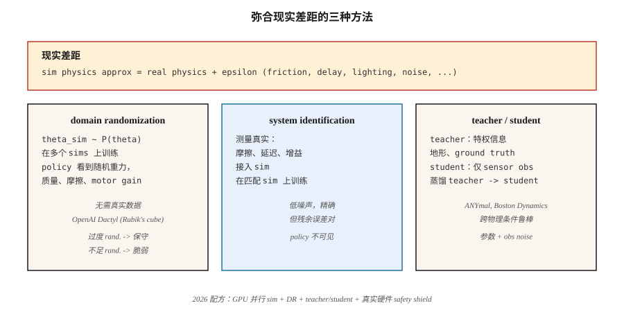

# Sim-to-Real Transfer

> 一个在 simulator 中训练、却在硬件上失败的 policy，本质上是记住了 simulator。Domain randomization、domain adaptation 和 system identification，是让 learned controllers 跨越 reality gap 的三种工具。

**Type:** 学习
**Languages:** Python
**Prerequisites:** Phase 9 · 08 (PPO), Phase 2 · 10 (Bias/Variance)
**Time:** ~45 分钟

## 问题

训练真实 robot 很慢、危险且昂贵。一个 biped 需要数百万个 training episodes 才能学会行走；而真实 biped 哪怕摔倒一次，也可能损坏硬件。Simulation 给你无限 resets、确定性可复现、parallel environments，并且不会造成物理损坏。

但 simulators 是错的。Bearings 的摩擦比 MuJoCo models 中更大。Cameras 有 lens distortion，而 simulator 并不包含。Motors 有 delays、backlash 和 saturation，而 99% 的 sim models 都会跳过这些。风、灰尘和变化的光照会破坏在干净 rendering 上训练的 policy。**reality gap**，即 sim distribution 与 real distribution 之间的系统性差异，是 robotics 中 deployed RL 的核心问题。

你需要一个对 *sim-to-real distribution shift* 具有 robust 性的 policy。三种历史方法：randomize simulator（domain randomization）、用少量 real data 适配 policy（domain adaptation / fine-tuning），或识别 real system 的参数并匹配它们（system identification）。到 2026 年，主流配方会把三者与大规模 parallel simulation（Isaac Sim、Isaac Lab、Mujoco MJX on GPU）结合起来。

## 概念



**Domain Randomization (DR)。** Tobin et al. 2017，Peng et al. 2018。训练期间，randomize 每个可能在真实 robot 上不同的 sim parameter：masses、friction coefficients、motor PD gains、sensor noise、camera position、lighting、textures、contact models。policy 学到一个关于“今天处在哪个 sim 里”的条件分布，并在整个范围内泛化。如果真实 robot 落在 training envelope 内，policy 就能工作。

- **优点：** 不需要 real data。一个配方，适用于许多 robots。
- **缺点：** 过度 randomization 的训练会产生一个“universal”但过于谨慎的 policy。太多 noise ≈ 太多 regularization。

**System Identification (SI)。** 在训练前，用 real-world data 拟合 simulator 的参数。如果你能测量真实 robot 上 arm-joint friction，就把它填入 sim。然后训练一个预期这些值的 policy。它需要访问 real system，但能直接缩小 reality gap。

- **优点：** 精确、低 noise 的 training target。
- **缺点：** 残余 model error 对 policy 不可见；小的未识别效应（例如 motor deadband）仍会破坏 deployment。

**Domain Adaptation。** 在 sim 中训练，再用少量 real data fine-tune。两种形式：

- **Real2Sim2Real：** 使用 real rollouts 学习一个 residual simulator `f(s, a, z) - f_sim(s, a)`，再在修正后的 sim 中训练。不需要太多 real data 就能缩小差距。
- **Observation adaptation：** 训练一个 policy，通过 learned feature extractor（例如 GAN pixel-to-pixel）将 real obs → sim-like obs。controller 仍停留在 sim 中。

**Privileged learning / teacher-student。** Miki et al. 2022（ANYmal quadruped）。在 simulation 中训练一个可以访问 privileged information（ground truth friction、terrain height、IMU drift）的 *teacher*。再 distill 一个只看到 real-sensor observations 的 *student*。student 学会从历史中推断 privileged features，并在 physical parameters 变化下保持 robust。

**Massively parallel simulation。** 2024–2026。Isaac Lab、Mujoco MJX、Brax 都能在单个 GPU 上运行数千个 parallel robots。PPO 搭配 4,096 个 parallel humanoids，可以在数小时内收集多年经验。随着 training distribution 变宽，“reality gap” 缩小；当这 4,096 个 envs 中每一个都有不同的 randomized parameters 时，DR 几乎是免费的。

**2026 年真实世界配方（quadruped walking 示例）：**

1. 使用 massively parallel sim，并对 gravity、friction、motor gains、payload 做 domain randomization。
2. 使用 privileged info（terrain map、body velocity ground truth）训练 teacher policy。
3. 只使用 proprioception（leg joint encoders）从 teacher distill student policy。
4. 可选：通过 real IMU 上的 autoencoder 做 observation adaptation。
5. Deploy。在 10+ environments 上 zero-shot。如果失败，就用 safety-constrained PPO 做几分钟 real-world fine-tuning。

## 构建它

本课代码是一个很小的 domain randomization 演示，场景是带有 *noisy* transitions 的 GridWorld。我们训练一个 policy，让它在 “sim” 中经历 randomized slip probabilities，并在 “real” 中使用一个训练时从未见过的 slip level 做评估。这个形态可以直接映射到 MuJoCo-to-hardware transfer。

### 步骤 1： parameterized sim

```python
def step(state, action, slip):
    if rng.random() < slip:
        action = random_perpendicular(action)
    ...
```

`slip` 是 simulator 暴露的一个参数。在真实 robotics 中，它可以是 friction、mass、motor gain，也可以是任何会在 sim 和 real 之间发生 shift 的东西。

### 步骤 2： 使用 DR 训练

在每个 episode 开始时，采样 `slip ~ Uniform[0.0, 0.4]`。训练 PPO / Q-learning / 任意方法。重复很多 episodes。

### 步骤 3： 在 “real” slips 上做 zero-shot 评估

在 `slip ∈ {0.0, 0.1, 0.2, 0.3, 0.5, 0.7}` 上评估。前四个在 training support 内；`0.5` 和 `0.7` 在外。DR-trained policy 应该在 support 内保持接近最优，并在 support 外平滑退化。fixed-slip-trained policy 在训练 slip 之外会很 brittle。

### 步骤 4： 与 narrow training 对比

训练第二个 policy，只使用 `slip = 0.0`。在同一组 `slip` sweep 上评估。你应该会看到，一旦 real slip > 0，return 就灾难性下降。

## 陷阱

- **过多 randomization。** 在 `slip ∈ [0, 0.9]` 上训练，你的 policy 会变得极度 risk-averse，以至于从不尝试 optimal path。匹配 *预期的* real-world distribution，而不是“任何事情都可能发生”。
- **过少 randomization。** 在很薄的一片范围上训练，policy 完全无法泛化。使用 adaptive curriculum（Automatic Domain Randomization），随着 policy 改进逐步拓宽分布。
- **误判 parameter space。** randomize 错误的东西（真实 gap 是 motor delay，却 randomize camera hue），DR 不会有帮助。先 profile 真实 robot。
- **Privileged info leakage。** 如果 teacher 用 global state 做 actions，而不只是 observations，就可能产生 student 无法追上的结果。确保 teacher 的 policy 在给定 observation history 时是 student 可实现的。
- **Sim-to-sim transfer failure。** 如果你的 policy 对更难的 sim variant 都不 robust，它也不会对真实世界 robust。deploy 前一定要在 held-out sim variant 上测试。
- **没有 real-world safety envelope。** 一个在 sim 中有效且“在 real 中有效”的 policy，如果没有 low-level safety shield，仍然可能损坏硬件。加入 rate limits、torque limits、joint limits，并放在 non-learned controller 中。

## 使用它

2026 年 sim-to-real stack：

| Domain | Stack |
|--------|-------|
| Legged locomotion (ANYmal, Spot, humanoid) | Isaac Lab + DR + privileged teacher / student |
| Manipulation (dexterous hands, pick-and-place) | Isaac Lab + DR + DR-GAN for vision |
| Autonomous driving | CARLA / NVIDIA DRIVE Sim + DR + real fine-tune |
| Drone racing | RotorS / Flightmare + DR + online adaptation |
| Finger/in-hand manipulation | OpenAI Dactyl (DR at unprecedented scale) |
| Industrial arms | MuJoCo-Warp + SI + small real fine-tune |

对于所有尺度的 control，workflow 都是一致的：尽力拟合 sim，randomize 你无法拟合的部分，训练巨大的 policies，distill，然后带着 safety shield deploy。

## 发布它

保存为 `outputs/skill-sim2real-planner.md`：

```markdown
---
name: sim2real-planner
description: 为给定 robot + task 规划 sim-to-real transfer pipeline，覆盖 DR、SI 和 safety。
version: 1.0.0
phase: 9
lesson: 11
tags: [rl, sim2real, robotics, domain-randomization]
---

给定一个 robot platform、一个 task，以及可访问真实硬件的时间，输出：

1. Reality gap 清单。按预期影响排序的可疑来源（contact、sensing、actuation delay、vision）。
2. DR parameters。精确列表、范围、distribution。针对 real measurements 论证每个范围。
3. SI steps。要测量哪些参数；测量方法。
4. Teacher/student 拆分。teacher 使用哪些 privileged info；student 使用哪些 obs。
5. Safety envelope。Low-level limits、emergency stops、backup controller。

拒绝在没有 (a) zero-shot sim-variant test，(b) safety shield，(c) rollback plan 的情况下 deploy。标记任何超过 measured real variability 3× 的 DR range，因为它很可能 over-randomized。
```

## 练习

1. **Easy。** 在 fixed-slip GridWorld（slip=0.0）上训练一个 Q-learning agent。在 slip ∈ {0.0, 0.1, 0.3, 0.5} 上评估。绘制 return vs slip。
2. **Medium。** 训练一个 DR Q-learning agent，采样 `slip ~ Uniform[0, 0.3]`。评估同一组 sweep。在 slip=0.5（out-of-distribution）时，DR 带来了多少收益？
3. **Hard。** 实现一个 curriculum：从 slip=0.0 开始，每当 policy 达到 optimal 的 90% 时，扩大 DR range。测量达到 slip=0.3 zero-shot 所需的总 environment steps，并与 fixed DR baseline 对比。

## 关键术语

| Term | What people say | What it actually means |
|------|-----------------|-----------------------|
| Reality gap | “Sim-to-real difference” | training 与 deployment 的 physics/sensing 之间的 distribution shift。 |
| Domain randomization (DR) | “Train across random sims” | 训练期间 randomize sim parameters，让 policy 泛化。 |
| System identification (SI) | “Measure real and fit sim” | 估计真实物理参数；设置 sim 来匹配。 |
| Domain adaptation | “Fine-tune on real data” | sim training 后进行少量 real-world fine-tune；可能适配 obs 或 dynamics。 |
| Privileged info | “Ground truth for teacher” | 只有 sim 拥有的信息；student 必须从 obs history 中推断它。 |
| Teacher/student | “Distill privileged -> observable” | teacher 使用捷径训练；student 学会在没有这些捷径的情况下模仿。 |
| ADR | “Automatic Domain Randomization” | 随着 policy 改进而拓宽 DR ranges 的 curriculum。 |
| Real2Sim | “Close the gap with real data” | 学习一个 residual，让 sim 模仿 real rollouts。 |

## 进一步阅读

- [Tobin et al. (2017). Domain Randomization for Transferring Deep Neural Networks from Simulation to the Real World](https://arxiv.org/abs/1703.06907) — 原始 DR paper（robotics vision）。
- [Peng et al. (2018). Sim-to-Real Transfer of Robotic Control with Dynamics Randomization](https://arxiv.org/abs/1710.06537) — dynamics 的 DR，quadruped locomotion。
- [OpenAI et al. (2019). Solving Rubik's Cube with a Robot Hand](https://arxiv.org/abs/1910.07113) — Dactyl，大规模 ADR。
- [Miki et al. (2022). Learning robust perceptive locomotion for quadrupedal robots in the wild](https://www.science.org/doi/10.1126/scirobotics.abk2822) — ANYmal 的 teacher-student。
- [Makoviychuk et al. (2021). Isaac Gym: High Performance GPU Based Physics Simulation for Robot Learning](https://arxiv.org/abs/2108.10470) — 驱动 2025–2026 deployments 的 massively parallel sim。
- [Akkaya et al. (2019). Automatic Domain Randomization](https://arxiv.org/abs/1910.07113) — ADR curriculum method。
- [Sutton & Barto (2018). Ch. 8 — Planning and Learning with Tabular Methods](http://incompleteideas.net/book/RLbook2020.pdf) — Dyna framing（使用 model 做 planning + rollouts），支撑现代 sim-to-real pipelines。
- [Zhao, Queralta & Westerlund (2020). Sim-to-Real Transfer in Deep Reinforcement Learning for Robotics: a Survey](https://arxiv.org/abs/2009.13303) — sim-to-real methods 的 taxonomy，并包含 benchmark results。
