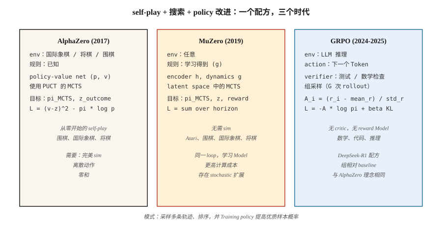

# 面向游戏的 RL — AlphaZero、MuZero 与 LLM Reasoning 时代

> 1992：TD-Gammon 用纯 TD 在 backgammon 中击败人类冠军。2016：AlphaGo 击败 Lee Sedol。2017：AlphaZero 从零开始统治 chess、shogi 和 Go。2024：DeepSeek-R1 证明了同一套配方在 reasoning 上也有效，只是用 GRPO 替代 PPO。游戏是推动本阶段每一次突破的 benchmark。

**类型：** Build
**语言：** Python
**先修要求：** Phase 9 · 05 (DQN)、Phase 9 · 08 (PPO)、Phase 9 · 09 (RLHF)、Phase 9 · 10 (MARL)
**时间：** 约 120 分钟

## 问题

游戏具备 RL 想要的一切。清晰的 reward（胜/负）。无限 episode（self-play 可以重置）。完美 simulation（游戏本身就是 simulator）。离散或小规模连续 action space。迫使对抗鲁棒性的 multi-agent 结构。

而且游戏正是每一次重大 RL 突破的测试场。TD-Gammon（backgammon，1992）。Atari-DQN（2013）。AlphaGo（2016）。AlphaZero（2017）。OpenAI Five（Dota 2，2019）。AlphaStar（StarCraft II，2019）。MuZero（learned model，2019）。AlphaTensor（matrix multiplication，2022）。AlphaDev（sorting algorithms，2023）。DeepSeek-R1（math reasoning，2025）—— 最新展示了 game-RL 技术也能用于文本。

这个 capstone 会通过一个统一视角考察三种里程碑架构：AlphaZero、MuZero 和 GRPO：**self-play + search + policy improvement**。每一种都是前一种的泛化；尤其是 GRPO，它把 AlphaZero 的配方应用到 LLM reasoning 中，其中 Token 是 action，数学验证是胜利信号。

## 概念



**统一循环。**

```
while True:
    trajectory = self_play(current_policy, search)     # 和自己对局
    policy_target = search.improved_policy(trajectory) # search 改进原始 policy
    policy_net.update(policy_target, value_target)     # 在 search 输出上做 supervised 训练
```

**AlphaZero (2017)。** Silver et al. 给定一个规则已知的游戏（chess、shogi、Go）：

- Policy-value network：一个塔 `f_θ(s) → (p, v)`。`p` 是合法 move 上的 prior。`v` 是期望 game outcome。
- Monte Carlo Tree Search (MCTS)：在每一步，展开可能后续状态的树。使用 `(p, v)` 作为 prior + bootstrap。用 UCB (PUCT) 选择节点：`a* = argmax Q(s, a) + c · p(a|s) · √N(s) / (1 + N(s, a))`。
- Self-play：让 agent-vs-agent 对局。在第 `t` 步，MCTS visit distribution `π_t` 成为 policy 训练目标。
- Loss：`L = (v - z)² - π · log p + c · ||θ||²`。`z` 是 game outcome（+1 / 0 / -1）。

零人类知识。零手工 heuristic。一个单一配方，在各自数千万局 self-play 之后掌握了 chess、shogi 和 Go。

**MuZero (2019)。** Schrittwieser et al. 移除了“规则已知”的要求。

- 不使用固定环境，而是学习一个 *latent dynamics model* `(h, g, f)`：
  - `h(s)`：将 observation 编码为 latent state。
  - `g(s_latent, a)`：预测下一个 latent state + reward。
  - `f(s_latent)`：预测 policy prior + value。
- MCTS 在 *learned latent space* 中运行。相同的 search，相同的训练循环。
- 适用于 Go、chess、shogi *以及* Atari —— 一个 algorithm，不需要规则知识。

**Stochastic MuZero (2022)。** 加入 stochastic dynamics 和 chance nodes；扩展到 backgammon 这类游戏。

**Muesli、Gumbel MuZero (2022-2024)。** 在 sample efficiency 和 deterministic search 上的改进。

**GRPO (2024-2025)。** DeepSeek-R1 配方。相同的 AlphaZero 形状循环，应用到 language-model reasoning：

- “游戏”：回答 math / coding / reasoning problem。“胜利”= verifier（test case 通过、数值答案匹配）返回 1。
- Policy：LLM。Actions：Token。State：prompt + response-so-far。
- 没有 critic（PPO 风格的 V_φ）。相反，对每个 prompt，从 policy 采样 `G` 个 completion。计算每个 completion 的 reward。使用 **group-relative advantage** `A_i = (r_i - mean_r) / std_r` 作为 REINFORCE 风格更新的信号。
- 对 reference policy 加 KL penalty 以防漂移（类似 RLHF）。
- 完整 Loss：

  `L_GRPO(θ) = -E_{q, {o_i}} [ (1/G) Σ_i A_i · log π_θ(o_i | q) ] + β · KL(π_θ || π_ref)`

没有 reward model，没有 critic，没有 MCTS。Group-relative baseline 替代了三者。在 reasoning benchmark 上，用少得多的 compute 达到或超过 PPO-RLHF 质量。

**完整的 R1 配方。** DeepSeek-R1（DeepSeek 2025）是一篇论文里的两个 model：

- **R1-Zero。** 从 DeepSeek-V3 base model 开始。没有 SFT。直接应用 GRPO，使用两个 reward component：*accuracy reward*（rule-based —— 最终答案是否能解析成正确数字 / 代码是否通过 unit tests）和 *format reward*（completion 是否把 chain-of-thought 包在 `<think>…</think>` 标签内）。经过数千步后，平均 response length 从约 100 增长到约 10,000 Token，math benchmark 分数上升到接近 o1-preview 水平。model 从零开始学会 reasoning。缺点：它的 chain of thought 往往难以阅读、混用语言，并且缺少风格打磨。
- **R1。** 用四阶段 pipeline 修复 R1-Zero 的可读性问题：
  1. **Cold-start SFT。** 收集数千条格式清晰的 long-CoT demonstration。对 base model 做 supervised-finetune。这提供了一个可读的起点。
  2. **Reasoning-oriented GRPO。** 使用 accuracy+format reward，并加入 *language-consistency* reward 来防止 code-switching。
  3. **Rejection sampling + SFT 第 2 轮。** 从 RL checkpoint 采样约 600K 条 reasoning trajectory，只保留最终答案正确且 CoT 可读的样本，并与约 200K 条非 reasoning SFT example（writing、QA、self-cognition）组合。再次 fine-tune base。
  4. **Full-spectrum GRPO。** 再进行一轮 RL，覆盖 reasoning（rule-based reward）和 general alignment（helpfulness/harmlessness preference-based reward）。

结果在 open weights 下于 AIME 和 MATH-500 上匹配 o1，并且足够小，可以 distill。同一篇论文还发布了六个 distilled dense models（从 Qwen-1.5B 到 Llama-70B），方式是在 R1 的 reasoning traces 上对学生做 SFT —— 学生端没有 RL。强 RL teacher 的 distillation 在学生规模上持续优于从零开始的 RL。

**为什么 reasoning 用 GRPO 而不是 PPO。** DeepSeekMath 论文（2024 年 2 月）给出三个原因：(1) 不需要训练 value network，内存减半；(2) group baseline 天然适配 reasoning task 产生的稀疏 end-of-trajectory reward；(3) per-prompt normalization 让不同难度问题之间的 advantage 可比，而 PPO 的单一 critic 做不到这一点。

**Search-free vs search-based。** 游戏领域已经分叉：

- *长 horizon 的 perfect-information games*（Go、chess）：仍然是 search-based。AlphaZero / MuZero 占主导。
- *LLM reasoning*：生产中还没有 MCTS；对完整 rollout 做 GRPO，推理 compute 使用 best-of-N。Process reward models (PRMs) 暗示 step-level search 正被重新加入。

## 构建

`code/main.py` 中的代码实现了 **微型 GRPO** —— 一个带多组 sample 的 bandit。algorithm 与 LLM 上相同；只有 policy 和 environment 更简单。它讲清楚 *loss* 和 *group-relative advantage*，也就是 2025 年的创新点。

### 步骤 1：一个微型 verifier environment

```python
QUESTIONS = [
    {"prompt": "q1", "correct": 3},
    {"prompt": "q2", "correct": 1},
]

def verify(prompt_idx, answer_token):
    return 1.0 if answer_token == QUESTIONS[prompt_idx]["correct"] else 0.0
```

在真实 GRPO 中，verifier 会运行 unit tests 或检查数学等价性。

### 步骤 2：policy：每个 prompt 上对 K 个 answer Token 做 softmax

```python
def policy_probs(theta, p_idx):
    return softmax(theta[p_idx])
```

等价于以 prompt 为条件的 LLM final-layer output。

### 步骤 3：group sampling 和 group-relative advantage

```python
def grpo_step(theta, p_idx, G=8, beta=0.01, lr=0.1, rng=None):
    probs = policy_probs(theta, p_idx)
    samples = [sample(probs, rng) for _ in range(G)]
    rewards = [verify(p_idx, s) for s in samples]
    mean_r = sum(rewards) / G
    std_r = stddev(rewards) + 1e-8
    advs = [(r - mean_r) / std_r for r in rewards]

    for a, A in zip(samples, advs):
        grad = onehot(a) - probs
        for i in range(len(probs)):
            theta[p_idx][i] += lr * A * grad[i]
    # KL penalty：把 theta 拉向 reference
    for i in range(len(probs)):
        theta[p_idx][i] -= beta * (theta[p_idx][i] - reference[p_idx][i])
```

Group-relative advantage 是 2024 年 DeepSeek 的技巧。不需要 critic。“baseline”是 group mean，normalization 使用 group std。

### 步骤 4：与 REINFORCE baseline（value-free）比较

相同设置、相同 compute、普通 REINFORCE。GRPO 收敛更快、更稳定。

### 步骤 5：观察 entropy 和 KL

与 RLHF 相同的 diagnostics：到 reference 的 mean KL、policy entropy、reward-over-time。一旦这些稳定，训练就完成了。

## 常见陷阱

- **通过操纵 verifier 进行 reward hacking。** GRPO 继承了 RLHF 的风险：如果 verifier 错误或可被利用，LLM 会找到 exploit。鲁棒 verifier（多个 test cases、formal proofs）很重要。
- **Group size 太小。** Group baseline 的方差按 `1/√G` 缩放。低于 `G = 4` 时，advantage signal 会很 noisy；标准选择是 `G = 8` 到 `64`。
- **Length bias。** 不同长度的 LLM completion 具有不同的 log-probabilities。按 Token 数归一化，或使用 sequence-level log-prob，或截断到 max length。
- **纯 self-play 循环。** AlphaZero 风格训练可能在 general-sum games 中卡进 dominance loop。可通过多样化 opponent pool（league play，Lesson 10）缓解。
- **Search-policy mismatch。** AlphaZero 训练 policy 去模仿 search output。如果 policy net 太小，无法表示 search 的 distribution，训练会停滞。
- **Compute floor。** MuZero / AlphaZero 需要海量 compute。一次 ablation 往往就是数百 GPU-hours。用于学习的微型 demo 是存在的（例如 Connect Four 上的 AlphaZero）。
- **Verifier coverage。** 对 bug solution 也能通过的 unit tests 会 reinforce 该 bug。要设计能捕捉 edge cases 的 verifier。

## 使用

2026 年 game-RL 版图，按 domain 划分：

| Domain | 主导方法 |
|--------|-----------------|
| Two-player zero-sum board games（Go、chess、shogi） | AlphaZero / MuZero / KataGo |
| Imperfect info card games（poker） | CFR + deep learning（DeepStack、Libratus、Pluribus） |
| Atari / pixel games | Muesli / MuZero / IMPALA-PPO |
| Large multiplayer strategy（Dota、StarCraft） | PPO + self-play + league（OpenAI Five、AlphaStar） |
| LLM math/code reasoning | GRPO（DeepSeek-R1、Qwen-RL、open replications） |
| LLM alignment | DPO / RLHF-PPO（不是 GRPO；verifier 是 preference，不是 verifiable） |
| Robotics | PPO + DR（不是 game-RL，但使用相同的 policy-gradient tools） |
| Combinatorial problems | AlphaZero variants（AlphaTensor、AlphaDev） |

这个 *配方* —— self-play、search-augmented improvement、policy distillation —— 横跨文本、像素和物理控制。GRPO 是最年轻的实例；更多实例还会出现。

## 交付

保存为 `outputs/skill-game-rl-designer.md`：

```markdown
---
name: game-rl-designer
description: 为给定 domain 设计 game-RL 或 reasoning-RL training pipeline（AlphaZero / MuZero / GRPO）。
version: 1.0.0
phase: 9
lesson: 12
tags: [rl, alphazero, muzero, grpo, self-play]
---

给定一个目标（perfect-info game / imperfect-info / Atari / LLM reasoning / combinatorial），输出：

1. Environment fit。规则是否已知？Markov？Stochastic？Multi-agent？用于判断 AlphaZero vs MuZero vs GRPO。
2. Search strategy。MCTS（带 learned prior 的 PUCT）、Gumbel-sampled、best-of-N，或 none。
3. Self-play plan。Symmetric self-play / league / offline data / verifier-generated。
4. Target signal。Game outcome / verifier reward / preference / learned model。包含 robustness plan。
5. Diagnostics。相对 baseline 的 win rate、ELO curve、verifier pass rate、到 reference 的 KL。

对 imperfect-info games 拒绝使用 AlphaZero（转向 CFR）。没有可信 verifier 时拒绝 GRPO。没有固定 baseline opponent set 时拒绝任何 game-RL pipeline（否则 self-play ELO 未校准）。
```

## 练习

1. **Easy。** 在 `code/main.py` 中实现 GRPO bandit。在 2 个 prompt × 每个 4 个 answer Token 上训练。使用 `G=8` 在 < 1,000 次 update 内收敛。
2. **Medium。** 接入 PPO（clipped）和 vanilla REINFORCE。在同一个 bandit 上比较 sample efficiency 和 reward variance 与 GRPO 的差异。
3. **Hard。** 扩展到长度为 2 的“reasoning chain”：agent 发出两个 Token，verifier 对 Token pair 给 reward。测量 GRPO 如何处理两步 sequence 上的 credit assignment。（提示：按 *full sequence* 计算 group advantage，并传播到两个 Token position。）

## 关键术语

| Term | 人们常说 | 实际含义 |
|------|-----------------|-----------------------|
| MCTS | “带 learned net 的 tree search” | Monte Carlo Tree Search；使用 learned `(p, v)` prior 的 UCB1/PUCT selection。 |
| AlphaZero | “Self-play + MCTS” | Policy-value net 被训练来匹配 MCTS visits 和 game outcome。 |
| MuZero | “Learned-model AlphaZero” | 相同循环，但通过 learned dynamics 在 latent space 中进行。 |
| GRPO | “Critic-free PPO” | Group Relative Policy Optimization；带 group-mean baseline + KL 的 REINFORCE。 |
| PUCT | “AlphaZero 的 UCB” | `Q + c · p · √N / (1 + N_a)` —— 平衡 value estimate 与 prior。 |
| Self-play | “Agent vs past self” | Zero-sum 的标准做法；提供对称训练信号。 |
| League play | “Population-based self-play” | 将 past + current + exploiters 采样为 opponents。 |
| Verifier reward | “Verifiable RL” | Reward 来自 deterministic checker（tests pass、answer matches）。 |
| Process reward | “PRM” | 为每个 reasoning step 打分，而不只是最终答案。 |

## 延伸阅读

- [Silver et al. (2017). Mastering the game of Go without human knowledge (AlphaGo Zero)](https://www.nature.com/articles/nature24270)。
- [Silver et al. (2018). A general reinforcement learning algorithm that masters chess, shogi, and Go through self-play (AlphaZero)](https://www.science.org/doi/10.1126/science.aar6404)。
- [Schrittwieser et al. (2020). Mastering Atari, Go, chess and shogi by planning with a learned model (MuZero)](https://www.nature.com/articles/s41586-020-03051-4)。
- [Vinyals et al. (2019). Grandmaster level in StarCraft II (AlphaStar)](https://www.nature.com/articles/s41586-019-1724-z)。
- [DeepSeek-AI (2024). DeepSeekMath: Pushing the Limits of Mathematical Reasoning in Open Language Models (GRPO)](https://arxiv.org/abs/2402.03300) —— 引入 GRPO 和 group-relative baseline 的论文。
- [DeepSeek-AI (2025). DeepSeek-R1: Incentivizing Reasoning Capability in LLMs via Reinforcement Learning](https://arxiv.org/abs/2501.12948) —— 完整的四阶段 R1 配方以及 R1-Zero ablation。
- [Brown et al. (2019). Superhuman AI for multiplayer poker (Pluribus)](https://www.science.org/doi/10.1126/science.aay2400) —— 大规模 CFR + deep-learning。
- [Tesauro (1995). Temporal Difference Learning and TD-Gammon](https://dl.acm.org/doi/10.1145/203330.203343) —— 开创这一切的论文。
- [Hugging Face TRL — GRPOTrainer](https://huggingface.co/docs/trl/main/en/grpo_trainer) —— 使用 custom reward functions 应用 GRPO 的生产参考。
- [Qwen Team (2024). Qwen2.5-Math — GRPO replication](https://github.com/QwenLM/Qwen2.5-Math) —— 多个 scale 上对 R1 配方的 open replication。
- [Sutton & Barto (2018). Ch. 17 — Frontiers of Reinforcement Learning](http://incompleteideas.net/book/RLbook2020.pdf) —— 对 self-play、search 和 R1 在 LLM scale 上实例化的 “designed reward” 的教材级框架。
