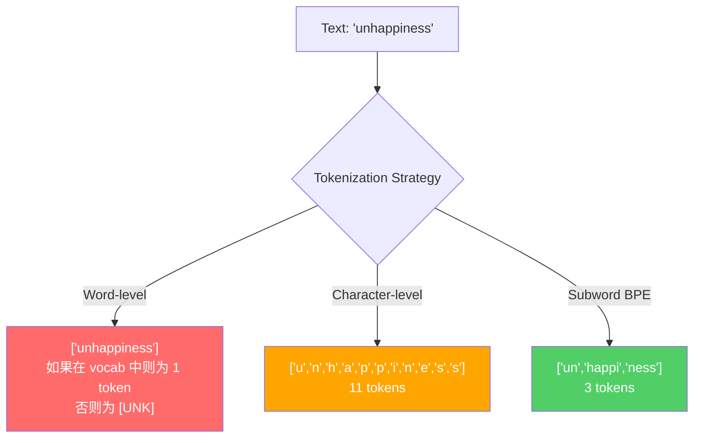
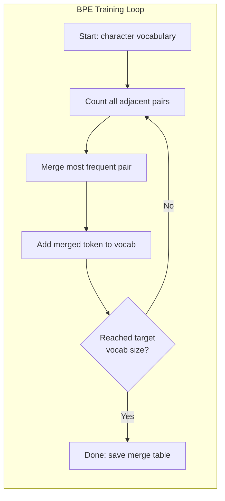
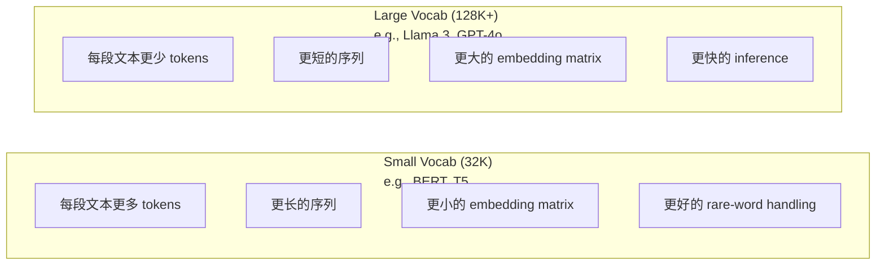

# Tokenizers: BPE, WordPiece, SentencePiece

> 你的 LLM 不读取英文。它读取整数。Tokenizer 决定这些整数承载的是意义，还是浪费。

**Type:** Build
**Languages:** Python
**Prerequisites:** Phase 05 (NLP Foundations)
**Time:** ~90 minutes

## 学习目标
- 从零实现 BPE、WordPiece 和 Unigram tokenization algorithms，并比较它们的 merge strategies
- 解释 vocabulary size 如何影响模型效率：过小会产生长序列，过大会浪费 embedding parameters
- 分析不同语言和代码中的 tokenization artifacts，识别特定 Tokenizers 在哪里失效
- 使用 tiktoken 和 sentencepiece libraries 对文本进行 tokenize，并检查生成的 token IDs

## 问题
你的 LLM 不读取英文。它不读取任何语言。它读取数字。

从 "Hello, world!" 到 [15496, 11, 995, 0] 之间的差距，就是 Tokenizer。每个词、每个空格、每个标点符号，都必须先转换成整数，模型才能处理它。这种转换并不是中性的。它会把一些假设烘焙进模型，而这些假设之后无法撤销。

如果这里做错，模型就会浪费容量，用多个 Tokens 来编码常见词。"unfortunately" 会变成四个 Tokens，而不是一个。对于多音节词密集的文本，你的 128K context window 实际上刚刚缩水了 75%。如果做对，同样的 context window 可以承载两倍的意义。"this model handles code well" 和 "this model chokes on Python" 之间的差异，往往归根结底取决于 Tokenizer 是如何训练的。

你对 GPT-4 或 Claude 发起的每一次 API call，都是按 Token 定价。模型生成的每个 Token 都会消耗 compute。表示一个输出所需的 Tokens 越少，端到端 inference 就越快。Tokenization 不是 preprocessing。它是 architecture。

## 概念
### 三种失败的方法（以及一种胜出的方法）

把文本转换为数字，有三种显而易见的方法。其中两种无法规模化。

**Word-level tokenization** 按空格和标点切分。"The cat sat" 会变成 ["The", "cat", "sat"]。很简单。但 "tokenization" 怎么办？"GPT-4o" 呢？或者像 "Geschwindigkeitsbegrenzung" 这样的德语复合词呢？Word-level 需要一个巨大的 vocabulary，覆盖每种语言中的每个词。漏掉一个词，你就会得到可怕的 `[UNK]` token -- 这是模型在说“我完全不知道这是什么”。仅英文就有超过一百万种词形。再加上代码、URLs、科学计数法以及另外 100 种语言，你就需要一个无限大的 vocabulary。

**Character-level tokenization** 走向另一个方向。"hello" 会变成 ["h", "e", "l", "l", "o"]。Vocabulary 很小（几百个字符）。永远不会有 unknown tokens。但序列会变得极长。一个本来是 10 个 word-level tokens 的句子，会变成 50 个 character-level tokens。模型必须学会 "t"、"h"、"e" 放在一起表示 "the" -- 把 attention capacity 消耗在一个人类三岁就能学会的东西上。

**Subword tokenization** 找到了平衡点。常见词保持完整："the" 是一个 Token。罕见词会拆解成有意义的片段："unhappiness" 变成 ["un", "happi", "ness"]。Vocabulary 保持可控（30K 到 128K tokens）。序列保持较短。Unknown tokens 基本消失，因为任何词都可以由 subword pieces 构建出来。

每个现代 LLM 都使用 subword tokenization。GPT-2、GPT-4、BERT、Llama 3、Claude -- 全都是。问题在于使用哪种 algorithm。



### BPE: Byte Pair Encoding

BPE 是一种贪心压缩 algorithm，后来被重新用于 tokenization。这个想法简单到可以写在一张索引卡上。

从单个字符开始。统计训练语料中每个相邻 pair。把出现频率最高的 pair merge 成一个新的 Token。重复这个过程，直到达到目标 vocabulary size。

下面是在一个很小的 corpus 上运行的 BPE，其中包含 "lower"、"lowest" 和 "newest"：

```
Corpus（带 word frequencies）:
  "lower"  x5
  "lowest" x2
  "newest" x6

Step 0 -- 从字符开始:
  l o w e r       (x5)
  l o w e s t     (x2)
  n e w e s t     (x6)

Step 1 -- 统计相邻 pairs:
  (e,s): 8    (s,t): 8    (l,o): 7    (o,w): 7
  (w,e): 13   (e,r): 5    (n,e): 6    ...

Step 2 -- Merge 最高频 pair (w,e) -> "we":
  l o we r        (x5)
  l o we s t      (x2)
  n e we s t      (x6)

Step 3 -- 重新统计并 merge (e,s) -> "es":
  l o we r        (x5)
  l o we s t      (x2)    <- 'es' 只由 'e'+'s' 形成，不是 'we'+'s'
  n e we s t      (x6)    <- 等等，'we' 前面有 'e'，'we' 后面有 's'

实际精确跟踪如下:
  在 "we" merge 之后，剩余 pairs:
  (l,o): 7   (o,we): 7   (we,r): 5   (we,s): 8
  (s,t): 8   (n,e): 6    (e,we): 6

Step 3 -- Merge (we,s) -> "wes" 或 (s,t) -> "st"（同为 8，选第一个）:
  Merge (we,s) -> "wes":
  l o we r        (x5)
  l o wes t       (x2)
  n e wes t       (x6)

Step 4 -- Merge (wes,t) -> "west":
  l o we r        (x5)
  l o west        (x2)
  n e west        (x6)

...继续，直到达到目标 vocab size。
```

Merge table 就是 Tokenizer。要 encode 新文本，就按照学习到的顺序应用 merges。训练 corpus 决定了哪些 merges 存在，而这个选择会永久塑造模型看到的内容。



### Byte-Level BPE (GPT-2, GPT-3, GPT-4)

标准 BPE 在 Unicode characters 上运行。Byte-level BPE 在原始 bytes（0-255）上运行。这会给你一个正好为 256 的基础 vocabulary，能够处理任何语言或 encoding，并且永远不会产生 unknown token。

GPT-2 引入了这种方法。基础 vocabulary 覆盖每一种可能的 byte。BPE merges 在此之上构建。OpenAI 的 tiktoken library 实现了 byte-level BPE，并使用这些 vocabulary sizes：

- GPT-2: 50,257 tokens
- GPT-3.5/GPT-4: ~100,256 tokens (cl100k_base encoding)
- GPT-4o: 200,019 tokens (o200k_base encoding)

### WordPiece (BERT)

WordPiece 看起来类似 BPE，但选择 merges 的方式不同。它不是使用原始频率，而是最大化训练数据的 likelihood：

```
BPE merge criterion:      count(A, B)
WordPiece merge criterion: count(AB) / (count(A) * count(B))
```

BPE 问的是：“哪个 pair 出现得最频繁？”WordPiece 问的是：“哪个 pair 一起出现的频率高于随机情况下的预期？”这个细微差别会产生不同的 vocabularies。WordPiece 偏好那些共现令人意外的 merges，而不只是频繁的 merges。

WordPiece 还使用 "##" prefix 表示 continuation subwords：

```
"unhappiness" -> ["un", "##happi", "##ness"]
"embedding"   -> ["em", "##bed", "##ding"]
```

"##" prefix 告诉你这个 piece 延续前一个 Token。BERT 使用 WordPiece，vocabulary 为 30,522 tokens。每个 BERT variant -- DistilBERT，RoBERTa 的 Tokenizer 实际上是 BPE，但 BERT 本身是 WordPiece。

### SentencePiece (Llama, T5)

SentencePiece 把输入视为一个原始 Unicode characters 流，其中包括空白符。没有 pre-tokenization step。没有关于词边界的语言特定规则。这使它真正做到 language-agnostic -- 它适用于中文、日文、泰文以及其他不使用空格分隔词的语言。

SentencePiece 支持两种 algorithms：
- **BPE mode**: 与标准 BPE 相同的 merge logic，应用于原始字符序列
- **Unigram mode**: 从一个大型 vocabulary 开始，然后迭代移除对整体 likelihood 影响最小的 Tokens。它是 BPE 的反向过程 -- 不是 merge，而是 prune。

Llama 2 使用 SentencePiece BPE，vocabulary 为 32,000 tokens。T5 使用 SentencePiece Unigram，vocabulary 为 32,000 tokens。注意：Llama 3 切换到了基于 tiktoken 的 byte-level BPE Tokenizer，包含 128,256 tokens。

### Vocabulary Size Tradeoffs

这是一个真实的工程决策，并且有可测量的后果。



具体数字。对于一个 128K vocabulary 和 4,096 维 embeddings，仅 embedding matrix 就是 128,000 x 4,096 = 5.24 亿 parameters。对于 32K vocabulary，则是 1.31 亿 parameters。仅仅因为 Tokenizer 选择不同，就会产生 400M parameter 的差异。

但更大的 vocabularies 会更激进地压缩文本。同一段英文段落，用 32K vocabulary 可能需要 100 tokens，用 128K vocabulary 可能只需要 70 tokens。这意味着 generation 期间 forward passes 减少 30%。对于服务数百万请求的模型来说，这会直接降低 compute cost。

趋势很明确：vocabulary sizes 正在增长。GPT-2 使用 50,257。GPT-4 使用 ~100K。Llama 3 使用 128K。GPT-4o 使用 200K。

| Model | Vocab Size | Tokenizer Type | Avg Tokens per English Word |
|-------|-----------|----------------|---------------------------|
| BERT | 30,522 | WordPiece | ~1.4 |
| GPT-2 | 50,257 | Byte-level BPE | ~1.3 |
| Llama 2 | 32,000 | SentencePiece BPE | ~1.4 |
| GPT-4 | ~100,256 | Byte-level BPE | ~1.2 |
| Llama 3 | 128,256 | Byte-level BPE (tiktoken) | ~1.1 |
| GPT-4o | 200,019 | Byte-level BPE | ~1.0 |

### The Multilingual Tax

主要基于英文训练的 Tokenizers 对其他语言非常残酷。韩文文本在 GPT-2 的 Tokenizer 中平均每个词需要 2-3 tokens。中文可能更糟。这意味着韩文用户的 context window 实际上只有英文用户的一半 -- 支付同样的价格，却获得更低的信息密度。

这就是 Llama 3 将 vocabulary 从 32K 扩大到 128K 的原因。分配给非英文文字系统的 Tokens 越多，各语言之间的压缩就越公平。

## 构建它
### 步骤 1： Character-Level Tokenizer

从基础开始。Character-level Tokenizer 将每个字符映射到它的 Unicode code point。不需要训练。没有 unknown tokens。只是直接映射。

```python
class CharTokenizer:
    def encode(self, text):
        return [ord(c) for c in text]

    def decode(self, tokens):
        return "".join(chr(t) for t in tokens)
```

"hello" 会变成 [104, 101, 108, 108, 111]。每个字符都是自己的 Token。这是我们要改进的 baseline。

### 步骤 2： BPE Tokenizer from Scratch

真正的实现。我们在原始 bytes 上训练（像 GPT-2 一样），统计 pairs，merge 最频繁的 pair，并按顺序记录每一次 merge。Merge table 就是 Tokenizer。

```python
from collections import Counter

class BPETokenizer:
    def __init__(self):
        self.merges = {}
        self.vocab = {}

    def _get_pairs(self, tokens):
        pairs = Counter()
        for i in range(len(tokens) - 1):
            pairs[(tokens[i], tokens[i + 1])] += 1
        return pairs

    def _merge_pair(self, tokens, pair, new_token):
        merged = []
        i = 0
        while i < len(tokens):
            if i < len(tokens) - 1 and tokens[i] == pair[0] and tokens[i + 1] == pair[1]:
                merged.append(new_token)
                i += 2
            else:
                merged.append(tokens[i])
                i += 1
        return merged

    def train(self, text, num_merges):
        tokens = list(text.encode("utf-8"))
        self.vocab = {i: bytes([i]) for i in range(256)}

        for i in range(num_merges):
            pairs = self._get_pairs(tokens)
            if not pairs:
                break
            best_pair = max(pairs, key=pairs.get)
            new_token = 256 + i
            tokens = self._merge_pair(tokens, best_pair, new_token)
            self.merges[best_pair] = new_token
            self.vocab[new_token] = self.vocab[best_pair[0]] + self.vocab[best_pair[1]]

        return self

    def encode(self, text):
        tokens = list(text.encode("utf-8"))
        for pair, new_token in self.merges.items():
            tokens = self._merge_pair(tokens, pair, new_token)
        return tokens

    def decode(self, tokens):
        byte_sequence = b"".join(self.vocab[t] for t in tokens)
        return byte_sequence.decode("utf-8", errors="replace")
```

Training loop 是 BPE 的核心：统计 pairs，merge 胜出的 pair，重复。每次 merge 都会减少总 token count。经过 `num_merges` 轮之后，vocabulary 从 256（base bytes）增长到 256 + num_merges。

Encoding 会按照学习到的精确顺序应用 merges。这一点很重要。如果 merge 1 创建了 "th"，merge 5 创建了 "the"，那么 encoding 必须先应用 merge 1，这样 "the" 才能在 merge 5 中由 "th" + "e" 形成。

Decoding 是反向过程：在 vocabulary 中查找每个 token ID，连接 bytes，然后 decode 为 UTF-8。

### 步骤 3： Encode and Decode Roundtrip

```python
corpus = (
    "The cat sat on the mat. The cat ate the rat. "
    "The dog sat on the log. The dog ate the frog. "
    "Natural language processing is the study of how computers "
    "understand and generate human language. "
    "Tokenization is the first step in any NLP pipeline."
)

tokenizer = BPETokenizer()
tokenizer.train(corpus, num_merges=40)

test_sentences = [
    "The cat sat on the mat.",
    "Natural language processing",
    "tokenization pipeline",
    "unhappiness",
]

for sentence in test_sentences:
    encoded = tokenizer.encode(sentence)
    decoded = tokenizer.decode(encoded)
    raw_bytes = len(sentence.encode("utf-8"))
    ratio = len(encoded) / raw_bytes
    print(f"'{sentence}'")
    print(f"  Tokens: {len(encoded)} (from {raw_bytes} bytes) -- ratio: {ratio:.2f}")
    print(f"  Roundtrip: {'PASS' if decoded == sentence else 'FAIL'}")
```

Compression ratio 告诉你 Tokenizer 有多有效。ratio 为 0.50 表示 Tokenizer 将文本压缩到原始 bytes 一半数量的 Tokens。越低越好。在训练 corpus 上，ratio 会很好。在 "unhappiness" 这种 out-of-distribution 文本上（它没有出现在 corpus 中），ratio 会更差 -- Tokenizer 会对未见过的 patterns 回退到 character-level encoding。

### 步骤 4： Compare with tiktoken

```python
import tiktoken

enc = tiktoken.get_encoding("cl100k_base")

texts = [
    "The cat sat on the mat.",
    "unhappiness",
    "Hello, world!",
    "def fibonacci(n): return n if n < 2 else fibonacci(n-1) + fibonacci(n-2)",
    "Geschwindigkeitsbegrenzung",
]

for text in texts:
    our_tokens = tokenizer.encode(text)
    tiktoken_tokens = enc.encode(text)
    tiktoken_pieces = [enc.decode([t]) for t in tiktoken_tokens]
    print(f"'{text}'")
    print(f"  Our BPE:   {len(our_tokens)} tokens")
    print(f"  tiktoken:  {len(tiktoken_tokens)} tokens -> {tiktoken_pieces}")
```

tiktoken 使用完全相同的 algorithm，但它是在数百 GB 文本上训练的，并包含 100,000 个 merges。Algorithm 是一样的。差异在于训练数据和 merge 数量。你的 Tokenizer 只在一个段落上训练，并且只有 40 个 merges，无法在大规模 corpus 上与 tiktoken 的 100K merges 竞争。但机制是一样的。

### 步骤 5： Vocabulary Analysis

```python
def analyze_vocabulary(tokenizer, test_texts):
    total_tokens = 0
    total_chars = 0
    token_usage = Counter()

    for text in test_texts:
        encoded = tokenizer.encode(text)
        total_tokens += len(encoded)
        total_chars += len(text)
        for t in encoded:
            token_usage[t] += 1

    print(f"Vocabulary size: {len(tokenizer.vocab)}")
    print(f"Total tokens across all texts: {total_tokens}")
    print(f"Total characters: {total_chars}")
    print(f"Avg tokens per character: {total_tokens / total_chars:.2f}")

    print(f"\nMost used tokens:")
    for token_id, count in token_usage.most_common(10):
        token_bytes = tokenizer.vocab[token_id]
        display = token_bytes.decode("utf-8", errors="replace")
        print(f"  Token {token_id:4d}: '{display}' (used {count} times)")

    unused = [t for t in tokenizer.vocab if t not in token_usage]
    print(f"\nUnused tokens: {len(unused)} out of {len(tokenizer.vocab)}")
```

这会揭示你 vocabulary 中的 Zipf distribution。少数 Tokens 占据主导（空格、"the"、"e"）。大多数 Tokens 很少被使用。生产级 Tokenizers 会围绕这个分布进行优化 -- 常见 patterns 获得较短的 token IDs，罕见 patterns 使用更长的表示。

## 使用它
你的 scratch BPE 可以工作了。现在看看生产级工具是什么样子。

### tiktoken (OpenAI)

```python
import tiktoken

enc = tiktoken.get_encoding("cl100k_base")

text = "Tokenizers convert text to integers"
tokens = enc.encode(text)
print(f"Tokens: {tokens}")
print(f"Pieces: {[enc.decode([t]) for t in tokens]}")
print(f"Roundtrip: {enc.decode(tokens)}")
```

tiktoken 用 Rust 编写，并提供 Python bindings。它每秒可以 encode 数百万 Tokens。同样的 BPE algorithm，工业级实现。

### Hugging Face tokenizers

```python
from tokenizers import Tokenizer
from tokenizers.models import BPE
from tokenizers.trainers import BpeTrainer
from tokenizers.pre_tokenizers import ByteLevel

tokenizer = Tokenizer(BPE())
tokenizer.pre_tokenizer = ByteLevel()

trainer = BpeTrainer(vocab_size=1000, special_tokens=["<pad>", "<eos>", "<unk>"])
tokenizer.train(["corpus.txt"], trainer)

output = tokenizer.encode("The cat sat on the mat.")
print(f"Tokens: {output.tokens}")
print(f"IDs: {output.ids}")
```

Hugging Face tokenizers library 底层同样是 Rust。它可以在数秒内基于 GB 级 corpora 训练 BPE。这就是你训练自己模型时会使用的工具。

### Loading Llama's Tokenizer

```python
from transformers import AutoTokenizer

tokenizer = AutoTokenizer.from_pretrained("meta-llama/Llama-3.1-8B")

text = "Tokenizers are the unsung heroes of LLMs"
tokens = tokenizer.encode(text)
print(f"Token IDs: {tokens}")
print(f"Tokens: {tokenizer.convert_ids_to_tokens(tokens)}")
print(f"Vocab size: {tokenizer.vocab_size}")

multilingual = ["Hello world", "Hola mundo", "Bonjour le monde"]
for text in multilingual:
    ids = tokenizer.encode(text)
    print(f"'{text}' -> {len(ids)} tokens")
```

Llama 3 的 128K vocabulary 对非英文文本的压缩明显优于 GPT-2 的 50K vocabulary。你可以自己验证这一点 -- 用多种语言 encode 同一句子，然后统计 Tokens。

## 交付它
本课会产出 `outputs/prompt-tokenizer-analyzer.md` -- 一个可复用的 prompt，用于分析任意文本和模型组合的 tokenization efficiency。把一个 text sample 喂给它，它会告诉你哪个模型的 Tokenizer 处理得最好。

## 练习
1. 修改 BPE Tokenizer，让它在每个 merge step 打印 vocabulary。观察 "t" + "h" 如何变成 "th"，然后 "th" + "e" 如何变成 "the"。跟踪常见英文词如何一步步组装出来。

2. 向 BPE Tokenizer 添加 special tokens（`<pad>`、`<eos>`、`<unk>`）。给它们分配 IDs 0、1、2，并相应地移动所有其他 Tokens。实现一个 pre-tokenization step，在运行 BPE 之前按 whitespace 切分。

3. 实现 WordPiece merge criterion（使用 likelihood ratio 而不是 frequency）。在同一个 corpus 上，用相同的 merge 数量训练 BPE 和 WordPiece。比较生成的 vocabularies -- 哪一个产生的 subwords 在语言学上更有意义？

4. 构建一个 multilingual Tokenizer efficiency benchmark。选取英语、西班牙语、中文、韩语和阿拉伯语各 10 个句子。用 tiktoken（cl100k_base）对每个句子 tokenize，并测量平均每字符 Tokens。量化每种语言的 "multilingual tax"。

5. 在更大的 corpus 上训练你的 BPE Tokenizer（下载一篇 Wikipedia 文章）。调整 merge 数量，使其在同一文本上的 compression ratio 达到 tiktoken 的 10% 以内。这会迫使你理解 corpus size、merge count 和 compression quality 之间的关系。

## 关键术语
| Term | What people say | What it actually means |
|------|----------------|----------------------|
| Token | “一个词” | 模型 vocabulary 中的一个单元 -- 可以是字符、subword、word，或 multi-word chunk |
| BPE | “某种压缩东西” | Byte Pair Encoding -- 迭代 merge 出现最频繁的相邻 token pair，直到达到目标 vocabulary size |
| WordPiece | “BERT 的 Tokenizer” | 类似 BPE，但 merges 最大化 likelihood ratio count(AB)/(count(A)*count(B))，而不是原始 frequency |
| SentencePiece | “一个 Tokenizer library” | 一种 language-agnostic Tokenizer，在没有 pre-tokenization 的情况下直接处理原始 Unicode，并支持 BPE 和 Unigram algorithms |
| Vocabulary size | “它知道多少词” | 唯一 Tokens 的总数：GPT-2 有 50,257，BERT 有 30,522，Llama 3 有 128,256 |
| Fertility | “不是 Tokenizer 术语” | 每个词的平均 Tokens 数 -- 衡量 Tokenizer 在不同语言上的效率（1.0 是理想值，3.0 表示模型要多工作三倍） |
| Byte-level BPE | “GPT 的 Tokenizer” | 在原始 bytes（0-255）而不是 Unicode characters 上运行的 BPE，保证任何输入都不会产生 unknown tokens |
| Merge table | “Tokenizer 文件” | 训练期间学习到的有序 pair merges 列表 -- 这就是 Tokenizer 本身，而且顺序很重要 |
| Pre-tokenization | “按空格切分” | 在 subword tokenization 之前应用的规则：whitespace splitting、digit separation、punctuation handling |
| Compression ratio | “Tokenizer 有多高效” | 生成的 Tokens 数除以输入 bytes 数 -- 越低表示压缩越好，inference 越快 |

## 延伸阅读
- [Sennrich et al., 2016 -- "Neural Machine Translation of Rare Words with Subword Units"](https://arxiv.org/abs/1508.07909) -- 这篇 paper 将 BPE 引入 NLP，把一个 1994 年的压缩 algorithm 变成了现代 tokenization 的基础
- [Kudo & Richardson, 2018 -- "SentencePiece: A simple and language independent subword tokenizer"](https://arxiv.org/abs/1808.06226) -- language-agnostic tokenization，使 multilingual models 变得实用
- [OpenAI tiktoken repository](https://github.com/openai/tiktoken) -- 用 Rust 编写并带有 Python bindings 的生产级 BPE 实现，由 GPT-3.5/4/4o 使用
- [Hugging Face Tokenizers documentation](https://huggingface.co/docs/tokenizers) -- 具备 Rust 性能的生产级 Tokenizer training
