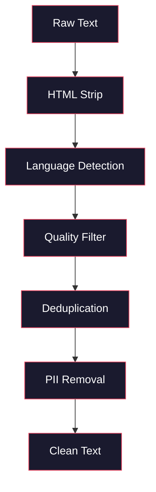
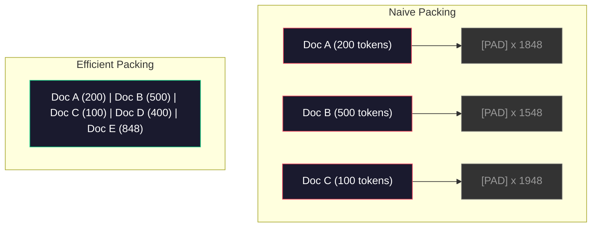

# Pre-Training 的 Data Pipelines

> 模型是一面镜子。它会反映你喂给它的任何数据。喂给它垃圾，它就会以完美的流畅度反映出垃圾。

**Type:** Build
**Languages:** Python
**Prerequisites:** Phase 10, Lessons 01-02 (Tokenizers, Building a Tokenizer)
**Time:** ~90 minutes

## 学习目标

- 构建一个 streaming data pipeline，在不把全部数据加载到内存的情况下，对 TB 级文本进行 Tokenization、切块、shuffle 和 batch
- 实现真实 pre-training pipeline 中使用的数据质量过滤器（deduplication、language detection、content filtering）
- 创建固定长度训练序列，并正确处理 attention masks 和文档边界
- Profile pipeline throughput，确保 dataloader 能跟上 GPU 训练速度

## 问题

你已经有了一个 Tokenizer。现在你需要数据。

不是一个 dataset。不是一个 CSV 文件。而是 TB 级文本：经过清洗、deduplication、质量过滤、Tokenization 成固定长度序列，并以足够快的速度作为随机 batch 提供，确保你的 8-GPU 集群永远不会等待下一个 batch。

大多数人以为训练一个 LLM 的核心是模型架构。并不是。Llama 3 使用了 15.6 trillion Token。GPT-3 使用了 300 billion。DeepSeek-V2 使用了 8.1 trillion。这三者的架构大体相同：堆叠的 Transformer block，包含 Attention 和前馈层。输出质量的差异压倒性地来自数据。

DeepMind 的 Chinchilla paper 精确说明了这一点。对于给定的计算预算，模型参数量与训练 Token 数之间存在一个最优比例。Chinchilla 表明，2022 年的大多数模型都严重 undertrained：相对于它们看到的数据量，它们的参数太多。一个在 1.4 trillion Token 上训练的 70B 参数模型（Chinchilla-optimal）优于一个在 300 billion Token 上训练的 280B 模型（Gopher）。

你的 data pipeline 决定了你的模型学到的是语言，还是噪声。

## 核心概念

### 数据来自哪里

每个大型语言模型都会在多种来源的混合数据上训练。对大多数实验室来说，确切的数据组成都是严密保密的，但我们已经知道足够多，可以理解这些类别。

| Source | Size | Quality | Used By |
|--------|------|---------|---------|
| Common Crawl | ~250 TB raw | 低（需要大量过滤） | GPT-3, Llama, most open models |
| Wikipedia | ~20 GB | 高 | Every major LLM |
| GitHub code | ~1 TB+ | 中等（大量重复、废弃代码） | StarCoder, CodeLlama, DeepSeek-Coder |
| Books (BookCorpus, Pile) | ~100 GB | 高 | GPT-2, GPT-3, early models |
| Academic papers (arXiv, S2ORC) | ~100 GB | STEM 领域质量高 | Llama, Galactica |
| StackOverflow, Reddit | ~100 GB | 中等 | Llama, Falcon |
| Curated web (C4, RefinedWeb) | ~5 TB | 中高（已预过滤） | T5, Falcon |

Llama 3 披露了它的数据混合比例：大约 50% web data、25% code、13% books 和 academic papers、8% math data，以及 4% multilingual web data。总量为 15.6 trillion Token，来自超过 5 TB 的原始文本来源。

比例和总量同样重要。web data 太多，模型会变成 Reddit 复读机。code 太少，它就无法编程。math 太少，它就会在推理上失败。把这个混合比例调对，是训练 LLM 最困难的部分之一，而且没有公式可套用：它需要实验和评估。

### 数据清洗

原始 web data 很脏。一个典型的 Common Crawl dump 包含：

- HTML tags 和 JavaScript
- 模板化 headers、footers、navigation menus
- 重复页面（完全重复和近似重复）
- 机器生成的 spam
- Personally identifiable information (PII)
- 低质量文本（关键词列表、SEO spam）
- 以文本形式编码的非文本内容

清洗不是可选项。它决定了模型是生成连贯段落，还是输出混杂着产品列表的 HTML tags。



每一步都会消除一类噪声：

**HTML stripping:** 移除所有标记。只保留可见文本内容。像 `trafilatura` 或 `readability` 这样的库会提取文章内容，同时丢弃导航、广告和模板化内容。

**Language detection:** 使用 fastText 的语言识别模型（lid.176.bin）对每个文档进行分类。过滤到你的目标语言。如果一个文档被分类为英文，但置信度低于 0.8，它很可能不是干净的英文。

**Quality filtering:** 这里开始变得有意思。RefinedWeb（Falcon 背后的 dataset）使用基于 perplexity 的过滤器：先在 Wikipedia 上训练一个小型语言模型，然后给每个文档打分。高 perplexity 意味着这个文档不像 Wikipedia：很可能是 spam、关键词列表或机器生成内容。perplexity 高于阈值的文档会被移除。

**Deduplication:** 单个最有影响力的清洗步骤。Common Crawl 包含海量重复页面：法律免责声明、cookie notices、服务条款。在重复数据上训练会浪费计算，并可能导致模型记忆并逐字吐出特定段落。

**PII removal:** 姓名、电子邮件地址、电话号码、社会安全号码。对结构化 PII 使用基于 regex 的检测，对上下文中的姓名使用 NER models。

### 使用 MinHash 做 Deduplication

精确 deduplication 很容易：对每个文档做 hash，移除重复项。但真正的问题是近似重复。两份同一新闻文章的拷贝，周围广告略有不同，就是近似重复。内容 95% 相同，但按字节比较并不一致。

MinHash + Locality-Sensitive Hashing (LSH) 可以高效解决这个问题。


思路如下：

1. **Shingling:** 将每个文档转换成 n-gram 集合（例如词或字符的 5-gram）。"the quick brown fox" 使用 3-word shingles 会变成 {"the quick brown", "quick brown fox"}。

2. **MinHash:** 对每个文档的 shingle set，计算 k 个 hash 值。每个 hash 值是在不同 hash function 下所有 shingles 的最小 hash。这样会创建一个固定大小的 “signature”，用于近似估计任意两个文档之间的 Jaccard similarity。

3. **LSH:** 根据 MinHash signature 的 band，把文档分组到 buckets 中。同一个 bucket 中的文档就是候选近似重复项。这样可以避免比较每一对文档：你只需要比较候选项。

4. **Verify:** 对每个候选 pair，计算精确的 Jaccard similarity。如果 similarity 超过阈值（通常为 0.8），就移除其中一个副本。

Llama 团队报告称，他们通过 deduplication 移除了大约 38% 的 web data。这不是一个小数字。超过三分之一的 Common Crawl 都是重复或近似重复内容。

### Sequence Packing

你的模型期望固定长度的输入序列。你的文档长度是可变的。有些是 50 个 Token。有些是 50,000 个 Token。

朴素做法：把每个文档 pad 到最大序列长度。这会在对学习毫无贡献的 padding Token 上浪费大量计算。

更好的做法：把多个文档 pack 到一个序列中，并用 end-of-sequence Token 分隔。一个 2048-Token 的序列可能包含三个短文档，中间用 [EOS] Token 拼接。



attention mask 必须正确设置。同一个 packed sequence 中，Document A 的 Token 不应该 attend to Document B 的 Token。这需要一个 block-diagonal attention mask。

长文档会在序列边界处被截断或拆分成 chunk。拆分点很重要：在句子中间拆分会迫使模型看到不完整的思路。有些 pipeline 会尽可能把拆分对齐到段落或句子边界。

### Chinchilla Scaling Law

对于固定计算预算 C（以 FLOPs 衡量），最优模型大小 N 和 dataset 大小 D 遵循：

```
N_opt ~ C^0.5
D_opt ~ C^0.5
```

实践中，这意味着你应该大致等比例扩展模型大小和 dataset 大小。一个参数量多 10x 的模型，需要大约多 10x 的训练 Token，才能达到相同的 Loss。

| Model | Parameters | Training Tokens | Chinchilla-Optimal? |
|-------|-----------|----------------|-------------------|
| GPT-3 | 175B | 300B | 否（undertrained 3-4x） |
| Chinchilla | 70B | 1.4T | 是（按设计） |
| Llama 2 | 70B | 2T | Overtrained（有意为之） |
| Llama 3 | 70B | 15T | 严重 overtrained |

Llama 3 故意违反了 Chinchilla law。Meta 发现，在更多数据上 overtraining，远超 compute-optimal ratio，会产生更适合 inference 的模型。额外训练成本只支付一次，但更小的模型在长期服务时成本更低。这有时被称为 “inference-optimal” scaling approach，并且自 2024 年以来已成为行业标准。

```figure
l5-data-pipeline
```

## 构建它

### 步骤 1： Text Cleaning

剥离 HTML、规范化 whitespace、移除非文本内容。我们会使用 public domain text（Project Gutenberg）作为小型 corpus。

```python
import re

def clean_text(text):
    text = re.sub(r"<[^>]+>", "", text)
    text = re.sub(r"http\S+", "", text)
    text = re.sub(r"[^\x20-\x7E\n]", "", text)
    text = re.sub(r"\n{3,}", "\n\n", text)
    text = re.sub(r" {2,}", " ", text)
    return text.strip()

def quality_filter(text, min_words=50, max_ratio_caps=0.3, max_ratio_special=0.1):
    words = text.split()
    if len(words) < min_words:
        return False
    caps_ratio = sum(1 for w in words if w.isupper()) / len(words)
    if caps_ratio > max_ratio_caps:
        return False
    special_chars = sum(1 for c in text if not c.isalnum() and not c.isspace())
    if special_chars / max(len(text), 1) > max_ratio_special:
        return False
    return True
```

这个 quality filter 会捕捉 SEO spam（ALL CAPS）、机器生成噪声（高特殊字符比例）和 stub pages（过短）。仅这三个检查，就能从 web crawls 中移除数量惊人的垃圾内容。

### 步骤 2: MinHash Deduplication

从零实现 MinHash。不需要外部库，只需要 `hashlib`。

```python
import hashlib
from collections import defaultdict

def get_shingles(text, k=5):
    words = text.lower().split()
    if len(words) < k:
        return set()
    return {" ".join(words[i:i+k]) for i in range(len(words) - k + 1)}

def minhash_signature(shingles, num_hashes=128):
    signature = []
    for i in range(num_hashes):
        min_hash = float("inf")
        for shingle in shingles:
            h = int(hashlib.sha256(f"{i}:{shingle}".encode()).hexdigest(), 16)
            min_hash = min(min_hash, h)
        signature.append(min_hash)
    return signature

def lsh_buckets(signature, bands=16):
    rows_per_band = len(signature) // bands
    buckets = []
    for b in range(bands):
        start = b * rows_per_band
        band_data = tuple(signature[start:start + rows_per_band])
        bucket_hash = hashlib.md5(str(band_data).encode()).hexdigest()
        buckets.append((b, bucket_hash))
    return buckets

def deduplicate(documents, threshold=0.8, num_hashes=128, bands=16):
    signatures = []
    shingle_sets = []
    for doc in documents:
        shingles = get_shingles(doc)
        shingle_sets.append(shingles)
        signatures.append(minhash_signature(shingles, num_hashes))

    bucket_map = defaultdict(list)
    for doc_idx, sig in enumerate(signatures):
        for band_id, bucket_hash in lsh_buckets(sig, bands):
            bucket_map[(band_id, bucket_hash)].append(doc_idx)

    duplicate_pairs = set()
    for bucket_docs in bucket_map.values():
        if len(bucket_docs) < 2:
            continue
        for i in range(len(bucket_docs)):
            for j in range(i + 1, len(bucket_docs)):
                duplicate_pairs.add((bucket_docs[i], bucket_docs[j]))

    removed = set()
    for i, j in duplicate_pairs:
        if i in removed or j in removed:
            continue
        s1, s2 = shingle_sets[i], shingle_sets[j]
        if not s1 or not s2:
            continue
        jaccard = len(s1 & s2) / len(s1 | s2)
        if jaccard >= threshold:
            removed.add(j)

    return [doc for idx, doc in enumerate(documents) if idx not in removed], len(removed)
```

`num_hashes=128` 和 `bands=16` 参数控制 precision-recall tradeoff。更多 hash 会给出更准确的 similarity 估计。更多 band 会提高 recall（捕捉更多重复项），代价是更多 false positives。这些值对典型 web text 效果很好。

### 步骤 3: Tokenize 并打包序列

拿到干净且 deduplicated 的文本，对它进行 Tokenization，并 pack 成用于训练的固定长度序列。

```python
def tokenize_corpus(documents, tokenizer):
    all_tokens = []
    for doc in documents:
        tokens = tokenizer.encode(doc)
        all_tokens.extend(tokens)
        all_tokens.append(tokenizer.eos_id)
    return all_tokens

def pack_sequences(token_ids, seq_length, pad_id=0):
    sequences = []
    attention_masks = []
    for i in range(0, len(token_ids), seq_length):
        seq = token_ids[i:i + seq_length]
        mask = [1] * len(seq)
        if len(seq) < seq_length:
            pad_count = seq_length - len(seq)
            seq = seq + [pad_id] * pad_count
            mask = mask + [0] * pad_count
        sequences.append(seq)
        attention_masks.append(mask)
    return sequences, attention_masks
```

### 步骤 4： 用于训练的 DataLoader

产出 packed sequences 的随机 batch。这就是 training loop 消费的内容。

```python
import random

class PreTrainingDataLoader:
    def __init__(self, sequences, attention_masks, batch_size, shuffle=True):
        self.sequences = sequences
        self.attention_masks = attention_masks
        self.batch_size = batch_size
        self.shuffle = shuffle

    def __len__(self):
        return (len(self.sequences) + self.batch_size - 1) // self.batch_size

    def __iter__(self):
        indices = list(range(len(self.sequences)))
        if self.shuffle:
            random.shuffle(indices)
        for start in range(0, len(indices), self.batch_size):
            batch_idx = indices[start:start + self.batch_size]
            batch_seqs = [self.sequences[i] for i in batch_idx]
            batch_masks = [self.attention_masks[i] for i in batch_idx]
            yield batch_seqs, batch_masks
```

### 步骤 5: Dataset Statistics

计算重要数字：总 Token 数、唯一 Token 数、compression ratio、文档长度分布。

```python
from collections import Counter

def compute_statistics(documents, token_ids, sequences, tokenizer_vocab_size):
    total_chars = sum(len(d) for d in documents)
    total_tokens = len(token_ids)
    unique_tokens = len(set(token_ids))
    compression_ratio = total_chars / total_tokens

    doc_lengths = [len(d.split()) for d in documents]
    avg_doc_length = sum(doc_lengths) / max(len(doc_lengths), 1)
    max_doc_length = max(doc_lengths) if doc_lengths else 0
    min_doc_length = min(doc_lengths) if doc_lengths else 0

    token_counts = Counter(token_ids)
    top_tokens = token_counts.most_common(10)

    non_pad_tokens = sum(sum(1 for t in seq if t != 0) for seq in sequences)
    total_positions = sum(len(seq) for seq in sequences)
    utilization = non_pad_tokens / max(total_positions, 1)

    stats = {
        "total_documents": len(documents),
        "total_characters": total_chars,
        "total_tokens": total_tokens,
        "unique_tokens": unique_tokens,
        "vocab_utilization": unique_tokens / tokenizer_vocab_size,
        "compression_ratio": compression_ratio,
        "avg_doc_length_words": avg_doc_length,
        "max_doc_length_words": max_doc_length,
        "min_doc_length_words": min_doc_length,
        "num_sequences": len(sequences),
        "sequence_utilization": utilization,
        "top_10_tokens": top_tokens,
    }
    return stats
```

Compression ratio 告诉你 Tokenizer 在这个 corpus 上有多高效。英文文本通常会压缩到每个 Token 约 3-4 个字符。如果你看到每个 Token 1.5 个字符，说明你的 Tokenizer 切分得太激进。如果你看到 8+，说明它学到了非常特定领域的 merge。

Sequence utilization 告诉你 packed sequences 中有多少是真实数据，而不是 padding。低于 90% 意味着你的 packing 效率低：你正在把计算浪费在 padding Token 上。

## 使用它

### 与 HuggingFace Datasets 对比

通过 HuggingFace 的 datasets library 加载同一个 corpus，并比较 pipeline 速度。

```python
from datasets import load_dataset
from transformers import AutoTokenizer

ds = load_dataset("wikitext", "wikitext-2-raw-v1", split="train")
tokenizer = AutoTokenizer.from_pretrained("meta-llama/Meta-Llama-3-8B")

import time

start = time.time()
tokenized = ds.map(
    lambda x: tokenizer(x["text"], truncation=True, max_length=2048),
    batched=True,
    num_proc=4,
)
hf_time = time.time() - start
total_tokens = sum(len(t) for t in tokenized["input_ids"])
print(f"HuggingFace: {total_tokens:,} tokens in {hf_time:.2f}s ({total_tokens/hf_time:,.0f} tokens/sec)")
```

HuggingFace pipeline 在底层使用 Rust tokenizers，并在 4 个 core 上进行并行处理。你的纯 Python pipeline 会慢 10-50x。这个差距就是生产团队使用 compiled tokenizers 的原因。算法相同。实现语言造成了差异。

## 交付它

本课会产出一个 prompt，用于验证和调试 LLM 训练 pipeline 中的数据质量。参见 `outputs/prompt-data-quality-checker.md`。

## 练习

1. **Easy:** 使用一个简单启发式方法（字符集分析）向 cleaning pipeline 添加 language detection。只保留英文文档，并测量有多少文档被移除。
2. **Medium:** 在 MinHash near-deduplication 之外，使用 SHA-256 hashes 实现 exact deduplication。在一个 web-scraped corpus 上比较两种方法捕捉到的重复数量。
3. **Hard:** 构建一个基于 perplexity 的 quality filter。在 Wikipedia 文本上训练一个小型 bigram language model，根据 perplexity 给每个文档打分，并移除底部 20%。比较在 filtered 和 unfiltered 数据上训练时的模型输出质量。

## 关键术语

| Term | 人们通常怎么说 | 它真正的含义 |
|------|----------------|----------------------|
| Common Crawl | “互联网” | 一个每月抓取 web 的非营利组织：约 250TB 原始数据，是大多数 LLM 训练数据的起点 |
| MinHash | “某种 hashing trick” | 一种使用固定大小 signature 来估计集合间 Jaccard similarity 的技术：支持大规模 near-duplicate detection |
| LSH | “Locality-Sensitive Hashing” | 一种把相似项分到同一 bucket 的方法：将 pairwise comparisons 从 O(n^2) 降到接近线性 |
| Sequence packing | “拼接文档” | 用正确的 attention masks 把多个文档放入固定长度序列：消除 padding 浪费 |
| Chinchilla scaling | “在更多数据上训练” | 对于固定计算预算，最优性能要求模型大小和训练 Token 数大致等比例扩展 |
| Fertility | “Tokens per word” | 每个词平均对应的 Token 数：GPT-4 中英文约为 1.3，非拉丁文字系统更高 |
| Data mixing | “选择训练数据” | code、text、math、multilingual data 之间的比例：没有公式，需要实验 |
| Perplexity filter | “质量打分” | 使用小型语言模型给文档打分：高 perplexity 意味着文本不像干净的 reference data |
| Deduplication | “移除副本” | 消除完全重复和近似重复文档：通常会移除 30-40% 的原始 web data |
| Attention mask | “要看哪些 Token” | 一种 binary mask，用于阻止 packed sequences 中跨文档边界的 Attention |

## 延伸阅读

- [Hoffmann et al., 2022 -- Training Compute-Optimal Large Language Models (Chinchilla)](https://arxiv.org/abs/2203.15556) -- 改变我们理解数据规模方式的论文
- [Penedo et al., 2023 -- The RefinedWeb Dataset for Falcon LLM](https://arxiv.org/abs/2306.01116) -- 如何把 Common Crawl 过滤成高质量数据
- [Touvron et al., 2023 -- Llama 2: Open Foundation and Fine-Tuned Chat Models](https://arxiv.org/abs/2307.09288) -- Llama 2 的 data pipeline 细节
- [Lee et al., 2022 -- Deduplicating Training Data Makes Language Models Better](https://arxiv.org/abs/2107.06499) -- 为什么 deduplication 比你想象的更重要
- [Broder, 1997 -- On the Resemblance and Containment of Documents](https://ieeexplore.ieee.org/document/666900) -- 最初的 MinHash paper
- [Meta, 2024 -- Llama 3 Technical Report](https://arxiv.org/abs/2407.21783) -- 15.6T Token、data mixing ratios、filtering pipeline
