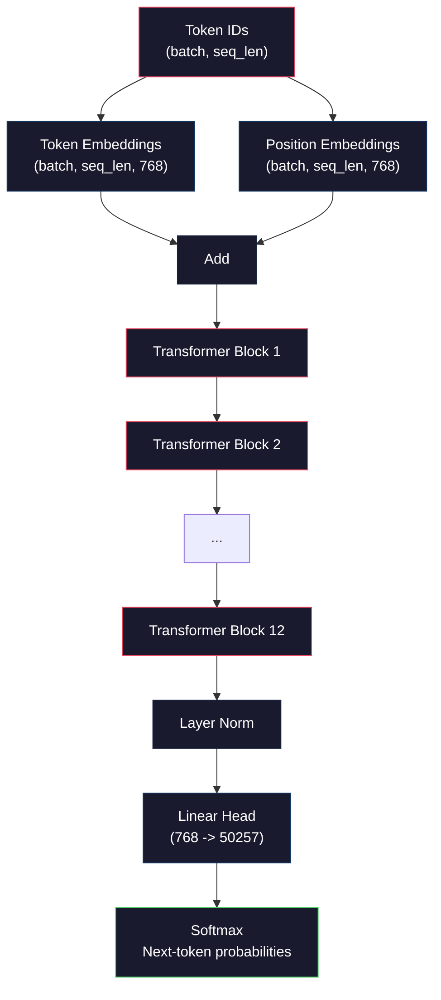
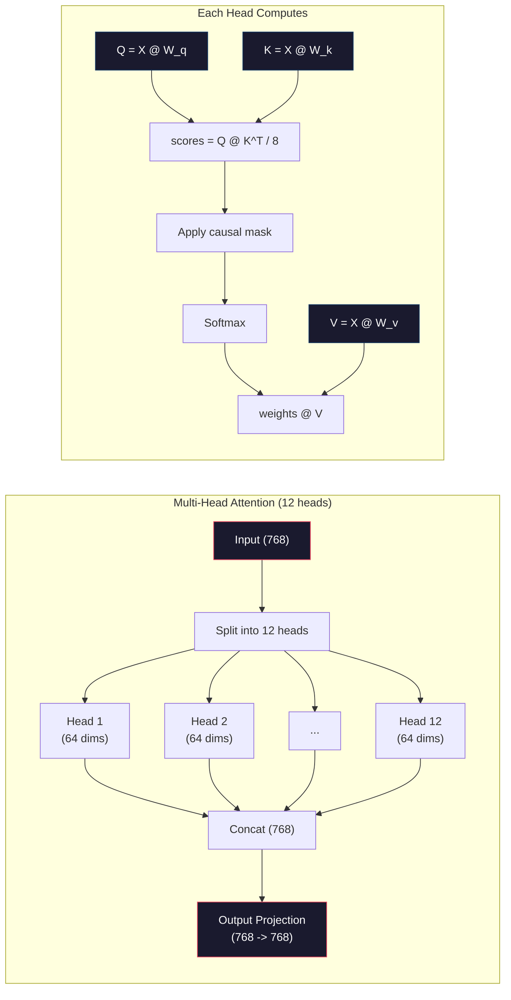
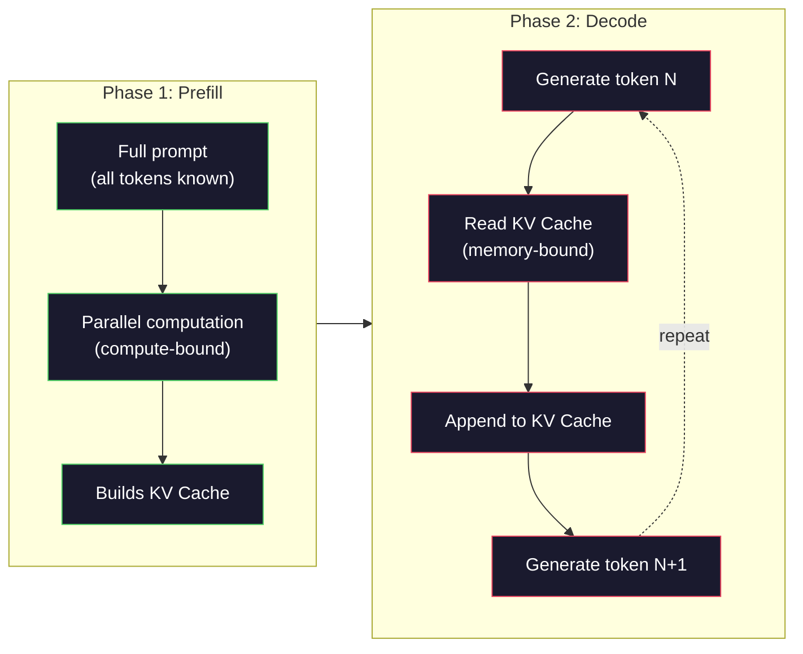

# 从零 Pre-Training 一个 Mini GPT（124M 参数）

> GPT-2 Small 有 1.24 亿个参数。也就是 12 个 Transformer layer、12 个 Attention head，以及 768 维 Embedding。你可以在单块 GPU 上用几个小时从零训练它。大多数人从来不会这样做。他们使用 pre-trained checkpoint。但如果你没有亲自训练过一个，你其实并不理解你正在构建产品所依赖的模型内部发生了什么。

**类型：** Build
**语言：** Python（with numpy）
**前置要求：** Phase 10，Lessons 01-03（Tokenizers、Building a Tokenizer、Data Pipelines）
**时间：** ~120 分钟

## 学习目标
- 从零实现完整的 GPT-2 架构（124M 参数）：Token Embeddings、positional embeddings、Transformer blocks，以及 language model head
- 使用 next-token prediction 和 cross-entropy loss，在文本语料上训练 GPT model
- 实现带 temperature sampling 与 top-k/top-p filtering 的 autoregressive 文本生成
- 监控 training loss curves，并验证模型学到了连贯的语言模式

## 问题
你知道 Transformer 是什么。你看过那些图。你能背出 “attention is all you need”，也能在白板上画出标着 “Multi-Head Attention” 的方框。

这些都不意味着你理解模型生成文本时发生了什么。

GPT-2 Small（with weight tying）有 124,438,272 个参数。每一个参数都是通过运行 training loop 设置出来的：forward pass、计算 loss、backward pass、更新权重。12 个 Transformer blocks。每个 block 12 个 Attention heads。一个 768 维的 Embedding space。一个包含 50,257 个 Token 的 vocabulary。每当模型生成一个 Token 时，全部 1.24 亿个参数都会参与一条 Matrix multiplication chain：它接收一串 Token ID，并输出下一个 Token 的概率分布。

如果你从未亲手构建过这一切，你就在使用一个黑箱。你可以使用 API。你可以 fine-tune。但当出了问题时——当模型 hallucinate、重复自己、拒绝遵循指令时——你没有关于 *为什么* 的 mental model。

本课会从零构建 GPT-2 Small。不是用 PyTorch。用 numpy。每一次 Matrix multiplication 都是可见的。每一个 Gradient 都由你的代码计算。你将准确看到 1.24 亿个数字如何共同作用来预测下一个词。

## 概念
### The GPT Architecture

GPT 是一种 autoregressive language model。“Autoregressive” 的意思是它一次生成一个 Token，每个 Token 都基于前面所有 Token。该架构是一组 Transformer decoder blocks 的堆叠。

下面是从 Token ID 到 next-token probabilities 的完整 computation graph：

1. Token ID 输入。Shape: (batch_size, seq_len)。
2. Token Embedding lookup。每个 ID 映射到一个 768 维 Vector。Shape: (batch_size, seq_len, 768)。
3. Position Embedding lookup。每个 position（0, 1, 2, ...）映射到一个 768 维 Vector。Shape 相同。
4. 将 Token Embeddings + position embeddings 相加。
5. 通过 12 个 Transformer blocks。
6. 最终 layer normalization。
7. Linear projection 到 vocabulary size。Shape: (batch_size, seq_len, vocab_size)。
8. Softmax 得到概率。

这就是整个模型。没有 convolutions。没有 recurrence。只有 embeddings、Attention、feedforward networks 和 layer norms，堆叠 12 次。



### The Transformer Block

12 个 block 中的每一个都遵循同样的模式。Pre-norm 架构（GPT-2 使用 pre-norm，而不是 original transformer 那样的 post-norm）：

1. LayerNorm
2. Multi-Head Self-Attention
3. Residual connection（把 input 加回来）
4. LayerNorm
5. Feed-Forward Network（MLP）
6. Residual connection（把 input 加回来）

Residual connections 至关重要。没有它们，在 Backpropagation 过程中，Gradient 到达 block 1 时会消失。有了它们，Gradient 可以通过 “skip” path 从 Loss 直接流向任意 layer。这就是为什么你可以堆叠 12、32，甚至 96 个 block（GPT-4 传闻使用 120 个）。

### Attention: 核心机制

Self-Attention 让每个 Token 查看前面所有 Token，并决定应该对每一个 Token 关注多少。下面是数学形式。

对每个 Token position，从 input 计算三个 Vector：
- **Query (Q)**：“我在寻找什么？”
- **Key (K)**：“我包含什么？”
- **Value (V)**：“我携带什么信息？”

```
Q = input @ W_q    (768 -> 768)
K = input @ W_k    (768 -> 768)
V = input @ W_v    (768 -> 768)

attention_scores = Q @ K^T / sqrt(d_k)
attention_scores = mask(attention_scores)   # causal mask: -inf for future positions
attention_weights = softmax(attention_scores)
output = attention_weights @ V
```

causal mask 是让 GPT 具备 autoregressive 特性的机制。Position 5 可以 attend to positions 0-5，但不能 attend to 6、7、8，依此类推。这会防止模型在训练时通过查看未来 Token 来“作弊”。

**Multi-head attention** 将 768 维空间拆分成 12 个 head，每个 head 64 维。每个 head 学习一种不同的 Attention pattern。一个 head 可能追踪句法关系（subject-verb agreement）。另一个可能追踪语义相似性（synonyms）。还有一个可能追踪位置邻近性（nearby words）。来自全部 12 个 head 的输出会被 concatenate，并重新 project 回 768 维。



除以 sqrt(d_k)——sqrt(64) = 8——是 scaling。没有它，高维 Vector 的 dot product 会变得很大，把 softmax 推到 Gradient 几乎为零的区域。这是原始 “Attention Is All You Need” paper 中的关键洞见之一。

### KV Cache: 推理为什么快

训练时，你会一次处理整个 sequence。Inference 时，你一次生成一个 Token。如果没有优化，生成 Token N 需要为前面所有 N-1 个 Token 重新计算 Attention。对于每个生成 Token，这是 O(N)，对于长度为 N 的 sequence，总体是 O(N^2) 的 Attention score 计算，并且还会重复执行大量输入侧 Matrix multiplication。

KV Cache 解决了这个问题。为每个 Token 计算出 K 和 V 后，把它们存起来。当生成 Token N+1 时，你只需要为新 Token 计算 Q，并查找所有之前 Token 的 cached K 和 V。这会把 K 和 V 计算的 per-token cost 从 O(N) 降到 O(1)。Attention score calculation 仍然是 O(N)，因为你要 attend to 所有之前的位置，但你避免了对 input 进行冗余 Matrix multiplications。

对于包含 12 layers 和 12 heads 的 GPT-2，KV cache 会为每个 Token 存储 2（K + V）x 12 layers x 12 heads x 64 dims = 18,432 个值。对于 1024-Token sequence，这在 FP32 下大约是 75MB。对于拥有 128 layers 的 Llama 3 405B，单个 sequence 的 KV cache 可能超过 10GB。这就是为什么 long-context inference 受 memory 约束。

### Prefill vs Decode: 推理的两个阶段

当你向 LLM 发送 prompt 时，inference 会分为两个不同阶段。

**Prefill** 会并行处理你的整个 prompt。所有 Token 都已知，所以模型可以同时计算所有 position 的 Attention。这个阶段是 compute-bound——GPU 正在以 full throughput 执行 Matrix multiplications。在 A100 上，一个 1000-Token prompt 的 prefill 大约需要 20-50ms。

**Decode** 会一次生成一个 Token。每个新 Token 都依赖所有之前的 Token。这个阶段是 memory-bound——bottleneck 是从 GPU memory 读取模型权重和 KV cache，而不是 Matrix math 本身。GPU 的 compute cores 大部分时间都在等待 memory reads。对于 GPT-2，每个 decode step 花费的时间几乎与 matmuls 需要多少 FLOPs 无关，因为约束是 memory bandwidth。

这种区别对生产系统很重要。Prefill throughput 随 GPU compute 扩展（更多 FLOPS = 更快 prefill）。Decode throughput 随 memory bandwidth 扩展（更快 memory = 更快 decode）。这就是为什么 NVIDIA 的 H100 相比 A100 重点提升 memory bandwidth——它会直接加速 Token generation。



### The Training Loop

训练 LLM 就是 next-token prediction。给定 Token [0, 1, 2, ..., N-1]，预测 Token [1, 2, 3, ..., N]。Loss Function 是模型预测概率分布与真实 next Token 之间的 cross-entropy。

一个 training step：

1. **Forward pass**：让 batch 通过全部 12 个 block。得到每个 position 的 logits（pre-softmax scores）。
2. **Compute loss**：logits 与 target tokens（input 向后平移一位）之间的 cross-entropy。
3. **Backward pass**：使用 Backpropagation 为全部 124M 参数计算 Gradient。
4. **Optimizer step**：更新权重。GPT-2 使用带 learning rate warmup 和 cosine decay 的 Adam。

learning rate schedule 比你想象的更重要。GPT-2 在前 2,000 steps 中从 0 warm up 到 peak learning rate，然后按 cosine curve 衰减。从很高的 learning rate 开始会导致模型 diverge。保持恒定的高 rate 会导致训练后期 oscillation。warmup-then-decay 模式被每一个主流 LLM 使用。

### GPT-2 Small: The Numbers

| Component | Shape | Parameters |
|-----------|-------|------------|
| Token embeddings | (50257, 768) | 38,597,376 |
| Position embeddings | (1024, 768) | 786,432 |
| Per-block attention (W_q, W_k, W_v, W_out) | 4 x (768, 768) | 2,359,296 |
| Per-block FFN (up + down) | (768, 3072) + (3072, 768) | 4,718,592 |
| Per-block LayerNorms (2x) | 2 x 768 x 2 | 3,072 |
| Final LayerNorm | 768 x 2 | 1,536 |
| **Total per block** | | **7,080,960** |
| **Total (12 blocks)** | | **85,054,464 + 39,383,808 = 124,438,272** |

output projection（logits head）与 Token Embedding Matrix 共享权重。这叫 weight tying——它减少了 38M 参数，并提升性能，因为它迫使模型对 input 和 output 使用同一个 representation space。


```figure
sampling-decoder
```

## 构建它
### 步骤 1： Embedding Layer

Token embeddings 将 50,257 个可能 Token 中的每一个映射到一个 768 维 Vector。Position embeddings 添加关于每个 Token 在 sequence 中位置的信息。两者相加。

```python
import numpy as np

class Embedding:
    def __init__(self, vocab_size, embed_dim, max_seq_len):
        self.token_embed = np.random.randn(vocab_size, embed_dim) * 0.02
        self.pos_embed = np.random.randn(max_seq_len, embed_dim) * 0.02

    def forward(self, token_ids):
        seq_len = token_ids.shape[-1]
        tok_emb = self.token_embed[token_ids]
        pos_emb = self.pos_embed[:seq_len]
        return tok_emb + pos_emb
```

初始化使用 0.02 的 standard deviation，来源于 GPT-2 paper。太大，初始 forward passes 会产生极端值，破坏训练稳定性。太小，初始输出对所有 input 几乎相同，让早期 Gradient signal 失去作用。

### 步骤 2: 带 Causal Mask 的 Self-Attention

先实现 single-head attention。causal mask 会在 softmax 之前把未来 position 设置为 negative infinity，确保每个 position 只能 attend to 自己和更早的 position。

```python
def attention(Q, K, V, mask=None):
    d_k = Q.shape[-1]
    scores = Q @ K.transpose(0, -1, -2 if Q.ndim == 4 else 1) / np.sqrt(d_k)
    if mask is not None:
        scores = scores + mask
    weights = np.exp(scores - scores.max(axis=-1, keepdims=True))
    weights = weights / weights.sum(axis=-1, keepdims=True)
    return weights @ V
```

softmax 实现会在 exponentiating 前减去最大值。否则，exp(large_number) 会 overflow 成 infinity。这是一个数值稳定性技巧，并不会改变输出，因为对于任意常数 c，softmax(x - c) = softmax(x)。

### 步骤 3： Multi-Head Attention

将 768 维 input 拆分成 12 个 head，每个 head 64 维。每个 head 独立计算 Attention。将结果 concatenate，并 project 回 768 维。

```python
class MultiHeadAttention:
    def __init__(self, embed_dim, num_heads):
        self.num_heads = num_heads
        self.head_dim = embed_dim // num_heads
        self.W_q = np.random.randn(embed_dim, embed_dim) * 0.02
        self.W_k = np.random.randn(embed_dim, embed_dim) * 0.02
        self.W_v = np.random.randn(embed_dim, embed_dim) * 0.02
        self.W_out = np.random.randn(embed_dim, embed_dim) * 0.02

    def forward(self, x, mask=None):
        batch, seq_len, d = x.shape
        Q = (x @ self.W_q).reshape(batch, seq_len, self.num_heads, self.head_dim).transpose(0, 2, 1, 3)
        K = (x @ self.W_k).reshape(batch, seq_len, self.num_heads, self.head_dim).transpose(0, 2, 1, 3)
        V = (x @ self.W_v).reshape(batch, seq_len, self.num_heads, self.head_dim).transpose(0, 2, 1, 3)

        scores = Q @ K.transpose(0, 1, 3, 2) / np.sqrt(self.head_dim)
        if mask is not None:
            scores = scores + mask
        weights = np.exp(scores - scores.max(axis=-1, keepdims=True))
        weights = weights / weights.sum(axis=-1, keepdims=True)
        attn_out = weights @ V

        attn_out = attn_out.transpose(0, 2, 1, 3).reshape(batch, seq_len, d)
        return attn_out @ self.W_out
```

reshape-transpose-reshape 这套操作是 multi-head attention 中最容易让人困惑的部分。发生的是：形状为 (batch, seq_len, 768) 的 tensor 变成 (batch, seq_len, 12, 64)，再变成 (batch, 12, seq_len, 64)。现在 12 个 head 中的每一个都有自己的 (seq_len, 64) Matrix 来运行 Attention。Attention 结束后，我们反向执行这个过程：(batch, 12, seq_len, 64) 变成 (batch, seq_len, 12, 64)，再变成 (batch, seq_len, 768)。

### 步骤 4： Transformer Block

一个完整的 Transformer block：LayerNorm、带 residual 的 multi-head attention、LayerNorm、带 residual 的 feedforward。

```python
class LayerNorm:
    def __init__(self, dim, eps=1e-5):
        self.gamma = np.ones(dim)
        self.beta = np.zeros(dim)
        self.eps = eps

    def forward(self, x):
        mean = x.mean(axis=-1, keepdims=True)
        var = x.var(axis=-1, keepdims=True)
        return self.gamma * (x - mean) / np.sqrt(var + self.eps) + self.beta


class FeedForward:
    def __init__(self, embed_dim, ff_dim):
        self.W1 = np.random.randn(embed_dim, ff_dim) * 0.02
        self.b1 = np.zeros(ff_dim)
        self.W2 = np.random.randn(ff_dim, embed_dim) * 0.02
        self.b2 = np.zeros(embed_dim)

    def forward(self, x):
        h = x @ self.W1 + self.b1
        h = np.maximum(0, h)  # GELU approximation: ReLU for simplicity
        return h @ self.W2 + self.b2


class TransformerBlock:
    def __init__(self, embed_dim, num_heads, ff_dim):
        self.ln1 = LayerNorm(embed_dim)
        self.attn = MultiHeadAttention(embed_dim, num_heads)
        self.ln2 = LayerNorm(embed_dim)
        self.ffn = FeedForward(embed_dim, ff_dim)

    def forward(self, x, mask=None):
        x = x + self.attn.forward(self.ln1.forward(x), mask)
        x = x + self.ffn.forward(self.ln2.forward(x))
        return x
```

feedforward network 将 768 维 input 扩展到 3,072 维（4x），应用一个 nonlinearity，然后 project 回 768 维。这种 expansion-contraction pattern 让模型在每个 position 上都有一个“更宽”的 internal representation 可以使用。GPT-2 使用 GELU activation，但这里为了简单使用 ReLU——对理解架构来说差别不大。

### 步骤 5： Full GPT Model

堆叠 12 个 Transformer blocks。在前面加入 Embedding layer，在后面加入 output projection。

```python
class MiniGPT:
    def __init__(self, vocab_size=50257, embed_dim=768, num_heads=12,
                 num_layers=12, max_seq_len=1024, ff_dim=3072):
        self.embedding = Embedding(vocab_size, embed_dim, max_seq_len)
        self.blocks = [
            TransformerBlock(embed_dim, num_heads, ff_dim)
            for _ in range(num_layers)
        ]
        self.ln_f = LayerNorm(embed_dim)
        self.vocab_size = vocab_size
        self.embed_dim = embed_dim

    def forward(self, token_ids):
        seq_len = token_ids.shape[-1]
        mask = np.triu(np.full((seq_len, seq_len), -1e9), k=1)

        x = self.embedding.forward(token_ids)
        for block in self.blocks:
            x = block.forward(x, mask)
        x = self.ln_f.forward(x)

        logits = x @ self.embedding.token_embed.T
        return logits

    def count_parameters(self):
        total = 0
        total += self.embedding.token_embed.size
        total += self.embedding.pos_embed.size
        for block in self.blocks:
            total += block.attn.W_q.size + block.attn.W_k.size
            total += block.attn.W_v.size + block.attn.W_out.size
            total += block.ffn.W1.size + block.ffn.b1.size
            total += block.ffn.W2.size + block.ffn.b2.size
            total += block.ln1.gamma.size + block.ln1.beta.size
            total += block.ln2.gamma.size + block.ln2.beta.size
        total += self.ln_f.gamma.size + self.ln_f.beta.size
        return total
```

注意 weight tying：`logits = x @ self.embedding.token_embed.T`。output projection 复用 Token Embedding Matrix（转置）。这不只是一个节省参数的技巧。它意味着模型用同一个 Vector space 来理解 Token（embeddings）和预测 Token（output）。

### 步骤 6： Training Loop

对于真正的 124M 参数训练，你需要 GPU 和 PyTorch。这个 training loop 在一个可以用纯 numpy 跑起来的小模型上演示机制。我们使用一个 tiny model（4 layers、4 heads、128 dims）来让它可运行。

```python
def cross_entropy_loss(logits, targets):
    batch, seq_len, vocab_size = logits.shape
    logits_flat = logits.reshape(-1, vocab_size)
    targets_flat = targets.reshape(-1)

    max_logits = logits_flat.max(axis=-1, keepdims=True)
    log_softmax = logits_flat - max_logits - np.log(
        np.exp(logits_flat - max_logits).sum(axis=-1, keepdims=True)
    )

    loss = -log_softmax[np.arange(len(targets_flat)), targets_flat].mean()
    return loss


def train_mini_gpt(text, vocab_size=256, embed_dim=128, num_heads=4,
                   num_layers=4, seq_len=64, num_steps=200, lr=3e-4):
    tokens = np.array(list(text.encode("utf-8")[:2048]))
    model = MiniGPT(
        vocab_size=vocab_size, embed_dim=embed_dim, num_heads=num_heads,
        num_layers=num_layers, max_seq_len=seq_len, ff_dim=embed_dim * 4
    )

    print(f"Model parameters: {model.count_parameters():,}")
    print(f"Training tokens: {len(tokens):,}")
    print(f"Config: {num_layers} layers, {num_heads} heads, {embed_dim} dims")
    print()

    for step in range(num_steps):
        start_idx = np.random.randint(0, max(1, len(tokens) - seq_len - 1))
        batch_tokens = tokens[start_idx:start_idx + seq_len + 1]

        input_ids = batch_tokens[:-1].reshape(1, -1)
        target_ids = batch_tokens[1:].reshape(1, -1)

        logits = model.forward(input_ids)
        loss = cross_entropy_loss(logits, target_ids)

        if step % 20 == 0:
            print(f"Step {step:4d} | Loss: {loss:.4f}")

    return model
```

Loss 一开始接近 ln(vocab_size)——对于 256-Token 的 byte-level vocabulary，也就是 ln(256) = 5.55。随机模型会给每个 Token 分配相等概率。随着训练推进，Loss 会下降，因为模型学会预测常见模式：如 “t” 后面的 “th”、句号后的空格，等等。

在生产中，你会使用 Adam Optimizer，配合 Gradient accumulation、learning rate warmup 和 Gradient clipping。forward-pass-loss-backward-update loop 是一样的。只是 Optimizer 更复杂。

### 步骤 7： Text Generation

Generation 使用训练好的模型一次预测一个 Token。每次预测都从输出分布中 sample（或者 greedily 取 argmax）。

```python
def generate(model, prompt_tokens, max_new_tokens=100, temperature=0.8):
    tokens = list(prompt_tokens)
    seq_len = model.embedding.pos_embed.shape[0]

    for _ in range(max_new_tokens):
        context = np.array(tokens[-seq_len:]).reshape(1, -1)
        logits = model.forward(context)
        next_logits = logits[0, -1, :]

        next_logits = next_logits / temperature
        probs = np.exp(next_logits - next_logits.max())
        probs = probs / probs.sum()

        next_token = np.random.choice(len(probs), p=probs)
        tokens.append(next_token)

    return tokens
```

Temperature 控制随机性。Temperature 1.0 使用原始分布。Temperature 0.5 会让分布更尖锐（更确定——模型更经常选择 top choices）。Temperature 1.5 会让分布更平坦（更随机——低概率 Token 获得更大的机会）。Temperature 0.0 是 greedy decoding（总是选择最高概率 Token）。

`tokens[-seq_len:]` 这个 window 是必要的，因为模型有最大 context length（GPT-2 为 1024）。一旦超过它，就必须丢掉最旧的 Token。这就是所有人都在谈论的 “context window”。

## 使用它
### 完整训练与生成 Demo

```python
corpus = """The transformer architecture has revolutionized natural language processing.
Attention mechanisms allow the model to focus on relevant parts of the input.
Self-attention computes relationships between all pairs of positions in a sequence.
Multi-head attention splits the representation into multiple subspaces.
Each attention head can learn different types of relationships.
The feedforward network provides nonlinear transformations at each position.
Residual connections enable gradient flow through deep networks.
Layer normalization stabilizes training by normalizing activations.
Position embeddings give the model information about token ordering.
The causal mask ensures autoregressive generation during training.
Pre-training on large text corpora teaches the model general language understanding.
Fine-tuning adapts the pre-trained model to specific downstream tasks."""

model = train_mini_gpt(corpus, num_steps=200)

prompt = list("The transformer".encode("utf-8"))
output_tokens = generate(model, prompt, max_new_tokens=100, temperature=0.8)
generated_text = bytes(output_tokens).decode("utf-8", errors="replace")
print(f"\nGenerated: {generated_text}")
```

在小语料和小模型上，生成文本最多只能算半连贯。它会从训练文本中学到一些 byte-level pattern，但无法像 GPT-2 那样借助 40GB 训练数据和完整的 124M 参数架构进行 generalize。重点不是输出质量。重点是你可以追踪每一步：Embedding lookup、Attention computation、feedforward transformation、logit projection、softmax 和 sampling。每个 operation 都是可见的。

## 交付它
本课会产出 `outputs/prompt-gpt-architecture-analyzer.md`——一个用于分析任意 GPT-style model 架构选择的 prompt。把 model card 或 technical report 交给它，它会拆解 parameter allocation、Attention design 和 scaling decisions。

## 练习
1. 将模型改为使用 24 layers 和 16 heads，而不是 12/12。统计参数量。加倍 depth 与加倍 width（Embedding dimension）相比有什么差异？

2. 实现 GELU activation function（GELU(x) = x * 0.5 * (1 + erf(x / sqrt(2))))，并替换 feedforward network 中的 ReLU。分别使用两种 activation 训练 500 steps，并比较最终 Loss。

3. 给 generation function 添加 KV cache。在第一次 forward pass 后，存储每一层的 K 和 V tensors，并在后续 Token 中复用它们。测量 speedup：分别在有 cache 和无 cache 的情况下生成 200 个 Token，并比较 wall-clock time。

4. 实现 top-k sampling（只考虑概率最高的 k 个 Token）和 top-p sampling（nucleus sampling：考虑累计概率超过 p 的最小 Token 集合）。在 temperature 0.8 下比较 top-k=50 与 top-p=0.95 的输出质量。

5. 构建一个 training loss curve plotter。训练模型 1000 steps，并绘制 loss vs step。识别三个阶段：快速初始下降（学习常见 bytes）、较慢的中间阶段（学习 byte patterns）以及 plateau（在小语料上 overfitting）。无论你训练的是 128-dim model 还是 GPT-4，这条曲线的形状都是一样的。

## 关键术语
| Term | What people say | What it actually means |
|------|----------------|----------------------|
| Autoregressive | “它一次生成一个词” | 每个输出 Token 都基于所有之前的 Token——模型预测 P(token_n \| token_0, ..., token_{n-1}) |
| Causal mask | “它看不到未来” | 一个由 -infinity 值组成的 upper-triangular Matrix，用于在训练期间阻止 Attention 指向未来 position |
| Multi-head attention | “多种 Attention pattern” | 将 Q、K、V 拆成并行 heads（例如 GPT-2 中 12 个 head，每个 64 dims），让每个 head 学习不同的关系类型 |
| KV Cache | “用于提速的缓存” | 存储来自之前 Token 的已计算 Key 和 Value tensors，以避免 autoregressive generation 期间的冗余计算 |
| Prefill | “处理 prompt” | 第一个 inference 阶段，所有 prompt Token 并行处理——在 GPU FLOPS 上 compute-bound |
| Decode | “生成 Token” | 第二个 inference 阶段，Token 一次生成一个——在 GPU bandwidth 上 memory-bound |
| Weight tying | “共享 embeddings” | 对 input Token embeddings 和 output projection head 使用同一个 Matrix——在 GPT-2 中节省 38M 参数 |
| Residual connection | “Skip connection” | 将 input 直接加到 sublayer 的 output 上（x + sublayer(x)）——支持 deep networks 中的 Gradient flow |
| Layer normalization | “规范化 activations” | 沿 feature dimension 规范化到 mean 0 和 variance 1，并带有可学习的 scale 与 bias 参数 |
| Cross-entropy loss | “预测错得有多离谱” | -log(分配给正确 next Token 的概率)，在所有 position 上取平均——标准 LLM 训练目标 |

## 延伸阅读
- [Radford et al., 2019 -- "Language Models are Unsupervised Multitask Learners" (GPT-2)](https://cdn.openai.com/better-language-models/language_models_are_unsupervised_multitask_learners.pdf) -- 介绍 124M 到 1.5B 参数家族的 GPT-2 paper
- [Vaswani et al., 2017 -- "Attention Is All You Need"](https://arxiv.org/abs/1706.03762) -- 提出 scaled dot-product attention 和 multi-head attention 的原始 Transformer paper
- [Llama 3 Technical Report](https://arxiv.org/abs/2407.21783) -- Meta 如何使用 16K GPUs 将 GPT architecture 扩展到 405B 参数
- [Pope et al., 2022 -- "Efficiently Scaling Transformer Inference"](https://arxiv.org/abs/2211.05102) -- 将 prefill vs decode 与 KV cache analysis 形式化的 paper
