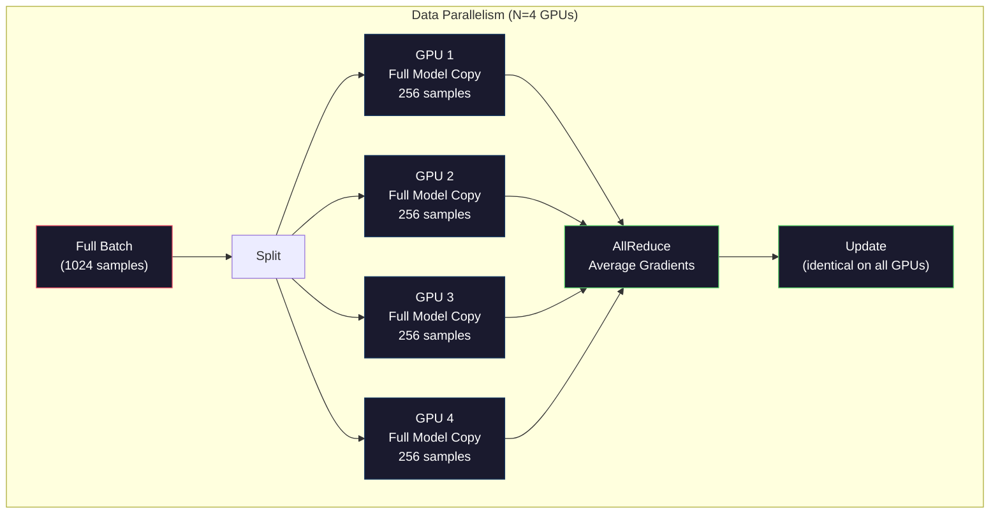
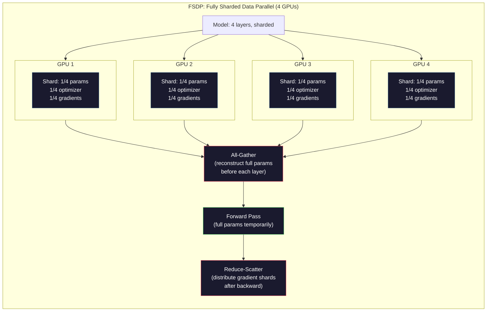
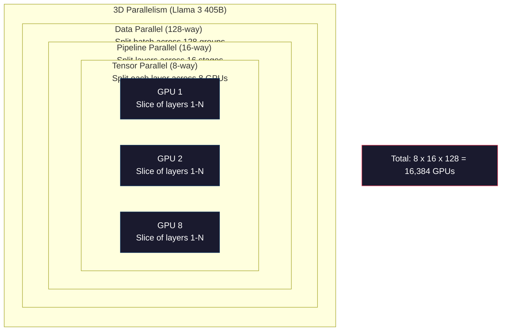

# Scaling：Distributed Training、FSDP、DeepSpeed

> 你的 124M 模型已经在一块 GPU 上训练完成。现在试试 70 亿参数。模型放不进显存。数据在单机上需要训练数周。规模上来之后，Distributed Training 不是可选项，而是唯一可行的路径。

**Type:** Build
**Languages:** Python
**Prerequisites:** Phase 10, Lesson 04 (Pre-Training a Mini GPT)
**Time:** ~120 minutes

## 学习目标
- 解释三种 Parallelism（Data、Tensor、Pipeline），以及根据模型规模和集群规模判断何时需要使用它们
- 使用 PyTorch DDP 实现 Data Parallel training，并在多块 GPU 之间同步 Gradient
- 计算给定模型规模的显存预算（weights + optimizer states + gradients + activations），以确定最低硬件需求
- 配置 FSDP 或 DeepSpeed ZeRO stages，将模型状态切分到多块 GPU 上，从而容纳超过单卡显存的模型

## 问题
一个 7B 参数模型使用 FP16 时，仅 weights 就需要 14GB。Adam optimizer 会为每个参数额外存储两份副本（first moment 和 second moment estimates）。这又需要 28GB。Backpropagation 期间的 Gradients 再增加 14GB。还没存储任何 activation，你已经用掉了 56GB。

一块 NVIDIA A100 有 80GB 显存。

80GB 中已经消耗 56GB。只剩 24GB 给 activations，也就是 forward pass 期间计算出的中间值，它们必须保留到 Backpropagation 使用。对于 2048-token sequence 和 4096-dimensional model，单层 activations 大约使用 64MB。32 层就需要每个样本 2GB。batch size 为 8 时需要 16GB。你有 24GB。batch size 为 12 就会爆显存。

现在试试 70B 参数。仅 weights：FP16 下 140GB。单块 GPU 放不下。你至少需要 2 块 A100（2 x 80GB = 160GB）才能只放下 weights。加上 optimizer states 和 gradients，需要的 GPU 远不止这些：最低 3+ 块，实际通常取决于 sharding strategy，需要 8-16 块。

Llama 3 405B 使用 16,384 块 NVIDIA H100 GPUs 训练。该训练运行估计花费约 1 亿美元 compute 成本。DeepSeek V3 通过更巧妙的 architecture（Mixture of Experts 意味着每个 token 只激活一小部分参数）和训练效率，以约 560 万美元训练了一个可比模型。

本课介绍让大规模训练成为可能的四种策略：Data Parallelism、Tensor Parallelism、Pipeline Parallelism 和 Fully Sharded Data Parallelism。你将先用纯 Python 模拟每一种策略，理解其机制，然后再接触 Distributed Training framework。

## 概念
### 为什么需要分布式

下面是真实模型的显存计算。每个数字都是计算得出的，不是估算。

| Model | Params | Weights (FP16) | Adam States | Gradients (FP16) | Total (no activations) |
|-------|--------|----------------|-------------|------------------|----------------------|
| GPT-2 Small | 124M | 248 MB | 992 MB | 248 MB | 1.5 GB |
| Llama 3 8B | 8B | 16 GB | 64 GB | 16 GB | 96 GB |
| Llama 3 70B | 70B | 140 GB | 560 GB | 140 GB | 840 GB |
| Llama 3 405B | 405B | 810 GB | 3,240 GB | 810 GB | 4,860 GB |

“Adam States” 这一列才是真正的显存杀手。Adam 会为每个参数存储 running mean (m) 和 running variance (v)，两者都是 FP32。对于 70B 模型，这就是 70B x 4 bytes x 2 = 560GB。仅 optimizer 就需要七块 A100。

单块 H100 有 80GB。Llama 3 405B 至少需要 61 块 H100 才能容纳 weights、optimizer 和 gradients。加上 activations，数量还会继续增加。Meta 使用 16,384 块 GPU 不是因为他们想这样，而是因为他们必须这样。

### Data Parallelism

最简单的 Distributed strategy。把完整模型复制到 N 块 GPU。把每个 training batch 拆成 N 个相等部分。每块 GPU 在自己的 data shard 上运行 forward 和 backward pass。backward pass 之后，在所有 GPU 之间平均 gradients。每块 GPU 用相同的 averaged gradients 更新自己的 weights 副本，从而保持所有副本同步。

**优点：** Throughput 近似线性扩展。N 块 GPU 每 step 处理 N 倍数据。通信仅限于 gradient averaging，并且可以与计算重叠。

**缺点：** 每块 GPU 都持有完整的模型、optimizer states 和 gradients。对于 70B 模型，每块 GPU 都需要 840GB。Data parallelism 不会降低单块 GPU 的显存占用。它只会缩短训练时间。

**计算：** Effective batch size = per_gpu_batch_size x N。对于 N=64 块 GPU 且 per-GPU batch 为 16，effective batch 为 1,024。Llama 3 使用的 effective batch size 是每 step 1600 万 tokens。



### Tensor Parallelism

把单个 layer 拆到多块 GPU 上。一次 Matrix multiplication 被分割到多块 GPU，每块 GPU 计算结果的一部分。

考虑 feedforward layer 中一个 shape 为 (8192, 8192) 的 weight matrix。使用 4-way tensor parallelism 时，每块 GPU 持有一个 (8192, 2048) shard。每块 GPU 用输入乘以自己的 shard，生成一个 partial result。partial results 会被组合（通过 all-reduce 或 all-gather）生成完整输出。

**优点：** 降低每块 GPU 上的 model weights 显存占用。一个 70B 模型拆到 8 块 GPU 上，意味着每块 GPU 持有约 8.75B 参数规模的 weights。

**缺点：** 每一层之后都需要高速 GPU 间通信。每次 matmul 后的 all-reduce 会增加 latency。这在 NVLink（同一节点内 GPU 间 900 GB/s）上效果很好，但在通过 InfiniBand（400 Gb/s，约 50 GB/s）连接的节点之间效果较差。Tensor parallelism 几乎总是限制在单个节点内（8 块 GPU）。

**真实用法：** Megatron-LM 开创了 tensor parallelism。Llama 3 405B 在每个节点内使用 8-way tensor parallelism。

### Pipeline Parallelism

按 layers 拆分模型。GPU 1 运行 layers 1-8。GPU 2 运行 layers 9-16。GPU 3 运行 layers 17-24。GPU 4 运行 layers 25-32。数据流经 pipeline：GPU 1 计算自己的 layers 并把 activations 发送给 GPU 2，GPU 2 计算自己的 layers 后发送给 GPU 3，依此类推。

**优点：** GPU 间通信极少，只传 layer 边界处的 activations；相比 gradients 或 weights，这些数据很小。因为带宽需求低，所以可以跨节点工作。

**缺点：** Pipeline bubbles。当 GPU 4 正在计算 micro-batch 1 的 forward pass 时，GPU 1、2、3 都处于空闲状态（它们已经完成了自己的 forward 部分）。backward pass 期间，模式反过来。使用 naive pipelining 时，N 个 pipeline stages 的 GPU utilization 只有 1/N。

**GPipe and PipeDream** 通过把 batch 拆成 micro-batches 来解决 bubble 问题。GPU 1 一完成 micro-batch 1 的 forward，就开始处理 micro-batch 2。这让不同 pipeline stages 的计算发生重叠。使用 M 个 micro-batches 和 N 个 stages 时，bubble fraction 降为 (N-1)/M。N=4 stages、M=16 micro-batches 时，bubble 为 3/16 = 18.75% idle time。

### FSDP: Fully Sharded Data Parallel

FSDP 结合了 data parallelism 的可扩展性和 sharding 的显存效率。每块 GPU 不再持有完整模型副本，而是只持有 1/N 的 parameters、gradients 和 optimizer states。

在某一 layer 的 forward pass 之前，FSDP 会运行 **all-gather**，把所有 GPU 上的完整 parameters 收集到每块 GPU 的显存中。forward pass 之后，每块 GPU 丢弃非本地 parameters。backward 期间，all-gather 再次运行，以重建用于 gradient computation 的 parameters。backward pass 之后，**reduce-scatter** 分发 gradient shards，让每块 GPU 只存储 1/N 的 gradients。

**70B 模型在 8 块 GPU 上的计算：**

| Component | Without FSDP | With FSDP |
|-----------|-------------|-----------|
| Weights (FP16) | 140 GB per GPU | 17.5 GB per GPU |
| Adam States (FP32) | 560 GB per GPU | 70 GB per GPU |
| Gradients (FP16) | 140 GB per GPU | 17.5 GB per GPU |
| **Total** | **840 GB per GPU** | **105 GB per GPU** |

没有 FSDP 时，你无法把 70B 模型放进单块 80GB GPU。使用 8 块 GPU 的 FSDP 后，每块 GPU 使用 105GB，等等，这仍然放不下。你至少需要 16 块 GPU 才能让每块 GPU 低于 80GB，或者把 FSDP 与 activation checkpointing 结合使用（backward 期间重新计算 activations，而不是存储它们）。

通信成本高于 vanilla data parallelism，因为每一层之前都需要 all-gather。但显存节省使此前不可能的训练运行变得可行。



### DeepSpeed ZeRO

DeepSpeed 的 ZeRO（Zero Redundancy Optimizer）在概念上与 FSDP 相同，但由 Microsoft 独立开发。它定义了三个 stages，每个 stage 的 sharding 更激进：

| Stage | Shards | Memory Savings | Communication |
|-------|--------|---------------|---------------|
| ZeRO-1 | 仅 Optimizer states | ~4x reduction | 与 data parallel 相同 |
| ZeRO-2 | + Gradients | ~8x reduction | 略多 |
| ZeRO-3 | + Parameters | ~Nx reduction (N GPUs) | 每层 All-gather |

ZeRO-3 等价于 FSDP。命名不同，机制相同。DeepSpeed 证明这个概念后，PyTorch 添加了 FSDP 作为原生实现。

DeepSpeed 还引入了 ZeRO-Offload（把 optimizer states offload 到 CPU RAM，CPU RAM 更便宜且容量更大）和 ZeRO-Infinity（offload 到 NVMe SSDs）。这些方案用计算速度换取显存容量：offloaded operations 更慢，但能释放 GPU 显存。

### Mixed Precision Training

现代训练会同时使用多种 floating-point formats：

- **Forward pass**：FP16 或 BF16（16-bit）。显存是 FP32 的一半。Matmuls 在 tensor cores 上运行速度快 2 倍。
- **Master weights**：FP32（32-bit）。由 optimizer 维护，用于在 weight updates 期间保持数值精度。
- **Loss scaling**：在 backward pass 前将 loss 乘以一个大常数，以防止 FP16 gradients 下溢为零。optimizer step 前再除以相同常数。

BF16（Brain Float 16）具有与 FP32 相同的 exponent range（8 exponent bits），但精度更低（7 mantissa bits，而 FP32 是 23）。它很少需要 loss scaling，因为它能表示相同范围的数值。FP16 有 5 exponent bits 和 10 mantissa bits，可以表示更细粒度的数值，但在极端量级下会 overflow/underflow。

Google 的 TPUs 原生使用 BF16。NVIDIA 的 A100 和 H100 同时支持 FP16 和 BF16。行业基本已经转向 BF16，因为它消除了 loss scaling 带来的麻烦。

**7B 模型的显存对比：**

| Precision | Weights | Optimizer | Gradients | Total |
|-----------|---------|-----------|-----------|-------|
| FP32 everywhere | 28 GB | 56 GB | 28 GB | 112 GB |
| Mixed (BF16 + FP32 master) | 14 GB | 56 GB | 14 GB | 84 GB |

在这个模型上，mixed precision 节省 28GB。optimizer states 仍然保持 FP32，这也是大部分显存消耗所在。

### Megatron-LM 与 3D Parallelism

真实的大规模训练会结合全部三种 parallelism：

- **Data parallelism** 跨节点组（扩展 batch size）
- **Tensor parallelism** 在节点内（把 layers 拆到 8 块 GPU）
- **Pipeline parallelism** 跨节点（把 layer groups 拆到多台机器）

Llama 3 405B 在 16,384 块 H100 上：
- 每个节点内 8-way tensor parallelism（每节点 8 块 GPU）
- 跨节点 16-way pipeline parallelism（16 个 pipeline stages）
- 剩余维度上 128-way data parallelism（16,384 / 8 / 16 = 128）

这个 3D decomposition（8 x 16 x 128 = 16,384）就是扩展到数千块 GPU 的方法。每块 GPU 看到不同的 data shard（data parallel），持有每层的一个 slice（tensor parallel），并计算不同的一组 layers（pipeline parallel）。

DeepSeek V3 采用了不同方法。它们的 Mixture of Experts architecture 在每个 token 上只激活 671B 参数中的 37B。这意味着每块 GPU 只需要计算（并为其存储 activations）active parameters。它们在 2,048 块 H800 GPU 上完成训练，GPU 数量不到 Meta 的 1/8，成本为 560 万美元，而 Meta 估计约 1 亿美元。



## 构建它
### 步骤 1： Simulate Data Parallelism

把一个 batch 拆到模拟的 GPU 上。每块 GPU 在自己的 shard 上计算 forward pass。平均“gradients”（这里我们把 loss values 模拟为 gradients）。

```python
import numpy as np

def simulate_data_parallelism(data, num_gpus, model_fn):
    batch_size = len(data)
    shard_size = batch_size // num_gpus
    remainder = batch_size % num_gpus

    gpu_losses = []
    gpu_gradients = []

    offset = 0
    for gpu_id in range(num_gpus):
        extra = 1 if gpu_id < remainder else 0
        shard = data[offset:offset + shard_size + extra]
        offset += shard_size + extra

        loss, grad = model_fn(shard)
        gpu_losses.append(loss)
        gpu_gradients.append(grad)

    avg_loss = np.mean(gpu_losses)
    avg_gradient = np.mean(gpu_gradients, axis=0)

    return avg_loss, avg_gradient
```

all-reduce operation（averaging gradients）是 data parallelism 中唯一的通信。在实践中，NVIDIA GPU 上会使用 NCCL library，它实现了 ring all-reduce：每块 GPU 把自己 gradients 的 1/N 发送给相邻 GPU，从另一侧相邻 GPU 接收 1/N，经过 N-1 步后，每块 GPU 都拥有完整 average。总通信量：2 x gradient_size x (N-1)/N，当 N 很大时接近 gradient size 的 2 倍。

### 步骤 2： Simulate Tensor Parallelism

把 weight matrix 拆到多块 GPU 上。每块 GPU 计算部分 Matrix multiplication。组合结果。

```python
def simulate_tensor_parallelism(input_data, weight_matrix, num_gpus):
    d_in, d_out = weight_matrix.shape
    assert d_out % num_gpus == 0, f"d_out {d_out} not divisible by num_gpus {num_gpus}"
    shard_size = d_out // num_gpus

    partial_results = []
    for gpu_id in range(num_gpus):
        start = gpu_id * shard_size
        end = start + shard_size
        weight_shard = weight_matrix[:, start:end]

        partial = input_data @ weight_shard
        partial_results.append(partial)

    full_output = np.concatenate(partial_results, axis=-1)

    direct_output = input_data @ weight_matrix
    error = np.abs(full_output - direct_output).max()

    return full_output, error
```

error 应该严格为零（或 machine epsilon）。Tensor parallelism 在数学上是精确的，它产生的结果与在一块 GPU 上计算完整 matmul 相同。切分沿 output dimension 进行，因此每块 GPU 生成不同的 columns chunk，concatenation 会重建完整结果。

对于 column-parallel linear layers（切分 output dimension），你执行 concatenate。对于 row-parallel（切分 input dimension），你执行 sum。在 transformer FFN 中，第一个 linear（expand）使用 column-parallel，第二个 linear（contract）使用 row-parallel。这样可以避免两个 layers 之间的一次 all-reduce。

### 步骤 3： Simulate Pipeline Parallelism

把模型 layers 拆到虚拟 GPU 上。展示 bubble problem：早期 stages 会在后续 stages 计算时处于空闲。

```python
def simulate_pipeline_parallelism(num_layers, num_stages, num_microbatches):
    layers_per_stage = num_layers // num_stages

    timeline = {}
    clock = 0

    for mb in range(num_microbatches):
        for stage in range(num_stages):
            start_time = max(
                timeline.get((stage, mb - 1, "fwd"), (0, 0))[1] if mb > 0 else 0,
                timeline.get((stage - 1, mb, "fwd"), (0, 0))[1] if stage > 0 else 0,
            )
            end_time = start_time + layers_per_stage
            timeline[(stage, mb, "fwd")] = (start_time, end_time)

    last_fwd_end = max(v[1] for v in timeline.values())

    for mb in range(num_microbatches - 1, -1, -1):
        for stage in range(num_stages - 1, -1, -1):
            deps = [last_fwd_end]
            if mb < num_microbatches - 1 and (stage, mb + 1, "bwd") in timeline:
                deps.append(timeline[(stage, mb + 1, "bwd")][1])
            if stage < num_stages - 1 and (stage + 1, mb, "bwd") in timeline:
                deps.append(timeline[(stage + 1, mb, "bwd")][1])
            start_time = max(deps)
            end_time = start_time + layers_per_stage
            timeline[(stage, mb, "bwd")] = (start_time, end_time)

    total_time = max(v[1] for v in timeline.values())
    compute_time = num_microbatches * num_stages * layers_per_stage * 2
    bubble_fraction = 1.0 - compute_time / (total_time * num_stages)

    return timeline, total_time, bubble_fraction
```

使用 4 个 stages 和 1 个 micro-batch 时，bubble fraction 是 75%，也就是任意时刻四块 GPU 中有三块空闲。使用 16 个 micro-batches 时，它会降到约 19%。消除 bubbles 的代价是显存：你必须同时存储所有 in-flight micro-batches 的 activations。

### 步骤 4： Memory Calculator

计算任意模型规模训练时的精确显存需求。

```python
def memory_calculator(
    params_billions,
    precision_bytes=2,
    optimizer="adam",
    num_gpus=1,
    sharding="none",
    sequence_length=2048,
    batch_size_per_gpu=1,
    hidden_dim=None,
    num_layers=None,
):
    params = params_billions * 1e9

    weight_memory = params * precision_bytes

    if optimizer == "adam":
        optimizer_memory = params * 4 * 2
    elif optimizer == "sgd":
        optimizer_memory = params * 4
    else:
        optimizer_memory = 0

    gradient_memory = params * precision_bytes

    total_no_activation = weight_memory + optimizer_memory + gradient_memory

    if hidden_dim and num_layers:
        activation_per_layer = (
            sequence_length * batch_size_per_gpu * hidden_dim * precision_bytes * 4
        )
        activation_memory = activation_per_layer * num_layers
    else:
        activation_memory = params * precision_bytes * 0.5

    if sharding == "fsdp" or sharding == "zero3":
        weight_memory /= num_gpus
        optimizer_memory /= num_gpus
        gradient_memory /= num_gpus
    elif sharding == "zero2":
        optimizer_memory /= num_gpus
        gradient_memory /= num_gpus
    elif sharding == "zero1":
        optimizer_memory /= num_gpus

    per_gpu_total = weight_memory + optimizer_memory + gradient_memory + activation_memory

    return {
        "params_billions": params_billions,
        "weights_gb": weight_memory / 1e9,
        "optimizer_gb": optimizer_memory / 1e9,
        "gradients_gb": gradient_memory / 1e9,
        "activations_gb": activation_memory / 1e9,
        "per_gpu_total_gb": per_gpu_total / 1e9,
        "total_across_gpus_gb": per_gpu_total * num_gpus / 1e9,
        "fits_on_80gb": per_gpu_total / 1e9 <= 80,
        "num_gpus": num_gpus,
        "sharding": sharding,
    }
```

这个 calculator 回答了每个 ML engineer 都会问的问题：“我需要多少块 GPU？”输入 model size，看看是否放得下。调整 sharding strategy，直到 per-GPU total 低于 80GB。

### 步骤 5： Mixed Precision Simulation

比较 FP32、FP16 和 mixed precision training 的显存使用。

```python
def mixed_precision_comparison(params_billions):
    params = params_billions * 1e9

    fp32_weights = params * 4
    fp32_optimizer = params * 4 * 2
    fp32_gradients = params * 4
    fp32_total = fp32_weights + fp32_optimizer + fp32_gradients

    fp16_weights = params * 2
    fp16_master = params * 4
    fp16_optimizer = params * 4 * 2
    fp16_gradients = params * 2
    fp16_total = fp16_weights + fp16_master + fp16_optimizer + fp16_gradients

    mixed_weights = params * 2
    mixed_optimizer = params * 4 * 2
    mixed_gradients = params * 2
    mixed_total = mixed_weights + mixed_optimizer + mixed_gradients

    return {
        "fp32_total_gb": fp32_total / 1e9,
        "fp16_with_master_gb": fp16_total / 1e9,
        "mixed_bf16_gb": mixed_total / 1e9,
        "savings_vs_fp32": 1 - mixed_total / fp32_total,
    }
```

对大多数人来说，最大的意外是：mixed precision 不会把显存减半。optimizer states（Adam 的 m 和 v）无论 precision 如何都保持 FP32。对于 7B 模型，FP32 training 使用 112GB。mixed precision 使用 84GB。这是 25% reduction，而不是 50%。optimizer 占主导。

## 使用它
### Run All Simulations

```python
def run_all_demos():
    print("=" * 70)
    print("DATA PARALLELISM SIMULATION")
    print("=" * 70)

    np.random.seed(42)
    data = np.random.randn(64, 32)
    weight = np.random.randn(32, 16)

    def model_fn(batch):
        output = batch @ weight
        loss = np.mean(output ** 2)
        grad = 2 * batch.T @ (batch @ weight) / len(batch)
        return loss, grad

    for n_gpus in [1, 2, 4, 8]:
        loss, grad = simulate_data_parallelism(data, n_gpus, model_fn)
        print(f"  {n_gpus} GPUs: loss={loss:.4f}, grad_norm={np.linalg.norm(grad):.4f}")

    print()
    print("=" * 70)
    print("TENSOR PARALLELISM SIMULATION")
    print("=" * 70)

    x = np.random.randn(4, 8192)
    W = np.random.randn(8192, 8192)

    for n_gpus in [1, 2, 4, 8]:
        output, error = simulate_tensor_parallelism(x, W, n_gpus)
        print(f"  {n_gpus} GPUs: output_shape={output.shape}, max_error={error:.2e}")

    print()
    print("=" * 70)
    print("PIPELINE PARALLELISM SIMULATION")
    print("=" * 70)

    for n_mb in [1, 4, 8, 16, 32]:
        _, total_t, bubble = simulate_pipeline_parallelism(32, 4, n_mb)
        print(f"  {n_mb:2d} micro-batches: total_time={total_t:4d}, bubble={bubble:.1%}")

    print()
    print("=" * 70)
    print("MEMORY CALCULATOR")
    print("=" * 70)

    configs = [
        (7, "none", 1),
        (7, "fsdp", 8),
        (70, "none", 1),
        (70, "fsdp", 8),
        (70, "fsdp", 16),
        (405, "fsdp", 64),
        (405, "fsdp", 128),
    ]

    print(f"  {'Model':>8} {'Sharding':>8} {'GPUs':>5} {'Per-GPU':>10} {'Fits 80GB':>10}")
    print("  " + "-" * 50)
    for params, shard, gpus in configs:
        result = memory_calculator(params, num_gpus=gpus, sharding=shard)
        fits = "Yes" if result["fits_on_80gb"] else "No"
        print(f"  {params:>6}B {shard:>8} {gpus:>5} {result['per_gpu_total_gb']:>8.1f}GB {fits:>10}")

    print()
    print("=" * 70)
    print("MIXED PRECISION COMPARISON")
    print("=" * 70)

    for params_b in [7, 13, 70, 405]:
        result = mixed_precision_comparison(params_b)
        print(f"  {params_b}B: FP32={result['fp32_total_gb']:.0f}GB, "
              f"Mixed BF16={result['mixed_bf16_gb']:.0f}GB, "
              f"Savings={result['savings_vs_fp32']:.0%}")
```

## 交付它
本课会产出 `outputs/prompt-distributed-training-planner.md`：一个 prompt，它接收 model size 和 available hardware，然后生成完整的 distributed training plan：parallelism strategy、memory budget、communication overhead 和 expected throughput。

## 练习
1. 修改 memory calculator，加入 activation checkpointing。使用 checkpointing 时，只在每第 K 层存储 activations（典型 K=1，表示全部重算）。展示 memory-compute tradeoff：checkpointing 能节省多少显存，以及会让训练变慢多少（full checkpointing 大约增加 33% compute）？

2. 扩展 pipeline parallelism simulation，实现 PipeDream 使用的 1F1B（one forward, one backward）schedule。对 4 stages 和 8 micro-batches，比较它与 naive schedule 的 bubble fraction。1F1B schedule 应该具有更低的 peak memory，因为它更早开始 backward passes。

3. 实现一个 gradient accumulation simulator。不要在每个 micro-batch 后都 all-reduce，而是在本地累积 K 步 gradients，然后再 all-reduce。展示这如何把通信减少 K 倍，同时产生完全相同的 final gradients（因此训练也完全相同）。

4. 构建一个 cost estimator。给定 model size、target token count、GPU type（A100 at $2/hr，H100 at $3.50/hr）和 parallelism strategy，估计总训练成本（美元）。用已知成本验证：Llama 3 405B 据称成本约 $100M，DeepSeek V3 成本约 $5.6M。

5. 在 memory calculator 中加入 ZeRO-Offload。假设每个节点有 512GB CPU RAM 和 2TB NVMe。展示把 optimizer states offload 到 CPU 后，如何让 70B 模型从需要 16 块 GPU 变成可在 4 块 GPU 上训练，代价是 optimizer steps 变慢 30-50%。

## 关键术语
| Term | What people say | What it actually means |
|------|----------------|----------------------|
| Data parallelism | “把模型复制到每块 GPU” | 每块 GPU 处理不同的 data shard；每一步之后通过 all-reduce 平均 gradients |
| Tensor parallelism | “把一层拆到多块 GPU 上” | 切分 weight matrices，让每块 GPU 计算 matmul 的一部分；需要高速 NVLink interconnect |
| Pipeline parallelism | “把 layers 拆到多块 GPU 上” | 每块 GPU 运行不同的一组 layers；数据通过 pipeline 流动，并使用 micro-batches 减少 bubbles |
| FSDP | “Shard everything” | Fully Sharded Data Parallel：每块 GPU 持有 1/N 的 weights、gradients 和 optimizer states；计算前执行 all-gather |
| ZeRO | “DeepSpeed 版本的 FSDP” | Zero Redundancy Optimizer，包含 3 个 stages：shard optimizer（Stage 1）、+ gradients（Stage 2）、+ parameters（Stage 3） |
| All-reduce | “在 GPU 之间求平均” | collective operation，让每块 GPU 最终都拥有所有 GPU 输入的 sum（或 average），通常实现为 ring all-reduce |
| All-gather | “从所有 GPU 收集” | collective operation，让每块 GPU 最终都拥有所有 GPU 数据的 concatenation；FSDP 中用于重建完整 parameters |
| Reduce-scatter | “求和并分发” | collective operation，对数据进行 reduce（sum）并把不同 chunks scatter 到不同 GPU；FSDP 中用于 gradient sharding |
| Mixed precision | “用 half precision 训练” | forward/backward 使用 FP16/BF16，optimizer states 使用 FP32；节省约 25% 显存，而不是 50%，因为 optimizer 占主导 |
| Pipeline bubble | “pipeline 中的 idle time” | GPU 等待上一 stage 数据时处于空闲的时间比例；可通过使用更多 micro-batches 降低 |

## 延伸阅读
- [Rajbhandari et al., 2020 -- "ZeRO: Memory Optimizations Toward Training Trillion Parameter Models"](https://arxiv.org/abs/1910.02054) -- 定义三个 sharding stages 的 DeepSpeed ZeRO paper
- [Shoeybi et al., 2020 -- "Megatron-LM: Training Multi-Billion Parameter Language Models Using Model Parallelism"](https://arxiv.org/abs/1909.08053) -- NVIDIA 面向 transformers 的 tensor parallelism
- [Narayanan et al., 2021 -- "Efficient Large-Scale Language Model Training on GPU Clusters Using Megatron-LM"](https://arxiv.org/abs/2104.04473) -- 结合 data、tensor 和 pipeline 的 3D parallelism
- [Zhao et al., 2023 -- "PyTorch FSDP: Experiences on Scaling Fully Sharded Data Parallel"](https://arxiv.org/abs/2304.11277) -- PyTorch 的原生 FSDP 实现
- [Llama 3 Technical Report](https://arxiv.org/abs/2407.21783) -- 16,384 GPU training 的 3D parallelism 细节
- [DeepSeek-V3 Technical Report](https://arxiv.org/abs/2412.19437) -- MoE architecture 如何将训练成本降低一个数量级
