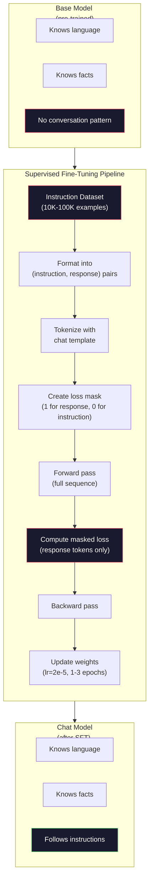

# Instruction Tuning (SFT)

> base model 会预测下一个 Token。仅此而已。它不会遵循指令、回答问题，也不会拒绝有害请求。SFT 是 Token 预测器与有用 assistant 之间的桥梁。你曾经对话过的每一个 model -- Claude、GPT、Llama Chat -- 都经历过这一步。

**类型：** Build
**语言：** Python (with numpy)
**前置要求：** Phase 10, Lesson 04 (Pre-Training a Mini GPT)
**时间：** ~90 分钟

## 学习目标

- 实现 supervised fine-tuning (SFT)，将 base language model 转换为遵循指令的 assistant
- 使用包含 system、user 和 assistant 角色的 chat templates 格式化训练数据，并对非 assistant Token 屏蔽 Loss
- 解释为什么 SFT 是必要的：base models 会继续文本，而不是回答问题
- 通过在保留的 instruction set 上比较 base model 与 fine-tuned model 的回复，评估 SFT 质量

## 问题

你在 Lesson 04 中训练了一个 model。给定一个序列，它可以预测下一个 Token。向它输入 "The transformer architecture"，它可能会接着输出 "has revolutionized natural language processing." 对一个 next-token predictor 来说，这很厉害。

现在试试这个：向它输入 "What is the capital of France?" base model 不会回答 "Paris." 它会继续这个模式。它可能生成 "What is the capital of Germany? What is the capital of Spain?"，因为它从包含问题列表的文档中学到了这种模式。或者它可能生成 "is a question that many people ask"，因为这是一个合理的 next-token continuation。这个 model 没有*回答*的概念。它只知道*继续*。

这就是 GPT-3（base model，2020 年 6 月发布）和 ChatGPT（instruction-tuned，2022 年 11 月发布）之间的差距。相同的 architecture。相同的 pre-training。差异在于 20,000 到 100,000 个精心构造的 (instruction, response) 对，它们教会了 model 遵循对话模式。

Stanford Alpaca 证明你不需要数百万个示例。2023 年 3 月，他们只用 GPT-3.5 生成的 52,000 个 instruction-response 对对 Llama 7B 进行了 fine-tuning。总成本：600 美元。结果是一个能够遵循指令、回答问题并进行对话的 chatbot。它不如 ChatGPT，但以 600 美元和几小时训练的成本来看，已经接近得惊人。

Meta 的 Llama 2 Chat 在初始 SFT 阶段只使用了约 27,000 个高质量示例。关键洞见是：质量比数量更重要。由熟练标注员编写的 27,000 个示例胜过从互联网抓取的 100 万个噪声示例。

## 概念

### SFT 实际做了什么

Supervised Fine-Tuning 延续了 pre-training 中相同的训练循环 -- forward pass、compute loss、backward pass、update weights -- 但使用的是另一类数据。你训练的不是原始文本，而是结构化对话：

```json
{
  "system": "You are a helpful assistant.",
  "user": "What is the capital of France?",
  "assistant": "The capital of France is Paris."
}
```

model 已经知道 Paris 是 France 的首都。它在 Wikipedia、教材和网页上的 pre-training 中学到了这一点。SFT 并不是教 model 新事实。它教给 model 一种新的*行为*：当你看到问题时，生成回答。当你看到指令时，生成补全。当你看到有害请求时，生成拒绝。

可以这样理解。Pre-training 给 model 知识。SFT 给 model 礼仪。

### 数据格式

行业中主要有三种格式。每种格式都编码相同的信息 -- 谁说了什么 -- 只是使用不同的分隔符。

**Alpaca Format** (Stanford, March 2023):

```json
{
  "instruction": "Summarize the following article in 3 sentences.",
  "input": "The European Central Bank raised interest rates...",
  "output": "The ECB increased rates by 25 basis points..."
}
```

简单且被广泛使用。`input` 字段是可选的 -- 许多指令不需要额外上下文。Stanford 发布了 52,000 个这种格式的示例，由 GPT-3.5 以 600 美元成本生成。这开启了开源 instruction tuning 运动。

**ShareGPT Format** (community, 2023):

```json
{
  "conversations": [
    {"from": "system", "value": "You are a helpful assistant."},
    {"from": "human", "value": "What causes tides?"},
    {"from": "gpt", "value": "Tides are caused by the gravitational pull of the Moon..."},
    {"from": "human", "value": "How often do they occur?"},
    {"from": "gpt", "value": "Most coastal areas experience two high tides and two low tides per day..."}
  ]
}
```

支持多轮对话。按照惯例，"from" 字段使用 "human" 和 "gpt"，不管实际 model 是什么。Vicuna 使用从用户共享的 ChatGPT transcripts 中抓取的 70,000 条 ShareGPT 对话进行训练。

**ChatML Format** (OpenAI, used by many open-source models):

```
<|im_start|>system
You are a helpful assistant.<|im_end|>
<|im_start|>user
What is the capital of France?<|im_end|>
<|im_start|>assistant
The capital of France is Paris.<|im_end|>
```

使用特殊 Token（`<|im_start|>`、`<|im_end|>`）来分隔角色。这些 Token 会在 fine-tuning 期间添加到 Tokenizer 的 vocabulary 中。Qwen、Yi 和许多其他 models 使用 ChatML。

三种格式都实现了同一件事：它们告诉 model “这是 instruction，这是 response，学习这个模式。”

### 为什么它有效

model 已经从 pre-training 中学会了语言。它见过数十亿个问题后跟答案、指令后跟补全，以及人与人之间对话的示例。这些模式已经编码在 weights 中。

SFT 会集中这种潜在能力。model 不再需要从上下文中判断自己应该回答问题还是继续文档，SFT 会显式地在对话模式上训练它。经过几千个示例后，model 会学到：当你看到 assistant role marker 时，生成有帮助的回复。

这就是为什么 27,000 个示例足够了。你不是在教 model 英语。你不是在教它关于世界的事实。你是在教它一种简单行为：响应指令。知识早已在那里。

### Masked Loss

这是 SFT 中最重要的技术细节，而大多数教程都会跳过它。

在 pre-training 期间，你会对每个 Token 计算 Loss。model 学习预测序列中的每一个下一个 Token。在 SFT 期间，你只对*response* Token 计算 Loss。instruction Token 用作上下文，但 model 不会因为错误“预测”它们而受到惩罚。

为什么？因为你不希望 model 学会*生成*指令。你希望它学会*响应*指令。如果你对 instruction Token 计算 Loss，你就是在训练 model 预测 "What is the capital of France?"，仿佛它才是提问者。这会浪费 Gradient 信号，并可能让 model 对自己的角色产生混淆。

实践中，你会创建一个 loss mask：response Token 为 1，instruction Token 为 0。在取平均之前，将每个 Token 的 Loss 乘以这个 mask。

```
Tokens:    [SYS] You are helpful [USER] What is the capital? [ASST] Paris is the capital [EOS]
Loss mask:   0    0    0     0      0     0   0  0     0       1     1    1   1     1      1
```

只有 `[ASST]` 之后的 Token 会贡献 Loss。model 在 forward pass 期间会看到完整对话（它需要 instruction 才能生成正确 response），但只根据它预测 response 的效果来更新 weights。

### 训练 Hyperparameters

SFT 使用的 hyperparameters 与 pre-training 截然不同。你不是从头训练。你是在调整一个已经能工作的 model。

| Parameter | Pre-Training (Llama 2 7B) | SFT (Llama 2 Chat) |
|-----------|---------------------------|---------------------|
| Learning rate | 3e-4 (peak) | 2e-5 |
| Epochs | 1（单次遍历数据） | 2 |
| Batch size | 4M tokens | 64 examples |
| Warmup steps | 2,000 | 0-100 |
| Weight decay | 0.1 | 0.0-0.1 |
| Data size | 2T tokens | 27,000 examples |

SFT 的 learning rate 低 15 倍。这一点非常关键。fine-tuning 期间过高的 learning rate 会破坏 pre-trained knowledge。model 会“忘记”它学到的内容，并 overfit 到小型 fine-tuning dataset 上。这就是 catastrophic forgetting。

两个 epochs 意味着 model 会看到每个训练示例两次。在小数据集上超过 3 个 epochs 会导致记忆化 -- model 开始逐字复现训练示例，而不是泛化。

### Catastrophic Forgetting

Fine-tuning 可能破坏通用能力。在 instruction-following 数据上训练太久，model 可能会失去写代码、做数学或生成创意文本的能力。它会非常擅长训练数据中的特定格式，但在其他方面表现很差。

三种缓解方式：

1. **低 learning rate。** 1e-5 到 5e-5。更小的更新意味着对 pre-trained features 的破坏更少。

2. **短训练。** 1-3 epochs。在 model overfit 之前停止。

3. **混入 pre-training 数据。** Llama 2 Chat 将一小部分（2-5%）原始 pre-training 数据混入 SFT dataset。这样可以在学习新的 instruction-following 行为时，“提醒” model 保持通用能力。

### 真实数字

在 10,000 个高质量 instruction pairs 上 fine-tune 一个 7B model，使用单张 NVIDIA A100 80GB GPU 大约需要 1 小时。计算如下：

- 10,000 examples x 平均 512 tokens = 5.12M tokens
- 2 epochs = 总计 10.24M tokens
- A100 对 7B model fine-tuning 的吞吐：~3,000 tokens/second
- 10.24M / 3,000 = ~3,400 seconds = ~57 minutes

对于我们的 mini GPT（4 layers, 128 dims），训练几乎是瞬时的。重点是理解机制，而不是规模。



## 构建

### 步骤 1: Instruction Dataset

创建一个合成 instruction dataset。在生产环境中，Scale AI 和 Anthropic 这样的公司会雇用人工标注员来编写这些数据。我们会用程序化方式创建它们，以演示格式。

```python
import numpy as np

INSTRUCTION_DATA = [
    {
        "instruction": "What is the capital of France?",
        "response": "The capital of France is Paris."
    },
    {
        "instruction": "Explain gravity in one sentence.",
        "response": "Gravity is the force that attracts objects with mass toward each other."
    },
    {
        "instruction": "Write a haiku about the ocean.",
        "response": "Waves crash on the shore, salt and foam beneath the sun, endless blue expanse."
    },
    {
        "instruction": "What is 15 multiplied by 7?",
        "response": "15 multiplied by 7 is 105."
    },
    {
        "instruction": "Name three programming languages.",
        "response": "Three programming languages are Python, Rust, and TypeScript."
    },
    {
        "instruction": "Summarize photosynthesis.",
        "response": "Photosynthesis converts sunlight, water, and carbon dioxide into glucose and oxygen."
    },
    {
        "instruction": "What year did World War II end?",
        "response": "World War II ended in 1945."
    },
    {
        "instruction": "Define machine learning.",
        "response": "Machine learning is a field where algorithms learn patterns from data to make predictions."
    },
]
```

八个示例非常少。Stanford Alpaca 使用了 52,000 个。但无论你有 8 个还是 52,000 个，机制都是相同的：tokenize、mask、只对 responses 计算 Loss。

### 步骤 2： 使用 Chat Template 进行 Tokenize

将 instruction-response pairs 转换为带有特殊 role markers 的 Token 序列。这些 markers 告诉 model instruction 在哪里结束，response 从哪里开始。

```python
SPECIAL_TOKENS = {
    "INST_START": 253,
    "INST_END": 254,
    "RESP_START": 255,
}


def tokenize_instruction_pair(instruction, response, vocab_size=256):
    inst_tokens = list(instruction.encode("utf-8"))
    resp_tokens = list(response.encode("utf-8"))

    inst_tokens = [min(t, vocab_size - 4) for t in inst_tokens]
    resp_tokens = [min(t, vocab_size - 4) for t in resp_tokens]

    tokens = (
        [SPECIAL_TOKENS["INST_START"]]
        + inst_tokens
        + [SPECIAL_TOKENS["INST_END"]]
        + [SPECIAL_TOKENS["RESP_START"]]
        + resp_tokens
    )

    return tokens


def create_loss_mask(tokens):
    mask = np.zeros(len(tokens), dtype=np.float32)
    in_response = False

    for i, token in enumerate(tokens):
        if token == SPECIAL_TOKENS["RESP_START"]:
            in_response = True
            continue
        if in_response:
            mask[i] = 1.0

    return mask
```

loss mask 对 instruction Token 全部为零，对 response Token 全部为一。`RESP_START` Token 本身的 mask 为 0，因为它是分隔符，不是 response 内容的一部分。

### 步骤 3: Masked Cross-Entropy Loss

标准 cross-entropy，但乘以 loss mask。只有 response Token 会贡献 Gradient。

```python
def masked_cross_entropy_loss(logits, targets, loss_mask):
    batch, seq_len, vocab_size = logits.shape
    logits_flat = logits.reshape(-1, vocab_size)
    targets_flat = targets.reshape(-1)
    mask_flat = loss_mask.reshape(-1)

    max_logits = logits_flat.max(axis=-1, keepdims=True)
    log_softmax = logits_flat - max_logits - np.log(
        np.exp(logits_flat - max_logits).sum(axis=-1, keepdims=True)
    )

    per_token_loss = -log_softmax[np.arange(len(targets_flat)), targets_flat]

    masked_loss = per_token_loss * mask_flat
    num_response_tokens = mask_flat.sum()
    if num_response_tokens == 0:
        return 0.0
    loss = masked_loss.sum() / num_response_tokens

    return loss
```

分母是 `num_response_tokens`，不是 `seq_len`。如果除以总序列长度，更长的 instructions 会稀释 Gradient 信号。除以 response Token 数可以确保无论 instruction 长度如何，每个 response Token 的权重相同。

### 步骤 4： SFT 训练循环

复用 Lesson 04 中的 MiniGPT。训练循环看起来几乎与 pre-training 相同，只是加入了 instruction formatting 和 masked loss。

```python
import sys
import os
sys.path.insert(0, os.path.join(os.path.dirname(__file__), "..", "..", "04-pre-training-mini-gpt", "code"))
from main import MiniGPT, LayerNorm, FeedForward, MultiHeadAttention, TransformerBlock, Embedding


def sft_train(model, dataset, num_epochs=2, lr=2e-5, seq_len=64):
    formatted_data = []
    for example in dataset:
        tokens = tokenize_instruction_pair(example["instruction"], example["response"])
        mask = create_loss_mask(tokens)
        formatted_data.append((tokens, mask))

    print(f"SFT Training: {len(formatted_data)} examples, {num_epochs} epochs, lr={lr}")
    print(f"Total tokens: {sum(len(t) for t, _ in formatted_data):,}")
    print()

    losses = []

    for epoch in range(num_epochs):
        epoch_loss = 0.0
        num_batches = 0

        indices = np.random.permutation(len(formatted_data))

        for idx in indices:
            tokens, mask = formatted_data[idx]

            if len(tokens) < 3:
                continue
            if len(tokens) > seq_len:
                tokens = tokens[:seq_len]
                mask = mask[:seq_len]

            input_ids = np.array(tokens[:-1]).reshape(1, -1)
            target_ids = np.array(tokens[1:]).reshape(1, -1)
            loss_mask = np.array(mask[1:]).reshape(1, -1)

            logits = model.forward(input_ids)
            loss = masked_cross_entropy_loss(logits, target_ids, loss_mask)

            batch_size, s_len, v_size = logits.shape
            probs = np.exp(logits - logits.max(axis=-1, keepdims=True))
            probs = probs / probs.sum(axis=-1, keepdims=True)
            dlogits = probs.copy()
            dlogits[np.arange(batch_size)[:, None], np.arange(s_len), target_ids] -= 1.0

            mask_expanded = loss_mask[:, :, np.newaxis]
            num_resp = loss_mask.sum()
            if num_resp > 0:
                dlogits = dlogits * mask_expanded / num_resp

            for block in model.blocks:
                block.ffn.W1 -= lr * np.random.randn(*block.ffn.W1.shape) * 0.01
                block.ffn.W2 -= lr * np.random.randn(*block.ffn.W2.shape) * 0.01
                block.ffn.b1 -= lr * np.random.randn(*block.ffn.b1.shape) * 0.01
                block.ffn.b2 -= lr * np.random.randn(*block.ffn.b2.shape) * 0.01

            epoch_loss += loss
            num_batches += 1
            losses.append(loss)

        avg_loss = epoch_loss / max(num_batches, 1)
        print(f"Epoch {epoch + 1}/{num_epochs} | Avg Loss: {avg_loss:.4f}")

    return model, losses
```

learning rate 是 2e-5，与 Llama 2 Chat 匹配。将它与 pre-training 中使用的 3e-4 对比 -- 小 15 倍。Gradient 被 mask：instruction Token 产生零 Gradient。只有 response Token 推动 weights。

### 步骤 5： 比较 Base 与 SFT Model

SFT 的全部意义在于行为变化。我们通过检查 model 如何响应 instruction-formatted inputs 与 raw text continuations 来衡量这一点。

```python
def generate_response(model, prompt_tokens, max_new_tokens=50, temperature=0.8):
    tokens = list(prompt_tokens)
    seq_len = model.embedding.pos_embed.shape[0]

    for _ in range(max_new_tokens):
        context = np.array(tokens[-seq_len:]).reshape(1, -1)
        logits = model.forward(context)
        next_logits = logits[0, -1, :]

        next_logits = next_logits / max(temperature, 1e-8)
        probs = np.exp(next_logits - next_logits.max())
        probs = probs / probs.sum()
        probs = np.clip(probs, 1e-10, 1.0)
        probs = probs / probs.sum()

        next_token = np.random.choice(len(probs), p=probs)
        tokens.append(int(next_token))

    return tokens


def evaluate_instruction_following(model, instructions):
    print("Evaluating instruction following:")
    print("-" * 50)

    for instruction in instructions:
        tokens = (
            [SPECIAL_TOKENS["INST_START"]]
            + [min(t, 252) for t in list(instruction.encode("utf-8"))]
            + [SPECIAL_TOKENS["INST_END"]]
            + [SPECIAL_TOKENS["RESP_START"]]
        )

        output = generate_response(model, tokens, max_new_tokens=30, temperature=0.6)
        response_start = len(tokens)
        response_tokens = output[response_start:]
        response_bytes = bytes([t for t in response_tokens if t < 128])
        response_text = response_bytes.decode("utf-8", errors="replace")

        print(f"  Q: {instruction}")
        print(f"  A: {response_text[:80]}")
        print()
```

在只有 8 个示例的 tiny model 上，回复不会有实际意义。这是预期的。重要的是*结构*：model 学会在 response marker 之后生成输出，而不是继续生成更多 instructions。

### 步骤 6： 衡量 Catastrophic Forgetting

比较 SFT 前后 model 的 next-token prediction 能力。如果 SFT 损害了通用能力，raw text 上的 Loss 会升高。

```python
def measure_forgetting(model, test_text, seq_len=64):
    tokens = np.array(list(test_text.encode("utf-8")[:512]))

    total_loss = 0.0
    num_windows = 0

    for start in range(0, len(tokens) - seq_len - 1, seq_len):
        input_ids = tokens[start:start + seq_len].reshape(1, -1)
        target_ids = tokens[start + 1:start + seq_len + 1].reshape(1, -1)

        logits = model.forward(input_ids)

        batch, s_len, vocab_size = logits.shape
        logits_flat = logits.reshape(-1, vocab_size)
        targets_flat = target_ids.reshape(-1)

        max_logits = logits_flat.max(axis=-1, keepdims=True)
        log_softmax = logits_flat - max_logits - np.log(
            np.exp(logits_flat - max_logits).sum(axis=-1, keepdims=True)
        )

        loss = -log_softmax[np.arange(len(targets_flat)), targets_flat].mean()
        total_loss += loss
        num_windows += 1

    return total_loss / max(num_windows, 1)
```

在真实 fine-tuning 中，你会在整个训练过程中跟踪这个 metric。如果 raw text Loss 增加超过 10-15%，说明你的 SFT 过于激进。降低 learning rate 或减少 epochs 数量。

## 使用

### 完整 SFT Pipeline Demo

```python
if __name__ == "__main__":
    np.random.seed(42)

    test_text = """The transformer architecture processes sequences through self-attention.
Each layer applies multi-head attention followed by a feedforward network.
Residual connections and layer normalization stabilize deep networks.
The model learns to predict the next token given all previous tokens."""

    print("=" * 70)
    print("INSTRUCTION TUNING (SFT) DEMO")
    print("=" * 70)
    print()

    model = MiniGPT(
        vocab_size=256, embed_dim=128, num_heads=4,
        num_layers=4, max_seq_len=128, ff_dim=512
    )
    print(f"Model: {model.count_parameters():,} parameters")
    print(f"Config: 4 layers, 4 heads, 128 dims (mini GPT from Lesson 04)")
    print()

    print("PRE-SFT: Measuring base model loss on raw text")
    base_loss = measure_forgetting(model, test_text)
    print(f"  Base model loss: {base_loss:.4f}")
    print()

    print("=" * 70)
    print("SFT TRAINING")
    print("=" * 70)

    model, losses = sft_train(
        model, INSTRUCTION_DATA, num_epochs=3, lr=2e-5, seq_len=128
    )

    print()
    print("POST-SFT: Measuring fine-tuned model loss on raw text")
    sft_loss = measure_forgetting(model, test_text)
    print(f"  SFT model loss: {sft_loss:.4f}")
    print(f"  Change: {((sft_loss - base_loss) / base_loss * 100):+.1f}%")
    if abs(sft_loss - base_loss) / base_loss < 0.15:
        print("  Minimal forgetting (< 15% change)")
    else:
        print("  Significant forgetting detected")
    print()

    print("=" * 70)
    print("INSTRUCTION FOLLOWING EVALUATION")
    print("=" * 70)
    print()

    test_instructions = [
        "What is the capital of France?",
        "Name a programming language.",
        "Define gravity.",
    ]
    evaluate_instruction_following(model, test_instructions)

    print("=" * 70)
    print("DATA FORMAT EXAMPLES")
    print("=" * 70)
    print()

    for i, example in enumerate(INSTRUCTION_DATA[:3]):
        tokens = tokenize_instruction_pair(example["instruction"], example["response"])
        mask = create_loss_mask(tokens)
        resp_count = int(mask.sum())
        total_count = len(tokens)
        print(f"  Example {i + 1}: {total_count} tokens, {resp_count} response tokens ({resp_count/total_count:.0%} of sequence)")
        print(f"    Instruction: {example['instruction']}")
        print(f"    Response: {example['response']}")
        print()

    print("=" * 70)
    print("TRAINING LOSS CURVE")
    print("=" * 70)
    print()

    if losses:
        window = max(1, len(losses) // 5)
        for i in range(0, len(losses), window):
            chunk = losses[i:i + window]
            avg = sum(chunk) / len(chunk)
            print(f"  Steps {i:3d}-{i + len(chunk) - 1:3d}: avg loss = {avg:.4f}")
```

## 交付

本课会产出 `outputs/prompt-sft-data-curator.md` -- 一个 prompt，帮助你为 SFT 设计和策划 instruction datasets。给定目标能力（代码生成、数学、对话），它会生成包含格式规范、质量标准和多样性要求的数据收集计划。

## 练习

1. 添加 system prompt 支持。修改 `tokenize_instruction_pair`，使其接受 system message，并将其放在 instruction 之前。创建 5 个带有不同 system prompts（"You are a poet"、"You are a math tutor"）的示例，并验证 model 在训练期间会看到不同的 system prompts。

2. 实现 data mixing。创建一个函数，接收一个 SFT dataset 和一个 raw text corpus，然后生成训练 batches，其中 5% 的 examples 是 raw text（无 masking），95% 是 instruction pairs（masked）。运行 3 个 epochs，并将 forgetting metrics 与纯 SFT training 进行比较。

3. 构建数据质量评分器。对每个 instruction-response pair，计算：(a) response length in tokens，(b) instruction-to-response ratio，(c) vocabulary diversity（unique tokens / total tokens）。过滤掉 response length < 10 tokens 或 diversity < 0.3 的示例。展示过滤如何影响最终 Loss。

4. 实现 multi-turn conversation training。扩展 tokenization，使其处理 3-turn conversations（user-assistant-user-assistant-user-assistant）。loss mask 应覆盖全部三个 assistant turns。通过打印一个示例的 token-mask alignment 来验证 mask 是否正确。

5. 比较 learning rates。用 lr=1e-4、lr=2e-5 和 lr=1e-6 分别训练同一个 model 三次。绘制 loss curves。1e-4 的运行应显示快速初始下降但最终 Loss 更高（overfitting）。1e-6 的运行应几乎没有变化。2e-5 的运行应该是最佳点。

## 关键术语

| Term | 常见说法 | 实际含义 |
|------|----------------|----------------------|
| SFT | “在对话上 fine-tuning” | Supervised Fine-Tuning：在 (instruction, response) pairs 上继续训练，并且只对 response Token 计算 Loss |
| Instruction tuning | “教 model 遵循指令” | 在显式 instruction-response pairs 上训练，使 base model 学会对话模式，而不是新知识 |
| Loss masking | “忽略 prompt” | 将 instruction Token 的 Loss 设为零，使 Gradient 只来自 response Token 预测 |
| ChatML | “Chat Markup Language” | 一种 Token 格式，使用 `<\|im_start\|>` 和 `<\|im_end\|>` 分隔符标记 conversation data 中的说话者角色 |
| Alpaca format | “Stanford 的格式” | 一种包含 instruction/input/output 字段的 JSON 格式，用于 52K 个由 GPT-3.5 生成、成本为 600 美元的示例 |
| Catastrophic forgetting | “model 变笨了” | Fine-tuning 会破坏 pre-trained capabilities，因为 Gradient 更新会用 task-specific patterns 覆盖 general knowledge |
| Weight tying | “共享 Embeddings” | 对 input Token Embeddings 和 output prediction head 使用同一个 Matrix，从而节省参数并提升一致性 |
| Chat template | “prompt 的格式化方式” | 用于为 model 结构化对话的特定 Token 序列（role markers、delimiters） |

## 延伸阅读

- [Ouyang et al., 2022 -- "Training language models to follow instructions with human feedback" (InstructGPT)](https://arxiv.org/abs/2203.02155) -- 在 OpenAI 引入 instruction tuning + RLHF 的论文
- [Taori et al., 2023 -- "Stanford Alpaca: An Instruction-following LLaMA Model"](https://github.com/tatsu-lab/stanford_alpaca) -- 以 600 美元生成的 52K instruction examples，证明 SFT 在小数据集上也有效
- [Touvron et al., 2023 -- "Llama 2: Open Foundation and Fine-Tuned Chat Models"](https://arxiv.org/abs/2307.09288) -- Meta 使用 27K 高质量示例的 SFT + RLHF pipeline
- [Chiang et al., 2023 -- "Vicuna: An Open-Source Chatbot Impressing GPT-4"](https://lmsys.org/blog/2023-03-30-vicuna/) -- 在 70K ShareGPT conversations 上进行训练
- [Zhou et al., 2023 -- "LIMA: Less Is More for Alignment"](https://arxiv.org/abs/2305.11206) -- 证明 1,000 个精心策划的示例可以匹配更大数据集上的 SFT
