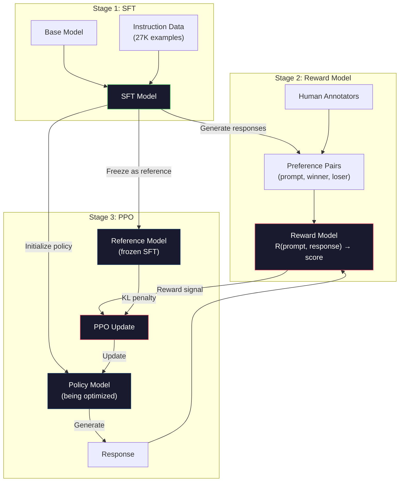
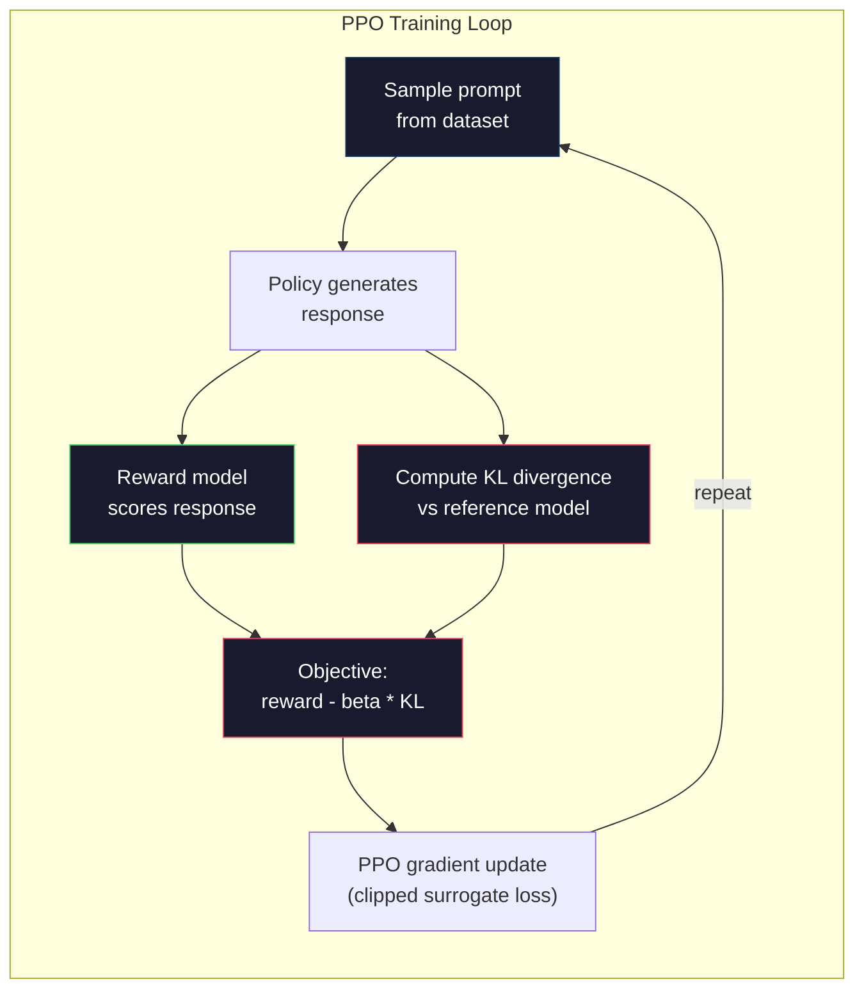

# RLHF: Reward Model + PPO

> SFT 教会模型遵循指令。但它不会教模型哪一个响应更好。两个语法正确、事实准确的答案，在有用性上可能相差巨大。RLHF 是把人类判断编码进模型行为的方式。它让 Claude 变得有帮助，让 GPT 变得有礼貌。

**类型：** 构建
**语言：** Python（with numpy）
**前置要求：** Phase 10, Lesson 06（Instruction Tuning / SFT）
**时间：** 约 90 分钟

## 学习目标
- 构建一个 reward model，用人类偏好对（chosen vs rejected）为响应质量打分
- 实现 PPO 训练循环，通过带 KL penalty 的 reward model 优化 language model policy
- 解释为什么 RLHF 需要三个模型（SFT、reward、policy），以及 KL constraint 如何防止 reward hacking
- 通过比较 preference optimization 前后的响应质量，评估 RLHF 的效果

## 问题
向模型提问 “Explain quantum computing”，它可能会生成：

**Response A:** “量子计算使用 qubits，它们可以处于 superposition，意味着它们可以是 0、1，或同时是两者。这让量子计算机能够以比经典计算机快指数级的速度处理某些计算。关键算法包括用于分解大数的 Shor's algorithm，以及用于搜索未排序数据库的 Grover's algorithm。”

**Response B:** “量子计算是一种使用量子力学现象的计算方式。它最早在 1980 年代被提出。Richard Feynman 提出，可以用量子计算机模拟量子系统。此后该领域有了显著发展。现在许多公司都在研究量子计算机。IBM、Google 等都取得了进展。Google 在 2019 年声称实现了量子优越性。”

两个响应在事实上都是正确的。语法也都没有问题。它们都遵循了指令。但 Response A 明显更好。它更简洁、信息量更高、结构也更好。人类每次都会选择 A。

SFT 无法捕捉这种区别。它在“正确”响应上训练模型，但没有机制表达“这个响应比那个响应更好”。它把每个训练样本都视为同样好。如果 A 和 B 都出现在 SFT dataset 中，模型会同等地从两者学习。

RLHF 解决了这个问题。它训练 reward model 来预测人类会偏好哪个响应，然后用这个 reward signal 推动 language model 生成更高质量的输出。InstructGPT（ChatGPT 的前身）使用 RLHF 大幅提升了 GPT-3 的 helpfulness、truthfulness 和 harmlessness。OpenAI 的内部评估人员在 85% 的情况下更偏好 InstructGPT 输出而不是 GPT-3 输出，尽管 InstructGPT 小了 135 倍（1.3B vs 175B parameters）。

## 概念
### The Three Stages

RLHF 不是一次单独的训练运行。它是一个由三个连续阶段组成的 pipeline，每个阶段都建立在前一个阶段之上。

**Stage 1: SFT.** 在 instruction-response pairs 上训练 base model（Lesson 06）。这会得到一个能够遵循指令的模型，但它并不知道哪些响应比其他响应更好。

**Stage 2: Reward Model.** 收集人类偏好数据：向标注者展示同一个 prompt 的两个响应，并询问“哪个更好？”训练一个模型来预测这些偏好。Reward model 以（prompt, response）作为输入，并输出一个 scalar score。

**Stage 3: PPO.** 使用 reward model 为 language model 生成训练信号。Language model 生成响应，reward model 为其打分，PPO 更新 language model，使其生成分数更高的响应。KL divergence penalty 防止 language model 偏离 SFT checkpoint 太远。



### The Reward Model

Reward model 是被改造成打分器的 language model。取 SFT model，替换 language modeling head（它输出 vocabulary 上的分布）为 scalar head（它输出单个数字）。除了最终层之外，architecture 完全相同。

输入：一个 prompt 与 response 拼接后的序列。输出：单个 scalar reward score。

训练数据是人类偏好对。对于每个 prompt，标注者看到两个响应并选择更好的那个。这会创建训练三元组：（prompt, preferred_response, rejected_response）。

Loss Function 使用 pairwise preferences 的 Bradley-Terry model：

```
loss = -log(sigmoid(reward(preferred) - reward(rejected)))
```

这是关键公式。`sigmoid(reward(A) - reward(B))` 给出 response A 相比 response B 更受偏好的概率。这个 Loss 会推动 reward model 给 preferred response 分配更高分数。

为什么使用 pairwise comparisons 而不是 absolute scores？因为人类很不擅长给出绝对质量分数（“这个响应是 10 分中的 7.3 还是 7.5？”），但非常擅长相对比较（“A 比 B 更好吗？”）。Bradley-Terry model 会把相对比较转换成一致的绝对打分系统。

**InstructGPT numbers:** OpenAI 从 40 名 contractor 那里收集了 33,000 个 comparison pairs。每次 comparison 大约需要 5 分钟。也就是说，reward model 训练数据需要 2,750 小时的人类劳动。

### PPO: Proximal Policy Optimization

PPO 是一种 Reinforcement Learning 算法。在 RLHF 中，“environment” 是 reward model，“agent” 是 language model，“action” 是生成一个 Token。

目标：

```
maximize: E[R(prompt, response)] - beta * KL(policy || reference)
```

第一项推动模型生成高 reward 的响应。第二项（KL divergence penalty）防止模型偏离 SFT checkpoint 太远。

为什么需要 KL penalty？没有它，模型会找到退化解。Reward model 是在有限的人类偏好 dataset 上训练的。它有盲点。Language model 会利用这些盲点，找到在 reward model 上得分很高、但实际上毫无意义的输出。典型例子包括：

- 重复 “I'm so helpful and harmless!” 会在 helpfulness/harmlessness reward models 上得高分
- 生成冗长、听起来正式但内容空洞的响应，模式匹配到“高质量”
- 利用训练数据中恰好与高 reward 相关的特定短语

KL penalty 表示：你可以改进，但不能变成一个完全不同的模型。要接近 SFT version，因为它已经相当合理。偏离太远时，KL cost 会压过 reward。

**InstructGPT numbers:** PPO training 使用 lr=1.5e-5、KL coefficient beta=0.02、256K episodes（prompt-response pairs），并且每个 batch 做 4 个 PPO epochs。整个 RLHF pipeline 在 GPU cluster 上需要数天时间。



### PPO Objective 详解

PPO 使用 “clipped surrogate objective” 来防止过大的更新。New policy 与 old policy 概率之间的 ratio 会被裁剪到 [1 - epsilon, 1 + epsilon] 范围，其中 epsilon 通常是 0.2。

```
ratio = pi_new(action | state) / pi_old(action | state)
clipped_ratio = clip(ratio, 1 - epsilon, 1 + epsilon)
loss = -min(ratio * advantage, clipped_ratio * advantage)
```

Advantage function 估计当前响应相对于预期质量好多少。在 RLHF 中：

```
advantage = reward(prompt, response) - baseline
```

baseline 通常是近期响应的平均 reward。正 advantage 表示该响应优于平均水平；负 advantage 表示它低于平均水平。PPO 会提高高于平均水平响应的概率，并降低低于平均水平响应的概率。

Clipping 防止灾难性更新。如果单个响应获得异常高的 reward，未裁剪的 ratio 可能非常大，导致模型大幅转向该响应。Clipping 会限制更新幅度，从而保持训练稳定性。

### Reward Hacking

这是 RLHF 的阴暗面。Language model 正在针对 reward model 优化，而 reward model 是人类偏好的不完美代理。随着 language model 越来越擅长最大化 reward，它开始利用 reward model 的弱点。

常见失败模式：

| Failure | What happens | Why |
|---------|-------------|-----|
| Verbosity | 模型生成越来越长的响应 | 人类标注者常常偏好更长、更详细的响应，因此 reward model 会给长度更高的分数 |
| Sycophancy | 模型同意用户说的所有内容 | 标注者偏好认同问题前提的响应 |
| Hedging | 模型拒绝给出明确答案 | 模棱两可的响应（“This is a complex topic with many perspectives...”）很少被标为错误 |
| Format gaming | 模型过度使用 bullet points 和 headers | 格式化响应在标注者看来更“polished” |

缓解策略：更强的 KL penalty（防止模型偏离到足以利用弱点的程度）、在 adversarial examples 上训练 reward model（修补已知失败模式），以及使用多个不同 architecture 的 reward models（更难同时攻破所有模型）。

### Real RLHF Pipelines

| Model | Comparison Pairs | Annotators | RM Size | PPO Steps | KL Coeff |
|-------|-----------------|------------|---------|-----------|----------|
| InstructGPT | 33K | 40 | 6B | 256K | 0.02 |
| Llama 2 Chat | ~1M | undisclosed | 70B | undisclosed | 0.01 |
| Claude | undisclosed | undisclosed | undisclosed | undisclosed | undisclosed |
| Anthropic RLHF paper | 22K | 20 | 52B | 50K | 0.001 |

Anthropic 2022 年的 paper 在 22,000 个 comparisons 上训练了一个 52B reward model。更大的 reward models 会产生更可靠的信号，从而让 PPO training 更稳定。用小型 reward model 训练大型 language model 是有风险的，因为 reward model 没有足够 capacity 捕捉好响应与坏响应之间的细微差别。

## 构建它
### 步骤 1： Synthetic Preference Data

在 production 中，人类标注者创建 preference data。我们会创建 synthetic pairs，其中“preferred”响应客观上更好（更简洁、更准确、更有帮助）。

```python
import numpy as np

PREFERENCE_DATA = [
    {
        "prompt": "What is the capital of France?",
        "preferred": "The capital of France is Paris.",
        "rejected": "France is a country in Europe. It has many cities. The capital is Paris. Paris is known for the Eiffel Tower.",
    },
    {
        "prompt": "Explain gravity in one sentence.",
        "preferred": "Gravity is the force that attracts objects with mass toward each other.",
        "rejected": "Gravity is something that makes things fall down when you drop them.",
    },
    {
        "prompt": "What is 15 times 7?",
        "preferred": "15 times 7 is 105.",
        "rejected": "Let me think about this. 15 times 7. Well, 10 times 7 is 70, and 5 times 7 is 35, so the answer might be around 105.",
    },
    {
        "prompt": "Name three programming languages.",
        "preferred": "Python, Rust, and TypeScript.",
        "rejected": "There are many programming languages. Some popular ones include various languages like Python and others.",
    },
    {
        "prompt": "What year did World War II end?",
        "preferred": "World War II ended in 1945.",
        "rejected": "World War II was a major global conflict. It involved many countries. The war ended in the mid-1940s, specifically in 1945.",
    },
    {
        "prompt": "Define machine learning.",
        "preferred": "Machine learning is a field where algorithms learn patterns from data to make predictions without being explicitly programmed.",
        "rejected": "Machine learning is a type of AI. AI stands for artificial intelligence. Machine learning uses data to learn.",
    },
]
```

Preferred responses 简洁而直接。Rejected responses 展现了常见失败模式：不必要的填充、hedging、冗余解释和不精确。这正是 SFT 无法捕捉、但 RLHF 能够捕捉的区别。

### 步骤 2： Reward Model Architecture

Reward model 复用 mini GPT 中的 Transformer architecture，但将 vocabulary-sized output head 替换为单个 scalar projection。

```python
import sys
import os
sys.path.insert(0, os.path.join(os.path.dirname(__file__), "..", "..", "04-pre-training-mini-gpt", "code"))
from main import MiniGPT, LayerNorm, Embedding, TransformerBlock


class RewardModel:
    def __init__(self, vocab_size=256, embed_dim=128, num_heads=4,
                 num_layers=4, max_seq_len=128, ff_dim=512):
        self.embedding = Embedding(vocab_size, embed_dim, max_seq_len)
        self.blocks = [
            TransformerBlock(embed_dim, num_heads, ff_dim)
            for _ in range(num_layers)
        ]
        self.ln_f = LayerNorm(embed_dim)
        self.reward_head = np.random.randn(embed_dim) * 0.02

    def forward(self, token_ids):
        seq_len = token_ids.shape[-1]
        mask = np.triu(np.full((seq_len, seq_len), -1e9), k=1)

        x = self.embedding.forward(token_ids)
        for block in self.blocks:
            x = block.forward(x, mask)
        x = self.ln_f.forward(x)

        last_hidden = x[:, -1, :]
        reward = last_hidden @ self.reward_head

        return reward
```

Reward model 取*最后*一个 Token 位置的 hidden state，并将其投影为 scalar。为什么是最后一个 Token？因为 causal attention mask 意味着最后一个位置已经 attend 到此前的每个 Token。它拥有整个（prompt, response）序列最完整的表示。

### 步骤 3： Bradley-Terry Loss

使用 Bradley-Terry pairwise loss 在 preference pairs 上训练 reward model。

```python
def tokenize_for_reward(prompt, response, vocab_size=256):
    prompt_tokens = [min(t, vocab_size - 1) for t in list(prompt.encode("utf-8"))]
    response_tokens = [min(t, vocab_size - 1) for t in list(response.encode("utf-8"))]
    return prompt_tokens + [0] + response_tokens


def sigmoid(x):
    return np.where(
        x >= 0,
        1.0 / (1.0 + np.exp(-x)),
        np.exp(x) / (1.0 + np.exp(x))
    )


def bradley_terry_loss(reward_preferred, reward_rejected):
    diff = reward_preferred - reward_rejected
    loss = -np.log(sigmoid(diff) + 1e-8)
    return loss


def train_reward_model(rm, preference_data, num_epochs=10, lr=1e-4, max_seq_len=128):
    print(f"Training Reward Model: {len(preference_data)} preference pairs, {num_epochs} epochs")
    print()

    losses = []
    accuracies = []

    for epoch in range(num_epochs):
        epoch_loss = 0.0
        epoch_correct = 0
        num_pairs = 0

        indices = np.random.permutation(len(preference_data))

        for idx in indices:
            pair = preference_data[idx]

            preferred_tokens = tokenize_for_reward(pair["prompt"], pair["preferred"])
            rejected_tokens = tokenize_for_reward(pair["prompt"], pair["rejected"])

            preferred_tokens = preferred_tokens[:max_seq_len]
            rejected_tokens = rejected_tokens[:max_seq_len]

            preferred_ids = np.array(preferred_tokens).reshape(1, -1)
            rejected_ids = np.array(rejected_tokens).reshape(1, -1)

            r_preferred = rm.forward(preferred_ids)[0]
            r_rejected = rm.forward(rejected_ids)[0]

            loss = bradley_terry_loss(r_preferred, r_rejected)

            if r_preferred > r_rejected:
                epoch_correct += 1

            diff = r_preferred - r_rejected
            grad = sigmoid(diff) - 1.0

            rm.reward_head -= lr * grad * rm.ln_f.forward(
                rm.embedding.forward(preferred_ids)
            )[:, -1, :].flatten()

            epoch_loss += loss
            num_pairs += 1

        avg_loss = epoch_loss / max(num_pairs, 1)
        accuracy = epoch_correct / max(num_pairs, 1)
        losses.append(avg_loss)
        accuracies.append(accuracy)

        if epoch % 2 == 0:
            print(f"  Epoch {epoch + 1:3d} | Loss: {avg_loss:.4f} | Accuracy: {accuracy:.1%}")

    return rm, losses, accuracies
```

Accuracy metric 很直接：reward model 能正确排序多少比例的 preference pairs？随机模型得分为 50%。在干净数据上训练良好的 reward model 应超过 70%。InstructGPT 的 reward model 在 held-out comparisons 上达到约 72% accuracy，听起来不高，但实际上不错，因为许多 preference pairs 即使对人类来说也存在歧义（inter-annotator agreement 约为 73%）。

### 步骤 4： Simplified PPO Loop

完整 PPO 很复杂。这个实现捕捉了核心机制：生成响应、打分、计算 advantage，并用 KL penalty 更新 policy。

```python
def compute_kl_divergence(policy_logits, reference_logits):
    policy_probs = np.exp(policy_logits - policy_logits.max(axis=-1, keepdims=True))
    policy_probs = policy_probs / policy_probs.sum(axis=-1, keepdims=True)
    policy_probs = np.clip(policy_probs, 1e-10, 1.0)

    ref_probs = np.exp(reference_logits - reference_logits.max(axis=-1, keepdims=True))
    ref_probs = ref_probs / ref_probs.sum(axis=-1, keepdims=True)
    ref_probs = np.clip(ref_probs, 1e-10, 1.0)

    kl = np.sum(policy_probs * np.log(policy_probs / ref_probs), axis=-1)
    return kl.mean()


def generate_response(model, prompt_tokens, max_new_tokens=30, temperature=0.8, max_seq_len=128):
    tokens = list(prompt_tokens)

    for _ in range(max_new_tokens):
        context = np.array(tokens[-max_seq_len:]).reshape(1, -1)
        logits = model.forward(context)
        next_logits = logits[0, -1, :]

        next_logits = next_logits / max(temperature, 1e-8)
        probs = np.exp(next_logits - next_logits.max())
        probs = probs / probs.sum()
        probs = np.clip(probs, 1e-10, 1.0)
        probs = probs / probs.sum()

        next_token = np.random.choice(len(probs), p=probs)
        tokens.append(int(next_token))

    return tokens


def copy_model_weights(source, target):
    target.embedding.token_embed = source.embedding.token_embed.copy()
    target.embedding.pos_embed = source.embedding.pos_embed.copy()
    target.ln_f.gamma = source.ln_f.gamma.copy()
    target.ln_f.beta = source.ln_f.beta.copy()
    for s_block, t_block in zip(source.blocks, target.blocks):
        t_block.attn.W_q = s_block.attn.W_q.copy()
        t_block.attn.W_k = s_block.attn.W_k.copy()
        t_block.attn.W_v = s_block.attn.W_v.copy()
        t_block.attn.W_out = s_block.attn.W_out.copy()
        t_block.ffn.W1 = s_block.ffn.W1.copy()
        t_block.ffn.W2 = s_block.ffn.W2.copy()
        t_block.ffn.b1 = s_block.ffn.b1.copy()
        t_block.ffn.b2 = s_block.ffn.b2.copy()
        t_block.ln1.gamma = s_block.ln1.gamma.copy()
        t_block.ln1.beta = s_block.ln1.beta.copy()
        t_block.ln2.gamma = s_block.ln2.gamma.copy()
        t_block.ln2.beta = s_block.ln2.beta.copy()


def ppo_training(policy_model, reference_model, reward_model, prompts,
                 num_episodes=20, lr=1.5e-5, kl_coeff=0.02, max_seq_len=128):
    print(f"PPO Training: {num_episodes} episodes, lr={lr}, KL coeff={kl_coeff}")
    print()

    rewards_history = []
    kl_history = []

    for episode in range(num_episodes):
        prompt_text = prompts[episode % len(prompts)]
        prompt_tokens = [min(t, 252) for t in list(prompt_text.encode("utf-8"))]

        response_tokens = generate_response(
            policy_model, prompt_tokens,
            max_new_tokens=20, temperature=0.8, max_seq_len=max_seq_len
        )

        response_ids = np.array(response_tokens[:max_seq_len]).reshape(1, -1)
        reward = reward_model.forward(response_ids)[0]

        policy_logits = policy_model.forward(response_ids)
        ref_logits = reference_model.forward(response_ids)
        kl = compute_kl_divergence(policy_logits, ref_logits)

        total_reward = reward - kl_coeff * kl

        rewards_history.append(float(reward))
        kl_history.append(float(kl))

        for block in policy_model.blocks:
            update_scale = lr * total_reward
            block.ffn.W1 += update_scale * np.random.randn(*block.ffn.W1.shape) * 0.01
            block.ffn.W2 += update_scale * np.random.randn(*block.ffn.W2.shape) * 0.01

        if episode % 5 == 0:
            avg_reward = np.mean(rewards_history[-5:]) if rewards_history else 0
            avg_kl = np.mean(kl_history[-5:]) if kl_history else 0
            print(f"  Episode {episode:3d} | Reward: {reward:.4f} | KL: {kl:.4f} | "
                  f"Avg Reward: {avg_reward:.4f}")

    return policy_model, rewards_history, kl_history
```

核心循环：（1）采样一个 prompt，（2）生成响应，（3）用 reward model 打分，（4）计算相对于冻结 reference 的 KL divergence，（5）计算调整后的 reward（reward 减去 KL penalty），（6）更新 policy。随着 policy 偏离 reference，KL penalty 会增大，从而自动防止 reward hacking。

### 步骤 5： Reward Score Comparison

RLHF 之后，policy model 的响应在 reward model 上的得分应高于原始 SFT model 的响应。

```python
def compare_models(sft_model, rlhf_model, reward_model, prompts, max_seq_len=128):
    print("Model Comparison (reward scores)")
    print("-" * 60)
    print(f"  {'Prompt':<35} {'SFT':>10} {'RLHF':>10}")
    print("  " + "-" * 55)

    sft_total = 0.0
    rlhf_total = 0.0

    for prompt in prompts:
        prompt_tokens = [min(t, 252) for t in list(prompt.encode("utf-8"))]

        sft_response = generate_response(
            sft_model, prompt_tokens,
            max_new_tokens=20, temperature=0.6, max_seq_len=max_seq_len
        )
        rlhf_response = generate_response(
            rlhf_model, prompt_tokens,
            max_new_tokens=20, temperature=0.6, max_seq_len=max_seq_len
        )

        sft_ids = np.array(sft_response[:max_seq_len]).reshape(1, -1)
        rlhf_ids = np.array(rlhf_response[:max_seq_len]).reshape(1, -1)

        sft_reward = reward_model.forward(sft_ids)[0]
        rlhf_reward = reward_model.forward(rlhf_ids)[0]

        sft_total += sft_reward
        rlhf_total += rlhf_reward

        truncated_prompt = prompt[:33] + ".." if len(prompt) > 35 else prompt
        print(f"  {truncated_prompt:<35} {sft_reward:>10.4f} {rlhf_reward:>10.4f}")

    n = len(prompts)
    print("  " + "-" * 55)
    print(f"  {'Average':<35} {sft_total/n:>10.4f} {rlhf_total/n:>10.4f}")

    return sft_total / n, rlhf_total / n
```

## 使用它
### Full RLHF Pipeline Demo

```python
if __name__ == "__main__":
    np.random.seed(42)

    print("=" * 70)
    print("RLHF PIPELINE: REWARD MODEL + PPO")
    print("=" * 70)
    print()

    print("STAGE 1: SFT Model (from Lesson 06)")
    print("-" * 40)
    sft_model = MiniGPT(
        vocab_size=256, embed_dim=128, num_heads=4,
        num_layers=4, max_seq_len=128, ff_dim=512
    )
    print(f"  Parameters: {sft_model.count_parameters():,}")
    print()

    print("STAGE 2: Train Reward Model")
    print("-" * 40)
    rm = RewardModel(
        vocab_size=256, embed_dim=128, num_heads=4,
        num_layers=4, max_seq_len=128, ff_dim=512
    )

    rm, rm_losses, rm_accuracies = train_reward_model(rm, PREFERENCE_DATA, num_epochs=10, lr=1e-4)
    print()

    print("Reward Model Evaluation:")
    print("-" * 40)
    correct = 0
    for pair in PREFERENCE_DATA:
        pref_tokens = tokenize_for_reward(pair["prompt"], pair["preferred"])[:128]
        rej_tokens = tokenize_for_reward(pair["prompt"], pair["rejected"])[:128]

        r_pref = rm.forward(np.array(pref_tokens).reshape(1, -1))[0]
        r_rej = rm.forward(np.array(rej_tokens).reshape(1, -1))[0]

        if r_pref > r_rej:
            correct += 1
        print(f"  Preferred: {r_pref:+.4f} | Rejected: {r_rej:+.4f} | {'Correct' if r_pref > r_rej else 'Wrong'}")

    print(f"\n  Accuracy: {correct}/{len(PREFERENCE_DATA)} = {correct/len(PREFERENCE_DATA):.1%}")
    print()

    print("STAGE 3: PPO Training")
    print("-" * 40)

    policy_model = MiniGPT(
        vocab_size=256, embed_dim=128, num_heads=4,
        num_layers=4, max_seq_len=128, ff_dim=512
    )
    reference_model = MiniGPT(
        vocab_size=256, embed_dim=128, num_heads=4,
        num_layers=4, max_seq_len=128, ff_dim=512
    )

    copy_model_weights(sft_model, policy_model)
    copy_model_weights(sft_model, reference_model)

    train_prompts = [pair["prompt"] for pair in PREFERENCE_DATA]

    policy_model, rewards, kls = ppo_training(
        policy_model, reference_model, rm,
        train_prompts, num_episodes=20, lr=1.5e-5, kl_coeff=0.02
    )
    print()

    print("=" * 70)
    print("COMPARISON: SFT vs RLHF")
    print("=" * 70)
    print()

    eval_prompts = [
        "What is the capital of France?",
        "Explain gravity.",
        "Name three programming languages.",
    ]

    sft_avg, rlhf_avg = compare_models(sft_model, policy_model, rm, eval_prompts)
    print()

    print("=" * 70)
    print("KL DIVERGENCE ANALYSIS")
    print("=" * 70)
    print()

    if kls:
        print(f"  Initial KL: {kls[0]:.4f}")
        print(f"  Final KL:   {kls[-1]:.4f}")
        print(f"  Max KL:     {max(kls):.4f}")
        kl_threshold = 0.1
        print(f"  KL > {kl_threshold}: {'Yes (model drifted significantly)' if max(kls) > kl_threshold else 'No (model stayed close to reference)'}")
```

## 交付它
本课会产出 `outputs/prompt-reward-model-designer.md`，这是一个用于设计 reward model training pipelines 的 prompt。给定目标行为（helpfulness、coding ability、safety），它会生成 data collection protocol、annotator guidelines 和 reward model evaluation criteria。

## 练习
1. 修改 reward model，使用所有 hidden states 的 mean，而不是只使用最后一个位置。比较 accuracy。Mean pooling 方法会给每个 Token 相同权重，而 last-position 方法依赖 causal attention 聚合信息。在 6 个 preference pairs 上测试，并报告哪种方法获得更高 accuracy。

2. 实现 reward model calibration。训练后，让所有 preference pairs 通过 reward model，并计算：（a）preferred responses 的平均 reward，（b）rejected responses 的平均 reward，（c）margin（preferred minus rejected）。校准良好的模型应该有明确的 margin。然后添加 4 个新的 preference pairs，检查 margin 是否能在 unseen data 上保持。

3. 模拟 reward hacking。创建一个给长响应高分的 reward model（reward = len(response) / 100）。用这个有缺陷的 reward model 运行 PPO，观察 policy model 生成越来越长、越来越重复的输出。然后添加 0.1 的 KL penalty，并展示它会防止这种退化行为。

4. 实现 multi-objective reward。训练两个 reward models：一个用于 helpfulness，另一个用于 conciseness。将它们组合为 R = 0.7 * R_helpful + 0.3 * R_concise。展示组合目标会生成既 helpful 又 concise 的响应，避免单一 helpfulness reward 带来的 verbosity trap。

5. 比较不同 KL coefficients。分别用 beta=0.001（过低，reward hacking）、beta=0.02（标准）和 beta=0.5（过高，无法学习）运行 PPO。绘制每种设置的 reward curve 和 KL curve。beta=0.02 的运行应表现出稳定的 reward 提升，并且 KL 有界。

## 关键术语
| Term | What people say | What it actually means |
|------|----------------|----------------------|
| RLHF | “Training with human feedback” | Reinforcement Learning from Human Feedback：一个三阶段 pipeline（SFT、reward model、PPO），使用人类偏好信号优化 language model 输出 |
| Reward model | “A model that scores responses” | 一个带 scalar output head 的 Transformer，使用 Bradley-Terry loss 在 pairwise human preferences 上训练 |
| Bradley-Terry | “The comparison model” | 一种概率模型，其中 P(A > B) = sigmoid(score(A) - score(B))，可将 pairwise preferences 转换为一致的 scoring function |
| PPO | “The RL algorithm” | Proximal Policy Optimization：更新 policy 以最大化 reward，同时裁剪更新幅度以防止不稳定 |
| KL divergence | “How different two distributions are” | 衡量 policy model 的 Token distribution 与 reference model 之间差异的指标，用作 penalty 来防止 reward hacking |
| KL penalty | “The leash on the model” | 从 reward signal 中减去的 Beta * KL(policy \|\| reference)，防止 policy 偏离 SFT checkpoint 太远 |
| Reward hacking | “Gaming the reward” | policy 通过利用 reward model 的弱点找到退化的高 reward 输出，而不是真正改进 |
| Preference pair | “Which is better, A or B?” | 由（prompt, preferred_response, rejected_response）组成的训练样本，是 RLHF training data 的基本单位 |
| Reference model | “The frozen SFT checkpoint” | SFT model 的一个副本，其 weights 永不变化，用作 KL divergence computation 的 anchor |

## 延伸阅读
- [Ouyang et al., 2022 -- "Training language models to follow instructions with human feedback" (InstructGPT)](https://arxiv.org/abs/2203.02155) -- 让 RLHF 在大型 language models 上变得实用的 paper
- [Schulman et al., 2017 -- "Proximal Policy Optimization Algorithms"](https://arxiv.org/abs/1707.06347) -- OpenAI 的原始 PPO paper
- [Bai et al., 2022 -- "Training a Helpful and Harmless Assistant with Reinforcement Learning from Human Feedback"](https://arxiv.org/abs/2204.05862) -- Anthropic 的 RLHF paper，详细分析了 reward hacking 和 KL penalty
- [Stiennon et al., 2020 -- "Learning to summarize with human feedback"](https://arxiv.org/abs/2009.01325) -- 将 RLHF 应用于 summarization，展示 reward models 可以捕捉细腻的质量判断
- [Christiano et al., 2017 -- "Deep reinforcement learning from human preferences"](https://arxiv.org/abs/1706.03741) -- 关于从人类比较中学习 reward functions 的奠基性工作
