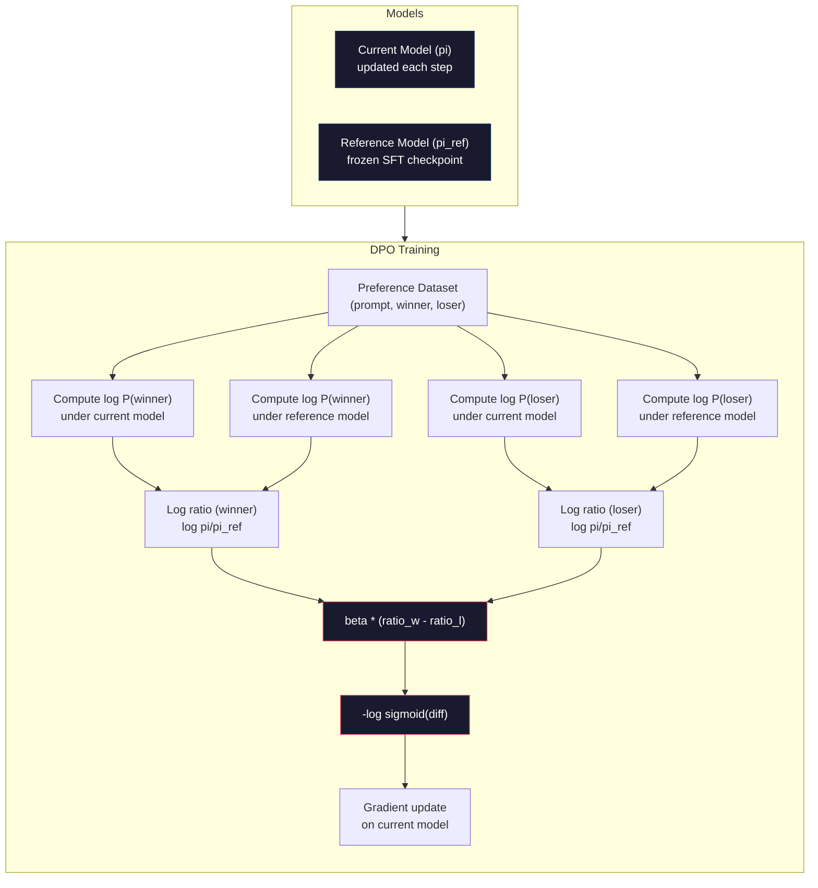

# DPO: Direct Preference Optimization

> RLHF 有效。但它也需要训练三个模型（SFT、reward model、policy），管理 PPO 的不稳定性，并调节 KL penalty。DPO 会问：如果你能跳过这一切呢？DPO 直接在 preference pairs 上优化语言模型。不需要 reward model。不需要 PPO。一个 training loop。相同的结果。

**Type:** Build
**Languages:** Python (with numpy)
**Prerequisites:** Phase 10, Lesson 07 (RLHF)
**Time:** ~90 分钟

## 学习目标
- 实现 DPO training，直接在 preference pairs 上优化语言模型，而不使用单独的 reward model
- 推导 DPO Loss Function，并解释它如何通过 policy 的 log probabilities 隐式表示 reward model
- 从训练稳定性、计算成本和所需模型数量角度比较 DPO 与 RLHF
- 调节 beta 参数，控制训练后的 policy 偏离 reference model 的程度

## 问题
你在 Lesson 07 中构建了一个 RLHF pipeline。三个阶段。三个模型。SFT model、reward model，以及用 PPO 优化的 policy model。仅 reward model 就需要数千个人类 preference pairs 和一个单独的 training loop。PPO 需要仔细调节 KL coefficient、learning rate、clip ratio 和 epochs 数量。

在实践中，PPO training 以不稳定著称。很小的 hyperparameter 变化就可能导致训练发散。reward model 是人类偏好的不完美代理，而 policy 会找到利用其弱点的方式。KL penalty 有帮助，但它本身也需要调节：太低会导致 reward hacking，太高则模型几乎学不到东西。

这种复杂性解释了为什么在 InstructGPT 发布后的多年里，大多数开源模型都难以使用 RLHF。三阶段 pipeline 很脆弱。每个阶段都有自己的 failure modes，并且错误会叠加。

2023 年 5 月，Stanford 的 Rafael Rafailov、Archit Sharma 及其同事发表了 “Direct Preference Optimization: Your Language Model is Secretly a Reward Model”。核心洞见是：你不需要单独的 reward model。最优 reward function 在数学上由语言模型自身的 token 概率决定。你可以完全跳过 reward model，直接在 preference pairs 上优化语言模型。

DPO 将 RLHF 简化为一个 supervised learning 步骤。一个模型。一个 Loss Function。一个 training loop。没有 Reinforcement Learning。Zephyr-7B 是最早大规模使用 DPO 的模型之一，在多个 benchmarks 上追平或超过了用完整 RLHF 训练的模型。Meta 在 Llama 3 的 alignment pipeline 中使用了 DPO。Anthropic 也在其 alignment research 中提到过 DPO 风格的方法。

## 概念
### The Key Insight

RLHF 优化这个目标：

```
maximize: E[R(x, y)] - beta * KL(pi || pi_ref)
```

其中 R 是 reward model，pi 是 policy，pi_ref 是 reference model，beta 是 KL coefficient。

DPO paper 证明，这个目标存在闭式最优解。对于任意 reward function R，最优 policy 是：

```
pi*(y | x) = pi_ref(y | x) * exp(R(x, y) / beta) / Z(x)
```

其中 Z(x) 是归一化常数。重新排列可得：

```
R(x, y) = beta * log(pi*(y | x) / pi_ref(y | x)) + beta * log Z(x)
```

这就是突破点。reward 完全用 policy model 的概率和 reference model 的概率来表达。你不需要训练单独的 reward model。reward 被*隐式*包含在概率比中。

将其代入 Bradley-Terry preference model：

```
P(y_w > y_l | x) = sigmoid(R(x, y_w) - R(x, y_l))
                  = sigmoid(beta * (log pi(y_w|x)/pi_ref(y_w|x) - log pi(y_l|x)/pi_ref(y_l|x)))
```

Z(x) 项会抵消，因为两个 response 都以同一个 prompt x 为条件。剩下的只是 policy model 和 reference model 在 preferred 与 rejected responses 上的 log-probabilities 的函数。

### The DPO Loss

```
L_DPO = -log(sigmoid(beta * (log pi(y_w|x)/pi_ref(y_w|x) - log pi(y_l|x)/pi_ref(y_l|x))))
```

我们拆解每一部分：

- **y_w** = preferred（winning）response
- **y_l** = rejected（losing）response
- **x** = prompt
- **pi** = 当前模型（正在训练）
- **pi_ref** = reference model（冻结的 SFT checkpoint）
- **beta** = 控制偏离 reference 程度的 temperature 参数（通常为 0.1 到 0.5）

比值 `log pi(y|x) / pi_ref(y|x)` 是 log-probability ratio。当这个比值为正时，当前模型赋予 response y 的概率高于 reference。当它为负时，当前模型赋予的概率更低。

DPO Loss 会推动模型提高 preferred responses 的 log-probability ratio，并降低 rejected responses 的 log-probability ratio。beta 参数控制模型可以多激进地偏离 reference：较小的 beta 表示允许较大偏离，较大的 beta 会让模型更接近 reference。



### Why DPO is Simpler

| Aspect | RLHF (PPO) | DPO |
|--------|-----------|-----|
| 需要训练的模型 | 3（SFT + reward + policy） | 1（仅 policy） |
| Training loops | 3（SFT、RM training、PPO） | 2（SFT、DPO） |
| Hyperparameters | lr、KL coeff、clip ratio、RM lr、epochs x3 | lr、beta、epochs |
| Reward model | 必需（单独训练） | 隐式存在于模型概率中 |
| RL algorithm | PPO（复杂、不稳定） | Supervised learning（稳定） |
| GPU memory | PPO 期间内存中有 3-4 个模型 | 2 个模型（current + reference） |
| 训练稳定性 | 对 hyperparameters 敏感 | 稳健，类似 SFT |

DPO 训练时需要在内存中放两个模型：当前模型和冻结的 reference。RLHF 需要三个或四个：policy、reference、reward model，以及可选的 value function baseline。对于 70B 模型，每个副本在 FP16 下需要 140GB。去掉 reward model 带来的内存节省非常可观。

### When DPO Beats RLHF

**小数据集。** 在 5,000-20,000 个 preference pairs 的规模下，DPO 通常能追平或超过 RLHF。RLHF 中的 reward model 需要足够数据才能泛化；数据有限时，它会过拟合并产生不可靠的 reward signals。DPO 通过完全不需要 reward model 绕过了这个问题。

**计算资源有限。** DPO 只需要完整 RLHF 大约三分之一的计算量（一个 training loop，而不是三个）。对于没有大型 GPU clusters 的团队，这是更实际的选择。

**快速迭代。** 想尝试 10 个不同的 preference datasets，看看哪个能产生最佳模型？DPO 让你能在数小时内完成每个实验。RLHF 则需要为每个 dataset 重新训练 reward model。

### When RLHF Beats DPO

**大规模训练。** 在 GPT-4 或 Claude 的规模上，RLHF 的单独 reward model 可以捕捉更细腻的 preference signals。reward model 充当一种学习得到的 Loss Function，可以适应复杂的质量标准。

**复杂 reward signals。** 当“更好”涉及多个维度（helpfulness、harmlessness、honesty）时，reward model 可以学习这种多目标权衡。DPO 将每个 preference pair 视为二元信号：一个更好，一个更差，而不会建模原因。

**迭代式 alignment。** RLHF pipelines 可以用当前 policy 生成新 responses，让人类评分，然后在在线循环中重新训练 reward model。DPO 作用于固定的 preference pairs dataset。Constitutional AI（Anthropic 的方法）大量使用了 RLHF 的这种迭代特性。

### DPO 之外：KTO, ORPO, SimPO

DPO 启发了一系列简化的 alignment 方法。

**KTO (Kahneman-Tversky Optimization, 2024)：** 你甚至不需要成对数据。KTO 使用未配对反馈：只需将每个 response 标注为“good”或“bad”，而无需将它与另一个替代项比较。这大幅简化了数据收集。不是向标注者展示两个 responses 并询问“哪个更好？”，而是展示一个 response 并询问“这个好吗？”Loss Function 应用了前景理论中的损失厌恶：bad responses 受到的惩罚大于 good responses 得到的奖励。

**ORPO (Odds Ratio Preference Optimization, 2024)：** 将 SFT 和 alignment 合并到一个训练步骤中。ORPO 不是先做 SFT 再做 DPO，而是修改 SFT Loss，使其包含 preference signal。该 Loss 有两项：preferred responses 上的标准 next-token prediction loss，加上一个 odds ratio 项，用于增大 preferred 与 rejected response 概率之间的差距。一个 training loop，而不是两个。

**SimPO (Simple Preference Optimization, 2024)：** 完全去掉 reference model。SimPO 不再针对冻结的 reference 计算 log-probability ratios，而是使用 response 的平均 log-probability（按长度归一化）作为隐式 reward。这节省内存（不需要 reference model）并简化训练。长度归一化防止模型偏好更短的 responses。

| Method | Year | Models in Memory | Needs Pairs? | Needs Reference? | Training Loops |
|--------|------|-----------------|-------------|-----------------|----------------|
| RLHF | 2022 | 3-4 | Yes（用于 RM） | Yes | 3 |
| DPO | 2023 | 2 | Yes | Yes | 2 |
| KTO | 2024 | 2 | No（未配对） | Yes | 2 |
| ORPO | 2024 | 1 | Yes | No | 1 |
| SimPO | 2024 | 1 | Yes | No | 1 |

趋势很清楚：每种方法都消除了一部分复杂性。RLHF 需要 reward model 和 PPO。DPO 消除了二者。KTO 消除了成对数据。ORPO 消除了单独的 SFT 阶段。SimPO 消除了 reference model。alignment tax，也就是从 base model 到 aligned model 所需的计算和复杂性成本，正在持续下降。

### Real DPO Deployments

**Zephyr-7B (HuggingFace, October 2023)：** 以 Mistral 7B base 为基础，在 UltraChat（200K examples）上做 SFT，然后在 UltraFeedback（60K preference pairs）上做 DPO。在 MT-Bench 上得分 6.47，是当时最高的 7B 模型。作为对比，Llama 2 Chat 70B 得分 6.86，这意味着 Zephyr 仅用 DPO alignment，就达到比它大 10 倍模型 6% 以内的水平。

**Llama 3 (Meta, April 2024)：** 在初始 RLHF 阶段之后使用 DPO。这种组合表明 DPO 和 RLHF 可以互补：RLHF 用于广泛 alignment，DPO 用于有针对性的 refinement。

**Neural Magic / nm-chat (2024)：** 将 DPO 应用于多个开源模型，并稳定地展示出相对仅 SFT baseline 在 alignment benchmarks 上 5-15% 的提升。

## 构建它
### 步骤 1： Preference Dataset

与 RLHF 使用相同格式：（prompt, preferred, rejected）三元组。DPO 直接消费这些数据，不需要中间的 reward model。

```python
import numpy as np
import sys
import os
sys.path.insert(0, os.path.join(os.path.dirname(__file__), "..", "..", "04-pre-training-mini-gpt", "code"))
from main import MiniGPT, LayerNorm, Embedding, TransformerBlock

PREFERENCE_DATA = [
    {
        "prompt": "What is the capital of France?",
        "preferred": "The capital of France is Paris.",
        "rejected": "France is a country in Europe. It has many cities. The capital is Paris. Paris is known for the Eiffel Tower.",
    },
    {
        "prompt": "Explain gravity in one sentence.",
        "preferred": "Gravity is the force that attracts objects with mass toward each other.",
        "rejected": "Gravity is something that makes things fall down when you drop them.",
    },
    {
        "prompt": "What is 15 times 7?",
        "preferred": "15 times 7 is 105.",
        "rejected": "Let me think about this. 15 times 7. Well, 10 times 7 is 70, and 5 times 7 is 35, so the answer might be around 105.",
    },
    {
        "prompt": "Name three programming languages.",
        "preferred": "Python, Rust, and TypeScript.",
        "rejected": "There are many programming languages. Some popular ones include various languages like Python and others.",
    },
    {
        "prompt": "What year did World War II end?",
        "preferred": "World War II ended in 1945.",
        "rejected": "World War II was a major global conflict. It involved many countries. The war ended in the mid-1940s, specifically in 1945.",
    },
    {
        "prompt": "Define machine learning.",
        "preferred": "Machine learning is a field where algorithms learn patterns from data to make predictions without being explicitly programmed.",
        "rejected": "Machine learning is a type of AI. AI stands for artificial intelligence. Machine learning uses data to learn.",
    },
]
```

### 步骤 2： Sequence Log-Probability

DPO Loss 需要计算给定 prompt 时某个 response 的总 log-probability。这意味着要在完整的（prompt + response）序列上运行模型，并对每个 response token 的 log-probabilities 求和。

```python
def tokenize_sequence(text, vocab_size=256):
    return [min(t, vocab_size - 1) for t in list(text.encode("utf-8"))]


def compute_sequence_log_prob(model, prompt_tokens, response_tokens, max_seq_len=128):
    full_sequence = prompt_tokens + response_tokens
    if len(full_sequence) > max_seq_len:
        full_sequence = full_sequence[:max_seq_len]

    if len(full_sequence) < 2:
        return 0.0

    input_ids = np.array(full_sequence[:-1]).reshape(1, -1)
    target_ids = np.array(full_sequence[1:])

    logits = model.forward(input_ids)
    logits = logits[0]

    max_logits = logits.max(axis=-1, keepdims=True)
    log_probs = logits - max_logits - np.log(
        np.exp(logits - max_logits).sum(axis=-1, keepdims=True)
    )

    prompt_len = len(prompt_tokens)
    response_start = max(0, prompt_len - 1)
    response_end = len(target_ids)

    if response_start >= response_end:
        return 0.0

    response_log_probs = log_probs[response_start:response_end, :]
    response_targets = target_ids[response_start:response_end]

    total_log_prob = 0.0
    for i, target in enumerate(response_targets):
        total_log_prob += response_log_probs[i, target]

    return total_log_prob
```

这个函数是 DPO 的核心工具。对于每个 preference pair，它会运行四次：model 计算 preferred response，model 计算 rejected response，reference 计算 preferred response，reference 计算 rejected response。也就是每个 training example 4 次 forward passes；相比之下，RLHF 需要 generation + reward scoring + value estimation + PPO update。更简单、更快、更稳定。

### 步骤 3： The DPO Loss

论文核心用代码表示。一个函数。一个 Loss。不需要 reward model。

```python
def sigmoid(x):
    return np.where(
        x >= 0,
        1.0 / (1.0 + np.exp(-x)),
        np.exp(x) / (1.0 + np.exp(x))
    )


def dpo_loss(policy_logprob_preferred, policy_logprob_rejected,
             ref_logprob_preferred, ref_logprob_rejected, beta=0.1):
    preferred_ratio = policy_logprob_preferred - ref_logprob_preferred
    rejected_ratio = policy_logprob_rejected - ref_logprob_rejected

    logit = beta * (preferred_ratio - rejected_ratio)

    loss = -np.log(sigmoid(logit) + 1e-8)

    preferred_reward = beta * preferred_ratio
    rejected_reward = beta * rejected_ratio

    return loss, {
        "preferred_ratio": float(preferred_ratio),
        "rejected_ratio": float(rejected_ratio),
        "logit": float(logit),
        "implicit_preferred_reward": float(preferred_reward),
        "implicit_rejected_reward": float(rejected_reward),
        "reward_margin": float(preferred_reward - rejected_reward),
    }
```

`preferred_ratio` 和 `rejected_ratio` 是 DPO 推导中的 log-probability ratios。当当前模型（相对于 reference）为 preferred response 分配更高概率，并为 rejected response 分配更低概率时，logit 为正，Loss 较低。训练信号正是把模型推向这个方向。

`implicit_preferred_reward` 和 `implicit_rejected_reward` 是 DPO Loss 隐式分配的 rewards。你可以提取它们来验证训练是否有效：preferred 与 rejected rewards 之间的 margin 应该在训练过程中增大。

### 步骤 4： DPO Training Loop

一个标准的 supervised training loop。没有 PPO。没有 reward model。只有 forward passes 和 gradient updates。

```python
def copy_model_weights(source, target):
    target.embedding.token_embed = source.embedding.token_embed.copy()
    target.embedding.pos_embed = source.embedding.pos_embed.copy()
    target.ln_f.gamma = source.ln_f.gamma.copy()
    target.ln_f.beta = source.ln_f.beta.copy()
    for s_block, t_block in zip(source.blocks, target.blocks):
        t_block.attn.W_q = s_block.attn.W_q.copy()
        t_block.attn.W_k = s_block.attn.W_k.copy()
        t_block.attn.W_v = s_block.attn.W_v.copy()
        t_block.attn.W_out = s_block.attn.W_out.copy()
        t_block.ffn.W1 = s_block.ffn.W1.copy()
        t_block.ffn.W2 = s_block.ffn.W2.copy()
        t_block.ffn.b1 = s_block.ffn.b1.copy()
        t_block.ffn.b2 = s_block.ffn.b2.copy()
        t_block.ln1.gamma = s_block.ln1.gamma.copy()
        t_block.ln1.beta = s_block.ln1.beta.copy()
        t_block.ln2.gamma = s_block.ln2.gamma.copy()
        t_block.ln2.beta = s_block.ln2.beta.copy()


def dpo_train(policy_model, reference_model, preference_data,
              num_epochs=5, lr=5e-6, beta=0.1, max_seq_len=128):
    print(f"DPO Training: {len(preference_data)} pairs, {num_epochs} epochs, "
          f"lr={lr}, beta={beta}")
    print()

    losses = []
    margins = []

    for epoch in range(num_epochs):
        epoch_loss = 0.0
        epoch_margin = 0.0
        num_examples = 0

        indices = np.random.permutation(len(preference_data))

        for idx in indices:
            pair = preference_data[idx]

            prompt_tokens = tokenize_sequence(pair["prompt"])
            preferred_tokens = tokenize_sequence(pair["preferred"])
            rejected_tokens = tokenize_sequence(pair["rejected"])

            pi_logprob_w = compute_sequence_log_prob(
                policy_model, prompt_tokens, preferred_tokens, max_seq_len
            )
            pi_logprob_l = compute_sequence_log_prob(
                policy_model, prompt_tokens, rejected_tokens, max_seq_len
            )
            ref_logprob_w = compute_sequence_log_prob(
                reference_model, prompt_tokens, preferred_tokens, max_seq_len
            )
            ref_logprob_l = compute_sequence_log_prob(
                reference_model, prompt_tokens, rejected_tokens, max_seq_len
            )

            loss, metrics = dpo_loss(
                pi_logprob_w, pi_logprob_l,
                ref_logprob_w, ref_logprob_l, beta
            )

            update_direction = 1.0 if metrics["logit"] < 0 else -0.1
            for block in policy_model.blocks:
                block.ffn.W1 += lr * update_direction * np.random.randn(*block.ffn.W1.shape) * 0.01
                block.ffn.W2 += lr * update_direction * np.random.randn(*block.ffn.W2.shape) * 0.01

            epoch_loss += loss
            epoch_margin += metrics["reward_margin"]
            num_examples += 1
            losses.append(float(loss))
            margins.append(metrics["reward_margin"])

        avg_loss = epoch_loss / max(num_examples, 1)
        avg_margin = epoch_margin / max(num_examples, 1)

        print(f"  Epoch {epoch + 1}/{num_epochs} | Loss: {avg_loss:.4f} | "
              f"Avg Margin: {avg_margin:.4f}")

    return policy_model, losses, margins
```

与 RLHF 相比，这个 training loop 简洁得令人耳目一新。对于每个 preference pair：计算四个 log-probabilities（两个模型、两个 responses），将它们代入 DPO Loss，计算 Gradient，更新 policy。没有 generation step。没有 reward model inference。没有 advantage estimation。没有 clipping。

### 步骤 5： Compare DPO vs RLHF

测量隐式 reward margins 和 log-probability shifts，将 DPO 与 Lesson 07 中的 RLHF model 进行比较。

```python
def evaluate_preference_accuracy(model, reference_model, preference_data, beta=0.1, max_seq_len=128):
    correct = 0
    total = 0

    for pair in preference_data:
        prompt_tokens = tokenize_sequence(pair["prompt"])
        preferred_tokens = tokenize_sequence(pair["preferred"])
        rejected_tokens = tokenize_sequence(pair["rejected"])

        pi_w = compute_sequence_log_prob(model, prompt_tokens, preferred_tokens, max_seq_len)
        pi_l = compute_sequence_log_prob(model, prompt_tokens, rejected_tokens, max_seq_len)
        ref_w = compute_sequence_log_prob(reference_model, prompt_tokens, preferred_tokens, max_seq_len)
        ref_l = compute_sequence_log_prob(reference_model, prompt_tokens, rejected_tokens, max_seq_len)

        preferred_reward = beta * (pi_w - ref_w)
        rejected_reward = beta * (pi_l - ref_l)

        if preferred_reward > rejected_reward:
            correct += 1
        total += 1

    return correct / max(total, 1)


def analyze_implicit_rewards(model, reference_model, preference_data, beta=0.1, max_seq_len=128):
    print("Implicit Reward Analysis:")
    print("-" * 65)
    print(f"  {'Prompt':<30} {'Pref Reward':>12} {'Rej Reward':>12} {'Margin':>10}")
    print("  " + "-" * 60)

    for pair in preference_data:
        prompt_tokens = tokenize_sequence(pair["prompt"])
        preferred_tokens = tokenize_sequence(pair["preferred"])
        rejected_tokens = tokenize_sequence(pair["rejected"])

        pi_w = compute_sequence_log_prob(model, prompt_tokens, preferred_tokens, max_seq_len)
        pi_l = compute_sequence_log_prob(model, prompt_tokens, rejected_tokens, max_seq_len)
        ref_w = compute_sequence_log_prob(reference_model, prompt_tokens, preferred_tokens, max_seq_len)
        ref_l = compute_sequence_log_prob(reference_model, prompt_tokens, rejected_tokens, max_seq_len)

        pref_reward = beta * (pi_w - ref_w)
        rej_reward = beta * (pi_l - ref_l)
        margin = pref_reward - rej_reward

        truncated = pair["prompt"][:28] + ".." if len(pair["prompt"]) > 30 else pair["prompt"]
        print(f"  {truncated:<30} {pref_reward:>12.4f} {rej_reward:>12.4f} {margin:>10.4f}")

    print()
```

### 步骤 6： Beta Sensitivity Analysis

beta 参数是 DPO 中对应 RLHF 里 KL coefficient 的参数。它控制模型可以偏离 reference 的程度。这个实验展示它的影响。

```python
def beta_sensitivity_analysis(sft_model, preference_data, betas, max_seq_len=128):
    print("Beta Sensitivity Analysis")
    print("-" * 60)
    print(f"  {'Beta':>8} {'Final Loss':>12} {'Final Margin':>14} {'Accuracy':>10}")
    print("  " + "-" * 55)

    results = []

    for beta in betas:
        policy = MiniGPT(
            vocab_size=256, embed_dim=128, num_heads=4,
            num_layers=4, max_seq_len=max_seq_len, ff_dim=512
        )
        reference = MiniGPT(
            vocab_size=256, embed_dim=128, num_heads=4,
            num_layers=4, max_seq_len=max_seq_len, ff_dim=512
        )
        copy_model_weights(sft_model, policy)
        copy_model_weights(sft_model, reference)

        policy, losses, margins_list = dpo_train(
            policy, reference, preference_data,
            num_epochs=3, lr=5e-6, beta=beta, max_seq_len=max_seq_len
        )

        accuracy = evaluate_preference_accuracy(
            policy, reference, preference_data, beta, max_seq_len
        )

        final_loss = losses[-1] if losses else 0
        final_margin = margins_list[-1] if margins_list else 0

        print(f"  {beta:>8.3f} {final_loss:>12.4f} {final_margin:>14.4f} {accuracy:>10.1%}")
        results.append({
            "beta": beta,
            "final_loss": final_loss,
            "final_margin": final_margin,
            "accuracy": accuracy,
        })

        print()

    return results
```

较小的 beta（0.01）允许模型自由偏离 reference：学习速度快，但有退化解风险。较大的 beta（1.0）会让模型保持接近 reference：稳定但学习慢。大多数应用的最佳区间是 0.1 到 0.3。

## 使用它
### Full DPO Pipeline Demo

```python
if __name__ == "__main__":
    np.random.seed(42)

    print("=" * 70)
    print("DPO: DIRECT PREFERENCE OPTIMIZATION")
    print("=" * 70)
    print()

    print("STEP 1: Initialize SFT Model (from Lesson 06)")
    print("-" * 50)
    sft_model = MiniGPT(
        vocab_size=256, embed_dim=128, num_heads=4,
        num_layers=4, max_seq_len=128, ff_dim=512
    )
    print(f"  Parameters: {sft_model.count_parameters():,}")
    print()

    print("STEP 2: DPO Training")
    print("-" * 50)

    policy_model = MiniGPT(
        vocab_size=256, embed_dim=128, num_heads=4,
        num_layers=4, max_seq_len=128, ff_dim=512
    )
    reference_model = MiniGPT(
        vocab_size=256, embed_dim=128, num_heads=4,
        num_layers=4, max_seq_len=128, ff_dim=512
    )
    copy_model_weights(sft_model, policy_model)
    copy_model_weights(sft_model, reference_model)

    policy_model, losses, margins = dpo_train(
        policy_model, reference_model, PREFERENCE_DATA,
        num_epochs=5, lr=5e-6, beta=0.1
    )
    print()

    print("=" * 70)
    print("STEP 3: Evaluate")
    print("=" * 70)
    print()

    pre_accuracy = evaluate_preference_accuracy(
        sft_model, reference_model, PREFERENCE_DATA, beta=0.1
    )
    post_accuracy = evaluate_preference_accuracy(
        policy_model, reference_model, PREFERENCE_DATA, beta=0.1
    )

    print(f"  Preference accuracy (pre-DPO):  {pre_accuracy:.1%}")
    print(f"  Preference accuracy (post-DPO): {post_accuracy:.1%}")
    print()

    analyze_implicit_rewards(policy_model, reference_model, PREFERENCE_DATA, beta=0.1)

    print("=" * 70)
    print("STEP 4: Training Dynamics")
    print("=" * 70)
    print()

    if losses:
        print("  Loss curve:")
        window = max(1, len(losses) // 5)
        for i in range(0, len(losses), window):
            chunk = losses[i:i + window]
            avg = sum(chunk) / len(chunk)
            print(f"    Steps {i:3d}-{i + len(chunk) - 1:3d}: loss = {avg:.4f}")
        print()

    if margins:
        print("  Reward margin curve:")
        window = max(1, len(margins) // 5)
        for i in range(0, len(margins), window):
            chunk = margins[i:i + window]
            avg = sum(chunk) / len(chunk)
            print(f"    Steps {i:3d}-{i + len(chunk) - 1:3d}: margin = {avg:.4f}")
        print()

    print("=" * 70)
    print("STEP 5: Beta Sensitivity")
    print("=" * 70)
    print()

    beta_results = beta_sensitivity_analysis(
        sft_model, PREFERENCE_DATA, betas=[0.01, 0.1, 0.3, 1.0]
    )

    print("=" * 70)
    print("DPO vs RLHF COMPARISON")
    print("=" * 70)
    print()
    print("  DPO advantages:")
    print("    - 1 training loop (vs 3 for RLHF)")
    print("    - 2 models in memory (vs 3-4 for RLHF)")
    print("    - Supervised learning (vs RL, more stable)")
    print("    - No reward model to train or maintain")
    print()
    print("  RLHF advantages:")
    print("    - Separate reward model captures complex preferences")
    print("    - Online learning: generate, rate, retrain")
    print("    - Better for multi-objective alignment")
    print("    - Proven at largest scales (GPT-4, Claude)")
    print()
    print("  Practical guidance:")
    print("    - Start with DPO. It's simpler and often sufficient.")
    print("    - Switch to RLHF if DPO plateaus on your eval metrics.")
    print("    - Many production systems use both: RLHF first, DPO to refine.")
```

## 交付它
本课会产出 `outputs/prompt-alignment-method-selector.md`：一个帮助你为用例选择正确 alignment 方法（SFT、RLHF、DPO、KTO、ORPO、SimPO）的 prompt。给定你的数据可用性、计算预算和 alignment 目标，它会推荐一种方法和训练计划。

## 练习
1. 实现 KTO (Kahneman-Tversky Optimization)。KTO 不需要成对数据，只需将每个 response 标注为“good”或“bad”。good response 的 Loss 是 `-log(sigmoid(beta * log_ratio))`，bad response 的 Loss 是 `-log(1 - sigmoid(beta * log_ratio))`，并对 bad response Loss 使用损失厌恶乘数（通常为 1.5x）。在同一份数据上训练（分别将 preferred 当作“good”、rejected 当作“bad”），并与 DPO 比较 accuracy。

2. 实现 length-normalized DPO。不要使用原始 log-probabilities，而是除以 response tokens 的数量：`normalized_logprob = total_logprob / num_tokens`。这可以防止模型偏好更短的 responses（它们有更高的总 log-prob）。比较归一化前后的隐式 reward margins。

3. 构建一个 ORPO 风格的 combined loss。向 DPO Loss 中添加 preferred response 上的标准 next-token prediction loss：`L = L_sft(preferred) + alpha * L_dpo`。尝试 0.1、0.5 和 1.0 的 alpha 值。combined loss 应该产生一个既能遵循指令（来自 SFT 项）又偏好更好 responses（来自 DPO 项）的模型，从而消除对单独 SFT 阶段的需求。

4. 实现 iterative DPO。运行 DPO 3 个 epochs，然后从训练后的模型生成新 responses，将它们与原始 preferred responses 配对为新的 preference pairs，再次运行 DPO。执行两轮这种“self-play”流程。比较第 1 轮和第 2 轮后的 preference accuracy，看看迭代 refinement 是否有帮助。

5. 比较使用不同 reference models 的 DPO。不要使用 SFT checkpoint 作为 reference，而是尝试：(a) base model（pre-SFT），(b) DPO 第 1 个 epoch 的 checkpoint，(c) policy model 的 exponential moving average。报告哪个 reference 产生最高的 preference accuracy 和最稳定的 training curve。

## 关键术语
| Term | What people say | What it actually means |
|------|----------------|----------------------|
| DPO | “没有 RL 的 RLHF” | Direct Preference Optimization：一种 supervised learning algorithm，直接在 preference pairs 上优化语言模型，绕过 reward model 和 PPO |
| Implicit reward | “reward 在模型里” | reward function 由 policy 与 reference models 之间的 log-probability ratio 决定，不需要单独的 reward model |
| Beta (DPO) | “temperature” | 控制 policy 可以偏离 reference model 的程度：小 beta 允许大偏离，大 beta 让模型保持接近 |
| Log-probability ratio | “模型变化了多少” | log pi(y\|x) - log pi_ref(y\|x)：正值表示当前模型分配的概率高于 reference |
| Reference model | “冻结的 checkpoint” | SFT model 的一个副本，其 weights 永不改变，用作计算概率比的锚点 |
| KTO | “没有成对数据的 DPO” | Kahneman-Tversky Optimization：使用未配对的“good”或“bad”labels，而不是要求 preference pairs |
| ORPO | “一步 alignment” | Odds Ratio Preference Optimization：通过向 SFT Loss 添加 preference term，将 SFT 和 alignment 合并到单个 training loop |
| SimPO | “不需要 reference” | Simple Preference Optimization：通过使用长度归一化的平均 log-probability 作为隐式 reward，消除 reference model |
| Alignment tax | “让模型安全的成本” | 从 base model 到 aligned model 所需的额外计算、数据和复杂性；DPO 显著降低了这一成本 |

## 延伸阅读
- [Rafailov et al., 2023 -- "Direct Preference Optimization: Your Language Model is Secretly a Reward Model"](https://arxiv.org/abs/2305.18290) -- 将 alignment 从 RLHF 简化为 supervised learning 的 DPO paper
- [Tunstall et al., 2023 -- "Zephyr: Direct Distillation of LM Alignment"](https://arxiv.org/abs/2310.16944) -- Zephyr-7B，展示了 UltraFeedback 上的 DPO 在 benchmarks 上追平 RLHF
- [Ethayarajh et al., 2024 -- "KTO: Model Alignment as Prospect Theoretic Optimization"](https://arxiv.org/abs/2402.01306) -- 消除对成对 preferences 的需求
- [Hong et al., 2024 -- "ORPO: Monolithic Preference Optimization without Reference Model"](https://arxiv.org/abs/2403.07691) -- 将 SFT 和 alignment 合并为一步
- [Meng et al., 2024 -- "SimPO: Simple Preference Optimization with a Reference-Free Reward"](https://arxiv.org/abs/2405.14734) -- 完全消除 reference model
- [Llama 3 Technical Report](https://arxiv.org/abs/2407.21783) -- Meta 结合 RLHF 与 DPO 的 alignment pipeline
