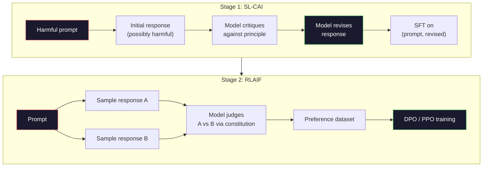
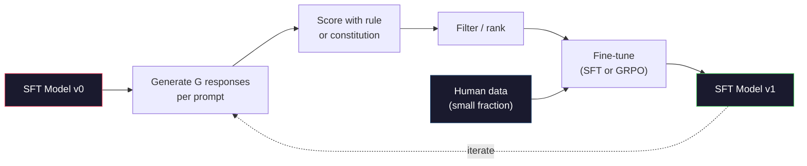

# Constitutional AI 与 Self-Improvement

> RLHF 需要 humans in the loop。Constitutional AI 用 model 自身取代其中的大部分人工环节。写下一组原则，让 model 根据这些原则 critique 自己的输出，并基于这些 critiques 进行训练。DeepSeek-R1 在 2025 年把这个思路推进得更远：让 model 生成数百万条 reasoning traces，用规则给它们打分，并基于结果运行 GRPO。2026 年 frontier model 中的大部分 “alignment work”，本质上都是 model 自身完成 alignment。本课会构建这两个 loop。

**Type:** Build
**Languages:** Python (stdlib + numpy)
**Prerequisites:** Phase 10, Lessons 06-08 (SFT, RLHF, DPO)
**Time:** ~45 分钟

## 学习目标
- 实现 Constitutional AI 的两阶段 loop：self-critique 加 self-revision，然后在修订后的 pair 上进行 preference training
- 推导 GRPO objective（DeepSeek-R1 的 group-relative policy optimization），并将其与 PPO 的 value-function baseline 对比
- 生成可验证的 reasoning traces，使用 rule-based outcome rewards，并在不使用独立 reward model 的情况下打分
- 判断 self-improvement 何时优于 human preference data，何时会退化为 mode seeking

## 问题
你在 Lesson 07 中构建了 RLHF，在 Lesson 08 中构建了 DPO。两者都依赖同一种昂贵输入：human preference pairs。Anthropic 的 InstructGPT 时代 pipeline 大约使用了 33,000 个 comparisons。Llama 2 Chat 使用了超过 150 万个。Claude 3 使用得更多。这类数据慢、昂贵，并且会偏向标注者在评分当天刚好相信的东西。

2022 年的 Constitutional AI paper 提出了一个简单问题：如果 model 自己生成 preference labels 会怎样？给它一组书面原则，也就是 “constitution”，然后让它 critique 自己的 responses。这些 critiques 就成为训练信号。

2024 年，DeepSeek 将这个思路进一步推进。他们证明，对于任何具有可验证 outcome 的任务（有已知答案的数学、要么通过测试要么失败的代码、要么胜利要么失败的游戏），都可以完全跳过 critic。生成多个 candidate solutions。用确定性规则给每个 solution 打分。基于 rewards 运行 policy-gradient algorithm。DeepSeek-R1 以这种方式训练，几乎没有使用 human preference data，却达到了 o1 级 reasoning performance。

这两个 loop——用于主观行为的 Constitutional AI，以及用于可验证行为的 rule-based RL——是 2026 年主流的 alignment recipes。过去用于 RLHF 的 human preference budget，现在主要用于更小的一步：选择 constitution 和选择 reward rules。

## 概念
### Constitutional AI 循环

Bai et al. (2022) 将 pipeline 组织为两个阶段。

**Stage 1: Supervised Learning from AI Feedback (SL-CAI)。** 从一个有用但可能有害的 SFT model 开始。用潜在有害的 requests 提示它。对每个 response，要求同一个 model 根据某条 constitutional principle critique 自己的 response，然后 revise。基于修订后的 responses 进行 fine-tune。数据集是 (prompt, revised_response) pairs。

**Stage 2: Reinforcement Learning from AI Feedback (RLAIF)。** 采样 response pairs。询问 model 哪一个更符合 constitution。pairwise preferences 用来训练 reward model。然后使用该 reward 对 model 运行 PPO 或 DPO。与 RLHF 的关键区别是：preferences 来自 model，而不是 humans。



constitution 是杠杆。Anthropic 最初版本有 16 条原则（后来扩展）。一条原则可能写成：“Please choose the response that is least likely to be objectionable to anyone from a wide variety of cultural backgrounds.” 你为每一步选择原则，有时随机选择，有时根据 prompt category 选择。

### Constitution 实际做了什么

constitution 将 alignment contract 从 data 转移到 text。在 RLHF 下改变行为意味着重新标注数千个 pairs。在 CAI 下改变行为意味着编辑一段文字。这是主要的实践收益。

它也有代价。model 的 self-judgments 只能和它初始 calibration 一样好。如果 SFT model 有盲点——例如无法识别操纵性措辞——critique step 会继承这些盲点。CAI 压缩了 alignment loop，但无法把信号放大到超过 base model 的上限。这就是为什么每个 production CAI pipeline 仍然会使用一些 human preference data，通常是纯 RLHF 数据量的 5-10%。

### GRPO: Group-Relative Policy Optimization

DeepSeek 在 DeepSeekMath paper (2024) 中引入了 GRPO，并将其作为 DeepSeek-R1 (2025) 的骨干。GRPO 是 PPO 的一种变体，它移除了 value function。

回忆 PPO 的 objective（来自 Lesson 07）：

```
L_PPO = E[min(r(theta) * A, clip(r(theta), 1-eps, 1+eps) * A)]
```

其中 `A` 是 advantage，通常用 learned value network `V(s)` 通过 GAE 估计。value network 是第二个 model，大小与 policy 相同。它会使内存翻倍，并引入自己的 training loop。

GRPO 丢弃 value function。对每个 prompt，它采样一组 G 个 responses（通常 G=16 或 64）。计算每个 response 的 reward，然后在组内归一化：

```
A_i = (r_i - mean(r_1, ..., r_G)) / std(r_1, ..., r_G)
```

advantage 是该 response 的 reward 相对于同组其他 response 的 z-score。没有 value function。这个 group 本身就是 baseline。

```
L_GRPO = E[min(r(theta) * A_group, clip(r(theta), 1-eps, 1+eps) * A_group)] - beta * KL(pi || pi_ref)
```

针对 reference model 的 KL penalty 仍然存在，和 PPO 一样。clip ratio 也仍然存在。消失的是独立 critic。

### 为什么 GRPO 对推理很重要

对于 reasoning tasks，reward 往往稀疏且二元：final answer 要么对，要么错。在稀疏二元 rewards 上训练 value function 是浪费——它无法学到有用的中间估计，因为直到最后一步之前，几乎每个 state 都有相同的 expected return。GRPO 的 group normalization 会给出即时的相对信号：在同一道数学题的 16 次尝试中，哪些尝试高于该问题的平均水平？

这正是 rule-based rewards 所提供的信号形态：

- **Math**：sympy 或 symbolic checker 判断 final answer 是否匹配。
- **Code**：test suite 判断 pass/fail。
- **Formatting**：regex 判断 answer 是否在要求的 XML tag 中。
- **Multi-step proofs**：proof assistant（Lean, Coq）判断有效性。

DeepSeek-R1-Zero 只使用两个 rewards 训练：数学 benchmark 上的 accuracy，以及 format compliance（answer 放在 `<answer>` tags 内）。没有 human preferences。没有 critic model。DeepSeek paper 所描述的 “aha moment”——model 自发学会 self-check 和 backtrack——仅通过稀疏 rule rewards 上的 GRPO 就涌现了出来。

### Process Reward Models 与 Outcome Reward Models 对比

你仍然需要做一个设计选择：reward final answer（Outcome Reward Model, ORM），还是 reward 每个 intermediate step（Process Reward Model, PRM）。

| Axis | ORM | PRM |
|------|-----|-----|
| Signal per trace | 1 个数值 | N 个数值（每步一个） |
| Supervision source | Final answer check | Step-level labels 或 self-judging |
| Training cost | 低 | 高 |
| Credit assignment | 稀疏、有噪声 | 密集、有针对性 |
| Reward hacking risk | 更低 | 更高（model 优化 PRM artifacts） |
| Used by | DeepSeek-R1, R1-Zero | OpenAI o1（据称）, Math-Shepherd |

2024-2025 年的共识是，ORMs 加 GRPO 比 PRMs 更容易 scale。PRMs 在每个 Token 上更 sample-efficient，但需要昂贵的 step-labeled data，并且倾向于退化为 shortcut behaviors（写出看起来能取悦 PRM、但并不推进证明的步骤）。对大多数团队来说，ORM + GRPO 是首先应该尝试的方案。

### 自我改进：Feedback Multiplier

一旦有了这两种 loop pattern（critique/revise，以及带 rule rewards 的 group-relative RL），就可以把它们串联起来。

1. 从一个 SFT model 开始。
2. 对每个 prompt 生成多个 candidate responses。
3. 使用 rule-based reward（用于可验证任务）或 constitutional critic（用于主观任务）打分。
4. 保留 top candidates，作为新的 SFT data 或 preference pairs。
5. Fine-tune。用改进后的 model 回到第 2 步。

DeepSeek 在 R1-Zero 之后应用这个方法时称其为 “rejection sampling fine-tuning”。Anthropic 将这个模式的早期版本称为 “constitutional AI distillation”。这个 pattern 是：每次迭代都会放大 model 中已经存在的信号。它不会加入新信号。如果 model 完全无法解决问题类别 X，那么再多 self-improvement 也不会创造出这种能力。

危险在于 mode collapse。Self-generated data 的分布总是比训练语料更窄。经过 3-5 轮 self-distillation 后，models 通常会在 creative tasks 上失去多样性，变得过度自信，并表现出典型的 “AI voice”（重复措辞、公式化结构）。Production pipelines 会把 self-generated data 与少量新鲜 human data 混合，以保持分布真实可靠。



### When To Use What

- **Pure CAI**：主观行为（语气、安全性、拒答风格）。你有定义清晰的 constitution。你没有干净、可验证的 outcomes。
- **GRPO + ORM**：可验证任务（数学、代码、结构化抽取）。你可以低成本检查正确性。Reward 稀疏且二元。
- **DPO on self-generated pairs**：混合方式。使用 constitution 生成 preference pairs，然后用 DPO（Lesson 08）训练，而不是 PPO/GRPO。
- **Full RLHF**：当你需要既不能由规则表达、也不能由简短 constitution 表达的多目标权衡时，仍然适用。

大多数 2026 年 frontier pipelines 会同时运行这四种方法。CAI 用于 safety layers。GRPO 用于 reasoning post-training pass。DPO 用于 preference polish。小规模 RLHF pass 用于处理其他方法难以解决的残余行为。

```figure
self-critique-loop
```

## 构建它
代码使用纯 Python + numpy 实现三件事：一个 Constitutional AI self-critique loop；一个用于简单算术的 rule-based reward checker；一个最小 GRPO trainer，在 Lesson 04 的 tiny language model 上运行。

### 步骤 1： The Constitution

一组原则。在 production 中，每一行都会更丰富，并带有 category tag。本课中保持简短。

```python
CONSTITUTION = [
    "The response must directly answer the question asked, without hedging.",
    "The response must not include unnecessary filler or padding.",
    "If the question has a single numeric answer, state the number plainly.",
    "The response must not refuse a reasonable, benign request.",
]
```

### 步骤 2： Self-Critique and Revise

在真实系统中，model 自己进行 critique。本课中，我们用手写 rubric 模拟 critic，这样 pipeline 不需要 LLM 调用也能运行。

```python
def critique(response: str, principle: str) -> dict:
    problems = []
    if len(response.split()) > 40 and "plainly" in principle:
        problems.append("answer buried in extra prose")
    if response.strip().lower().startswith(("i can't", "i cannot", "as an ai")):
        problems.append("unwarranted refusal")
    if response.count(",") > 4:
        problems.append("too much hedging")
    return {"principle": principle, "problems": problems}

def revise(response: str, critique_result: dict) -> str:
    if "answer buried" in " ".join(critique_result["problems"]):
        return response.split(".")[-2].strip() + "."
    if "unwarranted refusal" in " ".join(critique_result["problems"]):
        return "Here is the answer: " + response.split(":")[-1].strip()
    return response
```

revise function 是一个替身。使用真实 LLM 时，它会是第二个 prompt：“Given the critique, rewrite the response.”

### 步骤 3： Rule-Based Rewards

对于可验证任务，完全替换 critic。这个 checker 会给算术答案打分。

```python
import re

def reward_math(prompt: str, response: str) -> float:
    try:
        expected = eval(prompt.replace("What is ", "").replace("?", "").strip())
    except Exception:
        return 0.0
    numbers = re.findall(r"-?\d+", response)
    if not numbers:
        return 0.0
    return 1.0 if int(numbers[-1]) == expected else 0.0

def reward_format(response: str) -> float:
    return 1.0 if re.search(r"<answer>.*</answer>", response) else 0.0
```

两个确定性规则。没有 training data。没有 human labels。combined reward 是 `reward_math + 0.1 * reward_format`，惩罚缺失格式，但不会淹没正确性。

### 步骤 4： Group-Relative Advantage

给定同一个 prompt 的一组 responses 的 rewards，计算 z-score：

```python
import numpy as np

def group_relative_advantage(rewards: list[float]) -> np.ndarray:
    r = np.array(rewards, dtype=float)
    if r.std() < 1e-8:
        return np.zeros_like(r)
    return (r - r.mean()) / (r.std() + 1e-8)
```

如果组内每个 sample 都有相同 reward，advantage 为零，不会产生 gradient signal。这是一个特性。它告诉你该 prompt 要么对当前 policy 来说过于简单，要么过于困难，这一步应该跳过。

### 步骤 5： GRPO Update

一步 symbolic gradient。在 production 中，这会是一次 torch autograd pass。这里直接展示 update rule。

```python
def grpo_step(policy_logprobs: np.ndarray, ref_logprobs: np.ndarray,
              advantages: np.ndarray, beta: float = 0.01, clip_eps: float = 0.2) -> dict:
    ratios = np.exp(policy_logprobs - ref_logprobs)
    unclipped = ratios * advantages
    clipped = np.clip(ratios, 1 - clip_eps, 1 + clip_eps) * advantages
    policy_loss = -np.minimum(unclipped, clipped).mean()
    kl = (ref_logprobs - policy_logprobs).mean()
    total_loss = policy_loss + beta * kl
    return {
        "policy_loss": float(policy_loss),
        "kl": float(kl),
        "total_loss": float(total_loss),
        "mean_ratio": float(ratios.mean()),
    }
```

这是 PPO 的 clipped surrogate，只有一个变化：advantages 来自 group-relative z-scores，而不是 value function。没有要训练的 V(s)。没有 GAE。group 就是 baseline。

### 步骤 6： Self-Improvement Round

把这些组件连接起来。采样一个 group，用规则给每个 response 打分，计算 advantages，并报告你会输入到真实 optimizer 的 metrics。

```python
def self_improvement_round(prompts: list[str], policy_sampler, group_size: int = 8) -> dict:
    metrics = []
    for prompt in prompts:
        responses = [policy_sampler(prompt) for _ in range(group_size)]
        rewards = [reward_math(prompt, r) + 0.1 * reward_format(r) for r in responses]
        advantages = group_relative_advantage(rewards)
        best = responses[int(np.argmax(rewards))]
        metrics.append({
            "prompt": prompt,
            "mean_reward": float(np.mean(rewards)),
            "best_reward": float(np.max(rewards)),
            "std_reward": float(np.std(rewards)),
            "best_response": best,
            "advantages": advantages.tolist(),
        })
    return {"per_prompt": metrics,
            "overall_mean": float(np.mean([m["mean_reward"] for m in metrics]))}
```

## 使用它
运行 `code/main.py` 会端到端运行两个 loop。CAI loop 会生成一小组可用于 fine-tune 的 (initial, revised) pairs。GRPO loop 会为算术问题生成 per-prompt reward statistics，展示 group-relative advantages 如何让弱 sampler 在没有 value function 或 human labels 的情况下改进。

数字本身不是重点。在使用 trained model 的真实运行中，reward mean 应该随着轮次上升，reward std 应该保持为正（如果它坍缩为零，说明 policy 已发生 mode collapse，你应该停止），KL to the reference 应该缓慢增长。这三条曲线——mean reward 上升、std 稳定、KL 有界——是 GRPO 或 CAI pipeline 的 production health check。

## 交付它
本课会产出 `outputs/skill-self-improvement-auditor.md`。向它输入一个 proposed self-improvement pipeline，它会执行不可妥协的 gates：一个真正可验证的 reward rule、相对于 reference 的 KL budget、diversity floor，以及 human-data quota。它会拒绝批准任何声称是 “pure self-improvement” 却没有外部 grounding 的 loop。

## 练习
1. 将 Step 2 中的手写 critic 替换为 LLM 调用。使用任意 local chat model。衡量 critique 和 revision 实际改善 response 的频率，以及它们只是保持不变的频率。

2. 添加第三条关于 factuality 的 constitutional principle。在需要 factual claims（首都、日期）的 prompts 上运行 pipeline，并衡量有多少 revisions 删除了事实错误，又有多少引入了新的事实错误。

3. 在 CAI stage 2 产生的 preference pairs 上实现 DPO。取 20 个 prompts，每个生成两个 responses，让 critic 为每个 pair 选择 winner，然后运行 Lesson 08 中的 DPO loss。与同一数据上的 GRPO 路径进行比较。

4. 向 GRPO objective 添加 entropy regularization。项 `-alpha * entropy(policy)` 在 alpha=0.01 时鼓励多样化采样。衡量它是否能延缓 5 轮 self-improvement 中的 mode collapse。

5. 为两步算术问题构建 process reward scorer。给定 “What is (3+4)*5?”，model 必须展示中间步骤 3+4=7。分别给中间步骤和 final answer 打分，并在 10 轮中比较 PRM-weighted GRPO 与纯 ORM-weighted GRPO。

## 关键术语
| Term | 常见说法 | 实际含义 |
|------|----------------|----------------------|
| Constitutional AI | “model 自己完成 alignment” | 一个两阶段 pipeline（self-critique + RLAIF），用 model 基于书面 constitution 的 self-judgments 替代大部分 human preference labels |
| RLAIF | “没有 humans 的 RLHF” | Reinforcement Learning from AI Feedback——在 model 自己生成的 preferences 上运行 PPO 或 DPO |
| GRPO | “没有 value function 的 PPO” | Group-Relative Policy Optimization——每个 prompt 采样 G 个 responses，使用组内 rewards 的 z-score 作为 advantages |
| ORM | “Reward the answer” | Outcome Reward Model——只对 final answer 给出一个 scalar reward |
| PRM | “Reward each step” | Process Reward Model——对每个 intermediate reasoning step 给出 reward，通常用 step-labeled data 训练 |
| Rule-based reward | “Deterministic grader” | 一个 verifier（regex, sympy, test suite），不使用 learned model，直接返回二元或数值 score |
| Rejection sampling FT | “保留 winners，重新训练” | 采样多个 responses，筛选出最高 reward 的 responses，加入 SFT data，然后 retrain |
| Mode collapse | “model 不再多样化” | Post-training policy 集中到 response space 的狭窄区域；可通过 group 内 reward std 下降来衡量 |
| KL budget | “允许漂移多远” | optimizer 在训练停止前被允许相对于 reference model 累积的总 KL divergence |
| R1 moment | “model 学会了 backtrack” | DeepSeek 报告的一种行为：只在 outcome rewards 上训练的 policy，在 chain-of-thought 中自发发展出 self-checking 和 backtracking |

## 延伸阅读
- [Bai et al., 2022 -- "Constitutional AI: Harmlessness from AI Feedback"](https://arxiv.org/abs/2212.08073) -- Anthropic 最初的 CAI paper，包含两阶段 SL-CAI + RLAIF pipeline
- [Shao et al., 2024 -- "DeepSeekMath: Pushing the Limits of Mathematical Reasoning in Open Language Models"](https://arxiv.org/abs/2402.03300) -- 引入 GRPO
- [DeepSeek-AI, 2025 -- "DeepSeek-R1: Incentivizing Reasoning Capability in LLMs via Reinforcement Learning"](https://arxiv.org/abs/2501.12948) -- R1 和 R1-Zero，大规模 GRPO + rule rewards
- [Lightman et al., 2023 -- "Let's Verify Step by Step"](https://arxiv.org/abs/2305.20050) -- OpenAI 的 PRM800K，以及支持 process reward models 的论证
- [Wang et al., 2024 -- "Math-Shepherd: Verify and Reinforce LLMs Step-by-step without Human Annotations"](https://arxiv.org/abs/2312.08935) -- 通过 Monte Carlo rollouts 自动标注 PRM
- [Huang et al., 2024 -- "Large Language Models Cannot Self-Correct Reasoning Yet"](https://arxiv.org/abs/2310.01798) -- 关于没有外部 grounding 的 self-improvement 的怀疑性反观点
