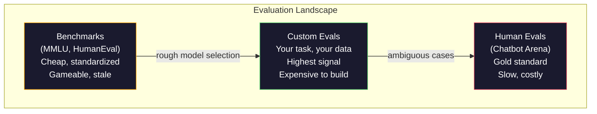
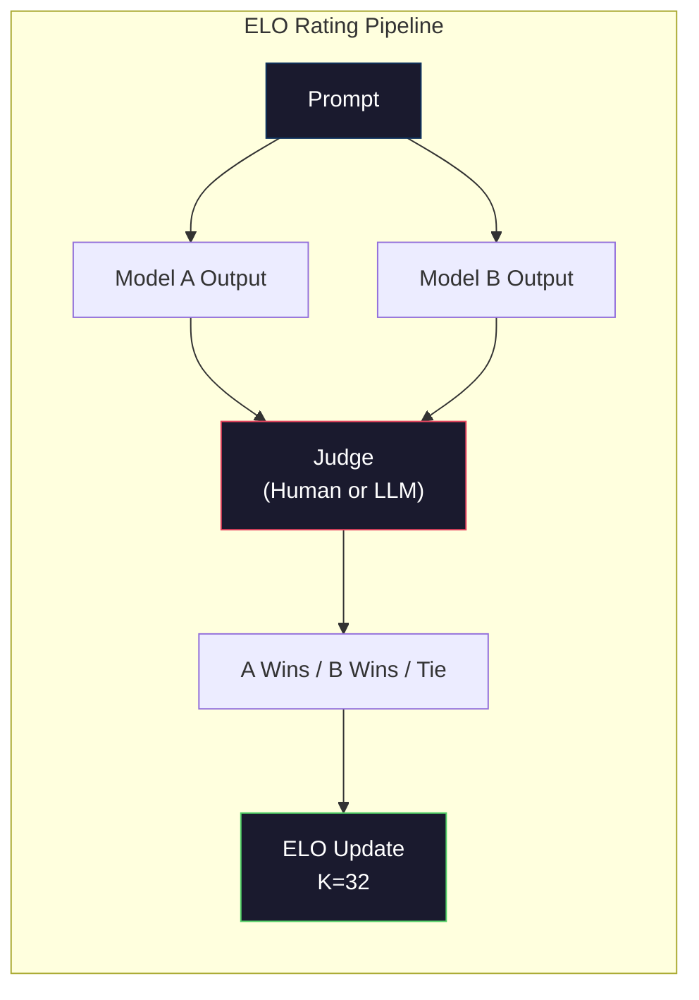

# Evaluation：Benchmarks、Evals、LM Harness

> Goodhart's Law：当一个指标变成目标时，它就不再是一个好指标。每个 frontier lab 都会针对 benchmarks 做优化。MMLU 分数上涨，但模型仍然无法可靠地数出 "strawberry" 里有几个 R。唯一重要的 eval 是你的 eval，针对你的任务，使用你的数据。

**Type:** Build
**Languages:** Python
**前置要求:** Phase 10，课程 01-05 (LLMs from Scratch)
**Time:** ~90 minutes

## 学习目标
- 构建一个自定义 evaluation harness，用于针对 language model 运行 multiple-choice 和 open-ended benchmarks
- 解释为什么标准 benchmarks（MMLU、HumanEval）会饱和，并且无法区分 frontier models
- 使用合适的 metrics 实现 task-specific evals：exact match、F1、BLEU 和 LLM-as-judge scoring
- 设计面向你特定 use case 的自定义 evaluation suite，而不是只依赖公开 leaderboards

## 问题
MMLU 于 2020 年发布，包含 57 个学科的 15,908 道题。三年内，frontier models 就让它饱和了。GPT-4 得分 86.4%。Claude 3 Opus 得分 86.8%。Llama 3 405B 得分 88.6%。leaderboard 被压缩到 3 分范围内，其中差异只是 statistical noise，而不是真实 capability gaps。

与此同时，这些模型会在一个 10 岁孩子不用思考就能完成的任务上失败。Claude 3.5 Sonnet 在 MMLU 上得分 88.7%，最初却无法数出 "strawberry" 中的字母数量。这个任务不需要任何 world knowledge，也不需要 reasoning，只需要 character-level iteration。HumanEval 使用 164 个问题测试 code generation。模型在其上得分超过 90%，但仍然会生成在边界情况上崩溃的代码，而任何初级开发者都能发现这些边界情况。

Benchmark performance 与现实世界 reliability 之间的差距，是 LLM evaluation 的核心问题。Benchmarks 只能告诉你模型在 benchmark 上表现如何。它们几乎无法告诉你这个模型在你的特定任务、你的特定数据、你的特定 failure modes 下会如何表现。如果你正在构建 customer support bot，MMLU 就无关紧要。如果你正在构建 code assistant，HumanEval 只覆盖 function-level generation，它对 debugging、refactoring 或跨文件解释代码没有任何说明。

你需要 custom evals。并不是因为 benchmarks 没用，benchmarks 对粗略的模型选择很有用，而是因为最终的 evaluation 必须精准匹配你的 deployment conditions。

## 概念
### The Eval Landscape

Evaluation 分为三类，每一类的成本和 signal quality 都不同。

**Benchmarks** 是标准化 test suites。MMLU、HumanEval、SWE-bench、MATH、ARC、HellaSwag。你让模型跑 benchmark，然后得到一个分数。优势是：所有人使用同一个测试，因此可以比较模型。劣势是：模型和训练数据越来越容易污染这些 benchmarks。Labs 会在包含 benchmark 问题的数据上训练。分数上涨，但 capability 未必提升。

**Custom evals** 是你为自己的特定 use case 构建的 test suites。你定义 inputs、expected outputs 和 scoring function。法律文档 summarizer 要在法律文档上 evaluation。SQL generator 要在你的 database schema 上 evaluation。这些 evals 创建成本高，但它们是唯一能够预测 production performance 的 evaluation。

**Human evals** 使用付费 annotators，根据 helpfulness、correctness、fluency 和 safety 等标准评判模型输出。对于 automated scoring 失效的 open-ended tasks，这是 gold standard。Chatbot Arena 已收集了 100+ models 的超过 200 万个人类 preference votes。缺点是：成本（每次 judgment $0.10-$2.00）和速度（数小时到数天）。



### Why Benchmarks Break

三种机制会导致 benchmark 分数不再反映真实 capability。

**Data contamination。** 训练语料会抓取互联网。Benchmark 问题也在互联网上。模型在训练期间看到了答案。这不是传统意义上的作弊，labs 并不是有意包含 benchmark 数据。但 web-scale scraping 使得排除它们几乎不可能。

**Teaching to the test。** Labs 会针对 benchmark performance 优化训练混合数据。如果训练混合数据中有 5% 是 MMLU-style multiple choice，模型就会学会这种格式和答案分布。MMLU 是 4-way multiple choice。模型会学到答案分布在 A/B/C/D 上大致均匀，即便模型不知道答案，这也有帮助。

**Saturation。** 当每个 frontier model 在一个 benchmark 上都能得 85-90% 时，这个 benchmark 就停止了区分能力。剩下 10-15% 的问题可能是 ambiguous、标注错误，或者需要冷门 domain knowledge。MMLU 从 87% 提升到 89%，可能意味着模型又记住了两道冷门题，而不是变得更聪明。

### Perplexity: 快速健康检查

Perplexity 衡量模型对一串 tokens 有多意外。形式上，它是平均负 log-likelihood 的指数：

```
PPL = exp(-1/N * sum(log P(token_i | context)))
```

Perplexity 为 10 表示模型在平均意义上，就像在每个 token 位置从 10 个选项中均匀选择一样不确定。越低越好。GPT-2 在 WikiText-103 上的 perplexity 约为 30。GPT-3 约为 20。Llama 3 8B 约为 7。

Perplexity 对于在同一个 test set 上比较模型很有用，但它有盲点。模型可以通过善于预测常见模式而获得低 perplexity，同时却非常不擅长罕见但重要的模式。它也无法说明 instruction following、reasoning 或 factual accuracy。把它作为 sanity check，而不是最终结论。

### LLM-as-Judge

使用强模型来 evaluation 弱模型的输出。想法很简单：让 GPT-4o 或 Claude Sonnet 按 1-5 分评价 response 的 correctness、helpfulness 和 safety。使用 GPT-4o-mini 时，每次 judgment 成本约 $0.01，并且与人类 judgment 的相关性出人意料地高，大多数任务约有 80% agreement。

Scoring prompt 比模型本身更重要。模糊 prompt（"Rate this response"）会产生噪声分数。带 rubric 的结构化 prompt（"如果答案事实正确并引用来源则给 5 分，如果正确但没有来源则给 4 分，如果部分正确则给 3 分..."）会产生一致、可复现的分数。

Failure modes：judge models 会表现出 position bias（在 pairwise comparisons 中偏好第一个 response）、verbosity bias（偏好更长的 responses）和 self-preference（GPT-4 对 GPT-4 outputs 的评分高于等价的 Claude outputs）。缓解方法：随机化顺序、按长度归一化、使用不同于被 evaluation 模型的 judge。

### 基于成对比较的 ELO Ratings

这是 Chatbot Arena 的方法。向同一个 prompt 展示来自不同模型的两个 responses。人类（或 LLM judge）选择更好的一个。通过成千上万次这样的 comparisons，为每个模型计算 ELO rating，也就是国际象棋中使用的同一套系统。

ELO 的优势：relative ranking 比 absolute scoring 更可靠，能优雅处理 ties，并且比独立给每个输出打分需要更少 comparisons 就能收敛。截至 2026 年初，Chatbot Arena 排名显示 GPT-4o、Claude 3.5 Sonnet 和 Gemini 1.5 Pro 在榜首彼此相差不到 20 ELO points。



### Eval Frameworks

**lm-evaluation-harness**（EleutherAI）：标准的 open-source eval framework。支持 200+ benchmarks。用一条命令即可让任意 Hugging Face 模型跑 MMLU、HellaSwag、ARC 等。Open LLM Leaderboard 使用它。

**RAGAS**：专门用于 RAG pipelines 的 evaluation framework。衡量 faithfulness（答案是否匹配 retrieved context？）、relevance（retrieved context 是否与问题相关？）和 answer correctness。

**promptfoo**：用于 prompt engineering 的 config-driven eval。在 YAML 中定义 test cases，针对多个模型运行，获得 pass/fail report。适合 prompts 的 regression testing，确保 prompt change 不会破坏已有 test cases。

### Building Custom Evals

这是对 production 唯一重要的 eval。流程如下：

1. **Define the task。** 模型到底应该做什么？要精确。"Answer questions" 太模糊。"Given a customer complaint email, extract the product name, issue category, and sentiment" 才是一个可以 evaluation 的任务。

2. **Create test cases。** Prototype eval 至少 50 个，production 至少 200 个。每个 test case 是一个 (input, expected_output) 对。包含 edge cases：空输入、adversarial inputs、ambiguous inputs、其他语言的 inputs。

3. **Define scoring。** Structured outputs 使用 exact match。文本相似度使用 BLEU/ROUGE。Open-ended quality 使用 LLM-as-judge。Extraction tasks 使用 F1。用权重组合多个 metrics。

4. **Automate。** 每个 eval 都能用一条命令运行。没有手动步骤。以支持随时间比较的格式存储结果。

5. **Track over time。** 单独一个 eval score 没有意义。你需要 trendline。上一次 prompt change 后分数是否提升？切换模型后是否回退？把 eval 与 prompts 一起 version。

| Eval Type | 每次 judgment 成本 | 与人类的一致性 | 最适合 |
|-----------|------------------|----------------------|----------|
| Exact match | ~$0 | 100%（适用时） | Structured output、classification |
| BLEU/ROUGE | ~$0 | ~60% | Translation、summarization |
| LLM-as-judge | ~$0.01 | ~80% | Open-ended generation |
| Human eval | $0.10-$2.00 | N/A（即 ground truth） | Ambiguous、high-stakes tasks |


```figure
perplexity-loss
```

## 构建它
### 步骤 1：最小 Eval 框架

定义核心 abstractions。一个 eval case 有 input、expected output 和可选的 metadata dict。一个 scorer 接收 prediction 和 reference，并返回 0 到 1 之间的分数。

```python
import json
from collections import Counter

class EvalCase:
    def __init__(self, input_text, expected, metadata=None):
        self.input_text = input_text
        self.expected = expected
        self.metadata = metadata or {}

class EvalSuite:
    def __init__(self, name, cases, scorers):
        self.name = name
        self.cases = cases
        self.scorers = scorers

    def run(self, model_fn):
        results = []
        for case in self.cases:
            prediction = model_fn(case.input_text)
            scores = {}
            for scorer_name, scorer_fn in self.scorers.items():
                scores[scorer_name] = scorer_fn(prediction, case.expected)
            results.append({
                "input": case.input_text,
                "expected": case.expected,
                "prediction": prediction,
                "scores": scores,
            })
        return results
```

### 步骤 2： Scoring Functions

构建 exact match、token F1 和一个模拟的 LLM-as-judge scorer。

```python
def exact_match(prediction, expected):
    return 1.0 if prediction.strip().lower() == expected.strip().lower() else 0.0

def token_f1(prediction, expected):
    pred_tokens = set(prediction.lower().split())
    exp_tokens = set(expected.lower().split())
    if not pred_tokens or not exp_tokens:
        return 0.0
    common = pred_tokens & exp_tokens
    precision = len(common) / len(pred_tokens)
    recall = len(common) / len(exp_tokens)
    if precision + recall == 0:
        return 0.0
    return 2 * (precision * recall) / (precision + recall)

def llm_judge_simulated(prediction, expected):
    pred_words = set(prediction.lower().split())
    exp_words = set(expected.lower().split())
    if not exp_words:
        return 0.0
    overlap = len(pred_words & exp_words) / len(exp_words)
    length_penalty = min(1.0, len(prediction) / max(len(expected), 1))
    return round(overlap * 0.7 + length_penalty * 0.3, 3)
```

### 步骤 3： ELO Rating System

使用 ELO updates 实现 pairwise comparisons。这正是 Chatbot Arena 用来对模型排名的系统。

```python
class ELOTracker:
    def __init__(self, k=32, initial_rating=1500):
        self.ratings = {}
        self.k = k
        self.initial_rating = initial_rating
        self.history = []

    def _ensure_player(self, name):
        if name not in self.ratings:
            self.ratings[name] = self.initial_rating

    def expected_score(self, rating_a, rating_b):
        return 1 / (1 + 10 ** ((rating_b - rating_a) / 400))

    def record_match(self, player_a, player_b, outcome):
        self._ensure_player(player_a)
        self._ensure_player(player_b)

        ea = self.expected_score(self.ratings[player_a], self.ratings[player_b])
        eb = 1 - ea

        if outcome == "a":
            sa, sb = 1.0, 0.0
        elif outcome == "b":
            sa, sb = 0.0, 1.0
        else:
            sa, sb = 0.5, 0.5

        self.ratings[player_a] += self.k * (sa - ea)
        self.ratings[player_b] += self.k * (sb - eb)

        self.history.append({
            "a": player_a, "b": player_b,
            "outcome": outcome,
            "rating_a": round(self.ratings[player_a], 1),
            "rating_b": round(self.ratings[player_b], 1),
        })

    def leaderboard(self):
        return sorted(self.ratings.items(), key=lambda x: -x[1])
```

### 步骤 4： Perplexity Calculation

使用 token probabilities 计算 perplexity。实践中，你会从模型 logits 中获得这些值。这里我们用概率分布模拟。

```python
import numpy as np

def perplexity(log_probs):
    if not log_probs:
        return float("inf")
    avg_neg_log_prob = -np.mean(log_probs)
    return float(np.exp(avg_neg_log_prob))

def token_log_probs_simulated(text, model_quality=0.8):
    np.random.seed(hash(text) % 2**31)
    tokens = text.split()
    log_probs = []
    for i, token in enumerate(tokens):
        base_prob = model_quality
        if len(token) > 8:
            base_prob *= 0.6
        if i == 0:
            base_prob *= 0.7
        prob = np.clip(base_prob + np.random.normal(0, 0.1), 0.01, 0.99)
        log_probs.append(float(np.log(prob)))
    return log_probs
```

### 步骤 5： Aggregate Results

计算一次 eval run 的 summary statistics：mean、median、threshold 下的 pass rate，以及按 metric 的 breakdowns。

```python
def summarize_results(results, threshold=0.8):
    all_scores = {}
    for r in results:
        for metric, score in r["scores"].items():
            all_scores.setdefault(metric, []).append(score)

    summary = {}
    for metric, scores in all_scores.items():
        arr = np.array(scores)
        summary[metric] = {
            "mean": round(float(np.mean(arr)), 3),
            "median": round(float(np.median(arr)), 3),
            "std": round(float(np.std(arr)), 3),
            "min": round(float(np.min(arr)), 3),
            "max": round(float(np.max(arr)), 3),
            "pass_rate": round(float(np.mean(arr >= threshold)), 3),
            "n": len(scores),
        }
    return summary

def print_summary(summary, suite_name="Eval"):
    print(f"\n{'=' * 60}")
    print(f"  {suite_name} Summary")
    print(f"{'=' * 60}")
    for metric, stats in summary.items():
        print(f"\n  {metric}:")
        print(f"    Mean:      {stats['mean']:.3f}")
        print(f"    Median:    {stats['median']:.3f}")
        print(f"    Std:       {stats['std']:.3f}")
        print(f"    Range:     [{stats['min']:.3f}, {stats['max']:.3f}]")
        print(f"    Pass rate: {stats['pass_rate']:.1%} (threshold >= 0.8)")
        print(f"    N:         {stats['n']}")
```

### 步骤 6： Run the Full Pipeline

把所有内容连接起来。定义一个任务，创建 test cases，模拟两个模型，运行 evals，从 pairwise comparisons 计算 ELO，并打印 leaderboard。

```python
def demo_model_good(prompt):
    responses = {
        "What is the capital of France?": "Paris",
        "What is 2 + 2?": "4",
        "Who wrote Hamlet?": "William Shakespeare",
        "What language is PyTorch written in?": "Python and C++",
        "What is the boiling point of water?": "100 degrees Celsius",
    }
    return responses.get(prompt, "I don't know")

def demo_model_bad(prompt):
    responses = {
        "What is the capital of France?": "Paris is the capital city of France",
        "What is 2 + 2?": "The answer is four",
        "Who wrote Hamlet?": "Shakespeare",
        "What language is PyTorch written in?": "Python",
        "What is the boiling point of water?": "212 Fahrenheit",
    }
    return responses.get(prompt, "Unknown")

cases = [
    EvalCase("What is the capital of France?", "Paris"),
    EvalCase("What is 2 + 2?", "4"),
    EvalCase("Who wrote Hamlet?", "William Shakespeare"),
    EvalCase("What language is PyTorch written in?", "Python and C++"),
    EvalCase("What is the boiling point of water?", "100 degrees Celsius"),
]

suite = EvalSuite(
    name="General Knowledge",
    cases=cases,
    scorers={
        "exact_match": exact_match,
        "token_f1": token_f1,
        "llm_judge": llm_judge_simulated,
    },
)

results_good = suite.run(demo_model_good)
results_bad = suite.run(demo_model_bad)

print_summary(summarize_results(results_good), "Model A (concise)")
print_summary(summarize_results(results_bad), "Model B (verbose)")
```

"good" 模型给出精确答案。"bad" 模型给出冗长的 paraphrases。Exact match 会严重惩罚冗长模型。Token F1 和 LLM-as-judge 更宽容。这说明为什么 metric choice 很重要：同一个模型看起来很强还是很差，取决于你如何 scoring。

### 步骤 7： ELO Tournament

在多个 rounds 中运行模型之间的 pairwise comparisons。

```python
elo = ELOTracker(k=32)

for case in cases:
    pred_a = demo_model_good(case.input_text)
    pred_b = demo_model_bad(case.input_text)

    score_a = token_f1(pred_a, case.expected)
    score_b = token_f1(pred_b, case.expected)

    if score_a > score_b:
        outcome = "a"
    elif score_b > score_a:
        outcome = "b"
    else:
        outcome = "tie"

    elo.record_match("model_a_concise", "model_b_verbose", outcome)

print("\nELO Leaderboard:")
for name, rating in elo.leaderboard():
    print(f"  {name}: {rating:.0f}")
```

### 步骤 8： Perplexity Comparison

比较不同质量水平的“模型”的 perplexity。

```python
test_text = "The quick brown fox jumps over the lazy dog in the garden"

for quality, label in [(0.9, "Strong model"), (0.7, "Medium model"), (0.4, "Weak model")]:
    log_probs = token_log_probs_simulated(test_text, model_quality=quality)
    ppl = perplexity(log_probs)
    print(f"  {label} (quality={quality}): perplexity = {ppl:.2f}")
```

## 使用它
### lm-evaluation-harness (EleutherAI)

在任意模型上运行 benchmarks 的标准工具。

```python
# pip install lm-eval
# Command line:
# lm_eval --model hf --model_args pretrained=meta-llama/Llama-3.1-8B --tasks mmlu --batch_size 8

# Python API:
# import lm_eval
# results = lm_eval.simple_evaluate(
#     model="hf",
#     model_args="pretrained=meta-llama/Llama-3.1-8B",
#     tasks=["mmlu", "hellaswag", "arc_easy"],
#     batch_size=8,
# )
# print(results["results"])
```

### promptfoo

用于 prompt engineering 的 config-driven eval。在 YAML 中定义 tests，并针对多个 providers 运行。

```yaml
# promptfoo.yaml
providers:
  - openai:gpt-4o-mini
  - anthropic:claude-3-haiku

prompts:
  - "Answer in one word: {{question}}"

tests:
  - vars:
      question: "What is the capital of France?"
    assert:
      - type: contains
        value: "Paris"
  - vars:
      question: "What is 2 + 2?"
    assert:
      - type: equals
        value: "4"
```

### RAGAS for RAG evaluation

```python
# pip install ragas
# from ragas import evaluate
# from ragas.metrics import faithfulness, answer_relevancy, context_precision
#
# result = evaluate(
#     dataset,
#     metrics=[faithfulness, answer_relevancy, context_precision],
# )
# print(result)
```

RAGAS 衡量通用 evals 会遗漏的内容：模型答案是否基于 retrieved context，而不仅仅是在抽象意义上是否“正确”。

## 交付它
本课会产出 `outputs/prompt-eval-designer.md`，这是一个可复用 prompt，用于为任意任务设计 custom eval suites。给它一个 task description，它会生成 test cases、scoring functions 和 pass/fail threshold 建议。

它还会产出 `outputs/skill-llm-evaluation.md`，这是一个 decision framework，用于根据你的 task type、budget 和 latency requirements 选择合适的 evaluation strategy。

## 练习
1. 添加一个 "consistency" scorer：用相同 input 让模型运行 5 次，并衡量 outputs 匹配的频率。Deterministic inputs 上的不一致答案会暴露脆弱的 prompts 或过高的 temperature settings。

2. 扩展 ELO tracker，使其支持多个 judge functions（exact match、F1、LLM-as-judge）并为它们加权。比较当你大幅提高 exact match 权重与大幅提高 F1 权重时，leaderboard 会如何变化。

3. 为一个具体任务构建 eval suite：将 emails classification 到 5 个类别。创建 100 个 test cases，包含多样示例和 edge cases（可能属于多个类别的 emails、空 emails、其他语言的 emails）。衡量不同“模型”（rule-based、keyword matching、simulated LLM）的表现。

4. 实现 contamination detection：给定一组 eval questions 和一个 training corpus，检查有多少比例的 eval questions（或接近的 paraphrases）出现在 training data 中。这就是 researchers 审计 benchmark validity 的方式。

5. 构建一个 "model diff" tool。给定两个模型版本的 eval results，高亮哪些具体 test cases 提升了，哪些回退了，哪些保持不变。这是 eval 版本的 code diff，对于理解一个 change 是有帮助还是有伤害至关重要。

## 关键术语
| Term | 人们的说法 | 它实际上的含义 |
|------|----------------|----------------------|
| MMLU | "The benchmark" | Massive Multitask Language Understanding，包含 57 个学科的 15,908 道 multiple choice questions，到 2025 年已在 88% 以上饱和 |
| HumanEval | "Code eval" | OpenAI 的 164 个 Python function-completion problems，只测试 isolated function generation |
| SWE-bench | "Real coding eval" | 来自 12 个 Python repos 的 2,294 个 GitHub issues，衡量包括 test generation 在内的 end-to-end bug fixing |
| Perplexity | "How confused the model is" | exp(-avg(log P(token_i given context)))，越低表示模型给实际 tokens 分配的概率越高 |
| ELO rating | "Chess ranking for models" | 根据 pairwise win/loss records 计算的 relative skill rating，Chatbot Arena 用它对 100+ models 排名 |
| LLM-as-judge | "Using AI to grade AI" | 强模型按照 rubric 评价弱模型 outputs，与人类 judges 约 80% agreement，成本约 $0.01/judgment |
| Data contamination | "The model saw the test" | Training data 包含 benchmark questions，在不提升真实 capability 的情况下抬高分数 |
| Eval suite | "A bunch of tests" | 一个 versioned collection，由 (input, expected_output, scorer) triples 组成，用于衡量特定 capability |
| Pass rate | "What percentage it gets right" | Eval cases 中得分超过阈值的比例，比 mean score 更可操作，因为它衡量 reliability |
| Chatbot Arena | "Model ranking website" | LMSYS 平台，拥有 2M+ human preference votes，并通过 ELO ratings 生成最可信的 LLM leaderboard |

## 延伸阅读
- [Hendrycks et al., 2021 -- "Measuring Massive Multitask Language Understanding"](https://arxiv.org/abs/2009.03300) -- MMLU paper，尽管已饱和，仍是引用最多的 LLM benchmark
- [Chen et al., 2021 -- "Evaluating Large Language Models Trained on Code"](https://arxiv.org/abs/2107.03374) -- OpenAI 的 HumanEval paper，确立了 code generation evaluation methodology
- [Zheng et al., 2023 -- "Judging LLM-as-a-Judge"](https://arxiv.org/abs/2306.05685) -- 对使用 LLMs evaluation LLMs 的系统分析，包括 position bias 和 verbosity bias 发现
- [LMSYS Chatbot Arena](https://chat.lmsys.org/) -- crowdsourced model comparison platform，拥有 2M+ votes，是最可信的现实世界 LLM ranking
