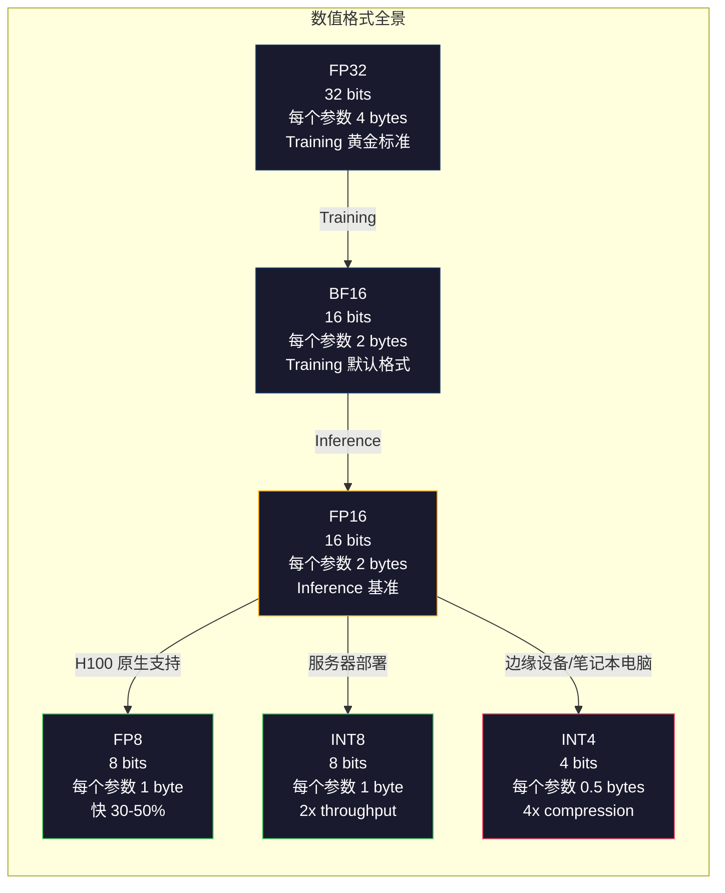
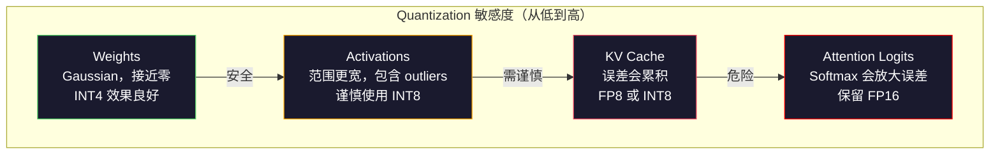
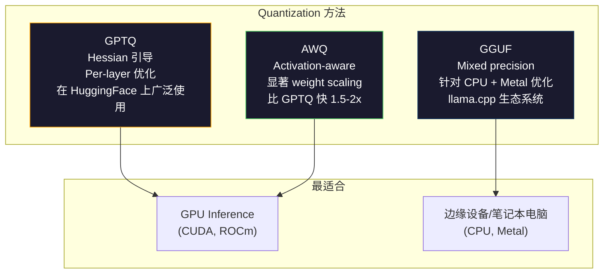

# Quantization：让 Model 装得下

> 一个 70B Model 使用 FP16 时需要 140GB。仅加载 weights 就需要两张 A100。Quantization 到 FP8：一张 80GB GPU。INT4：一台 MacBook。

**Type:** Build
**Languages:** Python (with numpy)
**Prerequisites:** Phase 10, Lessons 01-10 (LLMs from Scratch)
**Time:** ~120 分钟

## 学习目标

- 实现从 FP16 到 INT8 和 INT4 的对称与非对称 Quantization，包括 per-tensor 和 per-channel scaling
- 计算 Quantization 节省的内存，并判断哪种精度适合指定 GPU 的 VRAM
- 解释 post-training quantization (PTQ) 与 quantization-aware training (QAT) 的区别
- 使用 GPTQ 或 AWQ 对真实 Model 进行 Quantization，并在 benchmark 上衡量准确率与内存之间的权衡

## 问题

Llama 3 70B 有 700 亿个参数。每个参数都是一个 16-bit floating point number。也就是 1400 亿字节，140GB。一张 A100 有 80GB VRAM。仅靠一张 GPU，你甚至无法加载 weights，更不用说运行 Inference。仅为了托管一个 Model，你就需要两张每小时 2 美元的 A100。

但每个参数使用 16 bit 非常浪费。Neural Network 中的大多数 weights 都聚集在零附近。FP16 的完整动态范围（从 0.000000059 到 65,504）几乎完全没有被利用。如果测量 Llama 3 70B 中 weights 的实际分布，会发现其中 95% 位于 -0.1 到 +0.1 之间。你正在花费 16 bit 表示本可用 4 bit 容纳的值。

Quantization 会用较低精度的数值替代高精度数值。从 FP16 转换到 FP8 可将内存减半。从 FP16 转换到 INT4 可将内存降至四分之一。这个 140GB 的 Model 会变成 35GB，可以装入单张消费级 GPU。进一步压缩到 2-bit Quantization（激进、有损，但对某些任务仍然可用），同一个 Model 就能在 16GB 笔记本电脑上运行。

代价是准确率。每移除一个 bit 都会破坏一部分信息。问题在于会损失多少准确率，以及损失发生在哪里。经过良好 Quantization 的 INT4 Model，在大多数 benchmark 上可以保留原始 Model 95-99% 的质量。朴素地进行 INT4 Quantization 则可能彻底毁掉 Model。两者之间的差异来自技术。

社区使用 GPTQ 制作的 Llama 3 INT4 Quantization 版本，在 WikiText 上大约损失 1-2 个 perplexity 点。Mistral 发布了 Mixtral 8x22B 的 FP8 Checkpoint，在 MMLU 上没有可测量的质量损失。GGUF 格式为 llama.cpp 提供支持，使 70B Model 能够在搭载 M 系列芯片的 MacBook 上运行。Quantization 不是权宜之计，而是所有大于 7B 的 Model 的标准部署路径。

## 核心概念

### 数值格式：每个 bit 的作用

每个 floating-point number 都包含三个部分：sign、exponent 和 mantissa（也称 significand）。sign 占一个 bit。exponent 决定范围，也就是数值能有多大或多小。mantissa 决定精度，也就是可以保留多少位小数。

```text
FP32:  [1 sign] [8 exponent] [23 mantissa]  = 32 bits
FP16:  [1 sign] [5 exponent] [10 mantissa]  = 16 bits
BF16:  [1 sign] [8 exponent] [7  mantissa]  = 16 bits
FP8:   [1 sign] [4 exponent] [3  mantissa]  = 8  bits (E4M3)
FP8:   [1 sign] [5 exponent] [2  mantissa]  = 8  bits (E5M2)
INT8:  [1 sign] [7 value]                   = 8  bits (uniform steps)
INT4:  [1 sign] [3 value]                   = 4  bits (16 levels total)
```

**FP32** 是 full precision。23 个 mantissa bit 可提供大约 7 位十进制精度。范围大约是 1.2 x 10^-38 到 3.4 x 10^38。过去 Training 完全使用 FP32。现在进行累加时仍会使用它，例如 Matrix multiplication 中的连续求和。

**FP16** 将 bit 数减半。10 个 mantissa bit 可提供大约 3.3 位十进制精度。exponent 缩减到 5 bit，使数值范围大幅缩小，最大值约为 65,504。这对于聚集在零附近的 weights 没有问题，但对于 Training 期间可能突然增大的 activations 和 gradients 来说很危险。FP16 Training 需要进行 loss scaling 以防止 underflow。

**BF16** (Brain Float 16) 保留 FP32 的 8-bit exponent，但将 mantissa 缩减到 7 bit。它拥有与 FP32 相同的范围，但精度低于 FP16。Google 专门为 Deep Learning 设计了这种格式。其直觉是：对于 Neural Network，范围比精度更重要。一个值为 10^-20、在 FP16 中会 underflow 为零的 Gradient，在 BF16 中仍可保留。一个值为 0.07342、在 BF16 中舍入为 0.0734 的 weight 已经足够接近。现代 Training 任务都会使用 BF16，或混合使用 BF16/FP32。

**FP8** 有两种形式。E4M3（4 个 exponent bit、3 个 mantissa bit）用于 Inference 期间的 weights 和 activations。E5M2（5 个 exponent bit、2 个 mantissa bit）用于 Training 期间的 gradients，因为此时范围比精度更重要。在 H100 GPU 上进行 FP8 Inference，相较 FP16 可获得 30-50% 的加速，而质量损失可以忽略。

**INT8** 是一种 integer 格式。没有 exponent，也没有 mantissa，只有从 -128 到 127 的 256 个等距数值。你需要使用 scale factor 将 floating-point weights 映射到这个范围。它的优势是 integer arithmetic 比 floating-point arithmetic 更快，也更节能。在 A100 上，INT8 Matrix multiplication 可达到 624 TOPS，而 FP16 为 312 TFLOPS。

**INT4** 更进一步，只有 16 个可能值。scale factor 承担了关键工作。质量完全取决于如何选择 scale，以及对哪些 weights 进行 Quantization。当前最先进的 INT4 方法（GPTQ、AWQ）可以保留原始 Model 95% 以上的质量。



### Quantization 的工作原理

核心操作很简单。获取一个由 floating-point value 组成的 Tensor，找到 scale factor，执行乘法，舍入到最近的 integer，然后存储这些 integer 以及 scale factor。

**Quantize：**

```text
scale = max(abs(tensor)) / max_int_value
quantized = round(tensor / scale)
```

**Dequantize：**

```text
reconstructed = quantized * scale
```

对于使用对称范围（-127 到 127）的 INT8：

```text
scale = max(abs(tensor)) / 127
quantized = clamp(round(tensor / scale), -128, 127)
```

误差来自舍入。每个值最多会偏离 `scale / 2`。整个 layer 中的总误差取决于 weights 的数量，以及 Model 对这些 weights 扰动的敏感程度。

**Per-tensor 与 per-channel quantization。** Per-tensor 对整个 weight Matrix 使用一个 scale factor。它很简单，但损失较大：如果某一列包含较大值，而另一列包含较小值，较小值就会损失大部分精度。Per-channel 为每个输出 channel（weight Matrix 的每行或每列）使用一个 scale factor。它的额外开销更大，因为需要存储 N 个 scale factor 而不是 1 个，但质量会显著提升。所有生产级 Quantization 方法都会采用 per-channel 或更细粒度的方式。

**Asymmetric quantization** 会增加 zero-point offset：`quantized = round(tensor / scale) + zero_point`。它可以处理不以零为中心的分布。例如，ReLU activations 始终非负。Symmetric quantization 会把一半 integer 范围浪费在永远不会出现的负值上。Asymmetric quantization 会将实际范围 [min, max] 映射到完整的 integer 范围。

### 敏感度层级

Model 中的不同部分对 Quantization 的耐受程度并不相同，其中存在明确的层级。

**Weights（最稳健）。** Model weights 在 Training 期间变化缓慢，并且大致服从以零为中心的 Gaussian 分布，因此非常适合进行 Quantization。使用 per-channel scale 的 INT8 weights 几乎可以实现无损结果。INT4 需要更复杂的方法，但同样可行。

**Activations（中等敏感）。** Activations 是 Inference 期间流经网络的中间值。它们的动态范围比 weights 更宽，并且包含 outliers。单个 Attention head 可能产生比平均值大 100 倍的 activation value。这些 outliers 对 Model 质量至关重要。朴素地对它们进行 Quantization 会破坏信息。解决方案包括：以更高精度保留 outlier channels（LLM.int8()），或使用 per-token、per-channel activation scale。

**KV cache（高度敏感）。** key-value cache 存储所有先前 Token 的 Attention state。在较长 Context 下，KV cache 会成为主要的内存占用。对于一个 Context 长度为 32K 的 70B Model，仅 FP16 KV cache 就需要 40GB。将 KV cache Quantization 到 FP8 或 INT8 可以节省大量内存，但任何误差都会在之后所有 Attention 计算中不断累积。质量影响会随序列长度增加。

**Attention logits（最敏感）。** Attention 中的 softmax 对输入的微小变化非常敏感。pre-softmax logit 中仅 0.01 的 Quantization error，就可能显著改变 Attention 分布。即使其他部分都经过 Quantization，大多数 Quantization 方案仍会用较高精度（FP16 或 BF16）执行 Attention 计算。



### PTQ 与 QAT

**Post-Training Quantization (PTQ)** 对已经完成 Training 的 Model 进行 Quantization，不需要重新 Training。你只需获取 FP16 weights、计算 scale factor、执行舍入，然后进行部署。整个过程快速而廉价，通常只需几分钟到几小时。它非常适合 INT8 和 FP8。对于 INT4，朴素 PTQ 的效果通常很差，因为舍入误差会不断累积。高级 PTQ 方法（GPTQ、AWQ）会使用 calibration data 来尽量减小 Quantization error。

**Quantization-Aware Training (QAT)** 会在 Training 期间向 forward pass 插入模拟 Quantization 操作。Model 会学习将 weights 放置在舍入误差较小的位置。Gradients 通过 straight-through estimator (STE) 穿过模拟 Quantization：假装舍入操作的 Gradient 为 1。QAT 生成的 INT4 和 INT2 Model 比 PTQ 更好，但需要完成一次完整的 Training。Google 使用 QAT 高效托管 Gemini。Meta 也在部分 Llama 部署目标中使用了 QAT。

| 方面 | PTQ | QAT |
|--------|-----|-----|
| 成本 | 几分钟到几小时 | 一次完整的 Training |
| INT8 质量 | 极佳（损失 < 0.1%） | 极佳 |
| INT4 质量 | 使用 GPTQ/AWQ 时良好（损失 1-3%） | 更好（损失 < 1%） |
| INT2 质量 | 较差 | 对某些任务可用 |
| Calibration data | 128-1024 个样本 | 完整 Training Dataset |
| 使用时机 | 部署、迭代 | 在低 bit-width 下追求最高质量 |

### GPTQ、AWQ、GGUF

**GPTQ (GPT Quantization)** 是一种 one-shot PTQ 方法。它一次对一个 layer 的 weights 进行 Quantization，并使用一小组 calibration Dataset（通常为 128 个样本）测量 Hessian，即输出对每个 weight 有多敏感的二阶信息。根据 Hessian 判断为重要的 weights 会被更加谨慎地进行 Quantization。GPTQ 是第一个让 INT4 Quantization 在 LLMs 上具备实用价值的方法。Hugging Face 上的 TheBloke 发布了数百个 Model 的 Quantization 版本，从而推广了 GPTQ。

**AWQ (Activation-Aware Weight Quantization)** 发现，一小部分 weights（大约 1%）会因为与较大的 activation value 相乘而变得格外重要。AWQ 使用 calibration data 找出这些显著 weights，并在 Quantization 前将它们放大，然后按比例缩小对应的 activations。这样可将重要 weights 保持在 INT4 Quantization 较为准确的范围内。AWQ 的质量通常与 GPTQ 相当或略胜一筹，同时应用速度快 1.5-2 倍。

**GGUF (GPT-Generated Unified Format)** 是 llama.cpp 及其生态系统使用的文件格式。它支持 mixed quantization，即为不同 layer 使用不同的 bit-width。第一个和最后一个 layer（Embedding 和 output head）通常保留较高精度，中间 layer 则使用 INT4 或 INT3。GGUF 文件是自包含的：weights、Tokenizer 和 metadata 全部位于同一个文件中。该格式专为 CPU Inference 和 Apple Silicon 设计，在这些环境中，将整个 Model 加载到内存，并在 CPU 或 Metal GPU 上运行 Matrix multiplication 是标准路径。Q4_K_M 是最受欢迎的 GGUF Quantization 变体，兼顾质量与大小。



### 质量测量

如何判断经过 Quantization 的 Model 是否仍然足够好？

**Perplexity。** 这是最常用的指标，越低越好。在 held-out Dataset（通常使用 WikiText-2）上分别计算原始 Model 和 Quantization Model 的 perplexity。两者之差可以反映 Quantization 破坏了多少信息。经验法则：差值 < 0.5 为极佳，0.5-1.0 为良好，1.0-2.0 对大多数任务可以接受，> 2.0 则说明出现了问题。

**任务特定 benchmark。** 在 MMLU、HumanEval、GSM8K 或你的自定义 Evaluation suite 上运行 Quantization Model，并与原始 Model 比较。Quantization 对不同能力的影响并不均匀。数学和代码任务对精度损失比通用知识任务更敏感。

**输出比较。** 使用相同 Prompt 分别从两个 Model 生成响应并进行比较。LLM-as-judge（Lesson 10）在这里非常有效。计算 win rate：Quantization Model 在多大比例的 Prompt 上能够与原始 Model 持平或胜过原始 Model？

**延迟与 throughput。** Quantization 的目的就是让 Model 更快、更便宜。需要测量每秒 Token 数、time to first Token 以及内存使用量。一个比原始 Model 更慢的 Quantization Model 毫无价值。

| Model | 格式 | 大小 | Perplexity (WikiText-2) | MMLU | Tokens/sec (A100) |
|-------|--------|------|------------------------|------|-------------------|
| Llama 3 70B | FP16 | 140GB | 3.12 | 79.5% | 38 |
| Llama 3 70B | FP8 | 70GB | 3.14 | 79.3% | 55 |
| Llama 3 70B | GPTQ INT4 | 35GB | 4.32 | 77.8% | 72 |
| Llama 3 70B | AWQ INT4 | 35GB | 4.18 | 78.1% | 75 |
| Llama 3 70B | GGUF Q4_K_M | 40GB | 4.25 | 77.9% | 28 (CPU) |

整体规律是：FP8 几乎没有代价。INT4 会损失 1-2 个 MMLU 点，但 throughput 翻倍，内存缩减为四分之一。对于几乎所有部署，这项权衡都值得。

### 真实数据

在 H100 上从 FP16 转换到 FP8：Inference 加速 30-50%，质量损失 < 0.1%。这是无需犹豫的 Quantization 方案。所有 H100 部署都应该使用它。

从 FP16 转换到 INT8（LLM.int8()）：内存减少 2 倍，质量损失 < 0.5%。这种 mixed-precision 方法会将 outlier Feature 保留为 FP16，同时将其他部分 Quantization 到 INT8。

从 FP16 转换到 INT4（GPTQ/AWQ）：内存减少 4 倍，质量损失为 1-3%，具体取决于 Model 和方法。这使 70B Model 能够在单张 48GB GPU 上运行。

从 FP16 转换到 INT4（GGUF Q4_K_M）：内存减少 3.5 倍，质量损失为 1-2%。针对 CPU Inference 进行了优化。一个采用 Q4_K_M 的 70B Model 大约需要 40GB，并能在配备 64GB 内存的 M3 Max 上以每秒 10-15 个 Token 的速度运行。

从 FP16 转换到 INT2：内存减少 8 倍，质量损失为 5-15%。它只适用于能够容忍性能下降的特定狭窄任务。目前仍属于研究前沿，尚未达到通用生产就绪状态。

```figure
quantization
```

## 动手构建

### Step 1：数值格式表示

构建每种格式的 bit-level 表示，准确观察 sign、exponent 和 mantissa 的作用。

```python
import numpy as np


def float_to_fp32_bits(value):
    bits = np.float32(value).view(np.uint32)
    sign = (bits >> 31) & 1
    exponent = (bits >> 23) & 0xFF
    mantissa = bits & 0x7FFFFF
    return {"sign": int(sign), "exponent": int(exponent), "mantissa": int(mantissa),
            "exponent_bits": format(int(exponent), '08b'),
            "mantissa_bits": format(int(mantissa), '023b'),
            "value": float(value),
            "actual_exponent": int(exponent) - 127}


def float_to_fp16_bits(value):
    fp16 = np.float16(value)
    bits = fp16.view(np.uint16)
    sign = (bits >> 15) & 1
    exponent = (bits >> 10) & 0x1F
    mantissa = bits & 0x3FF
    return {"sign": int(sign), "exponent": int(exponent), "mantissa": int(mantissa),
            "exponent_bits": format(int(exponent), '05b'),
            "mantissa_bits": format(int(mantissa), '010b'),
            "value": float(fp16),
            "actual_exponent": int(exponent) - 15}


def float_to_bf16_bits(value):
    fp32_bits = np.float32(value).view(np.uint32)
    bf16_bits = (fp32_bits >> 16).astype(np.uint16)
    sign = (bf16_bits >> 15) & 1
    exponent = (bf16_bits >> 7) & 0xFF
    mantissa = bf16_bits & 0x7F
    reconstructed = np.uint32(bf16_bits.astype(np.uint32) << 16).view(np.float32)
    return {"sign": int(sign), "exponent": int(exponent), "mantissa": int(mantissa),
            "exponent_bits": format(int(exponent), '08b'),
            "mantissa_bits": format(int(mantissa), '07b'),
            "value": float(reconstructed),
            "actual_exponent": int(exponent) - 127}


def simulate_fp8_e4m3(value):
    sign = 1 if value < 0 else 0
    abs_val = abs(value)
    max_val = 448.0
    abs_val = min(abs_val, max_val)
    if abs_val == 0:
        return {"sign": sign, "exponent": 0, "mantissa": 0, "value": 0.0,
                "exponent_bits": "0000", "mantissa_bits": "000"}
    exp = int(np.floor(np.log2(abs_val)))
    exp = max(-6, min(8, exp))
    mantissa_val = abs_val / (2.0 ** exp) - 1.0
    mantissa_quant = round(mantissa_val * 8) / 8
    mantissa_quant = max(0, min(0.875, mantissa_quant))
    reconstructed = (1.0 + mantissa_quant) * (2.0 ** exp)
    if sign:
        reconstructed = -reconstructed
    mantissa_int = int(round(mantissa_quant * 8))
    return {"sign": sign, "exponent": exp + 7, "mantissa": mantissa_int,
            "exponent_bits": format(exp + 7, '04b'),
            "mantissa_bits": format(mantissa_int, '03b'),
            "value": float(reconstructed),
            "actual_exponent": exp}


def display_format_comparison(value):
    fp32 = float_to_fp32_bits(value)
    fp16 = float_to_fp16_bits(value)
    bf16 = float_to_bf16_bits(value)
    fp8 = simulate_fp8_e4m3(value)

    print(f"\n  数值：{value}")
    print(f"  {'格式':<8} {'存储值':>14} {'误差':>12} {'Sign':>5} {'Exp Bits':>10} {'Man Bits':>25}")
    print(f"  {'-'*76}")
    print(f"  {'FP32':<8} {fp32['value']:>14.6f} {abs(fp32['value'] - value):>12.8f} {fp32['sign']:>5} {fp32['exponent_bits']:>10} {fp32['mantissa_bits']:>25}")
    print(f"  {'FP16':<8} {fp16['value']:>14.6f} {abs(fp16['value'] - value):>12.8f} {fp16['sign']:>5} {fp16['exponent_bits']:>10} {fp16['mantissa_bits']:>25}")
    print(f"  {'BF16':<8} {bf16['value']:>14.6f} {abs(bf16['value'] - value):>12.8f} {bf16['sign']:>5} {bf16['exponent_bits']:>10} {bf16['mantissa_bits']:>25}")
    print(f"  {'FP8e4m3':<8} {fp8['value']:>14.6f} {abs(fp8['value'] - value):>12.8f} {fp8['sign']:>5} {fp8['exponent_bits']:>10} {fp8['mantissa_bits']:>25}")
```

### Step 2：Symmetric Quantization（Per-Tensor 和 Per-Channel）

以下是基础 Quantization 操作。Per-tensor 对整个 Matrix 使用一个 scale，per-channel 对每行或每列使用一个 scale。

```python
def quantize_symmetric(tensor, num_bits=8):
    qmin = -(2 ** (num_bits - 1))
    qmax = 2 ** (num_bits - 1) - 1
    abs_max = np.max(np.abs(tensor))
    if abs_max == 0:
        return np.zeros_like(tensor, dtype=np.int32), 1.0
    scale = abs_max / qmax
    quantized = np.clip(np.round(tensor / scale), qmin, qmax).astype(np.int32)
    return quantized, float(scale)


def dequantize_symmetric(quantized, scale):
    return quantized.astype(np.float64) * scale


def quantize_per_channel(tensor, num_bits=8, axis=0):
    qmin = -(2 ** (num_bits - 1))
    qmax = 2 ** (num_bits - 1) - 1

    if axis == 0:
        abs_max = np.max(np.abs(tensor), axis=1, keepdims=True)
    else:
        abs_max = np.max(np.abs(tensor), axis=0, keepdims=True)

    abs_max = np.where(abs_max == 0, 1.0, abs_max)
    scales = abs_max / qmax
    quantized = np.clip(np.round(tensor / scales), qmin, qmax).astype(np.int32)
    return quantized, scales.squeeze()


def dequantize_per_channel(quantized, scales, axis=0):
    if axis == 0:
        return quantized.astype(np.float64) * scales.reshape(-1, 1)
    else:
        return quantized.astype(np.float64) * scales.reshape(1, -1)


def quantize_asymmetric(tensor, num_bits=8):
    qmin = 0
    qmax = 2 ** num_bits - 1
    t_min = np.min(tensor)
    t_max = np.max(tensor)
    if t_max == t_min:
        return np.zeros_like(tensor, dtype=np.int32), 1.0, 0
    scale = (t_max - t_min) / (qmax - qmin)
    zero_point = int(np.round(qmin - t_min / scale))
    zero_point = max(qmin, min(qmax, zero_point))
    quantized = np.clip(np.round(tensor / scale + zero_point), qmin, qmax).astype(np.int32)
    return quantized, float(scale), int(zero_point)


def dequantize_asymmetric(quantized, scale, zero_point):
    return (quantized.astype(np.float64) - zero_point) * scale
```

### Step 3：质量测量

测量 Quantization 破坏了多少信息，包括 mean squared error、signal-to-noise ratio，以及原始 Tensor 与重建 Tensor 之间的 cosine similarity。

```python
def quantization_error(original, reconstructed):
    diff = original - reconstructed
    mse = float(np.mean(diff ** 2))
    rmse = float(np.sqrt(mse))
    max_error = float(np.max(np.abs(diff)))
    signal_power = float(np.mean(original ** 2))
    snr_db = 10 * np.log10(signal_power / max(mse, 1e-20))

    orig_flat = original.flatten()
    recon_flat = reconstructed.flatten()
    norm_orig = np.linalg.norm(orig_flat)
    norm_recon = np.linalg.norm(recon_flat)
    if norm_orig == 0 or norm_recon == 0:
        cosine_sim = 0.0
    else:
        cosine_sim = float(np.dot(orig_flat, recon_flat) / (norm_orig * norm_recon))

    return {"mse": mse, "rmse": rmse, "max_error": max_error,
            "snr_db": float(snr_db), "cosine_similarity": cosine_sim}


def compare_quantization_methods(tensor, num_bits=8):
    q_pt, s_pt = quantize_symmetric(tensor, num_bits)
    recon_pt = dequantize_symmetric(q_pt, s_pt)
    err_pt = quantization_error(tensor, recon_pt)

    q_pc, s_pc = quantize_per_channel(tensor, num_bits, axis=0)
    recon_pc = dequantize_per_channel(q_pc, s_pc, axis=0)
    err_pc = quantization_error(tensor, recon_pc)

    q_asym, s_asym, zp = quantize_asymmetric(tensor, num_bits)
    recon_asym = dequantize_asymmetric(q_asym, s_asym, zp)
    err_asym = quantization_error(tensor, recon_asym)

    print(f"\n  Quantization 对比（{num_bits}-bit，Tensor 形状 {tensor.shape}）：")
    print(f"  {'方法':<20} {'MSE':>12} {'SNR (dB)':>10} {'Cosine Sim':>12} {'最大误差':>12}")
    print(f"  {'-'*68}")
    print(f"  {'Per-tensor sym':<20} {err_pt['mse']:>12.8f} {err_pt['snr_db']:>10.2f} {err_pt['cosine_similarity']:>12.8f} {err_pt['max_error']:>12.8f}")
    print(f"  {'Per-channel sym':<20} {err_pc['mse']:>12.8f} {err_pc['snr_db']:>10.2f} {err_pc['cosine_similarity']:>12.8f} {err_pc['max_error']:>12.8f}")
    print(f"  {'Asymmetric':<20} {err_asym['mse']:>12.8f} {err_asym['snr_db']:>10.2f} {err_asym['cosine_similarity']:>12.8f} {err_asym['max_error']:>12.8f}")

    return {"per_tensor": err_pt, "per_channel": err_pc, "asymmetric": err_asym}
```

### Step 4：Bit-Width 扫描

使用不同 bit-width（2、3、4、8、16）对同一个 Tensor 进行 Quantization，并测量每个级别的质量。这样可以准确看出质量断崖出现在哪里。

```python
def bit_width_sweep(tensor):
    print(f"\n  Bit-Width 扫描（Tensor 形状 {tensor.shape}）：")
    print(f"  {'Bits':>6} {'级别数':>8} {'MSE':>14} {'SNR (dB)':>10} {'Cosine Sim':>12} {'压缩率':>12}")
    print(f"  {'-'*64}")

    results = []
    for bits in [2, 3, 4, 8, 16]:
        q, s = quantize_per_channel(tensor, bits, axis=0)
        recon = dequantize_per_channel(q, s, axis=0)
        err = quantization_error(tensor, recon)
        levels = 2 ** bits
        compression = 32.0 / bits

        print(f"  {bits:>6} {levels:>8} {err['mse']:>14.8f} {err['snr_db']:>10.2f} {err['cosine_similarity']:>12.8f} {compression:>11.1f}x")
        results.append({"bits": bits, "levels": levels, "error": err, "compression": compression})

    return results
```

### Step 5：敏感度实验

模拟对 Transformer 不同部分进行 Quantization，并测量哪些组件最敏感。该实验展示了敏感度层级：weights < activations < KV cache < Attention。

```python
def simulate_transformer_layer(input_data, weights, kv_scale=1.0):
    hidden = input_data @ weights["qkv"]
    seq_len = hidden.shape[1]
    d_model = weights["qkv"].shape[1] // 3
    q, k, v = hidden[:, :, :d_model], hidden[:, :, d_model:2*d_model], hidden[:, :, 2*d_model:]

    attn_scores = (q @ k.transpose(0, 2, 1)) / np.sqrt(d_model) * kv_scale
    attn_max = np.max(attn_scores, axis=-1, keepdims=True)
    attn_exp = np.exp(attn_scores - attn_max)
    attn_weights = attn_exp / np.sum(attn_exp, axis=-1, keepdims=True)

    attn_output = attn_weights @ v
    output = attn_output @ weights["out"]
    return output, {"q": q, "k": k, "v": v, "attn_scores": attn_scores,
                    "attn_weights": attn_weights, "attn_output": attn_output}


def sensitivity_experiment(batch_size=2, seq_len=16, d_model=64, num_bits=8):
    np.random.seed(42)
    input_data = np.random.randn(batch_size, seq_len, d_model) * 0.1

    weights = {
        "qkv": np.random.randn(d_model, 3 * d_model) * (2.0 / d_model) ** 0.5,
        "out": np.random.randn(d_model, d_model) * (2.0 / d_model) ** 0.5,
    }

    baseline_output, baseline_internals = simulate_transformer_layer(input_data, weights)

    experiments = {}

    q_qkv, s_qkv = quantize_per_channel(weights["qkv"], num_bits, axis=0)
    q_out, s_out = quantize_per_channel(weights["out"], num_bits, axis=0)
    quantized_weights = {
        "qkv": dequantize_per_channel(q_qkv, s_qkv, axis=0),
        "out": dequantize_per_channel(q_out, s_out, axis=0),
    }
    weight_quant_output, _ = simulate_transformer_layer(input_data, quantized_weights)
    experiments["Weights only"] = quantization_error(baseline_output, weight_quant_output)

    _, fresh_internals = simulate_transformer_layer(input_data, weights)
    q_act, s_act = quantize_per_channel(
        fresh_internals["attn_output"].reshape(-1, d_model), num_bits, axis=0
    )
    quant_attn_out = dequantize_per_channel(q_act, s_act, axis=0).reshape(batch_size, seq_len, d_model)
    act_quant_output = quant_attn_out @ weights["out"]
    experiments["Activations only"] = quantization_error(baseline_output, act_quant_output)

    q_k, s_k = quantize_per_channel(fresh_internals["k"].reshape(-1, d_model), num_bits, axis=0)
    q_v, s_v = quantize_per_channel(fresh_internals["v"].reshape(-1, d_model), num_bits, axis=0)
    quant_k = dequantize_per_channel(q_k, s_k, axis=0).reshape(batch_size, seq_len, d_model)
    quant_v = dequantize_per_channel(q_v, s_v, axis=0).reshape(batch_size, seq_len, d_model)
    attn_scores_kv = (fresh_internals["q"] @ quant_k.transpose(0, 2, 1)) / np.sqrt(d_model)
    attn_max_kv = np.max(attn_scores_kv, axis=-1, keepdims=True)
    attn_exp_kv = np.exp(attn_scores_kv - attn_max_kv)
    attn_weights_kv = attn_exp_kv / np.sum(attn_exp_kv, axis=-1, keepdims=True)
    kv_quant_output = (attn_weights_kv @ quant_v) @ weights["out"]
    experiments["KV cache only"] = quantization_error(baseline_output, kv_quant_output)

    noise_scale = np.std(fresh_internals["attn_scores"]) * 0.05
    noisy_scores = fresh_internals["attn_scores"] + np.random.randn(*fresh_internals["attn_scores"].shape) * noise_scale
    noisy_max = np.max(noisy_scores, axis=-1, keepdims=True)
    noisy_exp = np.exp(noisy_scores - noisy_max)
    noisy_weights = noisy_exp / np.sum(noisy_exp, axis=-1, keepdims=True)
    attn_quant_output = (noisy_weights @ fresh_internals["v"]) @ weights["out"]
    experiments["Attention logits (5% noise)"] = quantization_error(baseline_output, attn_quant_output)

    print(f"\n  敏感度实验（{num_bits}-bit Quantization）：")
    print(f"  {'组件':<30} {'MSE':>14} {'SNR (dB)':>10} {'Cosine Sim':>12}")
    print(f"  {'-'*68}")
    for name, err in sorted(experiments.items(), key=lambda x: x[1]["mse"]):
        print(f"  {name:<30} {err['mse']:>14.8f} {err['snr_db']:>10.2f} {err['cosine_similarity']:>12.8f}")

    return experiments
```

### Step 6：模拟 GPTQ

GPTQ 每次对一列进行 Quantization，并使用 Hessian 决定如何分配舍入误差。下面是一个捕捉核心思想的简化版本：使用 calibration data 测量 weight 的重要性，然后更激进地 Quantization 最不重要的 weights。

```python
def simulated_gptq(weight_matrix, calibration_inputs, num_bits=4):
    n_in, n_out = weight_matrix.shape
    qmin = -(2 ** (num_bits - 1))
    qmax = 2 ** (num_bits - 1) - 1

    H = np.zeros((n_in, n_in))
    for x in calibration_inputs:
        x = x.reshape(-1, 1) if x.ndim == 1 else x
        for row in range(x.shape[0]):
            xi = x[row].reshape(-1, 1)
            H += xi @ xi.T
    H /= len(calibration_inputs)
    H += np.eye(n_in) * 1e-4

    weight_importance = np.diag(H)

    quantized = np.zeros_like(weight_matrix, dtype=np.int32)
    scales = np.zeros(n_out)
    errors = np.zeros(n_out)

    W = weight_matrix.copy()

    for col in range(n_out):
        w_col = W[:, col]
        abs_max = np.max(np.abs(w_col))
        if abs_max == 0:
            scales[col] = 1.0
            continue
        scale = abs_max / qmax
        scales[col] = scale

        q_col = np.clip(np.round(w_col / scale), qmin, qmax).astype(np.int32)
        quantized[:, col] = q_col

        quant_error = w_col - q_col * scale
        errors[col] = np.sqrt(np.mean(quant_error ** 2))

        if col < n_out - 1:
            importance_weights = weight_importance / (np.max(weight_importance) + 1e-10)
            for next_col in range(col + 1, min(col + 4, n_out)):
                compensation = quant_error * importance_weights * 0.1
                W[:, next_col] += compensation

    return quantized, scales, {"column_errors": errors,
                               "mean_error": float(np.mean(errors)),
                               "max_error": float(np.max(errors))}


def dequantize_gptq(quantized, scales):
    result = np.zeros_like(quantized, dtype=np.float64)
    for col in range(quantized.shape[1]):
        result[:, col] = quantized[:, col] * scales[col]
    return result
```

### Step 7：AWQ 模拟

AWQ 会找出显著 weights，也就是与较大 activations 相乘的 weights，并在 Quantization 前通过 scaling 保护它们。

```python
def simulated_awq(weight_matrix, calibration_inputs, num_bits=4, salient_fraction=0.01):
    n_in, n_out = weight_matrix.shape
    qmin = -(2 ** (num_bits - 1))
    qmax = 2 ** (num_bits - 1) - 1

    activation_magnitudes = np.zeros(n_in)
    for x in calibration_inputs:
        if x.ndim == 1:
            activation_magnitudes += np.abs(x)
        else:
            activation_magnitudes += np.mean(np.abs(x), axis=0)
    activation_magnitudes /= len(calibration_inputs)

    n_salient = max(1, int(n_in * salient_fraction))
    salient_indices = np.argsort(activation_magnitudes)[-n_salient:]

    scale_factors = np.ones(n_in)
    for idx in salient_indices:
        col_max = np.max(np.abs(weight_matrix[idx, :]))
        if col_max > 0:
            scale_factors[idx] = min(4.0, 1.0 / (col_max + 1e-8) * np.mean(np.abs(weight_matrix)))

    scaled_weights = weight_matrix * scale_factors.reshape(-1, 1)

    quantized, scales = quantize_per_channel(scaled_weights, num_bits, axis=0)
    dequantized = dequantize_per_channel(quantized, scales, axis=0)

    result = dequantized / scale_factors.reshape(-1, 1)

    err = quantization_error(weight_matrix, result)

    return result, {"salient_indices": salient_indices,
                    "scale_factors": scale_factors[salient_indices],
                    "error": err,
                    "n_salient": n_salient}
```

### Step 8：完整 Pipeline

将所有部分连接起来，在同一个 weight Matrix 上比较朴素 Quantization、per-channel、GPTQ 和 AWQ。

```python
def full_quantization_comparison(d_in=256, d_out=512, num_bits=4, n_calibration=32):
    np.random.seed(42)

    weight = np.random.randn(d_in, d_out) * 0.02
    outlier_rows = np.random.choice(d_in, size=5, replace=False)
    weight[outlier_rows] *= 10

    calibration = [np.random.randn(8, d_in) * 0.1 for _ in range(n_calibration)]

    q_naive, s_naive = quantize_symmetric(weight, num_bits)
    recon_naive = dequantize_symmetric(q_naive, s_naive)
    err_naive = quantization_error(weight, recon_naive)

    q_pc, s_pc = quantize_per_channel(weight, num_bits, axis=0)
    recon_pc = dequantize_per_channel(q_pc, s_pc, axis=0)
    err_pc = quantization_error(weight, recon_pc)

    q_gptq, s_gptq, gptq_info = simulated_gptq(weight, calibration, num_bits)
    recon_gptq = dequantize_gptq(q_gptq, s_gptq)
    err_gptq = quantization_error(weight, recon_gptq)

    recon_awq, awq_info = simulated_awq(weight, calibration, num_bits)
    err_awq = awq_info["error"]

    print(f"\n  完整 Quantization 对比（{num_bits}-bit，{d_in}x{d_out} Matrix）")
    print(f"  Matrix 包含 {len(outlier_rows)} 个 outlier 行（10x scale）")
    print()
    print(f"  {'方法':<20} {'MSE':>14} {'SNR (dB)':>10} {'Cosine Sim':>12}")
    print(f"  {'-'*58}")
    print(f"  {'Naive per-tensor':<20} {err_naive['mse']:>14.8f} {err_naive['snr_db']:>10.2f} {err_naive['cosine_similarity']:>12.8f}")
    print(f"  {'Per-channel':<20} {err_pc['mse']:>14.8f} {err_pc['snr_db']:>10.2f} {err_pc['cosine_similarity']:>12.8f}")
    print(f"  {'Simulated GPTQ':<20} {err_gptq['mse']:>14.8f} {err_gptq['snr_db']:>10.2f} {err_gptq['cosine_similarity']:>12.8f}")
    print(f"  {'Simulated AWQ':<20} {err_awq['mse']:>14.8f} {err_awq['snr_db']:>10.2f} {err_awq['cosine_similarity']:>12.8f}")

    test_input = np.random.randn(4, d_in) * 0.1
    baseline = test_input @ weight
    output_naive = test_input @ recon_naive
    output_pc = test_input @ recon_pc
    output_gptq = test_input @ recon_gptq
    output_awq = test_input @ recon_awq

    print(f"\n  端到端输出误差（使用测试输入执行 matmul）：")
    print(f"  {'方法':<20} {'输出 MSE':>14} {'输出 Cosine':>14}")
    print(f"  {'-'*50}")
    for name, output in [("Naive", output_naive), ("Per-channel", output_pc),
                          ("GPTQ", output_gptq), ("AWQ", output_awq)]:
        out_err = quantization_error(baseline, output)
        print(f"  {name:<20} {out_err['mse']:>14.8f} {out_err['cosine_similarity']:>14.8f}")

    return {"naive": err_naive, "per_channel": err_pc, "gptq": err_gptq, "awq": err_awq}


def memory_calculator(num_params_billions, bits_per_param):
    bytes_per_param = bits_per_param / 8
    total_bytes = num_params_billions * 1e9 * bytes_per_param
    total_gb = total_bytes / (1024 ** 3)
    return total_gb


def print_memory_table():
    print("\n  不同 Model 与精度的内存需求：")
    print(f"  {'Model':<15} {'FP32':>8} {'FP16':>8} {'FP8':>8} {'INT8':>8} {'INT4':>8} {'INT2':>8}")
    print(f"  {'-'*64}")
    for name, params in [("7B", 7), ("13B", 13), ("34B", 34), ("70B", 70), ("405B", 405)]:
        fp32 = memory_calculator(params, 32)
        fp16 = memory_calculator(params, 16)
        fp8 = memory_calculator(params, 8)
        int8 = memory_calculator(params, 8)
        int4 = memory_calculator(params, 4)
        int2 = memory_calculator(params, 2)
        print(f"  {name:<15} {fp32:>7.1f}G {fp16:>7.1f}G {fp8:>7.1f}G {int8:>7.1f}G {int4:>7.1f}G {int2:>7.1f}G")


if __name__ == "__main__":
    np.random.seed(42)

    print("=" * 70)
    print("QUANTIZATION：让 MODEL 装得下")
    print("=" * 70)

    print("\nSTEP 1：数值格式对比")
    print("-" * 50)
    for val in [0.1, 3.14159, -0.00073, 42.5, 0.0000012]:
        display_format_comparison(val)

    print("\n\nSTEP 2：内存需求")
    print("-" * 50)
    print_memory_table()

    print("\n\nSTEP 3：Quantization 方法对比")
    print("-" * 50)
    weight_matrix = np.random.randn(128, 256) * 0.02
    weight_matrix[0] *= 15
    weight_matrix[42] *= 8
    compare_quantization_methods(weight_matrix, num_bits=8)
    compare_quantization_methods(weight_matrix, num_bits=4)

    print("\n\nSTEP 4：Bit-Width 扫描")
    print("-" * 50)
    sweep_tensor = np.random.randn(64, 128) * 0.05
    bit_width_sweep(sweep_tensor)

    print("\n\nSTEP 5：敏感度实验")
    print("-" * 50)
    print("\n  INT8：")
    sensitivity_experiment(num_bits=8)
    print("\n  INT4：")
    sensitivity_experiment(num_bits=4)

    print("\n\nSTEP 6：GPTQ vs AWQ vs Naive（INT4）")
    print("-" * 50)
    full_quantization_comparison(d_in=256, d_out=512, num_bits=4)

    print("\n\nSTEP 7：分布分析")
    print("-" * 50)
    np.random.seed(0)
    simulated_weights = np.random.randn(1000) * 0.02
    abs_vals = np.abs(simulated_weights)
    pct_in_range = np.mean(abs_vals < 0.1) * 100
    print(f"\n  模拟 weight 分布（1000 个参数，std=0.02）：")
    print(f"  [-0.1, 0.1] 范围内的 weights：{pct_in_range:.1f}%")
    print(f"  [-0.05, 0.05] 范围内的 weights：{np.mean(abs_vals < 0.05) * 100:.1f}%")
    print(f"  [-0.01, 0.01] 范围内的 weights：{np.mean(abs_vals < 0.01) * 100:.1f}%")
    print(f"  最大绝对值：{np.max(abs_vals):.6f}")
    print(f"  平均绝对值：{np.mean(abs_vals):.6f}")

    histogram = np.histogram(simulated_weights, bins=20)
    print(f"\n  Weight histogram：")
    max_count = max(histogram[0])
    for i in range(len(histogram[0])):
        bar_len = int(histogram[0][i] / max_count * 40)
        lo = histogram[1][i]
        hi = histogram[1][i + 1]
        print(f"  [{lo:>7.4f}, {hi:>7.4f}] {'#' * bar_len} ({histogram[0][i]})")

    print("\n\n" + "=" * 70)
    print("完成")
    print("=" * 70)
```

## 使用它

### 使用 AutoGPTQ 进行 Quantization

```python
# pip install auto-gptq transformers
# from auto_gptq import AutoGPTQForCausalLM, BaseQuantizeConfig
# from transformers import AutoTokenizer
#
# model_id = "meta-llama/Llama-3.1-8B"
# quantize_config = BaseQuantizeConfig(
#     bits=4,
#     group_size=128,
#     desc_act=False,
# )
#
# tokenizer = AutoTokenizer.from_pretrained(model_id)
# model = AutoGPTQForCausalLM.from_pretrained(model_id, quantize_config)
#
# calibration = [tokenizer(t, return_tensors="pt") for t in calibration_texts[:128]]
# model.quantize(calibration)
# model.save_quantized("llama-8b-gptq-int4")
```

### 使用 AutoAWQ 进行 Quantization

```python
# pip install autoawq
# from awq import AutoAWQForCausalLM
# from transformers import AutoTokenizer
#
# model_id = "meta-llama/Llama-3.1-8B"
# model = AutoAWQForCausalLM.from_pretrained(model_id)
# tokenizer = AutoTokenizer.from_pretrained(model_id)
#
# model.quantize(tokenizer, quant_config={"zero_point": True, "q_group_size": 128, "w_bit": 4})
# model.save_quantized("llama-8b-awq-int4")
```

### 转换为 GGUF

```bash
# pip install llama-cpp-python
# python convert_hf_to_gguf.py meta-llama/Llama-3.1-8B --outtype q4_k_m --outfile llama-8b-q4km.gguf
# llama-server -m llama-8b-q4km.gguf -c 4096 -ngl 99
```

### 托管 Quantization Model

```python
# pip install vllm
# vllm serve model-awq --quantization awq --dtype half --max-model-len 8192
```

vLLM 原生支持 AWQ 和 GPTQ Model。它会在 Matrix multiplication 期间处理 dequantization，并对 KV cache 使用 paged Attention。在 H100 上使用 FP8 时，添加 `--dtype float8_e4m3fn`。

## 交付成果

本课程会生成 `outputs/skill-quantization.md`，这是一个用于选择合适 Quantization 策略的决策框架。给定 Model 大小、目标硬件和质量要求后，它会告诉你应该使用哪种格式、方法和验证步骤。其中包括内存预算计算、针对不同组件的精度建议，以及面向 vLLM、llama.cpp 和 TensorRT-LLM 的部署方案。

## 练习

1. 实现 group quantization。不要对每个 channel 只使用一个 scale，而是在 channel 内每 128 个 weights 使用一个 scale。这正是 GPTQ 和 AWQ 实际采用的方法。在同一个 weight Matrix 上比较 32、64、128 和 256 的 group size。较小的 group 可以提供更好的质量，但存储 scale factor 的额外开销也更大。

2. 构建 mixed-precision quantizer。将多层网络的第一个和最后一个 layer Quantization 到 INT8，同时将中间 layer Quantization 到 INT4。比较其端到端输出质量与统一 INT4、统一 INT8 的差异。测量与全 INT8 相比节省了多少内存。

3. 为 quantization-aware training 实现 straight-through estimator (STE)。在一个针对 Regression 任务进行 Training 的简单双层网络的 forward pass 中，插入模拟 quantize/dequantize 操作。比较正常 Training 后再通过 PTQ 转换到 INT4 的 Model，与从一开始就使用 QAT Training 的 Model 的最终 Loss。

4. 构建一个受 LLM.int8() 启发的 outlier-aware quantizer。检测 activation magnitude 超过平均值 6 倍的 channels。将这些 channels 保留为 FP16，并将其他所有部分 Quantization 到 INT8。在 Step 5 的 Transformer layer 上使用不同的 outlier threshold（3x、6x、10x），测量端到端质量。

5. 实现 Quantization 质量 dashboard。给定一个 weight Matrix，计算并显示：weight distribution histogram、Quantization error distribution、per-channel scale factor、Quantization 最差的 channels（重建误差最高），以及使用 100 个随机输入时原始输出与 Quantization 输出之间的 cosine similarity。找出应该保留较高精度的 channels。

## 关键术语

| 术语 | 人们常说 | 实际含义 |
|------|----------------|----------------------|
| FP16 | “Half precision” | 具有 5 个 exponent bit 和 10 个 mantissa bit 的 16-bit float，最大值为 65,504，是标准 Inference 格式 |
| BF16 | “Brain float” | 具有 8 个 exponent bit（范围与 FP32 相同）和 7 个 mantissa bit 的 16-bit float，由 Google 为 Training 设计 |
| FP8 | “Eight-bit float” | 包含两种变体：E4M3（用于 Inference，精度更高）和 E5M2（用于 Training，范围更大），H100 原生支持 |
| INT8 | “Eight-bit integer” | 从 -128 到 127 的 256 个等距数值，需要 scale factor 将 float 映射到该范围 |
| INT4 | “Four-bit integer” | 总共 16 个级别，需要复杂方法（GPTQ、AWQ）才能保持质量 |
| Per-channel quantization | “每行一个 scale” | 为每个输出 channel 使用独立的 scale factor，而不是对整个 Tensor 只使用一个，可显著减少误差 |
| GPTQ | “Hessian 方法” | 使用二阶信息逐层减小输出误差的 post-training quantization |
| AWQ | “Activation-aware” | 在 Quantization 前 scaling 显著 weights，也就是与较大 activations 相乘的 weights，从而保护它们 |
| GGUF | “llama.cpp 格式” | 包含 mixed-precision layers 的自包含 Model 文件，针对 CPU 和 Apple Silicon Inference 优化 |
| PTQ | “Training 后再进行 Quantization” | 无需重新 Training，将已完成 Training 的 Model weights 转换为较低精度；速度快，但在极端压缩下能力有限 |
| QAT | “Training 期间进行 Quantization” | 在 forward pass 中插入模拟 Quantization，使 Model 学会容忍舍入，在 INT4/INT2 下效果更好 |
| Calibration data | “那 128 个样本” | 一小组通过 Model 运行的 Dataset，用于计算 activation statistics 并设置 scale factor |
| Scale factor | “乘数” | 在 floating-point 范围与 integer 范围之间进行转换：`float_val = int_val * scale` |
| Perplexity delta | “差了多少” | 原始 Model 与 Quantization Model 之间的 perplexity 差值；< 0.5 为极佳，> 2.0 表示存在问题 |

## 延伸阅读

- [Frantar et al., 2022 -- "GPTQ: Accurate Post-Training Quantization for Generative Pre-trained Transformers"](https://arxiv.org/abs/2210.17323) -- 这篇论文使用 Hessian 引导的 weight rounding，使 INT4 Quantization 在 LLMs 上具备实用价值
- [Lin et al., 2023 -- "AWQ: Activation-aware Weight Quantization for LLM Compression and Acceleration"](https://arxiv.org/abs/2306.00978) -- 通过在 Quantization 前进行 scaling 来保护显著 weights，效果与 GPTQ 相当或更好
- [Dettmers et al., 2022 -- "LLM.int8(): 8-bit Matrix Multiplication for Transformers at Scale"](https://arxiv.org/abs/2208.07339) -- 一种 mixed-precision INT8 方法，将 outlier Feature 保留为 FP16，在不损失质量的情况下实现 INT8 Inference
- [Xiao et al., 2023 -- "SmoothQuant: Accurate and Efficient Post-Training Quantization for Large Language Models"](https://arxiv.org/abs/2211.10438) -- 将 Quantization 难点从 activations 转移到 weights，以支持 W8A8 部署
- [Micikevicius et al., 2022 -- "FP8 Formats for Deep Learning"](https://arxiv.org/abs/2209.05433) -- NVIDIA/ARM/Intel 联合发布的论文，定义了如今由 H100 原生支持的 E4M3 和 E5M2 格式
