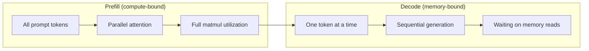
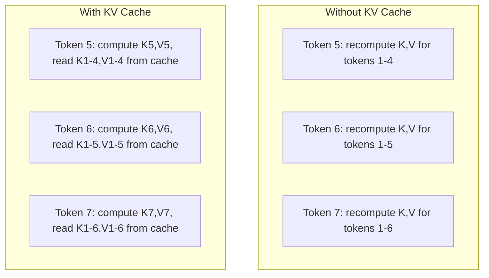
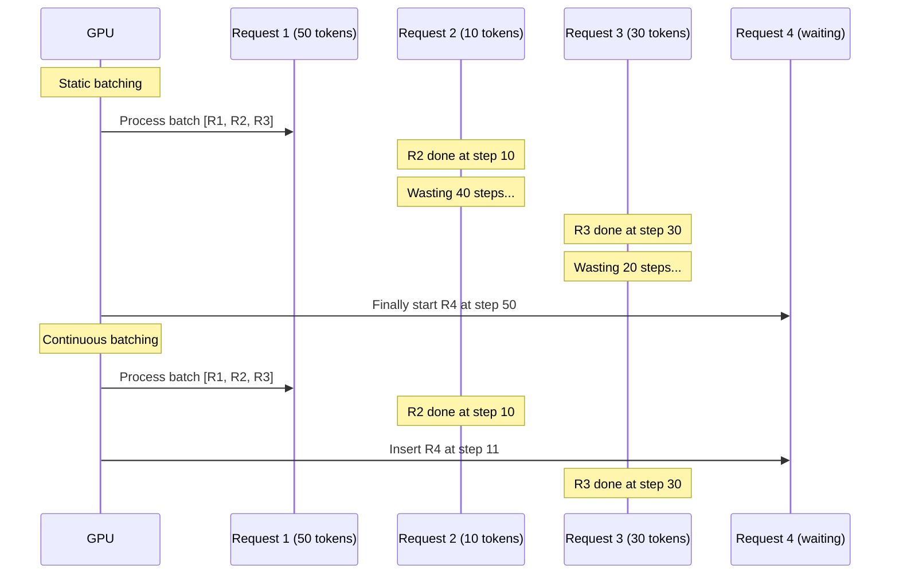
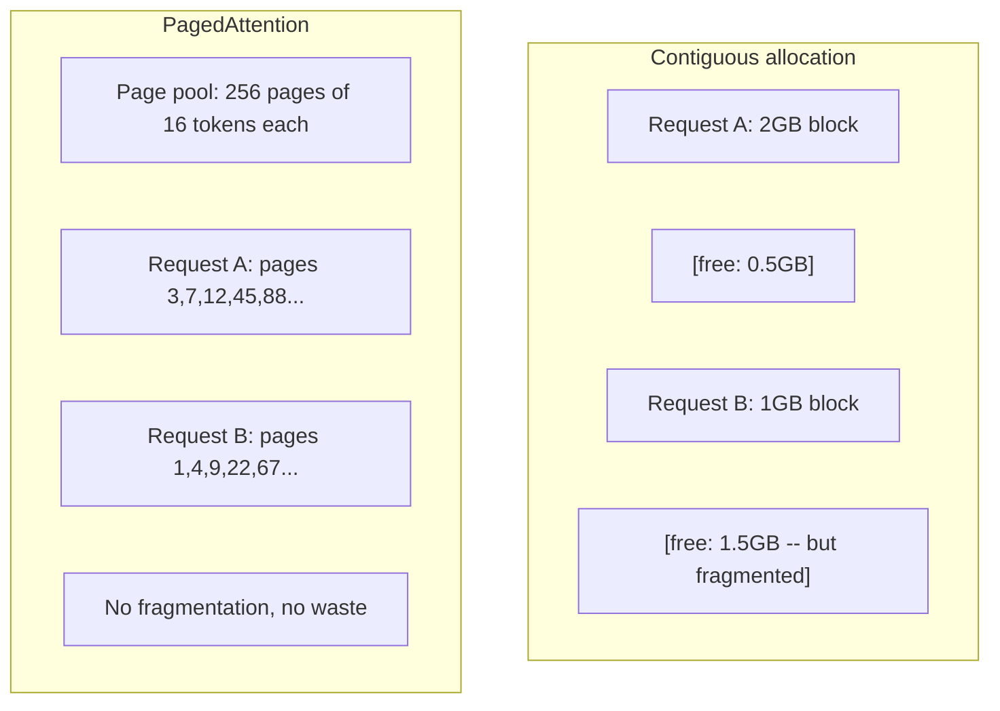
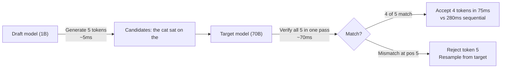

# Inference 优化

> 两个阶段定义了 LLM inference。Prefill 并行处理你的 prompt -- compute-bound。Decode 一次生成一个 Token -- memory-bound。每一种优化都针对其中一个或两个阶段。

**Type:** Build
**Languages:** Python
**Prerequisites:** Phase 10, Lessons 01-08 (Transformer architecture, attention)
**Time:** ~120 分钟

## 学习目标

- 实现 KV-cache，以消除 autoregressive Token 生成期间的冗余计算
- 解释 LLM inference 的 prefill 与 decode 阶段，以及为什么两者有不同瓶颈（compute-bound vs memory-bound）
- 实现 continuous batching 和 PagedAttention 概念，以在并发请求下最大化 GPU 利用率
- 比较 inference 优化技术（KV-cache、speculative decoding、flash attention）及其 throughput/latency 取舍

## 问题

你在 4xA100 GPUs 上部署 Llama 3 70B。单个用户能得到约 50 tokens per second。感觉很快。然后 100 个用户同时访问 endpoint。Throughput 掉到 3 tokens/second/user。你每月 25,000 美元的 GPU 账单，提供响应的速度却比人打字还慢。

模型本身在 1 个用户和 100 个用户之间并没有改变。同样的 weights、同样的 architecture、同样的 math。改变的是你如何调度工作。朴素 inference 会浪费 90% 以上的可用 GPU compute。一个等待 token 47 的用户会占住整个 batch slot，而 GPU memory bus 在 matmul 之间处于空闲。同时，一个新用户的 2,000-token prompt 本可以用有用的 compute 填满这段死时间。

这不是 scaling 问题。这是 scheduling 问题。本课中的技术 -- KV caching、continuous batching、PagedAttention、speculative decoding、prefix caching -- 正是将每月 25k 美元 inference 账单与每月 5k 美元、服务相同流量的账单区分开的关键。

vLLM 在 4xA100-80GB 上 serving Llama 3 70B 时，在低并发下达到约 50 tokens/second/user，并通过 continuous batching 和 PagedAttention 在 100 个并发请求下维持 15-25 TPS/user。没有这些优化，同样硬件在该并发下只能提供 5 TPS/user。同样的 GPUs、同样的模型，throughput 提升 4 倍。

## 概念

### Prefill vs Decode

每个 LLM inference 请求都有两个不同阶段。

**Prefill** 处理整个输入 prompt。所有 tokens 都已知，因此 attention 可以在完整 sequence 上并行计算。这是一次大型 matrix multiplication -- GPU cores 会保持忙碌。瓶颈是 compute：你的硬件每秒能提供多少 FLOPS。A100 可达到 312 TFLOPS (BF16)。在单张 A100 上，70B 模型对 4,096-token prompt 做 Prefill 约需 400ms。

**Decode** 一次生成一个输出 token。每个新 token attends to 所有 previous tokens，但每次 forward pass 只产生一个 token。Weight matrices 的尺寸与 prefill 期间相同，但你用一个 single vector 而不是 matrix 去乘它们。GPU cores 在微秒级完成，然后等待下一批 weights 从 memory 到达。瓶颈是 memory bandwidth：你能以多快速度将 model weights 从 HBM stream 到 compute units。A100 有 2 TB/s bandwidth。70B 模型用 FP16 是 140 GB。完整读取一次模型需要 70ms -- 这就是单次 decode step 的下限。



**ops:byte ratio**（也称 arithmetic intensity）刻画了这种取舍。它衡量每从 memory 加载一个 byte，你执行多少 operations。

```
ops:byte ratio = FLOPs per token / bytes read from memory
```

在对 4,096 tokens 的 batch 做 prefill 时，每加载一个 weight，你会执行约 4,096 次 multiply-accumulate operations。这个 ratio 很高 -- 你是 compute-bound。在 batch size 为 1 的 decode 中，每加载一个 weight 只执行约 1 次 operation。这个 ratio 很低 -- 你是 memory-bound。

核心洞察：*decode 是 memory-bound，因为你读取整个模型只为产生一个 token*。下面的每个优化，要么减少读取内容，要么增加每次读取所处理的 tokens batch，要么完全避免读取。

### KV Cache

在 attention 中，每个 token 的 query 会 attend to 每个 previous token 的 key 和 value vectors。没有 caching 时，生成 token N 需要重新计算前面 N-1 个 tokens 的 key 和 value projections。Token 1 在生成 token 2 时被 projected，然后生成 token 3 时又来一次，生成 token 4 时再来一次。到 token 1,000 时，你已经把 token 1 projected 了 999 次。

KV cache 存储所有 previous tokens 的 key 和 value projections。生成 token N 时，你只计算 token N 的 key 和 value，然后把它们与 tokens 1 到 N-1 的 cached K/V 拼接起来。



**KV cache 的 memory 公式：**

```
KV cache size = 2 * num_layers * num_kv_heads * head_dim * seq_len * bytes_per_param
```

对于 Llama 3 70B（80 layers、8 KV heads with GQA、head_dim=128、BF16）：

```
per token: 2 * 80 * 8 * 128 * 2 bytes = 327,680 bytes = 320 KB
at 4,096 tokens: 320 KB * 4,096 = 1.28 GB
at 128K tokens: 320 KB * 131,072 = 40 GB
```

一个 Llama 3 70B 的 128K-context conversation 会消耗 40 GB KV cache -- 半张 A100 的 memory。100 个并发用户、每人 4K tokens 时，仅 KV cache 就需要 128 GB。这就是为什么 KV cache management 是 inference 优化的核心挑战。

### Continuous Batching

Static batching 会等待一批 N 个请求到达，将它们一起处理，并等到*全部*完成后才接受新请求。如果一个请求需要 500 tokens，另一个需要 10，短请求完成后还要闲置 490 个 decode steps。

Continuous batching（也称 iteration-level batching）会在任意请求完成后立即把新请求插入 batch。每个 decode step 都会重新评估 batch。一个在 10 tokens 后完成的请求会立刻被 waiting request 替换。



Throughput 提升取决于输出长度的变化程度。长度一致时，continuous batching 与 static batching 相当。长度可变时（常见情况），continuous batching 可以提供 2-5 倍更高 throughput，因为 GPU slots 永远不会空置。

### PagedAttention

每个请求的 KV cache 是一块 contiguous memory。随着请求到达和离开，memory 会 fragmentation -- 就像操作系统中的 RAM fragmentation。一个 4K-token 请求需要 1.28 GB contiguous。即使总共有 2 GB free，你也可能没有 1.28 GB *contiguous*。你要么浪费 memory，要么拒绝请求。

PagedAttention（来自 vLLM）将 OS-style virtual memory 应用于 KV cache。它不是为每个请求分配一个 contiguous block，而是分配固定大小的 "pages"（通常每页 16 tokens）。Pages 可以位于 physical GPU memory 的任何位置。Page table 将每个请求的 logical sequence positions 映射到 physical page locations。



PagedAttention 还支持 shared prefixes 的 **copy-on-write**。如果 50 个请求共享同一个 system prompt，这个 system prompt 的 KV cache pages 只存储一次，并被 50 个请求共同引用。只有当某个请求分叉（不同的 user messages）时，它才会获得自己的 pages。这会显著降低带有共享 system prompts 的应用的 memory usage。

vLLM 报告称，通过 PagedAttention 可实现接近零的 memory waste（约 4%，而 naive allocation 为约 60-80%）。

### Speculative Decoding

Decode 慢是因为它是 sequential -- 你生成一个 token，把它反馈回去，再生成下一个。但如果你能廉价地猜出接下来的 5 个 tokens，然后一次性验证它们呢？

Speculative decoding 使用一个小而快的 **draft model** 生成 K 个 candidate tokens。大型 **target model** 随后在单次 forward pass 中处理所有 K 个 candidates（看起来像 prefill -- parallel、compute-bound、高效）。如果 target model 同意 draft model 的预测，你就在一次 target forward pass 的时间内接受全部 K 个 tokens。如果它在位置 j 不同意，你接受 tokens 1 到 j-1，并丢弃其余部分。



Speedup 取决于 **acceptance rate** -- draft model 的预测与 target 匹配的频率。用 Llama 3 8B 为 Llama 3 70B 做 drafting 时，在自然语言上典型 acceptance rates 为 70-85%。这会转化为 2-3 倍 decode speedup。

Speculative decoding 的三种方法：

| Method | Draft source | Acceptance rate | Overhead |
|--------|-------------|-----------------|----------|
| Draft-target (Leviathan et al.) | 独立小模型 | 70-85% | Draft model memory |
| EAGLE (Li et al.) | Target 上的轻量 head | 75-90% | ~1% extra parameters |
| N-gram lookup | Token n-gram table | 40-60% | 可忽略 |

**EAGLE** 在 target model 的 hidden states 之上训练一个小型 autoregressive head。它使用 target model 倒数第二层 features 来预测下一个 token 的 embedding。因为它操作的是 target model 自身的 representations（而不是独立模型的），所以能以极少的额外 memory 获得更高 acceptance rates。EAGLE-2 增加了 dynamic draft tree，可根据 context 调整 candidate count。

**N-gram speculative decoding** 维护来自当前 context 或预构建 corpus 的 n-gram continuations table。如果 draft 匹配同一 conversation 中此前出现的内容（重复模式、code、structured output），它会以零 Neural Network overhead 触发。平均 acceptance rates 更低，但每次 speculation 的成本基本为零。

Speculative decoding 是*数学上精确的* -- 输出分布与 target model 的分布完全相同。它不是近似。Verification step 确保每个 accepted token 都具有 target model 原本会分配的确切概率。

### Prefix Caching

许多请求共享相同 prefix。Chatbot system prompt。RAG context block。Few-shot example set。没有 prefix caching 时，每个请求都会从头重新计算这些 shared tokens 的 KV cache。

Prefix caching 存储 common prefixes 的 KV cache，并在请求之间复用。当新请求带着已知 prefix 到达时，系统会复制（或引用）cached KV entries，并只计算 unique suffix 的 KV。

对于所有请求共享的 2,000-token system prompt，prefix caching 会消除每个请求约 400ms 的 prefill。在 100 requests/second 时，这每秒节省 40 秒 GPU compute -- 超过一张 GPU 的工作量。

SGLang 的 RadixAttention 使用 radix tree（trie）实现 prefix caching，按 token content 索引 prefixes。任何匹配 stored prefix 的请求都会免费获得其 KV cache。该 tree 支持 partial prefix matches -- 如果你与某个 cached entry 共享 2,000 个 prefix tokens 中的 1,500 个，就复用这 1,500 个，只重新计算 500 个。

### Inference Engines

三个 engines 主导 production LLM serving：

| Engine | Key innovation | Best for |
|--------|---------------|----------|
| vLLM | PagedAttention、continuous batching | 通用 serving、最高兼容性 |
| SGLang | RadixAttention（prefix caching）、structured generation | Multi-turn chatbots、constrained decoding |
| TensorRT-LLM | NVIDIA kernel fusion、FP8 quantization | NVIDIA hardware 上的最大 single-GPU throughput |

**vLLM** 是默认起点。它支持最广泛的模型，能在任何 GPU vendor（NVIDIA、AMD、Intel）上运行，并通过 PagedAttention + continuous batching 实现强 throughput。OpenAI-compatible API 意味着你可以把它作为任何 OpenAI API call 的替代品直接接入。

**SGLang** 建立在与 vLLM 相同的基础之上，但增加了用于 prefix caching 的 RadixAttention，以及用于 structured LLM programs 的 domain-specific language。如果你的 workload 包含 multi-turn conversations、tool use 或 constrained decoding（JSON output、regex-guided generation），SGLang 往往能通过 prefix reuse 比 vLLM 快 2-5 倍。

**TensorRT-LLM** 将模型编译成 optimized NVIDIA GPU kernels。它融合 operations（attention + linear + activation 在一个 kernel 中），在 H100 GPUs 上使用 FP8，并与 NVIDIA Triton Inference Server 集成以进行 production deployment。它在 NVIDIA hardware 上实现最高 single-GPU throughput，但 setup 更多，并且只适用于 NVIDIA GPUs。

Llama 3 70B 的真实世界数字（4xA100-80GB，BF16）：

| Metric | vLLM | SGLang | TensorRT-LLM |
|--------|------|--------|---------------|
| Throughput（1 user） | ~50 TPS | ~55 TPS | ~65 TPS |
| Throughput（100 users） | ~2,500 total TPS | ~3,200 total TPS | ~3,000 total TPS |
| Time to first token | ~400ms | ~300ms（prefix hit） | ~350ms |
| Max context | 128K | 128K | 128K |

### Ops:Byte 框架

你无法优化自己没有测量的东西。ops:byte ratio 会告诉你 workload 是 compute-bound 还是 memory-bound，而这决定哪些优化真正重要。

```
Compute roof: peak FLOPS of the GPU
Memory roof:  peak bandwidth * ops:byte ratio
```

当 ops:byte 较低时（decode、小 batches），你会触及 memory bandwidth roof。增加更多 compute（更高 clock、更多 cores）没有帮助。你需要减少 memory reads（quantization、KV cache compression），或增加 batch size，将 reads 分摊到更多有用工作上。

当 ops:byte 较高时（prefill、大 batches），你会触及 compute roof。Memory bandwidth optimization 没有帮助。你需要更快的 GPUs、kernel fusion 或 reduced precision 来挤出更多 FLOPS。

| Scenario | ops:byte | Bound | Optimize with |
|----------|----------|-------|---------------|
| Prefill, batch=1 | ~4,096 | Compute | Kernel fusion, FP8 |
| Decode, batch=1 | ~1 | Memory | Quantization, KV compression |
| Decode, batch=32 | ~32 | Memory | Larger batch, continuous batching |
| Decode, batch=256 | ~256 | Transitioning | 两者都重要 |
| Decode, batch=1024 | ~1,024 | Compute | Kernel fusion, tensor parallelism |

A100 上的 crossover point 大约是 ops:byte = 156（312 TFLOPS / 2 TB/s）。低于 156 时，你是 memory-bound。高于 156 时，你是 compute-bound。Continuous batching 通过每次 iteration 打包更多 tokens，将 decode 推向这个 crossover。

## 构建它

### 步骤 1： 从零实现 KV Cache

我们构建一个 multi-head KV cache，它按 layer、head 存储 key 和 value projections，并展示 memory 增长模式。

```python
import numpy as np

class KVCache:
    def __init__(self, num_layers, num_heads, head_dim, max_seq_len, dtype=np.float16):
        self.num_layers = num_layers
        self.num_heads = num_heads
        self.head_dim = head_dim
        self.max_seq_len = max_seq_len
        self.dtype = dtype

        self.k_cache = np.zeros(
            (num_layers, num_heads, max_seq_len, head_dim), dtype=dtype
        )
        self.v_cache = np.zeros(
            (num_layers, num_heads, max_seq_len, head_dim), dtype=dtype
        )
        self.seq_len = 0

    def update(self, layer_idx, new_keys, new_values):
        num_new = new_keys.shape[1]
        end = self.seq_len + num_new
        self.k_cache[layer_idx, :, self.seq_len:end, :] = new_keys
        self.v_cache[layer_idx, :, self.seq_len:end, :] = new_values
        return (
            self.k_cache[layer_idx, :, :end, :],
            self.v_cache[layer_idx, :, :end, :]
        )

    def advance(self, num_tokens):
        self.seq_len += num_tokens

    def memory_bytes(self):
        return self.k_cache.nbytes + self.v_cache.nbytes

    def used_bytes(self):
        per_token = 2 * self.num_layers * self.num_heads * self.head_dim * np.dtype(self.dtype).itemsize
        return per_token * self.seq_len
```

### 步骤 2： 使用 KV Cache 的 Attention

一个简化的 multi-head attention，在 decode steps 中使用 KV cache。

```python
def scaled_dot_product_attention(query, keys, values):
    head_dim = query.shape[-1]
    scores = np.matmul(query, keys.transpose(0, 1, 3, 2)) / np.sqrt(head_dim)
    seq_len_q = scores.shape[-2]
    seq_len_k = scores.shape[-1]
    if seq_len_q > 1:
        mask = np.triu(np.ones((seq_len_q, seq_len_k), dtype=np.float32), k=seq_len_k - seq_len_q + 1)
        scores = scores + mask * (-1e9)
    max_scores = np.max(scores, axis=-1, keepdims=True)
    exp_scores = np.exp(scores - max_scores)
    attn_weights = exp_scores / np.sum(exp_scores, axis=-1, keepdims=True)
    return np.matmul(attn_weights, values)


class MultiHeadAttention:
    def __init__(self, d_model, num_heads):
        self.num_heads = num_heads
        self.head_dim = d_model // num_heads
        scale = np.sqrt(2.0 / d_model)
        self.W_q = np.random.randn(d_model, d_model).astype(np.float32) * scale
        self.W_k = np.random.randn(d_model, d_model).astype(np.float32) * scale
        self.W_v = np.random.randn(d_model, d_model).astype(np.float32) * scale
        self.W_o = np.random.randn(d_model, d_model).astype(np.float32) * scale

    def forward(self, x, kv_cache=None, layer_idx=0):
        batch, seq_len, d_model = x.shape
        Q = np.matmul(x, self.W_q).reshape(batch, seq_len, self.num_heads, self.head_dim).transpose(0, 2, 1, 3)
        K = np.matmul(x, self.W_k).reshape(batch, seq_len, self.num_heads, self.head_dim).transpose(0, 2, 1, 3)
        V = np.matmul(x, self.W_v).reshape(batch, seq_len, self.num_heads, self.head_dim).transpose(0, 2, 1, 3)

        if kv_cache is not None:
            K_full, V_full = kv_cache.update(layer_idx, K[0], V[0])
            K = K_full[np.newaxis, :, :, :]
            V = V_full[np.newaxis, :, :, :]
            if seq_len == 1:
                kv_cache.advance(1)

        attn_out = scaled_dot_product_attention(Q, K, V)
        attn_out = attn_out.transpose(0, 2, 1, 3).reshape(batch, -1, d_model)
        return np.matmul(attn_out, self.W_o)
```

### 步骤 3： Continuous Batching 模拟器

它模拟 static batching 与 continuous batching 之间的调度差异。

```python
import heapq

class Request:
    def __init__(self, request_id, prompt_tokens, output_tokens, arrival_step):
        self.request_id = request_id
        self.prompt_tokens = prompt_tokens
        self.output_tokens = output_tokens
        self.arrival_step = arrival_step
        self.tokens_generated = 0
        self.start_step = None
        self.end_step = None

    def is_done(self):
        return self.tokens_generated >= self.output_tokens


def simulate_static_batching(requests, batch_size):
    step = 0
    completed = []
    queue = list(requests)
    queue.sort(key=lambda r: r.arrival_step)

    while queue:
        batch = []
        while queue and len(batch) < batch_size:
            r = queue.pop(0)
            r.start_step = max(step, r.arrival_step)
            batch.append(r)

        if batch:
            step = max(step, max(r.start_step for r in batch))
            max_output = max(r.output_tokens for r in batch)
            for r in batch:
                r.tokens_generated = r.output_tokens
                r.end_step = step + max_output
            step += max_output
            completed.extend(batch)

    return completed


def simulate_continuous_batching(requests, batch_size):
    step = 0
    completed = []
    queue = sorted(requests, key=lambda r: r.arrival_step)
    queue_idx = 0
    active = []
    waiting = []

    while queue_idx < len(queue) or active or waiting:
        while queue_idx < len(queue) and queue[queue_idx].arrival_step <= step:
            waiting.append(queue[queue_idx])
            queue_idx += 1

        while waiting and len(active) < batch_size:
            r = waiting.pop(0)
            r.start_step = step
            active.append(r)

        if not active:
            if waiting:
                step += 1
                continue
            elif queue_idx < len(queue):
                step = queue[queue_idx].arrival_step
                continue
            else:
                break

        for r in active:
            r.tokens_generated += 1

        done = [r for r in active if r.is_done()]
        for r in done:
            r.end_step = step + 1
            completed.append(r)
        active = [r for r in active if not r.is_done()]

        step += 1

    return completed


def batching_stats(completed):
    latencies = [r.end_step - r.arrival_step for r in completed]
    total_time = max(r.end_step for r in completed) - min(r.arrival_step for r in completed)
    total_tokens = sum(r.output_tokens for r in completed)
    return {
        "avg_latency": np.mean(latencies),
        "p50_latency": np.median(latencies),
        "p99_latency": np.percentile(latencies, 99),
        "total_time": total_time,
        "throughput": total_tokens / total_time if total_time > 0 else 0,
    }
```

### 步骤 4： Prefix Cache

一个基于 trie 的 prefix cache，用于存储 shared prefixes 的 KV entries。

```python
class TrieNode:
    def __init__(self):
        self.children = {}
        self.kv_data = None
        self.hit_count = 0


class PrefixCache:
    def __init__(self, max_entries=1000):
        self.root = TrieNode()
        self.max_entries = max_entries
        self.total_entries = 0
        self.hits = 0
        self.misses = 0

    def _walk(self, token_ids):
        node = self.root
        depth = 0
        for tid in token_ids:
            if tid not in node.children:
                break
            node = node.children[tid]
            depth += 1
        return node, depth

    def lookup(self, token_ids):
        node, depth = self._walk(token_ids)
        if depth > 0:
            self.hits += 1
            current = self.root
            for tid in token_ids[:depth]:
                current = current.children[tid]
                current.hit_count += 1
            kv_entries = []
            current = self.root
            for tid in token_ids[:depth]:
                current = current.children[tid]
                if current.kv_data is not None:
                    kv_entries.append(current.kv_data)
            return depth, kv_entries
        self.misses += 1
        return 0, []

    def insert(self, token_ids, kv_per_token):
        node = self.root
        for i, tid in enumerate(token_ids):
            if tid not in node.children:
                if self.total_entries >= self.max_entries:
                    return i
                node.children[tid] = TrieNode()
                self.total_entries += 1
            node = node.children[tid]
            if i < len(kv_per_token):
                node.kv_data = kv_per_token[i]
        return len(token_ids)

    def hit_rate(self):
        total = self.hits + self.misses
        return self.hits / total if total > 0 else 0.0
```

### 步骤 5： Speculative Decoding 模拟器

我们用可配置的 acceptance rates 模拟 draft-target speculative decoding。

```python
class DraftModel:
    def __init__(self, vocab_size, acceptance_rate=0.8):
        self.vocab_size = vocab_size
        self.acceptance_rate = acceptance_rate

    def generate(self, context, num_tokens):
        tokens = np.random.randint(0, self.vocab_size, size=num_tokens)
        return tokens

    def get_probs(self, context, token):
        probs = np.random.dirichlet(np.ones(self.vocab_size))
        return probs


class TargetModel:
    def __init__(self, vocab_size):
        self.vocab_size = vocab_size

    def get_probs(self, context, tokens=None):
        if tokens is not None:
            return [np.random.dirichlet(np.ones(self.vocab_size)) for _ in tokens]
        return np.random.dirichlet(np.ones(self.vocab_size))


def speculative_decode(draft_model, target_model, context, num_speculative=5,
                       draft_cost=1.0, target_cost=10.0, verify_cost=12.0):
    total_tokens = 0
    total_cost = 0.0
    accepted_counts = []
    context = list(context)

    max_tokens = 100

    while total_tokens < max_tokens:
        draft_tokens = draft_model.generate(context, num_speculative)
        total_cost += draft_cost * num_speculative

        target_probs = target_model.get_probs(context, draft_tokens)
        total_cost += verify_cost

        accepted = 0
        for i, token in enumerate(draft_tokens):
            draft_p = draft_model.get_probs(context + list(draft_tokens[:i]), token)
            target_p = target_probs[i]

            r = np.random.random()
            acceptance_prob = min(1.0, target_p[token] / (draft_p[token] + 1e-10))

            if r < draft_model.acceptance_rate:
                accepted += 1
                context.append(token)
                total_tokens += 1
            else:
                new_token = np.random.choice(draft_model.vocab_size, p=target_p)
                context.append(new_token)
                total_tokens += 1
                break

        accepted_counts.append(accepted)

        if accepted == num_speculative:
            bonus_probs = target_model.get_probs(context)
            bonus_token = np.random.choice(draft_model.vocab_size, p=bonus_probs)
            context.append(bonus_token)
            total_tokens += 1

    sequential_cost = total_tokens * target_cost
    return {
        "total_tokens": total_tokens,
        "speculative_cost": total_cost,
        "sequential_cost": sequential_cost,
        "speedup": sequential_cost / total_cost if total_cost > 0 else 1.0,
        "avg_accepted": np.mean(accepted_counts),
        "acceptance_rate": np.mean(accepted_counts) / num_speculative,
    }


def compare_speculation_strategies(vocab_size=1000, num_trials=20):
    results = {}

    for name, acceptance_rate, spec_tokens in [
        ("Draft-target (8B->70B)", 0.78, 5),
        ("EAGLE", 0.85, 6),
        ("N-gram", 0.50, 4),
        ("No speculation", 0.0, 0),
    ]:
        if spec_tokens == 0:
            results[name] = {
                "speedup": 1.0,
                "acceptance_rate": 0.0,
                "avg_accepted": 0.0,
            }
            continue

        trial_results = []
        for _ in range(num_trials):
            draft = DraftModel(vocab_size, acceptance_rate=acceptance_rate)
            target = TargetModel(vocab_size)
            context = list(np.random.randint(0, vocab_size, size=10))
            result = speculative_decode(draft, target, context, num_speculative=spec_tokens)
            trial_results.append(result)

        results[name] = {
            "speedup": np.mean([r["speedup"] for r in trial_results]),
            "acceptance_rate": np.mean([r["acceptance_rate"] for r in trial_results]),
            "avg_accepted": np.mean([r["avg_accepted"] for r in trial_results]),
        }

    return results
```

### 步骤 6: KV Cache Memory Profiler

计算真实模型配置的 KV cache memory requirements。

```python
MODEL_CONFIGS = {
    "Llama-3-8B": {
        "num_layers": 32, "num_kv_heads": 8, "head_dim": 128,
        "model_params_b": 8, "gqa": True,
    },
    "Llama-3-70B": {
        "num_layers": 80, "num_kv_heads": 8, "head_dim": 128,
        "model_params_b": 70, "gqa": True,
    },
    "Llama-3-405B": {
        "num_layers": 126, "num_kv_heads": 8, "head_dim": 128,
        "model_params_b": 405, "gqa": True,
    },
    "Mistral-7B": {
        "num_layers": 32, "num_kv_heads": 8, "head_dim": 128,
        "model_params_b": 7, "gqa": True,
    },
    "GPT-4-est": {
        "num_layers": 120, "num_kv_heads": 96, "head_dim": 128,
        "model_params_b": 1800, "gqa": False,
    },
}


def kv_cache_memory(config, seq_len, dtype_bytes=2):
    per_token = 2 * config["num_layers"] * config["num_kv_heads"] * config["head_dim"] * dtype_bytes
    total = per_token * seq_len
    return {
        "per_token_bytes": per_token,
        "per_token_kb": per_token / 1024,
        "total_bytes": total,
        "total_mb": total / (1024 ** 2),
        "total_gb": total / (1024 ** 3),
    }


def memory_budget(config, gpu_memory_gb, model_dtype_bytes=2, kv_dtype_bytes=2):
    model_memory_gb = config["model_params_b"] * 1e9 * model_dtype_bytes / (1024 ** 3)
    overhead_gb = gpu_memory_gb * 0.1
    available_for_kv = gpu_memory_gb - model_memory_gb - overhead_gb

    if available_for_kv <= 0:
        return {"error": "Model does not fit in GPU memory", "model_memory_gb": model_memory_gb}

    per_token = 2 * config["num_layers"] * config["num_kv_heads"] * config["head_dim"] * kv_dtype_bytes
    max_tokens = int(available_for_kv * (1024 ** 3) / per_token)

    return {
        "gpu_memory_gb": gpu_memory_gb,
        "model_memory_gb": round(model_memory_gb, 1),
        "overhead_gb": round(overhead_gb, 1),
        "available_for_kv_gb": round(available_for_kv, 1),
        "max_total_tokens": max_tokens,
        "max_users_at_2k": max_tokens // 2048,
        "max_users_at_4k": max_tokens // 4096,
        "max_users_at_32k": max_tokens // 32768,
    }
```

## 使用它

使用 vLLM：

```python
from vllm import LLM, SamplingParams

llm = LLM(
    model="meta-llama/Llama-3-70B-Instruct",
    tensor_parallel_size=4,
    enable_prefix_caching=True,
    max_model_len=8192,
    gpu_memory_utilization=0.9,
)

params = SamplingParams(temperature=0.7, max_tokens=256)
outputs = llm.generate(["Explain inference optimization in one paragraph."], params)
```

使用 SGLang 做 prefix caching + structured output：

```python
import sglang as sgl

@sgl.function
def classify(s, text):
    s += sgl.system("You are a classifier. Output JSON only.")
    s += sgl.user(f"Classify this text: {text}")
    s += sgl.assistant(sgl.gen("result", regex=r'\{"label": "(positive|negative|neutral)"\}'))

runtime = sgl.Runtime(model_path="meta-llama/Llama-3-70B-Instruct", tp_size=4)
sgl.set_default_backend(runtime)

results = classify.run_batch([
    {"text": "This product is amazing!"},
    {"text": "Terrible experience."},
    {"text": "It was okay I guess."},
])
```

使用 TensorRT-LLM：

```python
import tensorrt_llm
from tensorrt_llm.runtime import ModelRunner

runner = ModelRunner.from_dir("./llama-70b-trt-engine/", rank=0)

outputs = runner.generate(
    batch_input_ids=[tokenizer.encode("Explain KV caching.")],
    max_new_tokens=256,
    temperature=0.7,
)
```

## 交付它

本课产出：
- `outputs/skill-inference-optimization.md` -- 一个用于诊断和优化 LLM inference serving 的 skill

## 练习

1. 修改 KV cache profiler，比较 FP16 vs FP8 vs INT4 KV cache quantization。对于 4K context 下的 Llama 3 70B，计算每种设置在 4xA100-80GB 上的最大并发用户数。KV quantization 到 INT4 应该大约让用户容量提升 4 倍。

2. 扩展 continuous batching 模拟器，以跟踪 GPU utilization（每 step 被填满的 batch slots 比例）。对 static 和 continuous batching 分别绘制 utilization over time，其中 50 个请求的输出长度服从 Pareto distribution（shape=1.5，scale=20）。Continuous batching 应保持 >80% utilization。

3. 实现一个 grouped-query attention（GQA）版本的 KV cache，其中 `num_kv_heads < num_query_heads`。Llama 3 70B 使用 64 个 query heads，但只有 8 个 KV heads。计算相对于完整 multi-head attention 的 memory savings（KV cache size 减少 8 倍）。

4. 构建一个使用 LRU eviction 的 prefix cache。将 max_entries 设置为 500，并生成 1,000 个请求，其中 60% 共享 5 个 common prefixes 之一。测量 hit rate 并与 unlimited cache 比较。使用良好的 eviction 时，hit rate 应保持在 55% 以上。

5. 扩展 speculative decoding 模拟器，实现 tree-based speculation（EAGLE-2 风格）。不是单条 K 个 draft tokens 的链，而是生成 candidates tree（例如每 3 层各 2 个 branches = 8 个 leaf candidates）。比较每个 verification round 接受的 total tokens 与 linear speculation 的差异。

## 关键术语

| Term | 人们怎么说 | 它实际意味着什么 |
|------|----------------|----------------------|
| Prefill | "Processing the prompt" | 在所有输入 tokens 上并行计算 attention -- compute-bound，因为完整 matrix multiplication 会让 GPU cores 保持忙碌 |
| Decode | "Generating tokens" | 每次 forward pass 产生一个 token，每次都读取完整 model weights -- memory-bound，因为 compute 会在下一批 weights 到达前完成 |
| KV cache | "Caching attention states" | 存储所有 previous tokens 的 key 和 value projections，使它们不会在每个 decode step 被重新计算 -- 用 memory 换 compute |
| Continuous batching | "Dynamic batching" | 在任何请求完成后立即将新请求插入 running batch，每个 decode iteration 都进行评估，而不是等待整个 batch |
| PagedAttention | "Virtual memory for KV cache" | 用固定大小 pages 而不是 contiguous blocks 分配 KV cache，消除 memory fragmentation，并为 shared prefixes 启用 copy-on-write |
| Speculative decoding | "Draft and verify" | 使用快速 draft model 提出多个 tokens，然后在一次 target model forward pass 中全部验证 -- 数学上精确，2-3 倍 speedup |
| EAGLE | "Self-speculative decoding" | 一种 speculative decoding 变体，在 target model 自身的 hidden states 上训练 lightweight head，相比独立 draft model 获得更高 acceptance rates |
| Prefix caching | "Reusing system prompt KV" | 为 common prefixes（system prompts、few-shot examples）存储已计算的 KV cache entries，并跨请求复用它们以跳过冗余 prefill |
| Ops:byte ratio | "Arithmetic intensity" | Compute operations 与读取的 memory bytes 之比 -- 决定 workload 是 compute-bound（高 ratio）还是 memory-bound（低 ratio） |
| Time to first token | "TTFT" | 从接收请求到产生第一个输出 token 的延迟 -- 对于长 prompts，主要由 prefill time 主导 |

## 延伸阅读

- Kwon et al., "Efficient Memory Management for Large Language Model Serving with PagedAttention" (2023) -- 介绍 paged KV cache management 的 vLLM 论文，如今它已成为 inference serving 的行业标准
- Leviathan et al., "Fast Inference from Transformers via Speculative Decoding" (2023) -- foundational paper，证明 draft-verify speculation 在实现 2-3 倍 speedup 的同时，会产生精确的 target model distributions
- Li et al., "EAGLE: Speculative Sampling Requires Rethinking Feature Uncertainty" (2024) -- 通过在 target model 自身 features 上训练 head，而不是使用独立 draft model，获得更高 acceptance rates
- Zheng et al., "SGLang: Efficient Execution of Structured Language Model Programs" (2024) -- 介绍用于 prefix caching 的 RadixAttention，以及用于 multi-call LLM programs 的 programming model
- Williams et al., "Roofline: An Insightful Visual Performance Model for Multicore Architectures" (2009) -- original roofline paper，形式化了用于推理 compute vs memory bottlenecks 的 ops:byte 框架
