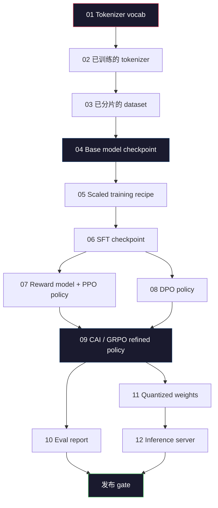
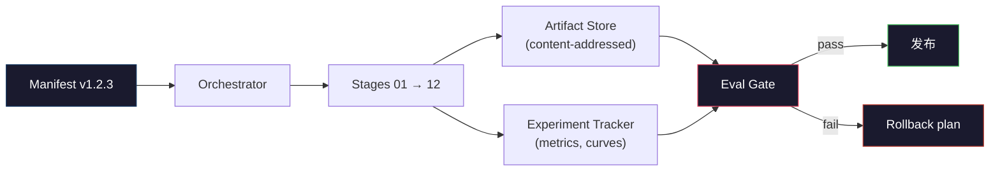

# 构建完整的 LLM Pipeline

> Lessons 01 到 12 的所有内容，都是同一个 pipeline 的一个阶段。本课是把这些阶段转成一次端到端运行的脚手架：tokenize、pre-train、scale、SFT、align、evaluate、quantize、serve。你不会在笔记本电脑上训练一个 70B 模型。你会产出 orchestration layer、manifest、eval gate 和 rollback plan，也就是 2026 年 frontier team 用来决定什么可以发布的那套机制。这是本阶段的 capstone。

**Type:** Build
**Languages:** Python (stdlib)
**Prerequisites:** All Phase 10 lessons 01-12
**Time:** ~120 minutes

## 学习目标
- 将前十一课（tokenizer、data、pre-training、scaling、SFT、RLHF、DPO、CAI、eval、quantization、inference）组合成一个可复现的 pipeline spec
- 定义各阶段之间的 artifact contract：每个阶段消费什么、产出什么，以及下一个阶段如何验证输入
- 构建一个 orchestrator，用于跟踪实验、对 artifacts 进行 hash，并基于 eval thresholds 决定是否通过发布 gate
- 设计 rollback plan：哪些 artifacts 重新运行成本低，哪些成本高，以及一个损坏的 checkpoint 会带来什么代价

## 问题
前面的课程每一课都能独立工作。Tokenizer 已训练完成。Tiny GPT 已完成 pre-training。SFT dataset 已组装。Reward model 已训练。DPO 已运行。Evals 已测量。Quantized weights 已导出。Inference server 已启动。每一项都是一个 notebook。每一项都有自己的约定、自己的输出路径、自己的 seed。

Frontier training run 不是 notebook。Llama 3 405B 大约用了 30 million H100 hours，持续约 54 天。DeepSeek-V3 使用了约 2.8 million H800 hours。在这段时间里，一个损坏的 checkpoint、一次 data contamination、一次 eval regression，都可能让团队损失一周 wall-clock 和一个月 GPU 预算。团队靠 pipeline hygiene 活下来：每个阶段都有确定的输入、确定的输出、manifest、hash 和 gate。

这就是 capstone。你不会在笔记本电脑上端到端运行整个 pipeline。你会编写协调各阶段的 orchestrator、描述这次运行的 manifest、决定发布 gate 的 verifier，以及让第三方能从单个文件重新运行你工作的 replay plan。代码很小；纪律很大。

这个模式从 100M 到 1T parameters 都不变。相同的四个组件 -- manifest、orchestrator、eval gate、artifact store -- 既能运行 Llama 3，也能运行你的业余 GPT。差别在于每个阶段 config 里的数字大小，而不是 pipeline 的形状。

## 概念
### The Twelve Stages

每一节 Phase 10 课程都是一个阶段。下面是完整的 dependency graph。



阶段 07 和 08 可以并行运行。其他所有阶段都是硬依赖。阶段 02（tokenizer）的变化会使所有下游 artifact 失效。阶段 10（eval）的变化只会使发布决策失效。

### The Manifest

manifest 是一个单文件，它对一次运行的描述必须完整到足以 replay。Pipeline 产生的任何内容，都不应该依赖 manifest 之外的状态。字段很无聊，但都是强制的。

```
pipeline_version: 1.2.3
seed: 42
git_commit: a1b2c3d4
stages:
  01_tokenizer:
    recipe: bpe_32k
    input_hash: sha256:...
    output_hash: sha256:...
    wall_clock_sec: 3600
    cost_usd: 12
```

阶段 N 的 output hash 就是阶段 N+1 的 input hash。只要有任何偏差，pipeline 就会停止。这就是你尽早发现 data corruption 的方式。这也是不同大陆上的队友验证他们的 replay 是否产生了与你相同 artifact 的方式。

实践中，团队会使用一个小型 YAML schema，加上一个 manifest checker，用于和上一次成功运行做 diff。任何出现在预期字段（cost、wall clock）之外的 delta 都是 red flag。

### Artifact Typing

每个阶段的输出都是 typed artifact。不是一个目录 blob，不是 pickle，而是一个带已知 schema 的命名类型。

| Stage | Artifact Type | Key Fields |
|-------|--------------|-----------|
| 01-02 | Tokenizer | vocab.json, merges.txt, config.json, hash |
| 03 | Dataset | shards[], row count, token count, dedup stats |
| 04-05 | Checkpoint | weights.safetensors, config.json, optimizer state, step count |
| 06 | SFT Model | checkpoint + SFT recipe + data mix |
| 07 | Reward Model | RM checkpoint + preference data hash |
| 08-09 | Policy | checkpoint + reference hash + beta + KL budget consumed |
| 10 | Eval Report | benchmark scores + regression diffs + eval data hash |
| 11 | Quantized Model | quantized weights + calibration data + accuracy delta vs FP16 |
| 12 | Server Spec | endpoint + model hash + config + observability hooks |

Typing 能防止最常见的 failure mode：把阶段 08 的输出当成阶段 06 的输入，通过 SFT 路径发布一个 DPO 训练过的模型。Typed artifacts 和 typed stage signatures 会让这些错误变成 compile-time failures，而不是第五天才发现的 failures。

### The Eval Gate

发布不是“training finished”。发布是“training finished and the eval gate passed”。Gate 在运行开始前就定义好。

```
gates:
  mmlu:      >= baseline + 0.5   # 无 regression
  humaneval: >= baseline + 1.0
  truthfulqa: >= baseline         # 无下降
  safety_refusal_rate: <= 0.05
  kl_from_reference: <= 25.0
  cost_total_usd: <= 50000
```

每个 gate 都是 numeric threshold。没有“looks good” gate。没有主观 sign-off。如果所有 gate 都通过，artifact 会被标记为 shippable。如果任何 gate 失败，这次运行会被 hold，等待具名 reviewer 的显式 override，而 override 本身也会记录到 manifest 中。

两个 gate 能抓住大多数灾难。*Regression* gate（新模型在核心 benchmarks 上必须至少和之前一样好）能抓住 training bugs。*KL budget* gate（aligned policy 偏离 reference 的程度不能超过 X）能抓住 alignment 过度加工。每个 production pipeline 都同时具备这两者。

### The Orchestrator

这是一个小段代码，读取 manifest、dispatch stages、跟踪 artifacts，并在任何 contract violation 上停止。这不是 Airflow。这不是 Kubeflow。为了 pipeline hygiene，你需要的是自己写的、无聊的东西。

Orchestrator 的职责很窄：

1. 从 manifest 解析 DAG。
2. 对每个阶段，检查预期输出是否已经以正确 hash 存在（如果存在则跳过）。
3. 运行该阶段，捕获 stdout/stderr，测量 wall clock 和 cost。
4. 根据下游阶段预期的 input hash 验证 output hash。
5. 失败时，写入包含精确失败阶段的 partial manifest，并以非零状态退出。

这大约是 200 行 Python。它会看起来像本课中的 `code/main.py` 文件。底层真实 pipeline 会使用 `torchrun` 或 `ray` 在 clusters 上执行各个阶段，但 orchestrator 本身运行在单台机器上。

### Experiment Tracking 和 Artifact Storage

两个外部系统支撑 pipeline。

**Experiment tracker (wandb, neptune, mlflow).** 按阶段记录 loss curves、eval metrics、system telemetry。当你三周后需要比较 run A 和 run B 时，tracker 就是你查看的地方。团队几乎总是使用 hosted tracker -- 自己写会浪费本该用于 training 的时间。

**Artifact store (S3, R2, GCS).** 用于 checkpoints、datasets、tokenizers、eval reports 的 immutable object store。Artifacts 通过 hash 寻址，而不是通过 filename。像 `latest.pt` 这样的 filename 是 foot-gun；`ckpt-7b-step-20000-sha256:abc123.safetensors` 才是 contract。

Orchestrator 会同时写入二者。Tracker 面向看 charts 的人。Artifact store 面向需要查找输入的下一个阶段。

### Costing

Frontier run 绑定着一个 dollar number。预算纪律发生在两个地方。

**Pre-run estimate.** 从 manifest 计算 expected FLOPs（pre-training：6 x params x tokens）、expected GPU hours（FLOPs / peak throughput / utilization），以及按当前 rental rate 计算的 dollar cost。如果 estimate 超过 budget gate，pipeline 会拒绝启动。

**In-run tracking.** 逐阶段的 wall clock 和 cost 会记录到 manifest。每个阶段之后，都会检查 remaining budget。如果某个阶段超支，下一个阶段的 gate 会使用新的 remaining budget 进行评估。你不会等到 VC 打电话时才发现钱已经用完。

Llama 3 报告的 cost 是 $61M。DeepSeek-V3 报告 main pre-training run 为 $5.6M。这个比例主要来自 hardware efficiency 加上 mixture-of-experts -- 但具体 cost 之所以可见，是因为两个团队都按阶段跟踪，而不是只按整次 run 跟踪。

### Reproducibility vs Determinism

二者不同。*Reproducible* 意味着相同 manifest 加相同 code 加相同 infrastructure，会产生一个在 downstream metrics 上等价的 checkpoint。*Deterministic* 意味着 bit-identical output。

现代 LLM training 是 reproducible，但不是 deterministic。Distributed training 的 reduce-order、GPU kernel non-determinism（cuBLAS、flash-attn）以及 mixed precision rounding 会共同产生运行之间在 1e-5 量级不同的 floats。对最终 metrics 来说这没问题，因为它们不会移动。但如果你试图用 bit-level diffs 调试，这就是致命的。解决办法是记录每个阶段的 input hash、output hash 和 headline metrics -- 如果这些匹配，即使 weights 不是 bit-identical，这次 run 也算“reproduced”。



### Rollback Plan

在运行开始前，写下每个阶段失败时会发生什么。三类。

- **重新运行成本低**（hours）：tokenizer、eval、quantization、inference server。直接重新运行。
- **中等成本**（days）：SFT、DPO、CAI。保留 base model；只重新运行 alignment stages。
- **成本高**（weeks 和数百万美元）：pre-training。这里的 rollback plan 不是“re-run”。而是“使用最后一个 good checkpoint，并用修订后的 data 重新运行较便宜的 downstream stages”。

由于 stage dependencies 是 typed 且 hashed 的，orchestrator 可以自动计算 rollback set：使失败阶段及其所有 descendants 失效。阶段 06（SFT）失败会使 06、07、08、09、10、11、12 失效。阶段 11（quantization）失败只会使 11 和 12 失效。提前命名这些内容，能避免团队在凌晨 4 点精疲力尽时临场 improvising。

### 2026 年观察到的生产 Recipe

大多数 frontier teams 收敛到了相同的 skeleton。

- Tokenizer：128k BPE with byte fallback。基于小型、平衡的 multilingual slice 训练。
- Pre-training：10-20T tokens，主要由 web 加 code 加 synthetic 组成。Muon 或 AdamW optimizer。FSDP2 或 DeepSpeed ZeRO-3。Gradient checkpointing。BF16 weights，FP32 master。
- SFT：500k-2M instruction pairs，混合 human 和 synthetic，并严格对 eval set 做 dedup。
- Alignment：DPO 或 CAI + GRPO。只有在 preference signal 对 DPO 来说维度过多时才使用 RLHF。
- Eval：MMLU-Pro、MATH、HumanEval+、GPQA、SWE-Bench Verified、LiveBench，加上一个 public 永远看不到的 private held-out set。
- Quantization：serving 使用 4-bit GPTQ 或 AWQ；accuracy deltas 重要的 safety evals 使用 8-bit。
- Serving：vLLM、TensorRT-LLM 或 in-house。Continuous batching。Speculative decoding。KV cache eviction。

数字每六个月都会变。Skeleton 不会。

## 构建它
本课代码是 orchestrator 和 manifest checker，而不是十二个 training scripts。每个阶段都用 placeholder 模拟，生成具有正确形状和 hash 的 output artifact。端到端运行 orchestrator 可以在你烧 GPU 预算跑真实阶段之前，证明 pipeline 的 plumbing 正常。

完整实现见 `code/main.py`。关键部分：

- `Manifest` dataclass：pipeline version、seed、git commit、stages、gates。
- `Stage` dataclass：name、type、inputs（hashes）、output（hash）、wall clock、cost。
- `Orchestrator.run()`：解析 DAG、dispatch stages、验证 hashes、更新 manifest。
- `EvalGate.check()`：读取 thresholds、与 latest eval report 比较、返回 pass/fail。
- `ArtifactStore`（in-memory stub）：按 hash put/get，模拟 S3。
- `CostTracker`：逐阶段和累计 cost，超过 cap 时停止。

`main.py` 中的 pipeline 会运行十二个 placeholder stages，生成一个 manifest，并演示一个失败的 eval gate，以展示 held run 的样子。把每个 placeholder 替换成对应课程中的真实 training script，你就拥有了真实 frontier pipeline 使用的 skeleton。

## 使用它
Canonical workflow 有三个命令。

```
python code/main.py plan    # 验证 manifest，计算 cost estimate，打印 DAG
python code/main.py run     # 执行 stages，写入 manifest.out.yaml
python code/main.py gate    # 读取 manifest.out.yaml，应用 eval gates，ship-or-hold
```

每次都先运行 `plan`。大多数 pipeline bugs 会在 plan time 出现 -- 缺失 gate thresholds、stale hashes、budget overruns。运行 `plan` 是免费的。运行 `run` 很昂贵。通过在便宜的一侧抓住 bugs 来省钱。

`gate` 的输出要么是 `SHIP`，要么是 `HOLD: <reason>`。Held run 不是 failure；它是一个 decision point。具名 reviewer 要么 override（并且 override 会被记录），要么批准 rollback。

## 交付它
本课会产出 `outputs/skill-llm-pipeline-reviewer.md`。把一个 proposed pipeline manifest 喂给它，它会检查所有 contracts：stage typing、hash chain、gates、rollback plan、cost estimate。对于缺失 eval gate、没有边界的 KL budget，或者混合 eval 和 training data 的 run，它会拒绝批准 manifest。

## 练习
1. 扩展 orchestrator，让它支持阶段 07 和 08 的并行执行。使用 stdlib `concurrent.futures` module。确认最终 manifest 记录了两个阶段的输出，并且阶段 09 的 input hash 是二者的 deterministic combination。

2. 添加一个“contamination check” gate。给定 eval dataset hash 和 training dataset shards，计算 overlap（exact string match 或 13-gram match）。如果 overlap 超过 0.1%，gate 失败。喂入一个被 contamination 的 training set，并确认 gate 会 hold 这次 run。

3. 从 first principles 实现一个 cost estimator。对于阶段 04（pre-training），将 FLOPs 估算为 6 x params x tokens，假设 H100 上 BF16 为 989 TFLOPs，MFU（model FLOPs utilization）为 40%，价格为 $2.50/GPU-hour。报告一个在 2T tokens 上训练的 7B model 的 estimate。与公开的 Llama 2 数字比较。

4. 构建 partial rollback。模拟阶段 09（CAI）失败，然后在保留 01-08 cached 的情况下重新运行阶段 09 到 12。Orchestrator 应该通过 hash 检测 cached artifacts 并跳过它们。测量与完整重新运行相比节省的 wall-clock。

5. 添加 observability。为每个阶段发出 OpenTelemetry spans，attributes 包括 params、tokens seen、loss 和 cost。将 spans 管道传到本地 collector。重点不是 dashboards；重点是每个阶段的 health 都能通过单个 trace ID 追踪。

## 关键术语
| Term | What people say | What it actually means |
|------|----------------|----------------------|
| Manifest | “recipe file” | 描述 pipeline version、seed、per-stage config 和 gate thresholds 的 YAML 或 JSON，足以 replay 一次 run |
| Content-addressed | “按 hash 而不是 name” | Artifacts 按其内容的 SHA-256 存储，因此你永远不会把 version A 和 version B 混淆 |
| Eval gate | “发布标准” | Benchmark metrics 和 safety scores 上的 numeric thresholds，必须通过后 artifact 才会被标记为 shippable |
| KL budget | “alignment drifted 有多远” | 对 alignment stages 上累计 KL(policy || reference) 的 cap，并作为 gate 强制执行 |
| MFU | “你用了多少 GPU” | Model FLOPs Utilization，即 achieved FLOPs 除以 theoretical peak。70B scale 典型值为 40%，7B 为 55% |
| Rollback plan | “出问题时我们做什么” | 每个阶段失败时预先写好的 actions：re-run、fall back、使用修订后的 inputs retrain |
| Orchestrator | “conductor” | 读取 manifest、dispatch stages、验证 hashes，并在任何 contract violation 时停止的 process |
| Artifact store | “用于 weights 的 versioned S3” | Immutable content-addressed object store，是 checkpoints、datasets、eval reports 的 single source of truth |
| Reproducible | “Replay 时 metrics 相同” | Bit-level weights 不同但 downstream metrics 等价，这是 distributed LLM training 的现实目标 |
| Cost gate | “不能超过 X” | Pre-run cost estimate 加 in-run tracker；如果 estimate 超过 budget，pipeline 会拒绝启动 |

## 延伸阅读
- [Dubey et al., 2024 -- "The Llama 3 Herd of Models"](https://arxiv.org/abs/2407.21783) -- 对 frontier pipeline 最详细的公开描述，涵盖 data、training、alignment、eval
- [DeepSeek-AI, 2024 -- "DeepSeek-V3 Technical Report"](https://arxiv.org/abs/2412.19437) -- 以效率优先的 pipeline，成本约为 Llama 3 class training 的 1/10
- [Kaplan et al., 2020 -- "Scaling Laws for Neural Language Models"](https://arxiv.org/abs/2001.08361) -- 最初的 compute-data-params scaling relationship
- [Hoffmann et al., 2022 -- "Training Compute-Optimal Large Language Models (Chinchilla)"](https://arxiv.org/abs/2203.15556) -- 对 Kaplan 的修正，重新校准了现代 data budgets
- [PyTorch FSDP2 documentation](https://pytorch.org/docs/stable/fsdp.html) -- 在 PyTorch 2.4+ 中替代 FSDP1 的 distributed training primitive
- [Weights & Biases LLM Reports](https://wandb.ai/site/llms) -- Open-source LLM runs 的真实 manifests 和 experiment tracker output，可作为可借鉴的 templates
