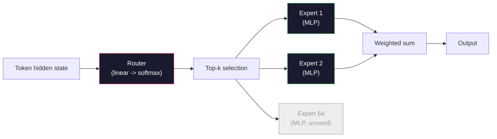

# Open Models: 架构讲解

> 你在第 04 课从零构建了一个 GPT-2 Small。2026 年的前沿 open models 属于同一个家族，只是有五六项具体变化。用 RMSNorm 取代 LayerNorm。用 SwiGLU 取代 GELU。用 RoPE 取代 learned positions。用 GQA 或 MLA 取代完整 MHA。大规模使用 Mixture-of-Experts。你已经掌握的数学覆盖了其中 95%。本课会并排阅读 Llama 3、DeepSeek-V3、Mixtral、Qwen 和 Gemma，并指出每个架构发生分歧的确切位置。

**Type:** Learn
**Languages:** Python (stdlib)
**Prerequisites:** Phase 10, Lessons 04, 05, 12 (Pre-training, Scaling, Inference)
**Time:** ~45 minutes

## 学习目标
- 阅读 Llama 3、Mistral、Mixtral、Gemma 2、Qwen 2.5 和 DeepSeek-V3 的 config.json，并解释每一个字段
- 说出每个模型相对于 GPT-2 Small 做出的具体架构变化，并从第一性原理说明理由
- 仅根据 config 计算任意 open model 的参数量、KV cache 大小和 activation memory
- 在给定 latency、memory 和 capability 约束时，为部署目标选择合适的 open model

## 问题
在第 04 课中，你写了 350 行 numpy，得到了一个 GPT-2 形状的模型。Llama 3 405B 有一份 200 页的技术报告。你的直觉可能会认为它们是不同的物种。其实不是。那 200 页描述的是同一个对象，只是有五六个动机明确的修改，再加上关于 scaling 的大量实现细节。骨架没有变：embedding、transformer blocks、attention、MLP、norm、head。

本课是一次 diff。对于每个主要 open model 家族，我们会准确列出它相对 GPT-2 改了什么、为什么改、代价是什么。完成后，你就能阅读一张新的 model card，并在脑中把它翻译回 GPT-2 baseline。

实际收益是：当 Meta 发布 Llama 5，或者 DeepSeek 发布 V4 时，你不需要新的心智模型。你会查看 config，看见哪些众所周知的旋钮被调动了，然后知道下游影响是什么。2026 年的架构是一套有限工具箱。每个新模型只是选择了不同的子集。

## 概念
### The Invariant Core

所有 autoregressive open models 都共享：

- Token Embedding Matrix（vocab_size x hidden_dim）。
- N 个 decoder blocks 的堆叠：norm、self-attention、residual、norm、MLP、residual。
- 最终 norm 和投影到 vocab_size 的 linear head（通常与 embeddings weight-tied）。
- Causal mask，next-token cross-entropy Loss。

这就是形状。其余都是旋钮。

### 真正起作用的六个 Knobs

在所有 2024-2026 年的前沿 open model 中，同样六个设计选择反复出现：

1. **Normalization.** LayerNorm -> RMSNorm。
2. **Positional encoding.** Learned absolute -> RoPE（加上变体：YaRN、NTK）。
3. **Activation.** GELU -> SwiGLU（或 GeGLU）。
4. **Attention head sharing.** MHA -> GQA -> MQA -> MLA。
5. **Dense vs sparse MLP.** Dense -> Mixture-of-Experts。
6. **Pre-norm placement.** 保持 Pre-norm。Post-norm 已经消失。

其他一切（learning rate schedule、data mix、batch size、context length）都属于 training config，而不是架构。就是这六个旋钮。

### Knob 1: RMSNorm

LayerNorm 会减去均值、除以 std、缩放并平移。RMSNorm 只保留缩放：

```
RMSNorm(x) = x / sqrt(mean(x^2) + eps) * gamma
```

没有均值消除。没有 bias。每个 Token 少一次 matmul。Zhang and Sennrich (2019) 认为它在 machine translation 上可以匹配 LayerNorm，同时快 10%。所有现代 open model 都使用它。

代价：没有。收益：小幅 throughput 提升，代码更简单。

### Knob 2: RoPE

Learned position embeddings 在 GPT-2 中是一个 1024 槽位的查找表。Context 1025 就超出了表的末端。模型无法外推到训练长度之外。

Rotary Position Embedding（RoPE, Su et al. 2021）通过在 attention dot product 之前，将每个 Q 和 K Vector 按成对维度旋转来注入位置。旋转角度是 position 的确定性函数，所以没有要学习的东西，也不会耗尽。借助 scaling 技巧（NTK-aware interpolation、YaRN），一个在 8k context 上训练的模型可以在 inference 时延展到 128k，只带来适度 accuracy 损失。

```
q_rotated = rotate(q, angle(pos))
k_rotated = rotate(k, angle(pos))
score = q_rotated . k_rotated
```

每个 Llama、Mistral、Qwen、DeepSeek 和 Gemma 都使用 RoPE。Gemma 2 使用混合方式（大多数 layers 使用 RoPE，其他 layers 使用 local sliding-window attention）。

### Knob 3: SwiGLU

GPT-2 的 MLP 是 `x -> gelu(xW1 + b1) -> (...)W2 + b2`。SwiGLU（Shazeer 2020）用 gated product 替换 activation：

```
SwiGLU(x) = (xW1) * sigmoid(xW1) * xV
```

两个并行 projection，而不是一个，由 Swish activation 进行 gate。实证上，它在每参数 perplexity 上更强。Llama 2 采用了它，随后大家都跟进了。MLP 的 hidden size 通常会设置为让总参数量匹配原始 dense MLP：如果 GPT-2 使用 `ff_dim = 4 * hidden`，SwiGLU 使用 `ff_dim = (2/3) * 4 * hidden = 8/3 * hidden`。

### Knob 4: Attention Head Sharing

GPT-2 使用 **Multi-Head Attention (MHA)**：每个 head 都有自己的 Q、K、V projection。

**Multi-Query Attention (MQA, Shazeer 2019)** 在所有 heads 之间共享一个 K 和一个 V。将 KV cache 按 num_heads 缩减，在典型模型上就是 12x 到 32x 的下降。Accuracy 在困难 benchmark 上会略有下降。

**Grouped-Query Attention (GQA, Ainslie et al. 2023)** 是中间方案：G 组 Q heads 共享一个 K 和一个 V。Llama 3 8B 使用 GQA，包含 32 个 Q heads 和 8 个 KV heads（G=8），所以相较完整 MHA，KV cache 缩小 4x。

**Multi-Head Latent Attention (MLA, DeepSeek 2024)** 将 K 和 V 压缩到共享的 low-rank latent 中，再按 head 投影回去。它进一步降低 KV cache，同时保留每个 head 的表达能力。DeepSeek-V2 和 V3 依赖它实现 long-context 性能。

| Scheme | KV Heads | KV Cache | Accuracy |
|--------|----------|----------|----------|
| MHA    | num_heads | full | 最好 |
| GQA    | num_groups (G < num_heads) | num_heads / G 缩减 | 接近 MHA |
| MQA    | 1 | num_heads 缩减 | 小幅损失 |
| MLA    | latent, per-head decompression | 小于 MQA | 接近 MHA |

对于任何超过约 13B 参数的模型，GQA 或 MLA 实际上都是必需的。大规模 full MHA 会造成 KV cache 灾难。

### Knob 5: Mixture of Experts

Dense MLP 会为每个 Token 激活所有参数。MoE MLP 在每个 block 中有 K 个 experts，以及一个 router，它为每个 Token 选择 top-k experts（通常是 top-2）。只有这些 experts 的 weights 会对该 Token 执行 forward pass。

```
router_logits = xW_r
indices, weights = top_k(router_logits, k=2)
output = sum_i weights[i] * expert[indices[i]](x)
```

吸引力在于：你可以有 64 个各自 7B 大小的 experts（所以总参数量巨大），但每个 Token 只运行其中 2 个（所以 per-token compute 匹配 dense 7B 模型）。Mixtral 8x7B 总参数为 47B，但每个 Token 只激活 13B。DeepSeek-V3 总参数为 671B，但每个 Token 只激活 37B。



优点：相同 compute、更多参数、更强 capacity。缺点：expert memory 仍然必须放在某处（所以 serving 需要比 dense 等价模型更多的 VRAM）、router 的 load-balancing 很难，而且在 alignment 期间 fine-tuning router 本身就是一个研究领域。

### Knob 6: Pre-norm stays

原始 transformer 在每个 sublayer 之后应用 layer norm。自 GPT-2 以来，每个 open model 都把它放在每个 sublayer *之前*。Pre-norm 在深层训练时严格更容易。没有争议。

### Model-by-Model Diff

下面这张表把所有内容具体化。

| Model | Year | Total Params | Active Params | Norm | Activation | Position | Attention | MoE | Context |
|-------|------|-------------|---------------|------|-----------|----------|-----------|-----|---------|
| GPT-2 Small | 2019 | 124M | 124M | LayerNorm | GELU | Learned | MHA (12 heads) | no | 1k |
| Llama 3 8B | 2024 | 8B | 8B | RMSNorm | SwiGLU | RoPE | GQA (32/8) | no | 128k |
| Llama 3 70B | 2024 | 70B | 70B | RMSNorm | SwiGLU | RoPE | GQA (64/8) | no | 128k |
| Llama 3 405B | 2024 | 405B | 405B | RMSNorm | SwiGLU | RoPE | GQA (128/16) | no | 128k |
| Mistral 7B | 2023 | 7.2B | 7.2B | RMSNorm | SwiGLU | RoPE | GQA | no | 32k |
| Mixtral 8x7B | 2023 | 47B | 13B | RMSNorm | SwiGLU | RoPE | GQA | yes (8 experts, top-2) | 32k |
| Gemma 2 9B | 2024 | 9B | 9B | RMSNorm (pre+post) | GeGLU | RoPE + sliding | GQA | no | 8k |
| Qwen 2.5 72B | 2024 | 72B | 72B | RMSNorm | SwiGLU | RoPE (YaRN) | GQA (64/8) | no | 128k |
| DeepSeek V2 236B | 2024 | 236B | 21B | RMSNorm | SwiGLU | RoPE | MLA | yes (160 experts, top-6) | 128k |
| DeepSeek V3 | 2024 | 671B | 37B | RMSNorm | SwiGLU | RoPE | MLA | yes (256 experts, top-8) | 128k |

扫描这些列。RMSNorm 是通用的。SwiGLU 或它的 GeGLU 近亲是通用的。RoPE 是通用的。7B 以上 GQA 是通用的，除非被 MLA 替代。MoE 是最高端模型的差异点。

### Reading a config.json

Llama 3 8B config：

```
{
  "hidden_size": 4096,
  "intermediate_size": 14336,
  "num_hidden_layers": 32,
  "num_attention_heads": 32,
  "num_key_value_heads": 8,
  "max_position_embeddings": 131072,
  "rope_theta": 500000.0,
  "rms_norm_eps": 1e-5,
  "vocab_size": 128256
}
```

每个字段都对应你已经实现过的东西。

- `hidden_size`: embedding dimension。
- `intermediate_size`: MLP hidden size（3.5x hidden -- SwiGLU 数学）。
- `num_hidden_layers`: stack depth。
- `num_attention_heads`: Q heads。
- `num_key_value_heads`: KV heads（GQA）。
- `max_position_embeddings`: training context length。
- `rope_theta`: RoPE base frequency。Meta 将它从默认 10k scale 到 500k，用于 long-context extrapolation。
- `rms_norm_eps`: numerical stability。
- `vocab_size`: tokens。

仅凭这些，你就可以计算总参数量、KV cache 和峰值 activation memory。精确公式见 `code/main.py`。

### Activation memory budget

在超过几十亿参数后，activations 会主导 training memory。pre-training 的经验法则（使用 gradient checkpointing）是：

```
activation_mem ~ batch_size * seq_len * hidden_size * num_layers * bytes_per_element
```

对于 Llama 3 8B，在 batch 1、seq 8192、BF16、32 layers、hidden 4096 时：仅 activations 就大约需要 8 GB（使用 checkpointing），不使用则约 40 GB。这就是 flash-attention 和 ring-attention 重要的原因：它们重写 attention computation，让 activations 能够放得下。

### KV Cache budget

对于 max context 下的 inference：

```
kv_cache = 2 * num_layers * num_kv_heads * head_dim * max_seq_len * bytes_per_element
```

Llama 3 8B 在 128k context、BF16、head_dim = hidden / num_heads = 128 时：
`2 * 32 * 8 * 128 * 131072 * 2 = 17.2 GB` 每个 sequence。

8B weights 在 BF16 中是 16 GB。单个 128k sequence 的 KV cache 比 weights 还大。这就是推动 GQA、MLA 和 KV cache quantization 研究的 memory pressure。

### When Each Model Wins

- **单张 80GB GPU，无 MoE**：Llama 3 8B、Mistral 7B、Gemma 2 9B。易于 serve，tooling 广泛。
- **单节点（8x80GB），大 capacity**：Llama 3 70B、Qwen 2.5 72B。最高的 dense open capability。
- **最大的 open capability，可接受 MoE 复杂度**：DeepSeek V3、Mixtral 8x22B。每 active FLOP 的 capability 最佳。
- **Long-context 需求**：Llama 3（通过 RoPE scaling 达到 128k）、DeepSeek（MLA 优势）。
- **Low-latency serving**：Gemma 2 9B（sliding window 降低 long-context compute）。


```figure
rmsnorm-vs-layernorm
```

## 构建它
本课的代码是一个计算器。给定任意 config.json，它会打印按组件划分的参数量、max context 下的 KV cache、SwiGLU MLP ratio，以及一个关于架构的简短判断（dense / GQA / MLA / MoE）。

```python
config = {
    "hidden_size": 4096, "intermediate_size": 14336,
    "num_hidden_layers": 32, "num_attention_heads": 32,
    "num_key_value_heads": 8, "vocab_size": 128256,
    "max_position_embeddings": 131072,
}
```

脚本会逐字段遍历架构，计算 embedding、attention（带 GQA reduction）、MLP（带 SwiGLU expansion）、layernorms 和 head 的参数量。然后它会按给定 context length 计算 KV cache，并打印 summary。

实现见 `code/main.py`。

## 使用它
运行计算器，使用脚本中捆绑的 Llama 3 8B、Mistral 7B、Mixtral 8x7B 和 DeepSeek V3 configs。比较参数分解。注意 MoE models 的总参数量远超 dense models，但 active param count 往往更小。注意 DeepSeek V3 的 KV cache 虽然总参数更多，却小于 Llama 3 405B 的 KV cache -- 这就是 MLA 的效果。

然后插入你本地任意模型的 config，阅读 summary，并判断它是否适合你的 GPU。

## 交付它
本课会生成 `outputs/skill-open-model-picker.md`。给定一个部署目标（GPU type、VRAM、context length、latency budget）和一个任务画像（chat、code、reasoning、long-context），它会推荐一个 open model、第 11 课中的 quantization scheme，以及第 12 课中的 inference stack，并显式说明六个架构旋钮相关的推理。

## 练习
1. 从 HuggingFace 阅读 Qwen 2.5 72B config。从零计算总参数量。与 HF 报告的值比较，并识别任何 delta 的来源（head dim rounding、KV sharing factor 等）。

2. DeepSeek V3 使用 256 个 experts，并采用 top-8 routing。计算 activated experts 与 total experts 的比例，并与 Mixtral 8x7B 的 8 个中 top-2 进行比较。从 sparse（25%）转向 denser sparse（3%）对于每 FLOP 的 capacity 意味着什么？

3. 计算 Llama 3 405B 在 128k context 下使用 FP8 和 BF16 时的 KV cache。FP8 是 BF16 数值的一半。在单个 8xH100 节点上（每张 80GB = 总计 640GB，减去 weight memory），你能 serve 多少个 parallel sequences？

4. Gemma 2 交替使用 full-attention 和 sliding-window-attention layers。当一半 layers 使用 4096-token sliding window 而不是 full context 时，写出 KV cache 的数学公式。在 8k total context 下能节省多少 memory？

5. 找一个在本课写完后发布的近期前沿 open model。识别它选择了六个旋钮中的哪些，以及它是否引入了第七个旋钮。课程会在新架构发布的那一刻显得过时 -- 目标是在不重建心智模型的前提下更新你的表格。

## 关键术语
| Term | What people say | What it actually means |
|------|----------------|----------------------|
| RMSNorm | “没有均值的 LayerNorm” | 只按 root mean square 进行 normalize，并使用 learned scale -- 更便宜且可与 LayerNorm 相比 |
| RoPE | “Rotary positions” | 将每个 Q 和 K Vector 按 2D pairs 旋转，角度取决于 position -- 结合 scaling 技巧可外推到训练长度之外 |
| SwiGLU | “新的 MLP activation” | 带 Swish 的 gated linear unit：`(xW1) * sigmoid(xW1) * xV` -- 是每个 2024+ open model 的标准配置 |
| GQA | “中间路线 attention” | Grouped-Query Attention：G 组 Q heads 共享一个 K 和一个 V head -- 在避免 MQA accuracy 损失的同时缩小 KV cache |
| MLA | “DeepSeek 的 attention” | Multi-Head Latent Attention：将 K/V 压缩到共享 low-rank latent，再按 head 解压 -- 大模型中最小的 KV cache |
| MoE | “Sparse experts” | Mixture of Experts：每个 block 有 N 个 MLPs，router 为每个 Token 选择 top-k -- 巨大的 total params，较小的 active params |
| Top-k routing | “每个 Token 选择 k 个 experts” | Router 为每个 expert 计算分数，并激活最高的 k 个 -- 典型 k 从 2（Mixtral）到 8（DeepSeek） |
| YaRN | “拉伸 RoPE” | Yet another RoPE extension -- 通过插值 rotary angles，在 inference 时将 context 从 8k 扩展到 128k+ |
| Sliding-window attention | “不要 attend to everything” | 每个 Token 只 attend 到最近 W 个 Tokens -- 将 attention cost 限制为每 Token O(W)，用于 Gemma 2 和早期 Mistral |
| Active params | “每个 Token 实际运行的部分” | 对于 MoE models，指每个 Token 会经历 forward pass 的参数量（远小于 total params）-- 决定 per-token FLOPs |

## 延伸阅读
- [Dubey et al., 2024 -- "The Llama 3 Herd of Models"](https://arxiv.org/abs/2407.21783) -- dense Llama 3 家族的架构与训练参考
- [DeepSeek-AI, 2024 -- "DeepSeek-V3 Technical Report"](https://arxiv.org/abs/2412.19437) -- MLA 加 auxiliary-loss-free load balancing 加 671B MoE
- [Jiang et al., 2024 -- "Mixtral of Experts"](https://arxiv.org/abs/2401.04088) -- 经典 MoE open model 论文
- [Su et al., 2021 -- "RoFormer: Enhanced Transformer with Rotary Position Embedding"](https://arxiv.org/abs/2104.09864) -- RoPE 论文
- [Shazeer, 2020 -- "GLU Variants Improve Transformer"](https://arxiv.org/abs/2002.05202) -- SwiGLU、GeGLU 及相关方法
- [Ainslie et al., 2023 -- "GQA: Training Generalized Multi-Query Transformer Models"](https://arxiv.org/abs/2305.13245) -- GQA 论文
- [Gemma 2 Team, 2024 -- "Gemma 2: Improving Open Language Models at a Practical Size"](https://arxiv.org/abs/2408.00118) -- hybrid full+sliding attention、pre+post-norm
- [Qwen Team, 2024 -- "Qwen 2.5 Technical Report"](https://arxiv.org/abs/2412.15115) -- YaRN context extension 和 long-context training recipes
