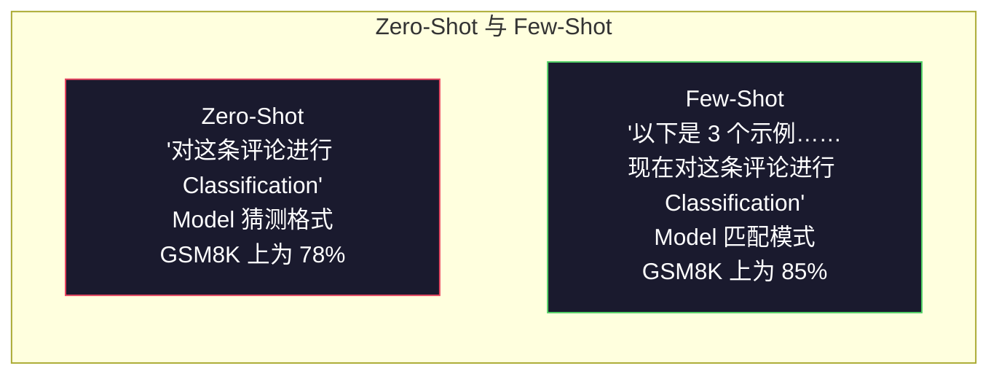
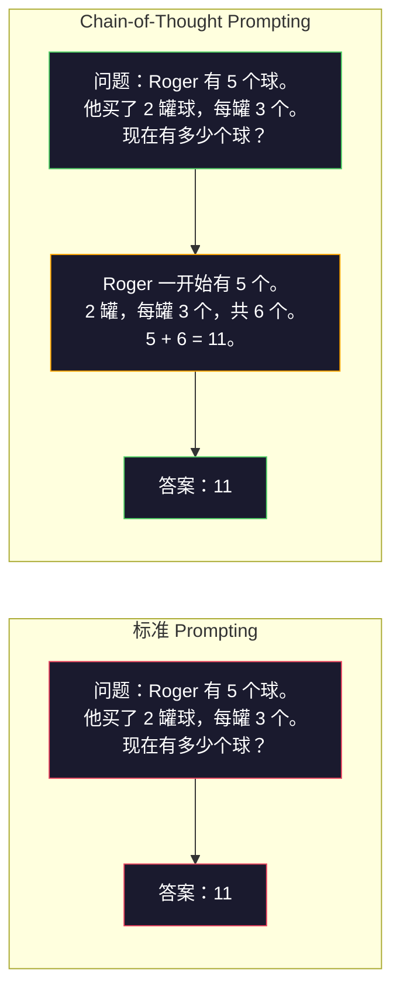
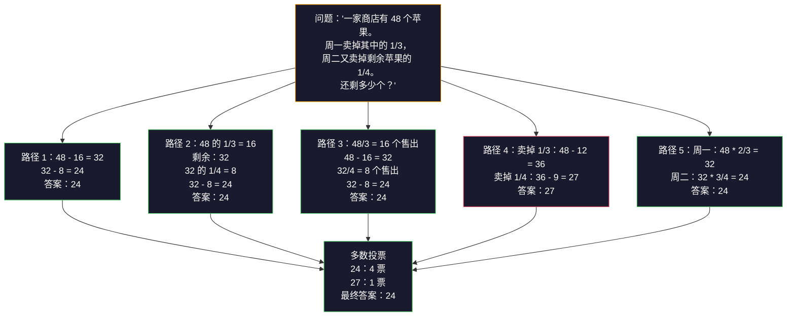
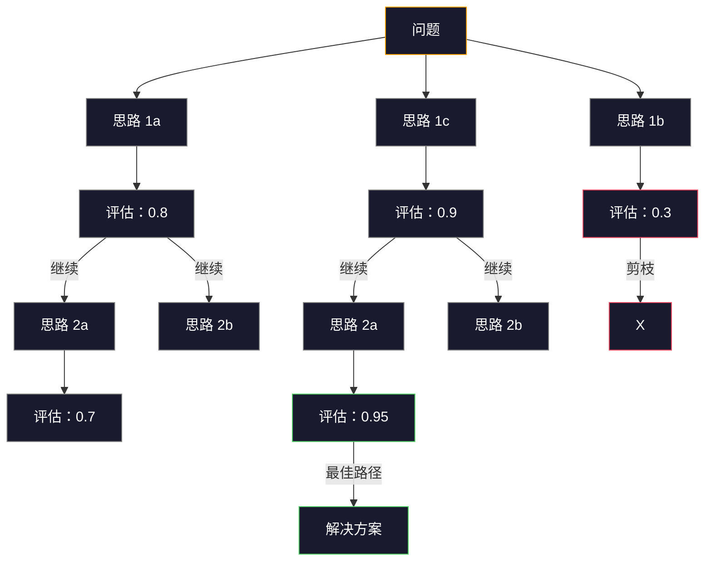

# Few-Shot、Chain-of-Thought、Tree-of-Thought

> 告诉 Model 要做什么，是 Prompting。向它展示如何思考，才是工程。同一个 Model、同一个任务、同一份数据，从 78% 到 91% 的准确率差距并不来自更好的 Model，而是来自更好的推理策略。

**Type:** Build
**Languages:** Python
**Prerequisites:** 第 11.01 课（Prompt Engineering）
**Time:** 约 45 分钟

## 学习目标

- 通过选择并格式化能够最大限度提高任务准确率的示例演示，实现 Few-Shot Prompting
- 应用 Chain-of-Thought（CoT）推理，提高数学应用题等多步骤问题的准确率
- 构建 Tree-of-Thought Prompt，探索多条推理路径并选择最佳路径
- 在标准基准上衡量 Zero-Shot、Few-Shot 和 CoT 带来的准确率提升

## 问题

你构建了一个数学辅导应用。Prompt 中写着：“解决这道应用题。”在标准小学数学基准 GSM8K 上，GPT-5 有 94% 的概率答对。你以为已经达到了极限。其实没有，Chain-of-Thought 仍然可以再提高 3-4 个百分点。

加上五个单词——“Let's think step by step”——准确率就会跃升至 91%。再加入几个完整演算的示例，就能达到 95%。Model 相同，temperature 相同，API 成本也相同。唯一的区别是，你给了 Model 一张草稿纸。

这不是一种取巧手段，而是推理本来的运作方式。人类不会通过一次思维跳跃解决多步骤问题，Transformer 也不会。当你迫使 Model 生成中间 Token 时，这些 Token 会成为下一个 Token 的 Context。每一步推理都会为下一步提供信息。Model 确实是在通过计算逐步得到答案。

但“think step by step”只是起点，而不是终点。如果你采样五条推理路径并进行多数投票，会怎样？如果让 Model 探索一棵可能性树，对分支进行评估和剪枝，又会怎样？如果将推理与 Tool 使用交错进行呢？这些并非假设，而是已经发表并经过量化验证的技术。本课将带你构建所有这些技术。

## 概念

### Zero-Shot 与 Few-Shot：示例何时胜过指令

Zero-Shot Prompting 只向 Model 提供任务，不提供其他内容。Few-Shot Prompting 则会先提供示例。

Wei 等人（2022）在 8 个基准上对此进行了测量。对于情感 Classification 等简单任务，Zero-Shot 与 Few-Shot 的表现差距在 2% 以内。对于多步骤算术和符号推理等复杂任务，Few-Shot 将准确率提高了 10-25%。

其直觉是：示例就是压缩后的指令。与其描述输出格式，不如直接展示。与其解释推理过程，不如亲自演示。相比解释抽象指令，Model 能更可靠地匹配示例中的模式。



**Few-Shot 更有优势的情况：** 对格式敏感的任务、Classification、结构化提取、特定领域术语，以及任何需要 Model 匹配特定模式的任务。

**Zero-Shot 更有优势的情况：** 简单事实问题、示例会限制创造力的创意任务，以及寻找优质示例比编写优质指令更困难的任务。

### 示例选择：相似优于随机

并非所有示例都同等有效。在 Classification 任务中，选择与目标输入相似的示例，比随机选择的效果高出 5-15%（Liu 等人，2022）。需要遵循三个原则：

1. **语义相似性**：选择在 Embedding 空间中最接近输入的示例
2. **Label 多样性**：在示例中覆盖所有输出类别
3. **难度匹配**：匹配目标问题的复杂程度

对于大多数任务，最佳示例数量是 3-5 个。少于 3 个时，Model 没有足够的信号来提取模式。超过 5 个后，收益开始递减，还会浪费 Context window 中的 Token。对于包含大量 Label 的 Classification 任务，每个 Label 使用一个示例。

### Chain-of-Thought：给 Model 一张草稿纸

Chain-of-Thought（CoT）Prompting 由 Google Brain 的 Wei 等人于 2022 年提出。其思想很简单：不要只要求 Model 给出答案，而要让它先展示推理步骤。



从机制上看，为什么这会奏效？Transformer 生成的每个 Token 都会成为下一个 Token 的 Context。如果没有 CoT，Model 必须把所有推理压缩到单次前向传播的隐藏状态中。使用 CoT 后，Model 会将中间计算外化为 Token。每个推理 Token 都会延伸有效计算深度。

**GSM8K 基准（小学数学，8,500 道题）：**

| Model | Zero-Shot | Zero-Shot CoT | Few-Shot CoT |
|-------|-----------|---------------|--------------|
| GPT-4o | 78% | 91% | 95% |
| GPT-5 | 94% | 97% | 98% |
| o4-mini（推理） | 97% | — | — |
| Claude Opus 4.7 | 93% | 97% | 98% |
| Gemini 3 Pro | 92% | 96% | 98% |
| Llama 4 70B | 80% | 89% | 94% |
| DeepSeek-V3.1 | 89% | 94% | 96% |

**关于推理 Model 的说明。** OpenAI o-series（o3、o4-mini）和 DeepSeek-R1 等 Model 会在输出答案前，在内部运行 Chain-of-Thought。向推理 Model 添加“Let's think step by step”是多余的，有时甚至会适得其反，因为它们已经这样做了。

CoT 有两种形式：

**Zero-Shot CoT**：在 Prompt 末尾添加“Let's think step by step”。不需要示例。Kojima 等人（2022）表明，这一句话就能提高算术、常识和符号推理任务的准确率。

**Few-Shot CoT**：提供包含推理步骤的示例。它比 Zero-Shot CoT 更有效，因为 Model 能看到你期望的确切推理格式。

**CoT 产生负面影响的情况**：简单事实回忆（“法国的首都是什么？”）、单步骤 Classification，以及速度比准确率更重要的任务。CoT 会为每次查询增加 50-200 个 Token 的推理开销。对于高吞吐量、低复杂度任务，这些都是浪费的成本。

### Self-Consistency：多次采样，一次投票

Wang 等人（2023）提出了 Self-Consistency。其洞察是：单条 CoT 路径可能包含推理错误。但如果采样 N 条相互独立的推理路径（使用 temperature > 0），并对最终答案进行多数投票，错误就会相互抵消。



在最初的 PaLM 540B 实验中，当 N=40 时，Self-Consistency 将 GSM8K 准确率从 56.5%（单次 CoT）提高到 74.4%。在 GPT-5 上，提升幅度较小（从 97% 提高到 98%），因为基础准确率已经趋于饱和。这项技术最适合基础 CoT 准确率为 60-85% 的 Model——在这个最佳区间内，单路径错误经常发生，但并非系统性错误。对于推理 Model（o-series、R1），Self-Consistency 已被内置的内部采样机制所涵盖。

代价是：N 个样本意味着 N 倍的 API 成本和延迟。在实践中，N=5 可以获得大部分收益。N=3 是形成有效投票的最低值。对于大多数任务，N > 10 后收益会逐渐递减。

### Tree-of-Thought：分支式探索

Yao 等人（2023）提出了 Tree-of-Thought（ToT）。CoT 沿着一条线性推理路径前进，而 ToT 会探索多个分支，并在继续之前评估哪些分支最有希望。



ToT 包含三个组成部分：

1. **思路生成**：生成多个候选的下一步
2. **状态评估**：为每个候选项评分（可以使用 LLM 本身作为评估器）
3. **搜索算法**：使用 BFS 或 DFS 搜索整棵树，并剪除低分分支

在 24 点任务中（使用算术运算组合 4 个数字得到 24），采用标准 Prompting 的 GPT-4 可以解决 7.3% 的问题。使用 CoT 时为 4.0%（CoT 实际上会损害此任务的表现，因为搜索空间很宽）。使用 ToT 时则达到 74%。

ToT 的成本很高。树中的每个节点都需要一次 LLM 调用。一棵分支因子为 3、深度为 3 的树最多需要 39 次 LLM 调用。只应将其用于搜索空间较大但可以评估的问题，例如规划、谜题求解和带约束的创造性问题求解。

### ReAct：思考 + 行动

Yao 等人（2022）将推理轨迹与行动结合起来。Model 在思考（生成推理）与行动（调用 Tool、搜索、计算）之间交替进行。


在知识密集型任务中，ReAct 的表现优于纯 CoT，因为它可以将推理建立在真实数据之上。在 HotpotQA（多跳问答）上，使用 GPT-4 的 ReAct 达到 35.1% 的精确匹配率，而仅使用 CoT 时为 29.4%。其真正的力量在于，观察结果可以纠正推理错误——Model 能够在执行过程中更新计划。

ReAct 是现代 AI Agent 的基础。每个 Agent 框架（LangChain、CrewAI、AutoGen）都会实现某种 Thought-Action-Observation 循环变体。你将在 Phase 14 中构建完整的 Agent。本课将介绍这一 Prompting 模式。

### 结构化 Prompting：XML 标签、分隔符、标题

随着 Prompt 变得越来越复杂，结构可以防止 Model 混淆各个部分。有三种方法：

**XML 标签**（最适合 Claude，在其他环境中也表现稳定）：
```
<context>
你正在审查一个 pull request。
该代码库使用 TypeScript 和 React。
</context>

<task>
审查以下 diff，找出 bug、安全问题和风格违规。
</task>

<diff>
{diff_content}
</diff>

<output_format>
列出每个问题，并包含：文件、行号、严重性（critical/warning/info）、描述。
</output_format>
```

**Markdown 标题**（通用）：
```
## 角色
金融科技公司的资深安全工程师。

## 任务
分析此 API endpoint 中的漏洞。

## 输入
{api_code}

## 规则
- 重点关注 OWASP Top 10
- 对每项发现进行评级：critical、high、medium、low
- 包含修复步骤
```

**分隔符**（精简但有效）：
```
---输入---
{user_text}
---输入结束---

---指令---
用 3 个要点总结以上内容。
---指令结束---
```

### Prompt Chaining：顺序分解

有些任务过于复杂，无法通过单个 Prompt 完成。Prompt Chaining 会将任务拆分为多个步骤，其中一个 Prompt 的输出会成为下一个 Prompt 的输入。


Chaining 胜过单 Prompt 有三个原因：

1. **每一步都更简单**：Model 每次只处理一个聚焦任务，而不必同时兼顾所有内容
2. **中间输出可以检查**：你可以在步骤之间进行验证和纠正
3. **不同步骤可以使用不同 Model**：使用廉价 Model 进行提取，使用昂贵 Model 进行推理

### 性能比较

| 技术 | 最适合 | GSM8K 准确率（GPT-5） | API 调用次数 | Token 开销 | 复杂度 |
|-----------|----------|------------------------|-----------|----------------|------------|
| Zero-Shot | 简单任务 | 94% | 1 | 无 | 极低 |
| Few-Shot | 格式匹配 | 96% | 1 | 200-500 个 Token | 低 |
| Zero-Shot CoT | 快速增强推理 | 97% | 1 | 50-200 个 Token | 极低 |
| Few-Shot CoT | 最大化单次调用准确率 | 98% | 1 | 300-600 个 Token | 低 |
| Self-Consistency（N=5） | 高风险推理 | 98.5% | 5 | 5 倍 Token 成本 | 中 |
| 推理 Model（o4-mini） | 直接替代 CoT | 97% | 1 | 隐藏（内部为 2-10 倍） | 极低 |
| Tree-of-Thought | 搜索/规划问题 | 不适用（24 点任务上为 74%） | 10-40+ | 10-40 倍 Token 成本 | 高 |
| ReAct | 基于知识的推理 | 不适用（HotpotQA 上为 35.1%） | 3-10+ | 可变 | 高 |
| Prompt Chaining | 复杂的多步骤任务 | 96%（Pipeline） | 2-5 | 2-5 倍 Token 成本 | 中 |

正确的技术取决于三个因素：准确率要求、延迟预算和成本承受能力。对于大多数生产系统，Few-Shot CoT 加上 3 次采样的 Self-Consistency 回退，可以覆盖 90% 的使用场景。

```figure
few-shot-curve
```

## 构建它

我们将构建一个数学问题求解器，把 Few-Shot Prompting、Chain-of-Thought 推理和 Self-Consistency 投票组合为一条 Pipeline。然后，我们会为困难问题加入 Tree-of-Thought。

完整实现位于 `code/advanced_prompting.py`。以下是关键组件。

### 第 1 步：Few-Shot 示例存储

第一个组件负责管理 Few-Shot 示例，并为给定问题选择最相关的示例。

```python
GSM8K_EXAMPLES = [
    {
        "question": "Janet's ducks lay 16 eggs per day. She eats three for breakfast every morning and bakes muffins for her friends every day with four. She sells every egg at the farmers' market for $2. How much does she make every day at the farmers' market?",
        "reasoning": "Janet's ducks lay 16 eggs per day. She eats 3 and bakes 4, using 3 + 4 = 7 eggs. So she has 16 - 7 = 9 eggs left. She sells each for $2, so she makes 9 * 2 = $18 per day.",
        "answer": "18"
    },
    ...
]
```

每个示例包含三个部分：问题、推理链和最终答案。正是推理链将普通的 Few-Shot 示例转变为 CoT Few-Shot 示例。

### 第 2 步：Chain-of-Thought Prompt 构建器

Prompt 构建器会将 system message、带有推理链的 Few-Shot 示例和目标问题组合成一个 Prompt。

```python
def build_cot_prompt(question, examples, num_examples=3):
    system = (
        "You are a math problem solver. "
        "For each problem, show your step-by-step reasoning, "
        "then give the final numerical answer on the last line "
        "in the format: 'The answer is [number]'."
    )

    example_text = ""
    for ex in examples[:num_examples]:
        example_text += f"Q: {ex['question']}\n"
        example_text += f"A: {ex['reasoning']} The answer is {ex['answer']}.\n\n"

    user = f"{example_text}Q: {question}\nA:"
    return system, user
```

格式约束（“The answer is [number]”）至关重要。没有它，Self-Consistency 就无法从多个样本中提取并比较答案。

### 第 3 步：Self-Consistency 投票

采样 N 条推理路径，并选取多数答案。

```python
def self_consistency_solve(question, examples, client, model, n_samples=5):
    system, user = build_cot_prompt(question, examples)

    answers = []
    reasonings = []
    for _ in range(n_samples):
        response = client.chat.completions.create(
            model=model,
            messages=[
                {"role": "system", "content": system},
                {"role": "user", "content": user}
            ],
            temperature=0.7
        )
        text = response.choices[0].message.content
        reasonings.append(text)
        answer = extract_answer(text)
        if answer is not None:
            answers.append(answer)

    vote_counts = Counter(answers)
    best_answer = vote_counts.most_common(1)[0][0] if vote_counts else None
    confidence = vote_counts[best_answer] / len(answers) if best_answer else 0

    return best_answer, confidence, reasonings, vote_counts
```

temperature 0.7 很重要。在 temperature 0.0 时，所有 N 个样本都会完全相同，从而失去采样的意义。你需要足够的随机性来产生多样化的推理路径，但又不能高到让 Model 输出毫无意义的内容。

### 第 4 步：Tree-of-Thought 求解器

对于线性推理失败的问题，ToT 会探索多种方法，并评估哪个方向最有希望。

```python
def tree_of_thought_solve(question, client, model, breadth=3, depth=3):
    thoughts = generate_initial_thoughts(question, client, model, breadth)
    scored = [(t, evaluate_thought(t, question, client, model)) for t in thoughts]
    scored.sort(key=lambda x: x[1], reverse=True)

    for current_depth in range(1, depth):
        next_thoughts = []
        for thought, score in scored[:2]:
            extensions = extend_thought(thought, question, client, model, breadth)
            for ext in extensions:
                ext_score = evaluate_thought(ext, question, client, model)
                next_thoughts.append((ext, ext_score))
        scored = sorted(next_thoughts, key=lambda x: x[1], reverse=True)

    best_thought = scored[0][0] if scored else ""
    return extract_answer(best_thought), best_thought
```

评估器本身也是一次 LLM 调用。你会询问 Model：“以 0.0 到 1.0 为范围，这条推理路径对于解决问题有多大希望？”这正是 ToT 的关键洞察——让 Model 评估自己的部分解决方案。

### 第 5 步：完整 Pipeline

该 Pipeline 使用一种逐级升级策略组合所有技术。

```python
def solve_with_escalation(question, examples, client, model):
    system, user = build_cot_prompt(question, examples)
    single_response = call_llm(client, model, system, user, temperature=0.0)
    single_answer = extract_answer(single_response)

    sc_answer, confidence, _, _ = self_consistency_solve(
        question, examples, client, model, n_samples=5
    )

    if confidence >= 0.8:
        return sc_answer, "self_consistency", confidence

    tot_answer, _ = tree_of_thought_solve(question, client, model)
    return tot_answer, "tree_of_thought", None
```

升级逻辑是：先尝试成本较低的方案（单次 CoT）。如果 Self-Consistency 的置信度低于 0.8（5 个样本中少于 4 个达成一致），就升级到 ToT。这样可以平衡成本和准确率——大多数问题都能以较低成本解决，而困难问题则会获得更多计算资源。

## 使用它

### 模板驱动的 Few-Shot Prompt

LangChain 为 Prompt 模板和输出解析提供内置支持，可以简化 Few-Shot 和 CoT 模式：

```python
from langchain_core.prompts import FewShotPromptTemplate, PromptTemplate
from langchain_openai import ChatOpenAI

example_prompt = PromptTemplate(
    input_variables=["question", "reasoning", "answer"],
    template="Q: {question}\nA: {reasoning} The answer is {answer}."
)

few_shot_prompt = FewShotPromptTemplate(
    examples=examples,
    example_prompt=example_prompt,
    suffix="Q: {input}\nA: Let's think step by step.",
    input_variables=["input"]
)

llm = ChatOpenAI(model="gpt-4o", temperature=0.7)
chain = few_shot_prompt | llm
result = chain.invoke({"input": "If a train travels 120 km in 2 hours..."})
```

LangChain 还提供用于语义相似性选择的 `ExampleSelector` 类：

```python
from langchain_core.example_selectors import SemanticSimilarityExampleSelector
from langchain_openai import OpenAIEmbeddings

selector = SemanticSimilarityExampleSelector.from_examples(
    examples,
    OpenAIEmbeddings(),
    k=3
)
```

### 编译式 Prompt

DSPy 将 Prompting 策略视为可优化模块。你不必手工设计 CoT Prompt，只需定义一个签名，然后让 DSPy 优化 Prompt：

```python
import dspy

dspy.configure(lm=dspy.LM("openai/gpt-4o", temperature=0.7))

class MathSolver(dspy.Module):
    def __init__(self):
        self.solve = dspy.ChainOfThought("question -> answer")

    def forward(self, question):
        return self.solve(question=question)

solver = MathSolver()
result = solver(question="Janet's ducks lay 16 eggs per day...")
```

DSPy 的 `ChainOfThought` 会自动添加推理轨迹。`dspy.majority` 实现了 Self-Consistency：

```python
result = dspy.majority(
    [solver(question=q) for _ in range(5)],
    field="answer"
)
```

### 比较：从零构建与框架

| Feature | 从零构建（本课） | LangChain | DSPy |
|---------|--------------------------|-----------|------|
| 对 Prompt 格式的控制 | 完全控制 | 基于模板 | 自动 |
| Self-Consistency | 手动投票 | 手动 | 内置（`dspy.majority`） |
| 示例选择 | 自定义逻辑 | `ExampleSelector` | `dspy.BootstrapFewShot` |
| Tree-of-Thought | 自定义树搜索 | 社区 Chain | 未内置 |
| Prompt 优化 | 手动迭代 | 手动 | 自动编译 |
| 最适合 | 学习、自定义 Pipeline | 标准工作流 | 研究、优化 |

## 交付它

本课会产出两个 Artifact。

**1. 推理链 Prompt**（`outputs/prompt-reasoning-chain.md`）：一个可用于生产环境的 Few-Shot CoT Prompt 模板，支持 Self-Consistency。填入你的示例和问题领域即可使用。

**2. CoT 模式选择 Skill**（`outputs/skill-cot-patterns.md`）：一个决策框架，可以根据任务类型、准确率要求和成本约束选择正确的推理技术。

## 练习

1. **测量差距**：选取 10 道 GSM8K 题目。分别使用 Zero-Shot、Few-Shot、Zero-Shot CoT 和 Few-Shot CoT 解答每道题。记录每种方法的准确率。哪种技术为你的 Model 带来的提升最大？

2. **示例选择实验**：对相同的 10 道题，比较随机选择示例与手工挑选相似示例。测量准确率差异。在什么情况下，示例质量会比示例数量更重要？

3. **Self-Consistency 成本曲线**：在 20 道 GSM8K 题目上，分别以 N=1、3、5、7、10 运行 Self-Consistency。绘制准确率与成本（Token 总数）的关系图。对于你的 Model，曲线的拐点在哪里？

4. **构建 ReAct 循环**：使用计算器 Tool 扩展 Pipeline。当 Model 生成数学表达式时，在 sandbox 中使用 Python 的 `eval()` 执行它，并将结果反馈给 Model。测量基于 Tool 的推理是否优于纯 CoT。

5. **将 ToT 用于创意任务**：让 Tree-of-Thought 求解器适应一项创意写作任务：“写一个既有趣又悲伤的六词故事。”使用 LLM 作为评估器。相比单次生成，分支式探索是否能产生更好的创意输出？

## 关键术语

| 术语 | 人们通常怎么说 | 它的实际含义 |
|------|----------------|----------------------|
| Few-Shot Prompting | “给它一些示例” | 在 Prompt 中包含输入-输出演示，以固定 Model 的输出格式和行为 |
| Chain-of-Thought | “让它逐步思考” | 引出中间推理 Token，在生成最终答案之前延伸 Model 的有效计算过程 |
| Self-Consistency | “多运行几次” | 在 temperature > 0 时采样 N 条多样化的推理路径，并通过多数投票选择最常见的最终答案 |
| Tree-of-Thought | “让它探索不同选项” | 对推理分支进行结构化搜索，评估每个部分解决方案，并且只扩展有希望的路径 |
| ReAct | “思考 + Tool 使用” | 在 Thought-Action-Observation 循环中，将推理轨迹与外部行动（搜索、计算、API 调用）交错进行 |
| Prompt Chaining | “把它拆成多个步骤” | 将复杂任务分解为一系列顺序 Prompt，其中每个输出都会送入下一个输入 |
| Zero-Shot CoT | “只需添加‘think step by step’” | 在没有任何示例的情况下向 Prompt 添加推理触发短语，依赖 Model 潜在的推理能力 |

## 延伸阅读

- [Chain-of-Thought Prompting Elicits Reasoning in Large Language Models](https://arxiv.org/abs/2201.11903)——Wei 等人，2022。来自 Google Brain 的原始 CoT 论文。阅读第 2-3 节，了解核心结果。
- [Self-Consistency Improves Chain of Thought Reasoning in Language Models](https://arxiv.org/abs/2203.11171)——Wang 等人，2023。Self-Consistency 论文。表 1 包含你需要的所有数据。
- [Tree of Thoughts: Deliberate Problem Solving with Large Language Models](https://arxiv.org/abs/2305.10601)——Yao 等人，2023。ToT 论文。第 4 节中的 24 点任务结果是亮点。
- [ReAct: Synergizing Reasoning and Acting in Language Models](https://arxiv.org/abs/2210.03629)——Yao 等人，2022。现代 AI Agent 的基础。第 3 节介绍了 Thought-Action-Observation 循环。
- [Large Language Models are Zero-Shot Reasoners](https://arxiv.org/abs/2205.11916)——Kojima 等人，2022。提出“Let's think step by step”的论文。考虑到方法如此简单，其效果令人惊讶。
- [DSPy: Compiling Declarative Language Model Calls into Self-Improving Pipelines](https://arxiv.org/abs/2310.03714)——Khattab 等人，2023。将 Prompting 视为编译问题。如果你希望超越手动 Prompt Engineering，可以阅读这篇论文。
- [OpenAI — Reasoning models guide](https://platform.openai.com/docs/guides/reasoning)——关于 Chain-of-Thought 何时会从 Prompt 层面的技巧转变为内部运行、按 Token 计费的“reasoning”模式的厂商指南。
- [Lightman 等人，“Let's Verify Step by Step”（2023）](https://arxiv.org/abs/2305.20050)——对推理链中每一步进行评分的过程奖励 Model（PRM）；这种推理监督信号的效果优于只看结果的奖励。
- [Snell 等人，“Scaling LLM Test-Time Compute Optimally”（2024）](https://arxiv.org/abs/2408.03314)——对 CoT 长度、Self-Consistency 采样和 MCTS 的系统研究；揭示了当准确率比延迟更重要时，“think step by step”将走向何方。
