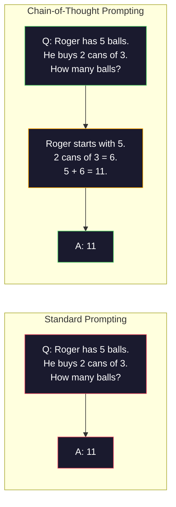
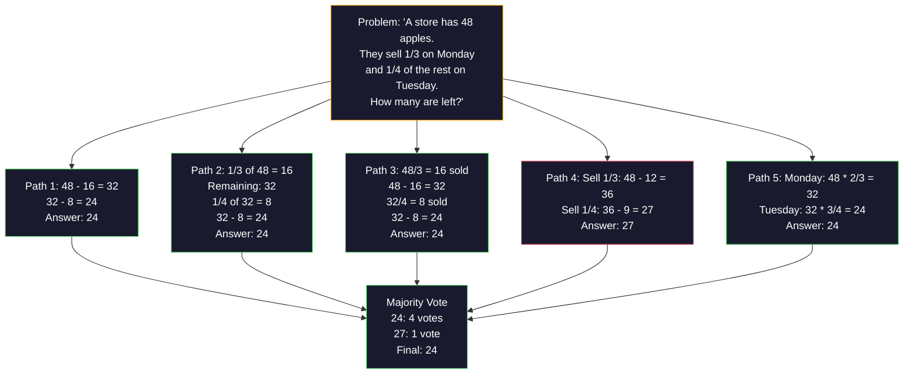
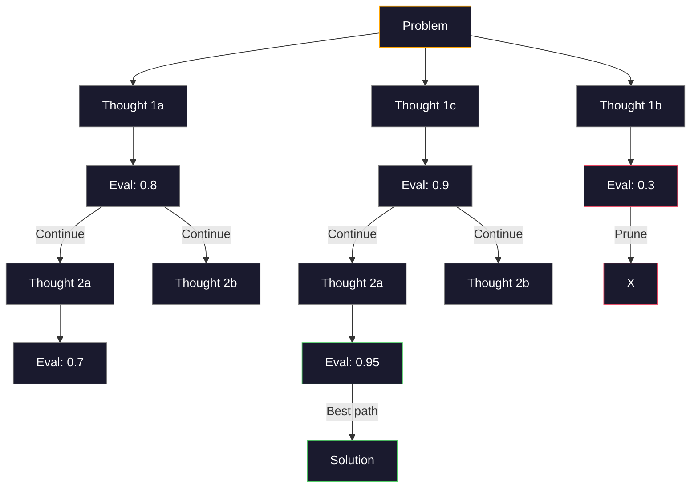

# Few-Shot、Chain-of-Thought、Tree-of-Thought

> 告诉模型要做什么是 prompting。展示给它如何思考才是 engineering。同一个模型、同一个任务、同一份数据，从 78% 到 91% 准确率的差距，不是更好的模型，而是更好的推理策略。

**类型：** 构建
**语言：** Python
**先修要求：** Lesson 11.01 (Prompt Engineering)
**时间：** 约 45 分钟

## 学习目标

- 通过选择和格式化示例演示来实现 few-shot prompting，从而最大化任务准确率
- 应用 chain-of-thought (CoT) 推理，提高数学应用题等多步骤问题的准确率
- 构建 tree-of-thought prompt，探索多条推理路径并选择最佳路径
- 在标准 benchmark 上衡量 zero-shot、few-shot 与 CoT 带来的准确率提升

## 问题

你正在构建一个数学辅导 app。你的 prompt 写着：“Solve this word problem.” 在 GSM8K 这个标准小学数学 benchmark 上，GPT-5 有 94% 的时间能答对。你以为已经到顶了。并没有——chain-of-thought 仍然能再增加 3-4 个百分点。

加上五个词——“Let's think step by step”——准确率跃升到 91%。再加几个带完整解法的示例，就能达到 95%。同一个模型。同一个 temperature。同样的 API 成本。唯一差别是你给了模型草稿纸。

这不是 hack。这就是推理的工作方式。人类不会一次心算跳跃就解决多步骤问题。Transformer 也不会。当你迫使模型生成中间 Token 时，这些 Token 会成为下一个 Token 的上下文。每一步推理都会喂给下一步。模型实际上是在一步步计算出答案。

但 “think step by step” 只是开始，不是终点。如果你采样五条推理路径，然后进行多数投票会怎样？如果你让模型探索一棵可能性树，评估并剪枝分支会怎样？如果你把推理和工具使用交织起来会怎样？这些都不是假设。它们是已经发表、并有实测提升的技术，本课你会把它们全部构建出来。

## 核心概念

### Zero-Shot vs Few-Shot：示例何时胜过指令

Zero-shot prompting 只给模型一个任务，除此之外什么都不给。Few-shot prompting 会先给模型示例。

Wei et al. (2022) 在 8 个 benchmark 上测量了这一点。对于情感分类等简单任务，zero-shot 和 few-shot 的表现差距在 2% 以内。对于多步骤算术和符号推理等复杂任务，few-shot 能将准确率提高 10-25%。

直觉是：示例是压缩后的指令。与其描述输出格式，不如直接展示。与其解释推理过程，不如直接演示。相比解释抽象指令，模型更可靠地在示例上进行模式匹配。


**few-shot 适合的场景：** 对格式敏感的任务、分类、结构化抽取、领域专用术语，以及任何需要模型匹配特定模式的任务。

**zero-shot 适合的场景：** 简单事实问题、示例会限制创造力的创意任务，以及找到好示例比写好指令更难的任务。

### 示例选择：相似胜过随机

并非所有示例都一样。选择与目标输入相似的示例，在分类任务上比随机选择高出 5-15%（Liu et al., 2022）。三个原则：

1. **语义相似性**：选择 Embedding 空间中最接近输入的示例
2. **标签多样性**：示例要覆盖所有输出类别
3. **难度匹配**：匹配目标问题的复杂度水平

对大多数任务来说，最佳示例数量是 3-5 个。少于 3 个时，模型没有足够信号抽取模式。超过 5 个时，收益递减，并浪费 context window Token。对于多标签分类，每个标签使用一个示例。

### Chain-of-Thought：给模型草稿纸

Chain-of-Thought (CoT) prompting 由 Google Brain 的 Wei et al. (2022) 提出。想法很简单：不要只要求模型给答案，而是先要求它展示推理步骤。



从机制上看，为什么这有效？Transformer 生成的每个 Token 都会成为下一个 Token 的上下文。没有 CoT 时，模型必须把所有推理压缩进一次 forward pass 的 hidden state 中。有了 CoT，模型会把中间计算外化为 Token。每个推理 Token 都延长了有效计算深度。

**GSM8K benchmark（小学数学，8.5K 道题）：**

| Model | Zero-Shot | Zero-Shot CoT | Few-Shot CoT |
|-------|-----------|---------------|--------------|
| GPT-4o | 78% | 91% | 95% |
| GPT-5 | 94% | 97% | 98% |
| o4-mini (reasoning) | 97% | — | — |
| Claude Opus 4.7 | 93% | 97% | 98% |
| Gemini 3 Pro | 92% | 96% | 98% |
| Llama 4 70B | 80% | 89% | 94% |
| DeepSeek-V3.1 | 89% | 94% | 96% |

**关于 reasoning models 的说明。** OpenAI 的 o-series（o3、o4-mini）和 DeepSeek-R1 等模型会在输出答案前在内部运行 chain-of-thought。对 reasoning model 添加 “Let's think step by step” 是重复的，有时甚至适得其反——它们已经做过了。

CoT 有两种形式：

**Zero-shot CoT**：在 prompt 后追加 “Let's think step by step”。不需要示例。Kojima et al. (2022) 表明，这一句话能提升算术、常识和符号推理任务的准确率。

**Few-shot CoT**：提供包含推理步骤的示例。它比 zero-shot CoT 更有效，因为模型能看到你期望的精确推理格式。

**CoT 会伤害表现的场景**：简单事实回忆（“What is the capital of France?”）、单步分类、速度比准确率更重要的任务。CoT 每次查询会增加 50-200 个推理 Token 的开销。对于高吞吐、低复杂度任务，这是浪费成本。

### Self-Consistency：多次采样，一次投票

Wang et al. (2023) 提出了 self-consistency。核心洞察是：单条 CoT 路径可能包含推理错误。但如果你采样 N 条独立推理路径（使用 temperature > 0），并对最终答案进行多数投票，错误会相互抵消。



在原始 PaLM 540B 实验中，self-consistency 将 GSM8K 准确率从 56.5%（单条 CoT）提升到 N=40 时的 74.4%。在 GPT-5 上提升很小（97% 到 98%），因为基础准确率已经接近饱和。该技术最适合基础 CoT 准确率在 60-85% 的模型——这是单路径错误频繁但并非系统性错误的甜点区间。对于 reasoning models（o-series、R1），self-consistency 已被内置的内部采样所涵盖。

权衡是：N 个样本意味着 N 倍 API 成本和延迟。实践中，N=5 能获得大部分收益。N=3 是有意义投票的最低值。对大多数任务来说，N > 10 收益递减。

### Tree-of-Thought：分支式探索

Yao et al. (2023) 提出了 Tree-of-Thought (ToT)。CoT 沿着一条线性推理路径前进，而 ToT 会探索多个分支，并在继续之前评估哪些分支最有前景。



ToT 有三个组成部分：

1. **Thought generation**：生成多个候选下一步
2. **State evaluation**：为每个候选打分（可以使用 LLM 自身作为评估器）
3. **Search algorithm**：通过 BFS 或 DFS 遍历树，并剪枝低分分支

在 Game of 24 任务中（用算术组合 4 个数字得到 24），使用标准 prompting 的 GPT-4 解题率为 7.3%。使用 CoT 为 4.0%（CoT 在这里实际上有害，因为搜索空间很宽）。使用 ToT 则达到 74%。

ToT 很昂贵。树中的每个节点都需要一次 LLM 调用。分支因子为 3、深度为 3 的树最多需要 39 次 LLM 调用。只在搜索空间大但可评估的问题上使用它——规划、解谜、带约束的创意问题解决。

### ReAct：Thinking + Doing

Yao et al. (2022) 将推理轨迹与动作结合起来。模型在思考（生成推理）和行动（调用工具、搜索、计算）之间交替。

```mermaid
graph LR
    Q["Question:\nWhat is the\npopulation of the\ncountry where\nthe Eiffel Tower\nis located?"]
    T1["Thought: I need to\nfind which country\nhas the Eiffel Tower"]
    A1["Action: search\n'Eiffel Tower location'"]
    O1["Observation:\nParis, France"]
    T2["Thought: Now I need\nFrance's population"]
    A2["Action: search\n'France population 2024'"]
    O2["Observation:\n68.4 million"]
    T3["Thought: I have\nthe answer"]
    F["Answer:\n68.4 million"]

    Q --> T1 --> A1 --> O1 --> T2 --> A2 --> O2 --> T3 --> F

    style Q fill:#1a1a2e,stroke:#ffa500,color:#fff
    style T1 fill:#1a1a2e,stroke:#51cf66,color:#fff
    style A1 fill:#1a1a2e,stroke:#e94560,color:#fff
    style O1 fill:#1a1a2e,stroke:#808080,color:#fff
    style T2 fill:#1a1a2e,stroke:#51cf66,color:#fff
    style A2 fill:#1a1a2e,stroke:#e94560,color:#fff
    style O2 fill:#1a1a2e,stroke:#808080,color:#fff
    style T3 fill:#1a1a2e,stroke:#51cf66,color:#fff
    style F fill:#1a1a2e,stroke:#51cf66,color:#fff
```



ReAct 在知识密集型任务上优于纯 CoT，因为它能把推理锚定在真实数据中。在 HotpotQA（多跳问答）上，使用 GPT-4 的 ReAct 达到 35.1% exact match，而单独 CoT 为 29.4%。真正的威力在于，推理错误会被 observations 纠正——模型可以在执行中更新计划。

ReAct 是现代 AI agents 的基础。每个 agent framework（LangChain、CrewAI、AutoGen）都会实现某种 Thought-Action-Observation 循环变体。你会在 Phase 14 构建完整 agents。本课覆盖的是 prompting pattern。

### Structured Prompting：XML Tags、Delimiters、Headers

随着 prompts 变复杂，结构能防止模型混淆不同部分。三种方法：

**XML tags**（最适合 Claude，在各处都稳健）：
```
<context>
You are reviewing a pull request.
The codebase uses TypeScript and React.
</context>

<task>
Review the following diff for bugs, security issues, and style violations.
</task>

<diff>
{diff_content}
</diff>

<output_format>
List each issue with: file, line, severity (critical/warning/info), description.
</output_format>
```

**Markdown headers**（通用）：
```
## Role
Senior security engineer at a fintech company.

## Task
Analyze this API endpoint for vulnerabilities.

## Input
{api_code}

## Rules
- Focus on OWASP Top 10
- Rate each finding: critical, high, medium, low
- Include remediation steps
```

**Delimiters**（极简但有效）：
```
---INPUT---
{user_text}
---END INPUT---

---INSTRUCTIONS---
Summarize the above in 3 bullet points.
---END INSTRUCTIONS---
```

### Prompt Chaining：顺序分解

有些任务对单个 prompt 来说太复杂。Prompt chaining 会把它们拆成多个步骤，其中一个 prompt 的输出会成为下一个 prompt 的输入。


Chaining 优于单 prompt 有三个原因：

1. **每一步更简单**：模型处理一个聚焦任务，而不是同时兼顾所有事情
2. **中间输出可检查**：你可以在步骤之间验证和纠正
3. **不同步骤可以使用不同模型**：用便宜模型做抽取，用昂贵模型做推理

### 性能对比

| Technique | Best For | GSM8K Accuracy (GPT-5) | API Calls | Token Overhead | Complexity |
|-----------|----------|------------------------|-----------|----------------|------------|
| Zero-Shot | 简单任务 | 94% | 1 | 无 | 极低 |
| Few-Shot | 格式匹配 | 96% | 1 | 200-500 tokens | 低 |
| Zero-Shot CoT | 快速推理提升 | 97% | 1 | 50-200 tokens | 极低 |
| Few-Shot CoT | 最高单次调用准确率 | 98% | 1 | 300-600 tokens | 低 |
| Self-Consistency (N=5) | 高风险推理 | 98.5% | 5 | 5x token cost | 中 |
| Reasoning model (o4-mini) | CoT 的直接替代 | 97% | 1 | hidden (2-10x internal) | 极低 |
| Tree-of-Thought | 搜索/规划问题 | N/A (74% on Game of 24) | 10-40+ | 10-40x token cost | 高 |
| ReAct | 基于知识的推理 | N/A (35.1% on HotpotQA) | 3-10+ | 可变 | 高 |
| Prompt Chaining | 复杂多步骤任务 | 96% (pipeline) | 2-5 | 2-5x token cost | 中 |

正确技术取决于三个因素：准确率要求、延迟预算和成本容忍度。对大多数生产系统来说，few-shot CoT 加 3-sample self-consistency fallback 可以覆盖 90% 的用例。

## 构建它

我们将构建一个数学问题求解器，把 few-shot prompting、chain-of-thought 推理和 self-consistency voting 组合成一个 pipeline。然后为难题加入 tree-of-thought。

完整实现在 `code/advanced_prompting.py` 中。下面是关键组件。

### 步骤 1：Few-Shot Example Store

第一个组件管理 few-shot examples，并为给定问题选择最相关的示例。

```python
GSM8K_EXAMPLES = [
    {
        "question": "Janet's ducks lay 16 eggs per day. She eats three for breakfast every morning and bakes muffins for her friends every day with four. She sells every egg at the farmers' market for $2. How much does she make every day at the farmers' market?",
        "reasoning": "Janet's ducks lay 16 eggs per day. She eats 3 and bakes 4, using 3 + 4 = 7 eggs. So she has 16 - 7 = 9 eggs left. She sells each for $2, so she makes 9 * 2 = $18 per day.",
        "answer": "18"
    },
    ...
]
```

每个示例包含三部分：问题、推理链和最终答案。推理链会把常规 few-shot example 转换成 CoT few-shot example。

### 步骤 2：Chain-of-Thought Prompt Builder

prompt builder 会把 system message、带推理链的 few-shot examples，以及目标问题组装成一个 prompt。

```python
def build_cot_prompt(question, examples, num_examples=3):
    system = (
        "You are a math problem solver. "
        "For each problem, show your step-by-step reasoning, "
        "then give the final numerical answer on the last line "
        "in the format: 'The answer is [number]'."
    )

    example_text = ""
    for ex in examples[:num_examples]:
        example_text += f"Q: {ex['question']}\n"
        example_text += f"A: {ex['reasoning']} The answer is {ex['answer']}.\n\n"

    user = f"{example_text}Q: {question}\nA:"
    return system, user
```

格式约束（“The answer is [number]”）至关重要。没有它，self-consistency 就无法跨样本抽取并比较答案。

### 步骤 3：Self-Consistency Voting

采样 N 条推理路径，并取多数答案。

```python
def self_consistency_solve(question, examples, client, model, n_samples=5):
    system, user = build_cot_prompt(question, examples)

    answers = []
    reasonings = []
    for _ in range(n_samples):
        response = client.chat.completions.create(
            model=model,
            messages=[
                {"role": "system", "content": system},
                {"role": "user", "content": user}
            ],
            temperature=0.7
        )
        text = response.choices[0].message.content
        reasonings.append(text)
        answer = extract_answer(text)
        if answer is not None:
            answers.append(answer)

    vote_counts = Counter(answers)
    best_answer = vote_counts.most_common(1)[0][0] if vote_counts else None
    confidence = vote_counts[best_answer] / len(answers) if best_answer else 0

    return best_answer, confidence, reasonings, vote_counts
```

Temperature 0.7 很重要。在 temperature 0.0 时，所有 N 个样本都会相同，从而失去意义。你需要足够的随机性来产生多样推理路径，但又不能随机到让模型输出胡言乱语。

### 步骤 4：Tree-of-Thought Solver

对于线性推理失败的问题，ToT 会探索多种方法，并评估哪个方向最有前景。

```python
def tree_of_thought_solve(question, client, model, breadth=3, depth=3):
    thoughts = generate_initial_thoughts(question, client, model, breadth)
    scored = [(t, evaluate_thought(t, question, client, model)) for t in thoughts]
    scored.sort(key=lambda x: x[1], reverse=True)

    for current_depth in range(1, depth):
        next_thoughts = []
        for thought, score in scored[:2]:
            extensions = extend_thought(thought, question, client, model, breadth)
            for ext in extensions:
                ext_score = evaluate_thought(ext, question, client, model)
                next_thoughts.append((ext, ext_score))
        scored = sorted(next_thoughts, key=lambda x: x[1], reverse=True)

    best_thought = scored[0][0] if scored else ""
    return extract_answer(best_thought), best_thought
```

评估器本身也是一次 LLM 调用。你问模型：“On a scale of 0.0 to 1.0, how promising is this reasoning path for solving the problem?” 这是 ToT 的关键洞察——模型会评估自己的部分解法。

### 步骤 5：完整 Pipeline

pipeline 通过升级策略组合所有技术。

```python
def solve_with_escalation(question, examples, client, model):
    system, user = build_cot_prompt(question, examples)
    single_response = call_llm(client, model, system, user, temperature=0.0)
    single_answer = extract_answer(single_response)

    sc_answer, confidence, _, _ = self_consistency_solve(
        question, examples, client, model, n_samples=5
    )

    if confidence >= 0.8:
        return sc_answer, "self_consistency", confidence

    tot_answer, _ = tree_of_thought_solve(question, client, model)
    return tot_answer, "tree_of_thought", None
```

升级逻辑：先尝试便宜方案（单次 CoT）。如果 self-consistency confidence 低于 0.8（5 个样本中少于 4 个一致），则升级到 ToT。这样能平衡成本和准确率——大多数问题便宜地解决，难题获得更多计算。

## 使用它

### With LangChain

LangChain 为 prompt templates 和 output parsing 提供内置支持，能简化 few-shot 和 CoT patterns：

```python
from langchain_core.prompts import FewShotPromptTemplate, PromptTemplate
from langchain_openai import ChatOpenAI

example_prompt = PromptTemplate(
    input_variables=["question", "reasoning", "answer"],
    template="Q: {question}\nA: {reasoning} The answer is {answer}."
)

few_shot_prompt = FewShotPromptTemplate(
    examples=examples,
    example_prompt=example_prompt,
    suffix="Q: {input}\nA: Let's think step by step.",
    input_variables=["input"]
)

llm = ChatOpenAI(model="gpt-4o", temperature=0.7)
chain = few_shot_prompt | llm
result = chain.invoke({"input": "If a train travels 120 km in 2 hours..."})
```

LangChain 还有用于语义相似性选择的 `ExampleSelector` classes：

```python
from langchain_core.example_selectors import SemanticSimilarityExampleSelector
from langchain_openai import OpenAIEmbeddings

selector = SemanticSimilarityExampleSelector.from_examples(
    examples,
    OpenAIEmbeddings(),
    k=3
)
```

### With DSPy

DSPy 将 prompting strategies 视为可优化模块。你无需手写 CoT prompts，而是定义一个 signature，然后让 DSPy 优化 prompt：

```python
import dspy

dspy.configure(lm=dspy.LM("openai/gpt-4o", temperature=0.7))

class MathSolver(dspy.Module):
    def __init__(self):
        self.solve = dspy.ChainOfThought("question -> answer")

    def forward(self, question):
        return self.solve(question=question)

solver = MathSolver()
result = solver(question="Janet's ducks lay 16 eggs per day...")
```

DSPy 的 `ChainOfThought` 会自动添加推理轨迹。`dspy.majority` 实现 self-consistency：

```python
result = dspy.majority(
    [solver(question=q) for _ in range(5)],
    field="answer"
)
```

### 对比：From-Scratch vs Frameworks

| Feature | From-Scratch (this lesson) | LangChain | DSPy |
|---------|--------------------------|-----------|------|
| 对 prompt format 的控制 | 完全控制 | 基于 template | 自动 |
| Self-consistency | 手动投票 | 手动 | 内置（`dspy.majority`） |
| Example selection | 自定义逻辑 | `ExampleSelector` | `dspy.BootstrapFewShot` |
| Tree-of-Thought | 自定义 tree search | Community chains | 未内置 |
| Prompt optimization | 手动迭代 | 手动 | 自动编译 |
| 最适合 | 学习、自定义 pipelines | 标准 workflows | 研究、优化 |

## 交付它

本课会产出两个 artifact。

**1. Reasoning Chain Prompt**（`outputs/prompt-reasoning-chain.md`）：一个 production-ready prompt template，用于带 self-consistency 的 few-shot CoT。接入你的示例和问题领域即可使用。

**2. CoT Pattern Selection Skill**（`outputs/skill-cot-patterns.md`）：一个决策框架，用于基于任务类型、准确率要求和成本约束选择合适的推理技术。

## 练习

1. **衡量差距**：取 10 道 GSM8K 题。分别用 zero-shot、few-shot、zero-shot CoT 和 few-shot CoT 解每一道题。记录每种方法的准确率。哪种技术在你的模型上带来的提升最大？

2. **示例选择实验**：对同样 10 道题，比较随机示例选择与手工挑选相似示例。衡量准确率差异。什么时候示例质量比示例数量更重要？

3. **Self-consistency 成本曲线**：在 20 道 GSM8K 题上用 N=1、3、5、7、10 运行 self-consistency。绘制准确率 vs 成本（总 Token）。对你的模型来说，曲线的拐点在哪里？

4. **构建 ReAct loop**：用 calculator tool 扩展 pipeline。当模型生成数学表达式时，用 Python 的 `eval()`（在 sandbox 中）执行它，并把结果反馈回去。衡量工具锚定推理是否优于纯 CoT。

5. **ToT 用于创意任务**：将 Tree-of-Thought solver 改造用于创意写作任务：“Write a 6-word story that is both funny and sad.” 使用 LLM 作为评估器。分支式探索是否比 single-shot generation 产生更好的创意输出？

## 关键术语

| Term | 人们通常说 | 实际含义 |
|------|----------------|----------------------|
| Few-shot prompting | “给它一些示例” | 在 prompt 中包含 input-output demonstrations，用于锚定模型的输出格式和行为 |
| Chain-of-Thought | “让它一步步思考” | 引出中间推理 Token，在生成最终答案前延长模型的有效计算 |
| Self-Consistency | “多运行几次” | 在 temperature > 0 下采样 N 条多样推理路径，并通过多数投票选择最常见的最终答案 |
| Tree-of-Thought | “让它探索选项” | 对推理分支进行结构化搜索，每个部分解法都会被评估，只有有前景的路径会被扩展 |
| ReAct | “思考 + 工具使用” | 在 Thought-Action-Observation loop 中交织推理轨迹与外部动作（搜索、计算、API calls） |
| Prompt chaining | “拆成步骤” | 将复杂任务分解为顺序 prompts，每一步输出都会馈入下一步输入 |
| Zero-shot CoT | “只加上 ‘think step by step’” | 不提供任何示例，只在 prompt 后追加推理触发短语，依赖模型的潜在推理能力 |

## 延伸阅读

- [Chain-of-Thought Prompting Elicits Reasoning in Large Language Models](https://arxiv.org/abs/2201.11903) -- Wei et al. 2022。Google Brain 的原始 CoT 论文。阅读第 2-3 节了解核心结果。
- [Self-Consistency Improves Chain of Thought Reasoning in Language Models](https://arxiv.org/abs/2203.11171) -- Wang et al. 2023。self-consistency 论文。表 1 有你需要的所有数字。
- [Tree of Thoughts: Deliberate Problem Solving with Large Language Models](https://arxiv.org/abs/2305.10601) -- Yao et al. 2023。ToT 论文。第 4 节的 Game of 24 结果是亮点。
- [ReAct: Synergizing Reasoning and Acting in Language Models](https://arxiv.org/abs/2210.03629) -- Yao et al. 2022。现代 AI agents 的基础。第 3 节解释了 Thought-Action-Observation loop。
- [Large Language Models are Zero-Shot Reasoners](https://arxiv.org/abs/2205.11916) -- Kojima et al. 2022。“Let's think step by step” 论文。以如此简单的方式取得了出人意料的效果。
- [DSPy: Compiling Declarative Language Model Calls into Self-Improving Pipelines](https://arxiv.org/abs/2310.03714) -- Khattab et al. 2023。将 prompting 视为编译问题。如果你想超越手动 prompt engineering，值得阅读。
- [OpenAI — Reasoning models guide](https://platform.openai.com/docs/guides/reasoning) -- 关于何时 chain-of-thought 会从 prompt-level trick 变成内部、按 Token 计价的 “reasoning” mode 的 vendor guidance。
- [Lightman et al., "Let's Verify Step by Step" (2023)](https://arxiv.org/abs/2305.20050) -- process reward models (PRM)，用于给链中的每一步打分；这是比 only-outcome rewards 更成功的推理监督信号。
- [Snell et al., "Scaling LLM Test-Time Compute Optimally" (2024)](https://arxiv.org/abs/2408.03314) -- 对 CoT 长度、self-consistency sampling 和 MCTS 的系统研究；当准确率比延迟更重要时，“think step by step” 会走向何处。
