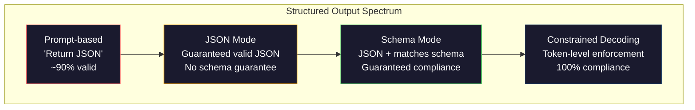
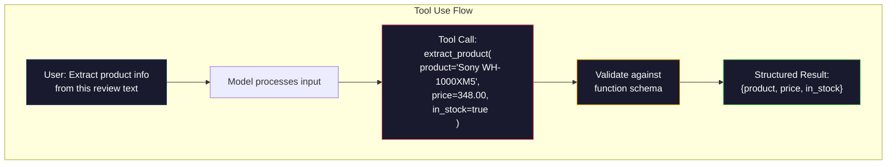

# 结构化输出：JSON、Schema Validation、Constrained Decoding

> 你的 LLM 返回的是字符串。你的应用需要的是 JSON。这个落差导致的生产系统崩溃，比任何模型幻觉都多。结构化输出是自然语言与类型化数据之间的桥梁。做对了，你的 LLM 就会成为可靠的 API。做错了，你就是凌晨 3 点还在用 regex 解析自由文本。

**类型：** Build
**语言：** Python
**先修要求：** Phase 10, Lessons 01-05 (LLMs from Scratch)
**时间：** 约 90 分钟
**相关内容：** Phase 5 · 20 (Structured Outputs & Constrained Decoding) 涵盖 decoder 层面的理论（FSM/CFG logit processors、Outlines、XGrammar）。本课聚焦生产环境中的 SDK 接口（OpenAI `response_format`、Anthropic tool use、Instructor）——如果你想理解 API 之下发生了什么，请先阅读 Phase 5 · 20。

## 学习目标

- 使用 OpenAI 和 Anthropic API 参数实现 JSON-mode 和 schema-constrained outputs
- 构建一个 Pydantic validation 层，用于拒绝格式错误的 LLM outputs，并通过错误反馈进行重试
- 解释 constrained decoding 如何在 Token 层面强制生成有效 JSON，而无需后处理
- 设计稳健的抽取 prompts，将非结构化文本可靠地转换为类型化数据结构

## 问题

你问 LLM：“从这段文本中抽取产品名称、价格和库存状态。”它回答：

```
The product is the Sony WH-1000XM5 headphones, which cost $348.00 and are currently in stock.
```

这是一个完全正确的答案。对你的应用来说，它也完全没用。你的库存系统需要的是 `{"product": "Sony WH-1000XM5", "price": 348.00, "in_stock": true}`。你需要一个具有特定 key、特定类型和特定取值约束的 JSON object。你不需要一个句子。

朴素解法：在 prompt 里加上“Respond in JSON”。这在 90% 的情况下有效。另外 10% 的情况下，模型会把 JSON 包在 markdown code fences 中，或者加上类似“Here's the JSON:”的前言，或者因为提前关闭了括号而生成语法无效的 JSON。你的 JSON parser 崩溃。你的 pipeline 中断。你加上 try/except 和 retry loop。重试有时会生成不同的数据。现在你在解析问题之上又多了一个一致性问题。

这不是 prompt engineering 问题。这是 decoding 问题。模型从左到右生成 Token。在每个位置，它会从 10 万多个选项的 vocabulary 中选择最可能的下一个 Token。在任意给定位置，其中大多数选项都会生成无效 JSON。如果模型刚刚输出了 `{"price":`，下一个 Token 必须是数字、引号（用于 string）、`null`、`true`、`false` 或负号。其他任何内容都会生成无效 JSON。没有约束时，模型可能会选择一个看起来完全合理的英文单词，但在语法上是灾难性的错误。

## 概念

### 结构化输出谱系

结构化输出控制有四个层级，每一级都比前一级更可靠。



**基于 Prompt**（“Respond in valid JSON”）：没有强制约束。模型通常会遵守，但有时不会。可靠性：约 90%。失败模式：markdown fences、前言文本、截断输出、结构错误。

**JSON mode**：API 保证输出是有效 JSON。OpenAI 的 `response_format: { type: "json_object" }` 会启用该模式。输出可以无错误解析。但它不一定匹配你期望的 schema——可能有额外 key、错误类型、缺失字段。

**Schema mode**：API 接收一个 JSON Schema，并保证输出与之匹配。到 2026 年，所有主要 provider 都原生支持这一点：OpenAI 的 `response_format: { type: "json_schema", json_schema: {...} }`（也可通过 `tool_choice="required"`）、Anthropic 的 tool use 配合 `input_schema`，以及 Gemini 的 `response_schema` + `response_mime_type: "application/json"`。输出会包含你指定的精确 key、类型和约束。

**Constrained decoding**：在生成过程的每个 Token 位置，decoder 会屏蔽所有会导致无效输出的 Token。如果 schema 要求一个 number，而模型即将输出一个字母，该 Token 的概率会被设为零。模型只能生成通向有效输出的 Token。这就是 OpenAI 的 structured output mode 以及 Outlines、Guidance 等库在底层实现的机制。

### JSON Schema：契约语言

JSON Schema 是你用来告诉模型（或 validation 层）输出必须具备什么形状的方式。所有主要的结构化输出系统都使用它。

```json
{
  "type": "object",
  "properties": {
    "product": { "type": "string" },
    "price": { "type": "number", "minimum": 0 },
    "in_stock": { "type": "boolean" },
    "categories": {
      "type": "array",
      "items": { "type": "string" }
    }
  },
  "required": ["product", "price", "in_stock"]
}
```

这个 schema 表示：输出必须是一个 object，包含 string 类型的 `product`、非负 number 类型的 `price`、boolean 类型的 `in_stock`，以及一个可选的 string 数组 `categories`。任何不匹配的输出都会被拒绝。

Schemas 可以处理困难情况：嵌套 objects、包含类型化 items 的 arrays、enums（将 string 约束到特定取值）、pattern matching（对 strings 使用 regex），以及 combinators（用于多态输出的 oneOf、anyOf、allOf）。

### Pydantic 模式

在 Python 中，你不会手写 JSON Schema。你定义一个 Pydantic model，它会为你生成 schema。

```python
from pydantic import BaseModel

class Product(BaseModel):
    product: str
    price: float
    in_stock: bool
    categories: list[str] = []
```

这会生成与上面相同的 JSON Schema。Instructor library（以及 OpenAI 的 SDK）可以直接接受 Pydantic models：传入 model class，返回一个经过验证的实例。如果 LLM output 不匹配，Instructor 会自动重试。

### Function Calling / Tool Use

这是同一问题的另一种接口。你不是让模型直接生成 JSON，而是定义带有类型化参数的“tools”（functions）。模型输出一个带有结构化 arguments 的 function call。OpenAI 称之为“function calling”。Anthropic 称之为“tool use”。结果相同：结构化数据。



当模型需要选择调用哪个 function，而不仅仅是填充参数时，tool use 更合适。如果你有 10 种不同的抽取 schemas，并且模型必须根据输入选择正确的一种，tool use 会同时给你 schema selection 和 structured output。

### 常见失败模式

即便有 schema enforcement，结构化输出仍可能以微妙方式失败。

**幻觉值**：输出匹配 schema，但包含编造的数据。当文本中写的是 $348，模型却生成 `{"price": 299.99}`。Schema validation 捕捉不到这一点——类型正确，但值错误。

**Enum 混淆**：你把字段约束为 `["in_stock", "out_of_stock", "preorder"]`。模型输出 `"available"`——语义正确，但不在允许集合中。优秀的 constrained decoding 可以避免这一点。基于 prompt 的方法不能。

**嵌套 object 深度**：深层嵌套 schemas（4 层以上）会产生更多错误。每一层嵌套都是模型可能忘记结构的位置。

**Array 长度**：模型可能在 array 中生成过多或过少 items。Schemas 支持 `minItems` 和 `maxItems`，但并非所有 providers 都会在 decoding 层面强制执行它们。

**可选字段省略**：模型会省略那些技术上可选、但对你的用例在语义上重要的字段。即使数据有时缺失，也要在 schema 中将它们设为 required——强制模型显式生成 `null`。

```figure
mx-schema-funnel
```

## 构建它

### 步骤 1：JSON Schema Validator

从零构建一个 validator，用于检查 Python object 是否匹配 JSON Schema。这是在输出侧运行以验证合规性的内容。

```python
import json

def validate_schema(data, schema):
    errors = []
    _validate(data, schema, "", errors)
    return errors

def _validate(data, schema, path, errors):
    schema_type = schema.get("type")

    if schema_type == "object":
        if not isinstance(data, dict):
            errors.append(f"{path}: expected object, got {type(data).__name__}")
            return
        for key in schema.get("required", []):
            if key not in data:
                errors.append(f"{path}.{key}: required field missing")
        properties = schema.get("properties", {})
        for key, value in data.items():
            if key in properties:
                _validate(value, properties[key], f"{path}.{key}", errors)

    elif schema_type == "array":
        if not isinstance(data, list):
            errors.append(f"{path}: expected array, got {type(data).__name__}")
            return
        min_items = schema.get("minItems", 0)
        max_items = schema.get("maxItems", float("inf"))
        if len(data) < min_items:
            errors.append(f"{path}: array has {len(data)} items, minimum is {min_items}")
        if len(data) > max_items:
            errors.append(f"{path}: array has {len(data)} items, maximum is {max_items}")
        items_schema = schema.get("items", {})
        for i, item in enumerate(data):
            _validate(item, items_schema, f"{path}[{i}]", errors)

    elif schema_type == "string":
        if not isinstance(data, str):
            errors.append(f"{path}: expected string, got {type(data).__name__}")
            return
        enum_values = schema.get("enum")
        if enum_values and data not in enum_values:
            errors.append(f"{path}: '{data}' not in allowed values {enum_values}")

    elif schema_type == "number":
        if not isinstance(data, (int, float)):
            errors.append(f"{path}: expected number, got {type(data).__name__}")
            return
        minimum = schema.get("minimum")
        maximum = schema.get("maximum")
        if minimum is not None and data < minimum:
            errors.append(f"{path}: {data} is less than minimum {minimum}")
        if maximum is not None and data > maximum:
            errors.append(f"{path}: {data} is greater than maximum {maximum}")

    elif schema_type == "boolean":
        if not isinstance(data, bool):
            errors.append(f"{path}: expected boolean, got {type(data).__name__}")

    elif schema_type == "integer":
        if not isinstance(data, int) or isinstance(data, bool):
            errors.append(f"{path}: expected integer, got {type(data).__name__}")
```

### 步骤 2：Pydantic 风格 Model 到 Schema

构建一个最小的 class-to-schema converter。定义一个 Python class，并自动生成它的 JSON Schema。

```python
class SchemaField:
    def __init__(self, field_type, required=True, default=None, enum=None, minimum=None, maximum=None):
        self.field_type = field_type
        self.required = required
        self.default = default
        self.enum = enum
        self.minimum = minimum
        self.maximum = maximum

def python_type_to_schema(field):
    type_map = {
        str: "string",
        int: "integer",
        float: "number",
        bool: "boolean",
    }

    schema = {}

    if field.field_type in type_map:
        schema["type"] = type_map[field.field_type]
    elif field.field_type == list:
        schema["type"] = "array"
        schema["items"] = {"type": "string"}
    elif isinstance(field.field_type, dict):
        schema = field.field_type

    if field.enum:
        schema["enum"] = field.enum
    if field.minimum is not None:
        schema["minimum"] = field.minimum
    if field.maximum is not None:
        schema["maximum"] = field.maximum

    return schema

def model_to_schema(name, fields):
    properties = {}
    required = []

    for field_name, field in fields.items():
        properties[field_name] = python_type_to_schema(field)
        if field.required:
            required.append(field_name)

    return {
        "type": "object",
        "properties": properties,
        "required": required,
    }
```

### 步骤 3：Constrained Token Filter

模拟 constrained decoding。给定一个部分 JSON string 和一个 schema，判断当前位点哪些 Token 类别是有效的。

```python
def next_valid_tokens(partial_json, schema):
    stripped = partial_json.strip()

    if not stripped:
        return ["{"]

    try:
        json.loads(stripped)
        return ["<EOS>"]
    except json.JSONDecodeError:
        pass

    last_char = stripped[-1] if stripped else ""

    if last_char == "{":
        return ['"', "}"]
    elif last_char == '"':
        if stripped.endswith('":'):
            return ['"', "0-9", "true", "false", "null", "[", "{"]
        return ["a-z", '"']
    elif last_char == ":":
        return [" ", '"', "0-9", "true", "false", "null", "[", "{"]
    elif last_char == ",":
        return [" ", '"', "{", "["]
    elif last_char in "0123456789":
        return ["0-9", ".", ",", "}", "]"]
    elif last_char == "}":
        return [",", "}", "]", "<EOS>"]
    elif last_char == "]":
        return [",", "}", "<EOS>"]
    elif last_char == "[":
        return ['"', "0-9", "true", "false", "null", "{", "[", "]"]
    else:
        return ["any"]

def demonstrate_constrained_decoding():
    partial_states = [
        '',
        '{',
        '{"product"',
        '{"product":',
        '{"product": "Sony"',
        '{"product": "Sony",',
        '{"product": "Sony", "price":',
        '{"product": "Sony", "price": 348',
        '{"product": "Sony", "price": 348}',
    ]

    print(f"{'Partial JSON':<45} {'Valid Next Tokens'}")
    print("-" * 80)
    for state in partial_states:
        valid = next_valid_tokens(state, {})
        display = state if state else "(empty)"
        print(f"{display:<45} {valid}")
```

### 步骤 4：抽取 Pipeline

把所有内容组合成一个抽取 pipeline：定义 schema，模拟 LLM 生成 structured output，验证输出，并处理重试。

```python
def simulate_llm_extraction(text, schema, attempt=0):
    if "headphones" in text.lower() or "sony" in text.lower():
        if attempt == 0:
            return '{"product": "Sony WH-1000XM5", "price": 348.00, "in_stock": true, "categories": ["audio", "headphones"]}'
        return '{"product": "Sony WH-1000XM5", "price": 348.00, "in_stock": true}'

    if "laptop" in text.lower():
        return '{"product": "MacBook Pro 16", "price": 2499.00, "in_stock": false, "categories": ["computers"]}'

    return '{"product": "Unknown", "price": 0, "in_stock": false}'

def extract_with_retry(text, schema, max_retries=3):
    for attempt in range(max_retries):
        raw = simulate_llm_extraction(text, schema, attempt)

        try:
            data = json.loads(raw)
        except json.JSONDecodeError as e:
            print(f"  Attempt {attempt + 1}: JSON parse error -- {e}")
            continue

        errors = validate_schema(data, schema)
        if not errors:
            return data

        print(f"  Attempt {attempt + 1}: Schema validation errors -- {errors}")

    return None

product_schema = {
    "type": "object",
    "properties": {
        "product": {"type": "string"},
        "price": {"type": "number", "minimum": 0},
        "in_stock": {"type": "boolean"},
        "categories": {"type": "array", "items": {"type": "string"}},
    },
    "required": ["product", "price", "in_stock"],
}
```

### 步骤 5：运行完整 Pipeline

```python
def run_demo():
    print("=" * 60)
    print("  Structured Output Pipeline Demo")
    print("=" * 60)

    print("\n--- Schema Definition ---")
    product_fields = {
        "product": SchemaField(str),
        "price": SchemaField(float, minimum=0),
        "in_stock": SchemaField(bool),
        "categories": SchemaField(list, required=False),
    }
    generated_schema = model_to_schema("Product", product_fields)
    print(json.dumps(generated_schema, indent=2))

    print("\n--- Schema Validation ---")
    test_cases = [
        ({"product": "Test", "price": 10.0, "in_stock": True}, "Valid object"),
        ({"product": "Test", "price": -5.0, "in_stock": True}, "Negative price"),
        ({"product": "Test", "in_stock": True}, "Missing price"),
        ({"product": "Test", "price": "ten", "in_stock": True}, "String as price"),
        ("not an object", "String instead of object"),
    ]

    for data, label in test_cases:
        errors = validate_schema(data, product_schema)
        status = "PASS" if not errors else f"FAIL: {errors}"
        print(f"  {label}: {status}")

    print("\n--- Constrained Decoding Simulation ---")
    demonstrate_constrained_decoding()

    print("\n--- Extraction Pipeline ---")
    texts = [
        "The Sony WH-1000XM5 headphones are priced at $348 and currently available.",
        "The new MacBook Pro 16-inch laptop costs $2499 but is sold out.",
        "This is a random sentence with no product info.",
    ]

    for text in texts:
        print(f"\n  Input: {text[:60]}...")
        result = extract_with_retry(text, product_schema)
        if result:
            print(f"  Output: {json.dumps(result)}")
        else:
            print(f"  Output: FAILED after retries")
```

## 使用它

### OpenAI Structured Outputs

```python
# from openai import OpenAI
# from pydantic import BaseModel
#
# client = OpenAI()
#
# class Product(BaseModel):
#     product: str
#     price: float
#     in_stock: bool
#
# response = client.beta.chat.completions.parse(
#     model="gpt-5-mini",
#     messages=[
#         {"role": "system", "content": "Extract product information."},
#         {"role": "user", "content": "Sony WH-1000XM5, $348, in stock"},
#     ],
#     response_format=Product,
# )
#
# product = response.choices[0].message.parsed
# print(product.product, product.price, product.in_stock)
```

OpenAI 的 structured output mode 在内部使用 constrained decoding。模型生成的每个 Token 都被保证会产生匹配 Pydantic schema 的输出。不需要 retries。不需要 validation。约束被内置进 decoding 过程。

### Anthropic Tool Use

```python
# import anthropic
#
# client = anthropic.Anthropic()
#
# response = client.messages.create(
#     model="claude-opus-4-7",
#     max_tokens=1024,
#     tools=[{
#         "name": "extract_product",
#         "description": "Extract product information from text",
#         "input_schema": {
#             "type": "object",
#             "properties": {
#                 "product": {"type": "string"},
#                 "price": {"type": "number"},
#                 "in_stock": {"type": "boolean"},
#             },
#             "required": ["product", "price", "in_stock"],
#         },
#     }],
#     messages=[{"role": "user", "content": "Extract: Sony WH-1000XM5, $348, in stock"}],
# )
```

Anthropic 通过 tool use 实现 structured output。模型会发出一个 tool call，其中包含匹配 input_schema 的结构化 arguments。结果相同，API surface 不同。

### Instructor Library

```python
# pip install instructor
# import instructor
# from openai import OpenAI
# from pydantic import BaseModel
#
# client = instructor.from_openai(OpenAI())
#
# class Product(BaseModel):
#     product: str
#     price: float
#     in_stock: bool
#
# product = client.chat.completions.create(
#     model="gpt-5-mini",
#     response_model=Product,
#     messages=[{"role": "user", "content": "Sony WH-1000XM5, $348, in stock"}],
# )
```

Instructor 包装任意 LLM client，并加入带 validation 的自动 retries。如果第一次尝试 validation 失败，它会把错误作为 context 发回给模型，并要求模型修复输出。这适用于任何 provider，不只限于 OpenAI。

## 交付它

本课会产出 `outputs/prompt-structured-extractor.md`——一个可复用的 prompt template，用于根据 schema definition 从任意文本中抽取结构化数据。给它一个 JSON Schema 和非结构化文本，它会返回经过验证的 JSON。

它还会产出 `outputs/skill-structured-outputs.md`——一个决策框架，用于根据你的 provider、可靠性要求和 schema 复杂度选择正确的结构化输出策略。

## 练习

1. 扩展 schema validator，使其支持 `oneOf`（数据必须恰好匹配多个 schemas 中的一个）。这可以处理多态输出——例如，一个字段既可以是 `Product` object，也可以是形状不同的 `Service` object。

2. 构建一个“schema diff”工具，用于比较两个 schemas，并识别 breaking changes（删除 required fields、改变 types）与 non-breaking changes（新增 optional fields、放宽 constraints）。这对生产环境中的抽取 schemas 版本管理至关重要。

3. 实现一个更真实的 constrained decoding simulator。给定一个 JSON Schema 和一个包含 100 个 Tokens 的 vocabulary（letters、digits、punctuation、keywords），逐步走过 generation，在每个位置屏蔽 invalid Tokens。衡量每一步 vocabulary 中有效 Token 的比例。

4. 构建一个抽取 eval suite。创建 50 条产品描述，并手工标注 JSON outputs。在全部 50 条上运行你的 extraction pipeline，并衡量 exact match、field-level accuracy 和 type compliance。找出哪些字段最难正确抽取。

5. 为你的 extraction pipeline 添加“confidence scores”。对每个抽取字段，估计模型的置信度（基于 Token probabilities，或通过运行 3 次抽取并测量一致性）。将低置信度字段标记给人工审核。

## 关键术语

| Term | 人们通常怎么说 | 它实际意味着什么 |
|------|----------------|----------------------|
| JSON mode | “返回 JSON” | 一个 API flag，保证输出在语法上是有效 JSON，但不强制任何特定 schema |
| Structured output | “类型化 JSON” | 匹配特定 JSON Schema 的输出，具有正确的 key、type 和 constraint |
| Constrained decoding | “引导式生成” | 在每个 Token 位置屏蔽会产生无效输出的 Tokens——保证 100% schema compliance |
| JSON Schema | “一个 JSON template” | 用于描述 JSON 数据结构、type 和 constraint 的声明式语言（被 OpenAPI、JSON Forms 等使用） |
| Pydantic | “Python dataclasses+” | Python library，用于定义带有 type validation 的 data models，FastAPI 和 Instructor 使用它生成 JSON Schemas |
| Function calling | “Tool use” | LLM 输出结构化 function invocation（name + typed arguments），而不是 free text——OpenAI 和 Anthropic 都支持 |
| Instructor | “面向 LLMs 的 Pydantic” | Python library，用于包装 LLM clients 以返回经过验证的 Pydantic instances，并在 validation failure 时自动 retry |
| Token masking | “过滤 vocabulary” | 在 generation 期间将特定 Token probabilities 设为零，使模型无法生成它们 |
| Schema compliance | “匹配形状” | 输出包含每个 required field、正确 types、约束范围内的 values，并且没有额外的不允许字段 |
| Retry loop | “不断重试直到成功” | 将 validation errors 发回给模型，并要求它修复输出——Instructor 会自动执行这一点，最多重试到可配置上限 |

## 延伸阅读

- [OpenAI Structured Outputs Guide](https://platform.openai.com/docs/guides/structured-outputs)——OpenAI API 中基于 JSON Schema 的 constrained decoding 官方文档
- [Willard & Louf, 2023——“Efficient Guided Generation for Large Language Models”](https://arxiv.org/abs/2307.09702)——Outlines 论文，描述如何将 JSON Schemas 编译为 finite state machines 以实现 Token 级约束
- [Instructor documentation](https://python.useinstructor.com/)——使用 Pydantic validation 和 retries 从任意 LLM 获取结构化输出的标准库
- [Anthropic Tool Use Guide](https://docs.anthropic.com/en/docs/tool-use)——Claude 如何通过 tool use 和 JSON Schema input_schema 实现 structured output
- [JSON Schema specification](https://json-schema.org/)——所有主要 structured output 系统使用的 schema language 完整规范
- [Outlines library](https://github.com/outlines-dev/outlines)——使用 regex 和编译为 finite state machines 的 JSON Schema 进行开源 constrained generation
- [Dong et al., “XGrammar: Flexible and Efficient Structured Generation Engine for Large Language Models” (MLSys 2025)](https://arxiv.org/abs/2411.15100)——当前最先进的 grammar engine；pushdown-automaton compilation，可以以约 100 ns / Token 的速度屏蔽 Tokens。
- [Beurer-Kellner et al., “Prompting Is Programming: A Query Language for Large Language Models” (LMQL)](https://arxiv.org/abs/2212.06094)——LMQL 论文，将 constrained decoding 表述为带有 type 和 value constraints 的 query language。
- [Microsoft Guidance (framework docs)](https://github.com/guidance-ai/guidance)——template-driven constrained generation；Outlines 和 XGrammar 的 provider-agnostic 补充。
