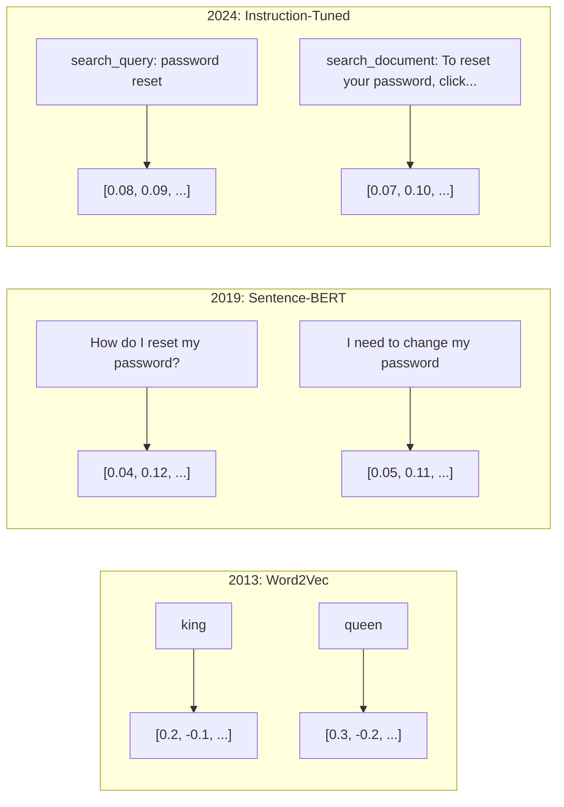
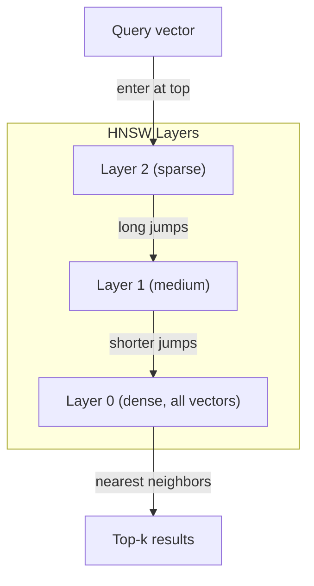
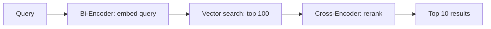

# Embeddings 与 Vector 表示

> 文本是离散的。数学是连续的。每当你要求 LLM 查找“相似”文档、比较含义，或超越关键词进行搜索时，你都在依赖连接这两个世界的一座桥。这座桥就是 Embedding。如果你不理解 Embeddings，你就不理解现代 AI。你只是会使用它。

**Type:** Build
**Languages:** Python
**Prerequisites:** Phase 11, Lesson 01 (Prompt Engineering)
**Time:** ~75 minutes
**Related:** Phase 5 · 22 (Embedding Models Deep Dive) 涵盖 dense vs sparse vs multi-vector、Matryoshka 截断，以及按轴选择模型。本课聚焦生产 pipeline（vector DBs、HNSW、相似度数学）。在选择模型之前，请先阅读 Phase 5 · 22。

## 学习目标
- 使用 API providers 和 open-source models 生成文本 Embeddings，并计算它们之间的 cosine similarity
- 解释为什么 Embeddings 能解决 keyword search 无法处理的 vocabulary mismatch problem
- 构建一个 semantic search index，根据含义而不是精确关键词匹配来检索文档
- 使用 retrieval benchmarks（precision@k、recall）评估 Embedding 质量，并为你的任务选择合适的 Embedding model

## 问题
你有 10,000 张支持工单。一位客户写道：“my payment didn't go through.” 你需要找到相似的历史工单。Keyword search 会找到包含 “payment” 和 “didn't go through” 的工单。它会漏掉 “transaction failed,” “charge was declined,” 和 “billing error.” 这些工单用完全不同的词描述了完全相同的问题。

这就是 vocabulary mismatch problem。人类语言有很多种表达同一件事的方式。Keyword search 把每个词都当作没有含义的独立符号。它无法知道 “declined” 和 “didn't go through” 指的是同一个概念。

你需要一种文本表示，让相似性由含义决定，而不是由拼写决定。你需要一种方法，把 “my payment didn't go through” 和 “transaction was declined” 放到某个数学空间中相近的位置，同时把 “my payment arrived on time” 推得很远，即使它共享了 “payment” 这个词。

这种表示就是 Embedding。

## 概念
### What Is an Embedding?

Embedding 是一个由浮点数组成的 dense Vector，用来表示文本的含义。“dense” 很重要——每个维度都携带信息，这不同于 sparse representations（bag-of-words、TF-IDF），后者的大多数维度都是零。

“The cat sat on the mat” 会变成类似 `[0.023, -0.041, 0.087, ..., 0.012]` 的东西——根据模型不同，是一个包含 768 到 3072 个数字的列表。这些数字编码了含义。你不会直接检查它们。你会比较它们。

### The Word2Vec Breakthrough

2013 年，Google 的 Tomas Mikolov 及其同事发表了 Word2Vec。核心洞见是：训练一个 Neural Network，根据邻近词预测一个词（或根据一个词预测邻近词），隐藏层权重就会变成有意义的 Vector 表示。

著名结果：

```
king - man + woman = queen
```

对 word embeddings 进行 Vector arithmetic 可以捕捉语义关系。从 “man” 到 “woman” 的方向，大致等同于从 “king” 到 “queen” 的方向。这是该领域意识到几何可以编码含义的时刻。

Word2Vec 生成 300 维 Vectors。每个词无论上下文如何，都只有一个 Vector。“Bank” 在 “river bank” 和 “bank account” 中拥有相同的 Embedding。这个限制推动了之后十年的研究。

### From Words to Sentences

Word embeddings 表示单个 Tokens。生产系统需要对整个句子、段落或文档进行 Embedding。出现了四种方法：

**Averaging**：取句子中所有 word vectors 的均值。成本低、有损，但对短文本出奇地还不错。它完全丢失词序——“dog bites man” 和 “man bites dog” 会得到相同的 Embeddings。

**CLS token**：transformer models（BERT, 2018）输出一个特殊的 [CLS] token embedding，表示整个输入。比 averaging 更好，但 [CLS] token 是为 next-sentence prediction 训练的，不是为相似度训练的。

**Contrastive learning**：显式训练模型，把相似配对拉近，把不相似配对推远。Sentence-BERT（Reimers & Gurevych, 2019）使用了这种方法，并成为现代 Embedding models 的基础。给定 “How do I reset my password?” 和 “I need to change my password,” 模型会学习到它们应该拥有几乎相同的 Vectors。

**Instruction-tuned embeddings**：最新方法。E5 和 GTE 等模型接受任务前缀（“search_query:”、 “search_document:”），告诉模型要生成哪种 Embedding。这让一个模型可以服务多个任务。



### Modern Embedding Models

市场已经收敛到少数几个 production-grade 选项（截至 2026 年初的 MTEB scores，MTEB v2）：

| Model | Provider | Dimensions | MTEB | Context | Cost / 1M tokens |
|-------|----------|-----------|------|---------|------------------|
| Gemini Embedding 2 | Google | 3072 (Matryoshka) | 67.7 (retrieval) | 8192 | $0.15 |
| embed-v4 | Cohere | 1024 (Matryoshka) | 65.2 | 128K | $0.12 |
| voyage-4 | Voyage AI | 1024/2048 (Matryoshka) | 66.8 | 32K | $0.12 |
| text-embedding-3-large | OpenAI | 3072 (Matryoshka) | 64.6 | 8192 | $0.13 |
| text-embedding-3-small | OpenAI | 1536 (Matryoshka) | 62.3 | 8192 | $0.02 |
| BGE-M3 | BAAI | 1024 (dense+sparse+ColBERT) | 63.0 multilingual | 8192 | Open-weight |
| Qwen3-Embedding | Alibaba | 4096 (Matryoshka) | 66.9 | 32K | Open-weight |
| Nomic-embed-v2 | Nomic | 768 (Matryoshka) | 63.1 | 8192 | Open-weight |

MTEB（Massive Text Embedding Benchmark）v2 覆盖 100+ 个任务，包括 retrieval、classification、clustering、reranking 和 summarization。分数越高越好。到 2026 年，open-weight models（Qwen3-Embedding、BGE-M3）在大多数维度上已经追平或超过闭源托管模型。Gemini Embedding 2 领先纯 retrieval；Voyage/Cohere 在特定领域（finance、law、code）领先。投入使用前，始终要在你自己的查询上做 benchmark。

### Similarity Metrics

给定两个 embedding vectors，有三种方式衡量它们有多相似：

**Cosine similarity**：两个 Vectors 之间夹角的余弦值。范围从 -1（相反）到 1（方向相同）。忽略大小——如果一个 10 词句子和一个 500 词文档指向相同方向，它们可以得到 1.0。这是 90% 用例的默认选择。

```
cosine_sim(a, b) = dot(a, b) / (||a|| * ||b||)
```

**Dot product**：两个 Vectors 的原始内积。当 Vectors 已归一化（单位长度）时，它与 cosine similarity 等价。计算更快。OpenAI 的 embeddings 已归一化，因此 dot product 和 cosine 会给出相同排序。

```
dot(a, b) = sum(a_i * b_i)
```

**Euclidean (L2) distance**：Vector 空间中的直线距离。越小 = 越相似。对大小差异敏感。当空间中的绝对位置重要，而不仅是方向重要时使用。

```
L2(a, b) = sqrt(sum((a_i - b_i)^2))
```

何时使用哪一种：

| Metric | Use when | Avoid when |
|--------|----------|------------|
| Cosine similarity | 比较长度不同的文本；大多数 retrieval 任务 | 大小携带信息 |
| Dot product | Embeddings 已经归一化；需要最高速度 | Vectors 大小不同 |
| Euclidean distance | Clustering；空间 nearest-neighbor 问题 | 比较长度差异巨大的文档 |

### Vector Databases and HNSW

暴力相似度搜索会把查询与每个已存储 Vector 逐一比较。当有 100 万个 1536 维 Vectors 时，每次查询需要 15 亿次 multiply-add 操作。太慢了。

Vector databases 用 Approximate Nearest Neighbor（ANN）算法解决这个问题。主流算法是 HNSW（Hierarchical Navigable Small World）：

1. 构建一个多层 Vector graph
2. 顶层是 sparse 的——在远距离 clusters 之间建立长距离连接
3. 底层是 dense 的——在邻近 Vectors 之间建立细粒度连接
4. 搜索从顶层开始，贪心下降并逐步细化
5. 以 O(log n) 时间返回近似 top-k results，而不是 O(n)

HNSW 用很小的准确率损失（通常 95-99% recall）换取巨大的速度提升。在 1000 万 Vectors 时，暴力搜索需要数秒。HNSW 只需要毫秒。



生产选项：

| Database | Type | Best for | Max scale |
|----------|------|----------|-----------|
| Pinecone | Managed SaaS | 零运维生产环境 | Billions |
| Weaviate | Open source | 自托管、hybrid search | 100M+ |
| Qdrant | Open source | 高性能、过滤 | 100M+ |
| ChromaDB | Embedded | 原型开发、本地开发 | 1M |
| pgvector | Postgres extension | 已经使用 Postgres | 10M |
| FAISS | Library | 进程内、研究 | 1B+ |

### Chunking Strategies

文档太长，不能作为单个 Vector 进行 Embedding。一份 50 页 PDF 覆盖几十个主题——它的 Embedding 会变成所有内容的平均值，结果不像任何具体内容。你要把文档切成 chunks，并对每个 chunk 做 Embedding。

**Fixed-size chunking**：每 N 个 Tokens 切分一次，并带 M-token overlap。简单且可预测。当文档没有清晰结构时效果很好。一个 512-token chunk 带 50-token overlap：chunk 1 是 tokens 0-511，chunk 2 是 tokens 462-973。

**Sentence-based chunking**：在句子边界切分，将句子分组直到达到 token limit。每个 chunk 至少是一个完整句子。比 fixed-size 更好，因为你不会把一个想法切成两半。

**Recursive chunking**：先尝试在最大边界处分割（section headers）。如果仍然太大，再尝试 paragraph boundaries。然后是 sentence boundaries。最后是 character limits。这就是 LangChain 的 `RecursiveCharacterTextSplitter`，对 mixed-format corpora 效果很好。

**Semantic chunking**：对每个句子做 Embedding，然后把 Embeddings 相似的连续句子分组。当 Embedding similarity 低于某个阈值时，开始新的 chunk。成本高（需要对每个句子单独做 Embedding），但能产生最连贯的 chunks。

| Strategy | Complexity | Quality | Best for |
|----------|-----------|---------|----------|
| Fixed-size | Low | Decent | 非结构化文本、logs |
| Sentence-based | Low | Good | 文章、emails |
| Recursive | Medium | Good | Markdown、HTML、mixed docs |
| Semantic | High | Best | 对 retrieval 质量要求关键的场景 |

大多数系统的甜点区间：256-512 token chunks，带 50-token overlap。

### Bi-Encoders 与 Cross-Encoders 对比

Bi-encoder 会独立对 query 和 documents 做 Embedding，然后比较 Vectors。速度快——你只需对 query 做一次 Embedding，然后与预先计算好的 document embeddings 比较。这是 retrieval 使用的方式。

Cross-encoder 会把 query 和一个 document 作为单个输入，并输出 relevance score。速度慢——它会让每个 query-document pair 通过完整模型。但准确得多，因为它可以同时对 query 和 document tokens 做 Attention。

生产模式是：bi-encoder 检索 top-100 candidates，cross-encoder 将其 rerank 到 top-10。这就是 retrieve-then-rerank pipeline。



Reranking models：Cohere Rerank 3.5（每 1000 次查询 $2）、BGE-reranker-v2（免费，open source）、Jina Reranker v2（免费，open source）。

### Matryoshka Embeddings

传统 embeddings 是全有或全无。一个 1536 维 Vector 使用 1536 个 floats。你不能在不重新训练的情况下截断到 256 维。

Matryoshka Representation Learning（Kusupati et al., 2022）修复了这个问题。模型被训练成让前 N 个维度捕捉最重要的信息，就像俄罗斯套娃。把一个 1536-d Matryoshka embedding 截断到 256 维会损失一些准确率，但仍然可用。

OpenAI 的 text-embedding-3-small 和 text-embedding-3-large 通过 `dimensions` 参数支持 Matryoshka 截断。请求 256 维而不是 1536 维，存储减少 6 倍，在 MTEB benchmarks 上准确率大约损失 3-5%。

### Binary Quantization

一个 1536 维 embedding 以 float32 存储需要 6,144 字节。乘以 1000 万文档：仅 Vectors 就需要 61 GB。

Binary quantization 把每个 float 转成单个 bit：正值变成 1，负值变成 0。存储从 6,144 字节降到 192 字节——减少 32 倍。相似度使用 Hamming distance（统计不同 bits 的数量）计算，CPU 可以用单条指令完成。

对 retrieval recall 的准确率影响大约是 5-10%。常见模式是：先用 binary quantization 在数百万 Vectors 上做第一轮搜索，然后用 full-precision vectors 对 top-1000 重新打分。这样可以用少 32 倍的内存获得 95%+ 的 full-precision 准确率。


```figure
cosine-similarity
```

## 构建它
我们从零开始构建一个 semantic search engine。不使用 vector database。不使用外部 embedding API。只用 Python 和 numpy 做数学计算。

### 步骤 1： Text Chunking

```python
def chunk_text(text, chunk_size=200, overlap=50):
    words = text.split()
    chunks = []
    start = 0
    while start < len(words):
        end = start + chunk_size
        chunk = " ".join(words[start:end])
        chunks.append(chunk)
        start += chunk_size - overlap
    return chunks


def chunk_by_sentences(text, max_chunk_tokens=200):
    sentences = text.replace("\n", " ").split(".")
    sentences = [s.strip() + "." for s in sentences if s.strip()]
    chunks = []
    current_chunk = []
    current_length = 0
    for sentence in sentences:
        sentence_length = len(sentence.split())
        if current_length + sentence_length > max_chunk_tokens and current_chunk:
            chunks.append(" ".join(current_chunk))
            current_chunk = []
            current_length = 0
        current_chunk.append(sentence)
        current_length += sentence_length
    if current_chunk:
        chunks.append(" ".join(current_chunk))
    return chunks
```

### 步骤 2： Building Embeddings from Scratch

我们使用 TF-IDF 和 L2 normalization 实现一个简单的 dense Embedding。这不是 neural embedding，但它遵循同样的契约：输入文本，输出固定大小的 Vector，相似文本产生相似 Vectors。

```python
import math
import numpy as np
from collections import Counter

class SimpleEmbedder:
    def __init__(self):
        self.vocab = []
        self.idf = []
        self.word_to_idx = {}

    def fit(self, documents):
        vocab_set = set()
        for doc in documents:
            vocab_set.update(doc.lower().split())
        self.vocab = sorted(vocab_set)
        self.word_to_idx = {w: i for i, w in enumerate(self.vocab)}
        n = len(documents)
        self.idf = np.zeros(len(self.vocab))
        for i, word in enumerate(self.vocab):
            doc_count = sum(1 for doc in documents if word in doc.lower().split())
            self.idf[i] = math.log((n + 1) / (doc_count + 1)) + 1

    def embed(self, text):
        words = text.lower().split()
        count = Counter(words)
        total = len(words) if words else 1
        vec = np.zeros(len(self.vocab))
        for word, freq in count.items():
            if word in self.word_to_idx:
                tf = freq / total
                vec[self.word_to_idx[word]] = tf * self.idf[self.word_to_idx[word]]
        norm = np.linalg.norm(vec)
        if norm > 0:
            vec = vec / norm
        return vec
```

### 步骤 3： Similarity Functions

```python
def cosine_similarity(a, b):
    dot = np.dot(a, b)
    norm_a = np.linalg.norm(a)
    norm_b = np.linalg.norm(b)
    if norm_a == 0 or norm_b == 0:
        return 0.0
    return float(dot / (norm_a * norm_b))


def dot_product(a, b):
    return float(np.dot(a, b))


def euclidean_distance(a, b):
    return float(np.linalg.norm(a - b))
```

### 步骤 4： Vector Index with Brute-Force Search

```python
class VectorIndex:
    def __init__(self):
        self.vectors = []
        self.texts = []
        self.metadata = []

    def add(self, vector, text, meta=None):
        self.vectors.append(vector)
        self.texts.append(text)
        self.metadata.append(meta or {})

    def search(self, query_vector, top_k=5, metric="cosine"):
        scores = []
        for i, vec in enumerate(self.vectors):
            if metric == "cosine":
                score = cosine_similarity(query_vector, vec)
            elif metric == "dot":
                score = dot_product(query_vector, vec)
            elif metric == "euclidean":
                score = -euclidean_distance(query_vector, vec)
            else:
                raise ValueError(f"Unknown metric: {metric}")
            scores.append((i, score))
        scores.sort(key=lambda x: x[1], reverse=True)
        results = []
        for idx, score in scores[:top_k]:
            results.append({
                "text": self.texts[idx],
                "score": score,
                "metadata": self.metadata[idx],
                "index": idx
            })
        return results

    def size(self):
        return len(self.vectors)
```

### 步骤 5： The Semantic Search Engine

```python
class SemanticSearchEngine:
    def __init__(self, chunk_size=200, overlap=50):
        self.embedder = SimpleEmbedder()
        self.index = VectorIndex()
        self.chunk_size = chunk_size
        self.overlap = overlap

    def index_documents(self, documents, source_names=None):
        all_chunks = []
        all_sources = []
        for i, doc in enumerate(documents):
            chunks = chunk_text(doc, self.chunk_size, self.overlap)
            all_chunks.extend(chunks)
            name = source_names[i] if source_names else f"doc_{i}"
            all_sources.extend([name] * len(chunks))
        self.embedder.fit(all_chunks)
        for chunk, source in zip(all_chunks, all_sources):
            vec = self.embedder.embed(chunk)
            self.index.add(vec, chunk, {"source": source})
        return len(all_chunks)

    def search(self, query, top_k=5, metric="cosine"):
        query_vec = self.embedder.embed(query)
        return self.index.search(query_vec, top_k, metric)

    def search_with_scores(self, query, top_k=5):
        results = self.search(query, top_k)
        return [
            {
                "text": r["text"][:200],
                "source": r["metadata"].get("source", "unknown"),
                "score": round(r["score"], 4)
            }
            for r in results
        ]
```

### 步骤 6： Comparing Similarity Metrics

```python
def compare_metrics(engine, query, top_k=3):
    results = {}
    for metric in ["cosine", "dot", "euclidean"]:
        hits = engine.search(query, top_k=top_k, metric=metric)
        results[metric] = [
            {"score": round(h["score"], 4), "preview": h["text"][:80]}
            for h in hits
        ]
    return results
```

## 使用它
使用 production embedding API 时，架构保持一致。只有 embedder 会变化：

```python
from openai import OpenAI

client = OpenAI()

def openai_embed(texts, model="text-embedding-3-small", dimensions=None):
    kwargs = {"model": model, "input": texts}
    if dimensions:
        kwargs["dimensions"] = dimensions
    response = client.embeddings.create(**kwargs)
    return [item.embedding for item in response.data]
```

使用 OpenAI 的 Matryoshka 截断——同一个模型，更少维度，更低存储：

```python
full = openai_embed(["semantic search query"], dimensions=1536)
compact = openai_embed(["semantic search query"], dimensions=256)
```

256-d Vector 使用的存储减少 6 倍。对于 1000 万文档，这就是 10 GB vs 61 GB。准确率损失在标准 benchmarks 上大约是 3-5%。

使用 Cohere 进行 reranking：

```python
import cohere

co = cohere.ClientV2()

results = co.rerank(
    model="rerank-v3.5",
    query="What is the refund policy?",
    documents=["Full refund within 30 days...", "No refunds after 90 days..."],
    top_n=3
)
```

使用本地 embeddings，不依赖 API：

```python
from sentence_transformers import SentenceTransformer

model = SentenceTransformer("BAAI/bge-small-en-v1.5")
embeddings = model.encode(["semantic search query", "another document"])
```

我们构建的 VectorIndex class 可以配合这些任意方案使用。替换 embedding function，保留 search logic。

## 交付它
本课产出：
- `outputs/prompt-embedding-advisor.md`——一个用于为特定用例选择 Embedding models 和策略的 prompt
- `outputs/skill-embedding-patterns.md`——一个教授 agents 如何在生产中有效使用 Embeddings 的 skill

## 练习
1. **Metric comparison**：使用 cosine similarity、dot product 和 euclidean distance，对 sample documents 运行相同的 5 个 queries。记录每种方法的 top-3 results。哪些 queries 上这些 metrics 不一致？为什么？

2. **Chunk size experiment**：用 50、100、200 和 500 words 的 chunk sizes 索引 sample documents。对每种设置运行 5 个 queries，并记录 top-1 similarity score。绘制 chunk size 与 retrieval quality 之间的关系。找到更大的 chunks 开始产生负面影响的点。

3. **Matryoshka simulation**：构建一个会产生 500-d Vectors 的 SimpleEmbedder。截断到 50、100、200 和 500 维。衡量每种截断下 retrieval recall 如何下降。这可以在不需要真实训练技巧的情况下模拟 Matryoshka 行为。

4. **Binary quantization**：取 search engine 中的 embeddings，将它们转换为 binary（正数为 1，负数为 0），并实现 Hamming distance search。将 top-10 results 与 full-precision cosine similarity 比较。衡量重叠百分比。

5. **Sentence-based chunking**：用 `chunk_by_sentences` 替换 fixed-size chunking。运行相同的 queries 并比较 retrieval scores。尊重句子边界是否改善了结果？

## 关键术语
| Term | What people say | What it actually means |
|------|----------------|----------------------|
| Embedding | “文本到数字” | 一种 dense Vector，其中几何接近性编码语义相似性 |
| Word2Vec | “最早的经典 Embedding” | 2013 年通过预测上下文词学习 word vectors 的模型；证明 Vector arithmetic 可以编码含义 |
| Cosine similarity | “两个 Vectors 有多相似” | Vectors 夹角的余弦值；1 = 方向相同，0 = 正交，-1 = 相反 |
| HNSW | “快速 Vector search” | Hierarchical Navigable Small World graph——一种多层结构，可实现 O(log n) 的 approximate nearest neighbor search |
| Bi-encoder | “分开 Embedding，快速比较” | 将 query 和 document 独立编码为 Vectors；支持预计算和快速 retrieval |
| Cross-encoder | “慢但准确的 reranker” | 让 query-document pair 联合通过完整模型处理；准确率更高，但无法预计算 |
| Matryoshka embeddings | “可截断的 Vectors” | 经过训练的 Embeddings，使前 N 个维度捕捉最重要的信息，从而支持可变大小存储 |
| Binary quantization | “1-bit embeddings” | 将 float vectors 转换为 binary（仅保留 sign bit），通过 Hamming distance search 实现 32 倍存储减少 |
| Chunking | “为 Embedding 拆分文档” | 将文档拆成 256-512 token 片段，使每个片段都可以独立 Embedding 和检索 |
| Vector database | “Embeddings 的搜索引擎” | 为存储 Vectors 并在规模化场景下执行 approximate nearest neighbor search 而优化的数据存储 |
| Contrastive learning | “通过比较训练” | 一种训练方法，把相似配对的 Embeddings 拉近，把不相似配对的 Embeddings 推远 |
| MTEB | “Embedding benchmark” | Massive Text Embedding Benchmark——覆盖 8 类任务的 56 个数据集；用于比较 Embedding models 的标准 |

## 延伸阅读
- Mikolov et al., "Efficient Estimation of Word Representations in Vector Space" (2013)——Word2Vec 论文，通过 king-queen 类比开启了 Embedding 革命
- Reimers & Gurevych, "Sentence-BERT: Sentence Embeddings using Siamese BERT-Networks" (2019)——如何训练用于句子级相似度的 bi-encoders，现代 Embedding models 的基础
- Kusupati et al., "Matryoshka Representation Learning" (2022)——可变维度 Embeddings 背后的技术，OpenAI 在 text-embedding-3 中采用了它
- Malkov & Yashunin, "Efficient and Robust Approximate Nearest Neighbor using Hierarchical Navigable Small World Graphs" (2018)——HNSW 论文，多数生产 Vector search 背后的算法
- OpenAI Embeddings Guide (platform.openai.com/docs/guides/embeddings)——text-embedding-3 models 的实用参考，包括 Matryoshka 维度缩减
- MTEB Leaderboard (huggingface.co/spaces/mteb/leaderboard)——实时 benchmark，用于比较所有 Embedding models 在不同任务和语言上的表现
- [Muennighoff et al., "MTEB: Massive Text Embedding Benchmark" (EACL 2023)](https://arxiv.org/abs/2210.07316)——定义 8 类任务（classification、clustering、pair classification、reranking、retrieval、STS、summarization、bitext mining）的 benchmark，leaderboard 会报告这些类别；在信任任何单一 MTEB score 之前请先阅读。
- [Sentence Transformers documentation](https://www.sbert.net/)——bi-encoder vs cross-encoder、pooling strategies，以及本课实现的 ingest-split-embed-store RAG pipeline 的权威参考。
