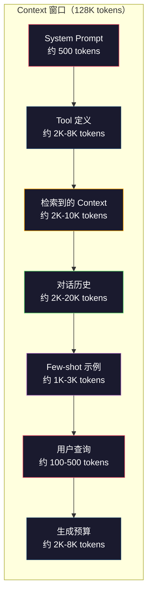
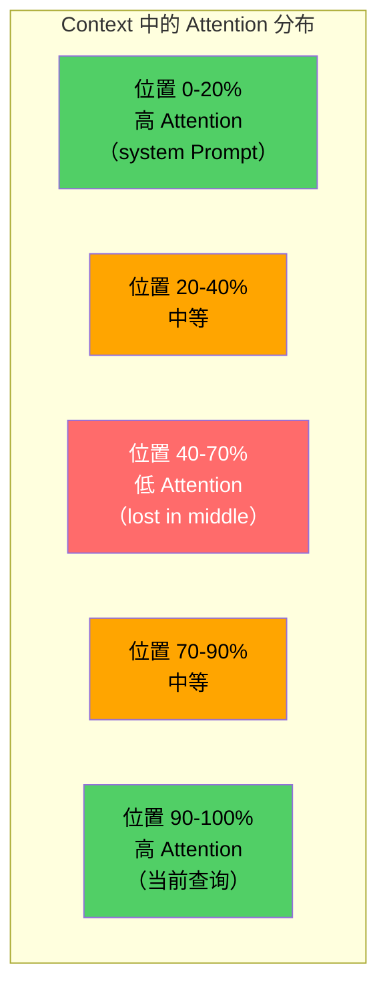
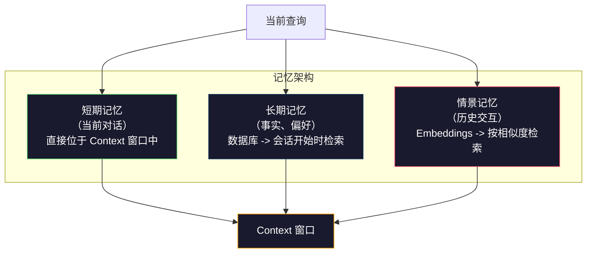

# Context Engineering：窗口、预算、记忆与检索

> Prompt engineering 只是其中一个子集。Context engineering 才是完整体系。Prompt 是你输入的一段字符串。Context 是进入 Model 窗口的全部内容：系统指令、检索到的文档、Tool 定义、对话历史、few-shot 示例，以及 Prompt 本身。2026 年最优秀的 AI 工程师都是 Context 工程师。他们决定哪些内容应当进入、哪些内容应当排除，以及内容的排列顺序。

**Type:** Build
**Languages:** Python
**Prerequisites:** Phase 10（从零构建 LLMs）、Phase 11 Lesson 01-02
**Time:** ~90 分钟
**Related:** Phase 11 · 15（Prompt Caching）——有利于缓存的布局是 Context engineering 的延伸。有关如何使用 NIAH/RULER 衡量 lost-in-the-middle，请参阅 Phase 5 · 28（Long-Context Evaluation）。

## 学习目标

- 计算所有 Context 窗口组件的 Token 预算（system Prompt、Tools、历史记录、检索文档、生成预留空间）
- 实现 Context 窗口管理策略：截断、摘要，以及用于对话历史的滑动窗口
- 确定 Context 组件的优先级和顺序，使 Model 最大程度关注最相关的信息
- 构建 Context 组装器，根据查询类型和可用窗口空间动态分配 Token

## 问题

Claude Opus 4.7 拥有 200K Token 窗口（beta 版为 1M）。GPT-5 为 400K。Gemini 3 Pro 为 2M。Llama 4 声称可达 10M。在真正填充这些窗口之前，这些数字听起来非常庞大。

下面是一个编程助手的真实拆分。system Prompt：500 个 Token。50 个 Tool 的定义：8,000 个 Token。检索到的文档：4,000 个 Token。对话历史（10 轮）：6,000 个 Token。当前用户查询：200 个 Token。生成预算（最大输出）：4,000 个 Token。总计：22,700 个 Token。这只占 128K 窗口的 18%。

但 Attention 并不会随 Context 长度线性扩展。拥有 128K Token Context 的 Model 需要承担二次方级别的 Attention 成本（原始 Transformer 中为 O(n^2)，不过大多数生产 Model 都使用高效的 Attention 变体）。更重要的是，检索准确率会下降。“Needle in a Haystack”测试表明，Model 难以找到位于长 Context 中部的信息。Liu 等人（2023）的研究显示，LLMs 检索长 Context 开头和结尾的信息时准确率接近完美，但检索位于中部的信息时，准确率会下降 10-20%（位于 Context 40-70% 的位置）。这种“lost-in-the-middle”效应因 Model 而异，但会影响目前所有架构。

实践中的结论是：拥有 200K 个可用 Token，并不意味着使用全部 200K 个 Token 就有效。经过精心筛选的 10K Token Context，通常优于直接塞入的 100K Token Context。Context engineering 是一门在 Context 窗口内最大化信噪比的学科。

你放入窗口的每个 Token，都会占用本可承载更相关信息的空间。每个无关的 Tool 定义、每轮过时的对话、每段无法回答问题的检索文本，都会让 Model 在任务上的表现稍微变差。

## 概念

### Context 窗口是一种稀缺资源

把 Context 窗口想象成 RAM，而不是磁盘。它速度快、可以直接访问，但容量有限。你无法装下所有内容，必须做出选择。



每个组件都会争夺空间。增加更多 Tool 定义，意味着留给对话历史的空间更少。增加更多检索到的 Context，意味着留给 few-shot 示例的空间更少。Context engineering 是一门分配预算以最大化任务表现的艺术。

### Lost-in-the-Middle

这是 Context engineering 中最重要的实证发现。Model 对 Context 开头和结尾的信息关注得更好。中间的信息会获得较低的 Attention 分数，因此更容易被忽略。

Liu 等人（2023）对这一现象进行了系统测试。他们将一个相关文档放在 20 个无关文档中的不同位置，并测量回答准确率。当相关文档位于第一位或最后一位时，准确率为 85-90%。当它位于中间（20 个文档中的第 10 位）时，准确率下降到 60-70%。

这会直接影响工程设计：

- 将最重要的信息放在开头（system Prompt、关键指令）
- 将当前查询和最相关的 Context 放在结尾（近期偏置会提供帮助）
- 将 Context 中部视为优先级最低的区域
- 如果必须在中部包含信息，请在结尾重复关键要点



### Context 组件

**System Prompt**：设定角色、约束和行为规则。它位于最前面，并在各轮对话中保持不变。Claude Code 的 system Prompt（包括 Tool 定义和行为指令）大约使用 6,000 个 Token。应当保持精简。system Prompt 中的每个词都会在每次 API 调用时重复发送。

**Tool 定义**：每个 Tool 会增加 50-200 个 Token（名称、描述、参数 schema）。按每个 Tool 150 个 Token 计算，50 个 Tool 在任何对话发生之前就会占用 7,500 个 Token。动态选择 Tool，即只包含与当前查询相关的 Tool，可以将这部分开销降低 60-80%。

**检索到的 Context**：来自 Vector 数据库的文档、搜索结果和文件内容。检索质量直接决定响应质量。糟糕的检索还不如不检索，因为它会用噪声填满窗口，并主动误导 Model。

**对话历史**：之前的每条用户消息和助手响应。它会随对话长度线性增长。一次 50 轮、每轮 200 个 Token 的对话会产生 10,000 个 Token 的历史记录，其中大部分与当前查询无关。

**Few-shot 示例**：用于演示预期行为的输入/输出对。两到三个精心选择的示例，通常比数千个 Token 的指令更能提高输出质量，但它们也会占用空间。

**生成预算**：为 Model 响应预留的 Token。如果把窗口完全填满，Model 就没有空间回答。应至少为生成预留 2,000-4,000 个 Token。

### Context 压缩策略

**历史摘要**：不再逐字保留之前的所有对话轮次，而是定期对对话进行摘要。用 100 个 Token 写下“我们讨论了 X，决定了 Y，用户希望实现 Z”，可以替代占用 2,000 个 Token 的 10 轮对话。当历史记录超过阈值（例如 5,000 个 Token）时执行摘要。

**相关性过滤**：根据当前查询为每个检索文档评分，并丢弃低于阈值的文档。如果检索了 10 个分块，但只有 3 个相关，就丢弃另外 7 个。保留 3 个高度相关的分块，胜过保留 10 个质量一般的分块。

**Tool 剪枝**：对用户查询的意图进行分类，只包含与该意图相关的 Tool。代码问题不需要日历 Tool。日程安排问题不需要文件系统 Tool。这可以将 Tool 定义从 8,000 个 Token 减少到 1,000 个。

**递归摘要**：对于非常长的文档，分阶段生成摘要。先总结各个章节，再总结这些摘要。一份 50 页的文档可以变成一份捕捉关键要点的 500 Token 摘要。

### 记忆系统

Context engineering 跨越三个时间范围。

**短期记忆**：当前对话。直接存储在 Context 窗口中，随每轮对话增长，通过摘要和截断进行管理。

**长期记忆**：跨对话持久保存的事实和偏好。“用户偏好 TypeScript。”“项目使用 PostgreSQL。”这些信息存储在数据库中，并在会话开始时检索。Claude Code 将它们存储在 CLAUDE.md 文件中。ChatGPT 则将它们存储在其记忆功能中。

**情景记忆**：可能与当前情况相关的特定历史交互。“上周二，我们在 auth 模块中调试过类似问题。”这些交互以 Embedding 形式存储，并在当前对话与过去某次交互匹配时检索。



### 动态组装 Context

关键洞察是：不同的查询需要不同的 Context。静态 system Prompt、静态 Tools 和静态历史记录会造成浪费。最优秀的系统会针对每次查询动态组装 Context。

1. 对查询意图进行分类
2. 选择相关 Tools（而不是所有 Tools）
3. 检索相关文档（而不是固定的一组文档）
4. 包含相关的历史对话轮次（而不是全部历史记录）
5. 添加与任务类型匹配的 few-shot 示例
6. 按重要性排列所有内容：关键内容放在开头，重要内容放在结尾，可选内容放在中间

这正是优秀 AI 应用与卓越 AI 应用之间的区别。Model 是相同的，Context 才是差异所在。

```figure
lost-in-the-middle
```

## 从零构建

### 第 1 步：Token 计数器

无法衡量，就无法分配预算。构建一个简单的 Token 计数器（这里使用空白字符切分进行近似计算，因为精确数量取决于 Tokenizer）。

```python
import json
import numpy as np
from collections import OrderedDict

def count_tokens(text):
    if not text:
        return 0
    return int(len(text.split()) * 1.3)

def count_tokens_json(obj):
    return count_tokens(json.dumps(obj))
```

### 第 2 步：Context 预算管理器

这是核心抽象。预算管理器会跟踪每个组件使用的 Token 数量并强制执行限制。

```python
class ContextBudget:
    def __init__(self, max_tokens=128000, generation_reserve=4000):
        self.max_tokens = max_tokens
        self.generation_reserve = generation_reserve
        self.available = max_tokens - generation_reserve
        self.allocations = OrderedDict()

    def allocate(self, component, content, max_tokens=None):
        tokens = count_tokens(content)
        if max_tokens and tokens > max_tokens:
            words = content.split()
            target_words = int(max_tokens / 1.3)
            content = " ".join(words[:target_words])
            tokens = count_tokens(content)

        used = sum(self.allocations.values())
        if used + tokens > self.available:
            allowed = self.available - used
            if allowed <= 0:
                return None, 0
            words = content.split()
            target_words = int(allowed / 1.3)
            content = " ".join(words[:target_words])
            tokens = count_tokens(content)

        self.allocations[component] = tokens
        return content, tokens

    def remaining(self):
        used = sum(self.allocations.values())
        return self.available - used

    def utilization(self):
        used = sum(self.allocations.values())
        return used / self.max_tokens

    def report(self):
        total_used = sum(self.allocations.values())
        lines = []
        lines.append(f"Context Budget Report ({self.max_tokens:,} token window)")
        lines.append("-" * 50)
        for component, tokens in self.allocations.items():
            pct = tokens / self.max_tokens * 100
            bar = "#" * int(pct / 2)
            lines.append(f"  {component:<25} {tokens:>6} tokens ({pct:>5.1f}%) {bar}")
        lines.append("-" * 50)
        lines.append(f"  {'Used':<25} {total_used:>6} tokens ({total_used/self.max_tokens*100:.1f}%)")
        lines.append(f"  {'Generation reserve':<25} {self.generation_reserve:>6} tokens")
        lines.append(f"  {'Remaining':<25} {self.remaining():>6} tokens")
        return "\n".join(lines)
```

### 第 3 步：Lost-in-the-Middle 重排序

实现重排序策略：最重要的项目放在开头和结尾，最不重要的项目放在中间。

```python
def reorder_lost_in_middle(items, scores):
    paired = sorted(zip(scores, items), reverse=True)
    sorted_items = [item for _, item in paired]

    if len(sorted_items) <= 2:
        return sorted_items

    first_half = sorted_items[::2]
    second_half = sorted_items[1::2]
    second_half.reverse()

    return first_half + second_half

def score_relevance(query, documents):
    query_words = set(query.lower().split())
    scores = []
    for doc in documents:
        doc_words = set(doc.lower().split())
        if not query_words:
            scores.append(0.0)
            continue
        overlap = len(query_words & doc_words) / len(query_words)
        scores.append(round(overlap, 3))
    return scores
```

### 第 4 步：对话历史压缩器

总结较早的对话轮次，以回收 Token 预算。

```python
class ConversationManager:
    def __init__(self, max_history_tokens=5000):
        self.turns = []
        self.summaries = []
        self.max_history_tokens = max_history_tokens

    def add_turn(self, role, content):
        self.turns.append({"role": role, "content": content})
        self._compress_if_needed()

    def _compress_if_needed(self):
        total = sum(count_tokens(t["content"]) for t in self.turns)
        if total <= self.max_history_tokens:
            return

        while total > self.max_history_tokens and len(self.turns) > 4:
            old_turns = self.turns[:2]
            summary = self._summarize_turns(old_turns)
            self.summaries.append(summary)
            self.turns = self.turns[2:]
            total = sum(count_tokens(t["content"]) for t in self.turns)

    def _summarize_turns(self, turns):
        parts = []
        for t in turns:
            content = t["content"]
            if len(content) > 100:
                content = content[:100] + "..."
            parts.append(f"{t['role']}: {content}")
        return "Previous: " + " | ".join(parts)

    def get_context(self):
        parts = []
        if self.summaries:
            parts.append("[Conversation Summary]")
            for s in self.summaries:
                parts.append(s)
        parts.append("[Recent Conversation]")
        for t in self.turns:
            parts.append(f"{t['role']}: {t['content']}")
        return "\n".join(parts)

    def token_count(self):
        return count_tokens(self.get_context())
```

### 第 5 步：动态 Tool 选择器

只包含与当前查询相关的 Tools。先对意图进行分类，再执行过滤。

```python
TOOL_REGISTRY = {
    "read_file": {
        "description": "Read contents of a file",
        "tokens": 120,
        "categories": ["code", "files"],
    },
    "write_file": {
        "description": "Write content to a file",
        "tokens": 150,
        "categories": ["code", "files"],
    },
    "search_code": {
        "description": "Search for patterns in codebase",
        "tokens": 130,
        "categories": ["code"],
    },
    "run_command": {
        "description": "Execute a shell command",
        "tokens": 140,
        "categories": ["code", "system"],
    },
    "create_calendar_event": {
        "description": "Create a new calendar event",
        "tokens": 180,
        "categories": ["calendar"],
    },
    "list_emails": {
        "description": "List recent emails",
        "tokens": 160,
        "categories": ["email"],
    },
    "send_email": {
        "description": "Send an email message",
        "tokens": 200,
        "categories": ["email"],
    },
    "web_search": {
        "description": "Search the web for information",
        "tokens": 140,
        "categories": ["research"],
    },
    "query_database": {
        "description": "Run a SQL query on the database",
        "tokens": 170,
        "categories": ["code", "data"],
    },
    "generate_chart": {
        "description": "Generate a chart from data",
        "tokens": 190,
        "categories": ["data", "visualization"],
    },
}

def classify_intent(query):
    query_lower = query.lower()

    intent_keywords = {
        "code": ["code", "function", "bug", "error", "file", "implement", "refactor", "debug", "test"],
        "calendar": ["meeting", "schedule", "calendar", "appointment", "event"],
        "email": ["email", "mail", "send", "inbox", "message"],
        "research": ["search", "find", "what is", "how does", "explain", "look up"],
        "data": ["data", "query", "database", "chart", "graph", "analytics", "sql"],
    }

    scores = {}
    for intent, keywords in intent_keywords.items():
        score = sum(1 for kw in keywords if kw in query_lower)
        if score > 0:
            scores[intent] = score

    if not scores:
        return ["code"]

    max_score = max(scores.values())
    return [intent for intent, score in scores.items() if score >= max_score * 0.5]

def select_tools(query, token_budget=2000):
    intents = classify_intent(query)
    relevant = {}
    total_tokens = 0

    for name, tool in TOOL_REGISTRY.items():
        if any(cat in intents for cat in tool["categories"]):
            if total_tokens + tool["tokens"] <= token_budget:
                relevant[name] = tool
                total_tokens += tool["tokens"]

    return relevant, total_tokens
```

### 第 6 步：完整的 Context 组装 Pipeline

将所有组件连接起来。给定一个查询，动态组装最优 Context。

```python
class ContextEngine:
    def __init__(self, max_tokens=128000, generation_reserve=4000):
        self.budget = ContextBudget(max_tokens, generation_reserve)
        self.conversation = ConversationManager(max_history_tokens=5000)
        self.system_prompt = (
            "You are a helpful AI assistant. You have access to tools for "
            "code editing, file management, web search, and data analysis. "
            "Use the appropriate tools for each task. Be concise and accurate."
        )
        self.knowledge_base = [
            "Python 3.12 introduced type parameter syntax for generic classes using bracket notation.",
            "The project uses PostgreSQL 16 with pgvector for embedding storage.",
            "Authentication is handled by Supabase Auth with JWT tokens.",
            "The frontend is built with Next.js 15 using the App Router.",
            "API rate limits are set to 100 requests per minute per user.",
            "The deployment pipeline uses GitHub Actions with Docker multi-stage builds.",
            "Test coverage must be above 80% for all new modules.",
            "The codebase follows the repository pattern for data access.",
        ]

    def assemble(self, query):
        self.budget = ContextBudget(self.budget.max_tokens, self.budget.generation_reserve)

        system_content, _ = self.budget.allocate("system_prompt", self.system_prompt, max_tokens=1000)

        tools, tool_tokens = select_tools(query, token_budget=2000)
        tool_text = json.dumps(list(tools.keys()))
        tool_content, _ = self.budget.allocate("tools", tool_text, max_tokens=2000)

        relevance = score_relevance(query, self.knowledge_base)
        threshold = 0.1
        relevant_docs = [
            doc for doc, score in zip(self.knowledge_base, relevance)
            if score >= threshold
        ]

        if relevant_docs:
            doc_scores = [s for s in relevance if s >= threshold]
            reordered = reorder_lost_in_middle(relevant_docs, doc_scores)
            doc_text = "\n".join(reordered)
            doc_content, _ = self.budget.allocate("retrieved_context", doc_text, max_tokens=3000)

        history_text = self.conversation.get_context()
        if history_text.strip():
            history_content, _ = self.budget.allocate("conversation_history", history_text, max_tokens=5000)

        query_content, _ = self.budget.allocate("user_query", query, max_tokens=500)

        return self.budget

    def chat(self, query):
        self.conversation.add_turn("user", query)
        budget = self.assemble(query)
        response = f"[Response to: {query[:50]}...]"
        self.conversation.add_turn("assistant", response)
        return budget


def run_demo():
    print("=" * 60)
    print("  Context Engineering Pipeline Demo")
    print("=" * 60)

    engine = ContextEngine(max_tokens=128000, generation_reserve=4000)

    print("\n--- Query 1: Code task ---")
    budget = engine.chat("Fix the bug in the authentication module where JWT tokens expire too early")
    print(budget.report())

    print("\n--- Query 2: Research task ---")
    budget = engine.chat("What is the best approach for implementing vector search in PostgreSQL?")
    print(budget.report())

    print("\n--- Query 3: After conversation history builds up ---")
    for i in range(8):
        engine.conversation.add_turn("user", f"Follow-up question number {i+1} about the implementation details of the system")
        engine.conversation.add_turn("assistant", f"Here is the response to follow-up {i+1} with technical details about the architecture")

    budget = engine.chat("Now implement the changes we discussed")
    print(budget.report())

    print("\n--- Tool Selection Examples ---")
    test_queries = [
        "Fix the bug in auth.py",
        "Schedule a meeting with the team for Tuesday",
        "Show me the database query performance stats",
        "Search for best practices on error handling",
    ]

    for q in test_queries:
        tools, tokens = select_tools(q)
        intents = classify_intent(q)
        print(f"\n  Query: {q}")
        print(f"  Intents: {intents}")
        print(f"  Tools: {list(tools.keys())} ({tokens} tokens)")

    print("\n--- Lost-in-the-Middle Reordering ---")
    docs = ["Doc A (most relevant)", "Doc B (somewhat relevant)", "Doc C (least relevant)",
            "Doc D (relevant)", "Doc E (moderately relevant)"]
    scores = [0.95, 0.60, 0.20, 0.80, 0.50]
    reordered = reorder_lost_in_middle(docs, scores)
    print(f"  Original order: {docs}")
    print(f"  Scores:         {scores}")
    print(f"  Reordered:      {reordered}")
    print(f"  (Most relevant at start and end, least relevant in middle)")
```

## 使用它

### 由 Harness 管理的 Context

Claude Code 使用分层方法管理 Context。system Prompt 包含行为规则和 Tool 定义（约 6K 个 Token）。打开文件时，其内容会作为 Context 注入。执行搜索时，结果会被加入。较早的对话轮次会被总结。CLAUDE.md 提供可跨会话持久保存的长期记忆。

关键的工程决策是：Claude Code 不会把整个代码库都塞进 Context。它会按需检索相关文件。这就是 Context engineering 的实际应用。

### 动态加载 Context

Cursor 会将整个代码库索引为 Embedding。输入查询时，它会使用 Vector 相似度检索最相关的文件和代码块。只有这些内容会进入 Context 窗口。一个包含 500K 行代码的代码库，会被压缩成最相关的 5-10 个代码块。

其模式是：对所有内容创建 Embedding、按需检索，并且只包含真正重要的内容。

### 助手的长期记忆

ChatGPT 会将用户偏好和事实存储为长期记忆。每次对话开始时，系统会检索相关记忆并将其包含在 system Prompt 中。“用户偏好 Python”只需要 5 个 Token，却能省去跨对话重复提供指令所需的数百个 Token。

### 将 RAG 作为 Context Engineering

RAG 是形式化的 Context engineering。它不会把知识塞进 Model 权重（Training）或 system Prompt（静态 Context），而是在查询时检索相关文档，并将它们注入 Context 窗口。整个 RAG Pipeline——分块、Embedding、检索和重排序——都是为了解决一个问题：把正确的信息放入 Context 窗口。

## 交付成果

本课会生成 `outputs/prompt-context-optimizer.md`，这是一个可复用 Prompt，用于审查 Context 组装策略并提出优化建议。向它提供 system Prompt、Tool 数量、平均历史长度和检索策略，它就会识别 Token 浪费并提出改进建议。

本课还会生成 `outputs/skill-context-engineering.md`，这是一个决策框架，用于根据任务类型、Context 窗口大小和延迟预算设计 Context 组装 Pipeline。

## 练习

1. 为 ContextBudget class 添加一个“Token 浪费检测器”。它应当标记使用超过 30% 预算的组件，并针对不同组件类型提出相应的压缩策略（总结历史记录、剪枝 Tools、重新排序文档）。

2. 为检索到的 Context 实现语义去重。如果两个检索文档的相似度超过 80%（通过词语重叠率或 Embedding 的 cosine similarity 衡量），只保留得分较高的文档。测量由此回收了多少 Token 预算。

3. 构建一个“Context 重放”Tool。给定一份对话记录，使用 ContextEngine 重放对话，并将预算分配随每轮对话发生的变化可视化。绘制各组件的 Token 使用量随时间变化的图表。找出 Context 开始被压缩的对话轮次。

4. 实现基于优先级的 Tool 选择器。不要进行二元的包含/排除，而是根据当前查询为每个 Tool 分配相关性分数。按相关性分数从高到低包含 Tools，直到 Tool 预算耗尽。比较包含 5、10、20 和 50 个 Tools 时的任务表现。

5. 构建一个支持多种策略的 Context 压缩器。实现三种压缩策略（截断、摘要、提取关键句），并在一组包含 20 个文档的数据上进行基准测试。测量压缩率与信息保留程度之间的权衡（压缩后的版本是否仍然包含查询的答案？）。

## 关键术语

| 术语 | 人们通常怎么说 | 它的实际含义 |
|------|----------------|----------------------|
| Context window | “Model 能读取多少内容” | Model 在单次 forward pass 中能够处理的最大 Token 数量（输入 + 输出）——GPT-5 为 400K，Claude Opus 4.7 为 200K（beta 版为 1M），Gemini 3 Pro 为 2M |
| Context engineering | “高级 Prompt engineering” | 决定哪些内容进入 Context 窗口、以什么顺序进入以及采用什么优先级的学科——涵盖检索、压缩、Tool 选择和记忆管理 |
| Lost-in-the-middle | “Model 会忘记中间的内容” | 一项实证发现：LLMs 对 Context 开头和结尾的关注效果更好，而位于中间的信息会导致准确率下降 10-20% |
| Token budget | “还剩多少 Token” | 在不同组件（system Prompt、Tools、历史记录、检索、生成）之间明确分配 Context 窗口容量，并为每个组件设置限制 |
| Dynamic context | “即时加载内容” | 根据意图分类、相关 Tool 选择和检索结果，为每次查询以不同方式组装 Context 窗口 |
| History summarization | “压缩对话” | 用简明摘要替代早期对话轮次的逐字内容，在保留关键信息的同时降低 Token 成本 |
| Tool pruning | “只包含相关 Tools” | 对查询意图进行分类，并且只包含与意图匹配的 Tool 定义，从而将 Tool 的 Token 成本降低 60-80% |
| Long-term memory | “跨会话记忆” | 存储在数据库中并在会话开始时检索的事实和偏好——包括 CLAUDE.md、ChatGPT Memory 以及类似系统 |
| Episodic memory | “记住特定的历史事件” | 以 Embedding 形式存储的历史交互，在当前查询与过去某次对话相似时进行检索 |
| Generation budget | “为答案保留的空间” | 为 Model 输出预留的 Token——如果 Context 完全填满窗口，Model 就没有空间响应 |

## 延伸阅读

- [Liu 等人，2023——“Lost in the Middle: How Language Models Use Long Contexts”](https://arxiv.org/abs/2307.03172)——关于位置相关 Attention 的权威研究，表明 Model 难以处理位于长 Context 中部的信息
- [Anthropic 的 Contextual Retrieval 博客文章](https://www.anthropic.com/news/contextual-retrieval)——Anthropic 如何进行具备 Context 感知能力的分块检索，并将检索失败率降低 49%
- [Simon Willison 的“Context Engineering”](https://simonwillison.net/2025/Jun/27/context-engineering/)——为这一学科命名并将其与 Prompt engineering 区分开的博客文章
- [LangChain 的 RAG 文档](https://python.langchain.com/docs/tutorials/rag/)——将 RAG 作为 Context engineering 模式的实际实现
- [Greg Kamradt 的 Needle in a Haystack 测试](https://github.com/gkamradt/LLMTest_NeedleInAHaystack)——揭示所有主流 Model 都存在位置相关检索失败的基准测试
- [Pope 等人，“Efficiently Scaling Transformer Inference”（2022）](https://arxiv.org/abs/2211.05102)——说明 Context 长度为何会影响内存和延迟，以及 KV cache、MQA 和 GQA 如何改变预算计算方式。
- [Agrawal 等人，“SARATHI: Efficient LLM Inference by Piggybacking Decodes with Chunked Prefills”（2023）](https://arxiv.org/abs/2308.16369)——介绍使长 Prompt 的 TTFT 成本高昂、但 TPOT 成本较低的两个 Inference 阶段；这是 Context packing 权衡背后的事实依据。
- [Ainslie 等人，“GQA: Training Generalized Multi-Query Transformer Models from Multi-Head Checkpoints”（EMNLP 2023）](https://arxiv.org/abs/2305.13245)——介绍 grouped-query Attention 的论文，该方法在不损失质量的情况下，将生产环境 decoder 的 KV 内存降低了 8 倍。
