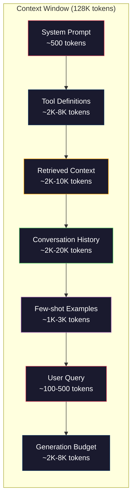
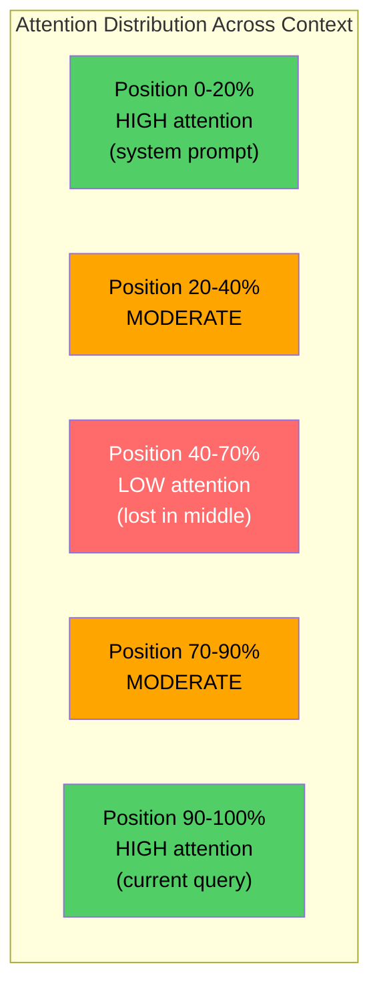
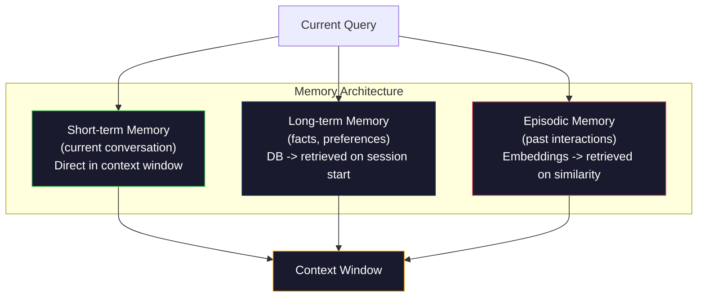

# Context Engineering：窗口、预算、Memory 与 Retrieval

> Prompt engineering 是一个子集。Context engineering 才是全局。Prompt 是你输入的一段字符串。Context 是进入模型窗口的所有内容：system instructions、retrieved documents、tool definitions、conversation history、few-shot examples，以及 prompt 本身。2026 年最优秀的 AI engineers 是 context engineers。他们决定什么放进去、什么留在外面，以及按什么顺序放入。

**类型：** Build
**语言：** Python
**前置要求：** Phase 10（LLMs from Scratch）、Phase 11 Lesson 01-02
**时间：** 约 90 分钟
**相关：** Phase 11 · 15（Prompt Caching）—— cache-friendly layout 是 context engineering 的延伸。Phase 5 · 28（Long-Context Evaluation）讲解如何用 NIAH/RULER 衡量 lost-in-the-middle。

## 学习目标

- 计算所有 context window 组件的 Token 预算（system prompt、tools、history、retrieved docs、generation headroom）
- 实现 context window 管理策略：截断、摘要，以及用于 conversation history 的 sliding window
- 对 context 组件进行优先级排序和编排，让模型的 Attention 最大化集中在最相关的信息上
- 构建一个 context assembler，根据 query 类型和可用窗口空间动态分配 Token

## 问题

Claude Opus 4.7 有 200K Token 窗口（beta 中为 1M）。GPT-5 有 400K。Gemini 3 Pro 有 2M。Llama 4 声称有 10M。这些数字听起来非常大，直到你真正把它们填满。

下面是一个 coding assistant 的真实拆分。System prompt：500 Token。50 个 tools 的 tool definitions：8,000 Token。Retrieved documentation：4,000 Token。Conversation history（10 轮）：6,000 Token。当前 user query：200 Token。Generation budget（max output）：4,000 Token。总计：22,700 Token。这只占 128K 窗口的 18%。

但 Attention 并不会随 context length 线性扩展。拥有 128K Token context 的模型要付出二次 Attention 成本（vanilla transformers 中是 O(n^2)，尽管大多数生产模型使用高效 Attention 变体）。更重要的是，Retrieval 准确率会下降。“Needle in a Haystack”测试表明，模型很难找到放在长 context 中间的信息。Liu et al.（2023）的研究显示，LLMs 对长 context 开头和结尾的信息 Retrieval 准确率接近完美，但对放在中间的信息（context 的 40-70% 位置）准确率会下降 10-20%。这种“lost-in-the-middle”效应因模型而异，但会影响当前所有架构。

实践上的教训是：可用 200K Token 并不意味着使用 200K Token 就有效。精心筛选的 10K Token context 往往胜过直接倾倒的 100K Token context。Context engineering 是在 context window 内最大化 signal-to-noise ratio 的学科。

你放入窗口的每个 Token，都会挤掉另一个本可以承载更相关信息的 Token。每个不相关的 tool definition、每个过期的 conversation turn、每段无法回答问题的 retrieved text，都会让模型在任务上表现稍差一点。

## 概念

### Context Window 是稀缺资源

把 context window 想成 RAM，而不是磁盘。它很快，可以直接访问，但容量有限。你无法放下所有内容。你必须选择。



每个组件都在争夺空间。加入更多 tool definitions 意味着 conversation history 的空间变少。加入更多 retrieved context 意味着 few-shot examples 的空间变少。Context engineering 是分配这项预算以最大化任务表现的艺术。

### Lost-in-the-Middle

这是 context engineering 中最重要的经验发现。模型会更好地关注 context 开头和结尾的信息。中间的信息获得较低的 Attention 分数，也更容易被忽略。

Liu et al.（2023）对此进行了系统测试。他们把一个相关文档放在 20 个不相关文档之间的不同位置，并测量答案准确率。当相关文档位于第一个或最后一个位置时，准确率为 85-90%。当它位于中间（20 个中的第 10 个位置）时，准确率下降到 60-70%。

这会直接影响工程设计：

- 把最重要的信息放在最前面（system prompt、关键 instructions）
- 把当前 query 和最相关的 context 放在最后（recency bias 有帮助）
- 把 context 中间视为最低优先级区域
- 如果必须把信息放在中间，就在结尾重复关键点



### Context 组件

**System prompt**：设定 persona、约束和行为规则。它放在最前面，并在多轮中保持不变。Claude Code 的 system prompt 包括 tool definitions 和行为 instructions，大约使用 6,000 Token。保持紧凑。System prompt 中的每个词都会在每次 API 调用中重复出现。

**Tool definitions**：每个 tool 会增加 50-200 Token（name、description、parameter schema）。50 个 tools、每个 150 Token，在任何 conversation 发生之前就是 7,500 Token。Dynamic tool selection，也就是只包含与当前 query 相关的 tools，可以减少 60-80%。

**Retrieved context**：来自 Vector database 的文档、search results、file contents。Retrieval 质量直接决定 response 质量。糟糕的 Retrieval 比没有 Retrieval 更差，因为它会用噪声填满窗口，并主动误导模型。

**Conversation history**：每条之前的 user message 和 assistant response。它会随 conversation length 线性增长。50 轮 conversation、每轮 200 Token，就是 10,000 Token history。其中大部分与当前 query 无关。

**Few-shot examples**：展示期望行为的 input/output 对。两到三个精心选择的 examples，通常比数千 Token 的 instructions 更能提升输出质量。但它们会占用空间。

**Generation budget**：为模型 response 预留的 Token。如果你把窗口填满，模型就没有空间回答。至少为 generation 预留 2,000-4,000 Token。

### Context Compression 策略

**History summarization**：不再逐字保留所有 previous turns，而是定期总结 conversation。用 100 Token 表达“We discussed X, decided Y, and the user wants Z”，可以替代占用 2,000 Token 的 10 轮对话。当 history 超过阈值（例如 5,000 Token）时运行 summarization。

**Relevance filtering**：根据当前 query 给每个 retrieved document 打分，并丢弃低于阈值的文档。如果你 retrieved 了 10 个 chunks，但只有 3 个相关，就丢弃另外 7 个。3 个高度相关的 chunks 胜过 10 个平庸的 chunks。

**Tool pruning**：分类用户的 query intent，只包含与该 intent 相关的 tools。代码问题不需要 calendar tools。排期问题不需要 file system tools。这可以把 tool definitions 从 8,000 Token 降到 1,000。

**Recursive summarization**：对于很长的文档，分阶段摘要。先摘要每个 section，再摘要这些 summaries。一份 50 页文档会变成一个 500 Token 的 digest，同时捕获关键点。

### Memory Systems

Context engineering 跨越三个时间尺度。

**Short-term memory**：当前 conversation。直接存储在 context window 中。随着每轮对话增长。通过 summarization 和 truncation 管理。

**Long-term memory**：跨 conversations 持久存在的事实和偏好。“The user prefers TypeScript.” “The project uses PostgreSQL.” 存储在数据库中，并在 session start 时 retrieved。Claude Code 把它存储在 CLAUDE.md 文件中。ChatGPT 把它存储在 memory feature 中。

**Episodic memory**：可能相关的特定过去交互。“Last Tuesday, we debugged a similar issue in the auth module.” 作为 Embeddings 存储，并在当前 conversation 匹配某个 past episode 时 retrieved。



### Dynamic Context Assembly

关键洞察：不同 query 需要不同 context。静态 system prompt + 静态 tools + 静态 history 很浪费。最好的系统会为每个 query 动态组装 context。

1. 分类 query intent
2. 选择相关 tools（不是所有 tools）
3. Retrieval 相关 documents（不是固定集合）
4. 包含相关 history turns（不是全部 history）
5. 添加与 task type 匹配的 few-shot examples
6. 按重要性排序所有内容：关键的放最前，重要的放最后，可选的放中间

这正是优秀 AI application 与卓越 AI application 的分界。模型是相同的。context 才是差异化因素。

## 构建它

### 步骤 1：Token Counter

你无法为无法度量的东西做预算。构建一个简单的 Token counter（使用 whitespace splitting 近似，因为精确计数取决于 Tokenizer）。

```python
import json
import numpy as np
from collections import OrderedDict

def count_tokens(text):
    if not text:
        return 0
    return int(len(text.split()) * 1.3)

def count_tokens_json(obj):
    return count_tokens(json.dumps(obj))
```

### 步骤 2：Context Budget Manager

核心抽象。budget manager 会跟踪每个组件使用了多少 Token，并强制执行限制。

```python
class ContextBudget:
    def __init__(self, max_tokens=128000, generation_reserve=4000):
        self.max_tokens = max_tokens
        self.generation_reserve = generation_reserve
        self.available = max_tokens - generation_reserve
        self.allocations = OrderedDict()

    def allocate(self, component, content, max_tokens=None):
        tokens = count_tokens(content)
        if max_tokens and tokens > max_tokens:
            words = content.split()
            target_words = int(max_tokens / 1.3)
            content = " ".join(words[:target_words])
            tokens = count_tokens(content)

        used = sum(self.allocations.values())
        if used + tokens > self.available:
            allowed = self.available - used
            if allowed <= 0:
                return None, 0
            words = content.split()
            target_words = int(allowed / 1.3)
            content = " ".join(words[:target_words])
            tokens = count_tokens(content)

        self.allocations[component] = tokens
        return content, tokens

    def remaining(self):
        used = sum(self.allocations.values())
        return self.available - used

    def utilization(self):
        used = sum(self.allocations.values())
        return used / self.max_tokens

    def report(self):
        total_used = sum(self.allocations.values())
        lines = []
        lines.append(f"Context Budget Report ({self.max_tokens:,} token window)")
        lines.append("-" * 50)
        for component, tokens in self.allocations.items():
            pct = tokens / self.max_tokens * 100
            bar = "#" * int(pct / 2)
            lines.append(f"  {component:<25} {tokens:>6} tokens ({pct:>5.1f}%) {bar}")
        lines.append("-" * 50)
        lines.append(f"  {'Used':<25} {total_used:>6} tokens ({total_used/self.max_tokens*100:.1f}%)")
        lines.append(f"  {'Generation reserve':<25} {self.generation_reserve:>6} tokens")
        lines.append(f"  {'Remaining':<25} {self.remaining():>6} tokens")
        return "\n".join(lines)
```

### 步骤 3：Lost-in-the-Middle Reordering

实现重排策略：最重要的 items 放在最前和最后，最不重要的放在中间。

```python
def reorder_lost_in_middle(items, scores):
    paired = sorted(zip(scores, items), reverse=True)
    sorted_items = [item for _, item in paired]

    if len(sorted_items) <= 2:
        return sorted_items

    first_half = sorted_items[::2]
    second_half = sorted_items[1::2]
    second_half.reverse()

    return first_half + second_half

def score_relevance(query, documents):
    query_words = set(query.lower().split())
    scores = []
    for doc in documents:
        doc_words = set(doc.lower().split())
        if not query_words:
            scores.append(0.0)
            continue
        overlap = len(query_words & doc_words) / len(query_words)
        scores.append(round(overlap, 3))
    return scores
```

### 步骤 4：Conversation History Compressor

总结旧的 conversation turns，以回收 Token 预算。

```python
class ConversationManager:
    def __init__(self, max_history_tokens=5000):
        self.turns = []
        self.summaries = []
        self.max_history_tokens = max_history_tokens

    def add_turn(self, role, content):
        self.turns.append({"role": role, "content": content})
        self._compress_if_needed()

    def _compress_if_needed(self):
        total = sum(count_tokens(t["content"]) for t in self.turns)
        if total <= self.max_history_tokens:
            return

        while total > self.max_history_tokens and len(self.turns) > 4:
            old_turns = self.turns[:2]
            summary = self._summarize_turns(old_turns)
            self.summaries.append(summary)
            self.turns = self.turns[2:]
            total = sum(count_tokens(t["content"]) for t in self.turns)

    def _summarize_turns(self, turns):
        parts = []
        for t in turns:
            content = t["content"]
            if len(content) > 100:
                content = content[:100] + "..."
            parts.append(f"{t['role']}: {content}")
        return "Previous: " + " | ".join(parts)

    def get_context(self):
        parts = []
        if self.summaries:
            parts.append("[Conversation Summary]")
            for s in self.summaries:
                parts.append(s)
        parts.append("[Recent Conversation]")
        for t in self.turns:
            parts.append(f"{t['role']}: {t['content']}")
        return "\n".join(parts)

    def token_count(self):
        return count_tokens(self.get_context())
```

### 步骤 5：Dynamic Tool Selector

只包含与当前 query 相关的 tools。先分类 intent，再过滤。

```python
TOOL_REGISTRY = {
    "read_file": {
        "description": "Read contents of a file",
        "tokens": 120,
        "categories": ["code", "files"],
    },
    "write_file": {
        "description": "Write content to a file",
        "tokens": 150,
        "categories": ["code", "files"],
    },
    "search_code": {
        "description": "Search for patterns in codebase",
        "tokens": 130,
        "categories": ["code"],
    },
    "run_command": {
        "description": "Execute a shell command",
        "tokens": 140,
        "categories": ["code", "system"],
    },
    "create_calendar_event": {
        "description": "Create a new calendar event",
        "tokens": 180,
        "categories": ["calendar"],
    },
    "list_emails": {
        "description": "List recent emails",
        "tokens": 160,
        "categories": ["email"],
    },
    "send_email": {
        "description": "Send an email message",
        "tokens": 200,
        "categories": ["email"],
    },
    "web_search": {
        "description": "Search the web for information",
        "tokens": 140,
        "categories": ["research"],
    },
    "query_database": {
        "description": "Run a SQL query on the database",
        "tokens": 170,
        "categories": ["code", "data"],
    },
    "generate_chart": {
        "description": "Generate a chart from data",
        "tokens": 190,
        "categories": ["data", "visualization"],
    },
}

def classify_intent(query):
    query_lower = query.lower()

    intent_keywords = {
        "code": ["code", "function", "bug", "error", "file", "implement", "refactor", "debug", "test"],
        "calendar": ["meeting", "schedule", "calendar", "appointment", "event"],
        "email": ["email", "mail", "send", "inbox", "message"],
        "research": ["search", "find", "what is", "how does", "explain", "look up"],
        "data": ["data", "query", "database", "chart", "graph", "analytics", "sql"],
    }

    scores = {}
    for intent, keywords in intent_keywords.items():
        score = sum(1 for kw in keywords if kw in query_lower)
        if score > 0:
            scores[intent] = score

    if not scores:
        return ["code"]

    max_score = max(scores.values())
    return [intent for intent, score in scores.items() if score >= max_score * 0.5]

def select_tools(query, token_budget=2000):
    intents = classify_intent(query)
    relevant = {}
    total_tokens = 0

    for name, tool in TOOL_REGISTRY.items():
        if any(cat in intents for cat in tool["categories"]):
            if total_tokens + tool["tokens"] <= token_budget:
                relevant[name] = tool
                total_tokens += tool["tokens"]

    return relevant, total_tokens
```

### 步骤 6：完整 Context Assembly Pipeline

把所有部分连接起来。给定一个 query，动态组装最优 context。

```python
class ContextEngine:
    def __init__(self, max_tokens=128000, generation_reserve=4000):
        self.budget = ContextBudget(max_tokens, generation_reserve)
        self.conversation = ConversationManager(max_history_tokens=5000)
        self.system_prompt = (
            "You are a helpful AI assistant. You have access to tools for "
            "code editing, file management, web search, and data analysis. "
            "Use the appropriate tools for each task. Be concise and accurate."
        )
        self.knowledge_base = [
            "Python 3.12 introduced type parameter syntax for generic classes using bracket notation.",
            "The project uses PostgreSQL 16 with pgvector for embedding storage.",
            "Authentication is handled by Supabase Auth with JWT tokens.",
            "The frontend is built with Next.js 15 using the App Router.",
            "API rate limits are set to 100 requests per minute per user.",
            "The deployment pipeline uses GitHub Actions with Docker multi-stage builds.",
            "Test coverage must be above 80% for all new modules.",
            "The codebase follows the repository pattern for data access.",
        ]

    def assemble(self, query):
        self.budget = ContextBudget(self.budget.max_tokens, self.budget.generation_reserve)

        system_content, _ = self.budget.allocate("system_prompt", self.system_prompt, max_tokens=1000)

        tools, tool_tokens = select_tools(query, token_budget=2000)
        tool_text = json.dumps(list(tools.keys()))
        tool_content, _ = self.budget.allocate("tools", tool_text, max_tokens=2000)

        relevance = score_relevance(query, self.knowledge_base)
        threshold = 0.1
        relevant_docs = [
            doc for doc, score in zip(self.knowledge_base, relevance)
            if score >= threshold
        ]

        if relevant_docs:
            doc_scores = [s for s in relevance if s >= threshold]
            reordered = reorder_lost_in_middle(relevant_docs, doc_scores)
            doc_text = "\n".join(reordered)
            doc_content, _ = self.budget.allocate("retrieved_context", doc_text, max_tokens=3000)

        history_text = self.conversation.get_context()
        if history_text.strip():
            history_content, _ = self.budget.allocate("conversation_history", history_text, max_tokens=5000)

        query_content, _ = self.budget.allocate("user_query", query, max_tokens=500)

        return self.budget

    def chat(self, query):
        self.conversation.add_turn("user", query)
        budget = self.assemble(query)
        response = f"[Response to: {query[:50]}...]"
        self.conversation.add_turn("assistant", response)
        return budget


def run_demo():
    print("=" * 60)
    print("  Context Engineering Pipeline Demo")
    print("=" * 60)

    engine = ContextEngine(max_tokens=128000, generation_reserve=4000)

    print("\n--- Query 1: Code task ---")
    budget = engine.chat("Fix the bug in the authentication module where JWT tokens expire too early")
    print(budget.report())

    print("\n--- Query 2: Research task ---")
    budget = engine.chat("What is the best approach for implementing vector search in PostgreSQL?")
    print(budget.report())

    print("\n--- Query 3: After conversation history builds up ---")
    for i in range(8):
        engine.conversation.add_turn("user", f"Follow-up question number {i+1} about the implementation details of the system")
        engine.conversation.add_turn("assistant", f"Here is the response to follow-up {i+1} with technical details about the architecture")

    budget = engine.chat("Now implement the changes we discussed")
    print(budget.report())

    print("\n--- Tool Selection Examples ---")
    test_queries = [
        "Fix the bug in auth.py",
        "Schedule a meeting with the team for Tuesday",
        "Show me the database query performance stats",
        "Search for best practices on error handling",
    ]

    for q in test_queries:
        tools, tokens = select_tools(q)
        intents = classify_intent(q)
        print(f"\n  Query: {q}")
        print(f"  Intents: {intents}")
        print(f"  Tools: {list(tools.keys())} ({tokens} tokens)")

    print("\n--- Lost-in-the-Middle Reordering ---")
    docs = ["Doc A (most relevant)", "Doc B (somewhat relevant)", "Doc C (least relevant)",
            "Doc D (relevant)", "Doc E (moderately relevant)"]
    scores = [0.95, 0.60, 0.20, 0.80, 0.50]
    reordered = reorder_lost_in_middle(docs, scores)
    print(f"  Original order: {docs}")
    print(f"  Scores:         {scores}")
    print(f"  Reordered:      {reordered}")
    print(f"  (Most relevant at start and end, least relevant in middle)")
```

## 使用它

### Claude Code 的 Context 策略

Claude Code 使用分层方法管理 context。System prompt 包含行为规则和 tool definitions（约 6K Token）。当你打开文件时，文件内容会作为 context 注入。当你搜索时，结果会被加入。旧的 conversation turns 会被总结。CLAUDE.md 提供跨 sessions 持久存在的 long-term memory。

关键工程决策是：Claude Code 不会把你的整个 codebase 倾倒进 context。它会按需 Retrieval 相关文件。这就是实践中的 context engineering。

### Cursor 的 Dynamic Context Loading

Cursor 会把你的整个 codebase 索引为 Embeddings。当你输入 query 时，它会使用 Vector similarity Retrieval 最相关的文件和 code blocks。只有这些片段进入 context window。一个 500K 行的 codebase 会被压缩成 5-10 个最相关的 code blocks。

模式就是这样：embed everything，按需 Retrieval，只包含重要内容。

### ChatGPT Memory

ChatGPT 会把用户偏好和事实存储为 long-term memory。在每次 conversation start 时，相关 memories 会被 retrieved 并包含在 system prompt 中。“The user prefers Python”只花费 5 Token，却能在多次 conversations 中省下数百 Token 的重复 instructions。

### RAG 作为 Context Engineering

RAG 是形式化的 context engineering。它不是把知识塞进模型权重（training）或 system prompt（static context），而是在 query time Retrieval 相关文档，并把它们注入 context window。整个 RAG pipeline，包括 chunking、Embedding、Retrieval、reranking，都是为了解决一个问题：把正确的信息放进 context window。

## 交付它

本课会产出 `outputs/prompt-context-optimizer.md`，这是一个可复用 prompt，用于审计 context assembly 策略并推荐优化。把你的 system prompt、tool count、average history length 和 retrieval strategy 输入给它，它会识别 Token 浪费并提出改进建议。

它还会产出 `outputs/skill-context-engineering.md`，这是一个 decision framework，用于根据 task type、context window size 和 latency budget 设计 context assembly pipelines。

## 练习

1. 给 ContextBudget class 添加一个“token waste detector”。它应该标记使用超过 30% 预算的组件，并针对每种组件类型建议具体的 compression strategies（summarize history、prune tools、re-rank documents）。

2. 为 retrieved context 实现 semantic deduplication。如果两个 retrieved documents 的相似度超过 80%（按 word overlap 或其 Embeddings 的 cosine similarity），只保留分数更高的那个。衡量这能回收多少 Token 预算。

3. 构建一个“context replay”工具。给定 conversation transcript，通过 ContextEngine 重放，并可视化 budget allocation 如何逐轮变化。绘制每个组件随时间变化的 Token usage。识别 context 开始被压缩的那一轮。

4. 实现一个 priority-based tool selector。不要用二元 include/exclude，而是为每个 tool 分配其对当前 query 的 relevance score。按 relevance 降序包含 tools，直到 tool budget 耗尽。比较包含 5、10、20 和 50 个 tools 时的任务表现。

5. 构建一个 multi-strategy context compressor。实现三种 compression strategies（truncation、summarization、key sentences extraction），并在 20 个文档集合上 benchmark 它们。衡量 compression ratio 与 information retention 之间的权衡（压缩版本是否仍然包含 query 的答案？）。

## 关键术语

| Term | 人们通常怎么说 | 它实际意味着什么 |
|------|----------------|----------------------|
| Context window | “模型能读多少内容” | 模型在单次 forward pass 中处理的最大 Token 数（input + output）——GPT-5 为 400K，Claude Opus 4.7 为 200K（1M beta），Gemini 3 Pro 为 2M |
| Context engineering | “高级 prompt engineering” | 决定什么进入 context window、按什么顺序、以什么优先级进入的学科——涵盖 Retrieval、compression、tool selection 和 memory management |
| Lost-in-the-middle | “模型会忘记中间的东西” | 经验发现：LLMs 更关注 context 的开头和结尾，放在中间的信息会出现 10-20% 的准确率下降 |
| Token budget | “你还剩多少 Token” | 对 context window 容量在各组件之间的显式分配（system prompt、tools、history、retrieval、generation），并带有按组件设置的限制 |
| Dynamic context | “临时加载东西” | 根据 intent classification、relevant tool selection 和 retrieval results，为每个 query 以不同方式组装 context window |
| History summarization | “压缩对话” | 用简洁摘要替换逐字记录的旧 conversation turns，在保留关键信息的同时降低 Token 成本 |
| Tool pruning | “只包含相关 tools” | 分类 query intent，并只包含匹配的 tool definitions，将 tool Token 成本降低 60-80% |
| Long-term memory | “跨 sessions 记住内容” | 存储在数据库中并在 session start 时 retrieved 的事实和偏好——CLAUDE.md、ChatGPT Memory 及类似系统 |
| Episodic memory | “记住特定过去事件” | 作为 Embeddings 存储的过去交互，并在当前 query 与过去 conversation 相似时 retrieved |
| Generation budget | “给答案留空间” | 为模型输出预留的 Token——如果 context 完全填满窗口，模型就没有空间响应 |

## 延伸阅读

- [Liu et al., 2023 -- "Lost in the Middle: How Language Models Use Long Contexts"](https://arxiv.org/abs/2307.03172) —— 关于 position-dependent Attention 的权威研究，表明模型难以处理长 context 中间的信息
- [Anthropic's Contextual Retrieval blog post](https://www.anthropic.com/news/contextual-retrieval) —— Anthropic 如何处理 context-aware chunk retrieval，将 retrieval failure 降低 49%
- [Simon Willison's "Context Engineering"](https://simonwillison.net/2025/Jun/27/context-engineering/) —— 命名这一学科并将其与 prompt engineering 区分开的 blog post
- [LangChain documentation on RAG](https://python.langchain.com/docs/tutorials/rag/) —— 将 RAG 作为 context engineering pattern 的实践实现
- [Greg Kamradt's Needle in a Haystack test](https://github.com/gkamradt/LLMTest_NeedleInAHaystack) —— 揭示所有主流模型中 position-dependent retrieval failures 的 benchmark
- [Pope et al., "Efficiently Scaling Transformer Inference" (2022)](https://arxiv.org/abs/2211.05102) —— 为什么 context length 会驱动 memory 和 latency，以及 KV cache、MQA、GQA 如何改变预算计算。
- [Agrawal et al., "SARATHI: Efficient LLM Inference by Piggybacking Decodes with Chunked Prefills" (2023)](https://arxiv.org/abs/2308.16369) —— inference 的两个阶段，使长 prompts 在 TTFT 上昂贵、在 TPOT 上便宜；这是 context-packing tradeoffs 背后的事实依据。
- [Ainslie et al., "GQA: Training Generalized Multi-Query Transformer Models from Multi-Head Checkpoints" (EMNLP 2023)](https://arxiv.org/abs/2305.13245) —— grouped-query attention 论文，在不损失质量的情况下，将 production decoders 中的 KV memory 降低 8×。
