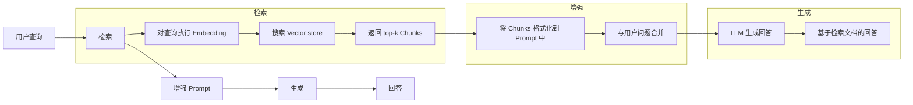
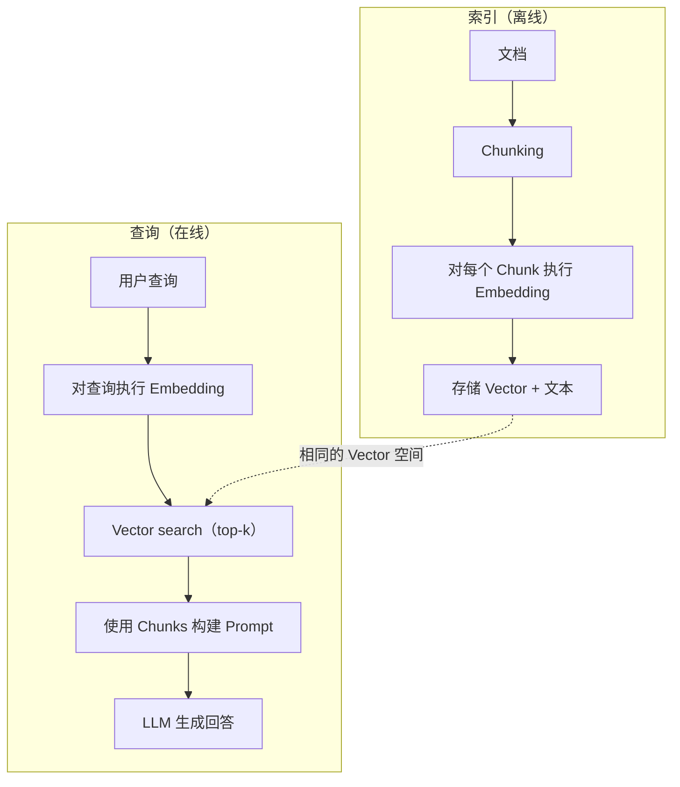

# RAG (Retrieval-Augmented Generation)

> 你的 LLM 掌握截至 Training 数据截止时间之前的一切，却对公司的文档、代码库或上周的会议记录一无所知。RAG 通过检索相关文档并将其填充到 Prompt 中解决了这个问题。它是生产 AI 中部署最广泛的模式。如果你只从这门课程中构建一个东西，就构建一条 RAG Pipeline。

**Type:** Build
**Languages:** Python
**Prerequisites:** Phase 10（从零构建 LLMs）、Phase 11 Lessons 01-05
**Time:** ~90 分钟
**Related:** Phase 5 · 23（RAG 的 Chunking 策略），介绍六种 Chunking 算法及各自适用的场景。Phase 5 · 22（深入理解 Embedding Model），介绍如何选择 Embedder。Phase 11 · 07（高级 RAG），介绍 Hybrid Search、Reranking 和 Query Transformation。

## 学习目标

- 构建完整的 RAG Pipeline：文档加载、Chunking、Embedding、Vector 存储、检索和生成
- 使用 Vector database（ChromaDB、FAISS 或 Pinecone）和正确的索引实现 Semantic Search
- 解释在基于知识的应用中，为什么 RAG 优于 Fine-tuning（成本、时效性和来源归因）
- 使用检索指标（Precision、Recall）和生成指标（Faithfulness、Relevance）评估 RAG 质量

## 问题

你为公司构建了一个 Chatbot。客户询问：“企业套餐的退款政策是什么？”LLM 给出了一个关于典型 SaaS 退款政策的笼统回答。但埋藏在 200 页内部 Wiki 中的真实政策规定，企业客户拥有 60 天退款期，并按比例获得退款。LLM 从未见过这份文档。它不可能知道 Training 中没有出现过的内容。

Fine-tuning 是一种解决方案。获取 LLM，使用内部文档对它进行 Training，然后部署更新后的 Model。这种方法有效，但存在严重问题。Fine-tuning 的计算成本高达数千美元。文档一旦发生变化，Model 就会立即过时。你无法知道 Model 的回答来自哪个来源。如果公司下个月收购了另一条产品线，你还要再次进行 Fine-tuning。

RAG 是另一种解决方案。保持 Model 不变。当问题到来时，在文档存储中搜索相关段落，将它们粘贴到问题之前的 Prompt 中，再让 Model 使用这些段落作为 Context 生成回答。文档存储可以在几分钟内完成更新。你可以准确看到检索到了哪些文档。Model 本身始终不变。这正是 RAG 成为生产环境主流模式的原因：它成本更低、信息更新、更易审计，并且适用于任何 LLM。

## 概念

### RAG 模式

整个模式可以归纳为四个步骤：



查询 -> 检索 -> 增强 Prompt -> 生成。每个 RAG 系统都遵循这一模式。不同生产级 RAG 系统之间的区别，体现在每一步的具体实现中：如何进行 Chunking、如何执行 Embedding、如何搜索，以及如何构造 Prompt。

### 为什么 RAG 优于 Fine-tuning

| 关注点 | Fine-tuning | RAG |
|---------|------------|-----|
| 成本 | 每次 Training 运行 $1,000-$100,000+ | 每次查询 $0.01-$0.10（Embedding + LLM） |
| 时效性 | 在重新 Training 前始终过时 | 通过重新索引文档，几分钟内即可更新 |
| 可审计性 | 无法将回答追溯到来源 | 可以展示准确的检索段落 |
| Hallucination | 仍然可以自由产生 Hallucination | 回答基于检索到的文档 |
| 数据隐私 | Training 数据被固化到权重中 | 文档保留在你的 Vector store 中 |

Fine-tuning 会永久改变 Model 的权重。RAG 则临时改变 Model 的 Context。对于大多数应用，临时 Context 正是你需要的。

Fine-tuning 唯一更有优势的场景是：你需要 Model 采用一种仅通过 Prompt 无法实现的特定风格、语气或推理模式。对于事实知识检索，RAG 始终更合适。

### Embedding Model

Embedding Model 将文本转换为稠密 Vector。含义相似的文本会在这个高维空间中生成彼此接近的 Vector。“How do I reset my password?”和“I need to change my password”虽然只有少数相同词语，却会产生几乎相同的 Vector。“The cat sat on the mat”则会产生非常不同的 Vector。

常见的 Embedding Model（2026 年阵容，完整分析参见 Phase 5 · 22）：

| Model | 维度 | 提供商 | 说明 |
|-------|-----------|----------|-------|
| text-embedding-3-small | 1536（Matryoshka） | OpenAI | 适用于大多数用例的最佳性价比选择 |
| text-embedding-3-large | 3072（Matryoshka） | OpenAI | 准确率更高，可截断至 256/512/1024 |
| Gemini Embedding 2 | 3072（Matryoshka） | Google | 顶级 MTEB 检索表现；8K Context |
| voyage-4 | 1024/2048（Matryoshka） | Voyage AI | 提供领域变体（代码、金融、法律） |
| Cohere embed-v4 | 1024（Matryoshka） | Cohere | 强大的多语言能力，128K Context |
| BGE-M3 | 1024（dense + sparse + ColBERT） | BAAI（open-weight） | 一个 Model 提供三种视图 |
| Qwen3-Embedding | 4096（Matryoshka） | Alibaba（open-weight） | 顶级 open-weight 检索得分 |
| all-MiniLM-L6-v2 | 384 | Open-weight（Sentence Transformers） | 原型开发基线 |

在本课中，我们将使用 TF-IDF 构建自己的简单 Embedding。并不是因为生产系统使用 TF-IDF，而是因为它能让概念变得具体：输入文本，输出一个 Vector，相似文本产生相似 Vector。

### Vector 相似度

给定两个 Vector，如何衡量它们的相似度？有三种选择：

**Cosine similarity**：两个 Vector 夹角的余弦值。范围从 -1（方向相反）到 1（完全相同）。它忽略大小，只关注方向。这是 RAG 的默认选择。

```
cosine_sim(a, b) = dot(a, b) / (||a|| * ||b||)
```

**Dot Product**：原始内积。较大的 Vector 会获得更高分数。当大小携带信息时很有用，例如较长的文档可能更相关。

```
dot(a, b) = sum(a_i * b_i)
```

**L2（Euclidean）distance**：Vector 空间中的直线距离。距离越小，表示越相似。它对大小差异比较敏感。

```
L2(a, b) = sqrt(sum((a_i - b_i)^2))
```

Cosine similarity 是标准选择。它通过按大小归一化，可以妥善处理长度不同的文档。当有人提到“Vector search”时，几乎总是在指 Cosine similarity。

### Chunking 策略

文档通常太长，无法作为单个 Vector 执行 Embedding。一份 50 页的 PDF 可能包含数十个主题，因此会产生质量很差的 Embedding。你应该把文档拆分成 Chunks，并分别对每个 Chunk 执行 Embedding。

**Fixed-size chunking**：每 N 个 Token 拆分一次。简单且可预测。一个包含 512 个 Token、重叠 50 个 Token 的 Chunk，意味着 Chunk 1 包含 Token 0-511，Chunk 2 包含 Token 462-973，以此类推。重叠可以避免在不恰当的边界处切断句子。

**Semantic chunking**：在自然边界处拆分，例如段落、章节或 Markdown 标题。每个 Chunk 都是语义连贯的单元。实现起来更复杂，但检索效果更好。

**Recursive chunking**：首先尝试在最大的边界处拆分，例如章节标题。如果某个章节仍然太大，就在段落边界处拆分。如果某个段落仍然太大，则在句子边界处拆分。这是 LangChain RecursiveCharacterTextSplitter 采用的方法，实践效果很好。

Chunk 大小比人们想象的更重要：

- 太小（64-128 个 Token）：每个 Chunk 缺少 Context。如果不知道“它”指代什么，“它上个季度增长了 15%”就毫无意义。
- 太大（2048+ 个 Token）：每个 Chunk 涵盖多个主题，削弱了相关性。当你搜索收入数据时，得到的 Chunk 可能只有 10% 与收入有关，其余 90% 都在讨论员工数量。
- 理想范围（256-512 个 Token）：既有足够的 Context 可以独立理解，又足够聚焦，能够保持相关性。

大多数生产级 RAG 系统使用 256-512 个 Token 的 Chunk，并设置 50 个 Token 的重叠。Anthropic 的 RAG 指南推荐使用这一范围。

### Vector database

获得 Embedding 后，你需要一个存储和搜索它们的位置。可选方案包括：

| Database | 类型 | 最适合 |
|----------|------|----------|
| FAISS | Library（进程内） | 原型开发、中小型 Dataset |
| Chroma | 轻量级 DB | 本地开发、小规模部署 |
| Pinecone | 托管服务 | 不希望承担运维开销的生产环境 |
| Weaviate | 开源 DB | 自托管生产环境 |
| pgvector | Postgres 扩展 | 已经在使用 Postgres |
| Qdrant | 开源 DB | 高性能自托管 |

在本课中，我们将构建一个简单的内存 Vector store。它把 Vector 存储在列表中，并通过暴力计算执行 Cosine similarity 搜索。这相当于使用平面索引的 FAISS。在速度开始变慢前，它大约可以扩展到 100,000 个 Vector。生产系统使用 HNSW 等 Approximate Nearest Neighbor（ANN）算法，可以在毫秒内搜索数百万个 Vector。

### 完整 Pipeline



索引阶段会针对每份文档运行一次，或在文档更新时运行。查询阶段会在每次用户请求时运行。在生产环境中，索引过程可能需要数小时来处理数百万份文档。查询则必须在一秒内响应。

### 实际参数

大多数生产级 RAG 系统使用以下参数：

- 每次查询检索 **k = 5 到 10** 个 Chunks
- **Chunk 大小 = 256 到 512 个 Token**，重叠 50 个 Token
- **Context 预算**：每次查询包含 2,500-5,000 个 Token 的检索内容
- **Prompt 总长度**：约 8,000-16,000 个 Token（System Prompt + 检索 Chunks + 对话历史 + 用户查询）
- **Embedding 维度**：根据 Model 不同，范围为 384-3072
- **索引吞吐量**：使用 API Embedding 时，每秒处理 100-1,000 份文档
- **查询延迟**：检索耗时 50-200ms，生成耗时 500-3000ms

```figure
rag-chunking
```

## 构建它

### 第 1 步：文档 Chunking

```python
def chunk_text(text, chunk_size=200, overlap=50):
    words = text.split()
    chunks = []
    start = 0
    while start < len(words):
        end = start + chunk_size
        chunk = " ".join(words[start:end])
        chunks.append(chunk)
        start += chunk_size - overlap
    return chunks
```

### 第 2 步：TF-IDF Embedding

我们将构建一个简单的 Embedding 函数。TF-IDF（Term Frequency-Inverse Document Frequency）并不是 Neural Embedding，但它可以将文本转换为 Vector，并捕捉词语的重要程度。文档中频繁出现的词会获得更高的 TF。整个语料库中较少出现的词会获得更高的 IDF。两者相乘后得到一个 Vector，其中重要且具有区分度的词拥有较高数值。

```python
import math
from collections import Counter

def build_vocabulary(documents):
    vocab = set()
    for doc in documents:
        vocab.update(doc.lower().split())
    return sorted(vocab)

def compute_tf(text, vocab):
    words = text.lower().split()
    count = Counter(words)
    total = len(words)
    return [count.get(word, 0) / total for word in vocab]

def compute_idf(documents, vocab):
    n = len(documents)
    idf = []
    for word in vocab:
        doc_count = sum(1 for doc in documents if word in doc.lower().split())
        idf.append(math.log((n + 1) / (doc_count + 1)) + 1)
    return idf

def tfidf_embed(text, vocab, idf):
    tf = compute_tf(text, vocab)
    return [t * i for t, i in zip(tf, idf)]
```

### 第 3 步：Cosine similarity 搜索

```python
def cosine_similarity(a, b):
    dot = sum(x * y for x, y in zip(a, b))
    norm_a = math.sqrt(sum(x * x for x in a))
    norm_b = math.sqrt(sum(x * x for x in b))
    if norm_a == 0 or norm_b == 0:
        return 0.0
    return dot / (norm_a * norm_b)

def search(query_embedding, stored_embeddings, top_k=5):
    scores = []
    for i, emb in enumerate(stored_embeddings):
        sim = cosine_similarity(query_embedding, emb)
        scores.append((i, sim))
    scores.sort(key=lambda x: x[1], reverse=True)
    return scores[:top_k]
```

### 第 4 步：构造 Prompt

RAG 中的“Augmented”就发生在这里。获取检索到的 Chunks，将它们格式化到 Prompt 中，并要求 LLM 根据提供的 Context 回答问题。

```python
def build_rag_prompt(query, retrieved_chunks):
    context = "\n\n---\n\n".join(
        f"[来源 {i+1}]\n{chunk}"
        for i, chunk in enumerate(retrieved_chunks)
    )
    return f"""只能根据以下 Context 回答问题。
如果 Context 未包含足够的信息，请回答“我没有足够的信息来回答这个问题。”

Context：
{context}

问题：{query}

回答："""
```

### 第 5 步：完整的 RAG Pipeline

```python
class RAGPipeline:
    def __init__(self):
        self.chunks = []
        self.embeddings = []
        self.vocab = []
        self.idf = []

    def index(self, documents):
        all_chunks = []
        for doc in documents:
            all_chunks.extend(chunk_text(doc))
        self.chunks = all_chunks
        self.vocab = build_vocabulary(all_chunks)
        self.idf = compute_idf(all_chunks, self.vocab)
        self.embeddings = [
            tfidf_embed(chunk, self.vocab, self.idf)
            for chunk in all_chunks
        ]

    def query(self, question, top_k=5):
        query_emb = tfidf_embed(question, self.vocab, self.idf)
        results = search(query_emb, self.embeddings, top_k)
        retrieved = [(self.chunks[i], score) for i, score in results]
        prompt = build_rag_prompt(
            question, [chunk for chunk, _ in retrieved]
        )
        return prompt, retrieved
```

### 第 6 步：生成（模拟）

在生产环境中，你会在这里调用 LLM API。在本课中，我们通过从检索到的 Context 中提取最相关的句子来模拟生成过程。

```python
def simple_generate(prompt, retrieved_chunks):
    query_words = set(prompt.lower().split("问题：")[-1].split())
    best_sentence = ""
    best_score = 0
    for chunk in retrieved_chunks:
        for sentence in chunk.split("."):
            sentence = sentence.strip()
            if not sentence:
                continue
            words = set(sentence.lower().split())
            overlap = len(query_words & words)
            if overlap > best_score:
                best_score = overlap
                best_sentence = sentence
    return best_sentence if best_sentence else "我没有足够的信息。"
```

## 使用它

使用真正的 Embedding Model 和 LLM 时，代码几乎不需要改变：

```python
from openai import OpenAI

client = OpenAI()

def embed(text):
    response = client.embeddings.create(
        model="text-embedding-3-small",
        input=text
    )
    return response.data[0].embedding

def generate(prompt):
    response = client.chat.completions.create(
        model="gpt-4o-mini",
        messages=[{"role": "user", "content": prompt}],
        temperature=0
    )
    return response.choices[0].message.content
```

或者使用 Anthropic：

```python
import anthropic

client = anthropic.Anthropic()

def generate(prompt):
    response = client.messages.create(
        model="claude-sonnet-5",
        max_tokens=1024,
        messages=[{"role": "user", "content": prompt}]
    )
    return response.content[0].text
```

Pipeline 保持不变。替换 Embedding 函数。替换生成函数。无论使用哪种 Model，检索逻辑、Chunking 和 Prompt 构造都完全相同。

对于大规模 Vector 存储，可以使用真正的 Vector database 替换暴力搜索：

```python
import chromadb

client = chromadb.Client()
collection = client.create_collection("my_docs")

collection.add(
    documents=chunks,
    ids=[f"chunk_{i}" for i in range(len(chunks))]
)

results = collection.query(
    query_texts=["退款政策是什么？"],
    n_results=5
)
```

Chroma 会在内部处理 Embedding（默认使用 all-MiniLM-L6-v2），并将 Vector 存储在本地 Database 中。模式相同，底层实现不同。

## 交付它

本课产出：
- `outputs/prompt-rag-architect.md` -- 一个用于针对特定用例设计 RAG 系统的 Prompt
- `outputs/skill-rag-pipeline.md` -- 一个教 Agent 如何构建和调试 RAG Pipeline 的 Skill

## 练习

1. 使用简单的 Bag of Words 方法替换 TF-IDF Embedding（二进制表示：词语存在时为 1，否则为 0）。比较它们在示例文档上的检索质量。TF-IDF 应该表现更好，因为它会为稀有词赋予更高权重。

2. 尝试不同的 Chunk 大小：在同一组文档上分别使用 50、100、200 和 500 个词。对于每种大小，运行相同的 5 个查询，并统计有多少查询能够在 top-3 中返回相关 Chunk。找出检索质量最高的理想范围。

3. 为每个 Chunk 添加 Metadata（来源文档名称、Chunk 位置）。修改 Prompt 模板以加入来源归因，让 LLM 引用信息来源。

4. 实现一个简单的 Evaluation：给定 10 组问答，将每个问题传入 RAG Pipeline，并测量检索到的 Chunks 中包含答案的比例。这就是 k 值下的 Retrieval Recall。

5. 构建支持对话感知的 RAG Pipeline：维护最近 3 轮对话历史，并将其与检索到的 Chunks 一同加入 Prompt。在询问定价后，使用“企业套餐呢？”这样的后续问题进行测试。

## 关键术语

| 术语 | 人们常说的含义 | 它的实际含义 |
|------|----------------|----------------------|
| RAG | “能够读取你文档的 AI” | 检索相关文档，将其粘贴到 Prompt 中，然后生成基于这些文档的回答 |
| Embedding | “把文本转换成数字” | 文本的稠密 Vector 表示；含义相似的文本会产生相似的 Vector |
| Vector database | “AI 的搜索引擎” | 一种针对存储 Vector 和按相似度查找 Nearest Neighbor 进行优化的数据存储 |
| Chunking | “把文档拆成小块” | 将文档拆分为较小的片段（通常为 256-512 个 Token），让每个片段可以独立执行 Embedding 和检索 |
| Cosine similarity | “两个 Vector 有多相似” | 两个 Vector 夹角的余弦值；1 = 方向相同，0 = 正交，-1 = 方向相反 |
| Top-k retrieval | “获取最佳的 k 个匹配项” | 从 Vector store 中返回与查询最相似的 k 个 Chunks |
| Context window | “LLM 能看到多少文本” | LLM 在单次请求中可以处理的最大 Token 数；检索到的 Chunks 必须能够放入这个范围 |
| Augmented generation | “使用给定的 Context 回答” | 使用检索到的文档作为 Context 生成响应，而不是仅依赖 Training 中获得的知识 |
| TF-IDF | “词语重要性评分” | Term Frequency 乘以 Inverse Document Frequency；根据词语在语料库中的区分度为其赋予权重 |
| Indexing | “为搜索准备文档” | 对文档执行 Chunking、Embedding 和存储的离线过程，使它们能够在查询时被搜索 |

## 延伸阅读

- Lewis 等人，《Retrieval-Augmented Generation for Knowledge-Intensive NLP Tasks》（2020）-- Facebook AI Research 最初提出 RAG 的论文，正式定义了先检索再生成的模式
- Anthropic 的 RAG 文档（docs.anthropic.com）-- 关于 Chunk 大小、Prompt 构造和 Evaluation 的实用指南
- Pinecone Learning Center，《What is RAG?》-- 结合生产环境注意事项，对 RAG Pipeline 进行清晰的可视化讲解
- Sentence-BERT：Reimers 与 Gurevych（2019）-- all-MiniLM Embedding Model 背后的论文，介绍如何针对 Semantic Similarity 训练 Bi-encoder
- [Karpukhin 等人，《Dense Passage Retrieval for Open-Domain Question Answering》（EMNLP 2020）](https://arxiv.org/abs/2004.04906) -- DPR 论文证明了 Dense Bi-encoder Retrieval 在 Open-domain QA 上优于 BM25，并为现代 RAG Retriever 奠定了模式。
- [LlamaIndex High-Level Concepts](https://docs.llamaindex.ai/en/stable/getting_started/concepts.html) -- 构建 RAG Pipeline 时需要了解的主要概念：Data Loader、Node Parser、Index、Retriever 和 Response Synthesizer。
- [LangChain RAG 教程](https://python.langchain.com/docs/tutorials/rag/) -- 另一种风格的 Orchestrator；从 Chain of Runnables 的视角理解相同的先检索再生成模式。
