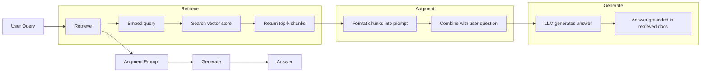
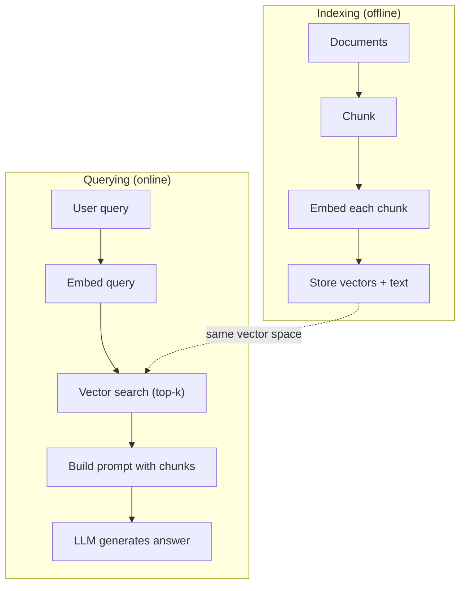

# RAG (Retrieval-Augmented Generation)

> 你的 LLM 了解其训练截止时间之前的一切。它不了解你公司的文档、你的代码库，也不了解上周的会议记录。RAG 通过检索相关文档并将它们塞入 prompt 来解决这个问题。它是生产环境中部署最广泛的 AI 模式。如果你只从这门课程中构建一个东西，那就构建一个 RAG pipeline。

**Type:** Build
**Languages:** Python
**Prerequisites:** Phase 10 (LLMs from Scratch), Phase 11 Lessons 01-05
**Time:** ~90 minutes
**Related:** Phase 5 · 23 (Chunking Strategies for RAG) 讲解六种 chunking 算法以及各自适用的场景。Phase 5 · 22 (Embedding Models Deep Dive) 讲解如何选择 embedder。Phase 11 · 07 (Advanced RAG) 讲解 hybrid search、reranking 和 query transformation。

## 学习目标
- 构建完整的 RAG pipeline：document loading、chunking、embedding、vector storage、retrieval 和 generation
- 使用 vector database（ChromaDB、FAISS 或 Pinecone）并配合合适的 indexing，实现 semantic search
- 解释为什么在 knowledge-grounded 应用中 RAG 优于 fine-tuning（成本、新鲜度、可归因性）
- 使用 retrieval metrics（precision、recall）和 generation metrics（faithfulness、relevance）评估 RAG 质量

## 问题
你为公司构建了一个 chatbot。客户问：“企业方案的退款政策是什么？”LLM 给出了一个关于典型 SaaS 退款政策的泛泛回答。而实际政策埋在一份 200 页的内部 wiki 中，规定企业客户有 60 天窗口，并可按比例退款。LLM 从未见过这份文档。它不可能知道训练中没有出现过的内容。

Fine-tuning 是一种解决方案。拿这个 LLM，用你的内部文档训练它，然后部署更新后的模型。这可行，但有严重问题。Fine-tuning 的 compute 成本可能高达数千美元。文档一旦变更，模型立刻过时。你无法知道模型的回答来自哪个 source。而如果公司下个月收购了另一条产品线，你还要再次 fine-tune。

RAG 是另一种解决方案。保持模型不变。当问题进来时，在你的 document store 中搜索相关 passages，把它们粘贴到问题前面的 prompt 中，让模型基于这些 passages 作为 context 来回答。document store 可以在几分钟内更新。你可以清楚看到具体检索到了哪些文档。模型本身永远不变。这就是 RAG 成为生产环境主流模式的原因：它更便宜、更新鲜、更可审计，并且适用于任何 LLM。

## 概念
### The RAG Pattern

整个模式可以概括为四步：



Query -> Retrieve -> Augment prompt -> Generate。每个 RAG 系统都遵循这个模式。生产级 RAG 系统之间的差异体现在每一步的细节中：如何 chunk、如何 embed、如何 search，以及如何构造 prompt。

### Why RAG Beats Fine-Tuning

| Concern | Fine-tuning | RAG |
|---------|------------|-----|
| 成本 | 每次 training run 需要 $1,000-$100,000+ | 每次 query 约 $0.01-$0.10（embedding + LLM） |
| 新鲜度 | 重新训练前一直过时 | 通过重新 indexing docs，可在几分钟内更新 |
| 可审计性 | 无法追踪 answer 到 source | 可以展示准确检索到的 passages |
| Hallucination | 仍然会自由 hallucinate | 基于检索到的 documents |
| 数据隐私 | training data 被烘焙进 weights | documents 留在你的 vector store 中 |

Fine-tuning 会永久改变模型的 weights。RAG 会临时改变模型的 context。对大多数应用来说，临时 context 才是你想要的。

Fine-tuning 胜出的唯一场景：你需要模型采用某种特定风格、语气或推理模式，而这些无法仅通过 prompting 实现。对于事实性知识检索，RAG 每次都胜出。

### Embedding Models

Embedding model 会把文本转换成 dense vector。相似文本会在这个高维空间中产生彼此接近的 vectors。“How do I reset my password?” 和 “I need to change my password” 尽管共享的词很少，却会产生几乎相同的 vectors。“The cat sat on the mat” 则会产生非常不同的 vector。

常见 embedding models（2026 阵容 —— 完整分析见 Phase 5 · 22）：

| Model | Dimensions | Provider | Notes |
|-------|-----------|----------|-------|
| text-embedding-3-small | 1536 (Matryoshka) | OpenAI | 适合大多数用例的最佳性价比 |
| text-embedding-3-large | 3072 (Matryoshka) | OpenAI | 更高准确率，可截断到 256/512/1024 |
| Gemini Embedding 2 | 3072 (Matryoshka) | Google | 顶级 MTEB retrieval；8K context |
| voyage-4 | 1024/2048 (Matryoshka) | Voyage AI | 领域变体（code、finance、law） |
| Cohere embed-v4 | 1024 (Matryoshka) | Cohere | 强 multilingual，128K context |
| BGE-M3 | 1024 (dense + sparse + ColBERT) | BAAI (open-weight) | 一个模型提供三种视图 |
| Qwen3-Embedding | 4096 (Matryoshka) | Alibaba (open-weight) | 顶级 open-weight retrieval score |
| all-MiniLM-L6-v2 | 384 | Open-weight (Sentence Transformers) | prototyping baseline |

在本课中，我们会使用 TF-IDF 构建自己的简单 embedding。不是因为 TF-IDF 是生产系统会使用的方案，而是因为它让概念变得具体：文本输入，vector 输出，相似文本产生相似 vectors。

### Vector Similarity

给定两个 vectors，如何衡量相似度？有三种选择：

**Cosine similarity**：两个 vectors 之间夹角的余弦值。范围从 -1（相反）到 1（完全相同）。忽略 magnitude，只关注 direction。这是 RAG 的默认选择。

```
cosine_sim(a, b) = dot(a, b) / (||a|| * ||b||)
```

**Dot product**：原始 inner product。更大的 vectors 会得到更高分数。当 magnitude 携带信息时有用（更长的 documents 可能更相关）。

```
dot(a, b) = sum(a_i * b_i)
```

**L2 (Euclidean) distance**：vector space 中的直线距离。距离越小 = 越相似。对 magnitude 差异敏感。

```
L2(a, b) = sqrt(sum((a_i - b_i)^2))
```

Cosine similarity 是标准选择。它通过 magnitude 归一化，能优雅处理不同长度的 documents。当有人说 “vector search” 时，几乎总是在指 cosine similarity。

### Chunking Strategies

Documents 太长，不能作为单个 vectors 来 embed。一份 50 页 PDF 可能会产生很糟糕的 embedding，因为它包含几十个主题。相反，你应该把 documents 拆成 chunks，并分别 embed 每个 chunk。

**Fixed-size chunking**：每 N 个 tokens 拆分一次。简单且可预测。一个 512-token chunk 配合 50-token overlap，意味着 chunk 1 是 tokens 0-511，chunk 2 是 tokens 462-973，以此类推。overlap 确保你不会在不走运的边界处切断句子。

**Semantic chunking**：在自然边界处拆分。段落、章节或 markdown headers。每个 chunk 都是一个语义连贯的单元。实现更复杂，但 retrieval 效果更好。

**Recursive chunking**：先尝试在最大边界处拆分（section headers）。如果某个 section 仍然太大，就按 paragraph boundaries 拆分。如果某个 paragraph 仍然太大，就按 sentence boundaries 拆分。这是 LangChain RecursiveCharacterTextSplitter 的方法，在实践中效果很好。

Chunk size 比人们想象的更重要：

- 太小（64-128 tokens）：每个 chunk 缺乏 context。“It increased 15% last quarter” 如果不知道 “it” 指什么，就没有意义。
- 太大（2048+ tokens）：每个 chunk 覆盖多个主题，稀释 relevance。当你搜索 revenue data 时，得到的是一个 10% 关于 revenue、90% 关于 headcount 的 chunk。
- 理想范围（256-512 tokens）：context 足够自包含，同时足够聚焦以保持相关性。

大多数生产级 RAG 系统使用 256-512 token chunks，并配 50-token overlap。Anthropic 的 RAG 指南推荐这个范围。

### Vector Databases

一旦有了 embeddings，你就需要地方来存储和搜索它们。选项包括：

| Database | Type | Best for |
|----------|------|----------|
| FAISS | Library (in-process) | Prototyping，中小型 datasets |
| Chroma | Lightweight DB | 本地开发，小型部署 |
| Pinecone | Managed service | 无需运维负担的生产环境 |
| Weaviate | Open source DB | 自托管生产环境 |
| pgvector | Postgres extension | 已经在使用 Postgres |
| Qdrant | Open source DB | 高性能自托管 |

在本课中，我们会构建一个简单的 in-memory vector store。它把 vectors 存在 list 中，并执行 brute-force cosine similarity search。这等价于使用 flat index 的 FAISS。它在变慢之前大约可以扩展到 100,000 个 vectors。生产系统使用 HNSW 这类 approximate nearest neighbor (ANN) 算法，在毫秒级搜索数百万个 vectors。

### The Full Pipeline



indexing 阶段对每个 document 运行一次（或在 documents 更新时运行）。querying 阶段在每次用户请求时运行。在生产环境中，indexing 可能需要在数小时内处理数百万 documents。querying 必须在一秒内响应。

### Real Numbers

大多数生产级 RAG 系统使用这些参数：

- **k = 5 to 10**：每次 query 检索的 chunks 数量
- **Chunk size = 256 to 512 tokens**，并配 50-token overlap
- **Context budget**：每次 query 使用 2,500-5,000 tokens 的 retrieved content
- **Total prompt**：约 8,000-16,000 tokens（system prompt + retrieved chunks + conversation history + user query）
- **Embedding dimension**：384-3072，取决于 model
- **Indexing throughput**：使用 API embeddings 时每秒 100-1,000 documents
- **Query latency**：retrieval 50-200ms，generation 500-3000ms

## 构建它
### 步骤 1： Document Chunking

```python
def chunk_text(text, chunk_size=200, overlap=50):
    words = text.split()
    chunks = []
    start = 0
    while start < len(words):
        end = start + chunk_size
        chunk = " ".join(words[start:end])
        chunks.append(chunk)
        start += chunk_size - overlap
    return chunks
```

### 步骤 2： TF-IDF Embeddings

我们构建一个简单的 embedding function。TF-IDF（Term Frequency-Inverse Document Frequency）不是 neural embedding，但它会以能捕捉词语重要性的方式把文本转换为 vectors。某个 document 中频繁出现的词会获得更高 TF。在整个 corpus 中罕见的词会获得更高 IDF。二者相乘得到一个 vector，其中重要且有区分度的词具有较高值。

```python
import math
from collections import Counter

def build_vocabulary(documents):
    vocab = set()
    for doc in documents:
        vocab.update(doc.lower().split())
    return sorted(vocab)

def compute_tf(text, vocab):
    words = text.lower().split()
    count = Counter(words)
    total = len(words)
    return [count.get(word, 0) / total for word in vocab]

def compute_idf(documents, vocab):
    n = len(documents)
    idf = []
    for word in vocab:
        doc_count = sum(1 for doc in documents if word in doc.lower().split())
        idf.append(math.log((n + 1) / (doc_count + 1)) + 1)
    return idf

def tfidf_embed(text, vocab, idf):
    tf = compute_tf(text, vocab)
    return [t * i for t, i in zip(tf, idf)]
```

### 步骤 3： Cosine Similarity Search

```python
def cosine_similarity(a, b):
    dot = sum(x * y for x, y in zip(a, b))
    norm_a = math.sqrt(sum(x * x for x in a))
    norm_b = math.sqrt(sum(x * x for x in b))
    if norm_a == 0 or norm_b == 0:
        return 0.0
    return dot / (norm_a * norm_b)

def search(query_embedding, stored_embeddings, top_k=5):
    scores = []
    for i, emb in enumerate(stored_embeddings):
        sim = cosine_similarity(query_embedding, emb)
        scores.append((i, sim))
    scores.sort(key=lambda x: x[1], reverse=True)
    return scores[:top_k]
```

### 步骤 4： Prompt Construction

这就是 RAG 中 “augmented” 发生的地方。取出检索到的 chunks，把它们格式化进 prompt，然后要求 LLM 基于给定 context 回答。

```python
def build_rag_prompt(query, retrieved_chunks):
    context = "\n\n---\n\n".join(
        f"[Source {i+1}]\n{chunk}"
        for i, chunk in enumerate(retrieved_chunks)
    )
    return f"""Answer the question based ONLY on the following context.
If the context doesn't contain enough information, say "I don't have enough information to answer that."

Context:
{context}

Question: {query}

Answer:"""
```

### 步骤 5： The Complete RAG Pipeline

```python
class RAGPipeline:
    def __init__(self):
        self.chunks = []
        self.embeddings = []
        self.vocab = []
        self.idf = []

    def index(self, documents):
        all_chunks = []
        for doc in documents:
            all_chunks.extend(chunk_text(doc))
        self.chunks = all_chunks
        self.vocab = build_vocabulary(all_chunks)
        self.idf = compute_idf(all_chunks, self.vocab)
        self.embeddings = [
            tfidf_embed(chunk, self.vocab, self.idf)
            for chunk in all_chunks
        ]

    def query(self, question, top_k=5):
        query_emb = tfidf_embed(question, self.vocab, self.idf)
        results = search(query_emb, self.embeddings, top_k)
        retrieved = [(self.chunks[i], score) for i, score in results]
        prompt = build_rag_prompt(
            question, [chunk for chunk, _ in retrieved]
        )
        return prompt, retrieved
```

### 步骤 6： Generation (simulated)

在生产环境中，这里会调用 LLM API。在本课中，我们通过从检索到的 context 中提取最相关句子来模拟 generation。

```python
def simple_generate(prompt, retrieved_chunks):
    query_words = set(prompt.lower().split("question:")[-1].split())
    best_sentence = ""
    best_score = 0
    for chunk in retrieved_chunks:
        for sentence in chunk.split("."):
            sentence = sentence.strip()
            if not sentence:
                continue
            words = set(sentence.lower().split())
            overlap = len(query_words & words)
            if overlap > best_score:
                best_score = overlap
                best_sentence = sentence
    return best_sentence if best_sentence else "I don't have enough information."
```

## 使用它
使用真实 embedding model 和 LLM 时，代码几乎不变：

```python
from openai import OpenAI

client = OpenAI()

def embed(text):
    response = client.embeddings.create(
        model="text-embedding-3-small",
        input=text
    )
    return response.data[0].embedding

def generate(prompt):
    response = client.chat.completions.create(
        model="gpt-4o-mini",
        messages=[{"role": "user", "content": prompt}],
        temperature=0
    )
    return response.choices[0].message.content
```

或者使用 Anthropic：

```python
import anthropic

client = anthropic.Anthropic()

def generate(prompt):
    response = client.messages.create(
        model="claude-sonnet-4-20250514",
        max_tokens=1024,
        messages=[{"role": "user", "content": prompt}]
    )
    return response.content[0].text
```

pipeline 是一样的。替换 embedding function。替换 generation function。retrieval logic、chunking、prompt construction —— 无论你使用哪些 models，全部相同。

对于大规模 vector storage，用合适的 vector database 替换 brute-force search：

```python
import chromadb

client = chromadb.Client()
collection = client.create_collection("my_docs")

collection.add(
    documents=chunks,
    ids=[f"chunk_{i}" for i in range(len(chunks))]
)

results = collection.query(
    query_texts=["What is the refund policy?"],
    n_results=5
)
```

Chroma 会在内部处理 embedding（默认使用 all-MiniLM-L6-v2），并把 vectors 存储在本地数据库中。同样的模式，不同的管道实现。

## 交付它
本课会产出：
- `outputs/prompt-rag-architect.md` —— 一个用于为特定用例设计 RAG 系统的 prompt
- `outputs/skill-rag-pipeline.md` —— 一个教 agents 如何构建和调试 RAG pipelines 的 skill

## 练习
1. 用简单的 bag-of-words 方法替换 TF-IDF embeddings（二值：词存在则为 1，不存在则为 0）。在 sample documents 上比较 retrieval quality。TF-IDF 应该表现更好，因为它会给罕见词更高权重。

2. 试验不同 chunk sizes：在同一 document set 上尝试 50、100、200 和 500 words。对每个 size，运行相同的 5 个 queries，并统计有多少能在 top-3 中返回 relevant chunk。找到 retrieval quality 达到峰值的 sweet spot。

3. 为每个 chunk 添加 metadata（source document name、chunk position）。修改 prompt template 以包含 source attribution，让 LLM 引用其 sources。

4. 实现一个简单 evaluation：给定 10 个 question-answer pairs，让每个 question 通过 RAG pipeline，并衡量检索到的 chunks 中有多少比例包含 answer。这就是 retrieval recall at k。

5. 构建 conversation-aware RAG pipeline：维护最近 3 轮 exchanges 的 history，并将其与 retrieved chunks 一起包含在 prompt 中。用 follow-up questions 测试，例如在询问 pricing 后再问 “What about enterprise?”。

## 关键术语
| Term | What people say | What it actually means |
|------|----------------|----------------------|
| RAG | “能阅读你文档的 AI” | 检索相关 documents，把它们粘贴到 prompt 中，并生成一个基于这些 documents 的 answer |
| Embedding | “把文本转换成数字” | 文本的 dense vector representation，其中相似含义会产生相似 vectors |
| Vector database | “面向 AI 的搜索引擎” | 为存储 vectors 并按 similarity 找到 nearest neighbors 而优化的数据存储 |
| Chunking | “把 docs 拆成片段” | 将 documents 拆成更小的 segments（通常 256-512 tokens），以便每个 segment 可以独立 embed 和 retrieve |
| Cosine similarity | “两个 vectors 有多相似” | 两个 vectors 之间夹角的余弦值；1 = 方向相同，0 = 正交，-1 = 相反 |
| Top-k retrieval | “取 k 个最佳匹配” | 从 vector store 中返回与 query 最相似的 k 个 chunks |
| Context window | “LLM 能看到多少文本” | LLM 在单次请求中可以处理的最大 tokens 数；retrieved chunks 必须放入这个范围内 |
| Augmented generation | “使用给定 context 回答” | 使用检索到的 documents 作为 context 来生成响应，而不是仅依赖训练得到的知识 |
| TF-IDF | “词语重要性评分” | Term Frequency 乘以 Inverse Document Frequency；根据词语在 corpus 中的区分度为其加权 |
| Indexing | “为搜索准备 docs” | 离线执行 chunking、embedding 和 storing documents 的过程，使它们能在 query time 被搜索 |

## 延伸阅读
- Lewis et al., “Retrieval-Augmented Generation for Knowledge-Intensive NLP Tasks” (2020) —— Facebook AI Research 提出的原始 RAG 论文，形式化了 retrieve-then-generate 模式
- Anthropic 的 RAG documentation (docs.anthropic.com) —— 关于 chunk sizes、prompt construction 和 evaluation 的实践指南
- Pinecone Learning Center, “What is RAG?” —— 用清晰可视化解释 RAG pipeline，并包含生产环境考量
- Sentence-BERT: Reimers & Gurevych (2019) —— all-MiniLM embedding models 背后的论文，展示如何为 semantic similarity 训练 bi-encoders
- [Karpukhin et al., “Dense Passage Retrieval for Open-Domain Question Answering” (EMNLP 2020)](https://arxiv.org/abs/2004.04906) —— DPR 论文，证明 dense bi-encoder retrieval 在 open-domain QA 上优于 BM25，并确立了现代 RAG retrievers 的模式。
- [LlamaIndex High-Level Concepts](https://docs.llamaindex.ai/en/stable/getting_started/concepts.html) —— 构建 RAG pipelines 时需要了解的主要概念：data loaders、node parsers、indices、retrievers、response synthesizers。
- [LangChain RAG tutorial](https://python.langchain.com/docs/tutorials/rag/) —— 另一种风格的 orchestrator；以 chain-of-runnables 视角理解同一个 retrieve-then-generate 模式。
